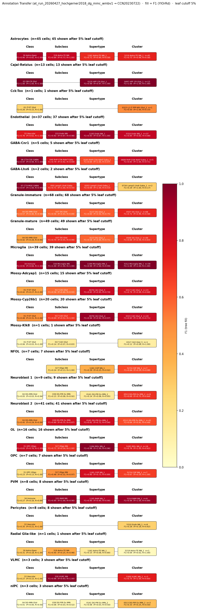

# Dentate Gyrus Mature Granule Neuron — Allen Brain Cell Atlas CCN202307220 Mapping Report
*2026-04-14 · Source: `/Users/do12/Documents/GitHub/BICAN_agentic_framework_planning/evidencell/kb/graphs/dentate_gyrus/20260414_dentate_gyrus_report_ingest.yaml`*

---

## Introduction

The dentate gyrus mature granule neuron is the terminally differentiated endpoint of the adult neurogenesis lineage in the dentate gyrus of the hippocampal formation [UBERON:0001885]. Mature granule neurons are glutamatergic principal cells of the granule cell layer that receive primary afferents from entorhinal cortex and send mossy-fibre axons to CA3 pyramidal cells and inhibitory interneurons [1][2][3]. They are classically distinguished from immature stages by loss of DCX/PSA-NCAM and gain of the calbindin/NeuN/Tbr1 protein signature [3][4]. Mapping this protein-defined terminal state onto WMBv1 transcriptomic clusters resolves how a single morphological-functional class is partitioned across topographic and neuropeptidergic atlas variants.

### Classical type table

| Property | Value | References |
|---|---|---|
| Soma location | granule cell layer (GCL) [UBERON:0001885] | — |
| NT | glutamatergic | [1], [2] |
| Defining markers | Calbindin, NeuN, Tbr1 | [3], [4] |
| Negative markers | DCX, Nestin, PSA-NCAM | — |
| CL term | dentate gyrus granule cell [[CL:2000089](https://www.ebi.ac.uk/ols4/ontologies/cl/classes?obo_id=CL:2000089)] (EXACT) | — |

Definition basis: CLASSICAL_MULTIMODAL. Tis21 expression decreases in mature granule cells compared to the maturing stage; no subtypes are discussed in this report.

Details — source evidence for classical type properties

- **NT type (glutamatergic):** classical neurotransmitter assignment · [1]
  > In the adult dentate gyrus, cells proliferate in the inner granule cell layer, and migrate radially outward as they differentiate (Zhao et al., 2006). New granule cells in hippocampal dentate gyrus receive primary glutamatergic afferents from entorhinal cortex and project axons to inhibitory interneurons and pyramidal cells of area CA3
  > — Stoll et al. 2014, Dentate Gyrus Immature Neurons · [1] <!-- quote_key: 8479504_1542ed61 -->
- **NT type (glutamatergic):** classical neurotransmitter assignment · [2]
  > new immature neurons are continuously produced and then migrate out to their respective target circuits, differentiating either into glutamatergic neurons (dentate gyrus) or into mostly GABAergic interneurons called granule cells in the olfactory bulb
  > — Vangeneugden et al. 2015, Olfactory Bulb Immature Neurons · [2] <!-- quote_key: 625292_ff3f8b1d -->
- **Calbindin / NeuN (defining markers, stage-6 terminal differentiation):** REVIEW · adult mouse DG · [3]
  > Neural stem cells (NSCs) progressively develop into proliferating neural progenitor cells (NPCs), designated as type-2a (Nestin + / Sox2 + ), type-2b cells (expressing Nestin and doublecortin: Nestin + /DCX + ) and neuroblasts (type-3, DCX + ) (Filippov et al., 2003) (Fukuda et al., 2003)(Kronenberg et al., 2003)(Steiner et al., 2006). Neuroblasts progress toward immature postmitotic granule neurons co-expressing DCX and NeuN (stage 5), and eventually become terminally differentiated neurons (stage 6) expressing calbindin and NeuN (Brandt et al., 2003)Steiner et al., 2004).
  > — Micheli et al. 2025, Dentate Gyrus Immature Neurons · [3] <!-- quote_key: 279046466_998847af -->
- **Tbr1 (postmitotic granule neuron TF):** EXPERIMENTAL · Tbr2-GFP transgene in adult mouse SGZ · [4]
  > Neurogenesis in the adult hippocampus is a highly regulated process that originates from multipotent progenitors in the subgranular zone (SGZ). Currently, little is known about molecular mechanisms that regulate proliferation and differentiation in the SGZ. To study the role of transcription factors (TFs), we focused on Tbr2 (T-box brain gene 2), which has been implicated previously in developmental glutamatergic neurogenesis. In adult mouse hippocampus, Tbr2 protein and Tbr2-GFP (green fluorescent protein) transgene expression were specifically localized to intermediate-stage progenitor cells (IPCs), a type of transit amplifying cells. The Tbr2+ IPCs were highly responsive to neurogenic stimuli, more than doubling after voluntary wheel running. Notably, the Tbr2+ IPCs formed cellular clusters, the average size of which (Tbr2+ cells per cluster) likewise more than doubled in runners. Conversely, Tbr2+ IPCs were selectively depleted by antimitotic drugs, known to suppress neurogenesis. After cessation of antimitotic treatment, recovery of neurogenesis was paralleled by recovery of Tbr2+ IPCs, including a transient rebound above baseline numbers. Finally, Tbr2 was examined in the context of additional TFs that, together, define a TF cascade in embryonic neocortical neurogenesis (Pax6 → Ngn2 → Tbr2 → NeuroD → Tbr1). Remarkably, the same TF cascade was found to be linked to stages of neuronal lineage progression in adult SGZ. These results suggest that Tbr2+ IPCs play a major role in the regulation of adult hippocampal neurogenesis, and that a similar transcriptional program controls neurogenesis in adult SGZ as in embryonic cerebral cortex.
  > — Hodge et al. 2008, Dentate Gyrus Immature Neurons · [4] <!-- quote_key: 15727849_56e1c8ef -->

Cell Ontology mapping: dentate gyrus granule cell [[CL:2000089](https://www.ebi.ac.uk/ols4/ontologies/cl/classes?obo_id=CL:2000089)] (EXACT).

---

## Results

Nine candidate atlas clusters across the WMBv1 DG Glut subclass were assessed; cluster 0506 DG Glut_2 [CS20230722_CLUS_0506] is the primary mapping at MODERATE confidence (TYPE_A_SPLITS), with the remaining eight DG Glut clusters [0502–0510 excluding 0506] all carrying LOW-confidence speculative edges to topographic / neuropeptidergic variants of the same classical type.

*F1 across taxonomy levels for the Hochgerner 2018 Granule-mature source group (n=1712, GSE95315) — the single source cell group relevant to this classical type. The mapping is cleanest at SUBCLASS 037 DG Glut (F1=0.711, group_purity=0.98) and SUPERTYPE 0137 DG Glut_2 (F1=0.611); at CLUSTER level 0506 DG Glut_2 dominates (F1=0.665, group_purity=0.833), with the remaining DG Glut clusters absorbing only a small remainder.*

### 4a. Mapping candidates overview

| Rank | WMBv1 cluster | Supertype | Cells (10x) | Confidence | Key property alignment | Verdict |
|---|---|---|---|---|---|---|
| 1 | 0506 DG Glut_2 [CS20230722_CLUS_0506] | — | not available | 🟡 MODERATE | NT CONSISTENT · soma DG do CONSISTENT · Calb1 mean 3.62 CONSISTENT | Best candidate |
| 2 | 0503 DG Glut_1 [CS20230722_CLUS_0503] | — | not available | 🔴 LOW | soma DG ve CONSISTENT · Calb1 mean 7.62 CONSISTENT | Speculative |
| 3 | 0507 DG Glut_2 [CS20230722_CLUS_0507] | — | not available | 🔴 LOW | soma DG do CONSISTENT · Calb1 mean 8.13 CONSISTENT | Speculative |
| 4 | 0502 DG Glut_1 [CS20230722_CLUS_0502] | — | not available | 🔴 LOW | soma DG ve CONSISTENT · Calb1 mean 4.82 CONSISTENT | Speculative |
| 5 | 0505 DG Glut_2 [CS20230722_CLUS_0505] | — | not available | 🔴 LOW | soma DG do CONSISTENT · Calb1 mean 5.54 CONSISTENT | Speculative |
| 6 | 0508 DG Glut_3 [CS20230722_CLUS_0508] | — | not available | 🔴 LOW | soma DG do CONSISTENT · Calb1 mean 7.70 CONSISTENT | Speculative |
| 7 | 0504 DG Glut_1 [CS20230722_CLUS_0504] | — | not available | 🔴 LOW | soma DG ve CONSISTENT · Calb1 mean 4.34 CONSISTENT | Speculative |
| 8 | 0510 DG Glut_4 [CS20230722_CLUS_0510] | — | not available | 🔴 LOW | soma DG po CONSISTENT · Calb1 mean 8.21 CONSISTENT | Speculative |
| 9 | 0509 DG Glut_3 [CS20230722_CLUS_0509] | — | not available | 🔴 LOW | soma DG do CONSISTENT · Calb1 mean 5.77 CONSISTENT | Speculative |

Total: 9 edges; relationship type TYPE_A_SPLITS across all (CL:2000089 is split across the nine DG Glut clusters representing topographic and neuropeptidergic variants).

### 4b. Property alignment — primary candidate (0506 DG Glut_2)

**Table 1 — Property comparison.**

| Property | Classical | Supertype | Best cluster | Alignment |
|---|---|---|---|---|
| NT type | glutamatergic | not available | Glut (Slc17a7/vGLUT1 nt_marker) [CS20230722_CLUS_0506] | CONSISTENT |
| Soma location | granule cell layer (GCL) [UBERON:0001885] | not available | DG do (dorsal outer GCL); HIP:0.99 [CS20230722_CLUS_0506] | CONSISTENT |
| Calbindin (Calb1) | PROTEIN positive (cardinal mature marker) | not available | Calb1 mean = 3.62 [CS20230722_CLUS_0506] | CONSISTENT |
| NeuN (Rbfox3) | PROTEIN positive (postmitotic) | not available | Rbfox3 mean = 0.25 [CS20230722_CLUS_0506] | APPROXIMATE |
| Tbr1 | PROTEIN positive (postmitotic TF) | not available | Tbr1 mean = 0.68 [CS20230722_CLUS_0506] | CONSISTENT |
| Sex ratio | not documented | not available | not assessed | NOT_ASSESSED |

*(Child-cluster breakdown not assessed — the classical type splits across nine clusters and per-cluster assessments are documented as separate LOW-confidence edges below. Best cluster by annotation transfer: CS20230722_CLUS_0506.)*

**Table 2 — Evidence support.**

| Evidence | Type | Supports | Headline | Source |
|---|---|---|---|---|
| Atlas DG Glut metadata (0506) | Atlas metadata | SUPPORT | Glis3/Neurod2/Prox1/St18; Cck; DG do HIP:0.99; composite 0.69 | atlas-internal |
| Micheli 2025 stage-6 definition | Literature | SUPPORT | DCX−/NeuN+/Calbindin+ defines mature stage | [3] |
| Hodge 2008 Tbr1 postmitotic | Literature | SUPPORT | Tbr1 confined to postmitotic granule cells | [4] |
| Hochgerner 2018 MapMyCells | Annotation transfer | SUPPORT | F1=0.665 cluster; F1=0.711 subclass | atlas-internal |

### 5. Candidate paragraphs

### 0506 DG Glut_2 · 🟡 MODERATE

**Supporting evidence**

- Atlas metadata places CS20230722_CLUS_0506 within the DG Glut subclass with core mature-granule TFs Glis3, Neurod2, Prox1, St18; neuropeptide Cck; soma DG do (dorsal outer GCL) at HIP:0.99; discovery composite score 0.69. Classical protein markers Calbindin/NeuN/Tbr1 are absent from atlas defining_markers — a protein-transcriptome gap — but precomputed-stats Calb1 mean = 3.62 and Tbr1 mean = 0.68 confirm mRNA presence.
- Literature support [3] establishes stage-6 mature identity as DCX−/NeuN+/Calbindin+; DG Glut clusters collectively represent this terminal state through presence of the mature TF core and absence of DCX/Eomes.
- Literature support [4] confirms Tbr1 marks terminally differentiated postmitotic granule cells, consistent with the Tbr1 mean = 0.68 observed in CS20230722_CLUS_0506.
- Annotation transfer (Hochgerner 2018 Granule-mature, GSE95315 → WMBv1) identifies CS20230722_CLUS_0506 as the best cluster-level target (F1=0.665, group_purity=0.833, target_purity=0.553). 83% of confident cluster-level cells from Hochgerner 2018 Granule-mature land in 0506, with strong upstream consistency at SUBCLASS 037 DG Glut (F1=0.711, group_purity=0.98) and SUPERTYPE 0137 DG Glut_2 (F1=0.611).

**Marker evidence provenance**

- **Calbindin (Calb1)**: classical evidence is protein IHC; mRNA-level cross-check via WMBv1 precomputed stats (Calb1 mean = 3.62) resolves the protein/transcriptome gap in favour of CONSISTENT. No atlas defining_markers entry, but the gene is detectably expressed.
- **NeuN (Rbfox3)**: classical evidence is nuclear protein IHC. Rbfox3 mRNA mean = 0.25 in CS20230722_CLUS_0506 is low — scRNA-seq sensitivity is below IHC for this transcript, so APPROXIMATE is retained rather than DISCORDANT. This is a methodological, not biological, mismatch.
- **Tbr1**: classical evidence is protein IHC (Hodge 2008, primary study with Tbr2-GFP transgenic targeting [4]). Tbr1 mean = 0.68 confirms low but detectable mRNA, consistent with a TF expressed in a sparse subset of postmitotic granule cells.

**Concerns**

- NeuN (Rbfox3) APPROXIMATE — protein/mRNA mismatch driven by scRNA-seq sensitivity rather than biological discordance (caveat type: MARKER_NOT_SPECIFIC).
- TYPE_A_SPLITS: CL:2000089 is split across nine DG Glut clusters (0502–0510) representing topographic variants (dorsal/ventral/posterior GCL) and neuropeptide/functional variants; CS20230722_CLUS_0506 alone covers only the DG do (dorsal outer GCL) subpopulation, not the full classical type (caveat type: DISTRIBUTED_ACROSS_CLUSTERS).
- Protein-defined classical markers (Calbindin, NeuN, Tbr1) and post-translational PSA-NCAM are not surfaced as atlas defining_markers because scRNA-seq cluster-marker selection filters out broadly expressed stage markers and cannot detect glycan epitopes.

**What would upgrade confidence**

- MERFISH or smFISH co-labelling for Calb1, Glis3, and Prox1 in adult mouse DG to confirm Calb1 expression within cells transcriptomically assigned to CS20230722_CLUS_0506 — resolves whether Calb1 mRNA is uniformly distributed across all DG Glut cells or enriched in the 0506 subset.
- IHC co-labelling of Calbindin protein with MERFISH-validated markers for the DG do (dorsal outer GCL) region to confirm spatial overlap.
- Cck/neuropeptide functional studies would clarify whether the neuropeptide profile defines a stable subtype or a transient activity-dependent state.

### 0503 DG Glut_1 · 🔴 LOW

**Supporting evidence**

- Atlas metadata: CS20230722_CLUS_0503 within DG Glut subclass; TF/MERFISH markers Glis3, Neurod2, Prox1, Hey2; neuropeptides Cck, Grp; soma DG ve (ventral GCL) at HIP:0.93; composite 0.68. Calb1 precomputed mean = 7.62 (very high) confirms cardinal mature-marker mRNA presence.
- Literature support [3] (stage-6 definition) and [4] (Tbr1 postmitotic) apply identically to this DG Glut cluster.

**Concerns**

- Annotation transfer NO_EVIDENCE: CS20230722_CLUS_0503 receives no Granule-mature cells above bootstrap threshold (F1=0.0); the dominant target is 0506. Annotation transfer does not independently confirm this edge.
- NeuN (Rbfox3 mean = 0.84) APPROXIMATE — same scRNA-seq sensitivity caveat.
- TYPE_A_SPLITS: this cluster covers only the DG ve (ventral GCL) subpopulation.

**What would upgrade confidence**

- A second annotation-transfer dataset sampling ventral DG specifically would test whether 0503 captures a ventral mature population missed by GSE95315.
- MERFISH/smFISH co-labelling for Calb1 + Hey2 in ventral DG to confirm spatial overlap.

### 0507 DG Glut_2 · 🔴 LOW

**Supporting evidence**

- Atlas metadata: Glis3, Neurod2, St18 TF core; neuropeptides Cck, Pdyn; soma DG do (dorsal outer GCL) at HIP:0.98; composite 0.67. Calb1 mean = 8.13 (very high) and Tbr1 mean = 1.44 confirm mature-marker mRNA.
- Literature [3], [4] as for the primary candidate.
- Annotation transfer PARTIAL: 7 Granule-mature cells map to 0507 (F1=0.068, group_purity=0.053) — weak but non-zero, consistent with overflow from the dominant 0506 target.

**Concerns**

- Very weak AT support; 0507 is not a dominant mapping target.
- NeuN (Rbfox3 mean = 0.17) APPROXIMATE.
- TYPE_A_SPLITS: only the DG do (dorsal outer GCL) Pdyn+ subpopulation.

**What would upgrade confidence**

- Higher-resolution AT with a Pdyn+ DG source group would test whether 0507 is the Pdyn-axis correlate of mature granule cells.

### 0502 DG Glut_1 · 🔴 LOW

**Supporting evidence**

- Atlas metadata: Glis3, Neurod2, Prox1, Rfx2, Lhx9; neuropeptides Grp, Cck; soma DG ve (ventral GCL) HIP:0.74; composite 0.64. Calb1 mean = 4.82, Tbr1 mean = 2.04 confirm mRNA presence.
- Literature [3], [4].

**Concerns**

- Annotation transfer NO_EVIDENCE: F1=0.0 for the Granule-mature source group.
- MERFISH_REGISTRATION_UNCERTAINTY: CCF broad annotation includes MEA and sAMY; ventral hippocampal registration is ambiguous, but the authoritative anatomical_location field specifies DG ve.
- NeuN APPROXIMATE; TYPE_A_SPLITS as above.

**What would upgrade confidence**

- Ventral-DG-targeted AT or spatial validation of Lhx9 + Calb1 co-expression.

### 0505 DG Glut_2 · 🔴 LOW

**Supporting evidence**

- Atlas metadata: Glis3, Neurod2, St18; no neuropeptides; soma DG do HIP:0.99; composite 0.63. Calb1 mean = 5.54, Tbr1 mean = 1.39.
- Literature [3], [4].

**Concerns**

- Annotation transfer NO_EVIDENCE (F1=0.0).
- NeuN APPROXIMATE.
- TYPE_A_SPLITS — covers the DG do subpopulation without a distinguishing neuropeptide profile.

**What would upgrade confidence**

- Spatial transcriptomic confirmation that a neuropeptide-null mature granule subpopulation exists in the dorsal outer GCL as a stable subtype rather than an activity-state.

### 0508 DG Glut_3 · 🔴 LOW

**Supporting evidence**

- Atlas metadata: Glis3, Neurod2, Prox1, Egr2, Egr4; neuropeptides Cck, Pdyn; soma DG do HIP:0.96; composite 0.63. Calb1 mean = 7.70, Tbr1 mean = 2.18.
- Literature [3], [4].

**Concerns**

- Annotation transfer NO_EVIDENCE (F1=0.0).
- NeuN APPROXIMATE.
- *(note: Egr2 and Egr4 are immediate-early genes based on neuroanatomical knowledge — this cluster may represent an activity-dependent state rather than a stable subtype; interpretation, not stated in facts.)*

**What would upgrade confidence**

- Activity-controlled AT (resting vs. stimulated DG) to test whether 0508 is an activity-state of 0506 rather than a distinct mature subtype.

### 0504 DG Glut_1 · 🔴 LOW

**Supporting evidence**

- Atlas metadata: Glis3, Prox1, Nr4a3, Egr3, Rorb; neuropeptides Grp, Penk, Cck, Cartpt; soma DG ve HIP:0.69; composite 0.62. Calb1 mean = 4.34, Tbr1 mean = 1.38.
- Literature [3], [4].

**Concerns**

- Annotation transfer NO_EVIDENCE (F1=0.0).
- MERFISH_REGISTRATION_UNCERTAINTY: CCF broad includes sAMY:0.2; ventral hippocampal registration ambiguity. Authoritative anatomical_location specifies DG ve. *(adjacent region — sAMY contamination could reflect a registration boundary error at the ventral hippocampal pole; weak counter-evidence.)*
- *(note: Nr4a3/Egr3 are activity-induced TFs based on neuroanatomical knowledge — interpretation suggests this cluster may be an activity state.)*

**What would upgrade confidence**

- Re-registration of the ventral DG pole MERFISH section; activity-controlled AT.

### 0510 DG Glut_4 · 🔴 LOW

**Supporting evidence**

- Atlas metadata: Glis3, St18, Lhx9, Nr2f2; neuropeptides Cck, Grp, Pdyn; soma DG po (posterior GCL) HIP:0.99; composite 0.62. Calb1 mean = 8.21 (very high), Tbr1 mean = 1.25.
- Literature [3], [4].

**Concerns**

- Annotation transfer NO_EVIDENCE (F1=0.0).
- NeuN APPROXIMATE.
- TYPE_A_SPLITS — *(note: posterior GCL topographic axis may be under-sampled by GSE95315; interpretation, not stated in facts.)*

**What would upgrade confidence**

- Posterior-DG-targeted snRNA-seq + AT, or MERFISH of Nr2f2 in posterior GCL.

### 0509 DG Glut_3 · 🔴 LOW

**Supporting evidence**

- Atlas metadata: Glis3, Neurod2, Atf3, Bhlhe41, Cebpb; neuropeptides Cck, Pdyn, Npy; soma DG do HIP:0.96; composite 0.59. Calb1 mean = 5.77, Tbr1 mean = 1.23.
- Literature [3], [4].
- Annotation transfer PARTIAL: 12 Granule-mature cells map to 0509 (F1=0.167, group_purity=0.091, target_purity=1.0) — weak.

**Concerns**

- *(note: Atf3/Cebpb/Bhlhe41 are stress-response / IEG transcription factors based on neuroanatomical knowledge — interpretation suggests this cluster likely captures a transient state rather than a stable mature subtype.)*
- NeuN APPROXIMATE.
- TYPE_A_SPLITS.

**What would upgrade confidence**

- Stress / kainate / activity-controlled AT — predict that 0509 is enriched in stimulated conditions.

---

### Methods

Data sources, analyses, and reproducibility receipts

**Classical type definition.** The dentate gyrus mature granule neuron is defined here by the CLASSICAL_MULTIMODAL pathway: glutamatergic NT identity [1][2], cardinal positive protein markers Calbindin and NeuN [3] and the postmitotic transcription factor Tbr1 [4], with explicit negative markers DCX, Nestin and PSA-NCAM that distinguish the terminal stage-6 mature state from upstream proliferative and immature stages. Soma is in the granule cell layer [UBERON:0001885]. Definition basis: CLASSICAL_MULTIMODAL.

**Atlas mapping query.** Candidate atlas clusters were retrieved from the Allen Brain Cell Atlas CCN202307220 taxonomy at ranks 0 (cluster) and 1 (supertype) using metadata-based scoring (region match, NT type, defining markers, sex bias when applicable). Full scoring rules: `workflows/map-cell-type.md`.

**Property alignment.** Each defining property of the classical type was compared to the corresponding atlas-side value via the `property_comparisons` schema, with alignments graded CONSISTENT / APPROXIMATE / DISCORDANT / NOT_ASSESSED. Atlas-side numerical values came from precomputed expression on the cluster (cluster.yaml in the taxonomy reference store) and from MERFISH spatial registration for soma location.

**Annotation transfer.**

| Field | Value |
|---|---|
| Source dataset | GEO:GSE95315 (Hochgerner 2018 mouse DG scRNA-seq cell type labels: Granule-mature, Granule-immature, Mossy-Cyp26b1, Mossy-Adcyap1, Mossy-Klk8, Neuroblast 1, Neuroblast 2, Cajal-Retzius, GABA-Cnr1, GABA-Lhx6, Astrocytes) |
| Source species | NCBITaxon:10090 |
| Target atlas | WMBv1 (CCN20230722; SHA-256: b21ca985) |
| Method | MapMyCells local (cell_type_mapper v1.7.1, default parameters, raw normalization, 100 bootstrap iterations). 2 genes unmapped. Per-cell labels aggregated by source_cluster_label and target taxonomy level for F1 scoring. |
| Tool version | cell_type_mapper v1.7.1 |
| n cells | 2934 (filtered to 2934) |
| Run record | [`kb/annotation_transfer_runs/at_run_20260427_hochgerner2018_dg_mmc_wmbv1/manifest.yaml`](../../kb/annotation_transfer_runs/at_run_20260427_hochgerner2018_dg_mmc_wmbv1/manifest.yaml) |
| Script (external) | README.md |
| Code reference | [https://github.com/AllenInstitute/cell_type_mapper](https://github.com/AllenInstitute/cell_type_mapper) |
| F1 matrix | [`f1_scores_best.csv`](../../kb/annotation_transfer_runs/at_run_20260427_hochgerner2018_dg_mmc_wmbv1/f1_scores_best.csv) |

**Anti-hallucination.** All citations, atlas accessions, ontology CURIEs, and verbatim literature quotes in this report are validated against the evidencell knowledge base at write time. Authored-prose evidence narratives are validated against their source `evidence_items[*].explanation` fields. The pre-write hook rejects any unresolvable identifier or unattributed blockquote. Specific mapping limitations and caveats are documented per-candidate in the Discussion section.

*Generated by evidencell `01f89d6` at 2026-05-13T15:46:12+00:00 from [kb/graphs/dentate_gyrus/20260414_dentate_gyrus_report_ingest.yaml](kb/graphs/dentate_gyrus/20260414_dentate_gyrus_report_ingest.yaml).*

**Evidence base table.**

| Edge ID | Evidence types | Supports | Source |
|---|---|---|---|
| edge_dg_mature_granule_neuron_to_CS20230722_CLUS_0506 | ATLAS_METADATA; LITERATURE×2; ANNOTATION_TRANSFER | SUPPORT (all) | [3], [4], atlas-internal |
| edge_dg_mature_granule_neuron_to_CS20230722_CLUS_0503 | ATLAS_METADATA; LITERATURE×2; ANNOTATION_TRANSFER | SUPPORT; SUPPORT; SUPPORT; NO_EVIDENCE | [3], [4], atlas-internal |
| edge_dg_mature_granule_neuron_to_CS20230722_CLUS_0507 | ATLAS_METADATA; LITERATURE×2; ANNOTATION_TRANSFER | SUPPORT; SUPPORT; SUPPORT; PARTIAL | [3], [4], atlas-internal |
| edge_dg_mature_granule_neuron_to_CS20230722_CLUS_0502 | ATLAS_METADATA; LITERATURE×2; ANNOTATION_TRANSFER | SUPPORT; SUPPORT; SUPPORT; NO_EVIDENCE | [3], [4], atlas-internal |
| edge_dg_mature_granule_neuron_to_CS20230722_CLUS_0505 | ATLAS_METADATA; LITERATURE×2; ANNOTATION_TRANSFER | SUPPORT; SUPPORT; SUPPORT; NO_EVIDENCE | [3], [4], atlas-internal |
| edge_dg_mature_granule_neuron_to_CS20230722_CLUS_0508 | ATLAS_METADATA; LITERATURE×2; ANNOTATION_TRANSFER | SUPPORT; SUPPORT; SUPPORT; NO_EVIDENCE | [3], [4], atlas-internal |
| edge_dg_mature_granule_neuron_to_CS20230722_CLUS_0504 | ATLAS_METADATA; LITERATURE×2; ANNOTATION_TRANSFER | SUPPORT; SUPPORT; SUPPORT; NO_EVIDENCE | [3], [4], atlas-internal |
| edge_dg_mature_granule_neuron_to_CS20230722_CLUS_0510 | ATLAS_METADATA; LITERATURE×2; ANNOTATION_TRANSFER | SUPPORT; SUPPORT; SUPPORT; NO_EVIDENCE | [3], [4], atlas-internal |
| edge_dg_mature_granule_neuron_to_CS20230722_CLUS_0509 | ATLAS_METADATA; LITERATURE×2; ANNOTATION_TRANSFER | SUPPORT; SUPPORT; SUPPORT; PARTIAL | [3], [4], atlas-internal |

---

## Discussion

**Primary mapping:** Dentate Gyrus Mature Granule Neuron → 0506 DG Glut_2 [CS20230722_CLUS_0506] at MODERATE confidence. Key support: annotation transfer of Hochgerner 2018 Granule-mature cells (F1=0.665 cluster; F1=0.711 subclass 037 DG Glut) combined with atlas metadata placing 0506 in the DG Glut subclass with the expected mature-granule TF core (Glis3, Neurod2, Prox1, St18) and Calb1/Tbr1 mRNA confirmation in WMBv1 precomputed stats. Key caveats: MARKER_NOT_SPECIFIC (classical IHC markers Calbindin/NeuN/Tbr1 do not appear in atlas defining_markers because of scRNA-seq cluster-marker filtering and protein/mRNA decoupling) and DISTRIBUTED_ACROSS_CLUSTERS (CL:2000089 is split across nine DG Glut clusters [0502–0510] representing topographic and neuropeptidergic variants of the single classical type).

This classical type maps directly to the Cell Ontology term dentate gyrus granule cell [[CL:2000089](https://www.ebi.ac.uk/ols4/ontologies/cl/classes?obo_id=CL:2000089)]. CL:2000089 (dentate gyrus granule cell) is an exact match — defined as a granule cell with soma in the dentate gyrus cell layer, with characteristic cone-shaped tree of spiny apical dendrites projecting to CA3.

### 7. Proposed experiments and follow-ups

The Hochgerner 2018 MapMyCells round (ANNOTATION_TRANSFER, GEO:GSE95315, F1=0.665 cluster / 0.711 subclass) has been completed and resolves the primary mapping at MODERATE confidence. It does not resolve the topographic and activity-state ambiguity that produces eight LOW-confidence sibling edges. Remaining experiments below are refined versions targeting specific gaps the completed round did not address.

**1. MERFISH / smFISH co-labelling of Calb1 with cluster-distinguishing TFs.**
- What: MERFISH or smFISH probes for Calb1 + Glis3 + Prox1 (with cluster-marker overlays Hey2, St18, Lhx9, Nr2f2) in adult mouse DG.
- Target: confirm Calb1 mRNA in ≥80% of cells transcriptomically assigned to each DG Glut cluster; quantify topographic concordance with DG do / DG ve / DG po subdivisions.
- Expected output: spatial validation evidence (new EvidenceItem subtype) per cluster.
- Resolves: open questions 1 across all nine edges; DISTRIBUTED_ACROSS_CLUSTERS caveat.

**2. IHC co-labelling of Calbindin protein with MERFISH-validated markers.**
- What: dual IHC (Calbindin protein) + MERFISH (Hey2 / St18 / Lhx9 / Nr2f2 / Pdyn) across dorsal, ventral, and posterior GCL.
- Target: regional protein/mRNA concordance at single-cell level.
- Expected output: spatial-validation evidence.
- Resolves: NeuN-Rbfox3 APPROXIMATE alignment cause; protein-transcriptome gap quantification.

**3. Ventral/posterior-DG-targeted snRNA-seq + MapMyCells AT.**
- What: snRNA-seq of microdissected ventral and posterior DG, then MapMyCells transfer to WMBv1.
- Target: F1 ≥ 0.5 at SUPERTYPE for ventral-DG-sourced cells onto CS20230722_CLUS_0503 / 0504 / 0502 (ventral); F1 ≥ 0.5 onto 0510 for posterior.
- Expected output: AnnotationTransferEvidence on 0502, 0503, 0504, 0510 edges.
- Resolves: NO_EVIDENCE AT status on ventral and posterior LOW edges *(note: under-sampling in GSE95315 is interpreted as the likely cause of F1=0 there; not stated explicitly in facts).*

**4. Activity-controlled AT (resting vs. stimulated DG).**
- What: snRNA-seq of DG under resting vs. kainate / running / fear-conditioning, mapped to WMBv1.
- Target: differential cluster enrichment of 0508 (Egr2/Egr4 IEG signature), 0509 (Atf3/Cebpb), 0504 (Nr4a3/Egr3).
- Expected output: AnnotationTransferEvidence stratified by activity state.
- Resolves: open questions 2 across edges 0508, 0509, 0504 (whether neuropeptide profiles reflect stable subtypes or activity states).

### 8. Open questions

1. Is Calb1 mRNA expressed but below atlas detection threshold in each DG Glut cluster, or does calbindin protein arise via post-transcriptional regulation? MERFISH or smFISH with Calb1 probe would resolve this. *(Open across all nine edges 0502–0510.)*
2. Do the distinct neuropeptide profiles (Cck; Cck+Grp; Cck+Pdyn; Grp+Cck; Grp+Penk+Cck+Cartpt; Cck+Grp+Pdyn; Cck+Pdyn+Npy; none) across DG Glut clusters reflect stable functional subtypes of mature granule neurons or transient activity-dependent states? *(Open per-edge with the specific neuropeptide set; common biological question.)*
3. Is the ventral hippocampal MERFISH registration ambiguity (CCF broad annotations including sAMY/MEA for 0502 and 0504) a true registration boundary error, and does it bias the topographic interpretation of these clusters? *(Open on edges 0502 and 0504.)*

---

## References

| # | Citation | PMID | Used for |
|---|---|---|---|
| [1] | Stoll 2014 | [26056581](https://pubmed.ncbi.nlm.nih.gov/26056581) | neurotransmitter type |
| [2] | Vangeneugden 2015 | [25954142](https://pubmed.ncbi.nlm.nih.gov/25954142) | neurotransmitter type |
| [3] | Micheli 2025 | [40519263](https://pubmed.ncbi.nlm.nih.gov/40519263) | Calbindin marker; stage-6 mature definition |
| [4] | Hodge 2008 | [18385329](https://pubmed.ncbi.nlm.nih.gov/18385329) | Tbr1 marker; postmitotic granule cell TF |
