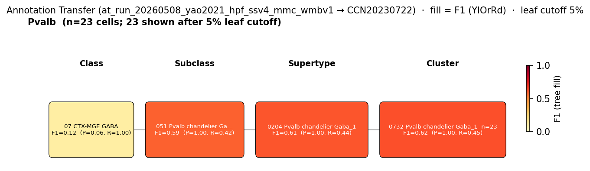
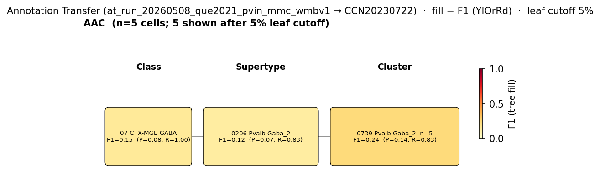

# Axo-axonic (chandelier) cell — WMBv1 (CCN20230722) Mapping Report
*2026-04-09 · Source: `kb/graphs/hippocampus/hippocampus_GABAergic_interneurons.yaml`*

## Introduction

Hippocampal axo-axonic (chandelier) cells are one of three canonical
parvalbumin-positive (Pvalb+) interneuron subtypes — alongside basket and
bistratified cells — that together make up the fast-spiking PV+ interneuron
population in CA1/CA3 [2][3]. Their defining morphological feature is the set
of cartridge-like axonal boutons that target exclusively the axon initial
segment (AIS) of pyramidal cells, providing a powerful gating control over
spike output [2]. Their somata lie in the CA1 pyramidal layer [UBERON:0014548]
along with basket and bistratified cells [1]. Mapping the chandelier cell to a
transcriptomic atlas is non-trivial because PV+ morphological subtypes have a
continuous and largely overlapping transcriptomic landscape [3], with
chandelier cells particularly hard to separate from basket cells from
transcriptomic data alone.

### Classical type table

| Property | Value | References |
|---|---|---|
| Soma location | pyramidal layer of CA1 [UBERON:0014548] | [1] |
| NT | GABAergic | [2] |
| Markers | Pvalb (defining) | [1][3] |
| CL term | pvalb chandelier GABAergic interneuron [CL:4023036] (EXACT) | — |

Details — source evidence for classical type properties

- **Soma location:** classical morphology · CA1 stratum pyramidale soma · [1]
  > Parvalbumin + cells were specifically localized in the granular and polymorphic cell layers of the dentate gyrus and the strata oriens and pyramidale in CA1/3 fields of the rat hippocampus (Kosaka et al., 1987). They have been considered a subpopulation of GABAergic interneurons, including basket and axo-axonic cell types, which innervate the somata and proximal axons of pyramidal cells, respectively (Soriano et al., 1990)
  > — Rivera et al. 2014, Classical Functional and Morphological Interneuron Types · [1] <!-- quote_key: 10540334_bdfa426a -->

- **Pvalb defining marker:** classical and transcriptomic confirmation; PV-IN heterogeneity includes chandelier subtype [2][3]
  > Interneurons expressing the calcium binding protein parvalbumin (PV) make up approximately 40% of all GABAergic interneurons. However, this is a heterogeneous group of functionally distinct interneuron subtypes. For example, in the hippocampus alone, there are at least three functionally and morphologically distinct populations of PV + expressing interneurons, namely basket, axo-axonic and bistratified cells. Fast spiking interneurons in the hippocampus and neocortex are often PV + positive and target the soma of pyramidal cells.
  > — Dannenberg et al. 2017, Classification Schemes and Methodological Approaches · [2] <!-- quote_key: 38778375_462ec931 -->

Cell Ontology mapping: pvalb chandelier GABAergic interneuron [[CL:4023036](https://www.ebi.ac.uk/ols4/ontologies/cl/classes?obo_id=CL:4023036)] (EXACT).

---

## Results

Two candidate atlas mappings were assessed; the primary mapping is the
supertype 0204 Pvalb chandelier Gaba_1 [CS20230722_SUPT_0204] and its child
cluster 0732 Pvalb chandelier Gaba_1 [CS20230722_CLUS_0732] — both named for
the chandelier cell type — at LOW confidence pending a dedicated
morphologically identified axo-axonic dataset.

**Annotation-transfer overview figure (run-level, filtered).** Two AT runs
inform this node; both are shown filtered to the relevant source group.

*F1 across taxonomy levels for the Pvalb SSv4 source group from Yao 2021
GSE185862 hippocampal formation (n=66 HIP cells). The Yao 2021 SSv4 'Pvalb'
label is morphologically unresolved (mixes basket, axo-axonic and bistratified
cells); the strongest cluster hit is 0732 Pvalb chandelier Gaba_1
[CS20230722_CLUS_0732] (F1 = 0.622, target_purity = 1.0) within supertype
0204 Pvalb chandelier Gaba_1 [CS20230722_SUPT_0204] (F1 = 0.612).*

*F1 across taxonomy levels for the AAC source group (n=6 morphologically
confirmed axo-axonic cells) from Que 2021 patch-seq. AAC n=6 is insufficient
for reliable F1 scoring; 5/6 cells map to a basket-type cluster (0739 Pvalb
Gaba_2) rather than to SUPT_0204/CLUS_0732. This result is uninformative due
to the small AAC sample and may reflect genuine PV-IN transcriptomic
similarity [3] rather than evidence against the SUPT_0204/CLUS_0732 mapping.*

### Mapping candidates table

| Rank | WMBv1 cluster | Supertype | Cells (10x) | Confidence | Key property alignment | Verdict |
|---|---|---|---:|---|---|---|
| 1 | 0732 Pvalb chandelier Gaba_1 [CS20230722_CLUS_0732] | 0204 Pvalb chandelier Gaba_1 | 242 | 🔴 LOW | Pvalb CONSISTENT · CA1 SO+CA3 PYR APPROXIMATE · name=chandelier | Speculative (cluster-level) |
| 2 | 0204 Pvalb chandelier Gaba_1 [CS20230722_SUPT_0204] | — (supertype) | 2014 | 🔴 LOW | Pvalb CONSISTENT · location DISCORDANT (piriform-dominated at supertype) · name=chandelier | Speculative (supertype-level) |

Total edges: 2 (both LOW); relationship EQUIVALENT for both.

### Primary candidate property alignment — 0732 Pvalb chandelier Gaba_1 [CS20230722_CLUS_0732] · 🔴 LOW

**Table 1 — Property comparison.**

| Property | Classical | Supertype | Best cluster | Alignment |
|---|---|---|---|---|
| NT type | GABAergic | GABA (Pvalb chandelier Gaba_1) | GABA (CLUS_0732) | CONSISTENT |
| Soma location | CA1 stratum pyramidale [UBERON:0014548] | Piriform area [MBA:961] (194 cells) — no hippocampal pyramidal layer at supertype level | CA1 SO [MBA:399] (38 cells); CA3 pyramidal layer [MBA:495] (23 cells); CA1 SR (23); CA3 SO (33); CA3 SR (15); DG granule layer (15) (CLUS_0732) | SUPT: DISCORDANT; CLUS: APPROXIMATE |
| Pvalb expression | defining marker | Pvalb in DEFINING_SCOPED markers; Pvalb subclass; precomputed stats mean: 7.47 | Pvalb in MERFISH markers; Pvalb chandelier subclass; precomputed stats mean: 8.56 (CLUS_0732) | CONSISTENT |
| Type identity | axo-axonic (chandelier) morphology — exclusive AIS targeting | supertype named 'Pvalb chandelier Gaba_1' | cluster named 'Pvalb chandelier Gaba_1' (CLUS_0732) | CONSISTENT |
| Sex ratio | not documented | not available | not assessed | NOT_ASSESSED |

**Table 2 — Evidence support.**

| Evidence | Type | Supports | Headline | Source |
|---|---|---|---|---|
| Atlas precomputed expression + MERFISH (CLUS_0732) | Atlas metadata | SUPPORT | CA1 SO 38 · CA3 pyr 23 · CA1 SR 23 · CA3 SO 33 · DG gran 15 · Pvalb 8.56 | atlas-internal |
| Yao 2021 MapMyCells (SSv4 'Pvalb', n=66 HIP cells) | Annotation transfer | PARTIAL | F1 = 0.622 at CLUS_0732 (group_purity 0.451, target_purity 1.0) — strongest cluster hit | atlas-internal |
| Que 2021 MapMyCells (AAC morphology, n=6) | Annotation transfer | PARTIAL | 0/6 AAC cells map to CLUS_0732; 5/6 map to basket cluster; uninformative at n=6 | atlas-internal |

*(Of the SUPT_0204 child clusters, CLUS_0732 is the one with hippocampal
MERFISH anatomy — CA1 SO (38), CA1 SR (23), CA3 SO (33), CA3 pyramidal
layer (23), CA3 SR (15), DG granule layer (15) — distinguishing the
hippocampal chandelier population from non-hippocampal SUPT_0204 children
(e.g. piriform-dominated). Best match: CLUS_0732.)*

### Secondary candidate property alignment — 0204 Pvalb chandelier Gaba_1 [CS20230722_SUPT_0204] · 🔴 LOW

**Table 1 — Property comparison.**

| Property | Classical | Supertype | Best cluster | Alignment |
|---|---|---|---|---|
| NT type | GABAergic | GABA | GABA (CLUS_0732) | CONSISTENT |
| Soma location | CA1 stratum pyramidale [UBERON:0014548] | Piriform area [MBA:961] (194 cells) — no hippocampal pyramidal layer at supertype level | CA1 SO 38 · CA3 pyr 23 (via CLUS_0732) | DISCORDANT |
| Pvalb expression | defining marker | Pvalb DEFINING_SCOPED; Pvalb subclass; precomputed stats mean: 7.47 | Pvalb subclass (CLUS_0732) | CONSISTENT |
| Type identity | axo-axonic (chandelier) morphology — exclusive AIS targeting | supertype named 'Pvalb chandelier Gaba_1' | cluster named 'Pvalb chandelier Gaba_1' (CLUS_0732) | CONSISTENT |
| Sex ratio | not documented | not available | not assessed | NOT_ASSESSED |

**Table 2 — Evidence support.**

| Evidence | Type | Supports | Headline | Source |
|---|---|---|---|---|
| Atlas precomputed expression (SUPT_0204) | Atlas metadata | SUPPORT | supertype named 'Pvalb chandelier Gaba_1'; Pvalb DEFINING_SCOPED; piriform-dominated at supertype | atlas-internal |
| Yao 2021 MapMyCells (SSv4 'Pvalb', n=66 HIP cells) | Annotation transfer | PARTIAL | F1 = 0.612 at SUPT_0204 (group_purity 0.441, target_purity 1.0) — strongest Pvalb supertype hit | atlas-internal |
| Que 2021 MapMyCells (AAC morphology, n=6) | Annotation transfer | PARTIAL | 1/6 AAC cells to SUPT_0204; 5/6 to non-chandelier Pvalb supertype; uninformative at n=6 | atlas-internal |

*(At supertype level, SUPT_0204 anatomy is piriform-dominated at the top;
the hippocampal chandelier signal is concentrated in child cluster
CLUS_0732. The supertype is therefore not separable for the hippocampal
chandelier population from the piriform/cortical chandelier population —
cluster-level resolution at CLUS_0732 is required. Best match: CLUS_0732.)*

### 0204 Pvalb chandelier Gaba_1 [CS20230722_SUPT_0204] · 🔴 LOW

**Supporting evidence**
- Supertype name "Pvalb chandelier Gaba_1" directly names the chandelier (= axo-axonic) cell type, and the supertype sits within the Pvalb chandelier subclass. GABA NT type and Pvalb presence in DEFINING_SCOPED markers (precomputed stats mean = 7.47) are fully consistent with the classical Pvalb+ chandelier identity. The CL mapping for the classical node (CL:4023036 pvalb chandelier GABAergic interneuron) is EXACT, and the atlas supertype name makes the identity correspondence explicit. The EQUIVALENT relationship is declared because the supertype is named for and defined by the chandelier cell type.
- Yao 2021 (GEO:GSE185862) SSv4 'Pvalb' subclass label (n=66 HIP cells) maps preferentially to SUPT_0204 (F1 = 0.612, target_purity = 1.0, 26/66 cells). SUPT_0204 is the single strongest supertype hit for SSv4 Pvalb cells among all Pvalb targets, consistent with the chandelier supertype receiving a substantial fraction of an unresolved hippocampal Pvalb population.

**Marker evidence provenance**
- **Pvalb (defining):** Pvalb is in the SUPT_0204 DEFINING_SCOPED marker set and Pvalb chandelier is the subclass name. Atlas annotation/expression are consistent (precomputed mean = 7.47); no atlas-annotation/expression discrepancy. The classical evidence base for Pvalb+ chandelier identity is transcript- and protein-level PV immunoreactivity in PV-IN heterogeneity studies [1][3]; chandelier-specific Pvalb evidence is well established but the Pvalb marker alone cannot separate chandelier from basket/bistratified PV+ subtypes at supertype level [3].

**Concerns**
- DISTRIBUTED_ACROSS_CLUSTERS: SUPT_0204 anatomy is piriform-dominated at the top (Piriform area [MBA:961], 194 cells) with no hippocampal pyramidal layer listed at supertype level; the hippocampal chandelier signal is concentrated in child cluster CLUS_0732. The supertype likely spans multiple regions where axo-axonic cells occur (piriform, cortex, hippocampus). *(distant region — piriform area is anatomically distant from hippocampal CA1 stratum pyramidale; this is strong counter-evidence for placing the hippocampal chandelier mapping at supertype level rather than cluster level.)*
- Location DISCORDANT at supertype level: classical CA1 pyramidal layer [UBERON:0014548] vs. supertype-level piriform area [MBA:961] dominance. Cluster-level resolution at CLUS_0732 (where CA1 SO 38, CA1 SR 23, CA3 pyramidal layer 23, CA3 SO 33, CA3 SR 15, DG granule layer 15 are listed) is required for the hippocampal chandelier mapping.
- MARKER_NOT_SPECIFIC: High transcriptomic similarity between PV+ morphological subtypes [3] means chandelier-specific markers beyond Pvalb are not fully resolved at supertype level from basket/bistratified cells in the atlas metadata.
- This is metadata-only with no primary literature directly on the edge; the chandelier-supertype name correspondence is the principal anchor.

**What would upgrade confidence**
- A morphologically confirmed hippocampal axo-axonic scRNA-seq dataset (Cre-driver targeting Pvalb chandelier cells, e.g. Vipr2-Cre or Nkx2-1 lineage AAC targeting, with subsequent scRNA-seq) reaching F1 ≥ 0.80 at CLUSTER level on CLUS_0732 (n ≥ 30) would lift confidence LOW → MODERATE.

### 0732 Pvalb chandelier Gaba_1 [CS20230722_CLUS_0732] · 🔴 LOW

**Supporting evidence**
- Atlas precomputed expression and MERFISH for CLUS_0732 list hippocampal anatomy: CA1 SO [MBA:399] (38 cells), CA1 SR (23), CA3 SO (33), CA3 pyramidal layer [MBA:495] (23), CA3 SR (15), and dentate gyrus granule cell layer (15). The cluster name "0732 Pvalb chandelier Gaba_1" explicitly identifies this as the hippocampal chandelier population within the chandelier supertype, and Pvalb is in MERFISH markers (precomputed mean 8.56) confirming PV+ identity. NT GABA is consistent.
- Yao 2021 (GEO:GSE185862) SSv4 'Pvalb' MapMyCells transfer places 23/66 HIP Pvalb cells at CLUS_0732 (F1 = 0.622, target_purity = 1.0) — the strongest cluster-level hit among all Pvalb targets, consistent with the chandelier supertype correspondence even though the source label is a mixed Pvalb population. *(note: the SSv4 'Pvalb' label includes basket, axo-axonic and bistratified cells, so this is a supporting signal for chandelier mapping but not a chandelier-specific test.)*

**Marker evidence provenance**
- **Pvalb (defining):** transcript-level evidence (MERFISH + precomputed stats mean 8.56) at CLUS_0732, plus subclass-level Pvalb chandelier placement; classical PV+ chandelier identity from PV-IN heterogeneity studies [1][3]. No atlas-annotation/expression discrepancy. As with SUPT_0204, the Pvalb marker alone is not chandelier-specific against basket/bistratified PV+ subtypes [3]; the chandelier-specific anchor here is the cluster name and the subclass placement.
- **Cck (atlas neuropeptide signal):** CLUS_0732 lists Cck (precomputed score 8.4) — unexpectedly high for a canonical chandelier cell. This is not flagged as an atlas DEFINING/NEUROPEPTIDE annotation discrepancy (no DEFINING/NEUROPEPTIDE listing for Cck on this cluster in the facts), but it warrants investigation: either minor contamination from neighbouring CCK+ basket cells in the cluster, genuine low-level peptide co-expression in chandelier cells, or a methodological artifact. Flag for follow-up against primary literature on hippocampal AAC neuropeptide content.
- **Pthlh and Npy (atlas neuropeptide signal):** also present at CLUS_0732 in cluster metadata; not flagged as discrepant but should be cross-checked against AAC-specific neuropeptide literature.

**Concerns**
- Location APPROXIMATE: classical chandelier soma is in CA1 stratum pyramidale [UBERON:0014548] but the cluster lists CA1 SO (38 cells) as the dominant hippocampal CA1 location rather than CA1 pyramidale; CA3 pyramidal layer (23 cells) is also present. CA1 SO is immediately adjacent to CA1 stratum pyramidale and the discrepancy may reflect MERFISH registration resolution at the SO/pyramidale boundary. *(adjacent region — could reflect registration boundary error; weak counter-evidence.)*
- OTHER: Dentate gyrus granule cell layer (15 cells) is unusual — chandelier cells in DG are less well characterized in the classical literature. This may reflect axo-axonic cells contacting granule cells, a distinct chandelier subpopulation, or a registration artifact. Flag for follow-up.
- Que 2021 (GEO:GSE142546) morphologically confirmed AAC cells (n=6) map 0/6 to CLUS_0732; 5/6 map to a basket-type cluster within a different (non-chandelier) Pvalb supertype. At n=6 this is uninformative for F1 scoring — the AAC sample is below the minimum for reliable cluster-level F1 — but the directional miss (chandelier cells landing on a basket cluster) is consistent with the high transcriptomic similarity between PV+ morphological subtypes [3] and does not refute the SUPT_0204/CLUS_0732 mapping. *(note: the AAC patch-seq miss is not strong counter-evidence at n=6; a dedicated AAC dataset with n ≥ 30 would be needed to test whether AAC actually maps to CLUS_0732 or to a basket-type cluster.)*
- MARKER_NOT_SPECIFIC (inherited from supertype): chandelier vs. basket vs. bistratified PV-IN separation is not robust on transcriptomic markers alone [3].

**What would upgrade confidence**
- Dedicated morphologically identified hippocampal axo-axonic scRNA-seq (Pvalb chandelier Cre line, n ≥ 30, with morphology verification) reaching F1 ≥ 0.80 at CLUSTER level on CLUS_0732 would lift LOW → MODERATE.
- Targeted literature search on hippocampal chandelier cell neuropeptide content (Cck, Pthlh, Npy) to evaluate whether the CLUS_0732 neuropeptide signal is biologically consistent or a contamination/artifact signal.
- Investigation of the dentate gyrus granule-cell-layer chandelier signal (15 cells in CLUS_0732) against published AAC distributions across hippocampal subfields.

---

### Methods

Data sources, analyses, and reproducibility receipts

**Classical type definition.** The axo-axonic (chandelier) cell is defined
here on a CLASSICAL_MULTIMODAL basis: classical morphology + parvalbumin
immunohistochemistry place the soma in CA1 stratum pyramidale [UBERON:0014548]
[1]; the type is GABAergic [2]; the defining marker is Pvalb [1][3]. The
chandelier cell is one of three canonical PV+ interneuron subtypes alongside
basket and bistratified cells [2]; defining anatomical/morphological feature
is the cartridge-bouton axonal targeting of pyramidal-cell axon initial
segments [2].

**Atlas mapping query.**

Candidate atlas clusters were retrieved from the WMBv1 (CCN20230722) taxonomy
at ranks 0 (cluster) and 1 (supertype) using metadata-based scoring (region
match, NT type, defining markers, sex bias when applicable). Full scoring
rules: `workflows/map-cell-type.md`.

**Property alignment.**

Each defining property of the classical type was compared to the corresponding
atlas-side value via the `property_comparisons` schema, with alignments graded
CONSISTENT / APPROXIMATE / DISCORDANT / NOT_ASSESSED. Atlas-side numerical
values came from precomputed expression on the cluster (cluster.yaml in the
taxonomy reference store) and from MERFISH spatial registration for soma
location.

**Annotation transfer.**

Run 1 — Yao 2021 SSv4 hippocampal formation → WMBv1 (primary AT signal for
this node, via the SSv4 'Pvalb' subclass label):

| Field | Value |
|---|---|
| Source dataset | GEO:GSE185862 (Yao 2021 mouse hippocampal formation SMART-Seq v4 Allen Institute taxonomy labels: Astro, CA1-ProS, CA2-IG-FC, CA3, DG, L2/3 IT ENTl, L2/3 IT RHP, L6 CT CTX, L6b CTX, Lamp5, Micro-PVM, NP SUB, Oligo, Pvalb, SUB-ProS, Sncg, Sst, Sst Chodl, Vip) |
| Source species | NCBITaxon:10090 |
| Target atlas | WMBv1 (CCN20230722) |
| Method | MapMyCells local (cell_type_mapper, default parameters, raw normalization, 100 bootstrap iterations). Per-cell labels aggregated by source_cluster_label and target taxonomy level for F1 scoring. Inputs and intermediate outputs live under research/hippocampus/glutamatergic/annotation_transfer/GSE185862_SSv4/. |
| Tool version | cell_type_mapper |
| Bootstrap threshold | 0.0 |
| n cells | 6398 (filtered to 6398) |
| Run record | [`kb/annotation_transfer_runs/at_run_20260508_yao2021_hpf_ssv4_mmc_wmbv1/manifest.yaml`](../../kb/annotation_transfer_runs/at_run_20260508_yao2021_hpf_ssv4_mmc_wmbv1/manifest.yaml) |
| Script (external) | README.md |
| Code reference | [https://github.com/AllenInstitute/cell_type_mapper](https://github.com/AllenInstitute/cell_type_mapper) |
| F1 matrix | [`f1_scores_best.csv`](../../kb/annotation_transfer_runs/at_run_20260508_yao2021_hpf_ssv4_mmc_wmbv1/f1_scores_best.csv) |

Run 2 — Que 2021 patch-seq PV interneurons → WMBv1 (uninformative for AAC
at n=6, included for completeness):

| Field | Value |
|---|---|
| Source dataset | GEO:GSE142546 (Que 2021 patch-seq PV interneuron morphological types: hBC n=12, vBC n=50, hBIC n=11, vBIC n=9, AAC n=6; aggregated BC n=62, BIC n=20, AAC n=6; 88 QC-passed cells from 128 total) |
| Source species | NCBITaxon:10090 |
| Target atlas | WMBv1 (CCN20230722; SHA-256: b21ca985) |
| Method | MapMyCells local (cell_type_mapper v1.7.1, default parameters, raw normalization, 100 bootstrap iterations). Gene symbols remapped to Ensembl IDs (19788/35825 genes mapped). TPM input rounded to integer pseudo-counts. F1 scored with both fine-grained (hBC/vBC/hBIC/vBIC/AAC) and aggregated (BC/BIC/AAC) labels; aggregated results used in KB. |
| Tool version | cell_type_mapper v1.7.1 |
| Bootstrap threshold | 0.0 |
| n cells | 88 (filtered to 88) |
| Run record | [`kb/annotation_transfer_runs/at_run_20260508_que2021_pvin_mmc_wmbv1/manifest.yaml`](../../kb/annotation_transfer_runs/at_run_20260508_que2021_pvin_mmc_wmbv1/manifest.yaml) |
| Script (external) | README.md |
| Code reference | [https://github.com/AllenInstitute/cell_type_mapper](https://github.com/AllenInstitute/cell_type_mapper) |
| F1 matrix | [`f1_scores_aggregated_best.csv`](../../kb/annotation_transfer_runs/at_run_20260508_que2021_pvin_mmc_wmbv1/f1_scores_aggregated_best.csv) |
| Caveats | Patch-seq dataset with morphologically confirmed PV subtypes. TPM input used as pseudo-counts (standard for patch-seq where raw counts not available). Age range P10–P77; most cells juvenile (mean P30) vs. adult WMBv1. AAC n=6 insufficient for reliable F1 scoring; AAC results should be treated as uninformative. BC and BIC separate cleanly within a basket/bistratified Pvalb supertype — BC and BIC to distinct child clusters at F1 ≈ 0.8. |

**Anti-hallucination.**

All citations, atlas accessions, ontology CURIEs, and verbatim literature
quotes in this report are validated against the evidencell knowledge base
at write time. Authored-prose evidence narratives are validated against
their source `evidence_items[*].explanation` fields. The pre-write hook
rejects any unresolvable identifier or unattributed blockquote. Specific
mapping limitations and caveats are documented per-candidate in the
Discussion section.

*Generated by evidencell `01f89d6` at 2026-05-13T15:46:13+00:00 from
[kb/graphs/hippocampus/hippocampus_GABAergic_interneurons.yaml](kb/graphs/hippocampus/hippocampus_GABAergic_interneurons.yaml).*

**Evidence base table.**

| Edge ID | Evidence types | Supports | Source |
|---|---|---|---|
| edge_axo_axonic_cell_hippocampus_to_CS20230722_SUPT_0204 | ATLAS_METADATA; ANNOTATION_TRANSFER (×2) | SUPPORT; PARTIAL; PARTIAL | atlas-internal |
| edge_axo_axonic_cell_hippocampus_to_CS20230722_CLUS_0732 | ATLAS_METADATA; ANNOTATION_TRANSFER (×2) | SUPPORT; PARTIAL; PARTIAL | atlas-internal |

---

## Discussion

**Primary mapping:** Axo-axonic (chandelier) cell → 0732 Pvalb chandelier
Gaba_1 [CS20230722_CLUS_0732] at LOW confidence (with parent supertype
0204 Pvalb chandelier Gaba_1 [CS20230722_SUPT_0204] also LOW). Key support:
the supertype and cluster are both named for the chandelier cell type, Pvalb
is in DEFINING_SCOPED markers at the supertype (mean 7.47) and in MERFISH at
the cluster (mean 8.56), CLUS_0732 carries hippocampal anatomy (CA1 SO 38,
CA1 SR 23, CA3 pyramidal layer 23, CA3 SO 33, DG granule layer 15), and the
Yao 2021 SSv4 'Pvalb' MapMyCells transfer produces the strongest cluster-level
F1 (= 0.622, target_purity = 1.0) at CLUS_0732. Key caveats:
DISTRIBUTED_ACROSS_CLUSTERS (SUPT_0204 is piriform-dominated at the supertype
level — the hippocampal chandelier signal lives at CLUS_0732, not at the
supertype) and MARKER_NOT_SPECIFIC (chandelier vs. basket vs. bistratified
PV-IN separation is not resolved on Pvalb alone [3]).

This classical type maps directly to the Cell Ontology term pvalb chandelier
GABAergic interneuron [[CL:4023036](https://www.ebi.ac.uk/ols4/ontologies/cl/classes?obo_id=CL:4023036)].
The CL definition matches precisely: cartridge boutons targeting exclusively
the AIS of pyramidal cells, fast-spiking PV+ interneuron.

### Proposed experiments and follow-ups

**Cross-check with existing AT evidence.** The primary mapping is supported
by a morphologically unresolved Pvalb scRNA-seq run (Yao 2021 SSv4, F1 = 0.622
at CLUS_0732) and uninformatively probed by a morphologically resolved AAC
patch-seq run at n=6 (Que 2021). A dedicated morphologically identified
hippocampal axo-axonic scRNA-seq with adequate n is the remaining gap.

1. **Dedicated morphologically identified hippocampal AAC scRNA-seq → MapMyCells.**
   - What: Pvalb chandelier Cre line (e.g. Vipr2-Cre or Nkx2-1 lineage AAC
     targeting) with morphological verification + scRNA-seq; alternatively,
     a patch-seq dataset with chandelier-morphology AAC ≥ 30 cells.
   - Target: F1 ≥ 0.80 at CLUSTER level on CLUS_0732, n ≥ 30 AAC cells.
   - Expected output: AnnotationTransferEvidence on the CLUS_0732 edge,
     lifting confidence LOW → MODERATE (or refuting the mapping if AAC
     consistently lands on a basket cluster, in line with the Que 2021 n=6
     observation).
   - Resolves: the principal gap — morphology-confirmed AAC mapping at
     adequate sample size.

2. **Larger-n re-run of Que 2021 AAC mapping with refined parameters.**
   - What: aggregate Que 2021 with additional patch-seq PV-IN morphology
     datasets to reach AAC n ≥ 30; rerun MapMyCells with raw counts (vs.
     TPM pseudo-counts) and adult-atlas-matched QC.
   - Target: stable AAC mapping with F1 ≥ 0.50 at supertype level.
   - Expected output: updated AnnotationTransferEvidence on SUPT_0204 and
     CLUS_0732 (and on the off-target basket clusters if the directional
     miss is confirmed at adequate sample size).
   - Resolves: whether the AAC → basket-cluster signal in Que 2021 n=6 is
     genuine or noise.

3. **Targeted literature search on hippocampal chandelier neuropeptide content.**
   - What: cite-traverse for hippocampal axo-axonic / chandelier neuropeptide
     content (Cck, Pthlh, Npy) — to evaluate the CLUS_0732 neuropeptide
     signal (Cck = 8.4) against primary literature.
   - Target: published evidence on whether hippocampal AAC express Cck/Pthlh/Npy
     at low level, or whether the CLUS_0732 signal reflects contamination.
   - Expected output: LiteratureEvidence on CLUS_0732 addressing the
     neuropeptide concern.
   - Resolves: marker provenance concern on CLUS_0732 neuropeptides.

### Open questions

No `unresolved_questions[]` entries are recorded on the edges; the open
questions are implicit in the caveats and are folded into the proposed
experiments above.

1. Does a dedicated morphologically identified hippocampal axo-axonic
   scRNA-seq dataset confirm AAC → CLUS_0732, or does AAC consistently land
   on basket clusters as the Que 2021 n=6 result hints? (From the
   MARKER_NOT_SPECIFIC caveat on both edges.)
2. Are the CLUS_0732 neuropeptide signals (Cck 8.4, plus Pthlh and Npy)
   biologically consistent with hippocampal chandelier cells, or do they
   reflect minor contamination or methodological artifact? (From the
   neuropeptide concern on CLUS_0732.)
3. What does the dentate gyrus granule-cell-layer signal (15 cells) at
   CLUS_0732 represent — a distinct DG chandelier subpopulation, AAC contact
   with granule cells, or a registration artifact? (From the OTHER caveat
   on CLUS_0732.)

---

## References

| # | Citation | PMID | Used for |
|---|---|---|---|
| [1] | Rivera et al. 2014 | [25018703](https://pubmed.ncbi.nlm.nih.gov/25018703) | soma location |
| [2] | Dannenberg et al. 2017 | [29321728](https://pubmed.ncbi.nlm.nih.gov/29321728) | neurotransmitter type |
| [3] | Que et al. 2021 | [33398060](https://pubmed.ncbi.nlm.nih.gov/33398060) | Pvalb marker |
