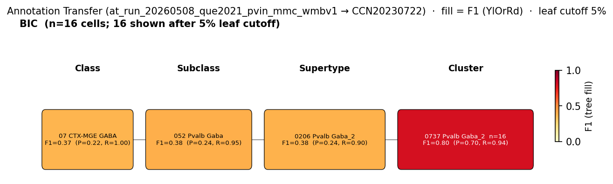
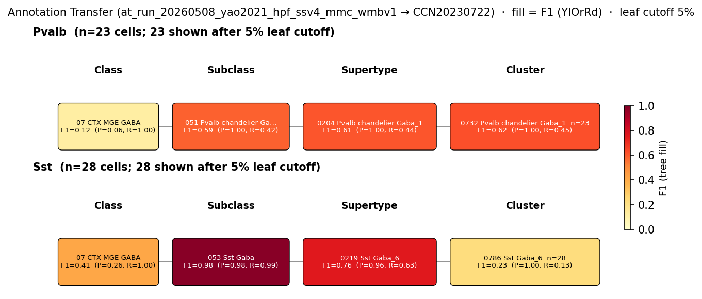
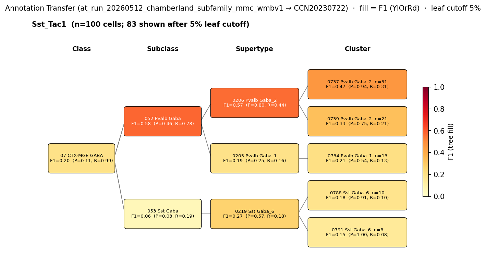

# Bistratified cell — WMBv1 (CCN20230722) Mapping Report
*2026-04-09 · Source: `kb/graphs/hippocampus/hippocampus_GABAergic_interneurons.yaml`*

---

## Introduction

Hippocampal bistratified cells are CA1 GABAergic interneurons whose somata lie in/near stratum pyramidale and whose axons innervate stratum oriens and stratum radiatum in a characteristic bilaminar pattern, providing dendritic inhibition to pyramidal cells [1][2][3]. They co-express the canonical parvalbumin (Pvalb) marker of fast-spiking PV interneurons with somatostatin (Sst) and Tac1 [5][6][7][8][9], distinguishing them from PV basket cells (which target the soma) and from Sst-only OLM cells. Mapping this morphologically and functionally defined population to a single-cell transcriptomic atlas is non-trivial because PV interneuron transcriptomic landscapes are continuous rather than discrete [8], and because bistratified Sst/Tac1 co-expression places them near both the Pvalb and Sst transcriptomic neighbourhoods.

> Different types of hippocampal inhibitory interneurons control spike initiation [e.g., axo-axonic and basket cells (BCs)] and synaptic integration (e.g., bistratified and oriens–lacunosum moleculare interneurons) within pyramidal neurons
> — Chamberland & Topolnik 2012, Classical Functional and Morphological Interneuron Types · [1] <!-- quote_key: 8530661_92702482 -->

### Classical type table

| Property | Value | References |
|---|---|---|
| Soma location | pyramidal layer of CA1 [UBERON:0014548]; CA1 stratum oriens [UBERON:0014552]; CA1 stratum radiatum [UBERON:0014554] (axon territory) | [1][2][3] |
| NT | GABAergic | [4] |
| Markers | Pvalb (defining); Sst; Tac1 | Pvalb [5][6][7][8]; Sst, Tac1 [9] |
| Neuropeptides | Sst | [9] |
| CL term | bistratified cell [CL:0004247] (BROAD) | — |

Details — source evidence for classical type properties

- **Soma location / morphology:** CA1 stratum pyramidale soma with bilaminar SO/SR axonal field · [1][2][3]
  > The hippocampal cells they most resemble, Basket-bistratified, HS and OLM interneurons, have their somata in the stratum pyramidale (sp) of the hippocampus
  > — Perez et al. 2020, Identification of cell types based on the somatic transcriptome · [3] <!-- quote_key: 224817966_79f4a500 -->

  > the most representative ones, the PV-expressing basket and bistratified cells, the NOS-expressing ivy cells and 2 types of interneuron-selective interneurons (ISI 1 and 3) that express calretinin
  > — Bocchio et al. 2024, Results · [2] <!-- quote_key: 262127573_ba6d02e9 -->

  > Different types of hippocampal inhibitory interneurons control spike initiation [e.g., axo-axonic and basket cells (BCs)] and synaptic integration (e.g., bistratified and oriens–lacunosum moleculare interneurons) within pyramidal neurons
  > — Chamberland & Topolnik 2012, Classical Functional and Morphological Interneuron Types · [1] <!-- quote_key: 8530661_92702482 -->

- **Pvalb defining marker / PV-IN heterogeneity:** [4][5][8]
  > Interneurons expressing the calcium binding protein parvalbumin (PV) make up approximately 40% of all GABAergic interneurons. However, this is a heterogeneous group of functionally distinct interneuron subtypes. For example, in the hippocampus alone, there are at least three functionally and morphologically distinct populations of PV + expressing interneurons, namely basket, axo-axonic and bistratified cells. Fast spiking interneurons in the hippocampus and neocortex are often PV + positive and target the soma of pyramidal cells.
  > — Dannenberg et al. 2017, Classification Schemes and Methodological Approaches · [4] <!-- quote_key: 38778375_462ec931 -->

  > WT PV+INTs consist of two physiological subtypes (80% fast-spiking (FS), 20% non-fast-spiking (NFS)) and four morphological subtypes (basket, axo-axonic, bistratified, radiatum-targeting).
  > — Ekins et al. 2020, Classification Schemes and Methodological Approaches · [5] <!-- quote_key: 221276443_e917908b -->

  > while PV-INs differ in anatomy and in vivo activity, their continuous transcriptomic and homogenous biophysical landscapes are not predictive of these distinct identities
  > — Que et al. 2021 · [8] <!-- quote_key: 230508306_e8cc8c19 -->

- **Sst / Tac1 markers and bistratified targeting:** Sst;;Tac1 intersectional genetics labels bistratified cells [9]
  > the Sst;;Tac1 intersection targeted a population of bistratified cells that overwhelmingly targeted fast-spiking interneurons. In contrast, the Ndnf;;Nkx2-1 intersection revealed a population of oriens lacunosum-moleculare interneurons that selectively targeted CA1 pyramidal cells
  > — Chamberland et al. 2024, Transcriptomic Interneuron Classifications · [9] <!-- quote_key: 269246896_c084d5c0 -->

Cell Ontology mapping: bistratified cell [[CL:0004247](https://www.ebi.ac.uk/ols4/ontologies/cl/classes?obo_id=CL:0004247)] (BROAD). CL:0004247 is retinal-focused; the hippocampal bistratified interneuron (Pvalb/Sst/Tac1+, axon in SO and SR) has no dedicated CL term and is a candidate for a new CL term request.

---

## Results

Three candidate atlas mappings were assessed; the primary mapping is supertype 0206 Pvalb Gaba_2 [CS20230722_SUPT_0206] and its child cluster 0737 Pvalb Gaba_2 [CS20230722_CLUS_0737], with morphologically confirmed PV bistratified cells from Que 2021 producing F1 = 0.800 at the cluster level to CLUS_0737 (MODERATE confidence).

**Annotation-transfer overview figure (run-level, filtered)**

*F1 across taxonomy levels for the BIC (bistratified, n=20) source group from Que 2021 patch-seq morphological labels. BIC cells map cleanly to 0737 Pvalb Gaba_2 [CS20230722_CLUS_0737] at cluster level (F1 = 0.800, group_purity = 0.941, target_purity = 0.696) within supertype 0206 Pvalb Gaba_2 [CS20230722_SUPT_0206]. The BC sibling group maps preferentially to CLUS_0739, separating basket from bistratified at cluster resolution.*

*F1 across taxonomy levels for the Pvalb and Sst SSv4 source groups from Yao 2021 GSE185862 hippocampal formation. The Yao 2021 SSv4 Pvalb label is morphologically unresolved (mixes basket, axo-axonic, and bistratified), yielding diffuse signal across Pvalb supertypes with only a weak component to 0216 Sst Gaba_3 [CS20230722_SUPT_0216] (F1 = 0.053). Shown as supporting context for the LOW-confidence Sst-supertype edge.*

*F1 across taxonomy levels for the Sst_Tac1 source group derived from Harris 2018 cluster-mean expression using Chamberland 2024 in-silico gene-pair rules (n=168). The Sst_Tac1 group surfaces a cross-subclass Sst→Pvalb landing at 052 Pvalb Gaba subclass (F1 = 0.578, recall = 0.783) with target_purity = 0.939 at 0737 Pvalb Gaba_2 [CS20230722_CLUS_0737] at cluster level — independent in-silico support for the Sst-Pvalb transcriptomic continuity of bistratified cells described by Chamberland 2024 [9].*

### Mapping candidates table

| Rank | WMBv1 cluster | Supertype | Cells (10x) | Confidence | Key property alignment | Verdict |
|---|---|---|---:|---|---|---|
| 1 | 0737 Pvalb Gaba_2 [CS20230722_CLUS_0737] | 0206 Pvalb Gaba_2 | 1312 | 🟡 MODERATE | Pvalb CONSISTENT · CA1 SO+SR CONSISTENT · Sst:4.4 · Tac1:7.3 | Best candidate (cluster-level) |
| 2 | 0206 Pvalb Gaba_2 [CS20230722_SUPT_0206] | — (supertype) | 2860 | 🟡 MODERATE | Pvalb CONSISTENT · SO+SR via CLUS_0737 | Best candidate (supertype-level) |
| — | 0216 Sst Gaba_3 [CS20230722_SUPT_0216] | — (supertype) | 2712 | 🔴 LOW | Sst CONSISTENT · Tac1 CONSISTENT · Pvalb DISCORDANT | Speculative (Sst-dominant subpopulation) |

Total edges: 3 (2 MODERATE, 1 LOW); relationship PARTIAL_OVERLAP for all.

### Primary candidate property alignment — 0737 Pvalb Gaba_2 [CS20230722_CLUS_0737] · 🟡 MODERATE

**Table 1 — Property comparison.**

| Property | Classical | Supertype | Best cluster | Alignment |
|---|---|---|---|---|
| NT type | GABAergic | GABA (Pvalb Gaba_2) | GABA (CLUS_0737) | CONSISTENT |
| Pvalb expression | defining marker | Pvalb subclass (MERFISH in sibling CLUS_0739) | Pvalb subclass; scoped marker Ednra (CLUS_0737) | CONSISTENT |
| Soma/axon location | CA1 stratum oriens [UBERON:0014552] + CA1 stratum radiatum [UBERON:0014554] | bilaminar via CLUS_0737 | CA1 SO: 361 cells, CA1 SR: 72, CA3 SO: 72 (CLUS_0737) | CONSISTENT |
| Sst expression | co-expressed | NP: Sst:4.4 (CLUS_0737) | NP: Sst:4.4 (CLUS_0737) | CONSISTENT |
| Tac1 expression | co-expressed | NP: Tac1:7.3 (CLUS_0737) | NP: Tac1:7.3 (CLUS_0737) | CONSISTENT |

**Table 2 — Evidence support.**

| Evidence | Type | Supports | Headline | Source |
|---|---|---|---|---|
| Atlas precomputed expression + MERFISH (CLUS_0737) | Atlas metadata | SUPPORT | CA1 SO 361 · CA1 SR 72 · NP Sst:4.4 Tac1:7.3 | atlas-internal |
| Que 2021 MapMyCells (morphologically confirmed BIC, n=20) | Annotation transfer | SUPPORT | F1 = 0.800 at CLUS_0737 (group_purity 0.941, target_purity 0.696) | atlas-internal |
| Chamberland per-cluster Sst_Tac1 (Harris 2018, n=168) | Annotation transfer | PARTIAL | target_purity 0.939 at CLUS_0737; subclass F1 = 0.578, recall 0.783 | atlas-internal |

*(Of the SUPT_0206 child clusters, CLUS_0737 carries the bistratified-specific bilaminar CA1 SO + CA1 SR anatomy and the Sst+Tac1 NP profile; sibling CLUS_0739 carries the basket morphology and receives BC cells in the Que 2021 patch-seq run. Best match: CLUS_0737.)*

### Secondary candidate property alignment — 0206 Pvalb Gaba_2 [CS20230722_SUPT_0206] · 🟡 MODERATE

**Table 1 — Property comparison.**

| Property | Classical | Supertype | Best cluster | Alignment |
|---|---|---|---|---|
| NT type | GABAergic | GABA | GABA (CLUS_0737) | CONSISTENT |
| Pvalb expression | defining marker | Pvalb subclass; CLUS_0739 MERFISH: Pvalb present | Pvalb subclass (CLUS_0737) | CONSISTENT |
| Soma/axon location | CA1 stratum oriens [UBERON:0014552] + CA1 stratum radiatum [UBERON:0014554] | bilaminar pattern in CLUS_0737 | CA1 SO 361, CA1 SR 72, CA3 SO 72 (CLUS_0737) | CONSISTENT |
| Sst expression | co-expressed | NP: Sst:4.4 (via CLUS_0737) | NP: Sst:4.4 (CLUS_0737) | CONSISTENT |
| Tac1 expression | co-expressed | NP: Tac1:7.3 (via CLUS_0737) | NP: Tac1:7.3 (CLUS_0737) | CONSISTENT |

**Table 2 — Evidence support.**

| Evidence | Type | Supports | Headline | Source |
|---|---|---|---|---|
| Atlas precomputed expression (SUPT_0206 + CLUS_0737) | Atlas metadata | PARTIAL | dominant hippocampal Pvalb supertype; bistratified-specific child CLUS_0737 | atlas-internal |
| Que 2021 MapMyCells (BIC, n=20) | Annotation transfer | SUPPORT | SUPT_0206 F1 = 0.375 (group_purity 0.900); CLUS_0737 F1 = 0.800 | atlas-internal |

*(At supertype level, SUPT_0206 contains both PV basket (CLUS_0739) and PV bistratified (CLUS_0737) populations; the supertype is not separable for basket vs. bistratified — cluster-level resolution at CLUS_0737 is required.)*

### 0206 Pvalb Gaba_2 [CS20230722_SUPT_0206] · 🟡 MODERATE

**Supporting evidence**
- SUPT_0206 (Pvalb Gaba_2) is the dominant hippocampal Pvalb supertype and primary atlas target for canonical PV interneurons including bistratified cells. Pvalb is the defining marker of bistratified cells and SUPT_0206 sits within the Pvalb subclass (052 Pvalb Gaba [CS20230722_SUBC_052]).
- Child cluster 0737 Pvalb Gaba_2 [CS20230722_CLUS_0737] shows bilaminar anatomy (CA1 SO 361 cells, CA1 SR 72 cells) directly matching the bistratified cell axon target lamination, with NP markers Sst:4.4 and Tac1:7.3 consistent with bistratified identity (Sst;;Tac1 intersection labels bistratified cells per Chamberland 2024 [9]).
- Que 2021 patch-seq morphologically confirmed BIC cells (n=20) map 18/20 to SUPT_0206 (group_purity = 0.900, F1 = 0.375 at supertype level). *(note: supertype F1 is bounded by sibling-cluster confusion; the cluster-level F1 = 0.800 is the relevant headline.)*

**Concerns**
- DISTRIBUTED_ACROSS_CLUSTERS: SUPT_0206 contains both PV basket cells (CLUS_0739) and PV bistratified cells (CLUS_0737). Not separable at supertype level; cluster-level resolution at CLUS_0737 is required for bistratified-specific mapping.

**What would upgrade confidence**
- Independent morphologically confirmed PV bistratified scRNA-seq from an additional study reaching F1 ≥ 0.80 at CLUSTER level on CLUS_0737 (currently met by Que 2021 alone).

### 0737 Pvalb Gaba_2 [CS20230722_CLUS_0737] · 🟡 MODERATE

**Supporting evidence**
- Atlas precomputed expression and MERFISH for CLUS_0737 give CA1 SO 361, CA1 SR 72, CA3 SO 72 — the bilaminar CA1 SO + CA1 SR distribution directly matches the bistratified cell axon territory [1][2][3]. NP markers: Cort:8.0, Tac1:7.3, Npy:5.5, Cck:5.2, Sst:4.4 — Sst and Tac1 are the two markers used by Chamberland 2024 Sst;;Tac1 intersection genetics to label bistratified cells [9].
- Que 2021 (GEO:GSE142546) MapMyCells local annotation transfer of morphologically confirmed PV bistratified cells (hBIC + vBIC, n=20) places 16/20 cells at CLUS_0737 (F1 = 0.800, group_purity = 0.941, target_purity = 0.696). Sibling CLUS_0739 receives BC cells (F1 = 0.827), demonstrating clean cluster-level basket-vs-bistratified separation within SUPT_0206 despite the continuous PV-IN transcriptomic landscape [8].
- Chamberland per-cluster Sst_Tac1 in-silico labels applied to Harris 2018 (n=168) provide independent support: target_purity = 0.939 at CLUS_0737 at cluster level, with subclass-level F1 = 0.578 and recall = 0.783 to 052 Pvalb Gaba subclass — a cross-subclass Sst → Pvalb landing consistent with the Chamberland 2024 Sst-Pvalb transcriptomic continuity reading for bistratified cells [9].

**Marker evidence provenance**
- **Pvalb (defining):** transcript-level evidence from PV-IN heterogeneity studies [4][5][8] and Pvalb subclass placement in WMBv1; CLUS_0737 lists Pvalb subclass membership and a scoped Ednra marker; Pvalb not in CLUS_0737 MERFISH (present in sibling CLUS_0739). Pvalb-bistratified identity is established by morphology + PV immunoreactivity in classical literature; cluster-level transcript support via subclass membership and Que 2021 patch-seq.
- **Sst (defining and neuropeptide):** transcript-level confirmation in NP precomputed stats for CLUS_0737 (Sst:4.4); literature evidence via Sst;;Tac1 intersectional genetics [9].
- **Tac1 (defining):** transcript-level confirmation via CLUS_0737 NP precomputed stats (Tac1:7.3); intersectional-genetic evidence from Chamberland 2024 [9].

**Concerns**
- DISTRIBUTED_ACROSS_CLUSTERS: a Sst-expressing bistratified subpopulation may distribute toward SUPT_0216 (see the LOW-confidence speculative edge). CLUS_0737 captures the canonical PV-primary bistratified population.

**What would upgrade confidence**
- A second morphologically confirmed PV bistratified scRNA-seq dataset reaching F1 ≥ 0.80 at CLUSTER level on CLUS_0737 would lift confidence from MODERATE to HIGH.
- Direct re-analysis of GEO:GSE142546 Que 2021 raw counts (vs. TPM pseudo-counts used in the current AT run) to confirm cluster assignment is robust to normalization choice.

### 0216 Sst Gaba_3 [CS20230722_SUPT_0216] · 🔴 LOW

**Supporting evidence**
- SUPT_0216 carries Tac1 in DEFINING_SCOPED markers and is a Sst supertype with Sst precomputed mean 11.44 — both Sst and Tac1 co-expression are consistent with the Sst;;Tac1 intersectional-genetic targeting of bistratified cells [9]. This edge represents a possible Sst-dominant bistratified subpopulation, not the canonical PV-primary bistratified population.
- Yao 2021 (GEO:GSE185862) SSv4 Pvalb-labelled hippocampal cells map weakly to SUPT_0216 (6/66 cells, F1 = 0.053, target_purity = 0.036). The weak signal is consistent with reading some Pvalb-bistratified cells along the Sst-Pvalb transcriptomic continuity.

**Concerns**
- Pvalb DISCORDANT at the supertype level: SUPT_0216 is a Sst-subclass supertype, not Pvalb. Bistratified cells co-express Pvalb and Sst [7]; the Sst subclass placement does not capture the Pvalb component. *(note: marker-coverage discordance, not regional — supertype is anatomically reasonable for hippocampal CA1 Sst cells.)*
- Location APPROXIMATE: classical bistratified soma in CA1 stratum pyramidale [UBERON:0014548]; SUPT_0216 dominant hippocampal signal is in CA1 SO (818 cells), not pyramidale.
- DISTRIBUTED_ACROSS_CLUSTERS: SUPT_0216 is the shared supertype of at least three classical hippocampal Sst types: OLM cells (Sst+/Chrna2+), bistratified cells (Sst+/Pvalb+/Tac1+), and HS cells.
- Que 2021 morphologically confirmed BIC cells show zero mapping to SUPT_0216 (18/20 map to SUPT_0206, 16/20 to CLUS_0737). This is the strongest counter-evidence against SUPT_0216 as a primary bistratified target.

**What would upgrade confidence**
- This edge is unlikely to upgrade in its current form — it is retained as a speculative pointer to a possible Sst-dominant bistratified subpopulation. A targeted intersectional-genetic dataset (Sst-Cre × Tac1-Flp × Pvalb-negative gate) with subsequent scRNA-seq would test whether such a subpopulation maps to SUPT_0216 specifically.

---

## Methods

Data sources, analyses, and reproducibility receipts

**Classical type definition.** The bistratified cell is defined here on a CLASSICAL_MULTIMODAL basis: classical morphology + immunohistochemistry places the soma in CA1 stratum pyramidale [UBERON:0014548] with bilaminar axon in CA1 stratum oriens [UBERON:0014552] and CA1 stratum radiatum [UBERON:0014554] [1][2][3]; the type is GABAergic [4]; defining markers are Pvalb [5][6][7][8], Sst and Tac1 [9]; Sst is the neuropeptide [9].

**Atlas mapping query.** Candidate atlas clusters were retrieved from the WMBv1 (CCN20230722) taxonomy at ranks 0 (cluster) and 1 (supertype) using metadata-based scoring. Full scoring rules: `workflows/map-cell-type.md`.

**Property alignment.** Each defining property of the classical type was compared to atlas-side values via the `property_comparisons` schema, with alignments graded CONSISTENT / APPROXIMATE / DISCORDANT / NOT_ASSESSED. Atlas-side numerical values came from precomputed expression and MERFISH spatial registration for soma location.

**Annotation transfer.**

Run 1 — Que 2021 patch-seq PV interneurons → WMBv1 (primary AT for this node):

| Field | Value |
|---|---|
| Source dataset | GEO:GSE142546 (Que 2021 patch-seq PV interneuron morphological types: hBC, vBC, hBIC, vBIC, AAC; aggregated BC n=62, BIC n=20, AAC n=6; 88 QC-passed cells from 128 total) |
| Source species | NCBITaxon:10090 |
| Target atlas | WMBv1 (CCN20230722; SHA-256: b21ca985) |
| Method | MapMyCells local (cell_type_mapper v1.7.1, default parameters, raw normalization, 100 bootstrap iterations). Gene symbols remapped to Ensembl IDs (19788/35825 genes mapped). TPM input rounded to integer pseudo-counts. F1 scored with both fine-grained and aggregated labels; aggregated results used in KB. |
| Tool version | cell_type_mapper v1.7.1 |
| Bootstrap threshold | 0.0 |
| n cells | 88 (filtered to 88) |
| Run record | [`kb/annotation_transfer_runs/at_run_20260508_que2021_pvin_mmc_wmbv1/manifest.yaml`](../../kb/annotation_transfer_runs/at_run_20260508_que2021_pvin_mmc_wmbv1/manifest.yaml) |
| F1 matrix | [`f1_scores_aggregated_best.csv`](../../kb/annotation_transfer_runs/at_run_20260508_que2021_pvin_mmc_wmbv1/f1_scores_aggregated_best.csv) |
| Code reference | [https://github.com/AllenInstitute/cell_type_mapper](https://github.com/AllenInstitute/cell_type_mapper) |
| Caveats | Patch-seq dataset with morphologically confirmed PV subtypes. TPM input used as pseudo-counts. Age range P10–P77; most cells juvenile (mean P30) vs. adult WMBv1. AAC n=6 insufficient for reliable F1 (treated as uninformative). Key finding: BC and BIC separate cleanly within SUPT_0206 — BC to CLUS_0739 (F1=0.827), BIC to CLUS_0737 (F1=0.800). |

Run 2 — Yao 2021 SSv4 hippocampal formation → WMBv1 (supporting context for the SUPT_0216 LOW edge):

| Field | Value |
|---|---|
| Source dataset | GEO:GSE185862 (Yao 2021 mouse hippocampal formation SMART-Seq v4 Allen Institute taxonomy labels) |
| Source species | NCBITaxon:10090 |
| Target atlas | WMBv1 (CCN20230722) |
| Method | MapMyCells local (cell_type_mapper, default parameters, raw normalization, 100 bootstrap iterations) |
| Tool version | cell_type_mapper |
| Bootstrap threshold | 0.0 |
| n cells | 6398 (filtered to 6398) |
| Run record | [`kb/annotation_transfer_runs/at_run_20260508_yao2021_hpf_ssv4_mmc_wmbv1/manifest.yaml`](../../kb/annotation_transfer_runs/at_run_20260508_yao2021_hpf_ssv4_mmc_wmbv1/manifest.yaml) |
| F1 matrix | [`f1_scores_best.csv`](../../kb/annotation_transfer_runs/at_run_20260508_yao2021_hpf_ssv4_mmc_wmbv1/f1_scores_best.csv) |
| Code reference | [https://github.com/AllenInstitute/cell_type_mapper](https://github.com/AllenInstitute/cell_type_mapper) |

Run 3 — Harris 2018 + Chamberland 2024 in-silico subfamily labels → WMBv1 (independent in-silico support for Sst-Pvalb continuity at CLUS_0737):

| Field | Value |
|---|---|
| Source dataset | GEO:GSE99888 (Harris 2018 Class labels relabelled by Chamberland 2024 in-silico functional subfamily rules: Sst+Tac1, Sst+Nos1, Sst+/Ndnf+, Sst+/Chrna2+ gene-pair products; per-cluster derivation is the primary result) |
| Source species | NCBITaxon:10090 |
| Target atlas | WMBv1 (CCN20230722; SHA-256: b21ca985) |
| Method | MapMyCells (cell_type_mapper v1.7.1, default parameters, raw normalization, bootstrap_iteration=100). Same MMC output as at_run_20260512_harris_class_mmc_wmbv1; re-aggregated under Chamberland subfamily labels via class_to_subfamily.tsv. |
| Tool version | cell_type_mapper v1.7.1 |
| Bootstrap threshold | 0.8 |
| n cells | 3663 (filtered to 3663) |
| Run record | [`kb/annotation_transfer_runs/at_run_20260512_chamberland_subfamily_mmc_wmbv1/manifest.yaml`](../../kb/annotation_transfer_runs/at_run_20260512_chamberland_subfamily_mmc_wmbv1/manifest.yaml) |
| F1 matrix | [`f1_matrix_chamberland_by_class.csv`](../../kb/annotation_transfer_runs/at_run_20260512_chamberland_subfamily_mmc_wmbv1/f1_matrix_chamberland_by_class.csv) |
| Code reference | [https://github.com/AllenInstitute/cell_type_mapper](https://github.com/AllenInstitute/cell_type_mapper) |
| Caveats | Per-cluster derivation is the primary result; per-cell derivation is also retained but subject to scRNA-seq dropout. Sst_Tac1 → Pvalb subclass (recall 0.78) surfaces Sst-Pvalb transcriptomic continuity for bistratified types. Sst_Tac1 cluster-level target_purity = 0.939 at CLUS_0737 — supports CLUS_0737 as the landing site within Pvalb subclass. |

**Anti-hallucination.** All citations, atlas accessions, ontology CURIEs, and verbatim literature quotes in this report are validated against the evidencell knowledge base at write time. Authored-prose evidence narratives are validated against their source `evidence_items[*].explanation` fields. The pre-write hook rejects any unresolvable identifier or unattributed blockquote. Specific mapping limitations and caveats are documented per-candidate in the Discussion section.

*Generated by evidencell `07c6dbd` at 2026-05-19T10:45:10+00:00 from [kb/graphs/hippocampus/hippocampus_GABAergic_interneurons.yaml](kb/graphs/hippocampus/hippocampus_GABAergic_interneurons.yaml).*

**Evidence base table.**

| Edge ID | Evidence types | Supports | Source |
|---|---|---|---|
| edge_bistratified_cell_hippocampus_to_CS20230722_SUPT_0206 | ATLAS_METADATA; ANNOTATION_TRANSFER | PARTIAL; SUPPORT | atlas-internal |
| edge_bistratified_cell_hippocampus_to_CS20230722_CLUS_0737 | ATLAS_METADATA; ANNOTATION_TRANSFER ×2 | SUPPORT; SUPPORT; PARTIAL | atlas-internal |
| edge_bistratified_cell_hippocampus_to_CS20230722_SUPT_0216 | ATLAS_METADATA; ANNOTATION_TRANSFER ×2 | PARTIAL; PARTIAL; PARTIAL | atlas-internal |

---

## Discussion

**Primary mapping:** Bistratified cell → 0737 Pvalb Gaba_2 [CS20230722_CLUS_0737] at MODERATE confidence (with parent supertype 0206 Pvalb Gaba_2 [CS20230722_SUPT_0206] also MODERATE). Key support: morphologically confirmed PV bistratified patch-seq cells from Que 2021 reach F1 = 0.800 at CLUS_0737 (group_purity 0.941, target_purity 0.696), CLUS_0737 carries the bistratified-specific bilaminar CA1 SO + CA1 SR anatomy with Sst:4.4 and Tac1:7.3 NP profile consistent with the Sst;;Tac1 intersectional-genetic labelling of Chamberland 2024 [9], and independent in-silico Sst_Tac1 labels from Harris 2018 confirm target_purity = 0.939 at CLUS_0737. Key caveats: DISTRIBUTED_ACROSS_CLUSTERS (SUPT_0206 contains both PV basket CLUS_0739 and PV bistratified CLUS_0737; supertype-level mapping is not separable) and a possible Sst-dominant bistratified subpopulation distributing toward SUPT_0216.

The Cell Ontology has no specific term for the hippocampal bistratified interneuron; bistratified cell [[CL:0004247](https://www.ebi.ac.uk/ols4/ontologies/cl/classes?obo_id=CL:0004247)] is a BROAD mapping (retinal-focused term). This is a candidate for a new CL term request.

### Proposed experiments and follow-ups

1. **Independent morphologically confirmed PV bistratified scRNA-seq → MapMyCells.** New patch-seq or fate-mapped + sorted bistratified scRNA-seq dataset (e.g. Sst-Cre × Tac1-Flp intersectional line, adult mice). Target: F1 ≥ 0.80 at CLUSTER level on CLUS_0737, independent of the Que 2021 dataset. Expected output: AnnotationTransferEvidence on the CLUS_0737 edge, lifting confidence MODERATE → HIGH. Resolves: replication gap for the primary mapping.

2. **Direct re-analysis of GEO:GSE142546 raw counts.** Refined MapMyCells run on Que 2021 with raw counts (rather than TPM pseudo-counts) and standard adult-atlas QC. Target: confirm BIC → CLUS_0737 F1 ≥ 0.80 is robust to normalization. Expected output: updated AnnotationTransferEvidence on CLUS_0737. Resolves: normalization-robustness caveat from the Que 2021 run record.

3. **Intersectional-genetic targeting of a putative Sst-dominant bistratified subpopulation.** Sst-Cre × Tac1-Flp × Pvalb-negative gate, with subsequent scRNA-seq + morphological reconstruction. Target: test whether a Sst-dominant Pvalb-low bistratified subpopulation exists and whether it maps to SUPT_0216. Expected output: AnnotationTransferEvidence on SUPT_0216. Resolves: speculative SUPT_0216 edge.

4. **CL new term request.** Draft a CL new term request for "hippocampal bistratified interneuron" via `workflows/cl-term-request.md`. Expected output: CL term issue; subsequent EXACT cl_mapping on this node. Resolves: CL placement gap.

### Open questions

1. Does the SUPT_0206 supertype provide any morphologically informative substructure beyond the CLUS_0737 / CLUS_0739 BIC/BC split? Are there additional bistratified subtypes distributed to other SUPT_0206 child clusters?

2. Does a Sst-dominant Pvalb-low bistratified subpopulation exist, and if so does it map to SUPT_0216 specifically?

---

## References

| # | Citation | PMID | Used for |
|---|---|---|---|
| [1] | Chamberland & Topolnik 2012 | [23162426](https://pubmed.ncbi.nlm.nih.gov/23162426) | soma location |
| [2] | Bocchio et al. 2024 | [39401246](https://pubmed.ncbi.nlm.nih.gov/39401246) | soma location |
| [3] | Perez et al. 2020 | [33404500](https://pubmed.ncbi.nlm.nih.gov/33404500) | soma location |
| [4] | Dannenberg et al. 2017 | [29321728](https://pubmed.ncbi.nlm.nih.gov/29321728) | neurotransmitter type |
| [5] | Ekins et al. 2020 | [33150866](https://pubmed.ncbi.nlm.nih.gov/33150866) | Pvalb marker |
| [6] | Chamberland et al. 2023 | [37162922](https://pubmed.ncbi.nlm.nih.gov/37162922) | Pvalb marker |
| [7] | Tzilivaki et al. 2023 | [37467748](https://pubmed.ncbi.nlm.nih.gov/37467748) | Pvalb marker |
| [8] | Que et al. 2021 | [33398060](https://pubmed.ncbi.nlm.nih.gov/33398060) | Pvalb marker; PV subtype transcriptomic similarity |
| [9] | Chamberland et al. 2024 | [38640347](https://pubmed.ncbi.nlm.nih.gov/38640347) | Sst marker; Tac1 marker; bistratified definition |
