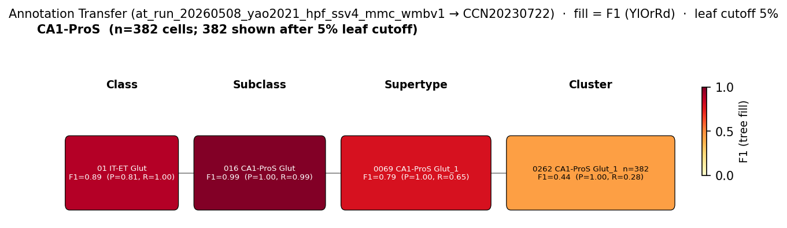

# CA1 pyramidal cell — WMBv1 (CCN20230722) Mapping Report
*2026-04-27 · Source: `/Users/do12/Documents/GitHub/BICAN_agentic_framework_planning/evidencell/kb/graphs/hippocampus/hippocampus_glutamatergic.yaml`*

---

## Introduction

CA1 pyramidal cells are the principal glutamatergic projection neurons of the
hippocampal CA1 subfield, with somata clustered in the pyramidal layer of CA1
[1][2][3][4][5]. They form one of the major excitatory output populations of the
hippocampal formation [1][4][5] and account for a substantial fraction of the
densely packed pyramidal layer cells reported to make up >90% of hippocampal
neurons [5]. Anchoring this classical population in the WMBv1 (CCN20230722)
taxonomy is a prerequisite for any downstream CA1 circuit, marker, or disease
study that wants to use the atlas as a reference.

### Classical type table

| Property | Value | References |
|---|---|---|
| Soma location | pyramidal layer of CA1 [UBERON:0014548] | [1][2][3][4][5] |
| NT type | glutamatergic | [4] |
| Markers | Wfs1 | [6][7][8][9][10] |

Details — source evidence for classical type properties

- **Soma location:** classical anatomical / multimodal literature consensus · [1][2][3][4][5]
  > we used next-generation RNA sequencing (RNA-seq) to produce a quantitative, whole genome characterization of gene expression for the major excitatory neuronal classes of the hippocampus; namely, granule cells and mossy cells of the dentate gyrus, and pyramidal cells of areas CA3, CA2, and CA1
  > — Cembrowski et al. 2016, abstract · [1] <!-- quote_key: 4875295_4a456257 -->

  > Glutamatergic neurons dominate the hippocampal architecture, accounting for over 90% of all hippocampal neurons, with pyramidal layers being densely packed with these excitatory cells (Mancini et al., 2022).
  > — Mancini et al. 2022, Classical Hippocampal Circuit Organization · [5] <!-- quote_key: 252086716_9d46d627 -->

- **NT type:** classical literature on hippocampal principal-cell glutamatergic identity · [4]
  > There are 2 types of principal cells in the hippocampal circuit: glutamatergic pyramidal cells in the Ammon's horn and subiculum regions, and glutamatergic granule cells in the DG (Figure 1). They generally have excitatory effects on the neurons to which they send axon terminals including other glutamatergic and GABAergic, as well monoaminergic [5-HT, norepinephrine (NE), dopamine (DA)], cholinergic, and histaminergic (HA) cells.
  > — Dale et al. 2015, Major Glutamatergic Cell Types in Hippocampal Subfields · [4] <!-- quote_key: 2281033_5b9805ff -->

- **Wfs1 marker:** classical / protein-level literature on hippocampal pyramidal-cell receptor and Neuroplastin-65 distribution that includes CA1 pyramidal neurons · [6][7][8][9][10]
  > Virtually all projection neurons across hippocampal subfields contain subunits from the AMPA/kainate, kainate, and NMDA receptor families, with these receptors being broadly colocalized in hippocampal neurons and even at individual dendritic spines (Siegel et al., 1995).
  > — Siegel et al. 1995, Synaptic Properties and Neurotransmitter Systems · [6] <!-- quote_key: 5468451_9958f302 -->

  > These receptor subunits show distinct distribution patterns across hippocampal regions, with GluA1 displaying diffuse staining in CA3 and strong immunoreactivity in CA1 stratum oriens and radiatum, while GluA2 shows uniform staining with greater localization to pyramidal cell bodies (Yeung et al., 2020).
  > — Yeung et al. 2020, Synaptic Properties and Neurotransmitter Systems · [7] <!-- quote_key: 210181642_fe20295e -->

  > Neuroplastin-65 positive glutamatergic neurons: These include granule neurons of the dentate gyrus, pyramidal neurons of CA1, CA2-3, subiculum, and specific layers of entorhinal cortex (Herrera-Molina et al., 2017)(Langnaese et al., 1997). Neuroplastin-65 is abundant at membranes of cell bodies, dendrites, and in punctate structures within the neuropil, and plays important roles in regulating excitatory synapse number and function (Herrera-Molina et al., 2017)(Herrera-Molina et al., 2014).
  > — Herrera-Molina et al. 2017, Specialized Glutamatergic Populations · [8] <!-- quote_key: 3288675_d83802d0 -->

  > Neuroplastin-65 positive glutamatergic neurons: These include granule neurons of the dentate gyrus, pyramidal neurons of CA1, CA2-3, subiculum, and specific layers of entorhinal cortex (Herrera-Molina et al., 2017)(Langnaese et al., 1997).
  > — Langnaese et al. 1997, Specialized Glutamatergic Populations · [9] <!-- quote_key: 20157937_a263df39 -->

  > Neuroplastin-65 is abundant at membranes of cell bodies, dendrites, and in punctate structures within the neuropil, and plays important roles in regulating excitatory synapse number and function (Herrera-Molina et al., 2017)(Herrera-Molina et al., 2014).
  > — Herrera-Molina et al. 2014, Specialized Glutamatergic Populations · [10] <!-- quote_key: 34872919_d652553e -->

No Cell Ontology term currently covers this type — candidate for a new CL term.

---

## Results

One candidate atlas supertype was assessed; 0069 CA1-ProS Glut_1 [CS20230722_SUPT_0069] is the primary mapping at MODERATE confidence under a TYPE_A_SPLITS relationship, because the classical CA1 pyramidal cell encompasses multiple CA1-ProS supertypes within the parent 016 CA1-ProS Glut subclass.

*F1 across taxonomy levels for the 1 source group (CA1-ProS, Yao 2021 SSv4) relevant to CA1 pyramidal cell. Each panel row is a source-cell group; nodes are coloured by F1 with precision (P) and recall (R) shown inline. F1 ≥ 0.5 at a level indicates a clean mapping at that resolution.*

The Yao 2021 CA1-ProS group reaches a clean mapping at SUBCLASS (016 CA1-ProS Glut, F1=0.9949) and a primary supertype assignment to 0069 CA1-ProS Glut_1 [CS20230722_SUPT_0069] (F1=0.7902); the SUPERTYPE-level drop reflects splitting across sibling supertypes within the 016 CA1-ProS Glut subclass, consistent with the TYPE_A_SPLITS framing.

### 4. Mapping candidates table

| Rank | WMBv1 cluster | Supertype | Cells (10x) | Confidence | Key property alignment | Verdict |
|---|---|---|---|---|---|---|
| 1 | — | 0069 CA1-ProS Glut_1 [CS20230722_SUPT_0069] | 13245 | 🟡 MODERATE | NT CONSISTENT · location CONSISTENT · Wfs1 CONSISTENT | Best candidate |

1 edge total; relationship: TYPE_A_SPLITS.

**Table 1 — Property comparison (0069 CA1-ProS Glut_1 [CS20230722_SUPT_0069])**

| Property | Classical | Supertype | Best cluster | Alignment |
|---|---|---|---|---|
| Soma location | pyramidal layer of CA1 [UBERON:0014548] | Field CA1, pyramidal layer (MBA:407): 2553 cells; Field CA1, stratum oriens (MBA:399): 5205 cells; Field CA1, stratum radiatum (MBA:415): 4162 cells | not assessed | CONSISTENT |
| NT type | glutamatergic | glutamatergic (016 CA1-ProS Glut) | not assessed | CONSISTENT |
| Wfs1 expression | defining marker (symbol only; expression level not populated) | not listed in 0069 CA1-ProS Glut_1 defining markers (Lefty1, Fibcd1, Pcp4l1); Wfs1 mean_expression=3.97 in 0069 CA1-ProS Glut_1 (precomputed_stats.h5, supertype level) | not assessed | CONSISTENT |
| Sex ratio | not documented | not available | not assessed | NOT_ASSESSED |

*(Child-cluster breakdown not assessed — see proposed experiments.)*

**Table 2 — Evidence support**

| Evidence | Type | Supports | Headline | Source |
|---|---|---|---|---|
| WMBv1 atlas metadata (016 CA1-ProS Glut / 0069 CA1-ProS Glut_1) | Atlas metadata | SUPPORT | 0069 CA1-ProS Glut_1 in 016 CA1-ProS Glut; 2553 cells in MBA:407 | atlas-internal |
| Yao 2021 SSv4 MapMyCells AT | Annotation transfer | SUPPORT | SUBCLASS F1=0.9949; SUPERTYPE F1=0.7902 (0069 CA1-ProS Glut_1) | atlas-internal |

### 5. Candidate paragraphs

### 0069 CA1-ProS Glut_1 [CS20230722_SUPT_0069] · 🟡 MODERATE

**Supporting evidence**

- 0069 CA1-ProS Glut_1 [CS20230722_SUPT_0069] is the highest-scoring WMBv1 supertype candidate for CA1 pyramidal cells (discovery score 5). It belongs to subclass 016 CA1-ProS Glut, the dedicated CA1/ProS glutamatergic subclass in WMBv1, and the MERFISH soma distribution places 2553 cells in Field CA1, pyramidal layer [MBA:407] — directly matching the classical CA1 stratum pyramidale soma location [UBERON:0014548]. Additional CA1-ProS cells distribute across stratum oriens [MBA:399] (5205 cells) and stratum radiatum [MBA:415] (4162 cells); these adjacent strata likely reflect MERFISH registration spread of pyramidal-layer somata across nearby compartments *(note: stratum oriens and stratum radiatum are immediately adjacent to stratum pyramidale, so this spread is consistent with a CA1 pyramidal-layer population)*.
- MapMyCells local annotation transfer of Yao 2021 (GSE185862) mouse hippocampus SSv4 CA1-ProS labels onto WMBv1 reaches F1=0.9949 at SUBCLASS (016 CA1-ProS Glut) and F1=0.7902 at SUPERTYPE with 0069 CA1-ProS Glut_1 [CS20230722_SUPT_0069] as the best target. Of 1704 source CA1-ProS cells, the cohort maps cleanly into the 016 CA1-ProS Glut subclass, with 0069 CA1-ProS Glut_1 the primary supertype recipient; target_purity ≈ 1.0 at supertype indicates that this supertype is exclusively populated by CA1-ProS cells in this dataset. Remaining CA1-ProS cells split into the neighbouring 016 CA1-ProS Glut supertypes (0070, 0072, 0071, 0073), consistent with the TYPE_A_SPLITS framing where the classical CA1 PC encompasses all CA1-ProS Glut supertypes.
- Wfs1, the classical CA1 PC defining marker, is not in the 0069 CA1-ProS Glut_1 atlas-listed defining marker set (Lefty1, Fibcd1, Pcp4l1) but shows precomputed mean expression = 3.97 at supertype level — a substantial expression level that supports the alignment rather than refuting it. The atlas marker list captures supertype-distinguishing markers; Wfs1 is broadly expressed across CA1-ProS supertypes and so does not serve as a distinguishing feature within the 016 CA1-ProS Glut subclass *(note: Wfs1 is classically described as enriched in deep CA1 PCs and broadly present across the CA1 pyramidal population — its presence at mean=3.97 here is consistent with that pan-CA1 PC expression pattern)*.

**Marker evidence provenance**

- **Wfs1**: classical marker support is mixed — direct primary citations testing Wfs1 specifically in morphologically/anatomically defined CA1 PCs are not present in this facts file; the cited references [6]–[10] are protein-level / receptor-distribution studies of hippocampal pyramidal cells and a set of papers on Neuroplastin-65 distribution that include CA1 pyramidal neurons. The atlas transcript-level value (mean=3.97 at 0069 CA1-ProS Glut_1) provides quantitative confirmation that Wfs1 is expressed in this supertype, but the literature chain for Wfs1 as a *defining* CA1 PC marker would benefit from a targeted cite-traverse for primary Wfs1 in situ / IHC studies in CA1 sublayers.

**Concerns**

- The CA1 pyramidal cell type in WMBv1 is resolved into at least four supertypes within the 016 CA1-ProS Glut subclass (the 0069 CA1-ProS Glut_1 [CS20230722_SUPT_0069] target plus the 0070–0072 siblings). This edge targets the 0069 CA1-ProS Glut_1 supertype as the primary mapping (highest discovery score; carries Fibcd1) but the full classical CA1 PC population spans all four supertypes (AMBIGUOUS_MAPPING). A complete mapping requires additional edges to the 0070, 0071, and 0072 CA1-ProS Glut supertypes.
- Sex ratio is NOT_ASSESSED at supertype level (MFR is only computed at cluster rank 0) — child-cluster breakdown was not collected for this edge.

**What would upgrade confidence**

- Resolve which CA1-ProS supertypes (0069–0072) correspond to deep vs. superficial CA1 pyramidal cell sublayers. Wfs1 marks deep-layer CA1 PCs in the literature; checking which supertype carries the highest Wfs1 expression in the atlas would resolve the sublayer correspondence.
- Run MapMyCells annotation transfer of Cembrowski 2016 (deep-vs-superficial CA1) or Zeisel 2018 dorsal CA1 pyramidal cell labels onto WMBv1 to resolve 0069–0072 CA1-ProS Glut supertype correspondence (target F1 ≥ 0.80 at SUPERTYPE for each sublayer label; expected output: AnnotationTransferEvidence on additional edges to the 0070, 0071, and 0072 CA1-ProS Glut supertypes).
- Targeted cite-traverse for primary Wfs1 in situ / IHC studies in CA1 sublayers to strengthen the marker evidence chain.

---

### Methods

Data sources, analyses, and reproducibility receipts

**Classical type definition.** The classical CA1 pyramidal cell is defined as a
glutamatergic [4] principal neuron with soma in the pyramidal layer of CA1
[UBERON:0014548] [1][2][3][4][5], and Wfs1 as a defining marker
[6][7][8][9][10]. The node's `definition_basis` is `CLASSICAL_MULTIMODAL`,
combining anatomical, neurotransmitter, and marker information from
classical/literature sources.

**Atlas mapping query.** Candidate atlas clusters were retrieved from the WMBv1
(CCN20230722) taxonomy at ranks 0 (cluster) and 1 (supertype) using
metadata-based scoring (region match, NT type, defining markers, sex bias when
applicable). Full scoring rules: `workflows/map-cell-type.md`.

**Property alignment.** Each defining property of the classical type was
compared to the corresponding atlas-side value via the `property_comparisons`
schema, with alignments graded CONSISTENT / APPROXIMATE / DISCORDANT /
NOT_ASSESSED. Atlas-side numerical values came from precomputed expression on
the cluster (cluster.yaml in the taxonomy reference store) and from MERFISH
spatial registration for soma location.

**Annotation transfer.**

| Field | Value |
|---|---|
| Source dataset | GEO:GSE185862 (CA1-ProS) |
| Source species | NCBITaxon:10090 |
| Target atlas | WMBv1 (CCN20230722) |
| Method | MapMyCells local (cell_type_mapper, default parameters, raw normalization, 100 bootstrap iterations). Per-cell labels aggregated by source_cluster_label and target taxonomy level for F1 scoring. Inputs and intermediate outputs live under research/hippocampus/glutamatergic/annotation_transfer/GSE185862_SSv4/. |
| Tool version | cell_type_mapper |
| n cells | 6398 (filtered to 6398) |
| Run record | [`kb/annotation_transfer_runs/at_run_20260508_yao2021_hpf_ssv4_mmc_wmbv1/manifest.yaml`](../../kb/annotation_transfer_runs/at_run_20260508_yao2021_hpf_ssv4_mmc_wmbv1/manifest.yaml) |
| Script (external) | README.md |
| Code reference | [https://github.com/AllenInstitute/cell_type_mapper](https://github.com/AllenInstitute/cell_type_mapper) |
| F1 matrix | [`f1_scores_best.csv`](../../kb/annotation_transfer_runs/at_run_20260508_yao2021_hpf_ssv4_mmc_wmbv1/f1_scores_best.csv) |

**Anti-hallucination.**
All citations, atlas accessions, ontology CURIEs, and verbatim literature
quotes in this report are validated against the evidencell knowledge base
at write time. Authored-prose evidence narratives are validated against
their source `evidence_items[*].explanation` fields. The pre-write hook
rejects any unresolvable identifier or unattributed blockquote. Specific
mapping limitations and caveats are documented per-candidate in the
Discussion section.

*Generated by evidencell `bb9feaf` at 2026-05-13T10:39:01+00:00 from [kb/graphs/hippocampus/hippocampus_glutamatergic.yaml](kb/graphs/hippocampus/hippocampus_glutamatergic.yaml).*

**Evidence base table**

| Edge ID | Evidence types | Supports | Source |
| --- | --- | --- | --- |
| edge_ca1_pc_hippocampus_to_supt_0069 | ATLAS_METADATA; ANNOTATION_TRANSFER | SUPPORT; SUPPORT | atlas-internal |

---

## Discussion

**Primary mapping:** CA1 pyramidal cell → 0069 CA1-ProS Glut_1 [CS20230722_SUPT_0069] at MODERATE confidence. Key support: atlas metadata (CA1 stratum pyramidale soma distribution, 016 CA1-ProS Glut subclass placement) and MapMyCells annotation transfer of Yao 2021 CA1-ProS labels (SUBCLASS F1=0.9949; SUPERTYPE F1=0.7902 onto 0069 CA1-ProS Glut_1). Key caveat: AMBIGUOUS_MAPPING — the classical CA1 PC population spans at least four CA1-ProS Glut supertypes (the 0069 target plus its 0070, 0071, and 0072 siblings) under a TYPE_A_SPLITS relationship.

No Cell Ontology term currently assigned. Candidate for CL contribution covering the CA1 pyramidal cell (and, downstream, deep- vs. superficial-CA1 PC sublayer subtypes once the 0069–0072 CA1-ProS Glut supertype correspondence is resolved).

### 7. Proposed experiments and follow-ups

The Yao 2021 SSv4 MapMyCells AT already establishes the CA1-ProS subclass-level
mapping and the primary 0069 CA1-ProS Glut_1 correspondence (SUBCLASS
F1=0.9949; SUPERTYPE F1=0.7902). What remains unresolved is sublayer
correspondence within the 016 CA1-ProS Glut subclass.

- **What:** MapMyCells annotation transfer using a sublayer-resolved CA1 PC source dataset (Cembrowski 2016 deep-vs-superficial CA1, or Zeisel 2018 dorsal CA1 pyramidal cells).
- **Target:** F1 ≥ 0.80 at SUPERTYPE level for each deep / superficial / intermediate CA1 PC source label, mapped onto the 0069–0072 CA1-ProS Glut supertypes.
- **Expected output:** AnnotationTransferEvidence on additional edges from CA1 pyramidal cell to the 0070, 0071, and 0072 CA1-ProS Glut supertypes (and refined evidence on the existing 0069 CA1-ProS Glut_1 [CS20230722_SUPT_0069] edge).
- **Resolves:** open question 1 (sublayer correspondence) and the AMBIGUOUS_MAPPING caveat on the 0069 CA1-ProS Glut_1 edge.

- **What:** targeted cite-traverse for primary Wfs1 in situ / IHC studies in CA1 sublayers.
- **Target:** at least one primary citation per Wfs1 + CA1 sublayer (deep vs. superficial) finding.
- **Expected output:** LiteratureEvidence on the classical node strengthening the Wfs1 defining-marker citation chain.
- **Resolves:** marker provenance gap noted under the 0069 CA1-ProS Glut_1 candidate.

### 8. Open questions

1. Which CA1-ProS supertypes (0069–0072) correspond to deep vs. superficial CA1 pyramidal cell sublayers? Wfs1 marks deep-layer CA1 PCs in the literature; checking which supertype carries Wfs1 in the atlas would resolve the sublayer correspondence.

---

## References

| # | Citation | PMID | Used for |
|---|---|---|---|
| [1] | Cembrowski et al. 2016 | [27113915](https://pubmed.ncbi.nlm.nih.gov/27113915/) | soma location |
| [2] | Müller & Remy 2017 | [29250747](https://pubmed.ncbi.nlm.nih.gov/29250747/) | soma location |
| [3] | https://doi.org/10.1038/s41598-017-11268-z | — | soma location |
| [4] | Dale et al. 2015 | [26346726](https://pubmed.ncbi.nlm.nih.gov/26346726/) | soma location, NT |
| [5] | Mancini et al. 2022 | [37011759](https://pubmed.ncbi.nlm.nih.gov/37011759/) | soma location |
| [6] | Siegel et al. 1995 | [7722624](https://pubmed.ncbi.nlm.nih.gov/7722624/) | Wfs1 marker |
| [7] | Yeung et al. 2020 | [32009891](https://pubmed.ncbi.nlm.nih.gov/32009891/) | Wfs1 marker |
| [8] | Herrera-Molina et al. 2017 | [28779130](https://pubmed.ncbi.nlm.nih.gov/28779130/) | Wfs1 marker |
| [9] | Langnaese et al. 1997 | [8995369](https://pubmed.ncbi.nlm.nih.gov/8995369/) | Wfs1 marker |
| [10] | Herrera-Molina et al. 2014 | [24554721](https://pubmed.ncbi.nlm.nih.gov/24554721/) | Wfs1 marker |
