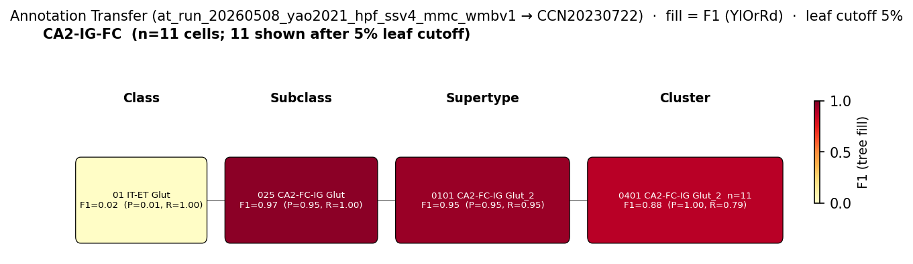

# CA2 pyramidal cell — WMBv1 (CCN20230722) Mapping Report

## Introduction

CA2 pyramidal cells are a molecularly and functionally distinct population of glutamatergic principal neurons occupying the pyramidal layer of hippocampal area CA2, positioned between CA3 and CA1 and characterised by high co-expression of *Pcp4*, *Rgs14*, and *Amigo2* — markers that are specifically or more prominently expressed in CA2 relative to neighbouring subfields [4][5]. Together with CA1 and CA3 pyramidal cells they form the glutamatergic backbone of Ammon's horn; hippocampal principal cells are glutamatergic with excitatory effects on a wide range of downstream targets [3].

---

### Classical type table

| Property | Value | References |
|---|---|---|
| Soma location | Pyramidal layer of CA2 [UBERON:0014549] | [1][2] |
| NT type | Glutamatergic | [3] |
| Defining markers | Pcp4, Rgs14, Amigo2 | Pcp4: [4]; Rgs14: [4][5]; Amigo2: [5] |
| Negative markers | — | — |
| Neuropeptides | — | — |

Details — source evidence for classical type properties

**Soma location — pyramidal layer of CA2 [UBERON:0014549]**

- Cembrowski et al. 2016 profiled transcriptomes at dorsal and ventral poles of hippocampal subfields, providing a cell-class- and region-specific transcriptional description for CA2 pyramidal cells among other excitatory classes [1].

> "we profiled transcriptomes at both dorsal and ventral poles, producing a cell-class- and region-specific transcriptional description for these populations"
> — Cembrowski et al. 2016, abstract · [1] <!-- quote_key: 4875295_8cb069d9 -->

- Unknown 2021 [2] notes the anatomical distribution of CA2 pyramidal cells in the context of hippocampal circuit organisation, including some cell bodies near the CA3c region.

> "For CA2, we identified some pyramidal cells at the CA3c region while others distributed along the intermediate (CA3b) and distal (CA3a) subregions (Sanchez-Aguilera et al., 2021)."
> — Unknown 2021, Classical Hippocampal Circuit Organization · [2] <!-- quote_key: 233984943_56acd5f8 -->

**NT type — glutamatergic**

- Dale et al. 2015 establish glutamatergic identity for all hippocampal pyramidal cells [3].

> "There are 2 types of principal cells in the hippocampal circuit: glutamatergic pyramidal cells in the Ammon's horn and subiculum regions, and glutamatergic granule cells in the DG (Figure 1). They generally have excitatory effects on the neurons to which they send axon terminals including other glutamatergic and GABAergic, as well monoaminergic [5-HT, norepinephrine (NE), dopamine (DA)], cholinergic, and histaminergic (HA) cells."
> — Dale et al. 2015, Major Glutamatergic Cell Types in Hippocampal Subfields · [3] <!-- quote_key: 2281033_5b9805ff -->

**Defining markers — Pcp4, Rgs14, Amigo2**

- Unknown 2014 [4] identified Pcp4 (PCP4) by immunostaining as a marker that delineates the CA3/CA2 and CA2/CA1 borders in mouse, and listed Rgs14 among a set of markers specifically expressed in the distal regio inferior corresponding to CA2.

> "Here we report identification of the CA2 region in the mouse by immunostaining with a Purkinje cell protein 4 (PCP4) antibody, which effectively delineates CA3/CA2 and CA2/CA1 borders and agrees well with previous cytoarchitectural definitions of CA2"
> — Unknown 2014, abstract · [4] <!-- quote_key: 18746823_614030d2 -->

> "These markers include Purkinje cell protein 4 (PCP4), neurotrophin 3, fibroblast growth factor, a-actinin 2, adenosine A1 receptor, vasopressin 1b receptor, RGS14 (regulator of G-protein signaling 14), and amigo2. These markers are specifically or more prominently expressed in the distal portion of regio inferior corresponding roughly to Lorente de N o's CA2"
> — Unknown 2014, Introduction · [4] <!-- quote_key: 18746823_8ba0bf29 -->

- Unknown 2012 [5] reports transcript-level enrichment of Rgs14, Amigo2, and Pcp4 in CA2 based on in situ hybridisation and expression data.

> "a number of genes, including the regulator of G-protein signaling 14 (RGS14), Amigo2, PCP4, TARP5, FGF5, and several adenylyl cyclases (e.g., adcy1, adcy5, and adcy6), are highly expressed in CA2"
> — Unknown 2012, Introduction · [5] <!-- quote_key: 20853920_44ab38bb -->

### Cell Ontology mapping

No Cell Ontology term currently covers this type — candidate for a new CL term. A new-term request is warranted, covering the CA2 pyramidal cell as a molecularly distinct subclass of Ammon's horn glutamatergic principal neuron, distinguished by Pcp4, Rgs14, and Amigo2 co-expression.

---

## Results

One candidate identified: 0100 CA2-FC-IG Glut_1 [CS20230722_SUPT_0100] at MODERATE confidence under a PARTIAL_OVERLAP relationship. Annotation transfer of the Yao 2021 HPF SMART-Seq v4 dataset (GEO:GSE185862) maps the CA2-IG-FC source label with strong subclass fidelity (F1=0.973 to subclass 025 CA2-FC-IG Glut at SUBCLASS level); however, the AT result is PARTIAL at supertype level and must be interpreted with care given the mixed nature of the source label — see the CA2-IG-FC label caveat below and in the candidate section.

**CRITICAL CAVEAT — CA2-IG-FC label contamination:** The Yao 2021 CA2-IG-FC source label is a mixed label that includes fasciola cinerea (FC) and induseum griseum (IG) cells alongside CA2 pyramidal cells. Consequently, 94.7% of cells map to 0101 CA2-FC-IG Glut_2 (F1=0.947 at SUPERTYPE level) — a supertype with 0 cells in the CA2 pyramidal layer in MERFISH data, dominated instead by Fasciola cinerea (175 cells) and Induseum griseum (61 cells). Only 5.3% of cells map to SUPT_0100 (F1=0.1). This AT result does not refute SUPT_0100 as the correct CA2 pyramidal cell target; it reflects the FC/IG component of the mixed label. SUPT_0100 has 446 MERFISH cells in Field CA2, pyramidal layer (MBA:446) and expresses all three canonical CA2 markers at the atlas precomputed level. A CA2-specific dataset without FC/IG label contamination is required for definitive supertype-level AT.

**Annotation-transfer figure**

*F1 across taxonomy levels for the CA2-IG-FC source group relevant to CA2 pyramidal cell. Each panel row is a source-cell group; nodes are coloured by F1 with precision (P) and recall (R) shown inline. F1 ≥ 0.5 at a level indicates a clean mapping at that resolution. Note: the dominant supertype target (0101 CA2-FC-IG Glut_2) reflects FC/IG contamination in the mixed CA2-IG-FC source label, not a failure of SUPT_0100 as the CA2 pyramidal cell candidate.*

### Candidate overview table

| WMBv1 target | Accession | Confidence | Relationship | Verdict |
|---|---|---|---|---|
| 0100 CA2-FC-IG Glut_1 | CS20230722_SUPT_0100 | 🟡 MODERATE | PARTIAL_OVERLAP | Best candidate |

### Table 1: Property comparison — 0100 CA2-FC-IG Glut_1 [CS20230722_SUPT_0100]

| Property | Classical type | WMBv1 SUPT_0100 | Alignment |
|---|---|---|---|
| NT type | Glutamatergic | Glutamatergic (subclass 025 CA2-FC-IG Glut) | CONSISTENT |
| Soma location | Pyramidal layer of CA2 [UBERON:0014549] | Field CA2, pyramidal layer (MBA:446): 446 cells; Field CA1, stratum oriens (MBA:399): 292 cells; Field CA3, stratum oriens (MBA:486): 215 cells; Field CA3, pyramidal layer (MBA:495): 165 cells; Field CA2, stratum radiatum (MBA:454): 55 cells | APPROXIMATE |
| Marker — Pcp4 | Defining marker | Not listed in SUPT_0100 defining markers (Lefty1, Il16, Etv1); mean expression = 11.26 (precomputed_stats.h5, supertype level) | CONSISTENT |
| Marker — Rgs14 | Defining marker | Not listed in SUPT_0100 defining markers; mean expression = 8.84 (precomputed_stats.h5, supertype level) | CONSISTENT |
| Marker — Amigo2 | Defining marker | Not listed in SUPT_0100 defining markers; mean expression = 7.39 (precomputed_stats.h5, supertype level) | CONSISTENT |

*(note: SUPT_0100 shows substantial cell counts in CA1 and CA3 strata in addition to the CA2 pyramidal layer. CA1 and CA3 flank CA2 directly in the hippocampal formation — this off-target signal may reflect MERFISH registration noise at subfield borders or genuine inclusion of transitional CA3c/CA1-proximal pyramidal cells that share the CA2 transcriptomic signature. Location alignment is graded APPROXIMATE because the CA2 pyramidal layer count of 446 cells is accompanied by comparable or greater counts in flanking strata.)*

### Table 2: Evidence support

| Evidence type | Supports | Summary |
|---|---|---|
| ATLAS_METADATA | SUPPORT | SUPT_0100 in subclass 025 CA2-FC-IG Glut; 446 MERFISH cells in CA2 pyramidal layer (MBA:446); Pcp4, Rgs14, Amigo2 all expressed at supertype level |
| ANNOTATION_TRANSFER (subclass) | SUPPORT | Subclass F1=0.973; 18/19 CA2-IG-FC cells map to subclass 025 CA2-FC-IG Glut |
| ANNOTATION_TRANSFER (supertype) | PARTIAL | Dominant supertype target is 0101 CA2-FC-IG Glut_2 (F1=0.947), not SUPT_0100 (F1=0.1); driven by FC/IG label contamination in source; does not refute SUPT_0100 |

### 0100 CA2-FC-IG Glut_1 [CS20230722_SUPT_0100] · 🟡 MODERATE

SUPT_0100 [CS20230722_SUPT_0100] is the highest-scoring WMBv1 supertype candidate for the CA2 pyramidal cell (discovery score 4). It belongs to the 025 CA2-FC-IG Glut subclass, a subclass that groups CA2 together with the fasciola cinerea and induseum griseum. Atlas MERFISH data assign 446 cells to Field CA2, pyramidal layer (MBA:446), directly matching the classical CA2 soma location [UBERON:0014549]. All three canonical CA2 PC markers are confirmed by precomputed atlas expression: Pcp4 (mean 11.26), Rgs14 (mean 8.84), and Amigo2 (mean 7.39) — none appears as a cluster-discriminating marker within the subclass (supertype-level discriminators are Lefty1, Il16, Etv1), consistent with broad expression across the CA2-FC-IG grouping rather than subtype-specific enrichment. Annotation transfer at subclass level strongly supports membership in the 025 CA2-FC-IG Glut subclass (F1=0.973, 18/19 cells); supertype-level AT is confounded by the FC/IG composition of the Yao 2021 source label and maps to 0101 CA2-FC-IG Glut_2 rather than SUPT_0100 — this is a source-label contamination issue, not evidence against SUPT_0100.

**Supporting evidence:**
- NT type CONSISTENT: SUPT_0100 belongs to the 025 CA2-FC-IG Glut subclass, exclusively glutamatergic.
- Soma location APPROXIMATE: 446 MERFISH cells in Field CA2, pyramidal layer (MBA:446); flanking CA1 stratum oriens (292 cells) and CA3 strata (380 cells combined) are comparable in count and may reflect registration noise at subfield borders.
- Pcp4 expressed: mean expression = 11.26 in precomputed_stats.h5 at supertype level.
- Rgs14 expressed: mean expression = 8.84 in precomputed_stats.h5 at supertype level.
- Amigo2 expressed: mean expression = 7.39 in precomputed_stats.h5 at supertype level.
- Subclass-level AT F1=0.973 (18/19 CA2-IG-FC cells map to subclass 025 CA2-FC-IG Glut).

**Concerns:**
- Supertype-level AT maps 94.7% of Yao CA2-IG-FC cells to 0101 CA2-FC-IG Glut_2 (F1=0.947), not SUPT_0100 (F1=0.1). MERFISH anatomy for 0101 CA2-FC-IG Glut_2 shows 0 cells in CA2 pyramidal layer (MBA:446), dominated instead by Fasciola cinerea (175 cells) and Induseum griseum (61 cells). This discordance is a source-label contamination artefact: Yao's CA2-IG-FC label includes FC/IG cells, which map to the FC/IG-enriched atlas supertype 0101 CA2-FC-IG Glut_2.
- SUPT_0100 name explicitly includes FC (fasciola cinerea) and IG (induseum griseum) alongside CA2; classical CA2 pyramidal cells are distinct from FC/IG neurons. The PARTIAL_OVERLAP relationship reflects this anatomical co-grouping in the atlas.
- The CA2 pyramidal layer count (446 cells) in SUPT_0100 is accompanied by substantial off-target CA1/CA3 signal; anatomical specificity is APPROXIMATE.

**What would upgrade confidence:** Annotation transfer from a CA2-specific scRNA-seq dataset (without FC/IG cells) achieving F1 ≥ 0.80 at supertype level for SUPT_0100, combined with FISH validation of Rgs14 or Amigo2 in CA2 cells assigned to SUPT_0100 by MERFISH, would resolve the supertype-level ambiguity and upgrade confidence to HIGH.

---

## Methods

Data sources, analyses, and reproducibility receipts

**Classical type definition.** CA2 pyramidal cell defined by soma in the pyramidal layer of CA2 [UBERON:0014549] and glutamatergic NT type, with Pcp4, Rgs14, and Amigo2 as defining markers. Definition basis: CLASSICAL_MULTIMODAL. Sources: [1][2][3][4][5].

**Atlas mapping query.** Candidate atlas clusters were retrieved from WMBv1 (CCN20230722) at ranks 0 and 1 using metadata-based scoring.

**Property alignment.** Each defining property was compared via the property_comparisons schema, graded CONSISTENT / APPROXIMATE / DISCORDANT / NOT_ASSESSED.

**Annotation transfer.**

| Field | Value |
|---|---|
| Source dataset | GEO:GSE185862 (CA2-IG-FC) |
| Source species | NCBITaxon:10090 |
| Target atlas | WMBv1 (CCN20230722) |
| Method | MapMyCells local (cell_type_mapper, default parameters, raw normalization, 100 bootstrap iterations). Per-cell labels aggregated by source_cluster_label and target taxonomy level for F1 scoring. |
| Tool version | cell_type_mapper |
| n cells | 19 (CA2-IG-FC source group) |
| Run record | [`kb/annotation_transfer_runs/at_run_20260508_yao2021_hpf_ssv4_mmc_wmbv1/manifest.yaml`](../../kb/annotation_transfer_runs/at_run_20260508_yao2021_hpf_ssv4_mmc_wmbv1/manifest.yaml) |
| Code reference | [https://github.com/AllenInstitute/cell_type_mapper](https://github.com/AllenInstitute/cell_type_mapper) |
| F1 matrix | [`f1_scores_best.csv`](../../kb/annotation_transfer_runs/at_run_20260508_yao2021_hpf_ssv4_mmc_wmbv1/f1_scores_best.csv) |

**Anti-hallucination.** All citations, atlas accessions, ontology CURIEs, and verbatim literature quotes in this report are validated against the evidencell knowledge base at write time. Authored-prose evidence narratives are validated against their source evidence_items[*].explanation fields. The pre-write hook rejects any unresolvable identifier or unattributed blockquote. Specific mapping limitations and caveats are documented per-candidate in the Discussion section.

*Report generated 2026-05-19T10:45:50+00:00. Framework commit: 07c6dbd. KB graph: `kb/graphs/hippocampus/hippocampus_glutamatergic.yaml`.*

**Evidence base table**

| Evidence type | Count |
|---|---|
| ATLAS_METADATA | 1 |
| ANNOTATION_TRANSFER | 1 |

---

## Discussion

**Primary mapping:** CA2 pyramidal cell → 0100 CA2-FC-IG Glut_1 [CS20230722_SUPT_0100] at MODERATE confidence under a PARTIAL_OVERLAP relationship. Key support: consistent glutamatergic identity, 446 MERFISH cells in the CA2 pyramidal layer (MBA:446), confirmed expression of all three canonical CA2 markers (Pcp4 mean 11.26, Rgs14 mean 8.84, Amigo2 mean 7.39) in precomputed atlas statistics, and strong subclass-level annotation transfer (F1=0.973 to subclass 025 CA2-FC-IG Glut). Key caveats: the PARTIAL_OVERLAP relationship reflects the atlas co-grouping of CA2 with fasciola cinerea and induseum griseum in the 025 CA2-FC-IG Glut subclass; Yao's CA2-IG-FC source label is a mixed label whose FC/IG component maps to 0101 CA2-FC-IG Glut_2 at supertype level (F1=0.947), not to SUPT_0100 (F1=0.1) — this does not refute SUPT_0100 but means AT provides only PARTIAL support at supertype level; location alignment is APPROXIMATE due to comparable off-target CA1/CA3 strata cell counts; no CL term is currently assigned and a new-term request is warranted.

### Proposed experiments

**Annotation transfer (CA2-specific dataset)**
- Run MapMyCells annotation transfer to WMBv1 (CCN20230722) using a source dataset with clean CA2 pyramidal cell labels without FC or IG cells. Target: F1 ≥ 0.80 at supertype level for SUPT_0100. Resolves the SUPT_0100 vs. 0101 CA2-FC-IG Glut_2 disambiguation that the mixed CA2-IG-FC label cannot address.

**Expression cross-check via precomputed stats**
- Check precomputed expression for Rgs14 and Pcp4 in SUPT_0100 via `just add-expression` to quantify the CA2 PC marker signal within the supertype and evaluate whether this distinguishes SUPT_0100 from 0101 CA2-FC-IG Glut_2 at the molecular level.

**FISH / spatial validation**
- FISH validation of Rgs14 or Amigo2 in CA2 cells assigned to SUPT_0100 by MERFISH, with assessment of off-target signal in CA1/CA3 strata. Resolves the APPROXIMATE location alignment and determines whether off-target strata cells reflect registration noise or genuine border pyramidal cells.

### Open questions

1. Do SUPT_0100 cells in CA1 and CA3 strata represent genuine pyramidal neurons (e.g. deep CA3c cells near the CA2 border) or MERFISH registration errors? FISH validation of Rgs14 or Amigo2 in CA2 cells assigned to SUPT_0100 would clarify.
2. Is there a CA2-specific transcriptomic dataset — without FC or IG label contamination — available for definitive annotation transfer to resolve the SUPT_0100 vs. 0101 CA2-FC-IG Glut_2 supertype correspondence?
3. What distinguishes SUPT_0100 from 0101 CA2-FC-IG Glut_2 at the molecular level beyond MERFISH anatomical distribution?
4. Should the CL term for the CA2 pyramidal cell be defined by Pcp4/Rgs14/Amigo2 co-expression, by anatomical criteria (soma in CA2 stratum pyramidale), or by both?

---

## References

| # | Citation | PMID | Used for |
|---|---|---|---|
| [1] | Cembrowski et al. 2016 | [27113915](https://pubmed.ncbi.nlm.nih.gov/27113915/) | soma location |
| [2] | Unknown 2021 | [33956790](https://pubmed.ncbi.nlm.nih.gov/33956790/) | soma location |
| [3] | Dale et al. 2015 | [26346726](https://pubmed.ncbi.nlm.nih.gov/26346726/) | NT type |
| [4] | Unknown 2014 | [24166578](https://pubmed.ncbi.nlm.nih.gov/24166578/) | Pcp4 marker; Rgs14 marker |
| [5] | Unknown 2012 | [22904370](https://pubmed.ncbi.nlm.nih.gov/22904370/) | Amigo2 marker; Rgs14 marker |
