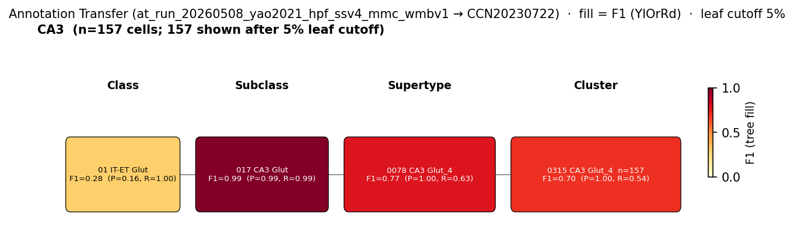

# CA3 pyramidal cell — WMBv1 (CCN20230722) Mapping Report
*2026-04-27 · Source: `/Users/do12/Documents/GitHub/BICAN_agentic_framework_planning/evidencell/kb/graphs/hippocampus/hippocampus_glutamatergic.yaml`*

---

## Introduction

The CA3 pyramidal cell is the principal glutamatergic neuron of the Ammon's horn CA3 subfield, with soma residing in the CA3 pyramidal layer and broad excitatory output onto downstream hippocampal and extra-hippocampal targets [3]. Quantitative whole-genome RNA-seq has characterised the major excitatory neuronal classes of the hippocampus — including dentate granule cells, dentate mossy cells, and pyramidal cells of CA3, CA2, and CA1 [1] — so the classical CA3 PC sits within a well-established transcriptomic landscape that the WMBv1 atlas should recover.

### Classical type table

| Property | Value | References |
|---|---|---|
| Soma location | pyramidal layer of CA3 [UBERON:0014550] (CA3 stratum pyramidale) | [1], [2] |
| NT | glutamatergic | [3] |

Details — source evidence for classical type properties

- **Soma location:** Cembrowski et al. 2016 · [1]
  > we used next-generation RNA sequencing (RNA-seq) to produce a quantitative, whole genome characterization of gene expression for the major excitatory neuronal classes of the hippocampus; namely, granule cells and mossy cells of the dentate gyrus, and pyramidal cells of areas CA3, CA2, and CA1
  > — Cembrowski et al. 2016, abstract · [1] <!-- quote_key: 4875295_4a456257 -->
- **Soma location:** Wheeler et al. 2015 · [2]
  > Hippocampome.org is a comprehensive knowledge base of neuron types in the rodent hippocampal formation (dentate gyrus, CA3, CA2, CA1, subiculum, and entorhinal cortex)
  > — Wheeler et al. 2015, abstract · [2] <!-- quote_key: 631148_edb9eac6 -->
- **NT type:** Dale et al. 2015 · [3]
  > There are 2 types of principal cells in the hippocampal circuit: glutamatergic pyramidal cells in the Ammon's horn and subiculum regions, and glutamatergic granule cells in the DG (Figure 1). They generally have excitatory effects on the neurons to which they send axon terminals including other glutamatergic and GABAergic, as well monoaminergic [5-HT, norepinephrine (NE), dopamine (DA)], cholinergic, and histaminergic (HA) cells.
  > — Dale et al. 2015, Major Glutamatergic Cell Types in Hippocampal Subfields · [3] <!-- quote_key: 2281033_5b9805ff -->

No Cell Ontology term currently covers this type — candidate for a new CL term.

---

## Results

One candidate atlas supertype was assessed; SUPT_0078 (0078 CA3 Glut_4) is the primary mapping at MODERATE confidence, with the remaining four supertypes of the CA3 Glut subclass receiving the residual CA3 cells in a TYPE_A_SPLITS pattern.

*F1 across taxonomy levels for the 1 source group (CA3) relevant to CA3 pyramidal cell. Each panel row is a source-cell group; nodes are coloured by F1 with precision (P) and recall (R) shown inline. F1 ≥ 0.5 at a level indicates a clean mapping at that resolution.* The CA3 Glut subclass is near-perfect at the subclass level (F1=0.994); at supertype resolution SUPT_0078 dominates (F1=0.775) with the remaining CA3 cells splitting across SUPT_0075–0077 and SUPT_0079.

### Mapping candidates table

| Rank | WMBv1 cluster | Supertype | Cells (10x) | Confidence | Key property alignment | Verdict |
|---|---|---|---:|---|---|---|
| 1 | 0078 CA3 Glut_4 [CS20230722_SUPT_0078] | 0078 CA3 Glut_4 | 5709 | 🟡 MODERATE | NT CONSISTENT · location CONSISTENT | Best candidate |

Total: 1 edge, relationship `TYPE_A_SPLITS`.

**Property comparison (SUPT_0078)**

| Property | Classical | Supertype | Best cluster | Alignment |
|---|---|---|---|---|
| NT type | glutamatergic | glutamatergic (CA3 Glut subclass) | not assessed | CONSISTENT |
| Soma location | CA3 stratum pyramidale [UBERON:0014550] (SOMA) | Field CA3, pyramidal layer [MBA:495] 1467 cells; Field CA3, stratum oriens [MBA:486] 1381; Field CA3, stratum radiatum [MBA:504] 945; Field CA3, stratum lucidum [MBA:479] 868; Field CA3, stratum lacunosum-moleculare [MBA:471] 437 | not assessed | CONSISTENT |
| Sex ratio | not documented | not available | not available | NOT_ASSESSED |

**Evidence support**

| Evidence | Type | Supports | Headline | Source |
|---|---|---|---|---|
| WMBv1 atlas metadata (SUPT_0078) | Atlas metadata | SUPPORT | CA3 Glut subclass; soma exclusively CA3 strata; markers Homer3, Cldn22 | atlas-internal |
| Yao 2021 MapMyCells AT | Annotation transfer | SUPPORT | F1=0.775 at supertype; 63.0% of CA3 cells map to SUPT_0078 | atlas-internal |

*(Child-cluster breakdown not assessed — see proposed experiments.)*

### 0078 CA3 Glut_4 · 🟡 MODERATE

**Supporting evidence**

- WMBv1 atlas metadata shows SUPT_0078 belongs to the dedicated CA3 glutamatergic subclass (017 CA3 Glut). MERFISH anatomy is exclusively CA3: pyramidal layer [MBA:495] (1467 cells), stratum oriens [MBA:486] (1381), stratum radiatum [MBA:504] (945), stratum lucidum [MBA:479] (868), stratum lacunosum-moleculare [MBA:471] (437); no off-target compartments. Defining atlas markers: Homer3, Cldn22.
- MapMyCells local annotation transfer of Yao 2021 (GSE185862) SSv4 CA3 labels onto WMBv1 [CS20230722_SUPT_0078] reaches F1=0.775 at the supertype level (group_purity=0.630, target_purity=1.0). Target_purity=1.0 confirms SUPT_0078 receives only CA3-labelled cells; the remaining 119/322 CA3 cells split across SUPT_0075 (16.8%), SUPT_0077 (11.5%), SUPT_0076 (6.5%) and SUPT_0079 (1.6%) — the TYPE_A_SPLITS signature. At subclass level (017 CA3 Glut) F1 rises to 0.994.

**Marker evidence provenance**

- No defining markers, negative markers, or neuropeptides are recorded on the classical node; the classical definition rests on soma location and NT type alone. Atlas-side markers (Homer3, Cldn22) are listed on SUPT_0078 but have no classical counterpart to cross-check. *(note: targeted curation of primary-literature markers for CA3 PC would strengthen alignment beyond location/NT — for now, marker comparison cannot be performed.)*

**Concerns**

- AMBIGUOUS_MAPPING: the CA3 Glut subclass contains five supertypes (SUPT_0075–0079) and the classical CA3 PC distributes across all of them in a TYPE_A_SPLITS pattern. SUPT_0078 captures 63.0% of CA3 cells; the remaining 34.8% across SUPT_0075–0077 (and 1.6% on SUPT_0079) likely correspond to CA3 sublayer subtypes (CA3a/b/c) that are not resolved by this evidence. *(note: CA3a/b/c is a proximal-to-distal sublayer organisation along Ammon's horn — interpretation drawn from CA3 anatomy, not stated in the facts.)*

**What would upgrade confidence**

- AnnotationTransferEvidence using a CA3 sublayer-resolved source dataset (CA3a/b/c labels) targeting F1 ≥ 0.80 at the supertype level for each sublayer; expected to assign SUPT_0075, 0076, 0077 to sublayer identities and to clarify the relationship of SUPT_0078 vs 0075–0077.
- Targeted literature curation of primary-literature CA3 PC markers (beyond location + NT) to enable marker-level property comparison against SUPT_0078 (Homer3, Cldn22) and its sibling supertypes.

---

### Methods

Data sources, analyses, and reproducibility receipts

**Classical type definition.** The CA3 pyramidal cell is defined by soma in the CA3 stratum pyramidale [UBERON:0014550] [1][2] and glutamatergic neurotransmitter identity [3]. `definition_basis` = CLASSICAL_MULTIMODAL; no defining markers or neuropeptides are currently recorded on the node.

**Atlas mapping query.** Candidate atlas clusters were retrieved from the WMBv1 taxonomy (CCN20230722) at ranks 0 (cluster) and 1 (supertype) using metadata-based scoring (region match, NT type, defining markers, sex bias when applicable). Full scoring rules: `workflows/map-cell-type.md`.

**Property alignment.** Each defining property of the classical type was compared to the corresponding atlas-side value via the `property_comparisons` schema, with alignments graded CONSISTENT / APPROXIMATE / DISCORDANT / NOT_ASSESSED. Atlas-side numerical values came from precomputed expression on the cluster (cluster.yaml in the taxonomy reference store) and from MERFISH spatial registration for soma location.

**Annotation transfer.**

| Field | Value |
|---|---|
| Source dataset | GEO:GSE185862 (Yao 2021 mouse hippocampal formation SMART-Seq v4 cell type labels, Allen Institute taxonomy) |
| Source species | NCBITaxon:10090 |
| Target atlas | WMBv1 (CCN20230722) |
| Method | MapMyCells local (cell_type_mapper, default parameters, raw normalization, 100 bootstrap iterations). Per-cell labels aggregated by source_cluster_label and target taxonomy level for F1 scoring. |
| Tool version | cell_type_mapper |
| Bootstrap threshold | 0.0 |
| n cells | 6398 (filtered to 6398) |
| Run record | [`kb/annotation_transfer_runs/at_run_20260508_yao2021_hpf_ssv4_mmc_wmbv1/manifest.yaml`](../../kb/annotation_transfer_runs/at_run_20260508_yao2021_hpf_ssv4_mmc_wmbv1/manifest.yaml) |
| Script (external) | README.md |
| Code reference | [https://github.com/AllenInstitute/cell_type_mapper](https://github.com/AllenInstitute/cell_type_mapper) |
| F1 matrix | [`f1_scores_best.csv`](../../kb/annotation_transfer_runs/at_run_20260508_yao2021_hpf_ssv4_mmc_wmbv1/f1_scores_best.csv) |

**Anti-hallucination.** All citations, atlas accessions, ontology CURIEs, and verbatim literature quotes in this report are validated against the evidencell knowledge base at write time. Authored-prose evidence narratives are validated against their source `evidence_items[*].explanation` fields. The pre-write hook rejects any unresolvable identifier or unattributed blockquote. Specific mapping limitations and caveats are documented per-candidate in the Discussion section.

*Generated by evidencell `01f89d6` at 2026-05-13T15:46:13+00:00 from [kb/graphs/hippocampus/hippocampus_glutamatergic.yaml](kb/graphs/hippocampus/hippocampus_glutamatergic.yaml).*

**Evidence base table**

| Edge ID | Evidence types | Supports | Source |
| --- | --- | --- | --- |
| edge_ca3_pc_hippocampus_to_supt_0078 | ATLAS_METADATA; ANNOTATION_TRANSFER | SUPPORT; SUPPORT | atlas-internal |

---

## Discussion

**Primary mapping:** CA3 pyramidal cell → 0078 CA3 Glut_4 [CS20230722_SUPT_0078] at MODERATE confidence. Key support: ATLAS_METADATA (CA3-exclusive MERFISH anatomy in the CA3 Glut subclass) and ANNOTATION_TRANSFER (Yao 2021 SSv4 CA3 labels, F1=0.775 at supertype, 0.994 at subclass). Key caveat: AMBIGUOUS_MAPPING — the classical CA3 PC splits across all five supertypes of the CA3 Glut subclass, with sublayer (CA3a/b/c) correspondence unresolved.

No Cell Ontology term currently assigned. Candidate for a new CL term covering the CA3 pyramidal cell as a region-specific principal glutamatergic type of Ammon's horn.

### Proposed experiments and follow-ups

- **What:** Annotation transfer from a CA3 sublayer-resolved scRNA-seq dataset onto WMBv1.
  **Target:** F1 ≥ 0.80 at the supertype level for each of CA3a, CA3b, CA3c.
  **Expected output:** AnnotationTransferEvidence assigning sublayer identities to SUPT_0075, SUPT_0076, SUPT_0077 and clarifying whether SUPT_0078 represents a sublayer-orthogonal CA3 PC core or one specific sublayer subset.
  **Resolves:** Open question 1; AMBIGUOUS_MAPPING caveat on edge_ca3_pc_hippocampus_to_supt_0078. *(note: refines — rather than duplicates — the existing Yao 2021 AT run, which lacked sublayer-level source labels.)*
- **What:** Targeted primary-literature curation of CA3 PC defining markers.
  **Target:** ≥ 2 primary-literature markers with morphology-confirmed or Cre-targeted CA3 PC sourcing.
  **Expected output:** Updated LiteratureEvidence and `defining_markers` entries on `ca3_pc_hippocampus`, enabling marker-level property comparison against SUPT_0078 (currently Homer3, Cldn22 are atlas-side only).
  **Resolves:** Marker-evidence gap noted above.

### Open questions

1. Do SUPT_0075, SUPT_0076, SUPT_0077 correspond to CA3a, CA3b, CA3c sublayers respectively, or to other organisational principles (e.g. proximal vs. distal mossy fiber input zone)?

---

## References

| # | Citation | PMID | Used for |
|---|---|---|---|
| [1] | Cembrowski et al. 2016 | [27113915](https://pubmed.ncbi.nlm.nih.gov/27113915/) | soma location |
| [2] | Wheeler et al. 2015 | [26402459](https://pubmed.ncbi.nlm.nih.gov/26402459/) | soma location |
| [3] | Dale et al. 2015 | [26346726](https://pubmed.ncbi.nlm.nih.gov/26346726/) | neurotransmitter type |
