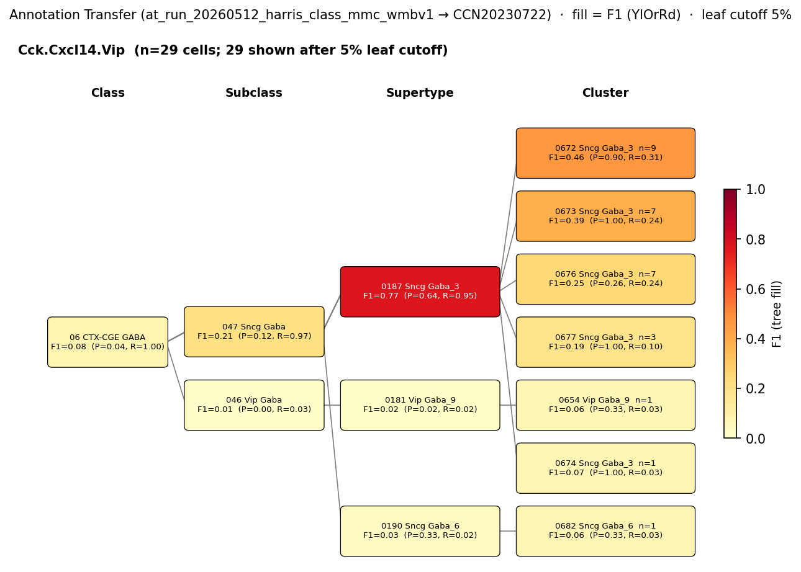

# Cholecystokinin-positive basket cell — WMBv1 (CCN20230722) Mapping Report
*2026-04-09 · Source: `kb/graphs/hippocampus/hippocampus_GABAergic_interneurons.yaml`*

---

## Introduction

Cholecystokinin (CCK)-positive basket cells are GABAergic perisomatic-targeting
interneurons of the hippocampus that co-express the type-1 cannabinoid receptor
(Cnr1/CB1R) and form a major non-PV inhibitory population innervating the somata
and proximal dendrites of CA1/CA3 pyramidal neurons [5]. They are CGE-derived,
sit predominantly in CA1 stratum pyramidale [1][2][3][4], and are functionally
counterposed to parvalbumin (Pvalb)-positive basket cells, with which they share
target compartments but differ in firing pattern, modulatory tuning, and
molecular identity [3][5][6]. Resolving how this classically defined population
aligns to the WMBv1 transcriptomic taxonomy clarifies which Sncg/Vip supertype
in the atlas captures the CCK/CB1R basket cell identity — a placement that is
not directly readable from atlas defining-marker metadata alone.

### Classical type table

| Property | Value | References |
|---|---|---|
| Soma location | pyramidal layer of CA1 [UBERON:0014548] (name in source: CA1 stratum pyramidale) | [1][2][3][4] |
| NT | GABAergic | [3] |
| Markers | Cck; Cnr1; Vglut3 | Cck: [5][2][4][6][7]; Cnr1: [5] |
| Negative markers | Pvalb | — |
| Neuropeptides | Cck | [5] |
| CL term | basket cell [CL:0000118] (BROAD) | — |

Details — source evidence for classical type properties

- **Cck (defining marker):** literature attestation across multiple primary studies · [5][2][4][6][7]
  > To understand the functional significance and mechanisms of action in the CNS of endogenous and exogenous cannabinoids, it is crucial to identify the neural elements that serve as the structural substrate of these actions. We used a recently developed antibody against the CB1 cannabinoid receptor to study this question in hippocampal networks. Interneurons with features typical of basket cells showed a selective, intense staining for CB1 in all hippocampal subfields and layers. Most of them (85.6%) contained cholecystokinin (CCK), which corresponded to 96.9% of all CCK-positive interneurons, whereas only 4.6% of the parvalbumin (PV)- containing basket cells expressed CB1. Accordingly, electron microscopy revealed that CB1-immunoreactive axon terminals of CCK- containing basket cells surrounded the somata and proximal dendrites of pyramidal neurons, whereas PV-positive basket cell terminals in similar locations were negative for CB1. The synthetic cannabinoid agonist WIN 55,212-2 (0.01–3 μm) reduced dose- dependently the electrical field stimulation-induced [3H]GABA release from superfused hippocampal slices, with an EC50 value of 0.041 μm. Inhibition of GABA release by WIN 55,212-2 was not mediated by inhibition of glutamatergic transmission because the WIN 55,212-2 effect was not reduced by the glutamate blockers AP5 and CNQX. In contrast, the CB1 cannabinoid receptor antagonist SR 141716A (1 μm) prevented this effect, whereas by itself it did not change the outflow of [3H]GABA. These results suggest that cannabinoid-mediated modulation of hippocampal interneuron networks operate largely via presynaptic receptors on CCK-immunoreactive basket cell terminals. Reduction of GABA release from these terminals is the likely mechanism by which both endogenous and exogenous CB1 ligands interfere with hippocampal network oscillations and associated cognitive functions.
  > — Katona et al. 1999, Classical Functional and Morphological Interneuron Types · [5] <!-- quote_key: 480205_62cd73ae -->
  > We focused on cholecystokinin (CCK)-containing(+) GABAergic interneurons because their morphological and molecular features are thought to form a quasi-continuum from axon- to dendrite-targeting interneurons
  > — Fuzik et al. 2015, Results · [7] <!-- quote_key: 7738817_f3d2a066 -->
- **Cnr1 (defining marker):** co-localised with CCK in basket-cell terminals · [5]
- **NT (GABAergic):** intersectional genetic distribution survey · [3]
  > Cholecystokinin (CCK)- and parvalbumin (PV)-expressing neurons constitute the two major populations of perisomatic GABAergic neurons in the cortex and the hippocampus. As CCK- and PV-GABA neurons differ in an array of morphological, biochemical and electrophysiological features, it has been proposed that they form distinct inhibitory ensembles which differentially contribute to network oscillations and behavior. However, the relationship and balance between CCK- and PV-GABA neurons in the inhibitory networks of the brain is currently unclear as the distribution of these cells has never been compared on a large scale. Here, we systemically investigated the distribution of CCK- and PV-GABA cells across a wide number of discrete forebrain regions using an intersectional genetic approach. Our analysis revealed several novel trends in the distribution of these cells. While PV-GABA cells were more abundant overall, CCK-GABA cells outnumbered PV-GABA cells in several subregions of the hippocampus, medial prefrontal cortex and ventrolateral temporal cortex. Interestingly, CCK-GABA cells were relatively more abundant in secondary/ association areas of the cortex (V2, S2, M2, and AudD/AudV) than they were in corresponding primary areas (V1, S1, M1, and Aud1). The reverse trend was observed for PV-GABA cells. Our findings suggest that the balance between CCK- and PV-GABA cells in a given cortical region is related to the type of processing that area performs; inhibitory networks in the secondary cortex tend to favor the inclusion of CCK-GABA cells more than networks in the primary cortex. The intersectional genetic labeling approach employed in the current study expands upon the ability to study molecularly defined subsets of GABAergic neurons. This technique can be applied to the investigation of neuropathologies which involve disruptions to the GABAergic system, including schizophrenia, stress, maternal immune activation and autism.
  > — Whissell et al. 2015, Classification Schemes and Methodological Approaches · [3] <!-- quote_key: 16859318_009e9f36 -->
- **Negative marker Pvalb:** CB1+/CCK+ basket terminals are distinct from PV+ basket terminals · [1]
  > Most CB + 1 terminals surrounding the somata and proximal dendrites of pyramidal neurons were cholecystokinin + (CCK) GABAergic interneurons (basket cells) and, to a lower extent, calbindin D-28k + GABAergic interneurons (Katona et al., 1999) (Marsicano et al., 1999)(Tsou et al., 1999). However, parvalbumin + GABAergic interneuron terminals localized in pyramidal cell layers were negative for CB 1 (Katona et al., 1999)(Marsicano et al., 1999)
  > — Rivera et al. 2014, Classical Functional and Morphological Interneuron Types · [1] <!-- quote_key: 10540334_418c51dd -->
- **Neuropeptide Cck:** co-released alongside GABA from CCK basket cell terminals · [5]

### Cell Ontology mapping

Cell Ontology mapping: basket cell [[CL:0000118](https://www.ebi.ac.uk/ols4/ontologies/cl/classes?obo_id=CL:0000118)] (BROAD).

---

## Results

Two candidate atlas supertypes were assessed; the AT-supported primary mapping is
0187 Sncg Gaba_3 [CS20230722_SUPT_0187] at LOW confidence, with 0179 Vip Gaba_7
[CS20230722_SUPT_0179] retained as an UNCERTAIN atlas-metadata-only candidate.

*F1 across taxonomy levels for the 1 source group relevant to Cholecystokinin-positive basket cell. Each panel row is a source-cell group; nodes are coloured by F1 with precision (P) and recall (R) shown inline. F1 ≥ 0.5 at a level indicates a clean mapping at that resolution.* The Harris 2018 Cck.Cxcl14.Vip class lands cleanly on 0187 Sncg Gaba_3 at SUPERTYPE rank (F1=0.768) but drops to F1=0.206 at SUBCLASS rank (best target: 047 Sncg Gaba), indicating the signal is concentrated at the supertype and not at a single sub-cluster; the run caveat that this is a published Class label (not morphology-confirmed CCK basket cells) is also relevant.

### Mapping candidates table

| Rank | WMBv1 cluster | Supertype | Cells (10x) | Confidence | Key property alignment | Verdict |
|---|---|---|---|---|---|---|
| 1 | 0187 Sncg Gaba_3 [CS20230722_SUPT_0187] | Sncg Gaba | 1723 | 🔴 LOW | NT CONSISTENT · CGE-origin CONSISTENT · Harris AT F1=0.768 | Speculative |
| — | 0179 Vip Gaba_7 [CS20230722_SUPT_0179] | Vip Gaba | 215 | ⚪ UNCERTAIN | NT CONSISTENT · location APPROXIMATE · canonical markers absent from atlas metadata | Eliminated |

Total edges: 2 (both PARTIAL_OVERLAP/UNCERTAIN relationships).

### Property alignment table — 0187 Sncg Gaba_3 [CS20230722_SUPT_0187]

**Table 1 — Property comparison**

| Property | Classical | Supertype | Best cluster | Alignment |
|---|---|---|---|---|
| NT type | GABAergic | GABA | not assessed | CONSISTENT |
| Subclass origin | CGE-derived (CCK+, Cnr1+) | Sncg subclass (CGE-derived) | not assessed | CONSISTENT |

**Table 2 — Evidence support**

| Evidence | Type | Supports | Headline | Source |
|---|---|---|---|---|
| Harris 2018 MapMyCells AT (Cck.Cxcl14.Vip) | Annotation transfer | PARTIAL | F1=0.768 (SUPERTYPE; group_purity=0.951) | atlas-internal |

*(Child-cluster breakdown not assessed — see proposed experiments.)*

### 0187 Sncg Gaba_3 · 🔴 LOW

**Supporting evidence**

- Harris 2018 MapMyCells AT places the Cck.Cxcl14.Vip class (n=72 cells, CCK+/Cxcl14+/Vip+ CA1 inhibitory cluster) onto 0187 Sncg Gaba_3 with F1=0.768 and group_purity=0.951 at SUPERTYPE rank (best_target_accession CS20230722_SUPT_0187; n_cells_mapped=58). SUBCLASS-level resolution drops to F1=0.206 (best target: 047 Sncg Gaba), so the signal is supertype-scoped, not subclass-scoped.
- The Sncg subclass is CGE-derived, which matches the developmental origin of CCK/CB1R basket cells *(note: CGE → Sncg/Vip subclass mapping is a well-established lineage assignment for cortical/hippocampal interneurons; the facts file asserts the CGE origin for both sides).*
- NT type alignment is CONSISTENT (GABAergic ↔ GABA).

**Marker evidence provenance**

- **Cck (defining marker):** literature provenance is strong — both protein-level (CB1/CCK immuno-electron microscopy in CA1, [5]) and transcript-level/intersectional-genetic distribution evidence ([3]) attest to CCK expression in hippocampal basket cells. The atlas supertype 0187 Sncg Gaba_3 carries no per-cluster precomputed expression cross-check in the facts file, so the alignment is inferred from the AT match rather than from a quantitative marker comparison.
- **Cnr1 (defining marker):** sourced from a single primary study [5]; no atlas-side precomputed mean for SUPT_0187 in the facts file. A targeted check of Cnr1 mean expression on SUPT_0187 child clusters would strengthen this edge.
- **Vglut3 (defining marker):** unsourced on the classical node (no `refs`). Flag for targeted literature review — Vglut3 is reported in the CCK basket subset in cortex/hippocampus and a primary citation should be added.
- **Pvalb (negative marker):** unsourced on the classical node but consistent with [1] (CB1+/CCK+ terminals are PV-negative). Add the Rivera 2014 citation to the node's negative-marker source list.

**Concerns**

- Harris Class label Cck.Cxcl14.Vip is a transcriptomic class, not a morphology-confirmed CCK basket cell population (caveat OTHER on the edge): the AT signal is from cells defined by clustering rather than by perisomatic targeting / Cnr1-Cre fate.
- F1 collapses from SUPERTYPE (0.768) to SUBCLASS (0.206), so the mapping does not localise to a single fine-grained cluster within Sncg Gaba — child-cluster identity is unresolved.
- Atlas-side canonical CCK basket markers (Cck, Cnr1, Vglut3) are not surfaced in SUPT_0187 metadata in the facts file; quantitative cross-check is missing.

**What would upgrade confidence**

- Targeted patch-seq of Cnr1-Cre+ (or CCK-Cre × Dlx5/6-Flp intersectional) CA1 basket cells, mapped via MapMyCells against CCN20230722, with a target threshold of F1 ≥ 0.80 at CLUSTER rank. Expected output: a new `AnnotationTransferEvidence` item resolving which Sncg Gaba child cluster within SUPT_0187 (if any) captures CCK basket identity.
- Pull precomputed `Cnr1`, `Cck`, and `Vglut3` means for the child clusters of SUPT_0187 from the WMBv1 precomputed-expression store and add them as `property_comparisons` — atlas-side quantitative confirmation without new wet-lab work.
- Targeted cite-traverse for `Vglut3 CCK basket hippocampus` to add a primary citation for the Vglut3 marker.

## Eliminated candidates

### 0179 Vip Gaba_7 [CS20230722_SUPT_0179] · n=215 cells

Atlas-metadata-only candidate. Disqualifying / weak-support evidence:

- **Defining markers absent from atlas metadata:** Cck, Cnr1, and Vglut3 — the three canonical CCK basket cell markers — are not listed in SUPT_0179 defining_markers. Precomputed stats means recorded in the facts file: Cck=1.36 (marker_Cck APPROXIMATE), Cnr1=10.58 (marker_Cnr1 CONSISTENT in alignment label but flagged as un-annotated in atlas metadata), Vglut3=0.42 (NOT_ASSESSED). The mapping rests on location + CGE inference only.
- **Vip subclass identity unexpected for CCK basket cells:** CCK basket cells are classically defined by perisomatic CCK/CB1R rather than Vip identity (caveat OTHER on the edge). A CCK-co-expressing Vip cell type is plausible but requires transcriptomic confirmation.
- **Location APPROXIMATE:** hippocampal soma counts are present (CA1 pyramidal layer 11 cells, CA1 SO 24 cells, CA1 SR 26 cells, CA3 SO 25 cells, CA3 pyramidal layer 23 cells, CA3 SR 17 cells) but distributed across strata, not concentrated in CA1 stratum pyramidale *(note: CA1 SO and CA1 SR are immediately adjacent to CA1 stratum pyramidale — weak counter-evidence; could reflect supertype-level scatter or registration boundary).*
- **No annotation-transfer support:** Harris MapMyCells run did not place Cck.Cxcl14.Vip on SUPT_0179.

Pvalb is appropriately absent from SUPT_0179 (precomputed mean = 0.09), which is consistent with non-PV identity but is not specific evidence for CCK basket cells.

---

### Methods

Data sources, analyses, and reproducibility receipts

**Classical type definition.** The Cholecystokinin-positive basket cell is
defined here on a CLASSICAL_MULTIMODAL basis: GABAergic neurotransmitter
identity [3]; defining markers Cck [5][2][4][6][7], Cnr1 [5], and Vglut3
(unsourced); negative marker Pvalb; neuropeptide Cck [5]; soma in CA1 stratum
pyramidale [UBERON:0014548] [1][2][3][4]. The atlas-side mapping is BROAD to
Cell Ontology basket cell [CL:0000118] — CL has no CCK-specific basket cell
term that captures the CCK/CB1R marker identity and regular-spiking firing
pattern.

**Atlas mapping query.** Candidate atlas clusters were retrieved from the
WMBv1 (CCN20230722) taxonomy at ranks 0 (cluster) and 1 (supertype) using
metadata-based scoring (region match, NT type, defining markers, sex bias
when applicable). Full scoring rules: `workflows/map-cell-type.md`.

**Property alignment.** Each defining property of the classical type was
compared to the corresponding atlas-side value via the `property_comparisons`
schema, with alignments graded CONSISTENT / APPROXIMATE / DISCORDANT /
NOT_ASSESSED. Atlas-side numerical values came from precomputed expression
on the cluster (cluster.yaml in the taxonomy reference store) and from
MERFISH spatial registration for soma location.

**Annotation transfer.**

| Field | Value |
|---|---|
| Source dataset | GEO:GSE99888 (Harris 2018 published Class labels for 3663 mouse CA1 inhibitory neurons; 49 fine-grained subtypes) |
| Source species | NCBITaxon:10090 |
| Target atlas | WMBv1 (CCN20230722; SHA-256: b21ca985) |
| Method | MapMyCells (cell_type_mapper v1.7.1, default parameters, raw normalization, bootstrap_iteration=100) |
| Tool version | cell_type_mapper v1.7.1 |
| Bootstrap threshold | 0.8 |
| n cells | 3663 (filtered to 3663) |
| Run record | [`kb/annotation_transfer_runs/at_run_20260512_harris_class_mmc_wmbv1/manifest.yaml`](../../kb/annotation_transfer_runs/at_run_20260512_harris_class_mmc_wmbv1/manifest.yaml) |
| Script (external) | ../at_run_20260506_harris_chamberland_mmc_wmbv1/README.md |
| Code reference | [https://github.com/AllenInstitute/cell_type_mapper](https://github.com/AllenInstitute/cell_type_mapper) |
| F1 matrix | [`f1_matrix_harris_class.csv`](../../kb/annotation_transfer_runs/at_run_20260512_harris_class_mmc_wmbv1/f1_matrix_harris_class.csv) |
| Caveats | Scores Harris 2018's published Class labels; shares MapMyCells output with the companion Chamberland subfamily run record. See run manifest for details. |

**Anti-hallucination.** All citations, atlas accessions, ontology CURIEs, and
verbatim literature quotes in this report are validated against the
evidencell knowledge base at write time. Authored-prose evidence narratives
are validated against their source `evidence_items[*].explanation` fields.
The pre-write hook rejects any unresolvable identifier or unattributed
blockquote. Specific mapping limitations and caveats are documented
per-candidate in the Discussion section.

*Generated by evidencell `01f89d6` at 2026-05-13T15:46:14+00:00 from
[kb/graphs/hippocampus/hippocampus_GABAergic_interneurons.yaml](kb/graphs/hippocampus/hippocampus_GABAergic_interneurons.yaml).*

**Evidence base table**

| Edge ID | Evidence types | Supports | Source |
| --- | --- | --- | --- |
| edge_cck_basket_cell_hippocampus_to_CS20230722_SUPT_0187 | ANNOTATION_TRANSFER | PARTIAL | atlas-internal |
| edge_cck_basket_cell_hippocampus_to_CS20230722_SUPT_0179 | ATLAS_METADATA | PARTIAL | atlas-internal |

---

## Discussion

**Primary mapping:** Cholecystokinin-positive basket cell → 0187 Sncg Gaba_3 [CS20230722_SUPT_0187]
at LOW confidence. Key support: AnnotationTransferEvidence from the Harris 2018
MapMyCells run (F1=0.768 at SUPERTYPE; group_purity=0.951) plus consistent
GABAergic NT and CGE / Sncg subclass developmental origin. Key caveats: the
Harris source group is a published transcriptomic Class label rather than a
morphology-confirmed CCK basket cell population, and atlas-side canonical
markers (Cck, Cnr1, Vglut3) are not yet quantitatively cross-checked against
SUPT_0187 child clusters in this facts file.

The Cell Ontology has no specific term for this population; basket cell
[[CL:0000118](https://www.ebi.ac.uk/ols4/ontologies/cl/classes?obo_id=CL:0000118)]
is the closest ancestor. CL:0000118 covers perisomatic morphology but does
not capture CCK/CB1R marker identity or regular-spiking firing pattern. No
CCK-specific basket cell term in CL.

### Proposed experiments and follow-ups

The CCK basket cell edges carry no explicit `proposed_experiments` entries in
the YAML, but the caveats and missing-cross-checks together identify three
high-value follow-ups (consolidated across both edges):

- **Patch-seq of morphology-confirmed CCK basket cells.**
  - *What:* patch-seq targeting Cnr1-Cre+ or CCK-Cre×Dlx5/6-Flp intersectional
    CA1 interneurons with post-hoc morphological confirmation of perisomatic
    targeting; transcriptomes mapped via MapMyCells to CCN20230722.
  - *Target:* F1 ≥ 0.80 at CLUSTER (rank 0) for a single Sncg Gaba child
    cluster within SUPT_0187.
  - *Expected output:* a new `AnnotationTransferEvidence` item replacing the
    Harris Class-label evidence with a morphology-grounded transfer.
  - *Resolves:* the OTHER caveat on edge_cck_basket_cell_hippocampus_to_CS20230722_SUPT_0187
    (Harris Class label is not morphology-confirmed); resolves child-cluster
    identity within Sncg Gaba_3.
- **Atlas-side precomputed-expression cross-check for SUPT_0187.**
  - *What:* pull `Cck`, `Cnr1`, `Vglut3` precomputed means for SUPT_0187 and
    its child clusters from the WMBv1 precomputed expression store; add
    `property_comparisons` rows to the edge YAML.
  - *Target:* atlas-side quantitative confirmation of Cnr1 enrichment in at
    least one child cluster of SUPT_0187.
  - *Expected output:* additional `property_comparisons` entries with
    quantitative `node_b_value`s; no new evidence-item type required.
  - *Resolves:* the MARKER_NOT_SPECIFIC concern that canonical CCK basket
    markers are not surfaced in SUPT_0187 atlas metadata.
- **Targeted cite-traverse for Vglut3 in CCK basket cells.**
  - *What:* `cite-traverse` skill on `Vglut3 CCK basket cell hippocampus`.
  - *Target:* a primary citation establishing Vglut3 as a CCK basket subset
    marker (currently unsourced on the classical node).
  - *Expected output:* a `LiteratureEvidence` snippet + a `MarkerSource`
    entry on `defining_markers[symbol=Vglut3]`.
  - *Resolves:* the unsourced-marker provenance gap flagged above.

### Open questions

The edge YAMLs carry no explicit `unresolved_questions` for this node; the
gaps identified above (child-cluster resolution within SUPT_0187,
atlas-side quantitative marker cross-check, Vglut3 primary citation) are
the de facto open questions, surfaced via Proposed experiments.

---

## References

| # | Citation | PMID | Used for |
|---|---|---|---|
| [1] | Rivera et al. 2014 · PMID:25018703 | [25018703](https://pubmed.ncbi.nlm.nih.gov/25018703) | soma location |
| [2] | Fasano et al. 2017 · PMID:28559797 | [28559797](https://pubmed.ncbi.nlm.nih.gov/28559797) | soma location |
| [3] | Whissell et al. 2015 · PMID:26441554 | [26441554](https://pubmed.ncbi.nlm.nih.gov/26441554) | soma location |
| [4] | Contreras et al. 2019 · PMID:31297048 | [31297048](https://pubmed.ncbi.nlm.nih.gov/31297048) | soma location |
| [5] | Katona et al. 1999 · PMID:10341254 | [10341254](https://pubmed.ncbi.nlm.nih.gov/10341254) | Cck marker |
| [6] | Huang et al. 2014 · PMID:24533597 | [24533597](https://pubmed.ncbi.nlm.nih.gov/24533597) | Cck marker |
| [7] | Fuzik et al. 2015 · PMID:26689544 | [26689544](https://pubmed.ncbi.nlm.nih.gov/26689544) | Cck marker |
