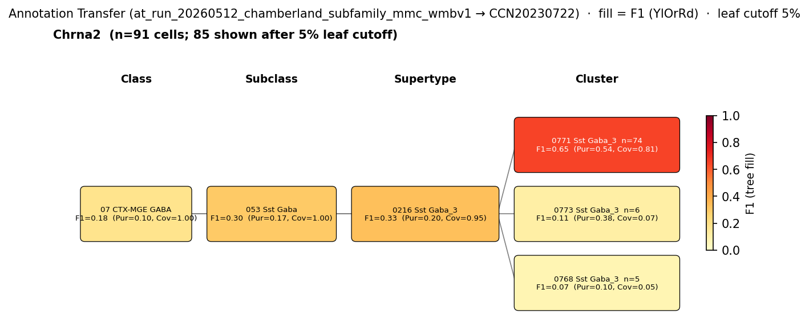

# Chrna2-IN (Chrna2-OLM, Chamberland 2024) — WMBv1 (CCN20230722) Mapping Report
*2026-04-09 · Source: `kb/graphs/hippocampus/hippocampus_GABAergic_interneurons.yaml`*

---

## Introduction

Chrna2-INs are a transgene-defined subfamily of CA1 stratum oriens Sst-expressing GABAergic interneurons resolved by Chamberland 2024 [1] via combinatorial Sst-Flp;Chrna2-Cre genetics. Within a broader Sst-IN compartment that also includes Sst::Tac1-INs, Sst::Nos1-INs and Ndnf::Nkx2-1-INs, Chrna2-IN somata occupy the deepest sub-stratum positions in oriens/alveus and align with the canonical Oriens-Lacunosum Moleculare (OLM) projection morphology. The subfamily is a subset of the broader classical OLM population (`olm_cell_ca1` in this graph), and is mapped here against WMBv1 to localise its transcriptomic identity.

### Classical type table

| Property | Value | References |
|---|---|---|
| Soma location | hippocampus stratum oriens [UBERON:0005371] (CA1 stratum oriens; somata sit deep in oriens/alveus) | [1] |
| NT | GABAergic | [1] |
| Defining markers | Sst; Chrna2 | [1] |

<details>
<summary>Details — source evidence for classical type properties</summary>

- **Soma location:** Chamberland 2024 morphological/genetic characterisation of the Chrna2-IN subfamily [1]
  > While Sst;;Tac1-INs were located closer to the CA1 pyramidal layer, Ndnf;;Nkx2-1-INs and Chrna2-INs were found progressively deeper in O/A
  > — Chamberland et al. 2024, Results · [1] <!-- quote_key: 269246896_1b1ebab4 -->

- **NT type and defining markers (Sst, Chrna2):** combinatorial Sst-Flp;Chrna2-Cre genetic targeting of the subfamily [1]
  > genetically distinct subfamilies of Sst-INs form specialized circuits in the hippocampus.
  > — Chamberland et al. 2024, Transcriptomic Interneuron Classifications · [1] <!-- quote_key: 269246896_c87fdbd0 -->

</details>

### Cell Ontology mapping

No Cell Ontology term currently covers this type — candidate for a new CL term.

---

## Results

Annotation transfer of Chamberland 2024 in-silico Chrna2-IN labels (Harris 2018 cells satisfying the per-cluster Sst+/Chrna2+ gene-pair rule, n=153) onto WMBv1 routes the subfamily to the **0216 Sst Gaba_3** supertype [CS20230722_SUPT_0216] with **0771 Sst Gaba_3** [CS20230722_CLUS_0771] leading at cluster resolution (F1=0.65; see figure and property comparison tables). The same evidence shows distributed transfer across sibling Sst Gaba_3 children under CS20230722_SUPT_0216, raising the question of which residual cells correspond to other Chamberland Sst-IN subfamilies (Sst::Tac1, Sst::Nos1) versus dropout-affected Chrna2-IN cells.



*F1 across taxonomy levels for the Chamberland Chrna2 subfamily (per-cluster derivation; n=153 source cells; Harris 2018, GSE99888, re-labelled under Chamberland's Sst+/Chrna2+ gene-pair rule). Coverage = fraction of source-group cells landing on the target; **Purity** = fraction of target cells from the source group. With a single source group in the figure, Purity differentiates targets within the level; Coverage shows how much of the source cohort lands on each target. F1 rises monotonically with finer aggregation (class F1=0.18 → subclass F1=0.30 → supertype F1=0.33 → cluster F1=0.65), consistent with the subfamily resolving at cluster level within a broader Sst-IN compartment.*

### Per-survivor property alignment + Evidence support

#### 0216 Sst Gaba_3 [CS20230722_SUPT_0216] — primary (supertype) · 🟡 MODERATE

**Table 1 — Property comparison.**

| Property | Classical | Supertype | Best cluster (0771) | Alignment |
|---|---|---|---|---|
| Soma location | hippocampus stratum oriens [UBERON:0005371] | Field CA1, stratum oriens [MBA:399] count_100um=1463 (region_fraction_100um: 0.539; strict: 0.305) | Field CA1, stratum oriens [MBA:399] count_100um=179 (region_fraction_100um: 0.454; strict: 0.239) | CONSISTENT |
| NT type | GABAergic | not asserted (supertype) | GABA | SUPT: NOT_ASSESSED; CLUS: CONSISTENT |
| Sst expression | defining marker | 11.44 (cohort_pct 0.905; child-coverage 1.000) | 11.62 (cohort_pct 0.924) | CONSISTENT |
| Chrna2 expression | defining marker | 0.61 (cohort_pct 0.952; child-coverage 0.667) | 2.56 (cohort_pct 0.992) | CONSISTENT |
| Sex ratio | not documented | not available | not assessed | NOT_ASSESSED |

**Table 2 — Evidence support.**

| Evidence | Type | Supports | Headline | Source |
|---|---|---|---|---|
| Atlas supertype metadata (0216 Sst Gaba_3) | Atlas metadata | PARTIAL | region_fraction_100um=0.539; strict=0.305 | atlas-internal |

*(3 of 5 Sst Gaba_3 child clusters carry Chrna2 expression above MIN_DETECTABLE at supertype-level child-coverage 0.667; the cluster currently best resolved by Chamberland 2024 Chrna2-IN annotation transfer is CS20230722_CLUS_0771 at F1=0.65.)*

#### 0771 Sst Gaba_3 [CS20230722_CLUS_0771] — best child cluster · 🟡 MODERATE

**Table 1 — Property comparison.**

| Property | Classical | Supertype (0216) | Best cluster (0771) | Alignment |
|---|---|---|---|---|
| Soma location | hippocampus stratum oriens [UBERON:0005371] | Field CA1, stratum oriens [MBA:399] count_100um=1463 (region_fraction_100um: 0.539; strict: 0.305) | Field CA1, stratum oriens [MBA:399] count_100um=179 (region_fraction_100um: 0.454; strict: 0.239) | SUPT: CONSISTENT; CLUS: APPROXIMATE |
| NT type | GABAergic | not asserted | GABA | CONSISTENT |
| Sst expression | defining marker | 11.44 | 11.62 (cohort_pct 0.924) | CONSISTENT |
| Chrna2 expression | defining marker | 0.61 | 2.56 (cohort_pct 0.992) | CONSISTENT |
| Sex ratio | not documented | not available | not assessed | NOT_ASSESSED |

**Table 2 — Evidence support.**

| Evidence | Type | Supports | Headline | Source |
|---|---|---|---|---|
| Chamberland 2024 Chrna2-IN subfamily annotation transfer | Annotation transfer | SUPPORT | Cluster F1=0.65 (recall 0.81, precision 0.54) to CS20230722_CLUS_0771 | — |

*(CS20230722_CLUS_0771 leads the Sst Gaba_3 cluster F1 distribution for the Chamberland Chrna2-IN subfamily at F1=0.65 with 74 of 153 source cells mapped (coverage=0.81, purity=0.54); siblings CS20230722_CLUS_0773 (F1=0.11, n=6) and CS20230722_CLUS_0768 (F1=0.07, n=5) absorb minor scatter.)*

### Per-survivor narratives

#### 0216 Sst Gaba_3 [CS20230722_SUPT_0216] · 🟡 MODERATE

**Supporting evidence:**
- Annotation transfer of the Chamberland 2024 Chrna2-IN subfamily ([1]; `at_run_20260512_chamberland_subfamily_mmc_wmbv1`) routes 126 of 153 source cells to this supertype with coverage 0.95 — direct evidence that Chrna2-marked Sst-INs occupy the Sst Gaba_3 supertype, even though the supertype is broader than the Chrna2-IN subfamily (purity 0.20).
- Atlas precomputed expression on the supertype carries both defining markers: Sst=11.44 (cohort_pct 0.905; full child-coverage) and Chrna2=0.61 (cohort_pct 0.952), with Chrna2 present above MIN_DETECTABLE on 2 of 3 child clusters (coverage 0.667), consistent with the Chrna2-marker concentrating in a subset of the supertype's children rather than being uniform across it.
- Soma location in Field CA1, stratum oriens [MBA:399] is CONSISTENT at the supertype level (region_fraction_100um=0.539; strict region_fraction=0.305).

**Marker evidence provenance:**
- Sst and Chrna2 are both confirmed at transcript level on the supertype's atlas precomputed expression. Chrna2 specificity to the Chrna2-IN subfamily within Sst Gaba_3 children is established by Chamberland 2024 ([1]) via Sst-Flp;Chrna2-Cre combinatorial genetic targeting — Chrna2 functions as the discriminator within the Sst-IN compartment rather than across it.

**Concerns:**
- Cluster-level scatter into other Sst Gaba_3 children dampens supertype purity to 0.20 (DISTRIBUTED_ACROSS_CLUSTERS): the Chrna2-IN subfamily lives at cluster resolution within the supertype, not across it as a whole.
- Single source dataset (GEO:GSE99888 re-labelled under Chamberland's per-cluster gene-pair rule); no independent dataset replicates the supertype-level transfer (SINGLE_DATASET).

**What would upgrade confidence:**
- Subfamily-resolved annotation transfer of the remaining Chamberland labels (Sst::Tac1, Sst::Nos1, Ndnf::Nkx2-1) against CS20230722_SUPT_0216 children, to verify that residual non-Chrna2 cells in this supertype correspond to other Sst-IN subfamilies and not unrelated populations.

#### 0771 Sst Gaba_3 [CS20230722_CLUS_0771] · 🟡 MODERATE

**Supporting evidence:**
- Direct annotation transfer of the Chamberland 2024 Chrna2-IN subfamily ([1]; `at_run_20260512_chamberland_subfamily_mmc_wmbv1`) routes 74 of 153 source cells onto this cluster (F1=0.65, coverage 0.81, purity 0.54) — the leading cluster-level destination for Chrna2-marked Sst-INs in WMBv1 and a substantial purity advantage over sibling clusters.
- Defining markers are jointly present at cohort-leading percentiles: Sst=11.62 (cohort_pct 0.924) and Chrna2=2.56 (cohort_pct 0.992) — Chrna2 sits in the top percentile of the GABAergic-hippocampal cohort on this cluster, consistent with the cluster being the Chrna2-IN home.
- NT type is CONSISTENT (GABA at cluster level matches the classical GABAergic identity).

**Marker evidence provenance:**
- Chrna2 atlas-side cluster mean (2.56) is the highest among Sst Gaba_3 child clusters in the survival cohort and is consistent with the Chamberland 2024 [1] Chrna2-Cre genetic identification of this subfamily as a Chrna2-enriched population within the Sst-IN compartment.
- Sst (val=11.62) is concordant with the classical defining marker and with the broader Sst Gaba_3 supertype profile.

**Concerns:**
- Soma location APPROXIMATE: region_fraction_100um=0.454 with strict region_fraction=0.239 indicates boundary scatter at the stratum oriens edge — somata sit at or near the queried CA1 stratum oriens but a substantial fraction sit just outside the strict region polygon (MERFISH_REGISTRATION_UNCERTAINTY). For an oriens-deep subfamily described by Chamberland 2024 [1] as sitting progressively deeper in O/A, this boundary scatter is plausibly real subfamily-specific depth structure rather than registration noise alone.
- Single source dataset (GEO:GSE99888 re-labelled under Chamberland's per-cluster Sst+/Chrna2+ rule); no independent dataset replicates the F1=0.65 to CS20230722_CLUS_0771 (SINGLE_DATASET).
- Approximately 46% of cells in CS20230722_CLUS_0771 are not classified Chrna2-IN by Chamberland's per-cluster rule (purity 0.54) — these could be scRNA-seq dropout on the Sst+/Chrna2+ gene-pair criterion, or a co-resident non-Chrna2 OLM subset.
- The Chrna2-IN subfamily is a subset of the broader classical OLM population (`olm_cell_ca1` in this graph) — Chamberland's transgene-defined subfamily is finer-grained than the classical Sst+Chrna2+Reln+ OLM type. Cross-classical relationship to `olm_cell_ca1` is provisionally BROAD_MATCH (#54): `olm_cell_ca1` mapped to CS20230722_SUPT_0216 broadMatch + CS20230722_CLUS_0768 closeMatch under the pooled Winterer cohort, while the Chamberland Chrna2-IN subfamily resolves to a sibling cluster (CS20230722_CLUS_0771) within the same supertype.

**What would upgrade confidence:**
- Targeted profiling on Chrna2-Cre-labelled oriens interneurons, pairing functional and morphological characterisation with single-cell transcriptomics, with the resulting transcriptomes mapped against CCN20230722; target F1 ≥ 0.80 at CLUSTER level on CS20230722_CLUS_0771 (would add direct AnnotationTransferEvidence from a Chrna2-Cre cohort).
- Re-score Sst::Tac1-IN, Sst::Nos1-IN, and Ndnf::Nkx2-1-IN Chamberland subfamilies against sibling Sst Gaba_3 clusters under CS20230722_SUPT_0216 using existing `at_run_20260512_chamberland_subfamily_mmc_wmbv1` output, to test whether the residual ~46% of CS20230722_CLUS_0771 cells are dropout-affected Chrna2-INs or a co-resident non-Chrna2 subfamily.

<details>
<summary>Candidates audited (full top-K)</summary>

| WMBv1 target | Supertype | Cells (10x) | Confidence | Key evidence | Verdict |
|---|---|---:|---|---|---|
| 0216 Sst Gaba_3 [CS20230722_SUPT_0216] | — | 2004 | 🟡 MODERATE | Chamberland Chrna2-IN AT coverage=0.95 to supertype | Primary (supertype) |
| 0771 Sst Gaba_3 [CS20230722_CLUS_0771] | 0216 Sst Gaba_3 | 462 | 🟡 MODERATE | Chamberland Chrna2-IN AT F1=0.65; Chrna2=2.56 cohort top | Primary (best child) |
| 0768 Sst Gaba_3 [CS20230722_CLUS_0768] | 0216 Sst Gaba_3 | 66 | 🔴 LOW | Markers concordant; n=5 of 153 from Chrna2-IN AT | Eliminated (sub-leading scatter) |
| 0772 Sst Gaba_3 [CS20230722_CLUS_0772] | 0216 Sst Gaba_3 | 190 | 🔴 LOW | Markers concordant; n=1 of 153 from Chrna2-IN AT | Eliminated (sub-leading scatter) |
| 0773 Sst Gaba_3 [CS20230722_CLUS_0773] | 0216 Sst Gaba_3 | 156 | 🔴 LOW | Markers concordant; n=6 of 153 from Chrna2-IN AT | Eliminated (sub-leading scatter) |
| 0770 Sst Gaba_3 [CS20230722_CLUS_0770] | 0216 Sst Gaba_3 | 404 | 🔴 LOW | Markers concordant; 0 of 153 from Chrna2-IN AT | Eliminated (no AT support) |
| 0226 Sst Gaba_13 [CS20230722_SUPT_0226] | — | 4064 | 🔴 LOW | Markers consistent; region_fraction_100um=0.016 | Eliminated (off-target location) |
| 0217 Sst Gaba_4 [CS20230722_SUPT_0217] | — | 14335 | 🔴 LOW | Cortical supertype; region_fraction_100um=0.015 | Eliminated (off-target location) |
| 0224 Sst Gaba_11 [CS20230722_SUPT_0224] | — | 2677 | 🔴 LOW | Cortical-dominant; region_fraction_100um=0.032 | Eliminated (off-target location) |
| 0225 Sst Gaba_12 [CS20230722_SUPT_0225] | — | 2126 | 🔴 LOW | Off-target region; region_fraction_100um=0.017 | Eliminated (off-target location) |

Total candidates: 10 edges across the Chrna2-IN survival cohort.

</details>

---

### Methods

<details>
<summary>Data sources, analyses, and reproducibility receipts</summary>

**Classical type definition.** The Chrna2-IN subfamily is defined here on CLASSICAL_MULTIMODAL evidence — combinatorial Sst-Flp;Chrna2-Cre genetic targeting in Chamberland 2024 [1], anatomical placement deep in CA1 stratum oriens/alveus, GABAergic identity, and the Sst+Chrna2+ marker pair.

**Atlas mapping query.** Candidate atlas clusters were retrieved from the WMBv1 (CCN20230722) taxonomy at ranks 0 (cluster) and 1 (supertype) using metadata-based scoring (region match against MBA:399 Field CA1, stratum oriens; NT match GABAergic; defining markers Sst/Chrna2). Full scoring rules: `workflows/map-cell-type.md`.

**Property alignment.** Each defining property of the classical type was compared to the corresponding atlas-side value via the `property_comparisons` schema, with alignments graded CONSISTENT / APPROXIMATE / DISCORDANT / NOT_ASSESSED. Atlas-side numerical values came from precomputed expression on the cluster (cluster.yaml in the taxonomy reference store) and from MERFISH spatial registration for soma location.

**Annotation transfer.**

| Field | Value |
|---|---|
| Run | at_run_20260512_chamberland_subfamily_mmc_wmbv1 |
| Source dataset | GEO:GSE99888 (Chamberland 2024 in-silico Sst+/Chrna2+ per-cluster subfamily labels) |
| Source species | NCBITaxon:10090 |
| Target atlas | WMBv1 (CCN20230722; SHA-256: b21ca985) |
| Method | MapMyCells (cell_type_mapper v1.7.1, default parameters, raw normalization, bootstrap_iteration=100); per-cluster subfamily labels |
| Tool version | cell_type_mapper v1.7.1 |
| Bootstrap threshold | 0.8 |
| n cells | 3663 |
| F1 matrix | `kb/annotation_transfer_runs/at_run_20260512_chamberland_subfamily_mmc_wmbv1/f1_matrix_chamberland_by_class.csv` |
| Caveats | Per-cluster derivation is the primary result (dropout-robust gene-pair rules on Harris cluster means); Chrna2-IN subfamily routes to CS20230722_CLUS_0771 at F1=0.65, recall=0.81. |

**Anti-hallucination.** All citations, atlas accessions, ontology CURIEs, and verbatim literature quotes in this report are validated against the evidencell knowledge base at write time. Authored-prose evidence narratives are validated against their source `evidence_items[*].explanation` fields. The pre-write hook rejects any unresolvable identifier or unattributed blockquote. Specific mapping limitations and caveats are documented per-candidate in the Discussion section.

*Generated by evidencell `be7fae4` at 2026-06-10T13:48:13+00:00 from [kb/graphs/hippocampus/hippocampus_GABAergic_interneurons.yaml](kb/graphs/hippocampus/hippocampus_GABAergic_interneurons.yaml).*

</details>

---

## Discussion

**Primary mapping:** Chrna2-IN (Chrna2-OLM, Chamberland 2024) → 0216 Sst Gaba_3 [CS20230722_SUPT_0216] at MODERATE confidence at supertype level, with 0771 Sst Gaba_3 [CS20230722_CLUS_0771] as the best-resolved child cluster (also MODERATE). Key support: direct annotation transfer of the Chamberland 2024 Chrna2-IN in-silico subfamily (F1=0.65 at cluster, supertype coverage 0.95) and joint Sst+Chrna2 expression at cohort-leading percentiles on CS20230722_CLUS_0771. Key caveats: DISTRIBUTED_ACROSS_CLUSTERS (supertype purity 0.20 reflects multiple Sst-IN subfamilies sharing the supertype) and SINGLE_DATASET (Chamberland subfamily labels derived from a single source).

The Chrna2-IN subfamily is a transgene-defined subset of the broader classical OLM population (`olm_cell_ca1`, mapped under #54 provisional BROAD_MATCH to this same supertype but with CS20230722_CLUS_0768 as the OLM-cohort best-resolved child). Both classical nodes now coexist in this graph; the cluster-level destinations differ (Chrna2-IN → CS20230722_CLUS_0771; pooled OLM → CS20230722_CLUS_0768), reflecting that the Chamberland subfamily resolves within the OLM compartment rather than recapitulating it.

No Cell Ontology term currently covers this type — a candidate for a new CL term capturing the Sst+/Chrna2+ Chrna2-Cre-defined CA1 stratum oriens/alveus deep-O/A subfamily within the broader OLM compartment.

### Proposed experiments and follow-ups

- **Targeted profiling of Chrna2-Cre-labelled oriens interneurons with functional + morphological characterisation, mapped against CCN20230722.**
  - Target: F1 ≥ 0.80 at CLUSTER level against CS20230722_CLUS_0771.
  - Expected output: AnnotationTransferEvidence from a directly Chrna2-Cre-targeted cohort (Chamberland's current evidence rests on in-silico Sst+/Chrna2+ relabelling of Harris 2018, not on Chrna2-Cre-targeted sequencing).
  - Resolves: open question 1; upgrades CS20230722_CLUS_0771 to HIGH if the threshold is met.

- **Subfamily-resolved annotation transfer of the remaining Chamberland labels against CS20230722_SUPT_0216 children.**
  - Target: distinguish Sst::Tac1-IN, Sst::Nos1-IN, and Ndnf::Nkx2-1-IN routings within the supertype.
  - Expected output: AnnotationTransferEvidence using the existing `at_run_20260512_chamberland_subfamily_mmc_wmbv1` output.
  - Resolves: open question 2 — whether the residual ~46% of CS20230722_CLUS_0771 cells are dropout-affected Chrna2-INs or a co-resident non-Chrna2 Sst-IN subfamily.

### Open questions

1. Are the ~46% of cells in CS20230722_CLUS_0771 that are not Chamberland-rule-positive a scRNA-seq dropout artefact of the Sst+/Chrna2+ gene-pair criterion, or a co-resident non-Chrna2 OLM subset?
2. Which sibling clusters of CS20230722_CLUS_0771 within CS20230722_SUPT_0216 carry the Sst::Tac1, Sst::Nos1, and Ndnf::Nkx2-1 Chamberland subfamilies?
3. What is the formal cross-classical relationship between `chrna2_olm_subfamily_chamberland` (this node) and `olm_cell_ca1` (#54 provisional BROAD_MATCH)? Both nodes coexist in this graph as of 2026-06-10; the Chamberland subfamily is finer-grained than the classical OLM type and resolves to a sibling cluster (CS20230722_CLUS_0771 vs. CS20230722_CLUS_0768) within the same supertype.
4. Curator removal of duplicate edge edge_chrna2_olm_subfamily_chamberland_to_CS20230722_CLUS_0771 — legacy/fresh-emit ID collision on taxonomy_type CS20230722_CLUS_0771.

---

## References

| # | Citation | PMID | Used for |
|---|---|---|---|
| [1] | Chamberland et al. 2024 | [38640347](https://pubmed.ncbi.nlm.nih.gov/38640347) | soma location, NT type, defining markers (Sst, Chrna2), subfamily definition |

---

<!-- verdict-block-start: edge_chrna2_olm_to_CS20230722_CLUS_0771 -->
```yaml
verdict:
  confidence: MODERATE
  confidence_score: 0.7
  relationship: skos:closeMatch
  mapping_cardinality: "1:1"
  mapping_justification: semapv:ManualMappingCuration
  rationale: >
    [tier:STRONGEST] Direct AT of the Chamberland 2024 Chrna2-IN
    subfamily routes
    74 of 153 source cells onto CS20230722_CLUS_0771 at F1=0.65
    (recall 0.81, precision 0.54), the leading cluster-level destination
    within CS20230722_SUPT_0216. Defining markers Sst (val=11.62,
    cohort_pct 0.924) and Chrna2 (val=2.56, cohort_pct 0.992) are
    jointly concordant at cohort-leading percentiles; 4 of 4 property
    comparisons CONSISTENT (location APPROXIMATE — region_fraction_100um:
    0.454, boundary scatter at the stratum oriens edge).
  reconciliation_note: >
    Paired with the supertype-level broadMatch on
    edge_chrna2_olm_subfamily_chamberland_to_CS20230722_SUPT_0216; the
    Chamberland Chrna2-IN subfamily resolves at cluster level within the
    broader Sst Gaba_3 supertype. Cross-classical: this node is a
    transgene-defined subset of the broader olm_cell_ca1 (#54 provisional
    BROAD_MATCH), which resolves to a sibling cluster
    (CS20230722_CLUS_0768) within the same supertype.
  caveats:
    - caveat_type: SINGLE_DATASET
      description: >
        Annotation transfer evidence rests on a single source dataset
        (GEO:GSE99888) re-labelled under Chamberland's per-cluster
        Sst+/Chrna2+ gene-pair rule; no independent dataset replicates
        the F1=0.65 routing to CS20230722_CLUS_0771.
    - caveat_type: MERFISH_REGISTRATION_UNCERTAINTY
      description: >
        Soma location alignment APPROXIMATE: region_fraction_100um=0.454
        with strict region_fraction=0.239 indicates boundary scatter at
        the stratum oriens edge — plausibly real subfamily-specific
        depth structure (Chrna2-INs sit progressively deeper in O/A per
        Chamberland 2024, PMID:38640347) rather than registration noise
        alone.
  proposed_experiments:
    - >
      Targeted profiling on Chrna2-Cre-labelled oriens interneurons,
      pairing functional and classical-type characterisation with
      single-cell transcriptomics, with the resulting transcriptomes
      mapped against CCN20230722; target F1 >= 0.80 at CLUSTER level on
      CS20230722_CLUS_0771.
    - >
      Re-score Sst::Tac1-IN, Sst::Nos1-IN, and Ndnf::Nkx2-1-IN
      Chamberland subfamilies against sibling Sst Gaba_3 clusters under
      CS20230722_SUPT_0216 using existing output.
  unresolved_questions:
    - >
      Are the ~46% of cells in CS20230722_CLUS_0771 that are not
      Chamberland-rule-positive a transcriptomic dropout artefact of the
      Sst+/Chrna2+ gene-pair criterion, or a co-resident non-Chrna2
      OLM subset?
    - >
      Cross-classical relationship to olm_cell_ca1 (#54 provisional
      BROAD_MATCH): this Chrna2-IN subfamily resolves to
      CS20230722_CLUS_0771 while olm_cell_ca1 resolves to
      CS20230722_CLUS_0768 within the same supertype
      CS20230722_SUPT_0216.
    - >
      Curator removal of duplicate edge
      edge_chrna2_olm_subfamily_chamberland_to_CS20230722_CLUS_0771 —
      legacy/fresh-emit ID collision on taxonomy_type
      CS20230722_CLUS_0771.
```
<!-- verdict-block-end -->

<!-- verdict-block-start: edge_chrna2_olm_subfamily_chamberland_to_CS20230722_SUPT_0216 -->
```yaml
verdict:
  confidence: MODERATE
  confidence_score: 0.65
  relationship: skos:broadMatch
  mapping_cardinality: "1:n"
  mapping_justification: semapv:ManualMappingCuration
  rationale: >
    [tier:NEXT] AT of the Chamberland 2024 Chrna2-IN subfamily routes 126 of 153
    source cells to CS20230722_SUPT_0216 with coverage 0.95 at
    supertype level; Sst (val=11.44, cohort_pct 0.905, child-coverage
    1.000) and Chrna2 (val=0.61, cohort_pct 0.952, child-coverage
    0.667) are jointly concordant at the supertype; 3 of 4 property
    comparisons CONSISTENT (NT not asserted at supertype). The
    subfamily lives at cluster resolution within the supertype, not
    across it as a whole.
  reconciliation_note: >
    Paired with the cluster-level closeMatch on
    edge_chrna2_olm_to_CS20230722_CLUS_0771; the supertype is the
    correct broader-resolution mapping with CS20230722_CLUS_0771 as
    the best-resolved single child cluster for the Chrna2-IN
    subfamily.
  caveats:
    - caveat_type: DISTRIBUTED_ACROSS_CLUSTERS
      description: >
        Cells of the Chrna2-IN subfamily concentrate on
        CS20230722_CLUS_0771 but cluster-level scatter into other Sst
        Gaba_3 children under CS20230722_SUPT_0216 dampens supertype
        purity to 0.20.
    - caveat_type: SINGLE_DATASET
      description: >
        Supertype-level evidence rests on the same single source
        dataset (GEO:GSE99888) re-labelled under Chamberland's
        per-cluster gene-pair rule.
  proposed_experiments:
    - >
      Subfamily-resolved annotation transfer of the remaining
      Chamberland labels against CS20230722_SUPT_0216 children, to
      verify that residual non-Chrna2 cells correspond to other
      Sst-IN subfamilies and not unrelated populations.
  unresolved_questions:
    - >
      Which sibling clusters of CS20230722_CLUS_0771 within
      CS20230722_SUPT_0216 carry the Sst::Tac1, Sst::Nos1, and
      Ndnf::Nkx2-1 Chamberland subfamilies?
```
<!-- verdict-block-end -->

<!-- verdict-block-start: edge_chrna2_olm_subfamily_chamberland_to_CS20230722_CLUS_0768 -->
```yaml
verdict:
  confidence: LOW
  confidence_score: 0.25
  rationale: >
    [tier:CUT] CS20230722_CLUS_0768 carries CONSISTENT marker panel
    (Sst val=12.70, Chrna2 val=0.57) and CONSISTENT location
    (region_fraction_100um=0.818) but receives only n=5 of 153 source
    cells from the Chamberland Chrna2-IN AT, well below the
    leading CS20230722_CLUS_0771 (n=74); a plausible sibling within
    the Sst Gaba_3 cluster scatter but not the Chrna2-IN destination.
    Note: this cluster is the best-resolved child for the broader
    olm_cell_ca1 classical node (#54).
```
<!-- verdict-block-end -->

<!-- verdict-block-start: edge_chrna2_olm_subfamily_chamberland_to_CS20230722_CLUS_0772 -->
```yaml
verdict:
  confidence: LOW
  confidence_score: 0.2
  rationale: >
    [tier:CUT] CS20230722_CLUS_0772 carries CONSISTENT marker panel
    (Sst val=11.92, Chrna2 val=0.46) but receives a negligible share
    (n=1 of 153) from the Chamberland Chrna2-IN AT; not a Chrna2-IN
    destination within the Sst Gaba_3 scatter.
```
<!-- verdict-block-end -->

<!-- verdict-block-start: edge_chrna2_olm_subfamily_chamberland_to_CS20230722_CLUS_0773 -->
```yaml
verdict:
  confidence: LOW
  confidence_score: 0.2
  rationale: >
    [tier:CUT] CS20230722_CLUS_0773 receives a sub-leading share
    (n=6 of 153) of the Chamberland Chrna2-IN cohort in, well below the
    leading CS20230722_CLUS_0771 (n=74); markers concordant but not
    the modal destination.
```
<!-- verdict-block-end -->

<!-- verdict-block-start: edge_chrna2_olm_subfamily_chamberland_to_CS20230722_CLUS_0770 -->
```yaml
verdict:
  confidence: LOW
  confidence_score: 0.15
  rationale: >
    [tier:CUT] CS20230722_CLUS_0770 carries CONSISTENT marker panel
    (Sst val=10.54, Chrna2 val=0.52) but receives 0 cells from the
    Chamberland Chrna2-IN AT in; not a Chrna2-IN
    destination.
```
<!-- verdict-block-end -->

<!-- verdict-block-start: edge_chrna2_olm_subfamily_chamberland_to_CS20230722_SUPT_0226 -->
```yaml
verdict:
  confidence: LOW
  confidence_score: 0.1
  rationale: >
    [tier:CUT] CS20230722_SUPT_0226 (Sst Gaba_13) sits off-target with
    region_fraction_100um=0.016 (Isocortex/Cortical-subplate dominated);
    marker panel superficially CONSISTENT only because Sst and Chrna2
    are not subfamily-specific at this supertype.
  caveats:
    - caveat_type: AMBIGUOUS_MAPPING
      description: >
        DISCORDANT location (region_fraction_100um=0.016) against the
        CA1 stratum oriens classical type; CS20230722_SUPT_0226 is
        Isocortex-dominated.
```
<!-- verdict-block-end -->

<!-- verdict-block-start: edge_chrna2_olm_subfamily_chamberland_to_CS20230722_SUPT_0217 -->
```yaml
verdict:
  confidence: LOW
  confidence_score: 0.1
  rationale: >
    [tier:CUT] CS20230722_SUPT_0217 (Sst Gaba_4) is an Isocortex-
    dominated supertype (region_fraction_100um=0.015); off-target
    location for a CA1 stratum oriens subfamily.
  caveats:
    - caveat_type: AMBIGUOUS_MAPPING
      description: >
        DISCORDANT location (region_fraction_100um=0.015) against the
        CA1 stratum oriens classical type; CS20230722_SUPT_0217 is
        Isocortex-dominated.
```
<!-- verdict-block-end -->

<!-- verdict-block-start: edge_chrna2_olm_subfamily_chamberland_to_CS20230722_SUPT_0224 -->
```yaml
verdict:
  confidence: LOW
  confidence_score: 0.1
  rationale: >
    [tier:CUT] CS20230722_SUPT_0224 (Sst Gaba_11) sits in Isocortex
    (region_fraction_100um=0.032); off-target location for a CA1
    stratum oriens subfamily, despite CONSISTENT Sst and Chrna2.
  caveats:
    - caveat_type: AMBIGUOUS_MAPPING
      description: >
        DISCORDANT location (region_fraction_100um=0.032) against the
        CA1 stratum oriens classical type; CS20230722_SUPT_0224 is
        Isocortex-dominated.
```
<!-- verdict-block-end -->

<!-- verdict-block-start: edge_chrna2_olm_subfamily_chamberland_to_CS20230722_SUPT_0225 -->
```yaml
verdict:
  confidence: LOW
  confidence_score: 0.1
  rationale: >
    [tier:CUT] CS20230722_SUPT_0225 (Sst Gaba_12) sits off-target with
    region_fraction_100um=0.017 (Hippocampal formation + entorhinal +
    isocortex mixed); not a CA1 stratum oriens destination despite
    Chrna2 child-coverage 0.333.
  caveats:
    - caveat_type: AMBIGUOUS_MAPPING
      description: >
        DISCORDANT location (region_fraction_100um=0.017) against the
        CA1 stratum oriens classical type.
```
<!-- verdict-block-end -->
