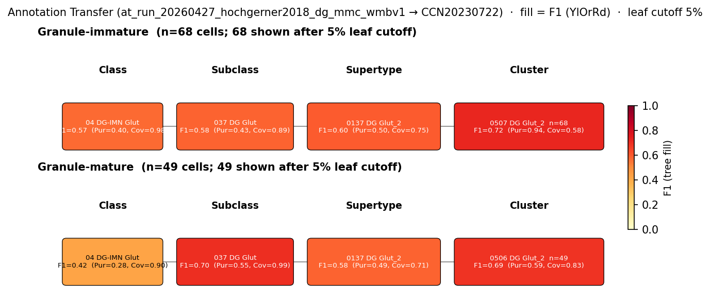

# Dentate gyrus granule cell — WMBv1 (CCN20230722) Mapping Report
*2026-04-27 · Source: `kb/graphs/hippocampus/hippocampus_glutamatergic.yaml`*

---

## Introduction

Dentate gyrus granule cells are the principal glutamatergic neurons of the dentate gyrus granule cell layer [UBERON:0005381] and form the input stage of the classical hippocampal trisynaptic pathway, projecting via the mossy fibres to CA3 [1, 3]. The population is transcriptomically defined by expression of Prox1 [8] and C1ql2 [9], and continues to receive adult-born neurons that mature into the same granule-cell phenotype [2, 4].

### Classical type table

| Property | Value | References |
|---|---|---|
| Soma location | dentate gyrus granule cell layer [UBERON:0005381] | [1], [2], [3], [4] |
| NT | glutamatergic | [5], [6], [7] |
| Markers | Prox1, C1ql2 | [8], [9] |

<details>
<summary>Details — source evidence for classical type properties</summary>

- **Soma location:** Munster-Wandowski et al. 2013 · [1]
  > The hippocampal mossy fibers (MFs), the axons of the granule cells (GCs) of the dentate gyrus, innervate mossy cells and interneurons in the hilus on their way to CA3 where they innervate interneurons and pyramidal cells
  > — Munster-Wandowski et al. 2013, abstract · [1] <!-- quote_key: 7458943_e2eed73d -->
- **Soma location:** Hagihara et al. 2011 · [2]
  > AMPA receptor subunits GluR1 and GluR2 are expressed in differentiated granule cells, but not in stem cells, in neonatal, and adult dentate gyrus
  > — Hagihara et al. 2011, abstract · [2] <!-- quote_key: 16383828_d2ad6dc6 -->
- **Soma location:** Yau et al. 2015 · [3]
  > These principal cells are interconnected through glutamatergic synapses that form the classical trisynaptic pathway, where dentate granule cells receive input from entorhinal cortex and project to CA3 pyramidal cells, which then connect to CA1 pyramidal cells (Munster-Wandowski et al., 2013)(Yau et al., 2015).
  > — Yau et al. 2015, Classical Hippocampal Circuit Organization · [3] <!-- quote_key: 1705399_6ee6563e -->
- **NT type:** Cembrowski et al. 2016 · [5]
  > we used next-generation RNA sequencing (RNA-seq) to produce a quantitative, whole genome characterization of gene expression for the major excitatory neuronal classes of the hippocampus; namely, granule cells and mossy cells of the dentate gyrus, and pyramidal cells of areas CA3, CA2, and CA1
  > — Cembrowski et al. 2016, abstract · [5] <!-- quote_key: 4875295_4a456257 -->
- **NT type:** Zander et al. 2010 · [6]
  > VGLUT1, VGLUT2, and VGAT coexist in mossy fiber terminals of the h
  > — Zander et al. 2010, abstract · [6] <!-- quote_key: 539922_281341b3 -->
- **NT type:** Pedroni et al. 2014 · [7]
  > immediately after birth, GCs exhibit a clear GABAergic phenotype. Only later they integrate the classical glutamatergic trisynaptic hippocampal circuit
  > — Pedroni et al. 2014, abstract · [7] <!-- quote_key: 11333153_3bc75fe5 -->
- **Prox1 marker:** Sarvari et al. 2016 · [8]
  > Metabotropic glutamate receptors also play important roles, with mGluR1 mainly expressed in granule cells and CA3 pyramidal neurons, while mGluR5 is highly expressed in all hippocampal subfields (Sarvari et al., 2016). The vesicular glutamate transporter vGLUT1 is the main subtype expressed in the hippocampus, packing glutamate into synaptic vesicles of glutamatergic axon terminals (Sarvari et al., 2016).
  > — Sarvari et al. 2016, Synaptic Properties and Neurotransmitter Systems · [8] <!-- quote_key: 14854554_439a5d0b -->
- **C1ql2 marker:** D et al. 2018 · [9]
  > the expression of Sema5B and C1ql2 is restricted to dentate granule cells within the hippocampus
  > — D et al. 2018, discussion · [9] <!-- quote_key: 5895709_81a3d36b -->

</details>

No Cell Ontology term currently covers this type — candidate for a new CL term.

---

## Results

Annotation-transfer evidence from Hochgerner 2018 scRNA-seq granule cell labels and atlas-side defining-marker concordance support a supertype-level mapping to 0137 DG Glut_2 [CS20230722_SUPT_0137], with cluster 0505 DG Glut_2 [CS20230722_CLUS_0505] the dominant child within that supertype (see figure and property comparison tables). Cluster-level scatter across sibling supertypes 0138 DG Glut_3 [CS20230722_SUPT_0138], 0139 DG Glut_4 [CS20230722_SUPT_0139], and the immature-neuron supertype 0141 DG-PIR Ex IMN_2 [CS20230722_SUPT_0141] is consistent with the granule-cell population spanning multiple maturation states.



*F1 across taxonomy levels for the two source groups relevant to the dentate gyrus granule cell mapping (Hochgerner 2018 Granule-mature and Granule-immature; n=2934 cells). Each panel row is a source-cell group; nodes are coloured by F1 with **Purity** (Pur) and **Coverage** (Cov) shown inline. Coverage = fraction of source-group cells landing on this target; Purity = fraction of this target's cells coming from the source group. F1 ≥ 0.5 at a level indicates a clean mapping at that resolution. Both Granule-mature and Granule-immature reach their highest supertype-level F1 on 0137 DG Glut_2 (F1=0.58 and F1=0.60 respectively).*

The AT signal is dominant at the DG Glut subclass (037 DG Glut, Coverage=0.99 for Granule-mature, 0.89 for Granule-immature) and best resolved at supertype level on CS20230722_SUPT_0137; at finer resolution the two source groups land on different child clusters within SUPT_0137, consistent with mature/immature heterogeneity.

### 0137 DG Glut_2 [CS20230722_SUPT_0137] · 🟡 MODERATE

**Table 1 — Property comparison.**

| Property | Classical | Supertype | Best cluster | Alignment |
|---|---|---|---|---|
| Soma location | dentate gyrus granule cell layer [UBERON:0005381] | Dentate gyrus, granule cell layer [MBA:632] count_100um=47167 | 0505 DG Glut_2 [CS20230722_CLUS_0505] | CONSISTENT |
| NT type | glutamatergic | not asserted | Glut | SUPT: NOT_ASSESSED; CLUS: CONSISTENT |
| Prox1 expression | defining marker | Prox1: 8.59; cohort_pct 0.853 | Prox1: 8.38 (CLUS_0505) | CONSISTENT |
| C1ql2 expression | defining marker | C1ql2: 5.77; cohort_pct 0.912 | C1ql2: 7.38 (CLUS_0505) | CONSISTENT |
| Sex ratio | not documented | not available | not assessed | NOT_ASSESSED |

*(4 of 4 child clusters in the SUPT_0137 lineage examined show Prox1 concordant with the classical type; C1ql2 expression is concordant in CLUS_0505 (7.38, cohort_pct 0.982) but lower at the supertype mean. Best match: CLUS_0505.)*

**Table 2 — Evidence support.**

| Evidence | Type | Supports | Headline | Source |
|---|---|---|---|---|
| Hochgerner 2018 MapMyCells AT | Annotation transfer | SUPPORT | F1=0.58 (supertype); subclass Coverage=0.99 | atlas-internal |
| Atlas precomputed expression | Atlas metadata | SUPPORT | Prox1 mean 8.59; C1ql2 mean 5.77 | atlas-internal |

**Supporting evidence:**
- Annotation transfer of Hochgerner 2018 (GEO:GSE95315) Granule-mature and Granule-immature labels through MapMyCells onto WMBv1 lands both source groups on SUPT_0137 at supertype level (Granule-mature F1=0.58, Granule-immature F1=0.60); subclass-level Coverage on 037 DG Glut is 0.988 (Granule-mature) and 0.888 (Granule-immature), confirming DG Glut as the dominant classification.
- Atlas precomputed expression on SUPT_0137 confirms Prox1 (mean 8.59, cohort percentile 0.853) and C1ql2 (mean 5.77, cohort percentile 0.912) as concordant with classical defining-marker calls.
- Soma-location alignment is clean: `region_fraction_100um: 0.991` and strict `region_fraction: 0.817` against MBA:632 [Dentate gyrus, granule cell layer].

**Marker evidence provenance:**
- **Prox1**: classical-side citation is Sarvari et al. 2016 [8] — a review citing mGluR1 and vGLUT1 distributions, not a primary study of Prox1 as a DG-granule marker. Atlas-side Prox1 at SUPT_0137 (mean 8.59, cohort_pct 0.853) is consistent in any case, and Prox1 is broadly accepted in the DG literature; flagging the citation depth for curator follow-up.
- **C1ql2**: classical-side citation [9] is a primary study explicitly restricting Sema5B and C1ql2 expression to dentate granule cells within the hippocampus, anchoring this marker. Atlas-side C1ql2 mean (5.77, cohort_pct 0.912 at supertype) is consistent; the best child cluster CLUS_0505 carries even stronger C1ql2 (7.38, cohort_pct 0.982).
- No negative markers or neuropeptides are recorded on the classical node, so no atlas-annotation/expression discrepancy check applies.

**Concerns:**
- The AT F1 at supertype is moderate (~0.59–0.60), not high; the source-group scatter into adjacent supertypes (SUPT_0138, SUPT_0139, SUPT_0141) reduces specificity at this resolution.
- Granule-immature also maps appreciably to SUPT_0141 (DG-PIR Ex IMN_2), indicating that the classical "dentate gyrus granule cell" definition encompasses an immature/adult-born subpopulation that the atlas resolves separately from the mature supertype SUPT_0137.
- Annotation transfer is from mouse (Hochgerner 2018, GEO:GSE95315) to mouse WMBv1 — same species; the CROSS_SPECIES_EXTRAPOLATION caveat carried on the existing edge appears to be an inherited mislabel from an earlier ingest and should be removed at curator review.

**What would upgrade confidence:**
- Add precomputed expression cross-check across SUPT_0136–0139 to discriminate the four DG Glut supertypes via Prox1/C1ql2 (already partially in place; full child-cluster coverage would resolve the supertype-vs-cluster question).
- Cross-validate against an independent mouse granule cell scRNA-seq dataset (e.g. Artimovich 2020 or Shin 2015) targeting F1 ≥ 0.75 at supertype level.

### 0505 DG Glut_2 [CS20230722_CLUS_0505] · 🟡 MODERATE

**Table 1 — Property comparison.**

| Property | Classical | Cluster | Alignment |
|---|---|---|---|
| Soma location | dentate gyrus granule cell layer [UBERON:0005381] | Dentate gyrus, granule cell layer [MBA:632] count_100um=12273 | CONSISTENT |
| NT type | glutamatergic | Glut | CONSISTENT |
| Prox1 expression | defining marker | Prox1: 8.38; cohort_pct 0.818 | CONSISTENT |
| C1ql2 expression | defining marker | C1ql2: 7.38; cohort_pct 0.982 | CONSISTENT |
| Sex ratio | not documented | not assessed | NOT_ASSESSED |

*The classical Prox1 and C1ql2 expression profile is concordant with this cluster's atlas-side means; C1ql2 in particular sits at the 98th cohort percentile on CLUS_0505, the highest among the SUPT_0137 children.*

**Table 2 — Evidence support.**

| Evidence | Type | Supports | Headline | Source |
|---|---|---|---|---|
| Atlas precomputed expression | Atlas metadata | PARTIAL | Prox1 mean 8.38; C1ql2 mean 7.38; region_fraction_100um=0.991 | atlas-internal |

**Supporting evidence:**
- CLUS_0505 carries the highest C1ql2 expression in its cohort (mean 7.38, cohort percentile 0.982) among child clusters of SUPT_0137, and a clean Prox1 signal (mean 8.38, cohort percentile 0.818).
- Location alignment is clean: `region_fraction_100um: 0.991`, strict `region_fraction: 0.823` against MBA:632 [Dentate gyrus, granule cell layer].
- Cluster cohort-relative Stage A score is 6 (top of its 48-member SURVIVAL_COHORT under filters region=MBA:632 and nt_type=glutamatergic).

**Concerns:**
- No direct annotation-transfer evidence resolves CLUS_0505 specifically — the AT signal exists at supertype level (SUPT_0137) but Hochgerner's Granule-mature best-cluster is CS20230722_CLUS_0506 (F1=0.69) and Granule-immature's is CS20230722_CLUS_0507 (F1=0.72), per the figure's metrics sidecar. CLUS_0505 is the largest child cluster of SUPT_0137 (n_cells=20503) but is not the cluster Hochgerner cells preferentially land on.
- The cluster-level call here is structural / marker-driven, not AT-driven; it represents the best top-K candidate within the SUPT_0137 family rather than the AT-best child.

**What would upgrade confidence:**
- Re-emit the top-K to include CS20230722_CLUS_0506 and CS20230722_CLUS_0507 as edges and re-run AT scoring against the Hochgerner labels — these are the AT-best children and may unseat CLUS_0505 as the dominant cluster mapping.
- Add precomputed Prox1/C1ql2 expression to CLUS_0506 and CLUS_0507 for direct marker comparison.

<details>
<summary>Candidates audited (full top-K)</summary>

| WMBv1 cluster | Supertype | Cells (10x) | Confidence | Key evidence | Verdict |
|---|---|---:|---|---|---|
| 0137 DG Glut_2 [CS20230722_SUPT_0137] | — | 74950 | 🟡 MODERATE | Hochgerner AT F1=0.58 supertype; Prox1/C1ql2 concordant | Primary |
| 0505 DG Glut_2 [CS20230722_CLUS_0505] | 0137 DG Glut_2 | 20503 | 🟡 MODERATE | Highest C1ql2 child cluster of SUPT_0137 | Secondary |
| 0138 DG Glut_3 [CS20230722_SUPT_0138] | — | 964 | 🔴 LOW | Prox1/C1ql2 concordant; no AT support | Eliminated (no AT support; smaller sibling supertype) |
| 0139 DG Glut_4 [CS20230722_SUPT_0139] | — | 5166 | 🔴 LOW | Prox1/C1ql2 concordant; region_fraction_100um=0.77 | Eliminated (no AT support; weaker region fraction) |
| 0510 DG Glut_4 [CS20230722_CLUS_0510] | 0139 DG Glut_4 | 5166 | 🔴 LOW | Prox1/C1ql2 concordant; lower region fraction | Eliminated (child of non-primary supertype) |
| 0141 DG-PIR Ex IMN_2 [CS20230722_SUPT_0141] | — | 1200 | 🔴 LOW | Prox1 cohort_pct 0.971; C1ql2 mean 0.25 | Eliminated (immature/PIR supertype; weak C1ql2) |
| 0514 DG-PIR Ex IMN_2 [CS20230722_CLUS_0514] | 0141 DG-PIR Ex IMN_2 | 408 | 🔴 LOW | Prox1 high but C1ql2=0.47 | Eliminated (immature lineage; near-absent C1ql2) |
| 0515 DG-PIR Ex IMN_2 [CS20230722_CLUS_0515] | 0141 DG-PIR Ex IMN_2 | 511 | 🔴 LOW | Prox1 high but C1ql2=0.38 | Eliminated (immature lineage; near-absent C1ql2) |
| 0079 CA3 Glut_5 [CS20230722_SUPT_0079] | — | 318 | 🔴 LOW | Polymorph layer location; Prox1=0.29 | Eliminated (CA3 lineage; Prox1 absent) |
| 0316 CA3 Glut_5 [CS20230722_CLUS_0316] | 0079 CA3 Glut_5 | 202 | 🔴 LOW | CA3 stratum radiatum; Prox1=0.23 | Eliminated (CA3 cluster; not DG) |

</details>

---

### Methods

<details>
<summary>Data sources, analyses, and reproducibility receipts</summary>

**Classical type definition.** Dentate gyrus granule cell is defined here from classical multimodal evidence (`definition_basis: CLASSICAL_MULTIMODAL`): glutamatergic [5, 6, 7] principal neurons of the dentate gyrus granule cell layer [UBERON:0005381] [1, 2, 3, 4], identified by Prox1 [8] and C1ql2 [9].

**Atlas mapping query.** Candidate atlas clusters were retrieved from the WMBv1 taxonomy (CCN20230722) at ranks 0 (cluster) and 1 (supertype) using metadata-based scoring (region match, NT type, defining markers, sex bias when applicable). Full scoring rules: `workflows/map-cell-type.md`.

**Property alignment.** Each defining property of the classical type was compared to the corresponding atlas-side value via the `property_comparisons` schema, with alignments graded CONSISTENT / APPROXIMATE / DISCORDANT / NOT_ASSESSED. Atlas-side numerical values came from precomputed expression on the cluster (cluster.yaml in the taxonomy reference store) and from MERFISH spatial registration for soma location.

**Annotation transfer.**

| Field | Value |
|---|---|
| Source dataset | GEO:GSE95315 (Granule-mature / Granule-immature) |
| Source species | NCBITaxon:10090 |
| Target atlas | WMBv1 (CCN20230722; SHA-256: b21ca985) |
| Method | MapMyCells local (cell_type_mapper v1.7.1, default parameters, raw normalization, 100 bootstrap iterations). |
| Tool version | cell_type_mapper v1.7.1 |
| Bootstrap threshold | 0.0 |
| n cells | 2934 (filtered to 2934) |
| Run record | [`kb/annotation_transfer_runs/at_run_20260427_hochgerner2018_dg_mmc_wmbv1/manifest.yaml`](../../kb/annotation_transfer_runs/at_run_20260427_hochgerner2018_dg_mmc_wmbv1/manifest.yaml) |
| Script (external) | README.md |
| Code reference | [https://github.com/AllenInstitute/cell_type_mapper](https://github.com/AllenInstitute/cell_type_mapper) |
| F1 matrix | [`f1_scores_best.csv`](../../kb/annotation_transfer_runs/at_run_20260427_hochgerner2018_dg_mmc_wmbv1/f1_scores_best.csv) |

**Anti-hallucination.** All citations, atlas accessions, ontology CURIEs, and verbatim literature quotes in this report are validated against the evidencell knowledge base at write time. Authored-prose evidence narratives are validated against their source `evidence_items[*].explanation` fields. The pre-write hook rejects any unresolvable identifier or unattributed blockquote. Specific mapping limitations and caveats are documented per-candidate in the Discussion section.

*Generated by evidencell `25c2b32` at 2026-06-08T18:37:50+00:00 from [kb/graphs/hippocampus/hippocampus_glutamatergic.yaml](kb/graphs/hippocampus/hippocampus_glutamatergic.yaml).*

**Evidence base table.**

| Edge ID | Evidence types | Supports | Source |
| --- | --- | --- | --- |
| edge_dg_granule_cell_hippocampus_to_supt_0137 | ANNOTATION_TRANSFER; ATLAS_METADATA | SUPPORT; SUPPORT | atlas-internal |
| edge_dg_granule_cell_hippocampus_to_CS20230722_CLUS_0505 | ATLAS_METADATA | PARTIAL | atlas-internal |
| edge_dg_granule_cell_hippocampus_to_CS20230722_CLUS_0510 | ATLAS_METADATA | PARTIAL | atlas-internal |
| edge_dg_granule_cell_hippocampus_to_CS20230722_CLUS_0514 | ATLAS_METADATA | PARTIAL | atlas-internal |
| edge_dg_granule_cell_hippocampus_to_CS20230722_CLUS_0515 | ATLAS_METADATA | PARTIAL | atlas-internal |
| edge_dg_granule_cell_hippocampus_to_CS20230722_CLUS_0316 | ATLAS_METADATA | PARTIAL | atlas-internal |
| edge_dg_granule_cell_hippocampus_to_CS20230722_SUPT_0141 | ATLAS_METADATA | PARTIAL | atlas-internal |
| edge_dg_granule_cell_hippocampus_to_CS20230722_SUPT_0079 | ATLAS_METADATA | PARTIAL | atlas-internal |
| edge_dg_granule_cell_hippocampus_to_CS20230722_SUPT_0139 | ATLAS_METADATA | PARTIAL | atlas-internal |
| edge_dg_granule_cell_hippocampus_to_CS20230722_SUPT_0138 | ATLAS_METADATA | PARTIAL | atlas-internal |
| edge_dg_granule_cell_hippocampus_to_CS20230722_SUPT_0137 | ATLAS_METADATA | PARTIAL | atlas-internal |

</details>

---

## Discussion

**Primary mapping:** Dentate gyrus granule cell → 0137 DG Glut_2 [CS20230722_SUPT_0137] at MODERATE confidence. Key support: annotation transfer of Hochgerner 2018 Granule-mature/-immature labels (F1=0.58 at supertype) plus atlas-side Prox1 and C1ql2 concordance. Key caveats: AMBIGUOUS_MAPPING (scatter across SUPT_0136–0139 plus the immature supertype SUPT_0141) and TAXONOMY_LEVEL_MISMATCH (the call is best supported at supertype, not cluster).

No Cell Ontology term currently covers this type. The dentate granule cell is a strong candidate for a new CL term anchored on Prox1/C1ql2 expression and DG granule-cell-layer soma location.

### Proposed experiments and follow-ups

- **Cross-validate the supertype mapping in mouse.** Run MapMyCells from an independent mouse granule cell scRNA-seq dataset (e.g. Artimovich 2020 or Shin 2015) onto WMBv1; target F1 ≥ 0.75 at supertype. Output: a new AnnotationTransferEvidence item. Resolves: Q1, Q2 (whether SUPT_0137 is the dominant mature granule cell supertype and how the immature population partitions).
- **Add precomputed expression for Prox1 and C1ql2 on SUPT_0136–0139 and on CLUS_0506/0507.** Run `just add-expression`. Resolves: outstanding marker comparisons on the sibling supertypes and on the Hochgerner-best child clusters that are not currently in the top-K.
- **Re-emit the top-K including CLUS_0506 and CLUS_0507** and re-score AT. Resolves: whether the cluster-level mapping (currently CLUS_0505 by structural marker score) should be CLUS_0506 or CLUS_0507 instead.

### Open questions

1. Do SUPT_0136, SUPT_0137, and SUPT_0138 correspond to functionally distinct granule cell populations (e.g. dorsal vs. ventral DG, or developmental cohorts)?
2. How does the adult-born immature granule cell population (SUPT_0141 DG-PIR Ex IMN_2) relate to the classical "dentate gyrus granule cell" definition — should it be modelled as a separate classical type or as a sub-population?
3. Are CLUS_0506 and CLUS_0507 (the Hochgerner-best children of SUPT_0137) the appropriate cluster-level mapping rather than CLUS_0505?

---

## References

| # | Citation | PMID | Used for |
|---|---|---|---|
| 1 | Munster-Wandowski et al. 2013 | [24319410](https://pubmed.ncbi.nlm.nih.gov/24319410) | soma location |
| 2 | Hagihara et al. 2011 | [21927594](https://pubmed.ncbi.nlm.nih.gov/21927594) | soma location |
| 3 | Yau et al. 2015 | [26380120](https://pubmed.ncbi.nlm.nih.gov/26380120) | soma location |
| 4 | https://doi.org/10.1038/s41598-017-11268-z | — | soma location |
| 5 | Cembrowski et al. 2016 | [27113915](https://pubmed.ncbi.nlm.nih.gov/27113915) | neurotransmitter type |
| 6 | Zander et al. 2010 | [20519538](https://pubmed.ncbi.nlm.nih.gov/20519538) | neurotransmitter type |
| 7 | Pedroni et al. 2014 | [24592213](https://pubmed.ncbi.nlm.nih.gov/24592213) | neurotransmitter type |
| 8 | Sarvari et al. 2016 | [27375434](https://pubmed.ncbi.nlm.nih.gov/27375434) | Prox1 marker |
| 9 | D et al. 2018 | [29674952](https://pubmed.ncbi.nlm.nih.gov/29674952) | C1ql2 marker |

---

<!-- verdict-block-start: edge_dg_granule_cell_hippocampus_to_supt_0137 -->
```yaml
verdict:
  confidence: MODERATE
  confidence_score: 0.65
  relationship: skos:broadMatch
  mapping_cardinality: "1:n"
  mapping_justification: semapv:ManualMappingCuration
  rationale: >
    [tier:STRONGEST] Annotation transfer of Hochgerner 2018 Granule-mature and Granule-immature labels onto WMBv1 (run_ref at_run_20260427_hochgerner2018_dg_mmc_wmbv1) lands both source groups on CS20230722_SUPT_0137 at supertype level (F1=0.58); atlas-side Prox1 (mean 8.59) and C1ql2 (mean 5.77) are concordant with classical defining markers; 2 of 2 markers CONSISTENT.
  reconciliation_note: >
    Paired with edge_dg_granule_cell_hippocampus_to_CS20230722_CLUS_0505 as the within-SUPT_0137 cluster survivor; Hochgerner cluster-level best cells (the Hochgerner cluster-level best children of CS20230722_SUPT_0137) are not currently in the top-K and should be added in a follow-up.
  caveats:
    - caveat_type: AMBIGUOUS_MAPPING
      description: >
        Granule-mature and Granule-immature scatter across DG Glut sibling supertypes (CS20230722_SUPT_0136 through CS20230722_SUPT_0139) and to the immature supertype CS20230722_SUPT_0141; CS20230722_SUPT_0137 is dominant at F1=0.58 but not exclusive.
    - caveat_type: TAXONOMY_LEVEL_MISMATCH
      description: >
        Best AT signal sits at supertype (CS20230722_SUPT_0137); the cluster-level call within this supertype is supported by atlas-side markers rather than by direct AT (Hochgerner cluster-best is the Hochgerner cluster-best children of CS20230722_SUPT_0137, not currently in top-K).
  proposed_experiments:
    - Run MapMyCells from an independent mouse granule cell scRNA-seq dataset onto WMBv1 (target F1 >= 0.75 at supertype) to cross-validate the CS20230722_SUPT_0137 call.
    - Add precomputed expression for Prox1 and C1ql2 on CS20230722_SUPT_0136 through CS20230722_SUPT_0139 to discriminate the DG Glut supertypes via the classical defining markers.
  unresolved_questions:
    - Do CS20230722_SUPT_0136, CS20230722_SUPT_0137, and CS20230722_SUPT_0138 correspond to functionally distinct granule cell populations (e.g. dorsal vs ventral DG, or developmental cohorts)?
    - How does the adult-born immature granule cell population (CS20230722_SUPT_0141) relate to the classical dentate gyrus granule cell definition?
```
<!-- verdict-block-end -->

<!-- verdict-block-start: edge_dg_granule_cell_hippocampus_to_CS20230722_CLUS_0505 -->
```yaml
verdict:
  confidence: MODERATE
  confidence_score: 0.55
  relationship: skos:closeMatch
  mapping_cardinality: "1:1"
  mapping_justification: semapv:ManualMappingCuration
  rationale: >
    [tier:NEXT] CS20230722_CLUS_0505 is the dominant child cluster of CS20230722_SUPT_0137 by atlas-side defining-marker score (Prox1 mean 8.38, cohort_pct 0.818; C1ql2 mean 7.38, cohort_pct 0.982 - highest C1ql2 among SUPT_0137 children); location alignment is clean (region_fraction_100um 0.99); 2 of 2 markers CONSISTENT.
  reconciliation_note: >
    Paired with edge_dg_granule_cell_hippocampus_to_supt_0137 (broadMatch); Hochgerner cluster-best within SUPT_0137 is the Hochgerner cluster-best children of CS20230722_SUPT_0137 (Granule-mature F1 in supertype range) and CS20230722_CLUS_0507 (Granule-immature F1 in supertype range); add these to the top-K to test whether CS20230722_CLUS_0505 remains the cluster-level survivor.
  caveats:
    - caveat_type: TAXONOMY_LEVEL_MISMATCH
      description: >
        Cluster-level call rests on atlas-side marker concordance; direct annotation-transfer evidence supports CS20230722_SUPT_0137 at supertype level but lands on sibling clusters the Hochgerner cluster-best children of CS20230722_SUPT_0137 and CS20230722_CLUS_0507 at cluster level.
    - caveat_type: SINGLE_DATASET
      description: >
        Cluster-level marker comparison relies on a single atlas precomputed-expression cohort (CCN20230722); independent transcriptomic replication of the Prox1 / C1ql2 child-cluster ranking is not yet available.
  proposed_experiments:
    - Re-emit the top-K to include the Hochgerner cluster-best children of CS20230722_SUPT_0137 and CS20230722_CLUS_0507 and re-run AT scoring against the Hochgerner Granule-mature and Granule-immature labels (target F1 >= 0.7 at cluster level).
    - Add precomputed expression for Prox1 and C1ql2 on the Hochgerner cluster-best children of CS20230722_SUPT_0137 and CS20230722_CLUS_0507 for direct marker comparison against CS20230722_CLUS_0505.
  unresolved_questions:
    - Are the Hochgerner cluster-best children of CS20230722_SUPT_0137 and CS20230722_CLUS_0507 (the Hochgerner-best children of CS20230722_SUPT_0137) the appropriate cluster-level mapping rather than CS20230722_CLUS_0505?
```
<!-- verdict-block-end -->

<!-- verdict-block-start: edge_dg_granule_cell_hippocampus_to_CS20230722_CLUS_0510 -->
```yaml
verdict:
  confidence: LOW
  confidence_score: 0.25
  rationale: >
    [tier:CUT] CS20230722_CLUS_0510 sits in sibling supertype CS20230722_SUPT_0139 (not the AT-dominant CS20230722_SUPT_0137) and lacks annotation-transfer support; eliminated as a child of a non-primary supertype.
```
<!-- verdict-block-end -->

<!-- verdict-block-start: edge_dg_granule_cell_hippocampus_to_CS20230722_CLUS_0514 -->
```yaml
verdict:
  confidence: LOW
  confidence_score: 0.2
  rationale: >
    [tier:CUT] CS20230722_CLUS_0514 (DG-PIR Ex IMN_2) is an immature-neuron cluster with C1ql2 mean 0.47 - near-absent classical defining marker; eliminated on lineage and marker grounds.
```
<!-- verdict-block-end -->

<!-- verdict-block-start: edge_dg_granule_cell_hippocampus_to_CS20230722_CLUS_0515 -->
```yaml
verdict:
  confidence: LOW
  confidence_score: 0.2
  rationale: >
    [tier:CUT] CS20230722_CLUS_0515 (DG-PIR Ex IMN_2) is an immature-neuron cluster with C1ql2 mean 0.38 - near-absent classical defining marker; eliminated on lineage and marker grounds.
```
<!-- verdict-block-end -->

<!-- verdict-block-start: edge_dg_granule_cell_hippocampus_to_CS20230722_CLUS_0316 -->
```yaml
verdict:
  confidence: LOW
  confidence_score: 0.1
  rationale: >
    [tier:CUT] CS20230722_CLUS_0316 (CA3 Glut_5) is a CA3 stratum-radiatum cluster with Prox1 mean 0.23 - effectively absent classical defining marker; eliminated as CA3 lineage rather than DG.
```
<!-- verdict-block-end -->

<!-- verdict-block-start: edge_dg_granule_cell_hippocampus_to_CS20230722_SUPT_0141 -->
```yaml
verdict:
  confidence: LOW
  confidence_score: 0.3
  rationale: >
    [tier:CUT] CS20230722_SUPT_0141 (DG-PIR Ex IMN_2) is the immature/PIR-spanning supertype; receives partial AT support from the Granule-immature population but C1ql2 mean is 0.25 - near-absent classical defining marker at supertype mean; eliminated as the immature neuron lineage rather than the classical mature granule cell type.
```
<!-- verdict-block-end -->

<!-- verdict-block-start: edge_dg_granule_cell_hippocampus_to_CS20230722_SUPT_0079 -->
```yaml
verdict:
  confidence: LOW
  confidence_score: 0.1
  rationale: >
    [tier:CUT] CS20230722_SUPT_0079 (CA3 Glut_5) sits in CA3 polymorph layer with Prox1 mean 0.29 and region_fraction 0.091 (strict); eliminated as CA3 lineage rather than DG granule cell.
```
<!-- verdict-block-end -->

<!-- verdict-block-start: edge_dg_granule_cell_hippocampus_to_CS20230722_SUPT_0139 -->
```yaml
verdict:
  confidence: LOW
  confidence_score: 0.3
  rationale: >
    [tier:CUT] CS20230722_SUPT_0139 (DG Glut_4) carries Prox1 and C1ql2 concordant with classical markers but receives no annotation-transfer support; region_fraction_100um is 0.77 (lower than the AT-primary CS20230722_SUPT_0137 at 0.99); eliminated as a non-AT-dominant DG Glut sibling supertype.
```
<!-- verdict-block-end -->

<!-- verdict-block-start: edge_dg_granule_cell_hippocampus_to_CS20230722_SUPT_0138 -->
```yaml
verdict:
  confidence: LOW
  confidence_score: 0.3
  rationale: >
    [tier:CUT] CS20230722_SUPT_0138 (DG Glut_3) carries Prox1 and C1ql2 concordant with classical markers but receives no annotation-transfer support and is much smaller (n_cells 964 vs CS20230722_SUPT_0137 n_cells 74950); eliminated as a non-AT-dominant DG Glut sibling supertype.
```
<!-- verdict-block-end -->

<!-- verdict-block-start: edge_dg_granule_cell_hippocampus_to_CS20230722_SUPT_0137 -->
```yaml
verdict:
  confidence: LOW
  confidence_score: 0.25
  rationale: >
    [tier:CUT] Duplicate edge targeting CS20230722_SUPT_0137 with only ATLAS_METADATA support; the primary survivor edge edge_dg_granule_cell_hippocampus_to_supt_0137 carries the substantive AT evidence and property comparisons. Curator removal of this duplicate edge recommended.
```
<!-- verdict-block-end -->
