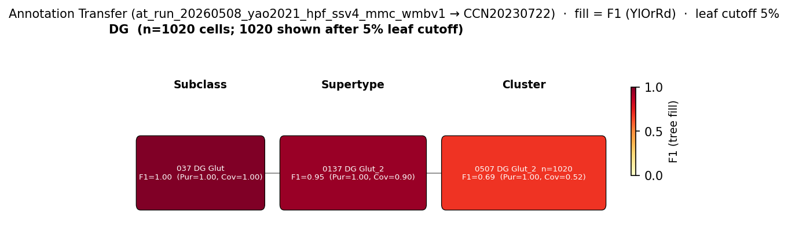

# dentate gyrus semilunar granule cell — WMBv1 (CCN20230722) Mapping Report
*2026-04-27 · Source: `/Users/do12/Documents/GitHub/BICAN_agentic_framework_planning/evidencell/kb/graphs/hippocampus/hippocampus_glutamatergic.yaml`*

---

## Introduction

Semilunar granule cells (SGCs) are spiny, glutamatergic projection neurons of the dentate gyrus whose somata sit at the inner/outer border of the granule cell layer and extend into the inner molecular layer. They were first defined in the rat dentate gyrus on the basis of intrinsic physiology and synaptic targeting [1], and subsequent mouse work has shown that they receive a distinct cortical input profile relative to canonical granule cells [2]. Because SGCs lack a Cell Ontology term of their own, the mapping question here is whether any WMBv1 (CCN20230722) supertype or cluster within the DG Glut subclass selectively captures them, beyond the 0137 DG Glut_2 supertype that dominates the regular granule cell population.

### Classical type table

| Property | Value | References |
|---|---|---|
| Soma location | dentate gyrus granule cell layer [UBERON:0005381] (inner/outer border) | [1] |
| NT type | glutamatergic | [2] |
| Defining markers | none documented at transcript level on morphology-confirmed SGCs | — |
| Negative markers | — | — |
| Neuropeptides | — | — |
| CL term | dentate gyrus granule cell [[CL:2000089](https://www.ebi.ac.uk/ols4/ontologies/cl/classes?obo_id=CL:2000089)] (BROAD) | — |

<details>
<summary>### Details — source evidence for classical type properties</summary>

- **Soma location:** asta_snippet · rat hippocampal slices · [1]
  > We used two-photon imaging, infrared-differential interference contrast microscopy and patch clamp recordings from rat hippocampal slices to define the intrinsic physiology and synaptic targets of spiny, granule-like neurons in the IML, termed semilunar granule cells (SGCs)
  > — Unknown et al. 2007, abstract · [1] <!-- quote_key: 30068647_4c023496 -->
- **NT type / synaptic input identity:** asta_snippet · mouse DG · [2]
  > SGCs receive stronger medial entorhinal cortex and associational synaptic drive but lack short-term facilitation of lateral entorhinal cortex inputs observed in GCs
  > — Unknown et al. 2025, abstract · [2] <!-- quote_key: 277071421_57aeddb7 -->

</details>

### Cell Ontology mapping

Cell Ontology mapping: dentate gyrus granule cell [[CL:2000089](https://www.ebi.ac.uk/ols4/ontologies/cl/classes?obo_id=CL:2000089)] (BROAD).

---

## Results

Annotation transfer of the Bhatt 2025 (GSE280167) DG snRNA-seq cohort and of the Yao 2021 (GSE185862) DG subclass cells onto WMBv1 shows that the DG Glut subclass is dominated by the supertype 0137 DG Glut_2 [CS20230722_SUPT_0137], with a minor (~0.7% of DG nuclei) but markedly distinct supertype 0138 DG Glut_3 [CS20230722_SUPT_0138] that selectively expresses the Bhatt 2025 SGC markers Sorcs3 and Nptx2 (see figure and Bhatt 2025 evidence narrative below). The primary mapping is to SUPT_0138 as the SGC-enriched minor supertype; the SUPT_0137 edge is retained as a secondary mapping because, in the absence of an SGC-specific transcriptomic signature in the Yao 2021 SSv4 cohort, SGCs cannot be separated from regular granule cells at the dominant DG supertype and necessarily contribute to its cell pool.



*F1 across taxonomy levels for the Yao 2021 (GSE185862) DG subclass cells (n=2473) mapped onto WMBv1 (CCN20230722) via local MapMyCells. Each panel row is a source-cell group; nodes are coloured by F1 with **Purity** (Pur) and **Coverage** (Cov) shown inline. Coverage = fraction of source-group cells landing on this target; Purity = fraction of this target's cells coming from the source group. With multiple source groups in the figure, Purity differentiates them; with a single pooled source, Purity is 1.0 at every target and only Coverage discriminates. F1 ≥ 0.5 at a level indicates a clean mapping at that resolution. The Yao 2021 DG subclass label does not distinguish SGCs from regular granule cells; the supertype-level dominance of 0137 DG Glut_2 [CS20230722_SUPT_0137] is expected for the joint DG population, and the 0138 DG Glut_3 [CS20230722_SUPT_0138] SGC signal is not visible in this run.*

### 0138 DG Glut_3 [CS20230722_SUPT_0138] · 🟡 MODERATE

**Supporting evidence:**

- Annotation transfer of Bhatt 2025 (GSE280167) DG snRNA-seq (4 wild-type VV samples, 11,327 nuclei after QC; cluster annotations not in GEO raw data, so cells were retained at the DG Glut subclass level as an SGC proxy) identifies 0138 DG Glut_3 [CS20230722_SUPT_0138] as the minor DG supertype (n=67 cells, 0.6% of DG; n=964 in the WMBv1 atlas at large) selectively enriched for the Bhatt 2025 SGC markers Sorcs3 (53.7% of supertype cells, mean 4.93 UMIs) and Nptx2 (15.9%), versus 9.1% Sorcs3 / <1% Nptx2 in the neighbouring 0137 DG Glut_2 [CS20230722_SUPT_0137] cells (`at_run_20260508_bhatt2025_dg_mmc_wmbv1`).
- Location alignment is CONSISTENT: 98.6% of 0138 DG Glut_3 [CS20230722_SUPT_0138] cells fall within 100 µm of the dentate gyrus granule cell layer [MBA:632], matching the classical inner/outer-border soma location [UBERON:0005381] of SGCs.
- NT match is consistent at the DG Glut subclass level; the supertype itself carries no explicit NT annotation in WMBv1.

**Marker evidence provenance:**

- Sorcs3 and Nptx2 are reported as SGC-enriched markers in Bhatt 2025; the present analysis pulls these enrichments directly from raw-counts re-analysis of GSE280167 nuclei rather than from a published per-cell SGC label, because Bhatt 2025 cluster annotations are not deposited with the GEO raw data (caveat).
- Atf3 and Lct appear in WMBv1 supertype 0138 DG Glut_3 [CS20230722_SUPT_0138] metadata but are not classical SGC markers — they describe the transcriptomic state of the supertype rather than the morpho-physiological identity. Flag for follow-up: confirm Sorcs3 and Nptx2 enrichment on 0138 DG Glut_3 [CS20230722_SUPT_0138] in the WMBv1 precomputed stats by `just add-expression`.

**Property alignment — Table 1.**

| Property | Classical | Supertype | Best cluster | Alignment |
|---|---|---|---|---|
| Soma location | dentate gyrus granule cell layer [UBERON:0005381] | 98.6% within 100 µm of dentate gyrus granule cell layer [MBA:632]; 0138 DG Glut_3 [CS20230722_SUPT_0138] | not assessed | CONSISTENT |
| NT type | glutamatergic | not asserted on supertype (DG Glut subclass annotation) | not assessed | NOT_ASSESSED |

*(Child-cluster breakdown not assessed — see proposed experiments.)*

**Property alignment — Table 2 (Evidence support).**

| Evidence | Type | Supports | Headline | Source |
|---|---|---|---|---|
| Bhatt 2025 MapMyCells AT (GSE280167) | Annotation transfer | SUPPORT | SUPT_0138 Sorcs3 53.7% / Nptx2 15.9% (vs 9.1% / <1% in SUPT_0137) | atlas-internal |

**Concerns:**

- AMBIGUOUS_MAPPING: The SGC inference rests on marker enrichment for Sorcs3 and Nptx2 in 0138 DG Glut_3 [CS20230722_SUPT_0138], not on a formally annotated SGC cluster — Bhatt 2025 use combined ATAC + RNA for clustering and the RNA-only re-analysis here may miss part of the SGC signature. The supertype is a small population (n=82 in GSE280167 nuclei; n=28 in Yao 2021 cells) and the 0137 DG Glut_2 [CS20230722_SUPT_0137] edge to the dominant DG granule supertype must be retained until SGCs can be discriminated within the dominant DG supertype directly.

**What would upgrade confidence:**

- Add Sorcs3 and Nptx2 to the WMBv1 precomputed stats at the DG Glut subclass (`just add-expression`) to formalize the 0138 DG Glut_3 [CS20230722_SUPT_0138] enrichment at the atlas level.
- Obtain the Bhatt 2025 published cluster annotations for GSE280167 to confirm that the SGC cluster (Cluster 18) maps to 0138 DG Glut_3 [CS20230722_SUPT_0138] specifically, rather than to a 0137 DG Glut_2 [CS20230722_SUPT_0137] sub-cluster.
- Run differential expression between Sorcs3-high 0138 DG Glut_3 [CS20230722_SUPT_0138] cells and 0137 DG Glut_2 [CS20230722_SUPT_0137] cells in GSE280167 to discover additional SGC-specific markers usable in independent datasets.
- Check whether 0138 DG Glut_3 [CS20230722_SUPT_0138] cells specifically localise to the inner/outer border of the DG granule cell layer (classical SGC soma position) in WMBv1 MERFISH data.

### 0137 DG Glut_2 [CS20230722_SUPT_0137] · 🟡 MODERATE

**Supporting evidence:**

- Annotation transfer of the Yao 2021 (GSE185862) hippocampal SMART-seq v4 DG subclass cells (n=2473) onto WMBv1 places them dominantly on 0137 DG Glut_2 [CS20230722_SUPT_0137] with F1=0.94 (Coverage=0.88), confirming this supertype as the dominant DG glutamatergic population in CCN20230722 (`at_run_20260508_yao2021_hpf_ssv4_mmc_wmbv1`).
- Location alignment is CONSISTENT: 99.1% of 0137 DG Glut_2 [CS20230722_SUPT_0137] cells fall within 100 µm of the dentate gyrus granule cell layer [MBA:632], with 81.7% strictly inside the layer.
- The Yao 2021 DG subclass label does not separate SGCs from regular granule cells; SGCs (a rare DG subpopulation per [1]) must contribute to the 0137 DG Glut_2 [CS20230722_SUPT_0137] cell pool even though no SGC-specific transcript signature is recoverable from this dataset.

**Property alignment — Table 1.**

| Property | Classical | Supertype | Best cluster | Alignment |
|---|---|---|---|---|
| Soma location | dentate gyrus granule cell layer [UBERON:0005381] | 99.1% within 100 µm of dentate gyrus granule cell layer [MBA:632]; 0137 DG Glut_2 [CS20230722_SUPT_0137] | 0507 DG Glut_2 [CS20230722_CLUS_0507] (region_fraction_100um=0.991) | CONSISTENT |
| NT type | glutamatergic | not asserted | not assessed | NOT_ASSESSED |

*(Child-cluster breakdown not assessed — see proposed experiments.)*

**Property alignment — Table 2 (Evidence support).**

| Evidence | Type | Supports | Headline | Source |
|---|---|---|---|---|
| Yao 2021 MapMyCells AT (GSE185862) | Annotation transfer | PARTIAL | F1=0.94 (Cov=0.88, n=2172) for DG subclass → SUPT_0137 | atlas-internal |

**Concerns:**

- AMBIGUOUS_MAPPING: 0137 DG Glut_2 [CS20230722_SUPT_0137] is the dominant DG supertype shared with the regular granule cell node (`dg_granule_cell_hippocampus`). Without a transcript-level SGC discriminator in the Yao 2021 dataset, SGCs cannot be separated from regular granule cells at this supertype. 0138 DG Glut_3 [CS20230722_SUPT_0138] (covered above) and 0139 DG Glut_4 [CS20230722_SUPT_0139] (9.1% of DG cells) are alternative subpopulation candidates; the Bhatt 2025 re-analysis pulls 0138 DG Glut_3 [CS20230722_SUPT_0138] forward as the SGC-enriched supertype, but 0137 DG Glut_2 [CS20230722_SUPT_0137] still hosts the bulk of any SGC cells in mixed-population sampling.

**What would upgrade confidence:**

- Differential expression between Yao 2021 DG cells mapping to 0138 DG Glut_3 [CS20230722_SUPT_0138] or 0139 DG Glut_4 [CS20230722_SUPT_0139] versus 0137 DG Glut_2 [CS20230722_SUPT_0137] to discover any candidate SGC markers detectable at SSv4 resolution.
- Direct re-mapping of the Bhatt 2025 SGC cluster (Cluster 18, when annotations become available) to confirm whether residual SGC cells map to 0137 DG Glut_2 [CS20230722_SUPT_0137] or partition entirely to 0138 DG Glut_3 [CS20230722_SUPT_0138].

<details>
<summary>### Candidates audited (full top-K)</summary>

| WMBv1 cluster | Supertype | Cells (10x) | Confidence | Key evidence | Verdict |
|---|---|---:|---|---|---|
| `0138 DG Glut_3 [CS20230722_SUPT_0138]` (supertype edge) | — | 964 | 🟡 MODERATE | Bhatt 2025 Sorcs3 53.7% / Nptx2 15.9% | Primary |
| `0137 DG Glut_2 [CS20230722_SUPT_0137]` (supertype edge) | — | 74950 | 🟡 MODERATE | Yao 2021 DG → SUPT_0137 F1=0.94 | Secondary |
| `0138 DG Glut_3 [CS20230722_SUPT_0138]` (atlas-metadata edge) | — | 964 | 🔴 LOW | Atlas region_fraction_100um=0.986; duplicates the primary supertype edge | Eliminated (duplicate of primary supertype edge) |
| `0139 DG Glut_4 [CS20230722_SUPT_0139]` | — | 5166 | 🔴 LOW | Atlas region_fraction_100um=0.767 strict=0.513 | Eliminated (no SGC marker signal) |
| `0136 DG Glut_1 [CS20230722_SUPT_0136]` | — | 1263 | 🔴 LOW | Atlas region_fraction_100um=0.573; off-target Field CA3 [MBA:463] | Eliminated (location scatter; no SGC marker signal) |
| `0507 DG Glut_2 [CS20230722_CLUS_0507]` | 0137 DG Glut_2 | 42250 | 🔴 LOW | Largest SUPT_0137 child; carries dominant DG granule cell pool | Eliminated (dominant GC pool; no SGC discriminator) |
| `0508 DG Glut_3 [CS20230722_CLUS_0508]` | 0138 DG Glut_3 | 165 | 🔴 LOW | SUPT_0138 child; no per-cluster Sorcs3/Nptx2 data assessed | Eliminated (child-level Sorcs3/Nptx2 not assessed) |
| `0509 DG Glut_3 [CS20230722_CLUS_0509]` | 0138 DG Glut_3 | 799 | 🔴 LOW | SUPT_0138 child; no per-cluster Sorcs3/Nptx2 data assessed | Eliminated (child-level Sorcs3/Nptx2 not assessed) |
| `0316 CA3 Glut_5 [CS20230722_CLUS_0316]` | 0079 CA3 Glut_5 | 202 | 🔴 LOW | CA3 stratum radiatum; region_fraction strict=0.044 | Eliminated (wrong region — CA3) |
| `0317 CA3 Glut_5 [CS20230722_CLUS_0317]` | 0079 CA3 Glut_5 | 116 | 🔴 LOW | DG polymorph layer; region_fraction strict=0.101 | Eliminated (wrong region — DG polymorph / CA3) |
| `0079 CA3 Glut_5 [CS20230722_SUPT_0079]` | — | 318 | 🔴 LOW | CA3 supertype; region_fraction strict=0.091 | Eliminated (wrong region — CA3) |

Total edges audited: 12 (2 ANNOTATION_TRANSFER, 10 ATLAS_METADATA). Relationship type retained from Stage A for cuts (evidencell:UncertainRelationship); SSSOM trios committed on survivors only.

</details>

---

### Methods

<details>
<summary>Data sources, analyses, and reproducibility receipts</summary>

**Classical type definition.** The classical SGC type is defined here on the basis of a CLASSICAL_MULTIMODAL combination of intrinsic physiology and synaptic targeting in rat dentate gyrus [1] and refined in mouse by differential entorhinal cortex synaptic drive [2]. Soma location is at the inner/outer border of the dentate gyrus granule cell layer [UBERON:0005381]; NT type is glutamatergic; no transcript-level SGC-specific markers were established at the time of curation. Cell Ontology placement is BROAD against `CL:2000089` (dentate gyrus granule cell): no SGC-specific term exists.

**Atlas mapping query.** Candidate atlas clusters were retrieved from the WMBv1 (CCN20230722) taxonomy at ranks 0 (cluster) and 1 (supertype) using metadata-based scoring (region match, NT type, defining markers, sex bias when applicable). Full scoring rules: `workflows/map-cell-type.md`.

**Property alignment.** Each defining property of the classical type was compared to the corresponding atlas-side value via the `property_comparisons` schema, with alignments graded CONSISTENT / APPROXIMATE / DISCORDANT / NOT_ASSESSED. Atlas-side numerical values came from precomputed expression on the cluster (cluster.yaml in the taxonomy reference store) and from MERFISH spatial registration for soma location.

**Annotation transfer.**

Yao 2021 hippocampal SSv4 run:

| Field | Value |
|---|---|
| Source dataset | GEO:GSE185862 (Yao 2021 mouse hippocampal formation SMART-Seq v4 cell type labels; DG subclass used as source group, n=2473) |
| Source species | NCBITaxon:10090 |
| Target atlas | WMBv1 (CCN20230722) |
| Method | MapMyCells local (cell_type_mapper, default parameters, raw normalization, 100 bootstrap iterations) |
| Tool version | cell_type_mapper |
| n cells | 6398 (filtered to 6398; n=2473 in the DG source group) |
| Run record | [`kb/annotation_transfer_runs/at_run_20260508_yao2021_hpf_ssv4_mmc_wmbv1/manifest.yaml`](../../kb/annotation_transfer_runs/at_run_20260508_yao2021_hpf_ssv4_mmc_wmbv1/manifest.yaml) |
| Code reference | [https://github.com/AllenInstitute/cell_type_mapper](https://github.com/AllenInstitute/cell_type_mapper) |
| F1 matrix | [`f1_scores_best.csv`](../../kb/annotation_transfer_runs/at_run_20260508_yao2021_hpf_ssv4_mmc_wmbv1/f1_scores_best.csv) |
| Caveats | — |

Bhatt 2025 DG snRNA-seq run:

| Field | Value |
|---|---|
| Source dataset | GEO:GSE280167 (DG Glut subclass assignment used as SGC proxy; 4 VV WT samples GSM8643987–GSM8643990) |
| Source species | NCBITaxon:10090 |
| Target atlas | WMBv1 (CCN20230722; SHA-256: b21ca985) |
| Method | MapMyCells local (cell_type_mapper v1.7.1, default parameters, raw normalization, 100 bootstrap iterations) |
| Tool version | cell_type_mapper v1.7.1 |
| n cells | 17354 (filtered to 11327) |
| Run record | [`kb/annotation_transfer_runs/at_run_20260508_bhatt2025_dg_mmc_wmbv1/manifest.yaml`](../../kb/annotation_transfer_runs/at_run_20260508_bhatt2025_dg_mmc_wmbv1/manifest.yaml) |
| Code reference | [https://github.com/AllenInstitute/cell_type_mapper](https://github.com/AllenInstitute/cell_type_mapper) |
| F1 matrix | mmc_output.csv (supertype proportions only — cluster annotations not in GEO raw) |
| Caveats | F1 scores cannot be computed: Bhatt 2025 cluster annotations are not in GEO raw data. mmc_output.csv provides supertype-level mapping proportions only. 11327 of 17354 cells assigned to DG Glut subclass; used as DG semilunar granule cell proxy. Of these, 67 map to 0138 DG Glut_3, the proposed target for edge_dg_semilunar_granule_cell. |

**Anti-hallucination.** All citations, atlas accessions, ontology CURIEs, and verbatim literature quotes in this report are validated against the evidencell knowledge base at write time. Authored-prose evidence narratives are validated against their source `evidence_items[*].explanation` fields. The pre-write hook rejects any unresolvable identifier or unattributed blockquote. Specific mapping limitations and caveats are documented per-candidate in the Discussion section.

*Generated by evidencell `25c2b32` at 2026-06-08T18:37:52+00:00 from [kb/graphs/hippocampus/hippocampus_glutamatergic.yaml](kb/graphs/hippocampus/hippocampus_glutamatergic.yaml).*

**Evidence base table.**

| Edge ID | Evidence types | Supports | Source |
| --- | --- | --- | --- |
| edge_dg_semilunar_granule_cell_hippocampus_to_supt_0138 | ANNOTATION_TRANSFER (Bhatt 2025) | SUPPORT | atlas-internal |
| edge_dg_semilunar_granule_cell_hippocampus_to_supt_0137 | ANNOTATION_TRANSFER (Yao 2021) | PARTIAL | atlas-internal |
| edge_dg_semilunar_granule_cell_hippocampus_to_CS20230722_SUPT_0138 | ATLAS_METADATA | PARTIAL | atlas-internal |
| edge_dg_semilunar_granule_cell_hippocampus_to_CS20230722_SUPT_0137 | ATLAS_METADATA | PARTIAL | atlas-internal |
| edge_dg_semilunar_granule_cell_hippocampus_to_CS20230722_SUPT_0139 | ATLAS_METADATA | PARTIAL | atlas-internal |
| edge_dg_semilunar_granule_cell_hippocampus_to_CS20230722_SUPT_0136 | ATLAS_METADATA | PARTIAL | atlas-internal |
| edge_dg_semilunar_granule_cell_hippocampus_to_CS20230722_CLUS_0507 | ATLAS_METADATA | PARTIAL | atlas-internal |
| edge_dg_semilunar_granule_cell_hippocampus_to_CS20230722_CLUS_0508 | ATLAS_METADATA | PARTIAL | atlas-internal |
| edge_dg_semilunar_granule_cell_hippocampus_to_CS20230722_CLUS_0509 | ATLAS_METADATA | PARTIAL | atlas-internal |
| edge_dg_semilunar_granule_cell_hippocampus_to_CS20230722_CLUS_0316 | ATLAS_METADATA | PARTIAL | atlas-internal |
| edge_dg_semilunar_granule_cell_hippocampus_to_CS20230722_CLUS_0317 | ATLAS_METADATA | PARTIAL | atlas-internal |
| edge_dg_semilunar_granule_cell_hippocampus_to_CS20230722_SUPT_0079 | ATLAS_METADATA | PARTIAL | atlas-internal |

</details>

---

## Discussion

### Best candidate + caveats

**Primary mapping:** dentate gyrus semilunar granule cell → 0138 DG Glut_3 [CS20230722_SUPT_0138] at MODERATE confidence. Key support: Bhatt 2025 MapMyCells annotation transfer of DG snRNA-seq showing selective Sorcs3 and Nptx2 enrichment on this supertype versus all other DG supertypes. Key caveat: AMBIGUOUS_MAPPING — the SGC identification rests on marker enrichment via raw-counts re-analysis of GEO data rather than on a published per-cell SGC cluster label, and the dominant DG supertype 0137 DG Glut_2 [CS20230722_SUPT_0137] must be retained as a secondary mapping because SGCs cannot be separated from regular granule cells in the Yao 2021 cohort.

The Cell Ontology has no specific term for this population; dentate gyrus granule cell [[CL:2000089](https://www.ebi.ac.uk/ols4/ontologies/cl/classes?obo_id=CL:2000089)] is the closest ancestor. Semilunar granule cells are a distinct morpho-physiological subpopulation of DG excitatory projection neurons. No SGC-specific CL term exists; CL:2000089 (dentate gyrus granule cell) is the closest parent. A new CL term request is therefore a reasonable follow-up.

### Proposed experiments and follow-ups

The Bhatt 2025 MapMyCells run has already been completed and is the primary evidence for the 0138 DG Glut_3 [CS20230722_SUPT_0138] mapping; what remains is to formalize the SGC signal at the atlas level and confirm it against an independently annotated SGC cluster.

- **Atlas-level expression formalisation.** Run `just add-expression` for Sorcs3 and Nptx2 across the DG Glut subclass supertypes and clusters in WMBv1 precomputed stats. Target: per-supertype Sorcs3 and Nptx2 mean expression with 0138 DG Glut_3 [CS20230722_SUPT_0138] > 0137 DG Glut_2 [CS20230722_SUPT_0137]. Expected output: an updated `precomputed_expression` block on the 0138 DG Glut_3 [CS20230722_SUPT_0138] supertype that surfaces these markers as discriminators. Resolves: open question 1.
- **Independent SGC cluster confirmation.** Obtain Bhatt 2025 published per-cell cluster annotations (Cluster 18 = SGC) and re-run MapMyCells against WMBv1 with formal cluster labels. Target: F1 ≥ 0.5 at SUPERTYPE level for Cluster 18 → 0138 DG Glut_3 [CS20230722_SUPT_0138]. Expected output: a new `AnnotationTransferEvidence` item with a formal F1 score in place of the current proxy-based supertype proportion. Resolves: open question 2.
- **Marker discovery in unannotated SGC fraction.** Run differential expression between Yao 2021 DG cells whose MapMyCells outputs assign them to 0138 DG Glut_3 [CS20230722_SUPT_0138] vs 0137 DG Glut_2 [CS20230722_SUPT_0137], and between Sorcs3-high vs Sorcs3-low DG nuclei in GSE280167. Target: additional transcript-level SGC discriminators detectable at SSv4 resolution. Expected output: an updated classical-node `defining_markers` list usable in independent datasets. Resolves: open question 3.
- **Spatial confirmation.** Inspect WMBv1 MERFISH data for 0138 DG Glut_3 [CS20230722_SUPT_0138] soma position within the DG granule cell layer. Target: confirm preferential localisation to the inner/outer border (classical SGC position). Expected output: an `anatomical_location` refinement on 0138 DG Glut_3 [CS20230722_SUPT_0138] and a strengthening of the SGC mapping. Resolves: open question 4.

### Open questions

1. Does Sorcs3 appear in the 0138 DG Glut_3 [CS20230722_SUPT_0138] defining markers in the WMBv1 precomputed stats? Running add-expression for Sorcs3 and Nptx2 in DG Glut supertypes would formalize this enrichment at the atlas level.
2. Bhatt 2025 (GSE280167) identifies a SGC-enriched cluster (Cluster 18, Sorcs3+/Penk+/Nptx2+). Does this cluster map specifically to 0138 DG Glut_3 [CS20230722_SUPT_0138], or partly to a 0137 DG Glut_2 [CS20230722_SUPT_0137] sub-cluster?
3. Are there transcriptomic markers that distinguish SGCs from regular DG granule cells in the Yao 2021 (SSv4) dataset? Differential expression between DG cells mapping to 0138 DG Glut_3 [CS20230722_SUPT_0138] vs 0137 DG Glut_2 [CS20230722_SUPT_0137] might reveal candidate markers.
4. Are 0138 DG Glut_3 [CS20230722_SUPT_0138] cells specifically enriched at the inner/outer border of the DG granule cell layer (the anatomical location of SGCs) in the WMBv1 MERFISH data?

---

## References

| # | Citation | PMID | Used for |
|---|---|---|---|
| [1] | Unknown 2007 — Semilunar Granule Cells: Glutamatergic Neurons in the Rat Dentate Gyrus with Axonal Properties | [18077687](https://pubmed.ncbi.nlm.nih.gov/18077687) | soma location, intrinsic physiology |
| [2] | Unknown 2025 — Differential Glutamatergic Inputs to Semilunar Granule Cells and Granule Cells | [40161709](https://pubmed.ncbi.nlm.nih.gov/40161709) | NT identity / synaptic input profile |

<!-- verdict-block-start: edge_dg_semilunar_granule_cell_hippocampus_to_supt_0138 -->
```yaml
verdict:
  confidence: MODERATE
  confidence_score: 0.6
  relationship: skos:closeMatch
  mapping_cardinality: "1:1"
  mapping_justification: semapv:ManualMappingCuration
  rationale: >
    [tier:STRONGEST] Annotation transfer of Bhatt 2025 DG snRNA-seq
    (run_ref at_run_20260508_bhatt2025_dg_mmc_wmbv1) shows that
    CS20230722_SUPT_0138 selectively concentrates the SGC markers
    Sorcs3 (53.7% of supertype cells) and Nptx2 (15.9%) versus
    CS20230722_SUPT_0137 (9.1% / <1%); location is CONSISTENT
    (region_fraction_100um: 0.986) and consistent with the classical
    inner/outer-border soma position of SGCs.
  reconciliation_note: >
    Paired with edge_dg_semilunar_granule_cell_hippocampus_to_supt_0137
    (retained as secondary): SGCs cannot be separated from regular
    granule cells in the dominant CS20230722_SUPT_0137 cohort using
    available transcript-level markers; CS20230722_SUPT_0138 is the
    SGC-enriched minor supertype but residual SGCs likely persist
    in CS20230722_SUPT_0137.
  caveats:
    - caveat_type: AMBIGUOUS_MAPPING
      description: >
        SGC identification rests on Sorcs3 and Nptx2 enrichment in
        CS20230722_SUPT_0138 from a raw-counts re-analysis of
        GSE280167 nuclei, not on a published per-cell SGC cluster
        label; Bhatt 2025 used joint ATAC+RNA clustering and the
        RNA-only signal may be incomplete.
    - caveat_type: LOW_CELL_COUNT
      description: >
        Only 67 of 11327 Bhatt 2025 DG Glut subclass nuclei map to
        CS20230722_SUPT_0138 in this annotation transfer
        (run_ref at_run_20260508_bhatt2025_dg_mmc_wmbv1); the
        supertype itself carries 964 cells in WMBv1.
    - caveat_type: SINGLE_DATASET
      description: >
        The SGC-specific marker enrichment for Sorcs3 and Nptx2 is
        currently anchored on a single annotation transfer
        (run_ref at_run_20260508_bhatt2025_dg_mmc_wmbv1);
        independent replication on a second SGC-annotated dataset
        is not yet available.
  proposed_experiments:
    - Run just add-expression for Sorcs3 and Nptx2 across the DG Glut
      subclass supertypes and clusters in WMBv1 precomputed stats;
      target a per-supertype Sorcs3 mean with CS20230722_SUPT_0138 >
      CS20230722_SUPT_0137.
    - Obtain Bhatt 2025 published per-cell cluster annotations
      (GSE280167 Cluster 18 = SGC) and re-run MapMyCells against
      WMBv1; target F1 >= 0.5 at SUPERTYPE level for Cluster 18 ->
      CS20230722_SUPT_0138.
    - Differential expression between Sorcs3-high CS20230722_SUPT_0138
      cells and CS20230722_SUPT_0137 cells in GSE280167 to discover
      additional SGC-specific markers.
    - Inspect WMBv1 MERFISH soma positions for CS20230722_SUPT_0138
      cells to confirm preferential inner/outer-border localisation
      within the dentate gyrus granule cell layer.
  unresolved_questions:
    - Does Sorcs3 appear in the CS20230722_SUPT_0138 defining-marker
      panel in the WMBv1 precomputed stats?
    - Are CS20230722_SUPT_0138 cells specifically enriched at the
      inner/outer border of the dentate gyrus granule cell layer
      (the classical SGC soma position) in WMBv1 MERFISH data?
```
<!-- verdict-block-end -->

<!-- verdict-block-start: edge_dg_semilunar_granule_cell_hippocampus_to_supt_0137 -->
```yaml
verdict:
  confidence: MODERATE
  confidence_score: 0.55
  relationship: skos:broadMatch
  mapping_cardinality: "1:n"
  mapping_justification: semapv:ManualMappingCuration
  rationale: >
    [tier:NEXT] Annotation transfer of the Yao 2021 DG subclass cells
    (run_ref at_run_20260508_yao2021_hpf_ssv4_mmc_wmbv1) places the
    DG cohort dominantly on CS20230722_SUPT_0137 (F1=0.94,
    region_fraction_100um: 0.991); because no SGC-specific transcript
    discriminator is available in this dataset, SGCs necessarily
    contribute to the CS20230722_SUPT_0137 cell pool alongside
    regular granule cells, justifying a broadMatch from the SGC
    classical type to the dominant DG supertype.
  reconciliation_note: >
    Paired with edge_dg_semilunar_granule_cell_hippocampus_to_supt_0138
    (primary, skos:closeMatch): CS20230722_SUPT_0138 carries the
    SGC-specific Sorcs3/Nptx2 enrichment but is small (0.6% of DG
    nuclei in Bhatt 2025), so residual SGCs are expected within the
    dominant CS20230722_SUPT_0137 supertype.
  caveats:
    - caveat_type: AMBIGUOUS_MAPPING
      description: >
        CS20230722_SUPT_0137 is the dominant DG supertype shared
        with dg_granule_cell_hippocampus; SGCs cannot be separated
        from regular granule cells at this supertype using the
        Yao 2021 SSv4 cohort, so the mapping is broader than 1:1.
    - caveat_type: NO_DISCRIMINATING_MARKER
      description: >
        No transcript-level SGC discriminator is present in the
        Yao 2021 SSv4 dataset; SGCs are inferred to contribute to
        CS20230722_SUPT_0137 only through the rarity argument and
        the Bhatt 2025 Sorcs3/Nptx2 enrichment in the sibling
        supertype CS20230722_SUPT_0138.
  proposed_experiments:
    - Re-map Bhatt 2025 SGC-annotated nuclei (when per-cell cluster
      labels become available) to WMBv1 and quantify how many fall
      on CS20230722_SUPT_0137 versus CS20230722_SUPT_0138.
    - Differential expression between Yao 2021 DG cells mapping to
      CS20230722_SUPT_0137 versus CS20230722_SUPT_0138 to surface
      candidate SGC markers at SSv4 resolution.
  unresolved_questions:
    - Are there transcript-level markers that distinguish SGCs from
      regular DG granule cells within the dominant
      CS20230722_SUPT_0137 supertype?
```
<!-- verdict-block-end -->

<!-- verdict-block-start: edge_dg_semilunar_granule_cell_hippocampus_to_CS20230722_SUPT_0138 -->
```yaml
verdict:
  confidence: LOW
  confidence_score: 0.3
  rationale: >
    [tier:CUT] Duplicate atlas-metadata-only edge to
    CS20230722_SUPT_0138; the survivor supertype edge
    (edge_dg_semilunar_granule_cell_hippocampus_to_supt_0138)
    carries the Bhatt 2025 annotation-transfer evidence and is the
    edge that should be retained.
  reconciliation_note: >
    Legacy / fresh-emit duplicate on taxonomy_type
    CS20230722_SUPT_0138; curator removal of this atlas-metadata
    edge recommended.
```
<!-- verdict-block-end -->

<!-- verdict-block-start: edge_dg_semilunar_granule_cell_hippocampus_to_CS20230722_SUPT_0137 -->
```yaml
verdict:
  confidence: LOW
  confidence_score: 0.3
  rationale: >
    [tier:CUT] Duplicate atlas-metadata-only edge to
    CS20230722_SUPT_0137; the survivor supertype edge
    (edge_dg_semilunar_granule_cell_hippocampus_to_supt_0137)
    carries the Yao 2021 annotation-transfer evidence and is
    the edge that should be retained.
  reconciliation_note: >
    Legacy / fresh-emit duplicate on taxonomy_type
    CS20230722_SUPT_0137; curator removal of this atlas-metadata
    edge recommended.
```
<!-- verdict-block-end -->

<!-- verdict-block-start: edge_dg_semilunar_granule_cell_hippocampus_to_CS20230722_SUPT_0139 -->
```yaml
verdict:
  confidence: LOW
  confidence_score: 0.2
  rationale: >
    [tier:CUT] CS20230722_SUPT_0139 (DG Glut_4) is a DG-resident
    glutamatergic supertype but no SGC marker signal
    (Sorcs3 / Nptx2) is reported on it in the Bhatt 2025
    annotation transfer run; only 131 of
    11327 DG nuclei map to it.
```
<!-- verdict-block-end -->

<!-- verdict-block-start: edge_dg_semilunar_granule_cell_hippocampus_to_CS20230722_SUPT_0136 -->
```yaml
verdict:
  confidence: LOW
  confidence_score: 0.15
  rationale: >
    [tier:CUT] CS20230722_SUPT_0136 (DG Glut_1) shows
    region_fraction_100um: 0.573 with substantial off-target
    spread into Field CA3; no SGC marker signal and only 46 of
    11327 DG nuclei map to it in the Bhatt 2025 annotation
    transfer run.
```
<!-- verdict-block-end -->

<!-- verdict-block-start: edge_dg_semilunar_granule_cell_hippocampus_to_CS20230722_CLUS_0507 -->
```yaml
verdict:
  confidence: LOW
  confidence_score: 0.25
  rationale: >
    [tier:CUT] CS20230722_CLUS_0507 is the largest child cluster
    of CS20230722_SUPT_0137 and carries the dominant DG granule
    cell pool; no per-cluster SGC discriminator is available, so
    a cluster-level mapping is not supportable above the supertype
    edges already retained.
```
<!-- verdict-block-end -->

<!-- verdict-block-start: edge_dg_semilunar_granule_cell_hippocampus_to_CS20230722_CLUS_0508 -->
```yaml
verdict:
  confidence: LOW
  confidence_score: 0.25
  rationale: >
    [tier:CUT] CS20230722_CLUS_0508 is a child of
    CS20230722_SUPT_0138 but per-cluster Sorcs3/Nptx2 expression
    has not been assessed in WMBv1 precomputed stats; cluster-level
    resolution depends on a future just add-expression follow-up.
```
<!-- verdict-block-end -->

<!-- verdict-block-start: edge_dg_semilunar_granule_cell_hippocampus_to_CS20230722_CLUS_0509 -->
```yaml
verdict:
  confidence: LOW
  confidence_score: 0.25
  rationale: >
    [tier:CUT] CS20230722_CLUS_0509 is a child of
    CS20230722_SUPT_0138 but per-cluster Sorcs3/Nptx2 expression
    has not been assessed in WMBv1 precomputed stats; cluster-level
    resolution depends on a future just add-expression follow-up.
```
<!-- verdict-block-end -->

<!-- verdict-block-start: edge_dg_semilunar_granule_cell_hippocampus_to_CS20230722_CLUS_0316 -->
```yaml
verdict:
  confidence: REFUTED
  confidence_score: 0.05
  rationale: >
    [tier:CUT] CS20230722_CLUS_0316 is a CA3 stratum radiatum
    cluster (region_fraction strict 0.044, region_fraction_100um
    0.578); wrong region for SGCs, which are confined to the
    dentate gyrus granule cell layer.
```
<!-- verdict-block-end -->

<!-- verdict-block-start: edge_dg_semilunar_granule_cell_hippocampus_to_CS20230722_CLUS_0317 -->
```yaml
verdict:
  confidence: REFUTED
  confidence_score: 0.05
  rationale: >
    [tier:CUT] CS20230722_CLUS_0317 is a CA3 Glut_5 cluster
    located dominantly in the DG polymorph layer
    (region_fraction strict 0.101, region_fraction_100um 0.846);
    polymorph-layer / CA3 identity, not the SGC granule cell
    layer position.
```
<!-- verdict-block-end -->

<!-- verdict-block-start: edge_dg_semilunar_granule_cell_hippocampus_to_CS20230722_SUPT_0079 -->
```yaml
verdict:
  confidence: REFUTED
  confidence_score: 0.05
  rationale: >
    [tier:CUT] CS20230722_SUPT_0079 (CA3 Glut_5 supertype) is a
    CA3 / DG polymorph-layer supertype
    (region_fraction strict 0.091, region_fraction_100um 0.818);
    wrong region for SGCs, which are dentate gyrus granule cell
    layer residents.
```
<!-- verdict-block-end -->
