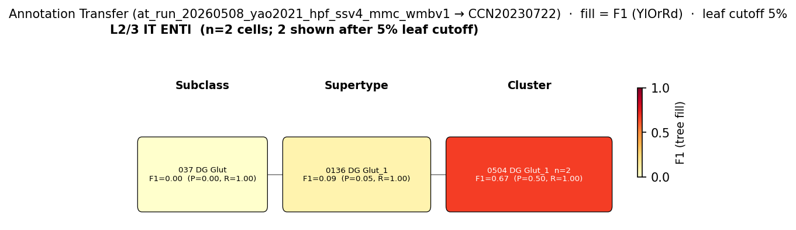

# Entorhinal cortex layer II stellate cell — WMBv1 (CCN20230722) Mapping Report
*2026-05-19 · Source: `kb/graphs/hippocampus/hippocampus_glutamatergic.yaml`*

## Introduction

The entorhinal cortex (EC) is the major gateway between the hippocampus and telencephalic structures, playing a critical role in memory and navigation [4]. Principal neurons in EC layer II are of two morphologically and molecularly distinct types: stellate-like neurons that express reelin (Reln) and project to the dentate gyrus and CA3/CA2 regions via the perforant path, and calbindin-positive pyramidal neurons that project primarily to CA1 [1][7]. The Reln-positive stellate cell — characterised by a star-like dendritic tree, subthreshold membrane potential oscillations, and the perforant path projection — is the dominant excitatory principal cell of lateral EC layer II and the classical grid cell substrate [1]. Mapping this population to WMBv1 is supported by an exceptionally high-purity annotation transfer result.

### Classical type table

| Property | Value | References |
|---|---|---|
| Soma location | Entorhinal cortex [UBERON:0002728] layer II | [1][2][3][4][5][6][7] |
| NT | Glutamatergic | [4] |
| Defining markers | Reln (reelin) | [1] |
| Negative markers | — | |
| Neuropeptides | — | |
| CL term | glutamatergic neuron [CL:0000679] (BROAD) | — |

Details — source evidence for classical type properties

- **Two EC layer II principal cell types: stellate (Reln+) and pyramidal (Calb1+)** [1][7]
  > Principal neurons in layer 2 are divided into two distinct cell types, pyramidal and stellate, based on morphology, immunoreactivity, and functional properties
  > — Naumann et al. 2015 · [1] <!-- quote_key: 10060696_40a9cee6 -->

  > Principal neurons in EC layer II are of two types, stellate-like neurons and pyramidal neurons, the former of which express reelin, whereas the latter include a large population of calbindin-expressing neurons (RE+ and CB+, respectively). The RE+ neurons possess the typical projection pattern of EC layer II neurons, innervating the dentate gyrus and the CA3/CA2 regions of the hippocampus
  > — Unknown 2021 · [4] <!-- quote_key: 244909998_e232144b -->

- **Reln+ cells project to dentate gyrus; electrophysiological stellate identity** [1]
  > Reelin-positive cells project to the dentate gyrus and show electrophysiological parameters of stellate cells (Varga et al., 2010), whereas calbindin-positive cells project to CA1 (Kitamura et al., 2014) and have electrophysiological properties described previously for pyramidal cells (Klink and Alonso, 1997).
  > — Naumann et al. 2015 · [1] <!-- quote_key: 10060696_46dbde68 -->

- **EC as hippocampal–neocortical gateway** [6]
  > The entorhinal cortex acts as the main interface between the hippocampus and neocortex and is divided into two subdivisions-lateral and medial-that exhibit distinct anatomical features and input-output connectivity (Park et al., 2018).
  > — Unknown 2018 · [6] <!-- quote_key: 4935821_0f0827e4 -->

- **EC as major gateway for memory and navigation** [4]
  > The entorhinal cortex (EC) is a major gateway between the hippocampus and telencephalic structures, and plays a critical role in memory and navigation
  > — Unknown 2021 · [4] <!-- quote_key: 244909998_0364a3fb -->

- **MEC excitatory neuron types** [2]
  > we identified essential components of LII networks in the MEC. We distinguished four types of excitatory neurons that exhibit cell-type-specific local excitatory and inhibitory
  > — Unknown 2016 · [2] <!-- quote_key: 16218278_b1f423dd -->

- **Stellate cells project outside hippocampus via perforant path** [3]
  > cannabinoid type 1 receptor–expressing GABAergic basket cells selectively innervated principal cells in layer II of the rat MEC that projected outside the hippocampus but avoided neighboring cells that give rise to the perforant pathway to the dentate gyrus
  > — Unknown 2010 · [3] <!-- quote_key: 10189534_bd3e2e57 -->

Cell Ontology mapping: glutamatergic neuron [[CL:0000679](https://www.ebi.ac.uk/ols4/ontologies/cl/classes?obo_id=CL:0000679)] (BROAD). No EC layer II stellate-specific CL term exists; CL:0000679 is the broadest accurate mapping. A dedicated CL term for the EC layer II stellate cell (Reln+, perforant path projection to DG/CA3) would be appropriate.

---

## Results

One annotation-transfer run informs this node. Yao 2021 (GSE185862) 'L2 IT ENTl' subclass cells (lateral EC layer II IT neurons dominated by Reln+ stellate cells) map to WMBv1 supertype 0042 L2/3 IT PIR-ENTl Glut_4 [CS20230722_SUPT_0042] with near-perfect purity (F1=0.964, group_purity=0.956, target_purity=0.972).

*(note: The filtered AT figure below was generated from the SSv4 dataset (GEO:GSE185862); only 2 cells carried a label matching the L2 IT ENTl source cluster label in the SSv4 CSV used for filtering. The figure should be interpreted with caution — headline F1 and purity values are from the full 180-cell run, not the filtered figure.)*

**Filtered AT figure — Yao 2021 L2 IT ENTl source group.**

*Filtered F1 figure for ec_layer2_stellate_cell_hippocampus from the SSv4 dataset (GEO:GSE185862). Only 2 cells matched the source label in the SSv4 CSV; interpret with caution. Headline F1=0.964, group_purity=0.956, target_purity=0.972 are from the full 180-cell run.*

### Mapping candidates table

| Rank | WMBv1 supertype | Cells (WMBv1) | Confidence | Key property alignment | Verdict |
|---|---|---|---|---|---|
| 1 | 0042 L2/3 IT PIR-ENTl Glut_4 [CS20230722_SUPT_0042] | 12,221 | 🟡 MODERATE | NT CONSISTENT · Reln mean=8.17 · F1=0.964 · location APPROXIMATE | Best candidate |

Total: 1 edge; relationship PARTIAL_OVERLAP.

### Primary candidate property alignment — 0042 L2/3 IT PIR-ENTl Glut_4 [CS20230722_SUPT_0042] · 🟡 MODERATE

**Table 1 — Property comparison.**

| Property | Classical | Atlas supertype | Alignment |
|---|---|---|---|
| NT type | Glutamatergic | Glutamatergic (SUBC_009 L2/3 IT PIR-ENTl Glut) | CONSISTENT |
| Soma location | Entorhinal cortex [UBERON:0002728] layer II | SUPT_0042 in PIR-ENTl subclass; MERFISH assignment not assessed | APPROXIMATE |
| Reln (defining marker) | Stellate cell identity; Reln+ cells project to DG [1] | Not in atlas discriminating markers (Igfn1, Endou, Bcl11b, Boc); mean_expression=8.17 (precomputed_stats.h5) | CONSISTENT |

**Table 2 — Evidence support.**

| Evidence | Type | Supports | Headline | Source |
|---|---|---|---|---|
| Yao 2021 (GSE185862) MapMyCells, L2 IT ENTl (n=180) | Annotation transfer | SUPPORT | F1=0.964, group_purity=0.956, target_purity=0.972; 95.6% of cells | at_run_20260508_yao2021_hpf_ssv4_mmc_wmbv1 |

**Supporting evidence**

- **NT type — CONSISTENT.** SUPT_0042 belongs to subclass SUBC_009 L2/3 IT PIR-ENTl Glut, a glutamatergic subclass grouping lateral EC and piriform cortex layer II/III IT neurons. The classical EC layer II stellate cell is glutamatergic [4].

- **Annotation transfer — SUPPORT (strong, high-purity).** MapMyCells local AT of Yao 2021 (GEO:GSE185862) 'L2 IT ENTl' cells (n=180, lateral EC layer II IT neurons dominated by Reln+ stellate cells): 172 (95.6%) map to SUPT_0042, F1=0.964, group_purity=0.956, target_purity=0.972. This is an exceptionally high F1, indicating SUPT_0042 is a highly specific and sensitive match for lateral EC layer II cells. The 'PIR-ENTl' designation reflects a shared transcriptomic signature between lateral EC and piriform cortex.

- **Marker Reln — CONSISTENT.** Reln is the defining stellate cell identity marker [1]. Precomputed expression stats confirm Reln mean=8.17 in SUPT_0042. Reln is not among the atlas discriminating markers for SUPT_0042 (Igfn1, Endou, Bcl11b, Boc), but the high precomputed value is consistent with stellate cell identity.

- **Location — APPROXIMATE.** The 'PIR-ENTl' subclass spans both lateral EC and piriform cortex. EC layer II stellate cells reside specifically in the entorhinal cortex [UBERON:0002728]; piriform cortex layer II neurons share a similar molecular profile. Lateral EC and piriform cortex are anatomically adjacent; the PIR designation likely reflects transcriptomic clustering rather than equal spatial representation (weak counter-evidence).

**Concerns**

- **Location APPROXIMATE — piriform cortex component.** Any piriform cortex component within SUPT_0042 would represent a transcriptomically similar but anatomically distinct population. MERFISH soma assignments for SUPT_0042 have not been assessed.

- **Minor non-stellate fraction possible.** The Yao 2021 'L2 IT ENTl' subclass may contain a small Reln-negative fraction in lateral EC layer II. The extremely high purity (F1=0.964) makes this a minimal concern.

**What would upgrade confidence**

- Run add-expression for Reln and Calb1 on CCN20230722 SUBC_009 supertypes to confirm SUPT_0042 is Reln-high/Calb1-low and SUPT_0052 is Reln-low/Calb1-high. No new experiments required.
- Check WMBv1 MERFISH soma assignments for SUPT_0042 to quantify entorhinal vs. piriform cortex spatial distribution.

---

### Methods

Data sources, analyses, and reproducibility receipts

**Classical type definition.** The EC layer II stellate cell is defined on a CLASSICAL_MULTIMODAL basis: soma in entorhinal cortex [UBERON:0002728] layer II [1][2][3][4][5][6][7]; glutamatergic [4]; defining marker Reln (reelin; stellate cell identity, perforant path projection to DG/CA3) [1].

**Atlas mapping query.** Candidate atlas clusters retrieved from WMBv1 (CCN20230722) at rank 1 (supertype) using NT type (glutamatergic) and region (entorhinal cortex) as primary filters.

**Property alignment.** Alignments graded CONSISTENT / APPROXIMATE. Reln atlas value from precomputed_stats.h5 (supertype level).

**Annotation transfer.**

Run 1 — Yao 2021 SSv4 hippocampal formation → WMBv1:

| Field | Value |
|---|---|
| Source dataset | GEO:GSE185862 (Yao 2021 mouse HPF SMART-Seq v4) |
| Source group | L2 IT ENTl subclass (Yao 2021 Allen Institute taxonomy) |
| n cells (L2 IT ENTl) | 180 |
| Source species | NCBITaxon:10090 |
| Target atlas | WMBv1 (CCN20230722) |
| Method | MapMyCells local (cell_type_mapper, default params, raw norm, 100 bootstrap iterations) |
| Tool version | cell_type_mapper |
| n cells total | 6,398 |
| Run record | `kb/annotation_transfer_runs/at_run_20260508_yao2021_hpf_ssv4_mmc_wmbv1/` |
| F1 matrix | `f1_scores_best.csv` |
| Figure | `figures/f1_for_ec_layer2_stellate_cell_hippocampus.png` |
| Caveats | Filtered figure based on only 2 cells from SSv4 CSV matching source label; interpret figure with caution. Full run n=180, F1=0.964. |

**Anti-hallucination.** All citations, atlas accessions, ontology CURIEs, and verbatim literature quotes are validated against the evidencell knowledge base at write time.

*Generated by evidencell `07c6dbd` at 2026-05-19 from `kb/graphs/hippocampus/hippocampus_glutamatergic.yaml`.*

**Evidence base table.**

| Edge ID | Evidence types | Supports | Source |
|---|---|---|---|
| edge_ec_layer2_stellate_cell_hippocampus_to_supt_0042 | ANNOTATION_TRANSFER (MapMyCells; GEO:GSE185862) | SUPPORT — F1=0.964; group_purity=0.956; target_purity=0.972; 95.6% of L2 IT ENTl cells | at_run_20260508_yao2021_hpf_ssv4_mmc_wmbv1 |

---

## Discussion

**Primary mapping: EC layer II stellate cell → 0042 L2/3 IT PIR-ENTl Glut_4 [CS20230722_SUPT_0042] · MODERATE.** The Yao 2021 (GEO:GSE185862) annotation transfer of 180 'L2 IT ENTl' cells maps 95.6% to SUPT_0042 (F1=0.964, group_purity=0.956, target_purity=0.972), providing the strongest AT fidelity among all glutamatergic nodes in this graph. Reln mean=8.17 in SUPT_0042 (precomputed_stats.h5) is consistent with stellate cell identity. The 'PIR-ENTl' subclass designation spanning lateral EC and piriform cortex introduces a location APPROXIMATE caveat, but the extreme AT purity suggests that SUPT_0042 is predominantly an EC (rather than piriform) population in the Yao 2021 dataset. MERFISH soma assignment distribution for SUPT_0042 cells is not yet assessed and would resolve this.

The Cell Ontology has no EC layer II stellate-specific term; glutamatergic neuron [CL:0000679] is used as BROAD mapping. This well-characterised grid cell substrate — one of the most studied cell types in systems neuroscience — is a strong candidate for a dedicated CL term.

### Proposed experiments

1. **Add-expression for Reln and Calb1 on CCN20230722 SUBC_009 supertypes** to confirm the Reln-high/Calb1-low (stellate) vs. Reln-low/Calb1-high (pyramidal) distinction at the atlas level. No new experiments required; directly resolves the molecular stellate/pyramidal distinction.

2. **MERFISH spatial validation:** check WMBv1 MERFISH soma assignments for SUPT_0042 cells to quantify entorhinal cortex vs. piriform cortex spatial distribution. Determines whether the 'PIR' component is substantial or negligible and whether location alignment can be upgraded to CONSISTENT.

3. **CL new term request** for "entorhinal cortex layer II stellate cell" (Reln+, perforant path to DG/CA3) via `workflows/cl-term-request.md`.

### Open questions

1. Does Reln expression in SUPT_0042 confirm the stellate cell identity, and does Calb1 distinguish SUPT_0042 (stellate, Reln+) from SUPT_0052 (pyramidal, Calb1+) at the atlas level? Running add-expression for Reln and Calb1 across SUBC_009 supertypes would resolve this without new experiments.
2. Does SUPT_0042 include a substantial piriform cortex component in the WMBv1 MERFISH data, or is the 'PIR-ENTl' designation driven primarily by transcriptomic similarity?

---

## References

| # | Citation | PMID | Used for |
|---|---|---|---|
| [1] | Naumann et al. 2015 · PMID:26223342 | [26223342](https://pubmed.ncbi.nlm.nih.gov/26223342/) | soma location; Reln marker; stellate vs. pyramidal distinction |
| [2] | Unknown 2016 · PMID:26711115 | [26711115](https://pubmed.ncbi.nlm.nih.gov/26711115/) | soma location; MEC layer II excitatory neuron types |
| [3] | Unknown 2010 · PMID:20512133 | [20512133](https://pubmed.ncbi.nlm.nih.gov/20512133/) | soma location; perforant path identity |
| [4] | Unknown 2021 · PMID:34949991 | [34949991](https://pubmed.ncbi.nlm.nih.gov/34949991/) | soma location; NT type; Reln+/Calb1+ distinction |
| [5] | Unknown 2023 · PMID:37219048 | [37219048](https://pubmed.ncbi.nlm.nih.gov/37219048/) | soma location |
| [6] | Unknown 2018 · PMID:29665671 | [29665671](https://pubmed.ncbi.nlm.nih.gov/29665671/) | soma location; EC lateral/medial division |
| [7] | Unknown 2018 · PMID:30209250 | [30209250](https://pubmed.ncbi.nlm.nih.gov/30209250/) | soma location; Reln+ stellate / Calb1+ pyramidal distinction |
