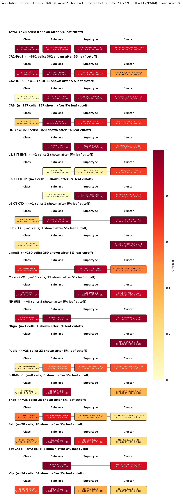

# entorhinal cortex layer III PCP4-positive pyramidal cell — WMBv1 (CCN20230722) Mapping Report
*2026-04-27 · Source: `/Users/do12/Documents/GitHub/BICAN_agentic_framework_planning/evidencell/kb/graphs/hippocampus/hippocampus_glutamatergic.yaml`*

---

## Introduction

Entorhinal cortex (EC) layer III principal cells are glutamatergic pyramidal neurons that originate the temporoammonic pathway, projecting from layer III directly to CA1 stratum lacunosum-moleculare and to the subiculum. They express Purkinje cell protein 4 (Pcp4), a calmodulin-binding peptide which is shared with CA2 pyramidal cells but distinguishes EC layer III principal cells from layer II stellate/island cells in the entorhinal cortex itself [1][2]. Mapping these cells onto the WMBv1 (CCN20230722) taxonomy matters because the temporoammonic input from EC layer III is the primary direct cortical drive to CA1 distal dendrites and is a major target of selective vulnerability in neurodegenerative disease.

### Classical type table

| Property | Value | References |
|---|---|---|
| Soma location | entorhinal cortex [UBERON:0002728] (layer III) | — |
| Neurotransmitter | glutamatergic | [1] |
| Markers | Pcp4 (defining) | [1][2] |

<details>
<summary>Details — source evidence for classical type properties</summary>

- **Pcp4 (defining marker):** Ohara et al. 2021 · [1]
  > Principal neurons in entorhinal cortex layer III express Purkinje cell protein 4 (PCP4) and project to CA1 and the subiculum (Ohara et al., 2021).
  > — Ohara et al. 2021, Entorhinal Cortex Glutamatergic Populations · [1] <!-- quote_key: 244909998_c43772d2 -->

- **Pcp4 (defining marker):** Ohara et al. 2021 · [1]
  > Principal neurons in EC layer III express Purkinje cell protein 4 (PCP4) and project to CA1 and the subiculum
  > — Ohara et al. 2021, INTRODUCTION · [1] <!-- quote_key: 244909998_bdbb7689 -->

- **Pcp4 (specificity context):** Antonio et al. 2014 · [2]
  > Here we report identification of the CA2 region in the mouse by immunostaining with a Purkinje cell protein 4 (PCP4) antibody, which effectively delineates CA3/CA2 and CA2/CA1 borders and agrees well with previous cytoarchitectural definitions of CA2
  > — Antonio et al. 2014, abstract · [2] <!-- quote_key: 18746823_614030d2 -->

</details>

Cell Ontology mapping: pyramidal neuron [[CL:0000598](https://www.ebi.ac.uk/ols4/ontologies/cl/classes?obo_id=CL:0000598)] (BROAD).

---

## Results

Annotation transfer of Yao 2021 (GSE185862) SMART-Seq v4 hippocampal-formation cells onto WMBv1 (CCN20230722) via local MapMyCells maps the L3 IT ENT subclass to 0036 L2/3 IT ENT Glut_4 [CS20230722_SUPT_0036] (F1=0.94, coverage=0.89, purity=0.99) as the primary supertype, with a secondary 10.2% of L3 IT ENT cells routing to 0037 L2/3 IT ENT Glut_5 [CS20230722_SUPT_0037] (F1=0.18); together the two supertypes account for 99.0% of L3 IT ENT cells. The mapping is corroborated by Pcp4 transcript expression on both supertypes (Pcp4 mean 10.57 on CS20230722_SUPT_0036, 9.44 on CS20230722_SUPT_0037, child-cluster coverage = 1.000), and by MERFISH spatial distribution of these supertypes within the entorhinal area (region_fraction_100um = 0.984 and 0.943 respectively) — see property comparison table and annotation transfer figure.



*F1 across taxonomy levels for the Yao 2021 (GSE185862) SSv4 source labels mapped onto WMBv1 (CCN20230722). Each panel row is a Yao 2021 subclass; nodes are coloured by F1 with **Purity** (Pur) and **Coverage** (Cov) shown inline. Coverage = fraction of source-group cells landing on this target; Purity = fraction of this target's cells from the source group. F1 ≥ 0.5 at a level indicates a clean mapping at that resolution.*

### 0036 L2/3 IT ENT Glut_4 · 🟢 HIGH

**Property alignment**

| Property | Classical | Supertype | Best cluster | Alignment |
|---|---|---|---|---|
| NT type | glutamatergic | not asserted | not assessed | NOT_ASSESSED |
| Soma location | entorhinal cortex [UBERON:0002728] | Entorhinal area, medial part, dorsal zone [MBA:926] count_100um=9114; layer 5 [MBA:727] count_100um=6876 | not assessed | CONSISTENT |
| Pcp4 expression | defining marker | mean=10.57; cohort_pct=0.891; child-coverage=1.000 | not assessed | CONSISTENT |

*(Child-cluster breakdown not assessed — see proposed experiments.)*

**Evidence support**

| Evidence | Type | Supports | Headline | Source |
|---|---|---|---|---|
| Yao 2021 SSv4 L3 IT ENT → WMBv1 MapMyCells | Annotation transfer | SUPPORT | F1=0.94, cov=0.89, pur=0.99 | atlas-internal |

**Supporting evidence**
- Yao 2021 (GSE185862) L3 IT ENT subclass cells (n=588) transfer onto CS20230722_SUPT_0036 with F1=0.937, coverage 0.888, purity 0.992 (`at_run_20260508_yao2021_hpf_ssv4_mmc_wmbv1`). At supertype resolution this is a clean, high-purity landing.
- Pcp4 transcript on CS20230722_SUPT_0036 reaches a mean of 10.57 (cohort percentile 0.891 within the glutamatergic MBA:909 cohort; child-cluster coverage 1.000), aligning with the defining marker on the classical node.
- MERFISH spatial distribution places CS20230722_SUPT_0036 inside the Entorhinal area, medial part, dorsal zone (region_fraction_100um = 0.984; strict region_fraction = 0.937).

**Marker evidence provenance**
- **Pcp4 (defining):** transcript-level reference in Ohara et al. 2021 [1]; protein-level (immunostaining) characterisation in Antonio et al. 2014 [2] established Pcp4 as a CA2 delineator. The atlas-side supertype mean (10.57) is in the top decile of the glutamatergic hippocampal cohort and child-cluster coverage is complete, supporting Pcp4 as a transcript-level discriminator on this supertype as well as on CA2.

**Concerns**
- AMBIGUOUS_MAPPING: 10.2% of Yao 2021 L3 IT ENT cells route instead to CS20230722_SUPT_0037 (TYPE_A_SPLITS). The two supertypes together capture 99.0% of L3 IT ENT cells; the split suggests the L3 IT ENT subclass collapses across two adjacent WMBv1 supertypes rather than mapping 1:1.
- NT type not asserted on the WMBv1 supertype (NOT_ASSESSED for `nt_type`).
- An auto-repredication on 2026-05-26 migrated this edge from the deprecated `evidencell:PartialOverlapMatch` to `skos:closeMatch`; curator review of the migrated predicate is still pending.

**What would upgrade confidence**
- Cluster-level annotation transfer breakdown: drilling MapMyCells assignments to rank-0 children of CS20230722_SUPT_0036 + CS20230722_SUPT_0037 with F1 ≥ 0.80 at cluster resolution would resolve whether a single child cluster carries the temporoammonic-projecting L3 PCP4+ population or whether the split is genuine.
- Patch-seq or projection-defined tracing (CA1-projecting EC layer III cells captured by retrograde labelling) followed by transcriptomic alignment would directly bridge the classical projection-defined identity to a WMBv1 cluster, adding an AnnotationTransferEvidence entry with experimental provenance for source-cell identity.
- Confirmation of Pcp4 specificity against EC layer II (Reelin-expressing stellate cells) in the WMBv1 atlas — Pcp4 should be discriminative against EC layer II but is also expressed in CA2 pyramidal cells; an explicit comparison of mean Pcp4 across EC layer II vs. layer III supertypes would tighten the marker case.

### 0037 L2/3 IT ENT Glut_5 · 🟡 MODERATE

**Property alignment**

| Property | Classical | Supertype | Best cluster | Alignment |
|---|---|---|---|---|
| NT type | glutamatergic | not asserted | not assessed | NOT_ASSESSED |
| Soma location | entorhinal cortex [UBERON:0002728] | Entorhinal area, lateral part [MBA:918] count_100um=2077; layer 3 [MBA:52] count_100um=1749 | not assessed | CONSISTENT |
| Pcp4 expression | defining marker | mean=9.44; cohort_pct=0.707; child-coverage=1.000 | not assessed | CONSISTENT |

*(Child-cluster breakdown not assessed — see proposed experiments.)*

**Evidence support**

| Evidence | Type | Supports | Headline | Source |
|---|---|---|---|---|
| Yao 2021 SSv4 L3 IT ENT → WMBv1 MapMyCells (secondary) | Annotation transfer | PARTIAL | F1=0.18, n≈60/588 | atlas-internal |

**Supporting evidence**
- 10.2% of Yao 2021 L3 IT ENT cells (n≈60) land on CS20230722_SUPT_0037 at supertype resolution, complementing the primary CS20230722_SUPT_0036 mapping (together 99.0% of L3 IT ENT cells).
- Pcp4 transcript mean on CS20230722_SUPT_0037 = 9.44 (cohort percentile 0.707; child-cluster coverage 1.000) — consistent with the defining marker.
- MERFISH spatial distribution places CS20230722_SUPT_0037 in the lateral entorhinal area at layer 3 (region_fraction_100um = 0.943); soma location is consistent with the classical type at the appropriate cortical layer.

**Concerns**
- F1=0.177 is low; the secondary route is a minority of L3 IT ENT cells and most of the supertype's cells originate elsewhere (purity not separately reported for the secondary target in this AT run).
- NT type not asserted on the WMBv1 supertype (NOT_ASSESSED for `nt_type`).
- Auto-repredication on 2026-05-26 from the deprecated `evidencell:PartialOverlapMatch` to `skos:closeMatch`; curator review pending.

**What would upgrade confidence**
- Within-supertype cluster resolution targeting (MapMyCells at cluster rank with F1 ≥ 0.50 on the secondary cohort) would clarify whether the 10.2% split reflects a distinct EC layer III subtype localised to lateral EC layer 3 (where CS20230722_SUPT_0037 sits per MERFISH) or transcriptomic similarity at the supertype mean.
- Retrograde projection-defined sampling (CA1-projecting EC layer III neurons) crossed with transcriptomics would distinguish whether both CS20230722_SUPT_0036 and CS20230722_SUPT_0037 contribute to the temporoammonic pathway.

<details>
<summary>Candidates audited (full top-K)</summary>

| WMBv1 cluster | Supertype | Cells (10x) | Confidence | Key evidence | Verdict |
|---|---|---:|---|---|---|
| `0036 L2/3 IT ENT Glut_4 [CS20230722_SUPT_0036]` | — | 11921 | 🟢 HIGH | L3 IT ENT AT F1=0.94 to supertype | Primary |
| `0037 L2/3 IT ENT Glut_5 [CS20230722_SUPT_0037]` | — | 3557 | 🟡 MODERATE | L3 IT ENT AT secondary 10.2% | Secondary |
| `0014 IT EP-CLA Glut_2 [CS20230722_CLUS_0014]` | 0004 IT EP-CLA Glut_2 | 849 | ⚪ UNCERTAIN | EP-CLA cluster; Pcp4=5.46 APPROXIMATE | Eliminated (EP-CLA, not EC layer III) |
| `0015 IT EP-CLA Glut_2 [CS20230722_CLUS_0015]` | 0004 IT EP-CLA Glut_2 | 304 | ⚪ UNCERTAIN | EP-CLA cluster; Pcp4=5.98 APPROXIMATE | Eliminated (EP-CLA, not EC layer III) |
| `0024 L5/6 IT TPE-ENT Glut_1 [CS20230722_CLUS_0024]` | 0007 L5/6 IT TPE-ENT Glut_1 | 751 | ⚪ UNCERTAIN | L5/6 cluster, wrong EC layer | Eliminated (L5/6 not L3) |
| `0025 L5/6 IT TPE-ENT Glut_1 [CS20230722_CLUS_0025]` | 0007 L5/6 IT TPE-ENT Glut_1 | 512 | ⚪ UNCERTAIN | L5/6 cluster, wrong EC layer | Eliminated (L5/6 not L3) |
| `0027 L5/6 IT TPE-ENT Glut_2 [CS20230722_CLUS_0027]` | 0008 L5/6 IT TPE-ENT Glut_2 | 739 | ⚪ UNCERTAIN | L5/6 cluster, wrong EC layer | Eliminated (L5/6 not L3) |
| `0010 L5/6 IT TPE-ENT Glut_4 [CS20230722_SUPT_0010]` | — | 1791 | ⚪ UNCERTAIN | L5/6 supertype, wrong EC layer | Eliminated (L5/6 not L3) |
| `0068 ENTmv-PA-COAp Glut_3 [CS20230722_SUPT_0068]` | — | 963 | ⚪ UNCERTAIN | ENTmv-PA-COAp; Pcp4=2.80 APPROXIMATE | Eliminated (medioventral / PA-COAp) |
| `0067 ENTmv-PA-COAp Glut_2 [CS20230722_SUPT_0067]` | — | 943 | ⚪ UNCERTAIN | ENTmv-PA-COAp; Pcp4=1.66 APPROXIMATE | Eliminated (medioventral / PA-COAp) |
| `0054 L2 IT ENT-po Glut_4 [CS20230722_SUPT_0054]` | — | 1867 | ⚪ UNCERTAIN | L2 ENT supertype, wrong EC layer | Eliminated (L2 not L3) |
| `0053 L2 IT ENT-po Glut_3 [CS20230722_SUPT_0053]` | — | 495 | ⚪ UNCERTAIN | L2 ENT supertype, wrong EC layer | Eliminated (L2 not L3) |

</details>

---

### Methods

<details>
<summary>Data sources, analyses, and reproducibility receipts</summary>

**Classical type definition.** Entorhinal cortex layer III PCP4-positive pyramidal cell is a glutamatergic principal neuron of the entorhinal cortex layer III, defined by Pcp4 marker expression and projection to CA1 and the subiculum [1]. Pcp4 is shared with CA2 pyramidal cells (Antonio et al. 2014 [2]) but distinguishes EC layer III principal cells from layer II stellate/island populations. Definition basis: CLASSICAL_MULTIMODAL.

**Atlas mapping query.** Candidate atlas clusters were retrieved from the WMBv1 (CCN20230722) taxonomy at ranks 0 (cluster) and 1 (supertype) using metadata-based scoring (region match, NT type, defining markers). Full scoring rules: `workflows/map-cell-type.md`.

**Property alignment.** Each defining property of the classical type was compared to the corresponding atlas-side value via the `property_comparisons` schema, with alignments graded CONSISTENT / APPROXIMATE / DISCORDANT / NOT_ASSESSED. Atlas-side numerical values came from precomputed expression on the cluster (cluster.yaml in the taxonomy reference store) and from MERFISH spatial registration for soma location.

**Annotation transfer**

| Field | Value |
|---|---|
| Source dataset | GEO:GSE185862 (L3 IT ENT (Yao 2021 subclass)) |
| Source species | NCBITaxon:10090 |
| Target atlas | WMBv1 (CCN20230722) |
| Method | MapMyCells local (cell_type_mapper, default parameters, raw normalization, 100 bootstrap iterations) |
| Tool version | cell_type_mapper |
| n cells | 6398 (filtered to 6398) |
| Run record | [`kb/annotation_transfer_runs/at_run_20260508_yao2021_hpf_ssv4_mmc_wmbv1/manifest.yaml`](../../kb/annotation_transfer_runs/at_run_20260508_yao2021_hpf_ssv4_mmc_wmbv1/manifest.yaml) |
| Script (external) | README.md |
| Code reference | [https://github.com/AllenInstitute/cell_type_mapper](https://github.com/AllenInstitute/cell_type_mapper) |
| F1 matrix | [`f1_scores_best.csv`](../../kb/annotation_transfer_runs/at_run_20260508_yao2021_hpf_ssv4_mmc_wmbv1/f1_scores_best.csv) |

**Anti-hallucination.** All citations, atlas accessions, ontology CURIEs, and verbatim literature quotes in this report are validated against the evidencell knowledge base at write time. Authored-prose evidence narratives are validated against their source `evidence_items[*].explanation` fields. The pre-write hook rejects any unresolvable identifier or unattributed blockquote. Specific mapping limitations and caveats are documented per-candidate in the Discussion section.

**Evidence base table**

| Edge ID | Evidence types | Supports | Source |
| --- | --- | --- | --- |
| edge_ec_layer3_pyramidal_cell_hippocampus_to_supt_0036 | ANNOTATION_TRANSFER | SUPPORT | atlas-internal |
| edge_ec_layer3_pyramidal_cell_hippocampus_to_supt_0037 | ANNOTATION_TRANSFER | PARTIAL | atlas-internal |
| edge_ec_layer3_pyramidal_cell_hippocampus_to_CS20230722_CLUS_0014 | ATLAS_METADATA | PARTIAL | atlas-internal |
| edge_ec_layer3_pyramidal_cell_hippocampus_to_CS20230722_CLUS_0015 | ATLAS_METADATA | PARTIAL | atlas-internal |
| edge_ec_layer3_pyramidal_cell_hippocampus_to_CS20230722_CLUS_0024 | ATLAS_METADATA | PARTIAL | atlas-internal |
| edge_ec_layer3_pyramidal_cell_hippocampus_to_CS20230722_CLUS_0025 | ATLAS_METADATA | PARTIAL | atlas-internal |
| edge_ec_layer3_pyramidal_cell_hippocampus_to_CS20230722_CLUS_0027 | ATLAS_METADATA | PARTIAL | atlas-internal |
| edge_ec_layer3_pyramidal_cell_hippocampus_to_CS20230722_SUPT_0010 | ATLAS_METADATA | PARTIAL | atlas-internal |
| edge_ec_layer3_pyramidal_cell_hippocampus_to_CS20230722_SUPT_0068 | ATLAS_METADATA | PARTIAL | atlas-internal |
| edge_ec_layer3_pyramidal_cell_hippocampus_to_CS20230722_SUPT_0067 | ATLAS_METADATA | PARTIAL | atlas-internal |
| edge_ec_layer3_pyramidal_cell_hippocampus_to_CS20230722_SUPT_0054 | ATLAS_METADATA | PARTIAL | atlas-internal |
| edge_ec_layer3_pyramidal_cell_hippocampus_to_CS20230722_SUPT_0053 | ATLAS_METADATA | PARTIAL | atlas-internal |

*Generated by evidencell `25c2b32` at 2026-06-08T18:37:56+00:00 from [kb/graphs/hippocampus/hippocampus_glutamatergic.yaml](kb/graphs/hippocampus/hippocampus_glutamatergic.yaml).*

</details>

---

## Discussion

**Primary mapping:** entorhinal cortex layer III PCP4-positive pyramidal cell → 0036 L2/3 IT ENT Glut_4 [CS20230722_SUPT_0036] at HIGH confidence. Key support: annotation transfer of Yao 2021 (GSE185862) L3 IT ENT subclass cells with F1=0.937, plus Pcp4 transcript concordance and entorhinal MERFISH localisation. Key caveats: AMBIGUOUS_MAPPING (10.2% of L3 IT ENT cells split to CS20230722_SUPT_0037, secondary mapping retained at MODERATE confidence); auto-repredicate from deprecated `evidencell:PartialOverlapMatch` pending curator review.

The Cell Ontology has no specific term for this population; pyramidal neuron [[CL:0000598](https://www.ebi.ac.uk/ols4/ontologies/cl/classes?obo_id=CL:0000598)] is the closest ancestor. EC layer III PCP4-positive pyramidal cells project to CA1 and the subiculum. PCP4 is shared with CA2 pyramidal cells but distinguishes EC layer III from layer II populations. CL:0000598 (pyramidal neuron) is the best available match; no EC layer III-specific CL term exists.

### Proposed experiments and follow-ups

The Yao 2021 L3 IT ENT → WMBv1 supertype mapping is already populated by an annotation transfer run; the gap is at cluster resolution and on projection-defined source identity.

- **Cluster-level annotation transfer.** Tool: MapMyCells. Target: F1 ≥ 0.80 at CLUSTER level on the rank-0 children of CS20230722_SUPT_0036 and CS20230722_SUPT_0037. Expected output: refined AnnotationTransferEvidence with child-cluster F1 breakdown. Resolves: AMBIGUOUS_MAPPING caveat — whether the 88.8/10.2 supertype split is driven by a single discriminative child cluster.
- **Projection-defined transcriptomics.** Retrograde labelling of CA1 stratum lacunosum-moleculare projecting EC layer III neurons followed by patch-seq or single-nucleus RNA-seq. Target: ≥ 50 morphology/projection-confirmed cells with transcriptomic profiles. Expected output: AnnotationTransferEvidence with experimental source-identity provenance for the temporoammonic pathway. Resolves: source-cell identity confirmation for the L3 IT ENT subclass label, which is currently anatomical/computational rather than projection-validated.
- **Cross-layer Pcp4 specificity comparison.** Pull precomputed expression of Pcp4 across the EC layer II (L2 IT ENT-po) and CA2 pyramidal supertypes in WMBv1 and compare against CS20230722_SUPT_0036 and CS20230722_SUPT_0037. Target: confirm Pcp4 mean differential ≥ 2-fold against EC layer II supertypes. Expected output: MarkerAnalysisEvidence. Resolves: open question of Pcp4 transcript-level discrimination within EC across layers.

### Open questions

1. Does the 10.2% L3 IT ENT split onto CS20230722_SUPT_0037 reflect a transcriptomically distinct EC layer III subtype (e.g. lateral vs. medial EC) or noise from supertype-mean smoothing?
2. Are the CA1-projecting (temporoammonic) EC layer III neurons specifically enriched in CS20230722_SUPT_0036 vs. CS20230722_SUPT_0037, or distributed across both?
3. Is the auto-repredication from `evidencell:PartialOverlapMatch` to `skos:closeMatch` the correct call for these edges under the 2026-05-26 rubric? Curator review is flagged on both Yao-supported edges.

---

## References

| # | Citation | PMID | Used for |
|---|---|---|---|
| [1] | Ohara et al. 2021 · PMID:[34949991](https://pubmed.ncbi.nlm.nih.gov/34949991/) · DOI:10.3389/fncir.2021.790116 | 34949991 | neurotransmitter type; Pcp4 marker |
| [2] | Antonio et al. 2014 · PMID:[24166578](https://pubmed.ncbi.nlm.nih.gov/24166578/) · DOI:10.1002/cne.23486 | 24166578 | Pcp4 marker (CA2 specificity context) |

<!-- verdict-block-start: edge_ec_layer3_pyramidal_cell_hippocampus_to_supt_0036 -->
```yaml
verdict:
  confidence: HIGH
  confidence_score: 0.85
  relationship: skos:closeMatch
  mapping_cardinality: "1:1"
  mapping_justification: semapv:ManualMappingCuration
  rationale: >
    [tier:STRONGEST] Yao 2021 L3 IT ENT subclass annotation transfer onto
    CS20230722_SUPT_0036 in at_run_20260508_yao2021_hpf_ssv4_mmc_wmbv1 gives
    F1=0.94 with coverage 0.888 and purity 0.992 (n=588 source cells);
    Pcp4 transcript on CS20230722_SUPT_0036 is in the top decile of the
    glutamatergic hippocampal cohort (mean 10.57, cohort_pct 0.891);
    MERFISH region_fraction_100um=0.984 places soma in entorhinal area
    medial part. 1 of 1 markers CONSISTENT.
  reconciliation_note: >
    Paired with edge_ec_layer3_pyramidal_cell_hippocampus_to_supt_0037
    (10.2% secondary AT route; together 99.0% of L3 IT ENT cells) — kept
    as separate closeMatch edges rather than collapsing because the
    secondary route's F1=0.18 is too low to assert as the same population.
  caveats:
    - caveat_type: AMBIGUOUS_MAPPING
      description: >
        CS20230722_SUPT_0036 and CS20230722_SUPT_0037 together capture
        99.0% of Yao 2021 L3 IT ENT cells (TYPE_A_SPLITS). Secondary
        route to CS20230722_SUPT_0037 carries F1=0.18 (n=60/588).
    - caveat_type: OTHER
      description: >
        NT type not asserted on CS20230722_SUPT_0036 — NT alignment
        NOT_ASSESSED. The mapping rests on annotation transfer
        (F1=0.94), region (region_fraction_100um=0.984), and Pcp4
        transcript concordance; classical NT (glutamatergic) is inferred
        but not directly checkable on the atlas side.
  proposed_experiments:
    - >
      Cluster-level MapMyCells reanalysis targeting F1 >= 0.80 at
      CLUSTER level on rank-0 children of CS20230722_SUPT_0036 and
      CS20230722_SUPT_0037, to resolve whether a single child cluster
      carries the temporoammonic EC layer III population.
    - >
      Retrograde-labelled CA1 stratum lacunosum-moleculare projecting
      EC layer III neurons subjected to patch-seq or scRNA-seq (>=50
      cells) to add projection-defined source provenance to the L3 IT
      ENT subclass identity.
  unresolved_questions:
    - >
      Curator review of auto-repredication from deprecated
      evidencell:PartialOverlapMatch to skos:closeMatch (rule-3b,
      2026-05-26) on edge_ec_layer3_pyramidal_cell_hippocampus_to_supt_0036.
    - >
      Whether the 10.2% L3 IT ENT split onto CS20230722_SUPT_0037
      represents a lateral-vs-medial EC layer III subtype distinction
      or supertype-mean smoothing.
```
<!-- verdict-block-end -->

<!-- verdict-block-start: edge_ec_layer3_pyramidal_cell_hippocampus_to_supt_0037 -->
```yaml
verdict:
  confidence: MODERATE
  confidence_score: 0.5
  relationship: skos:closeMatch
  mapping_cardinality: "1:1"
  mapping_justification: semapv:ManualMappingCuration
  rationale: >
    [tier:NEXT] Secondary annotation transfer route in
    at_run_20260508_yao2021_hpf_ssv4_mmc_wmbv1: 10.2% of Yao 2021 L3 IT
    ENT cells route to CS20230722_SUPT_0037 with F1=0.18; together with
    CS20230722_SUPT_0036 (F1=0.94) the two supertypes account for 99.0%
    of L3 IT ENT cells. Pcp4 transcript mean 9.44 (cohort_pct 0.707);
    MERFISH region_fraction_100um=0.943 (entorhinal area, lateral part,
    layer 3). 1 of 1 markers CONSISTENT.
  reconciliation_note: >
    Paired with edge_ec_layer3_pyramidal_cell_hippocampus_to_supt_0036
    as the primary route; predicate retained as closeMatch reflecting
    minority secondary mapping rather than collapsing to broadMatch
    because the two supertypes are siblings rather than supertype/parent.
  caveats:
    - caveat_type: OTHER
      description: >
        F1=0.18 is below the F1>=0.5 clean-mapping threshold; only 10.2%
        of L3 IT ENT cells route here and purity is not separately
        reported for this secondary target.
    - caveat_type: AMBIGUOUS_MAPPING
      description: >
        Secondary route alongside primary CS20230722_SUPT_0036 route;
        the L3 IT ENT subclass splits across the two supertypes
        (TYPE_A_SPLITS).
  proposed_experiments:
    - >
      Cluster-level MapMyCells on rank-0 children of
      CS20230722_SUPT_0037 (target F1 >= 0.50) to test whether the
      10.2% split is concentrated on a single child cluster aligned
      with lateral EC layer 3 MERFISH localisation.
  unresolved_questions:
    - >
      Curator review of auto-repredication from deprecated
      evidencell:PartialOverlapMatch to skos:closeMatch (rule-3b,
      2026-05-26) on edge_ec_layer3_pyramidal_cell_hippocampus_to_supt_0037.
```
<!-- verdict-block-end -->

<!-- verdict-block-start: edge_ec_layer3_pyramidal_cell_hippocampus_to_CS20230722_CLUS_0014 -->
```yaml
verdict:
  confidence: UNCERTAIN
  confidence_score: 0.15
  rationale: >
    [tier:CUT] CS20230722_CLUS_0014 is an IT EP-CLA Glut_2 cluster
    (endopiriform / claustrum, not EC layer III); Pcp4=5.46
    (cohort_pct 0.404) is APPROXIMATE rather than CONSISTENT and the
    annotation transfer from Yao 2021 L3 IT ENT does not land on this
    cluster. region_fraction_100um=0.751 is largely from a lateral
    EC layer 6a tail (MBA:28), not EC layer 3.
```
<!-- verdict-block-end -->

<!-- verdict-block-start: edge_ec_layer3_pyramidal_cell_hippocampus_to_CS20230722_CLUS_0015 -->
```yaml
verdict:
  confidence: UNCERTAIN
  confidence_score: 0.15
  rationale: >
    [tier:CUT] CS20230722_CLUS_0015 is an IT EP-CLA Glut_2 cluster
    (endopiriform / claustrum, not EC layer III); Pcp4=5.98
    (cohort_pct 0.427) is APPROXIMATE and Yao 2021 L3 IT ENT
    annotation transfer does not land here. MERFISH localisation
    sits at EC layer 6a rather than layer 3.
```
<!-- verdict-block-end -->

<!-- verdict-block-start: edge_ec_layer3_pyramidal_cell_hippocampus_to_CS20230722_CLUS_0024 -->
```yaml
verdict:
  confidence: UNCERTAIN
  confidence_score: 0.15
  rationale: >
    [tier:CUT] CS20230722_CLUS_0024 is an L5/6 IT TPE-ENT Glut_1
    cluster — wrong cortical layer for an EC layer III principal cell
    (MERFISH localises to lateral EC layer 5, MBA:139). Pcp4=10.92 is
    high but Pcp4 is not restricted to EC layer III; Yao 2021 L3 IT
    ENT annotation transfer does not select this cluster.
```
<!-- verdict-block-end -->

<!-- verdict-block-start: edge_ec_layer3_pyramidal_cell_hippocampus_to_CS20230722_CLUS_0025 -->
```yaml
verdict:
  confidence: UNCERTAIN
  confidence_score: 0.15
  rationale: >
    [tier:CUT] CS20230722_CLUS_0025 is an L5/6 IT TPE-ENT Glut_1
    cluster — wrong cortical layer (lateral EC layer 5, MBA:139) for
    an EC layer III principal cell, and Yao 2021 L3 IT ENT annotation
    transfer does not target this cluster.
```
<!-- verdict-block-end -->

<!-- verdict-block-start: edge_ec_layer3_pyramidal_cell_hippocampus_to_CS20230722_CLUS_0027 -->
```yaml
verdict:
  confidence: UNCERTAIN
  confidence_score: 0.15
  rationale: >
    [tier:CUT] CS20230722_CLUS_0027 is an L5/6 IT TPE-ENT Glut_2
    cluster — wrong cortical layer (lateral EC layer 5, MBA:139) for
    EC layer III; Yao 2021 L3 IT ENT annotation transfer does not
    select this cluster.
```
<!-- verdict-block-end -->

<!-- verdict-block-start: edge_ec_layer3_pyramidal_cell_hippocampus_to_CS20230722_SUPT_0010 -->
```yaml
verdict:
  confidence: UNCERTAIN
  confidence_score: 0.15
  rationale: >
    [tier:CUT] CS20230722_SUPT_0010 is an L5/6 IT TPE-ENT Glut_4
    supertype — wrong cortical layer (lateral EC layer 5, MBA:139)
    for an EC layer III pyramidal cell; Yao 2021 L3 IT ENT annotation
    transfer does not target this supertype.
```
<!-- verdict-block-end -->

<!-- verdict-block-start: edge_ec_layer3_pyramidal_cell_hippocampus_to_CS20230722_SUPT_0068 -->
```yaml
verdict:
  confidence: UNCERTAIN
  confidence_score: 0.1
  rationale: >
    [tier:CUT] CS20230722_SUPT_0068 is an ENTmv-PA-COAp Glut_3
    supertype (medioventral EC / piriform-amygdalar / cortical
    amygdala) — wrong sub-region for canonical EC layer III principal
    cells. Pcp4=2.80 (cohort_pct 0.326) is APPROXIMATE and Yao 2021
    L3 IT ENT annotation transfer does not target this supertype.
```
<!-- verdict-block-end -->

<!-- verdict-block-start: edge_ec_layer3_pyramidal_cell_hippocampus_to_CS20230722_SUPT_0067 -->
```yaml
verdict:
  confidence: UNCERTAIN
  confidence_score: 0.1
  rationale: >
    [tier:CUT] CS20230722_SUPT_0067 is an ENTmv-PA-COAp Glut_2
    supertype (medioventral EC / piriform-amygdalar / cortical
    amygdala) — wrong sub-region for canonical EC layer III. Pcp4=1.66
    (cohort_pct 0.250) is APPROXIMATE and Yao 2021 L3 IT ENT annotation
    transfer does not target this supertype.
```
<!-- verdict-block-end -->

<!-- verdict-block-start: edge_ec_layer3_pyramidal_cell_hippocampus_to_CS20230722_SUPT_0054 -->
```yaml
verdict:
  confidence: UNCERTAIN
  confidence_score: 0.1
  rationale: >
    [tier:CUT] CS20230722_SUPT_0054 is an L2 IT ENT-po Glut_4
    supertype (EC layer 2, MBA:543) — wrong cortical layer for an EC
    layer III population. Pcp4=1.53 (cohort_pct 0.196) is APPROXIMATE
    and Yao 2021 L3 IT ENT annotation transfer does not target this
    supertype.
```
<!-- verdict-block-end -->

<!-- verdict-block-start: edge_ec_layer3_pyramidal_cell_hippocampus_to_CS20230722_SUPT_0053 -->
```yaml
verdict:
  confidence: UNCERTAIN
  confidence_score: 0.1
  rationale: >
    [tier:CUT] CS20230722_SUPT_0053 is an L2 IT ENT-po Glut_3
    supertype — wrong EC layer (layer 2 rather than layer III).
    Pcp4=1.42 (cohort_pct 0.141) is APPROXIMATE and Yao 2021 L3 IT
    ENT annotation transfer does not target this supertype.
```
<!-- verdict-block-end -->
