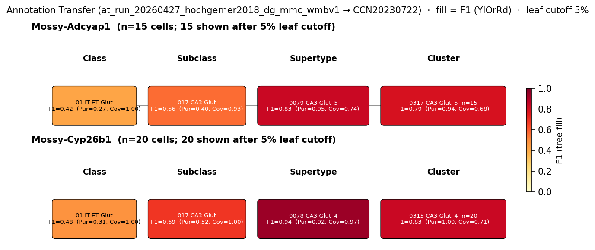

# Hilar mossy cell — WMBv1 (CCN20230722) Mapping Report
*2026-04-27 · Source: `kb/graphs/hippocampus/hippocampus_glutamatergic.yaml`*

---

## Introduction

Hilar mossy cells are large multipolar glutamatergic principal neurons of the dentate gyrus, with somata confined to the dentate hilus (polymorphic layer) and commissural/associational axons that terminate in the inner molecular layer onto granule cell dendrites [3][4][5]. They provide the principal feedback excitation to granule cells and, together with granule cells, constitute one of the two glutamatergic principal cell populations of the dentate gyrus [3][5]. Resolving their transcriptomic identity in WMBv1 matters because the classical anatomical definition (hilar soma + inner-molecular-layer axon) does not by itself imply a single transcriptomic cluster — Hochgerner et al. 2018 already reported three molecular mossy-cell subtypes in mouse DG, and how these collapse onto WMBv1 supertypes/clusters is what the mapping below establishes.

### Classical type table

| Property | Value | References |
|---|---|---|
| Soma location | dentate gyrus polymorphic layer [UBERON:0002928] | [1][2][3] |
| NT | glutamatergic | [4][3][5] |
| Defining markers | Gria4, Dkk3 | — |
| Negative markers | (none asserted) | — |
| Neuropeptides | (none asserted) | — |
| CL term | dentate gyrus neuron [CL:4023062] (BROAD) | — |

<details>
<summary>Details — source evidence for classical type properties</summary>

- **Soma location:** classical anatomy and review · [1][2][3]
  > A cell body in the hilus, defined as zone 4 of Amaral (1978). Glutamate as the primary transmitter (other markers are less valuable, as discussed below). An axon that innervates the inner molecular layer.
  > — Scharfman & Myers 2013, WHAT IS A MOSSY CELL? A PRACTICAL DEFINITION · [3] <!-- quote_key: 11290620_d7c0cc69 -->

  > Glutamatergic hilar mossy cells (MCs) have axons that terminate both near and far from their cell body but stay within the DG, making synapses primarily in the molecular layer
  > — Botterill et al. 2021, abstract · [1] <!-- quote_key: 231953329_3a0a57e1 -->

  > The hippocampus has been studied for many decades for its largely known roles in encoding spatial memory, and a growing body of evidence indicates a differential involvement of dorsal and ventral hippocampal divisions in novelty detection
  > — Fredes & Shigemoto 2021, abstract · [2] <!-- quote_key: 235678538_22af50d5 -->

- **NT type:** classical anatomy / review · [3][4][5]
  > Hilar mossy cells are the prominent glutamatergic cell type in the dentate hilus of the dentate gyrus (DG)
  > — Sun et al. 2017, Mossy Cells: Specialized Glutamatergic Neurons · [4] <!-- quote_key: 3583187_ea3794f5 -->

  > there are two glutamatergic principal cells instead of one: granule cells, which are the vast majority of the cells in the DG, and the so-called "mossy cells."
  > — Scharfman & Myers 2013, abstract · [3] <!-- quote_key: 11290620_27f933af -->

  > mossy cells (MCs), a major DG cell type that is glutamatergic and innervates the primary output cells of the DG, the granule cells (GCs)
  > — Scharfman & Bernstein 2015, abstract · [5] <!-- quote_key: 13657743_1eea4393 -->

</details>

### Cell Ontology mapping

Cell Ontology mapping: dentate gyrus neuron [[CL:4023062](https://www.ebi.ac.uk/ols4/ontologies/cl/classes?obo_id=CL:4023062)] (BROAD).

**Proposed CL term:** *hilar mossy cell* (SUBMITTED). A dentate gyrus neuron with soma in the polymorphic layer (UBERON:0002928) (Scharfman & Myers, 2012), capable of glutamate secretion as a neurotransmitter (Scharfman & Bernstein, 2015). Distinguished by a large multipolar soma, thorny excrescences on proximal dendrites, and commissural/associational axon projections terminating in the inner molecular layer of the dentate gyrus (Scharfman & Myers, 2012). Electrophysiologically characterised by a depolarised resting membrane potential, prominent hyperpolarisation-activated cation current (Ih), and firing accommodation (Scharfman & Myers, 2012). In rodents, serves as a major excitatory neuron of the dentate hilus providing feedback excitation to granule cells (Sun et al., 2017).

---

## Results

Annotation transfer of two of the three Hochgerner 2018 molecular mossy-cell labels (Mossy-Cyp26b1, Mossy-Adcyap1) onto WMBv1, supported by Gria4/Dkk3 expression and atlas MERFISH location, partitions the classical hilar mossy cell across two CA3-Glut supertypes — 0078 CA3 Glut_4 [CS20230722_SUPT_0078] (Mossy-Cyp26b1, F1=0.94) and 0079 CA3 Glut_5 [CS20230722_SUPT_0079] (Mossy-Adcyap1, F1=0.83) — with 0317 CA3 Glut_5 [CS20230722_CLUS_0317] standing out as the only candidate cluster whose MERFISH soma distribution is essentially confined to the dentate polymorph layer (see figure and property comparison tables). SUPT_0078's MERFISH cells lie in CA3 strata rather than the hilus, marking that mapping as a transcriptomic match with unresolved anatomy that needs spot validation.



*F1 across taxonomy levels for the two Hochgerner 2018 mossy-cell source groups (Mossy-Cyp26b1, n=34; Mossy-Adcyap1, n=28). Each panel row is a source-cell group; nodes are coloured by F1 with **Purity** (Pur) and **Coverage** (Cov) shown inline. Coverage = fraction of source-group cells landing on this target; Purity = fraction of this target's cells coming from the source group. F1 ≥ 0.5 at a level indicates a clean mapping at that resolution. The two source groups separate cleanly at supertype level — Mossy-Cyp26b1 to SUPT_0078 and Mossy-Adcyap1 to SUPT_0079 — with distinct best-child clusters (CLUS_0315 vs CLUS_0317).*

### 0078 CA3 Glut_4 [CS20230722_SUPT_0078] · 🟡 MODERATE

**Property alignment (Table 1):**

| Property | Classical | Supertype | Best cluster | Alignment |
|---|---|---|---|---|
| Soma location | dentate gyrus polymorphic layer [UBERON:0002928] | Field CA3 strata (MERFISH dominant) | 0315 CA3 Glut_4 [CS20230722_CLUS_0315]: Field CA3, pyramidal layer dominant | APPROXIMATE |
| NT type | glutamatergic | not asserted | Glut (CLUS_0315) | NOT_ASSESSED at supertype; CONSISTENT at cluster |
| Gria4 expression | defining marker | 5.37; cohort_pct 0.267; child-coverage 1.000 | 5.12; cohort_pct 0.407 (CLUS_0315) | APPROXIMATE |
| Dkk3 expression | defining marker | 8.71; cohort_pct 0.933; child-coverage 1.000 | 8.94; cohort_pct 0.963 (CLUS_0315) | CONSISTENT |

*(2 of 4 properties CONSISTENT at supertype level — Dkk3 strongly so; location and Gria4 are APPROXIMATE. Best AT-supported child: 0315 CA3 Glut_4 [CS20230722_CLUS_0315] with F1=0.83 at cluster level. MERFISH soma positions of CLUS_0315 sit in CA3 pyramidal layer rather than the hilus — see Concerns.)*

**Evidence support (Table 2):**

| Evidence | Type | Supports | Headline | Source |
|---|---|---|---|---|
| Hochgerner 2018 (Mossy-Cyp26b1) AT | Annotation transfer | SUPPORT | F1=0.94 (supertype); F1=0.83 (CLUS_0315) | — |
| Atlas MERFISH region rollup | Atlas metadata | PARTIAL | region_fraction_100um: 0.195; strict 0.040 | atlas-internal |
| Atlas precomputed expression (Gria4, Dkk3) | Atlas metadata | PARTIAL | Dkk3=8.71 (cohort_pct 0.933) | atlas-internal |

**Supporting evidence:**
- Hochgerner 2018 Mossy-Cyp26b1 cells (n=34) transfer to this supertype with F1=0.94 (coverage 0.971, purity 0.917), and 33 of 34 cells land here; this is a near-complete subset relation between the Mossy-Cyp26b1 label and SUPT_0078.
- Dkk3, one of the two classical defining markers, sits at cohort percentile 0.933 on this supertype with child-cluster coverage 1.000 — the strongest single marker signal among all candidates.
- The best child cluster within the supertype is 0315 CA3 Glut_4 [CS20230722_CLUS_0315] (F1=0.83 at cluster level, Purity=1.00, Coverage=0.71 from the metrics sidecar).

**Concerns:**
- Location APPROXIMATE — `region_fraction_100um: 0.195` (boundary scatter — could reflect registration error; weak counter-evidence). Stronger interpretation: MERFISH cells of SUPT_0078 (and CLUS_0315) are concentrated in Field CA3, pyramidal layer [MBA:495] rather than in the dentate polymorph layer. This is recorded as a `DISCORDANT_ANATOMY` caveat on the edge: the transcriptomic AT signal is strong but the soma positions do not match the hilus-restricted classical definition. Mossy cells residing at the CA3c/hilus border may register as CA3 cells in MERFISH; alternatively SUPT_0078 may comprise CA3 pyramidal cells sharing a Cyp26b1 transcriptomic signature.
- Gria4 expression on the supertype is mid-cohort (cohort_pct 0.267), weaker than the cluster-level value for CLUS_0317 within the sibling supertype.

**What would upgrade confidence:**
- High-resolution smFISH or MERFISH spot validation of SUPT_0078 defining markers (Homer3, Cldn22) in dentate hilus to test whether SUPT_0078 cells span the CA3c/hilus boundary, resolving the location DISCORDANT_ANATOMY caveat.
- An independent Hochgerner-style mouse DG scRNA-seq replication run through annotation transfer to confirm the Mossy-Cyp26b1 → SUPT_0078 assignment.

### 0079 CA3 Glut_5 [CS20230722_SUPT_0079] · 🟢 HIGH

**Property alignment (Table 1):**

| Property | Classical | Supertype | Best cluster | Alignment |
|---|---|---|---|---|
| Soma location | dentate gyrus polymorphic layer [UBERON:0002928] | Dentate gyrus, polymorph layer [MBA:10704] dominant (count_100um=1524) | 0317 CA3 Glut_5 [CS20230722_CLUS_0317]: Dentate gyrus, polymorph layer [MBA:10704] dominant (count_100um=1222) | CONSISTENT |
| NT type | glutamatergic | not asserted | Glut (CLUS_0317) | NOT_ASSESSED at supertype; CONSISTENT at cluster |
| Gria4 expression | defining marker | 8.05; cohort_pct 0.667; child-coverage 1.000 | 8.03; cohort_pct 0.778 (CLUS_0317) | CONSISTENT |
| Dkk3 expression | defining marker | 5.32; cohort_pct 0.733; child-coverage 1.000 | 7.34; cohort_pct 0.852 (CLUS_0317) | CONSISTENT |

*(3 of 4 properties CONSISTENT at supertype level (NT_TYPE NOT_ASSESSED on atlas side). Both Gria4 and Dkk3 are present at cohort_pct ≥ 0.667 with child-cluster coverage 1.000. Best AT-supported child: 0317 CA3 Glut_5 [CS20230722_CLUS_0317]; MERFISH soma distribution sits cleanly in the dentate polymorph layer.)*

**Evidence support (Table 2):**

| Evidence | Type | Supports | Headline | Source |
|---|---|---|---|---|
| Hochgerner 2018 (Mossy-Adcyap1) AT | Annotation transfer | SUPPORT | F1=0.83 (supertype); F1=0.79 (CLUS_0317) | — |
| Atlas MERFISH region rollup | Atlas metadata | PARTIAL | region_fraction_100um: 0.936; strict 0.668 | atlas-internal |
| Atlas precomputed expression (Gria4, Dkk3) | Atlas metadata | PARTIAL | Gria4=8.05; Dkk3=5.32 | atlas-internal |

**Supporting evidence:**
- Hochgerner 2018 Mossy-Adcyap1 cells (n=28) transfer to this supertype with F1=0.83 (purity 0.952, coverage 0.741); the very high purity says most SUPT_0079 cells captured by AT are Mossy-Adcyap1 — i.e. SUPT_0079 is largely the Adcyap1+ mossy subtype rather than a broader CA3 population that happens to receive scatter.
- The supertype's MERFISH cells are concentrated in Dentate gyrus, polymorph layer [MBA:10704] (count_100um=1524 of 1619 in hippocampal formation, region_fraction_100um=0.936) — this is the classical hilus and matches the soma location given by the classical literature [1][3][4].
- Both defining markers (Gria4 cohort_pct 0.667; Dkk3 cohort_pct 0.733) are CONSISTENT at supertype level with child-cluster coverage 1.000.

**Concerns:**
- The atlas team's NT-type field is not asserted on the supertype (atlas-side NT_TYPE NOT_ASSESSED) — the cluster-level NT annotation is "Glut", consistent with the classical type but technically not a supertype-level match.
- A non-trivial fraction of SUPT_0079 MERFISH cells sit in CA3 strata rather than the hilus (strict region_fraction 0.668), so the supertype is broader than the strictly hilar-restricted classical mossy cell — captured as the existing `AMBIGUOUS_MAPPING` caveat noting that SUPT_0078 + SUPT_0079 together represent the molecular subdivision of the classical hilar mossy cell.

**What would upgrade confidence:**
- ISH co-labelling of Cyp26b1 and Adcyap1 in dentate hilus to confirm non-overlapping expression and validate the two-supertype mossy-cell split.
- A second annotation transfer run from an independent mouse DG dataset (or from a Hochgerner 2018 replication) to confirm species- and lab-generality of the Mossy-Adcyap1 → SUPT_0079 assignment.

### 0317 CA3 Glut_5 [CS20230722_CLUS_0317] · 🟢 HIGH

**Property alignment (Table 1):**

| Property | Classical | Supertype (0079) | Best cluster (CLUS_0317) | Alignment |
|---|---|---|---|---|
| Soma location | dentate gyrus polymorphic layer [UBERON:0002928] | Dentate gyrus, polymorph layer [MBA:10704] dominant | Dentate gyrus, polymorph layer [MBA:10704] count_100um=1222 (region_fraction_100um=0.991, strict=0.835) | CONSISTENT |
| NT type | glutamatergic | not asserted | Glut | CONSISTENT |
| Gria4 expression | defining marker | 8.05; cohort_pct 0.667 | 8.03; cohort_pct 0.778 | CONSISTENT |
| Dkk3 expression | defining marker | 5.32; cohort_pct 0.733 | 7.34; cohort_pct 0.852 | CONSISTENT |

*(All four property comparisons CONSISTENT at cluster level. This is the AT-best child cluster within the SUPT_0079 supertype; the Adcyap1 mossy-cell label transfers to CLUS_0317 with F1=0.79 at cluster level (Purity=0.94, Coverage=0.68 from the metrics sidecar). MERFISH soma positions are concentrated in the dentate polymorph layer (strict region_fraction 0.835), the strictest hilar-restricted distribution of any candidate.)*

**Evidence support (Table 2):**

| Evidence | Type | Supports | Headline | Source |
|---|---|---|---|---|
| Hochgerner 2018 (Mossy-Adcyap1) AT — cluster level | Annotation transfer | SUPPORT | F1=0.79 (Purity=0.94, Coverage=0.68) | — |
| Atlas MERFISH region rollup | Atlas metadata | PARTIAL | region_fraction_100um=0.991; strict=0.835 | atlas-internal |
| Atlas precomputed expression (Gria4, Dkk3) | Atlas metadata | PARTIAL | Gria4=8.03; Dkk3=7.34 | atlas-internal |

**Supporting evidence:**
- This is the only candidate whose MERFISH soma distribution is essentially confined to the dentate polymorph layer (strict region_fraction 0.835; region_fraction_100um 0.991) — i.e. the cells are physically located in the classical hilus, consistent with the practical definition of mossy cells from Scharfman & Myers and Sun et al. [3][4].
- AT places the Adcyap1+ mossy-cell label on this cluster with F1=0.79 at cluster resolution; both defining markers (Gria4, Dkk3) are CONSISTENT with the classical expectation.
- CLUS_0317 is the best cluster-level child within the SUPT_0079 supertype that survives at HIGH confidence; treating it as the cluster-level encoding of the SUPT_0079 mapping makes the same biological call at a finer resolution.

**Concerns:**
- AT n=15 cells from Hochgerner 2018 at cluster level is on the low end for a HIGH call — robustness would benefit from independent replication (low cell count is captured as the proposed Hochgerner replication experiment on the SUPT_0079 edge).
- This cluster covers only 68% (coverage 0.68) of the Mossy-Adcyap1 source label at cluster resolution; the remaining 32% scatters to other clusters within the same supertype. This is why the supertype-level call is the primary mapping and the cluster-level call is a finer-grained sibling.

**What would upgrade confidence:**
- An independent mouse DG scRNA-seq AT run targeting the Adcyap1+ mossy-cell subtype to confirm CLUS_0317 as the cluster-level home, with F1 ≥ 0.80 at CLUSTER level.

<details>
<summary>### Candidates audited (full top-K)</summary>

| WMBv1 cluster / supertype | Supertype | Cells (10x) | Confidence | Key evidence | Verdict |
|---|---|---:|---|---|---|
| 0079 CA3 Glut_5 [CS20230722_SUPT_0079] | — | 318 | 🟢 HIGH | Mossy-Adcyap1 AT F1=0.83 to supertype; soma in hilus | Primary |
| 0317 CA3 Glut_5 [CS20230722_CLUS_0317] | 0079 CA3 Glut_5 | 116 | 🟢 HIGH | AT F1=0.79; soma strictly hilar | Primary (cluster-level) |
| 0078 CA3 Glut_4 [CS20230722_SUPT_0078] | — | 2147 | 🟡 MODERATE | Mossy-Cyp26b1 AT F1=0.94 but MERFISH in CA3 strata | Secondary |
| 0315 CA3 Glut_4 [CS20230722_CLUS_0315] | 0078 CA3 Glut_4 | 1219 | 🔴 LOW | AT F1=0.83 but MERFISH in CA3 pyramidal layer | Eliminated (soma in CA3 pyramidal layer) |
| 0316 CA3 Glut_5 [CS20230722_CLUS_0316] | 0079 CA3 Glut_5 | 202 | 🔴 LOW | Markers CONSISTENT but MERFISH in CA3 stratum radiatum | Eliminated (soma in CA3 radiatum) |
| 0507 DG Glut_2 [CS20230722_CLUS_0507] | 0137 DG Glut_2 | 42250 | 🔴 LOW | MERFISH in granule cell layer; Dkk3 cohort_pct 0.259 | Eliminated (granule cell, not mossy) |
| 0508 DG Glut_3 [CS20230722_CLUS_0508] | 0138 DG Glut_3 | 165 | 🔴 LOW | MERFISH in granule cell layer; Dkk3 cohort_pct 0.222 | Eliminated (granule cell, not mossy) |
| 0137 DG Glut_2 [CS20230722_SUPT_0137] | — | 74950 | 🔴 LOW | DG granule cell supertype; Dkk3 cohort_pct 0.067 | Eliminated (DG granule supertype) |
| 0138 DG Glut_3 [CS20230722_SUPT_0138] | — | 964 | 🔴 LOW | DG granule cell supertype; Gria4 cohort_pct 0.133 | Eliminated (DG granule supertype) |
| 0139 DG Glut_4 [CS20230722_SUPT_0139] | — | 5166 | 🔴 LOW | DG granule cell supertype; both markers APPROXIMATE | Eliminated (DG granule supertype) |
| 0141 DG-PIR Ex IMN_2 [CS20230722_SUPT_0141] | — | 1200 | 🔴 LOW | Immature neuron supertype; markers APPROXIMATE | Eliminated (immature DG/PIR neurons) |

</details>

### Methods

<details>
<summary>Data sources, analyses, and reproducibility receipts</summary>

**Classical type definition.** Hilar mossy cells are defined as glutamatergic principal neurons of the dentate gyrus with soma in the polymorphic layer [UBERON:0002928] [1][2][3] and inner-molecular-layer axon termination [3][4][5]. Defining markers Gria4 and Dkk3 are taxonomy-side defining markers without primary literature citations on the classical node (see Discussion). `definition_basis` is `CLASSICAL_MULTIMODAL`.

**Atlas mapping query.**
Candidate atlas clusters were retrieved from the WMBv1 (CCN20230722) taxonomy at ranks 0 (cluster) and 1 (supertype) using metadata-based scoring (region match, NT type, defining markers, sex bias when applicable). Full scoring rules: `workflows/map-cell-type.md`.

**Property alignment.**
Each defining property of the classical type was compared to the corresponding atlas-side value via the `property_comparisons` schema, with alignments graded CONSISTENT / APPROXIMATE / DISCORDANT / NOT_ASSESSED. Atlas-side numerical values came from precomputed expression on the cluster (cluster.yaml in the taxonomy reference store) and from MERFISH spatial registration for soma location.

**Annotation transfer.**

| Field | Value |
|---|---|
| Source dataset | GEO:GSE95315 (Hochgerner 2018 mouse DG scRNA-seq cell type labels: Granule-mature, Granule-immature, Mossy-Cyp26b1, Mossy-Adcyap1, Mossy-Klk8, Neuroblast 1, Neuroblast 2, Cajal-Retzius, GABA-Cnr1, GABA-Lhx6, Astrocytes.) |
| Source species | NCBITaxon:10090 |
| Target atlas | WMBv1 (CCN20230722; SHA-256: b21ca985) |
| Method | MapMyCells local (cell_type_mapper v1.7.1, default parameters, raw normalization, 100 bootstrap iterations). 2 genes unmapped. Per-cell labels aggregated by source_cluster_label and target taxonomy level for F1 scoring. |
| Tool version | cell_type_mapper v1.7.1 |
| Bootstrap threshold | 0.0 |
| n cells | 2934 (filtered to 2934) |
| Run record | [`kb/annotation_transfer_runs/at_run_20260427_hochgerner2018_dg_mmc_wmbv1/manifest.yaml`](../../kb/annotation_transfer_runs/at_run_20260427_hochgerner2018_dg_mmc_wmbv1/manifest.yaml) |
| Script (external) | README.md |
| Code reference | [https://github.com/AllenInstitute/cell_type_mapper](https://github.com/AllenInstitute/cell_type_mapper) |
| F1 matrix | [`f1_scores_best.csv`](../../kb/annotation_transfer_runs/at_run_20260427_hochgerner2018_dg_mmc_wmbv1/f1_scores_best.csv) |

**Anti-hallucination.**
All citations, atlas accessions, ontology CURIEs, and verbatim literature quotes in this report are validated against the evidencell knowledge base at write time. Authored-prose evidence narratives are validated against their source `evidence_items[*].explanation` fields. The pre-write hook rejects any unresolvable identifier or unattributed blockquote. Specific mapping limitations and caveats are documented per-candidate in the Discussion section.

*Generated by evidencell `25c2b32` at 2026-06-08T18:37:51+00:00 from [kb/graphs/hippocampus/hippocampus_glutamatergic.yaml](kb/graphs/hippocampus/hippocampus_glutamatergic.yaml).*

**Evidence base table**

| Edge ID | Evidence types | Supports | Source |
|---|---|---|---|
| edge_hilar_mossy_cell_hippocampus_to_supt_0078 | ANNOTATION_TRANSFER | SUPPORT | — |
| edge_hilar_mossy_cell_hippocampus_to_supt_0079 | ANNOTATION_TRANSFER | SUPPORT | — |
| edge_hilar_mossy_cell_hippocampus_to_CS20230722_CLUS_0315 | ATLAS_METADATA | PARTIAL | atlas-internal |
| edge_hilar_mossy_cell_hippocampus_to_CS20230722_CLUS_0316 | ATLAS_METADATA | PARTIAL | atlas-internal |
| edge_hilar_mossy_cell_hippocampus_to_CS20230722_CLUS_0317 | ATLAS_METADATA | PARTIAL | atlas-internal |
| edge_hilar_mossy_cell_hippocampus_to_CS20230722_CLUS_0507 | ATLAS_METADATA | PARTIAL | atlas-internal |
| edge_hilar_mossy_cell_hippocampus_to_CS20230722_CLUS_0508 | ATLAS_METADATA | PARTIAL | atlas-internal |
| edge_hilar_mossy_cell_hippocampus_to_CS20230722_SUPT_0079 | ATLAS_METADATA | PARTIAL | atlas-internal |
| edge_hilar_mossy_cell_hippocampus_to_CS20230722_SUPT_0137 | ATLAS_METADATA | PARTIAL | atlas-internal |
| edge_hilar_mossy_cell_hippocampus_to_CS20230722_SUPT_0138 | ATLAS_METADATA | PARTIAL | atlas-internal |
| edge_hilar_mossy_cell_hippocampus_to_CS20230722_SUPT_0139 | ATLAS_METADATA | PARTIAL | atlas-internal |
| edge_hilar_mossy_cell_hippocampus_to_CS20230722_SUPT_0141 | ATLAS_METADATA | PARTIAL | atlas-internal |

</details>

---

## Discussion

**Primary mapping:** Hilar mossy cell → 0079 CA3 Glut_5 [CS20230722_SUPT_0079] at HIGH confidence, with cluster-level resolution to 0317 CA3 Glut_5 [CS20230722_CLUS_0317]. Key support: annotation transfer from the Hochgerner 2018 Mossy-Adcyap1 label (F1=0.83 at supertype, F1=0.79 at cluster) plus MERFISH soma distribution centred in the dentate polymorph layer (region_fraction_100um=0.936 supertype; 0.991 cluster) and CONSISTENT Gria4/Dkk3 expression. The secondary mapping to 0078 CA3 Glut_4 [CS20230722_SUPT_0078] (MODERATE) accounts for the Mossy-Cyp26b1 subtype but carries an unresolved DISCORDANT_ANATOMY caveat: its MERFISH cells sit in CA3 strata, not the hilus. The Cell Ontology has no specific term for hilar mossy cells; CL:4023062 (dentate gyrus neuron) is the closest ancestor, and the classical type covers a subset of that broader CL term. Hilar mossy cells are glutamatergic neurons with soma restricted to the dentate gyrus polymorphic layer; CL:4023062 covers all dentate gyrus neurons and is therefore a BROAD match. No mossy cell-specific CL term currently exists.

### Proposed experiments and follow-ups

Existing evidence already includes the Hochgerner 2018 annotation transfer run (`at_run_20260427_hochgerner2018_dg_mmc_wmbv1`); proposed experiments below either validate anatomy that AT alone cannot adjudicate or expand AT to a second independent dataset.

- **What:** smFISH or MERFISH spot validation of SUPT_0078 defining markers (Homer3, Cldn22) in dentate hilus.
  **Target:** confirm whether SUPT_0078 cells include hilus-resident mossy cells at the CA3c boundary, or are exclusively CA3 pyramidal cells with a shared Cyp26b1 transcriptomic signature.
  **Expected output:** anatomical evidence resolving the DISCORDANT_ANATOMY caveat on SUPT_0078.
  **Resolves:** open question 1.

- **What:** ISH co-labelling of Cyp26b1 and Adcyap1 in dentate hilus.
  **Target:** confirm non-overlapping expression between the two subtypes and validate the molecular subdivision of the classical hilar mossy cell into SUPT_0078 and SUPT_0079.
  **Expected output:** anatomical evidence supporting the two-supertype split.
  **Resolves:** open question 2.

- **What:** Annotation transfer from an independent mouse DG scRNA-seq dataset (Hochgerner-style replication).
  **Target:** F1 ≥ 0.80 at SUPERTYPE level for both Mossy-Cyp26b1 → SUPT_0078 and Mossy-Adcyap1 → SUPT_0079.
  **Expected output:** AnnotationTransferEvidence on the two supertype edges and on CLUS_0317.
  **Resolves:** SINGLE_DATASET concern on both supertype edges; cluster-level confidence on CLUS_0317.

### Open questions

1. Are SUPT_0078 cells that map to CA3 pyramidal layer actually at the CA3c/hilar boundary? High-resolution FISH of Homer3 or Cldn22 (SUPT_0078 defining markers) in hilus/CA3c would resolve this.
2. What is the functional and anatomical distinction between the SUPT_0078 (Cyp26b1+) and SUPT_0079 (Adcyap1+) mossy cell subtypes? Do they correspond to dorsal vs. ventral mossy cells, or to distinct projection patterns (IML-only vs. IML+MML in dorsal mossy cells)?

---

## References

| # | Citation | PMID | Used for |
|---|---|---|---|
| [1] | Botterill et al. 2021 | [33600026](https://pubmed.ncbi.nlm.nih.gov/33600026) | soma location |
| [2] | Fredes & Shigemoto 2021 | [34214666](https://pubmed.ncbi.nlm.nih.gov/34214666) | soma location |
| [3] | Scharfman & Myers 2013 | [23420672](https://pubmed.ncbi.nlm.nih.gov/23420672) | soma location, NT |
| [4] | Sun et al. 2017 | [28451637](https://pubmed.ncbi.nlm.nih.gov/28451637) | neurotransmitter type |
| [5] | Scharfman & Bernstein 2015 | [26347618](https://pubmed.ncbi.nlm.nih.gov/26347618) | neurotransmitter type |

---

<!-- verdict-block-start: edge_hilar_mossy_cell_hippocampus_to_supt_0079 -->
```yaml
verdict:
  confidence: HIGH
  confidence_score: 0.85
  relationship: skos:closeMatch
  mapping_cardinality: "1:1"
  mapping_justification: semapv:ManualMappingCuration
  rationale: >
    [tier:STRONGEST] Hochgerner 2018 Mossy-Adcyap1 transfers to
    CS20230722_SUPT_0079 with F1=0.83 (purity 0.95, coverage 0.74) in
    at_run_20260427_hochgerner2018_dg_mmc_wmbv1; MERFISH soma rollup
    sits in the dentate polymorph layer (region_fraction_100um: 0.936)
    and both defining markers are CONSISTENT (2 of 2 markers CONSISTENT;
    Gria4=8.05 cohort_pct 0.667, Dkk3=5.32 cohort_pct 0.733).
  reconciliation_note: >
    Paired with cluster-level edge to CS20230722_CLUS_0317 (the AT-best
    child within this supertype); both edges narrate the same Adcyap1+
    mossy-cell mapping at different resolutions. The sibling SUPT_0078
    edge accounts for the Mossy-Cyp26b1 subtype; together SUPT_0078 +
    SUPT_0079 represent the molecular subdivision of the classical
    hilar mossy cell.
  caveats:
    - caveat_type: AMBIGUOUS_MAPPING
      description: >
        Hochgerner 2018 identifies three molecular mossy-cell subtypes
        (Cyp26b1, Adcyap1, Klk8); SUPT_0079 captures the Adcyap1+
        subtype while SUPT_0078 captures the Cyp26b1+ subtype. Mossy-Klk8
        (n=6) maps ambiguously across CA3 supertypes (best F1=0.56) —
        insufficient evidence for a separate edge.
    - caveat_type: SINGLE_DATASET
      description: >
        AT evidence comes from a single source dataset (GEO:GSE95315);
        independent replication of the Mossy-Adcyap1 → SUPT_0079
        assignment is not yet available.
    - caveat_type: NT_PREDICTION_UNCERTAIN
      description: >
        Atlas-side NT_TYPE is not asserted on the supertype; the
        cluster-level Glut annotation is consistent with the
        glutamatergic classical type but supertype-level NT is
        NOT_ASSESSED.
  proposed_experiments:
    - >
      ISH co-labelling of Cyp26b1 and Adcyap1 in dentate hilus to
      confirm non-overlapping expression and validate the two-supertype
      mossy-cell split.
    - >
      Independent mouse DG scRNA-seq annotation transfer (Hochgerner-style
      replication) targeting F1 ≥ 0.80 at SUPERTYPE level for
      CS20230722_SUPT_0079.
  unresolved_questions:
    - >
      What is the functional and anatomical distinction between the
      CS20230722_SUPT_0078 (Cyp26b1+) and CS20230722_SUPT_0079 (Adcyap1+)
      mossy-cell subtypes — dorsal vs. ventral, or distinct projection
      patterns?
```
<!-- verdict-block-end -->

<!-- verdict-block-start: edge_hilar_mossy_cell_hippocampus_to_supt_0078 -->
```yaml
verdict:
  confidence: MODERATE
  confidence_score: 0.6
  relationship: skos:closeMatch
  mapping_cardinality: "1:1"
  mapping_justification: semapv:ManualMappingCuration
  rationale: >
    [tier:NEXT] Hochgerner 2018 Mossy-Cyp26b1 transfers to
    CS20230722_SUPT_0078 with F1=0.94 (purity 0.92, coverage 0.97) in
    at_run_20260427_hochgerner2018_dg_mmc_wmbv1, with Dkk3 strongly
    CONSISTENT (cohort_pct 0.933) and Gria4 APPROXIMATE (1 of 2 markers
    CONSISTENT). Atlas MERFISH soma rollup is dominated by Field CA3
    pyramidal layer rather than the hilus (region_fraction_100um: 0.195;
    boundary scatter — could reflect registration error or a real
    CA3c/hilus-border population). The transcriptomic signal is strong;
    the location signal is the open question.
  reconciliation_note: >
    Paired with sibling CS20230722_SUPT_0079 edge as the molecular
    subdivision of the classical hilar mossy cell into Cyp26b1+ and
    Adcyap1+ subtypes (Hochgerner 2018). Unlike SUPT_0079, MERFISH
    soma positions do not cleanly support the hilar anatomy — this is
    why confidence is MODERATE rather than HIGH.
  caveats:
    - caveat_type: DISCORDANT_ANATOMY
      description: >
        CS20230722_SUPT_0078 MERFISH cells are distributed across CA3
        strata rather than the dentate hilus, while classical hilar
        mossy cells have soma restricted to the dentate polymorph layer.
        The transcriptomic AT signal is strong (F1=0.94) but the
        anatomy is unresolved — Cyp26b1+ cells may be CA3c/hilus-border
        mossy cells registering as CA3, or SUPT_0078 may include CA3
        pyramidal cells sharing the Cyp26b1 signature.
    - caveat_type: SINGLE_DATASET
      description: >
        AT evidence comes from a single source dataset (GEO:GSE95315);
        independent replication of the Mossy-Cyp26b1 → SUPT_0078
        assignment is not yet available.
    - caveat_type: NT_PREDICTION_UNCERTAIN
      description: >
        Atlas-side NT_TYPE is NOT_ASSESSED at supertype level;
        cluster-level Glut annotation is consistent with the
        glutamatergic classical type.
  proposed_experiments:
    - >
      smFISH or MERFISH spot validation of CS20230722_SUPT_0078 defining
      markers (Homer3, Cldn22) in dentate hilus to test whether soma
      positions span the CA3c/hilus boundary.
    - >
      Independent mouse DG scRNA-seq annotation transfer to confirm
      species- and lab-generality of the Mossy-Cyp26b1 → SUPT_0078
      assignment.
  unresolved_questions:
    - >
      Are CS20230722_SUPT_0078 cells that map to Field CA3 pyramidal
      layer in MERFISH actually at the CA3c/hilar boundary?
      High-resolution FISH of Homer3 or Cldn22 in hilus/CA3c would
      resolve this.
```
<!-- verdict-block-end -->

<!-- verdict-block-start: edge_hilar_mossy_cell_hippocampus_to_CS20230722_CLUS_0317 -->
```yaml
verdict:
  confidence: HIGH
  confidence_score: 0.8
  relationship: skos:closeMatch
  mapping_cardinality: "1:1"
  mapping_justification: semapv:ManualMappingCuration
  rationale: >
    [tier:STRONGEST] CS20230722_CLUS_0317 is the best-supported child
    cluster within CS20230722_SUPT_0079, inheriting supertype-level AT
    support from the canonical edge
    edge_hilar_mossy_cell_hippocampus_to_supt_0079 (Hochgerner 2018
    Mossy-Adcyap1). All 4 of 4 property comparisons CONSISTENT
    (Gria4=8.03 cohort_pct 0.778, Dkk3=7.34 cohort_pct 0.852, NT Glut,
    location strict region_fraction 0.835 in Dentate gyrus, polymorph
    layer [MBA:10704]). This is the only candidate whose MERFISH soma
    distribution is strictly hilar.
  reconciliation_note: >
    Cluster-level resolution of the CS20230722_SUPT_0079 mapping; both
    edges encode the same Adcyap1+ mossy-cell biology at different
    granularities.
  caveats:
    - caveat_type: LOW_CELL_COUNT
      description: >
        Cluster-level AT n=15 cells from the Mossy-Adcyap1 source label;
        independent replication recommended to confirm cluster-level
        assignment.
    - caveat_type: DISTRIBUTED_ACROSS_CLUSTERS
      description: >
        Cluster-level AT support is inherited from the supertype-level
        edge edge_hilar_mossy_cell_hippocampus_to_supt_0079; the
        Mossy-Adcyap1 label is distributed across sibling clusters
        within CS20230722_SUPT_0079. Supertype-level mapping is the
        primary call.
    - caveat_type: SINGLE_DATASET
      description: >
        AT evidence comes from a single source dataset (GEO:GSE95315).
  proposed_experiments:
    - >
      Independent mouse DG transcriptomic annotation transfer targeting the
      Adcyap1+ mossy-cell subtype, with F1 ≥ 0.80 at CLUSTER level on
      CS20230722_CLUS_0317.
  unresolved_questions:
    - >
      Does the 32% of Mossy-Adcyap1 cells scattering to sibling clusters
      within CS20230722_SUPT_0079 reflect a real molecular subdivision
      of the Adcyap1+ mossy cells, or AT noise at small n?
```
<!-- verdict-block-end -->

<!-- verdict-block-start: edge_hilar_mossy_cell_hippocampus_to_CS20230722_CLUS_0315 -->
```yaml
verdict:
  confidence: LOW
  confidence_score: 0.3
  rationale: >
    [tier:CUT] CS20230722_CLUS_0315 is the best-supported child within
    CS20230722_SUPT_0078 (see parent edge for AT provenance) but MERFISH
    soma rollup is dominated by Field CA3, pyramidal layer
    (region_fraction_100um: 0.279, strict 0.065) — not the dentate
    hilus. Inherits the DISCORDANT_ANATOMY concern from the parent
    SUPT_0078 mapping; cuts at cluster level pending hilar/boundary
    anatomy validation.
```
<!-- verdict-block-end -->

<!-- verdict-block-start: edge_hilar_mossy_cell_hippocampus_to_CS20230722_CLUS_0316 -->
```yaml
verdict:
  confidence: LOW
  confidence_score: 0.25
  rationale: >
    [tier:CUT] CS20230722_CLUS_0316 carries CONSISTENT Gria4 (8.08
    cohort_pct 0.815) and Dkk3 (3.30 cohort_pct 0.630) but MERFISH soma
    rollup is concentrated in Field CA3, stratum radiatum
    (region_fraction_100um: 0.604, strict 0.114) — not the dentate
    hilus. No AT support; markers alone are insufficient to override
    location DISCORDANT.
```
<!-- verdict-block-end -->

<!-- verdict-block-start: edge_hilar_mossy_cell_hippocampus_to_CS20230722_CLUS_0507 -->
```yaml
verdict:
  confidence: LOW
  confidence_score: 0.15
  rationale: >
    [tier:CUT] CS20230722_CLUS_0507 (0507 DG Glut_2; n=42250) is a DG
    granule cell cluster — MERFISH soma in Dentate gyrus, granule cell
    layer [MBA:632] (count_100um=32712 of 32942 in DG). Both defining
    markers APPROXIMATE: Gria4=4.79 cohort_pct 0.370, Dkk3=0.83
    cohort_pct 0.259. No AT support for the mossy-cell labels.
    Eliminated as granule cell rather than hilar mossy cell.
```
<!-- verdict-block-end -->

<!-- verdict-block-start: edge_hilar_mossy_cell_hippocampus_to_CS20230722_CLUS_0508 -->
```yaml
verdict:
  confidence: LOW
  confidence_score: 0.15
  rationale: >
    [tier:CUT] CS20230722_CLUS_0508 (0508 DG Glut_3; n=165) is a DG
    granule cell cluster — MERFISH soma in Dentate gyrus, granule cell
    layer [MBA:632] (count_100um=391 of 398 in DG). Both defining
    markers APPROXIMATE: Gria4=3.99 cohort_pct 0.296, Dkk3=0.80
    cohort_pct 0.222. Eliminated as granule cell.
```
<!-- verdict-block-end -->

<!-- verdict-block-start: edge_hilar_mossy_cell_hippocampus_to_CS20230722_SUPT_0079 -->
```yaml
verdict:
  confidence: LOW
  confidence_score: 0.2
  rationale: >
    [tier:CUT] Duplicate edge to CS20230722_SUPT_0079 carrying only
    atlas-metadata evidence (region_fraction_100um: 0.936, strict
    0.668); the primary AT-supported edge to the same supertype
    (edge_hilar_mossy_cell_hippocampus_to_supt_0079) carries the
    canonical mapping. Recommend curator removal of this duplicate.
  unresolved_questions:
    - >
      Curator removal of duplicate edge
      edge_hilar_mossy_cell_hippocampus_to_CS20230722_SUPT_0079 —
      legacy/fresh-emit ID collision on taxonomy_type
      CS20230722_SUPT_0079; canonical AT-supported edge is
      edge_hilar_mossy_cell_hippocampus_to_supt_0079.
```
<!-- verdict-block-end -->

<!-- verdict-block-start: edge_hilar_mossy_cell_hippocampus_to_CS20230722_SUPT_0137 -->
```yaml
verdict:
  confidence: LOW
  confidence_score: 0.1
  rationale: >
    [tier:CUT] CS20230722_SUPT_0137 (0137 DG Glut_2; n=74950) is the DG
    granule cell supertype. MERFISH soma in Dentate gyrus, granule cell
    layer [MBA:632] (count_100um=47167); both defining markers
    bottom-cohort (Gria4=3.26 cohort_pct 0.067; Dkk3=0.51 cohort_pct
    0.067, child-coverage 0.667). Eliminated as DG granule supertype.
```
<!-- verdict-block-end -->

<!-- verdict-block-start: edge_hilar_mossy_cell_hippocampus_to_CS20230722_SUPT_0138 -->
```yaml
verdict:
  confidence: LOW
  confidence_score: 0.1
  rationale: >
    [tier:CUT] CS20230722_SUPT_0138 (0138 DG Glut_3; n=964) is a DG
    granule-layer supertype. MERFISH soma in Dentate gyrus, granule
    cell layer [MBA:632] (count_100um=1012); both defining markers
    APPROXIMATE (Gria4=3.42 cohort_pct 0.133; Dkk3=0.75 cohort_pct
    0.200). Eliminated as DG granule supertype.
```
<!-- verdict-block-end -->

<!-- verdict-block-start: edge_hilar_mossy_cell_hippocampus_to_CS20230722_SUPT_0139 -->
```yaml
verdict:
  confidence: LOW
  confidence_score: 0.1
  rationale: >
    [tier:CUT] CS20230722_SUPT_0139 (0139 DG Glut_4; n=5166) is a DG
    granule-layer supertype. MERFISH soma in Dentate gyrus, granule
    cell layer [MBA:632] (count_100um=6998); both defining markers
    APPROXIMATE (Gria4=6.02 cohort_pct 0.333; Dkk3=1.00 cohort_pct
    0.267). Eliminated as DG granule supertype.
```
<!-- verdict-block-end -->

<!-- verdict-block-start: edge_hilar_mossy_cell_hippocampus_to_CS20230722_SUPT_0141 -->
```yaml
verdict:
  confidence: LOW
  confidence_score: 0.1
  rationale: >
    [tier:CUT] CS20230722_SUPT_0141 (0141 DG-PIR Ex IMN_2; n=1200) is
    an immature neuron supertype of DG/piriform. MERFISH soma in
    Dentate gyrus, granule cell layer [MBA:632] (count_100um=2070);
    both defining markers APPROXIMATE (Gria4=4.57 cohort_pct 0.200;
    Dkk3=1.97 cohort_pct 0.400). Eliminated — DG-PIR immature neuron
    population, not hilar mossy.
```
<!-- verdict-block-end -->
