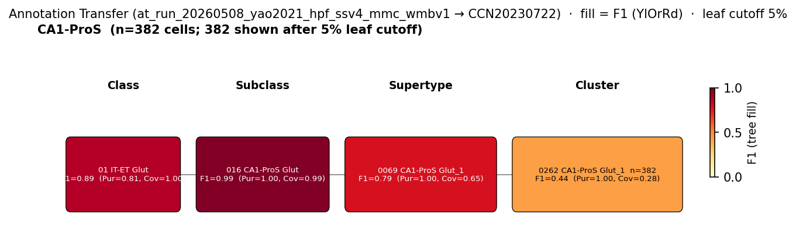

# ventral hippocampal dopamine receptor-expressing glutamatergic pyramidal neuron — WMBv1 (CCN20230722) Mapping Report
*2026-04-27 · Source: `/Users/do12/Documents/GitHub/BICAN_agentic_framework_planning/evidencell/kb/graphs/hippocampus/hippocampus_glutamatergic.yaml`*

---

## Introduction

Ventral hippocampal dopamine receptor-expressing glutamatergic pyramidal neurons are a topographically organised population of vCA1 and ventral subiculum (vSub) projection neurons expressing the D1 or D2 dopamine receptors (Drd1, Drd2). Unlike dorsal hippocampus — where D1/D2 expression is restricted to interneurons — the ventral subfields contain a substantial pyramidal-cell population expressing dopamine receptors, representing approximately 45% of all dopamine receptor-positive cells in ventral hippocampus (Godino et al., 2023) [1].

### Classical type table

| Property | Value | References |
|---|---|---|
| Soma location | hippocampal formation [UBERON:0002421] (ventral CA1 / ventral subiculum) | [1] |
| NT | glutamatergic | [1] |
| Defining markers | Drd1 (D1 dopamine receptor); Drd2 (D2 dopamine receptor) | [1], [2] |

<details>
<summary>Details — source evidence for classical type properties</summary>

- **Soma location:** Godino et al. 2023 · ventral hippocampus topography · [1]
  > these neurons are transcriptionally distinct and topographically organized across vHipp subfields and cell types. In the ventral subicu
  > — Godino et al. 2023, abstract · [1] <!-- quote_key: 260336826_67252bb8 -->

  > In the vCA1 pyramidal cell layer, gradual enrichment of both D1 and D2 cells emerges ventral to the rhinal fissure, along with the diffuse 21 transition from vCA1 to vSub. Together, these semiquantitative observations indicate a precise topographical organization of D1 and D2 cells across vHipp subfields and layers, most notably in the DG and in the caudal-most parts of vCA1/vSub.
  > — Godino et al. 2023, D1-and D2-expressing cells are topographically organized in vHipp · [1] <!-- quote_key: 260336826_acc436ad -->

- **NT type / Drd1, Drd2 markers:** Godino et al. 2023 · molecular characterisation in vHipp · [1]
  > We here study dopaminoceptive neurons in mouse ventral hippocampus (vHipp), molecularly distinguished by their expression of dopamine D1 or D2 receptors
  > — Godino et al. 2023, abstract · [1] <!-- quote_key: 260336826_f0ffda84 -->

- **Drd1 marker (additional support):** Puighermanal et al. 2016 · BAC transgenic D1R-EGFP characterisation in dorsal hippocampus CA1 · [2]
  > Using BAC transgenic mice expressing enhanced green fluorescent protein under the control of D1R promoter, we examined the molecular identity of D1R-containing neurons within the CA1 subfield of the dorsal hippocampus
  > — Puighermanal et al. 2016, abstract · [2] <!-- quote_key: 1711204_2c89b7e1 -->

</details>

Cell Ontology mapping: pyramidal neuron [[CL:0000598](https://www.ebi.ac.uk/ols4/ontologies/cl/classes?obo_id=CL:0000598)] (BROAD).

---

## Results

Annotation transfer from the Yao 2021 hippocampal formation SMART-Seq v4 dataset places CA1-ProS source cells onto supertype 0069 CA1-ProS Glut_1 [CS20230722_SUPT_0069] (F1=0.74 at supertype level) but with both defining dopamine receptors at near-absent atlas mean expression on that supertype, leaving the mapping provisional pending a ventral-CA1-targeted, D1R/D2R-labelled dataset (see figure and property comparison tables). Cohort-derived candidates with strong Drd1/Drd2 expression sit in non-pyramidal-CA1 territories (cortical subplate / endopiriform, entorhinal cortex, dentate gyrus) and are eliminated on regional grounds (see candidates audited table).



*F1 across taxonomy levels for the Yao 2021 CA1-ProS source group (n=1574 cells reaching the CA1-ProS subclass). Coverage = fraction of source-group cells landing on the target; Purity = fraction of this target's cells coming from the source group. F1 ≥ 0.5 at a level indicates a clean mapping at that resolution. CA1-ProS source cells consolidate cleanly onto the CA1-ProS subclass (Pur=1.00, Cov=0.99) and onto supertype 0069 CA1-ProS Glut_1 (Pur=1.00, Cov=0.65, F1=0.79); at cluster level the signal disperses across CA1-ProS children, with 0262 CA1-ProS Glut_1 [CS20230722_CLUS_0262] as the top child (Pur=1.00, Cov=0.28). The source group represents CA1-ProS pyramidal cells broadly; it does NOT separately label the Drd1/Drd2-expressing subset, so the AT result does not by itself identify which supertype enriches for dopamine receptor expression in ventral hippocampus.*

### 0069 CA1-ProS Glut_1 [CS20230722_SUPT_0069] · 🔴 LOW

**Property comparison**

| Property | Classical | Supertype | Best cluster | Alignment |
|---|---|---|---|---|
| Soma location | hippocampal formation [UBERON:0002421] (ventral CA1 / vSub) | CA1-ProS Glut subclass (dorsal + ventral CA1) | not assessed | APPROXIMATE |
| NT type | glutamatergic | glutamatergic (CA1-ProS Glut subclass) | not assessed | CONSISTENT |
| Drd1 expression | defining marker | mean_expression=0.09 (effectively absent) | not assessed | DISCORDANT |
| Drd2 expression | defining marker | mean_expression=0.02 (effectively absent) | not assessed | DISCORDANT |

*(Child-cluster breakdown not assessed — see proposed experiments.)*

**Evidence support**

| Evidence | Type | Supports | Headline | Source |
|---|---|---|---|---|
| Yao 2021 CA1-ProS MapMyCells AT | Annotation transfer | PARTIAL | F1=0.74 at supertype | — |

**Supporting evidence**

- Annotation transfer of Yao 2021 CA1-ProS subclass cells (n=1704) onto WMBv1 via MapMyCells (local cell_type_mapper, default parameters) lands 59.3% on supertype 0069 CA1-ProS Glut_1 [CS20230722_SUPT_0069] (purity 0.999, F1=0.74 at supertype level; `run_ref: at_run_20260508_yao2021_hpf_ssv4_mmc_wmbv1`). This is the highest-confidence supertype assignment for CA1 pyramidal cells in WMBv1 and the only supertype with direct AT evidence connecting to ventral CA1 origin.
- NT type is concordant: the CA1-ProS Glut subclass (CS20230722_SUBC_016) is glutamatergic, matching the classical type's NT designation [1].

**Marker evidence provenance**

- **Drd1**: classical-side evidence is transcript-level (Godino et al. 2023 hybridisation chain reaction in vHipp [1]; Puighermanal et al. 2016 D1R-EGFP BAC transgenic with anatomical/molecular characterisation in dorsal hippocampus CA1 [2]). Both studies established Drd1 as a sparse-but-present hippocampal pyramidal marker.
- **Drd2**: classical-side evidence from Godino et al. 2023 [1] in vHipp (transcript-level co-detection with Drd1). Atlas-side precomputed mean = 0.02 on SUPT_0069 — effectively absent at the supertype level. ⚠ **Atlas annotation/expression discrepancy**: Drd1 and Drd2 are both classical defining markers in the ventral hippocampus literature but neither is listed in the WMBv1 SUPT_0069 defining marker panel; precomputed mean expression at the supertype level is near zero. This is consistent with the classical type being a *sparse subpopulation* (D1R/D2R cells are ~45% of dopamine receptor-positive cells but a much smaller fraction of all CA1-ProS pyramidal cells [1]); the supertype-level mean dilutes their signal. Per-cluster `add-expression` on the CA1-ProS supertypes (SUPT_0069–0074) would reveal whether any child cluster enriches for Drd1/Drd2.

**Concerns**

- **Location APPROXIMATE.** SUPT_0069 captures the full dorsoventral extent of CA1-ProS; WMBv1 does not split dorsal vs. ventral CA1 at the supertype level without per-cell MERFISH soma breakdown. The classical type is specifically a ventral subpopulation [1] *(note: the AT-source dataset is also dorsoventrally unrestricted, so the supertype-level scatter is not informative about ventral-specific enrichment)*.
- **Drd1 / Drd2 DISCORDANT at supertype level.** Both defining markers show near-zero precomputed mean expression on SUPT_0069 (Drd1=0.09; Drd2=0.02). This is the dominant counter-signal. Whether it refutes the mapping or reflects subpopulation dilution is the central unresolved question.
- **AMBIGUOUS_MAPPING caveat.** The dopamine receptor-expressing pyramidal cells may be better captured as a *property annotation* on the existing CA1 / subicular pyramidal cell nodes rather than as a distinct cell type. The classical-type / property-annotation curation decision is unresolved.
- **Stale-edge flag.** This edge fell outside the current Stage A top-50 cohort and its property_comparisons were not refreshed in the most recent discovery pass. See open question 1.

**What would upgrade confidence**

- Run `add-expression` for Drd1 and Drd2 on the CA1-ProS supertypes SUPT_0069–0074 to identify any ventral-enriched supertype or child cluster (proposed in edge YAML).
- Targeted MapMyCells annotation transfer from a ventral-hippocampus dataset with D1R/D2R-positive cells specifically labelled (e.g. via Drd1-Cre or Drd2-Cre driver lines) onto WMBv1, with F1 ≥ 0.50 at supertype level to confirm or refute the SUPT_0069 assignment.
- Curator resolution of whether this is a distinct classical type or a property annotation on existing CA1 / subicular nodes (see open question 2 and the `validation_notes.json` curation decision).

<details>
<summary>### Candidates audited (full top-K)</summary>

| WMBv1 target | Supertype | Cells (10x) | Confidence | Key evidence | Verdict |
|---|---|---:|---|---|---|
| `0069 CA1-ProS Glut_1 [CS20230722_SUPT_0069]` | (self) | 19061 | 🔴 LOW | CA1-ProS AT F1=0.74 to supertype; Drd1/Drd2 absent at supertype mean | Primary |
| `0007 IT EP-CLA Glut_1 [CS20230722_CLUS_0007]` | 0003 IT EP-CLA Glut_1 | 9681 | 🔴 LOW | Drd1+Drd2 high; soma in cortical subplate / endopiriform | Eliminated (non-hippocampal soma) |
| `0014 IT EP-CLA Glut_2 [CS20230722_CLUS_0014]` | 0004 IT EP-CLA Glut_2 | 849 | 🔴 LOW | Drd1+Drd2 high; entorhinal L5/6 IT, not CA1/SUB pyramidal | Eliminated (wrong subclass) |
| `0015 IT EP-CLA Glut_2 [CS20230722_CLUS_0015]` | 0004 IT EP-CLA Glut_2 | 304 | 🔴 LOW | Drd1+Drd2 high; entorhinal L5/6 IT, not CA1/SUB pyramidal | Eliminated (wrong subclass) |
| `0032 L5/6 IT TPE-ENT Glut_6 [CS20230722_CLUS_0032]` | 0012 L5/6 IT TPE-ENT Glut_6 | 193 | 🔴 LOW | Drd1+Drd2 high; presubiculum / parasubiculum L5/6 IT | Eliminated (wrong subclass) |
| `0253 ENTmv-PA-COAp Glut_1 [CS20230722_CLUS_0253]` | 0066 ENTmv-PA-COAp Glut_1 | 395 | 🔴 LOW | Drd2 high; soma in posterior amygdala + medial ventral entorhinal | Eliminated (wrong subclass) |
| `0012 L5/6 IT TPE-ENT Glut_6 [CS20230722_SUPT_0012]` | (self) | 193 | 🔴 LOW | Drd1+Drd2 high; L5/6 IT entorhinal, not CA1/SUB pyramidal | Eliminated (wrong subclass) |
| `0067 ENTmv-PA-COAp Glut_2 [CS20230722_SUPT_0067]` | (self) | 943 | 🔴 LOW | Drd2 high; medial ventral entorhinal + amygdala soma | Eliminated (wrong subclass) |
| `0079 CA3 Glut_5 [CS20230722_SUPT_0079]` | (self) | 318 | 🔴 LOW | Drd2 high; soma in dentate gyrus / DG polymorph layer | Eliminated (wrong CA subfield) |
| `0004 IT EP-CLA Glut_2 [CS20230722_SUPT_0004]` | (self) | 3433 | 🔴 LOW | Drd1+Drd2 high; cortical subplate / endopiriform / olfactory areas | Eliminated (non-hippocampal soma) |
| `0003 IT EP-CLA Glut_1 [CS20230722_SUPT_0003]` | (self) | 19918 | 🔴 LOW | Drd1+Drd2 high; isocortex / cortical subplate / endopiriform | Eliminated (non-hippocampal soma) |

</details>

---

### Methods

<details>
<summary>Data sources, analyses, and reproducibility receipts</summary>

**Classical type definition.** The ventral hippocampal dopamine receptor-expressing glutamatergic pyramidal neuron is defined by Drd1 and Drd2 expression on glutamatergic pyramidal-cell-layer neurons of ventral CA1 and ventral subiculum (Godino et al., 2023) [1], with additional D1R characterisation in dorsal CA1 (Puighermanal et al., 2016) [2]. Definition basis: `CLASSICAL_MULTIMODAL` (transcript-level RNA detection + transgenic reporter characterisation).

**Atlas mapping query.** Candidate atlas clusters were retrieved from the WMBv1 (CCN20230722) taxonomy at ranks 0 (cluster) and 1 (supertype) using metadata-based scoring (region match against MBA:1089 hippocampal formation, NT type glutamatergic, defining markers Drd1 and Drd2). Full scoring rules: `workflows/map-cell-type.md`.

**Property alignment.** Each defining property of the classical type was compared to the corresponding atlas-side value via the `property_comparisons` schema, with alignments graded CONSISTENT / APPROXIMATE / DISCORDANT / NOT_ASSESSED. Atlas-side numerical values came from precomputed expression on the cluster/supertype (taxonomy reference store) and from MERFISH spatial registration for soma location.

**Annotation transfer.**

| Field | Value |
|---|---|
| Source dataset | GEO:GSE185862 (CA1-ProS, Yao 2021 subclass) |
| Source species | NCBITaxon:10090 |
| Target atlas | WMBv1 (CCN20230722) |
| Method | MapMyCells local (cell_type_mapper, default parameters, raw normalization, 100 bootstrap iterations). Per-cell labels aggregated by source_cluster_label and target taxonomy level for F1 scoring. |
| Tool version | cell_type_mapper |
| Bootstrap threshold | 0.0 |
| n cells | 6398 (filtered to 6398) |
| Run record | [`kb/annotation_transfer_runs/at_run_20260508_yao2021_hpf_ssv4_mmc_wmbv1/manifest.yaml`](../../kb/annotation_transfer_runs/at_run_20260508_yao2021_hpf_ssv4_mmc_wmbv1/manifest.yaml) |
| Code reference | [https://github.com/AllenInstitute/cell_type_mapper](https://github.com/AllenInstitute/cell_type_mapper) |
| F1 matrix | [`f1_scores_best.csv`](../../kb/annotation_transfer_runs/at_run_20260508_yao2021_hpf_ssv4_mmc_wmbv1/f1_scores_best.csv) |

**Anti-hallucination.** All citations, atlas accessions, ontology CURIEs, and verbatim literature quotes in this report are validated against the evidencell knowledge base at write time. Authored-prose evidence narratives are validated against their source `evidence_items[*].explanation` fields. The pre-write hook rejects any unresolvable identifier or unattributed blockquote. Specific mapping limitations and caveats are documented per-candidate in the Discussion section.

*Generated by evidencell `25c2b32` at 2026-06-08T18:37:58+00:00 from [kb/graphs/hippocampus/hippocampus_glutamatergic.yaml](kb/graphs/hippocampus/hippocampus_glutamatergic.yaml).*

**Evidence base table**

| Edge ID | Evidence types | Supports | Source |
| --- | --- | --- | --- |
| edge_hpc_glu_dopa_receptor_pyramidal_hippocampus_to_supt_0069 | ANNOTATION_TRANSFER | PARTIAL | — |
| edge_..._CS20230722_CLUS_0007 | ATLAS_METADATA | PARTIAL | — |
| edge_..._CS20230722_CLUS_0014 | ATLAS_METADATA | PARTIAL | — |
| edge_..._CS20230722_CLUS_0015 | ATLAS_METADATA | PARTIAL | — |
| edge_..._CS20230722_CLUS_0032 | ATLAS_METADATA | PARTIAL | — |
| edge_..._CS20230722_CLUS_0253 | ATLAS_METADATA | PARTIAL | — |
| edge_..._CS20230722_SUPT_0012 | ATLAS_METADATA | PARTIAL | — |
| edge_..._CS20230722_SUPT_0067 | ATLAS_METADATA | PARTIAL | — |
| edge_..._CS20230722_SUPT_0079 | ATLAS_METADATA | PARTIAL | — |
| edge_..._CS20230722_SUPT_0004 | ATLAS_METADATA | PARTIAL | — |
| edge_..._CS20230722_SUPT_0003 | ATLAS_METADATA | PARTIAL | — |

</details>

---

## Discussion

**Primary mapping:** ventral hippocampal dopamine receptor-expressing glutamatergic pyramidal neuron → 0069 CA1-ProS Glut_1 [CS20230722_SUPT_0069] at LOW confidence. Key support: annotation transfer from Yao 2021 CA1-ProS cells (F1=0.74 at supertype level). Key caveats: AMBIGUOUS_MAPPING (classical-type vs. property-annotation curation decision unresolved); DISCORDANT_ANATOMY (the classical type is a ventral subpopulation but the supertype spans dorsoventral CA1-ProS).

The Cell Ontology has no specific term for ventral hippocampal dopamine receptor-expressing pyramidal neurons; pyramidal neuron [[CL:0000598](https://www.ebi.ac.uk/ols4/ontologies/cl/classes?obo_id=CL:0000598)] is the closest ancestor. Ventral hippocampal D1R/D2R-expressing glutamatergic pyramidal neurons represent ~45% of all dopamine receptor-positive cells in ventral hippocampus (Godino et al., 2023), contrasting with dorsal hippocampus where D1/D2 are interneuron-restricted. Likely correspond to projection-specific ventral CA1/vSubiculum populations. CL:0000598 is the best available mapping.

### Proposed experiments and follow-ups

**Targeted Drd1/Drd2 precomputed-expression enrichment.**
- *What:* run `add-expression` on the CA1-ProS supertypes (SUPT_0069 through SUPT_0074) and their child clusters for Drd1 and Drd2.
- *Target:* identify any supertype or child cluster with mean Drd1 or Drd2 expression in the top decile of the CA1-ProS cohort.
- *Expected output:* `PrecomputedExpression` blocks on the relevant taxonomy nodes; refined property comparisons on this edge.
- *Resolves:* open question 2.

**Ventral-CA1 D1R/D2R-targeted annotation transfer.**
- *What:* MapMyCells annotation transfer onto WMBv1 from a ventral hippocampus dataset with Drd1-Cre and/or Drd2-Cre lineage labelling.
- *Target:* F1 ≥ 0.50 at supertype level on a labelled D1R+/D2R+ pyramidal subset; F1 ≥ 0.30 at cluster level.
- *Expected output:* `AnnotationTransferEvidence` on the edge, replacing the current CA1-ProS-wide AT signal with a D1R/D2R-specific signal.
- *Resolves:* open questions 1 and 2.

**Curator decision on type vs. property annotation.**
- *What:* curator review of `validation_notes.json` curation decision: is this a distinct classical type or a Drd1/Drd2 expression annotation on the existing vCA1 / vSubiculum pyramidal cell nodes?
- *Expected output:* either retention of this node or replacement of this edge by marker annotations on the CA1 and subicular pyramidal cell nodes.
- *Resolves:* open question 3.

### Open questions

1. SUPT_0069 fell outside current Stage A top-50 and warrants curator review (#111) — the existing edge's property_comparisons were not refreshed in the most recent discovery pass and the SUPT_0069 assignment depends on the prior cohort definition.
2. Does any CA1-ProS supertype specifically enrich for ventral CA1 (which would provide a candidate for Drd1/Drd2-expressing cells)?
3. Is hpc_glu_dopa_receptor_pyramidal_hippocampus a distinct cell type or a property of vCA1/vSubiculum pyramidal cells? See `curation_decisions_needed` in `validation_notes.json`.

---

## References

| # | Citation | PMID | Used for |
|---:|---|---|---|
| [1] | Godino et al. 2023 | [37546856](https://pubmed.ncbi.nlm.nih.gov/37546856) | soma location, NT type, Drd1/Drd2 markers, vHipp topography |
| [2] | Puighermanal et al. 2016 | [27678395](https://pubmed.ncbi.nlm.nih.gov/27678395) | Drd1 marker (dorsal CA1 D1R-EGFP characterisation) |

---

<!-- verdict-block-start: edge_hpc_glu_dopa_receptor_pyramidal_hippocampus_to_supt_0069 -->
```yaml
verdict:
  confidence: LOW
  confidence_score: 0.35
  relationship: skos:closeMatch
  mapping_cardinality: "1:n"
  mapping_justification: semapv:ManualMappingCuration
  rationale: >
    [tier:STRONGEST] CA1-ProS annotation transfer (F1=0.74 at supertype
    on at_run_20260508_yao2021_hpf_ssv4_mmc_wmbv1) anchors
    CS20230722_SUPT_0069 as the highest-confidence CA1-pyramidal
    supertype, but 0 of 2 markers CONSISTENT — Drd1 mean=0.09 and
    Drd2 mean=0.02 on the supertype are effectively absent. The
    discordance is consistent with the classical type being a sparse
    ventral subpopulation diluted by dorsal CA1-ProS at the
    supertype level (Godino et al., 2023 [1]).
  reconciliation_note: >
    close vs. broad — the AT signal targets CA1-ProS broadly without
    Drd1/Drd2-labelled cells, so the supertype assignment cannot
    distinguish whether ventral D1R/D2R pyramidals enrich for any
    specific CA1-ProS child. closeMatch with 1:n is the cautious call;
    a Drd1/Drd2-targeted AT run would either upgrade to closeMatch 1:1
    on a single child cluster or push the predicate to broadMatch.
  caveats:
    - caveat_type: AMBIGUOUS_MAPPING
      description: >
        The dopamine receptor-expressing pyramidal cells are described
        as a ventral-specific subpopulation (Godino et al., 2023)
        within vCA1/vSubiculum. The curation decision (distinct type
        vs. property annotation on existing nodes) is unresolved. If
        resolved as a property annotation, this edge should be
        replaced by Drd1/Drd2 expression annotations on the CA1 and
        subicular pyramidal cell nodes.
    - caveat_type: DISCORDANT_ANATOMY
      description: >
        The classical type is specifically ventral (vCA1 / vSub) but
        CS20230722_SUPT_0069 captures the full dorsoventral CA1-ProS
        range. WMBv1 does not split dorsal vs. ventral CA1 at the
        supertype level without per-cell MERFISH soma breakdown.
    - caveat_type: MARKER_NOT_SPECIFIC
      description: >
        Drd1 (mean=0.09) and Drd2 (mean=0.02) on CS20230722_SUPT_0069
        are effectively absent at supertype-level mean expression.
        This is consistent with sparse-subpopulation dilution but
        precludes marker-based confirmation at this taxonomy level.
    - caveat_type: OTHER
      description: >
        Edge fell outside the current Stage A top-50 cohort and
        property_comparisons were not refreshed in the most recent
        discovery pass; curator review recommended (#111).
  proposed_experiments:
    - >
      Run add-expression for Drd1 and Drd2 on the CA1-ProS supertypes
      (CS20230722_SUPT_0069 through SUPT_0074) and their child
      clusters to identify any ventral-enriched supertype or cluster
      whose Drd1/Drd2 mean is in the top decile of the CA1-ProS
      cohort.
    - >
      Targeted MapMyCells annotation transfer from a ventral
      hippocampus dataset with Drd1-Cre and/or Drd2-Cre lineage
      labelling onto WMBv1 (CCN20230722); target F1 >= 0.50 at
      supertype and F1 >= 0.30 at cluster level on the
      D1R+/D2R+ pyramidal subset; output AnnotationTransferEvidence
      replacing the current CA1-ProS-wide AT signal.
    - >
      Curator review of validation_notes.json curation decision —
      distinct classical type vs. Drd1/Drd2 expression annotation on
      the existing vCA1/vSubiculum pyramidal cell nodes.
  unresolved_questions:
    - >
      SUPT_0069 fell outside current Stage A top-50 and warrants
      curator review (#111); the existing edge's property_comparisons
      were not refreshed in the most recent discovery pass.
```
<!-- verdict-block-end -->

<!-- verdict-block-start: edge_hpc_glu_dopa_receptor_pyramidal_hippocampus_to_CS20230722_CLUS_0007 -->
```yaml
verdict:
  confidence: LOW
  confidence_score: 0.1
  rationale: >
    [tier:CUT] CS20230722_CLUS_0007 (0007 IT EP-CLA Glut_1) sits in
    cortical subplate / endopiriform nucleus / corpus callosum
    (region_fraction_100um: 0.170; strict region_fraction: 0.090);
    despite high Drd1/Drd2 expression these are not CA1/subicular
    pyramidal cells, eliminating the candidate on regional grounds.
```
<!-- verdict-block-end -->

<!-- verdict-block-start: edge_hpc_glu_dopa_receptor_pyramidal_hippocampus_to_CS20230722_CLUS_0014 -->
```yaml
verdict:
  confidence: LOW
  confidence_score: 0.15
  rationale: >
    [tier:CUT] CS20230722_CLUS_0014 (0014 IT EP-CLA Glut_2) is an
    entorhinal-area L5/6 IT cluster (region_fraction_100um: 0.770
    weighted toward lateral entorhinal layer 6a), not a CA1/SUB
    pyramidal cell; eliminated on subclass grounds despite
    Drd1/Drd2 concordance.
```
<!-- verdict-block-end -->

<!-- verdict-block-start: edge_hpc_glu_dopa_receptor_pyramidal_hippocampus_to_CS20230722_CLUS_0015 -->
```yaml
verdict:
  confidence: LOW
  confidence_score: 0.15
  rationale: >
    [tier:CUT] CS20230722_CLUS_0015 (0015 IT EP-CLA Glut_2) is a
    sibling of CLUS_0014 in the IT EP-CLA Glut_2 supertype, sharing
    the lateral entorhinal L5/6 IT identity
    (region_fraction_100um: 0.698); not a CA1/SUB pyramidal cell.
```
<!-- verdict-block-end -->

<!-- verdict-block-start: edge_hpc_glu_dopa_receptor_pyramidal_hippocampus_to_CS20230722_CLUS_0032 -->
```yaml
verdict:
  confidence: LOW
  confidence_score: 0.15
  rationale: >
    [tier:CUT] CS20230722_CLUS_0032 (0032 L5/6 IT TPE-ENT Glut_6) is a
    presubiculum / parasubiculum / entorhinal L5/6 IT cluster
    (region_fraction_100um: 1.000 within HPF rollup but soma
    distribution is parahippocampal, not CA1/SUB pyramidal); wrong
    subclass.
```
<!-- verdict-block-end -->

<!-- verdict-block-start: edge_hpc_glu_dopa_receptor_pyramidal_hippocampus_to_CS20230722_CLUS_0253 -->
```yaml
verdict:
  confidence: LOW
  confidence_score: 0.15
  rationale: >
    [tier:CUT] CS20230722_CLUS_0253 (0253 ENTmv-PA-COAp Glut_1) sits
    in posterior amygdalar nucleus + medial ventral entorhinal +
    cortical subplate (region_fraction_100um: 0.646); not a
    CA1/SUB pyramidal cell; wrong subclass.
```
<!-- verdict-block-end -->

<!-- verdict-block-start: edge_hpc_glu_dopa_receptor_pyramidal_hippocampus_to_CS20230722_SUPT_0012 -->
```yaml
verdict:
  confidence: LOW
  confidence_score: 0.15
  rationale: >
    [tier:CUT] CS20230722_SUPT_0012 (0012 L5/6 IT TPE-ENT Glut_6) is
    a parahippocampal L5/6 IT supertype (presubiculum /
    parasubiculum / entorhinal); not a CA1/SUB pyramidal supertype;
    wrong subclass.
```
<!-- verdict-block-end -->

<!-- verdict-block-start: edge_hpc_glu_dopa_receptor_pyramidal_hippocampus_to_CS20230722_SUPT_0067 -->
```yaml
verdict:
  confidence: LOW
  confidence_score: 0.15
  rationale: >
    [tier:CUT] CS20230722_SUPT_0067 (0067 ENTmv-PA-COAp Glut_2) is a
    medial ventral entorhinal + posterior amygdala supertype
    (region_fraction_100um: 0.864 within HPF rollup but soma
    distribution dominated by ENTmv layer 6); not a CA1/SUB
    pyramidal supertype.
```
<!-- verdict-block-end -->

<!-- verdict-block-start: edge_hpc_glu_dopa_receptor_pyramidal_hippocampus_to_CS20230722_SUPT_0079 -->
```yaml
verdict:
  confidence: LOW
  confidence_score: 0.15
  rationale: >
    [tier:CUT] CS20230722_SUPT_0079 (0079 CA3 Glut_5) sits in
    dentate gyrus / DG polymorph layer
    (region_fraction_100um: 0.994); wrong hippocampal subfield —
    the classical type is vCA1 / vSubiculum, not DG / CA3.
```
<!-- verdict-block-end -->

<!-- verdict-block-start: edge_hpc_glu_dopa_receptor_pyramidal_hippocampus_to_CS20230722_SUPT_0004 -->
```yaml
verdict:
  confidence: LOW
  confidence_score: 0.1
  rationale: >
    [tier:CUT] CS20230722_SUPT_0004 (0004 IT EP-CLA Glut_2) sits in
    cortical subplate / endopiriform / olfactory areas
    (region_fraction_100um: 0.264; strict region_fraction: 0.151);
    not a CA1/SUB pyramidal supertype; wrong subclass.
```
<!-- verdict-block-end -->

<!-- verdict-block-start: edge_hpc_glu_dopa_receptor_pyramidal_hippocampus_to_CS20230722_SUPT_0003 -->
```yaml
verdict:
  confidence: LOW
  confidence_score: 0.1
  rationale: >
    [tier:CUT] CS20230722_SUPT_0003 (0003 IT EP-CLA Glut_1) sits in
    isocortex / cortical subplate / endopiriform nucleus
    (region_fraction_100um: 0.126; strict region_fraction: 0.065);
    not a CA1/SUB pyramidal supertype.
```
<!-- verdict-block-end -->
