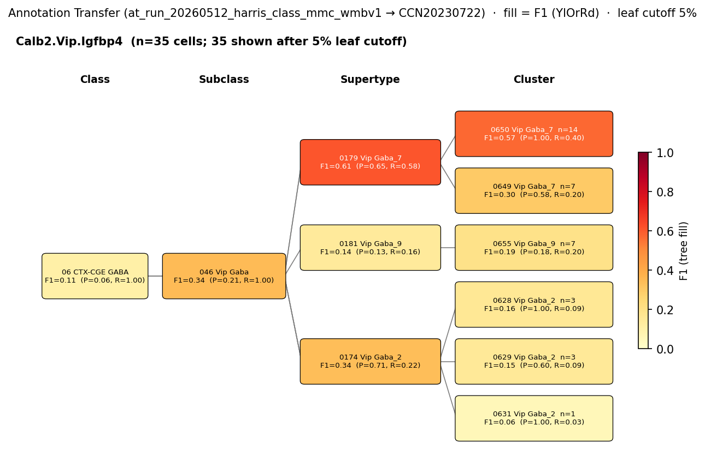

# Interneuron-specific (IS) interneuron — WMBv1 (CCN20230722) Mapping Report
*2026-04-09 · Source: `/Users/do12/Documents/GitHub/BICAN_agentic_framework_planning/evidencell/kb/graphs/hippocampus/hippocampus_GABAergic_interneurons.yaml`*

---

## Introduction

Interneuron-specific (IS) interneurons are a class of hippocampal GABAergic cells defined by their selective innervation of other GABAergic interneurons — the cellular substrate for disinhibitory circuit motifs in CA1 [3]. They were originally distinguished on ultrastructural grounds: calretinin (CR)- and/or vasoactive intestinal polypeptide (VIP)-expressing GABAergic cells in CA1 that contact interneurons selectively, and were subdivided into three subtypes (IS-1: CR+/VIP−; IS-2: VIP+; IS-3: CR+/VIP+) [1][2]. Establishing how this functionally defined class maps onto the WMBv1 transcriptomic taxonomy matters because the interneuron-selective targeting feature is not encoded in any current Cell Ontology term, and because the three IS subtypes are predicted to occupy distinct positions in the Vip / Calb2 region of the taxonomy.

### Classical type table

| Property | Value | References |
|---|---|---|
| Soma location | CA1 stratum oriens [UBERON:0014552]; CA1 stratum radiatum [UBERON:0014554]; CA1 stratum lacunosum-moleculare [UBERON:0014557] | [1] |
| Neurotransmitter | GABAergic | — |
| Defining markers | Calb2 [1][2][3]; Vip [2][4] | [1][2][3][4] |
| Neuropeptides | Vip | [2] |
| Definition basis | CLASSICAL_MULTIMODAL | — |
| CL term | VIP GABAergic interneuron [CL:4023016] (BROAD) | — |

Details — source evidence for classical type properties

- **Soma location / IS class definition:** ultrastructural characterisation in rat CA1; subdivision into three subtypes (IS-1/IS-2/IS-3) · [1]
  > The so-called interneuron-specific (IS) cells were identified based on direct ultrastructural evidence that some calretinin (CR)- expressing or vasoactive intestinal polypeptide (VIP)-expressing GABAergic cells in the CA1 area of the hippocampus contact interneurons selectively. IS cells were further subdivided into three subtypes with distinct anatomical and neurochemical features.
  > — Tyan et al. 2014, Classical Functional and Morphological Interneuron Types · [1] <!-- quote_key: 23480858_1f4801fb -->
- **Defining markers Calb2 / Vip — IS-1/2/3 subtype distinction:** · [2]
  > Freund and colleagues first characterized IS interneurons and showed that these cells express calretinin (CR) (IS-1), VIP (IS-2), or both (IS-3)
  > — Tzilivaki et al. 2023, Transcriptomic Interneuron Classifications · [2] <!-- quote_key: 259953057_10f139f9 -->
- **Calb2 marker / IS-IN representativeness in CA1 interneuron repertoire:** · [4]
  > This mouse line allows for a large sampling from diverse interneuron subtypes in the CA1 pyramidal layer, including the most representative ones (Bezaire et al., 2013), the PV-expressing basket and bistratified cells (Klausberger et al., 2008), the NOS- expressing ivy cells (14381729) and two types of interneuron-selective interneurons (ISI 1 and 3) that express calretinin (Klausberger et al., 2008)(Topolnik et al., 2022)
  > — Bocchio et al. 2024, Classical Functional and Morphological Interneuron Types · [4] <!-- quote_key: 262127573_d140faf4 -->

Cell Ontology mapping: VIP GABAergic interneuron [[CL:4023016](https://www.ebi.ac.uk/ols4/ontologies/cl/classes?obo_id=CL:4023016)] (BROAD). CL:4023016 captures the VIP+ subset (IS-2 and IS-3) but does not cover IS-1 (CR+/VIP−); the defining functional feature — selective targeting of other interneurons — is not encoded in any CL term.

---

## Results

One candidate atlas entry was assessed (supertype SUPT_0179 Vip Gaba_7) at MODERATE confidence with a PARTIAL_OVERLAP relationship — the supertype captures the IS-2 and IS-3 (VIP+) subtypes but not IS-1 (VIP−).

**Annotation-transfer overview (node-scoped, filtered).**

*F1 across taxonomy levels for the Yao 2021 SSv4 Vip source group (n=476 hippocampal Vip cells). The SSv4 Vip label aggregates IS cells, VIP basket cells and other VIP interneuron subtypes; signal at SUBCLASS level collapses cleanly onto SUBC_046 Vip Gaba (F1=0.969) but disperses across ~10 Vip supertypes at SUPERTYPE level (top hits SUPT_0177 F1=0.397 and SUPT_0179 F1=0.379). The dispersal reflects VIP subtype heterogeneity rather than a clean IS-specific signal.*

*F1 across taxonomy levels for the Harris 2018 Calb2.Vip.Igfbp4 source group (n=98 CA1 Calb2+/Vip+/Igfbp4+ interneurons). 100% of cells map to SUBC_046 Vip Gaba; 57.8% land in SUPT_0179 Vip Gaba_7 with F1=0.612. The Harris label is a broad Vip cluster rather than an IS-specific label, so this is supportive but not definitive for IS-IN → SUPT_0179.*

### Mapping candidates

| Rank | WMBv1 cluster | Supertype | Cells (10x) | Confidence | Key property alignment | Verdict |
|---|---|---|---|---|---|---|
| 1 | 0179 Vip Gaba_7 [CS20230722_SUPT_0179] | — (supertype) | 215 | 🟡 MODERATE | Vip CONSISTENT · Calb2 CONSISTENT · location CONSISTENT | Best candidate |

Total: 1 edge; relationship type PARTIAL_OVERLAP.

#### Property alignment — primary candidate SUPT_0179 (0179 Vip Gaba_7)

**Table 1 — Property comparison**

| Property | Classical | Supertype | Best cluster | Alignment |
|---|---|---|---|---|
| NT type | GABAergic | GABA | not assessed | CONSISTENT |
| Soma — CA1 SO | CA1 stratum oriens [UBERON:0014552] | Field CA1, stratum oriens (24 cells) | not assessed | CONSISTENT |
| Soma — CA1 SR | CA1 stratum radiatum [UBERON:0014554] | Field CA1, stratum radiatum (26 cells) | not assessed | CONSISTENT |
| Soma — CA1 SLM | CA1 stratum lacunosum-moleculare [UBERON:0014557] | not in top anatomical locations | not assessed | NOT_ASSESSED |
| Vip (defining) | defining marker | DEFINING marker of SUPT_0179; precomputed mean 6.82 | not assessed | CONSISTENT |
| Calb2 (defining) | defining marker | not in supertype defining markers; precomputed mean 6.78 | not assessed | CONSISTENT |
| Vip (neuropeptide) | present | not assessed at supertype; precomputed mean 6.82 | not assessed | CONSISTENT |
| Sex ratio | not documented | not available | not available | NOT_ASSESSED |

**Table 2 — Evidence support**

| Evidence | Type | Supports | Headline | Source |
|---|---|---|---|---|
| Atlas supertype metadata (SUPT_0179) | Atlas metadata | PARTIAL | Vip DEFINING; CA1 SO (24) + CA3 SO (25) + CA1 SR (26) + CA3 SR (17) + CA1 SP (11) + CA3 SP (23) | atlas-internal |
| Atlas precomputed expression (SUPT_0179) | Atlas metadata | SUPPORT | Calb2=6.78; Vip=6.82; Vip neuropeptide=6.82 | atlas-internal |
| Yao 2021 SSv4 Vip → WMBv1 | Annotation transfer | PARTIAL | SUBC_046 F1=0.969 (463 cells); SUPT_0179 F1=0.379 (96 cells) | atlas-internal |
| Harris 2018 Calb2.Vip.Igfbp4 → WMBv1 | Annotation transfer | PARTIAL | SUBC_046 F1=0.344 (98 cells, 100% recall); SUPT_0179 F1=0.612 (26 cells) | atlas-internal |

*(Child-cluster breakdown not assessed — see proposed experiments.)*

### 0179 Vip Gaba_7 [CS20230722_SUPT_0179] · 🟡 MODERATE

**Supporting evidence**
- Vip Gaba_7 carries Vip as a DEFINING marker, consistent with IS-2 (VIP+) and IS-3 (CR+/VIP+) subtype identity. Hippocampal anatomy is distributed across multiple CA1 and CA3 layers (CA1 SO 24, CA3 SO 25, CA1 SR 26, CA3 SR 17, CA1 SP 11, CA3 SP 23) — multi-laminar CA1 distribution matches the classical IS soma profile spanning SO, SR and SLM.
- Precomputed expression cross-check: both defining markers strongly expressed (Calb2=6.78, Vip=6.82) and the Vip neuropeptide is confirmed (6.82).
- MapMyCells AT from Yao 2021 SSv4 Vip subclass (n=476 hippocampal Vip cells): cells collapse cleanly to SUBC_046 Vip Gaba at SUBCLASS level (F1=0.969, target_purity=0.953), confirming VIP-family identity. At SUPERTYPE level, SUPT_0179 receives 96/476 Vip cells (F1=0.379, target_purity=0.970) — second only to SUPT_0177 (F1=0.397, 101 cells). The dispersal is expected because the Yao SSv4 'Vip' label aggregates IS cells, VIP basket and other VIP interneuron subtypes.
- MapMyCells AT from Harris 2018 Calb2.Vip.Igfbp4 Class (n=98 CA1 Calb2+/Vip+/Igfbp4+ interneurons): 100% recall to SUBC_046 Vip Gaba; 57.8% (26 cells) to SUPT_0179 Vip Gaba_7 with F1=0.612 — the highest single-source F1 evidence on this edge.

**Marker evidence provenance**
- **Calb2 (defining):** transcript-level support from primary IS-IN literature [1][2][3]; atlas precomputed mean 6.78 at SUPT_0179 confirms presence. Calb2 is *not* listed in the atlas defining markers for SUPT_0179 (Vip is the headline defining marker, with additional atlas markers Qrfpr, Stk32a, Igfbp4) — absence from the defining set may reflect supertype-level summarisation rather than expression failure.
- **Vip (defining + neuropeptide):** transcript-level evidence from multiple primary citations [2][4]; atlas precomputed mean 6.82. DEFINING in the atlas metadata. No discrepancy.
- **Qrfpr, Stk32a, Igfbp4 (additional atlas defining markers):** atlas-side markers with no correspondence established in classical IS-IN literature; they may help refine the relationship between IS-IN and SUPT_0179 versus other Vip supertypes (e.g. SUPT_0177).

**Concerns**
- **Heterogeneity caveat (OTHER):** the classical IS node bundles three subtypes (IS-1 CR+/VIP−; IS-2 VIP+; IS-3 CR+/VIP+). IS-1 cells are VIP-negative and would *not* map to a Vip supertype; the SUPT_0179 edge therefore covers only IS-2 and IS-3. A Calb2+/Vip− supertype is the missing candidate for IS-1.
- **MARKER_NOT_SPECIFIC caveat:** the Vip Gaba_7 supertype likely encompasses both perisomatic VIP basket cells and disinhibitory IS cells. The interneuron-selective targeting feature that defines the IS class is not resolvable from transcriptomic metadata alone — the same supertype is currently a candidate for vip_basket_cell_hippocampus.
- AT dispersal across ~10 Vip supertypes (Yao 2021 run): SUPT_0179 is only the second-ranked supertype hit (after SUPT_0177 F1=0.397). The Yao SSv4 'Vip' label is mixed; cannot discriminate IS-IN from VIP basket or other VIP subtypes at supertype resolution.
- SLM soma location not represented in SUPT_0179's top anatomical counts — NOT_ASSESSED rather than CONSISTENT for that layer.

**What would upgrade confidence**
- A morphology- or function-resolved IS-IN dataset (e.g. patch-seq of CA1 Vip-Cre or CR-Cre cells with verified interneuron-targeting axons) mapped at supertype and cluster level. **Target:** F1 ≥ 0.7 at SUPERTYPE for an IS-specific source group. **Expected output:** AnnotationTransferEvidence with IS labels (not aggregated Vip).
- Splitting the classical IS node into IS-1/IS-2/IS-3 sub-nodes so the mapping can distinguish a Calb2+/Vip− supertype (IS-1) from SUPT_0179 (IS-2/IS-3). Resolves the OTHER heterogeneity caveat.
- Cluster-level breakdown of SUPT_0179 children to identify which (if any) cluster is enriched for the interneuron-targeting axonal phenotype versus VIP basket perisomatic targeting. **Target:** child-cluster co-mapping with vip_basket_cell_hippocampus to separate the two functional populations.
- Targeted literature search for primary citations linking Qrfpr / Stk32a / Igfbp4 to morphology- or function-confirmed IS-IN cells — atlas-side markers currently unsourced in the classical literature.

### Methods

Data sources, analyses, and reproducibility receipts

**Classical type definition.** The IS interneuron is defined here on a CLASSICAL_MULTIMODAL basis — ultrastructural evidence of selective GABAergic-cell innervation plus calretinin / VIP immunohistochemistry, subdivided into IS-1 (CR+/VIP−), IS-2 (VIP+) and IS-3 (CR+/VIP+) [1][2]. Soma in CA1 stratum oriens [UBERON:0014552], stratum radiatum [UBERON:0014554] and stratum lacunosum-moleculare [UBERON:0014557] [1]; defining markers Calb2 [1][2][3] and Vip [2][4]; Vip neuropeptide [2]; GABAergic neurotransmission.

**Atlas mapping query.** Candidate atlas clusters were retrieved from the WMBv1 (CCN20230722) taxonomy at ranks 0 (cluster) and 1 (supertype) using metadata-based scoring (region match, NT type, defining markers, sex bias when applicable). Full scoring rules: `workflows/map-cell-type.md`.

**Property alignment.** Each defining property of the classical type was compared to the corresponding atlas-side value via the `property_comparisons` schema, with alignments graded CONSISTENT / APPROXIMATE / DISCORDANT / NOT_ASSESSED. Atlas-side numerical values came from precomputed expression on the cluster (cluster.yaml in the taxonomy reference store) and from MERFISH spatial registration for soma location.

**Annotation transfer — Yao 2021 SSv4 (GSE185862).**

| Field | Value |
|---|---|
| Source dataset | GEO:GSE185862 (Yao 2021 mouse hippocampal formation SMART-Seq v4 cell type labels; Vip subclass used here) |
| Source species | NCBITaxon:10090 |
| Target atlas | WMBv1 (CCN20230722) |
| Method | MapMyCells local (cell_type_mapper, default parameters, raw normalization, 100 bootstrap iterations) |
| Tool version | cell_type_mapper |
| Bootstrap threshold | 0.0 |
| n cells | 6398 (filtered to 6398) |
| Run record | [`kb/annotation_transfer_runs/at_run_20260508_yao2021_hpf_ssv4_mmc_wmbv1/manifest.yaml`](../../kb/annotation_transfer_runs/at_run_20260508_yao2021_hpf_ssv4_mmc_wmbv1/manifest.yaml) |
| Script (external) | README.md |
| Code reference | [https://github.com/AllenInstitute/cell_type_mapper](https://github.com/AllenInstitute/cell_type_mapper) |
| F1 matrix | [`f1_scores_best.csv`](../../kb/annotation_transfer_runs/at_run_20260508_yao2021_hpf_ssv4_mmc_wmbv1/f1_scores_best.csv) |

**Annotation transfer — Harris 2018 Class labels (GSE99888).**

| Field | Value |
|---|---|
| Source dataset | GEO:GSE99888 (Harris 2018 published Class labels for 3663 mouse CA1 inhibitory neurons; Calb2.Vip.Igfbp4 Class used here) |
| Source species | NCBITaxon:10090 |
| Target atlas | WMBv1 (CCN20230722; SHA-256: b21ca985) |
| Method | MapMyCells local (cell_type_mapper v1.7.1, default parameters, raw normalization, bootstrap_iteration=100) |
| Tool version | cell_type_mapper v1.7.1 |
| Bootstrap threshold | 0.8 |
| n cells | 3663 (filtered to 3663) |
| Run record | [`kb/annotation_transfer_runs/at_run_20260512_harris_class_mmc_wmbv1/manifest.yaml`](../../kb/annotation_transfer_runs/at_run_20260512_harris_class_mmc_wmbv1/manifest.yaml) |
| Script (external) | ../at_run_20260506_harris_chamberland_mmc_wmbv1/README.md |
| Code reference | [https://github.com/AllenInstitute/cell_type_mapper](https://github.com/AllenInstitute/cell_type_mapper) |
| F1 matrix | [`f1_matrix_harris_class.csv`](../../kb/annotation_transfer_runs/at_run_20260512_harris_class_mmc_wmbv1/f1_matrix_harris_class.csv) |
| Caveats | This run record scores Harris 2018's published Class labels against WMBv1. It is one of two run records that share the same MapMyCells output (mmc_results.csv lives in the original bundled run dir at ../at_run_20260506_harris_chamberland_mmc_wmbv1/). The companion at_run_20260512_chamberland_subfamily_mmc_wmbv1 scores the same MMC output under Chamberland 2024 in-silico gene-pair subfamily labels. |

**Anti-hallucination.** All citations, atlas accessions, ontology CURIEs, and verbatim literature quotes in this report are validated against the evidencell knowledge base at write time. Authored-prose evidence narratives are validated against their source `evidence_items[*].explanation` fields. The pre-write hook rejects any unresolvable identifier or unattributed blockquote. Specific mapping limitations and caveats are documented per-candidate in the Discussion section.

*Generated by evidencell `01f89d6` at 2026-05-13T15:46:14+00:00 from [kb/graphs/hippocampus/hippocampus_GABAergic_interneurons.yaml](kb/graphs/hippocampus/hippocampus_GABAergic_interneurons.yaml).*

**Evidence base table**

| Edge ID | Evidence types | Supports | Source |
|---|---|---|---|
| edge_is_interneuron_hippocampus_to_CS20230722_SUPT_0179 | ATLAS_METADATA ×2; ANNOTATION_TRANSFER ×2 | PARTIAL ×3, SUPPORT ×1 | atlas-internal |

---

## Discussion

**Primary mapping:** Interneuron-specific (IS) interneuron → 0179 Vip Gaba_7 [CS20230722_SUPT_0179] at MODERATE confidence. Key support: atlas precomputed expression of both defining markers (Calb2=6.78, Vip=6.82) plus convergent annotation transfer from two independent datasets (Yao 2021 SSv4 Vip subclass F1=0.379; Harris 2018 Calb2.Vip.Igfbp4 Class F1=0.612). Key caveats: OTHER (classical IS node aggregates IS-1/IS-2/IS-3 subtypes — IS-1 is VIP− and cannot map here) and MARKER_NOT_SPECIFIC (the supertype likely contains both VIP basket cells and IS cells; the interneuron-selective targeting feature is not transcriptomically resolvable).

The Cell Ontology has no specific term for interneuron-specific (disinhibitory) interneurons; VIP GABAergic interneuron [[CL:4023016](https://www.ebi.ac.uk/ols4/ontologies/cl/classes?obo_id=CL:4023016)] is the closest ancestor (BROAD). CL:4023016 captures VIP+ subset (IS-2 and IS-3) but not IS-1 (CR+/VIP−). The defining functional feature — selective interneuron targeting for disinhibition — is not encoded in any CL term. This is a candidate for a CL new-term request.

### Proposed experiments and follow-ups

The two AT runs already address the standard "run MapMyCells from a hippocampal Vip-IN dataset" experiment. What was done:
- **Yao 2021 SSv4 Vip subclass → WMBv1 (GSE185862, n=476 HIP Vip cells):** subclass-level mapping; result PARTIAL because the SSv4 Vip label aggregates IS, VIP basket and other VIP subtypes — signal disperses across ~10 Vip supertypes.
- **Harris 2018 Calb2.Vip.Igfbp4 Class → WMBv1 (GSE99888, n=98 CA1 Vip+ cells):** Class-level mapping; SUPT_0179 F1=0.612, supportive but not IS-specific.

Refinements that would still add value:
- **What:** Morphology- or function-resolved IS-IN dataset (patch-seq of CA1 Vip-Cre or CR-Cre cells with axon-targeting morphology confirmed, or in-silico re-labelling of an existing dataset using IS-IN-specific gene panels). **Target:** F1 ≥ 0.7 at SUPERTYPE for an IS-specific source group. **Expected output:** AnnotationTransferEvidence with IS labels (not aggregated Vip). **Resolves:** MARKER_NOT_SPECIFIC caveat; distinguishes IS from VIP basket within SUPT_0179.
- **What:** Split the classical IS node into IS-1, IS-2, IS-3 sub-nodes and re-run mapping. **Target:** identify a Calb2+/Vip− supertype for IS-1; confirm SUPT_0179 (or a sibling) for IS-2 and IS-3 separately. **Expected output:** three subtype-specific MappingEdges replacing the current aggregated edge. **Resolves:** OTHER heterogeneity caveat.
- **What:** Targeted cite-traverse for atlas-side defining markers Qrfpr, Stk32a, Igfbp4 in morphology-confirmed IS-IN cells. **Expected output:** additional LiteratureEvidence and `defining_markers` entries on the classical node. **Resolves:** Atlas-side marker provenance gap.

### Open questions

1. Which Vip supertype (or sibling) holds the IS-1 (CR+/VIP−) subtype? SUPT_0179 covers only IS-2 and IS-3; a Calb2+/Vip− candidate has not been identified.
2. Within SUPT_0179, can child clusters distinguish IS cells (interneuron-selective axonal targeting) from VIP basket cells (perisomatic targeting)? Child-cluster breakdown has not been assessed on this edge.
3. SUPT_0177 Vip Gaba_5 receives slightly more Yao 2021 Vip cells than SUPT_0179 (F1=0.397 vs 0.379) — is SUPT_0177 a co-candidate for IS-IN, or does it preferentially carry VIP basket cells? A direct property comparison for SUPT_0177 is not yet on the graph.

---

## References

| # | Citation | PMID | Used for |
|---|---|---|---|
| [1] | Tyan et al. 2014 | [24671999](https://pubmed.ncbi.nlm.nih.gov/24671999) | soma location; IS class definition |
| [2] | Tzilivaki et al. 2023 | [37467748](https://pubmed.ncbi.nlm.nih.gov/37467748) | Calb2 marker; Vip marker; IS-1/2/3 subtype distinction |
| [3] | Chamberland & Topolnik 2012 | [23162426](https://pubmed.ncbi.nlm.nih.gov/23162426) | Calb2 marker; IS-IN class framing |
| [4] | Bocchio et al. 2024 | [39401246](https://pubmed.ncbi.nlm.nih.gov/39401246) | Vip marker; CA1 IS-IN representativeness |
