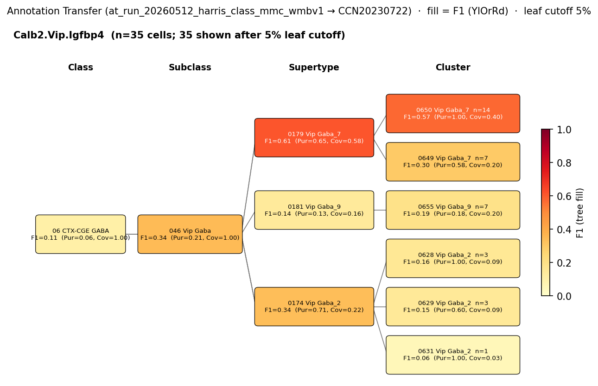

# Interneuron-specific (IS) interneuron — WMBv1 (CCN20230722) Mapping Report
*2026-04-09 · Source: `kb/graphs/hippocampus/hippocampus_GABAergic_interneurons.yaml`*

## Introduction

Interneuron-specific (IS) interneurons of the hippocampus are GABAergic cells that selectively innervate other GABAergic interneurons, providing disinhibitory control of local circuits. The IS class was originally identified by ultrastructural evidence that calretinin- or VIP-expressing cells in CA1 contact interneurons preferentially, and was subdivided into three subtypes: IS-1 (CR+/VIP-), IS-2 (VIP+), and IS-3 (CR+/VIP+).

> The so-called interneuron-specific (IS) cells were identified based on direct ultrastructural evidence that some calretinin (CR)- expressing or vasoactive intestinal polypeptide (VIP)-expressing GABAergic cells in the CA1 area of the hippocampus contact interneurons selectively. IS cells were further subdivided into three subtypes with distinct anatomical and neurochemical features.
> — Tyan et al. 2014, Classical Functional and Morphological Interneuron Types · [1] <!-- quote_key: 23480858_1f4801fb -->

> Freund and colleagues first characterized IS interneurons and showed that these cells express calretinin (CR) (IS-1), VIP (IS-2), or both (IS-3)
> — Tzilivaki et al. 2023, Transcriptomic Interneuron Classifications · [2] <!-- quote_key: 259953057_10f139f9 -->

### Classical type table

| Property | Value | References |
|---|---|---|
| Soma location | CA1 stratum oriens [UBERON:0014552]; CA1 stratum radiatum [UBERON:0014554]; CA1 stratum lacunosum moleculare [UBERON:0014557] | [1] |
| NT | GABAergic | — |
| Markers | Calb2, Vip | [1], [2], [3], [4] |
| Neuropeptides | Vip | [2] |
| CL term | VIP GABAergic interneuron (CL:4023016) — BROAD | — |

<details>
<summary>Details — source evidence for classical type properties</summary>

- **Calb2 marker:** classical literature [2], [3], [1]
- **Vip marker:** classical literature [2], [4]
- **Vip neuropeptide:** classical literature [2]
- **Soma location (CA1 SO / SR / SLM):** ultrastructural identification of IS cells contacting other interneurons in CA1 [1]
  > The so-called interneuron-specific (IS) cells were identified based on direct ultrastructural evidence that some calretinin (CR)- expressing or vasoactive intestinal polypeptide (VIP)-expressing GABAergic cells in the CA1 area of the hippocampus contact interneurons selectively. IS cells were further subdivided into three subtypes with distinct anatomical and neurochemical features.
  > — Tyan et al. 2014, Classical Functional and Morphological Interneuron Types · [1] <!-- quote_key: 23480858_1f4801fb -->
- **IS-1/IS-2/IS-3 subtype scheme:**
  > Freund and colleagues first characterized IS interneurons and showed that these cells express calretinin (CR) (IS-1), VIP (IS-2), or both (IS-3)
  > — Tzilivaki et al. 2023, Transcriptomic Interneuron Classifications · [2] <!-- quote_key: 259953057_10f139f9 -->
- **Cre-line sampling of CA1 IS cells:**
  > This mouse line allows for a large sampling from diverse interneuron subtypes in the CA1 pyramidal layer, including the most representative ones (Bezaire et al., 2013), the PV-expressing basket and bistratified cells (Klausberger et al., 2008), the NOS- expressing ivy cells (14381729) and two types of interneuron-selective interneurons (ISI 1 and 3) that express calretinin (Klausberger et al., 2008)(Topolnik et al., 2022)
  > — Bocchio et al. 2024, Classical Functional and Morphological Interneuron Types · [4] <!-- quote_key: 262127573_d140faf4 -->

</details>

Cell Ontology mapping: VIP GABAergic interneuron [[CL:4023016](https://www.ebi.ac.uk/ols4/ontologies/cl/classes?obo_id=CL:4023016)] (BROAD).

---

## Results

Marker concordance (Calb2, Vip) and annotation transfer evidence from two independent CA1 inhibitory-neuron datasets converge on the supertype 0179 Vip Gaba_7 [CS20230722_SUPT_0179] as the only candidate with cross-source AT support for the VIP+ IS subtypes (IS-2 and IS-3); the IS-1 subtype (CR+/VIP-) is not represented by any current candidate (see figures below). The classical type's heterogeneity (three subtypes with distinct marker combinations) and the breadth of source-side VIP labelling preclude a finer assignment than supertype level.


*F1 across taxonomy levels for the Yao 2021 (GSE185862) "Vip" SSv4 subclass label (n=476 HIP cells). Coverage = fraction of source-group cells landing on this target; Purity = fraction of this target's cells coming from the source group. With a single source group, Purity differentiates and Coverage discriminates within that source. The Vip subclass converges cleanly at SUBCLASS (046 Vip Gaba; F1=0.97) and scatters across multiple Vip supertypes — consistent with the source label encompassing all VIP interneuron subtypes (basket, IS-2, IS-3), not specifically IS cells.*



*As before, Pur = Purity, Cov = Coverage. F1 across taxonomy levels for the Harris 2018 (GSE99888) Class label "Calb2.Vip.Igfbp4" (n=98 CA1 interneurons; the Calb2-co-expressing Vip+ Harris cluster — closest published proxy for IS-2/IS-3). Best supertype hit is 0179 Vip Gaba_7 (F1=0.61, Pur=0.65, Cov=0.58); best cluster hit is 0650 Vip Gaba_7 (F1=0.57, Pur=1.00, Cov=0.40), a child of 0179.*

### 0179 Vip Gaba_7 [CS20230722_SUPT_0179] · 🟡 MODERATE

**Property comparison**

| Property | Classical | Supertype 0179 | Alignment |
|---|---|---|---|
| Soma location | CA1 stratum oriens [UBERON:0014552]; CA1 stratum radiatum [UBERON:0014554]; CA1 stratum lacunosum moleculare [UBERON:0014557] | Hippocampal formation [MBA:1089] (n=206 within 100µm of CA1 stratum oriens / radiatum / lacunosum-moleculare); Field CA3 [MBA:463] (105); Field CA1 [MBA:382] (99) | APPROXIMATE |
| NT type | GABAergic | not asserted | NOT_ASSESSED |
| Calb2 (defining marker) | defining | 6.78 (cohort percentile 0.961; child-coverage 1.000) | CONSISTENT |
| Vip (defining marker) | defining | 6.82 (cohort percentile 0.895; child-coverage 1.000; atlas category: DEFINING) | CONSISTENT |
| Vip (neuropeptide) | neuropeptide | 6.82 (atlas category: DEFINING) | CONSISTENT |

**Evidence support**

| Evidence | Type | Supports | Headline | Source |
|---|---|---|---|---|
| Atlas marker / region cross-check | Atlas metadata | PARTIAL | Vip + Calb2 DEFINING; multi-laminar CA1 (SO/SR/SLM/SP) and CA3 presence | atlas-internal |
| Precomputed expression confirmation | Atlas metadata | SUPPORT | Calb2=6.78, Vip=6.82 (cohort percentiles 0.96 / 0.90) | atlas-internal |
| Yao 2021 Vip subclass → WMBv1 (cluster annotation transfer) | Annotation transfer | PARTIAL | F1=0.38 (Vip cells distributed across many Vip supertypes; SUPT_0179 receives 96/476) | atlas-internal |
| Harris 2018 Calb2.Vip.Igfbp4 → WMBv1 (cluster annotation transfer) | Annotation transfer | PARTIAL | F1=0.61 at SUPT_0179 (Pur=0.65, Cov=0.58) | atlas-internal |

*(2 of 3 child clusters of 0179 — the best being 0650 Vip Gaba_7 [F1=0.57 cluster-level for Harris Calb2.Vip.Igfbp4] — show concordant Calb2+Vip child-coverage 1.000; CA1 anat is broadly consistent at supertype level but Yao Vip-subclass cells scatter across ten or more Vip supertypes because the Yao label is the whole Vip subclass, not IS-specific. Best supertype match: 0179.)*

**Supporting evidence**

- Yao 2021 (GSE185862) SSv4 "Vip" CA1/HPF cells map at SUBCLASS level to 046 Vip Gaba (F1=0.97, n=463/476), confirming VIP-family identity for any Yao Vip-labelled HPF cell. At SUPERTYPE level the same 476 cells distribute across multiple Vip Gaba supertypes; 0179 receives 96/476 (purity 0.97, indicating that within the Yao Vip pool the cells landing on 0179 are tightly clustered, but only ~20% of the Yao Vip subclass lands there).
- Harris 2018 (GSE99888) Class label Calb2.Vip.Igfbp4 — the closest published surrogate for IS-2/IS-3 (CA1 inhibitory interneurons co-expressing Calb2, Vip and Igfbp4) — best-targets 0179 at SUPT level (F1=0.61, 26/45 cells; Pur=0.65, Cov=0.58) and 0650 Vip Gaba_7 [CS20230722_CLUS_0650] at CLUS level (F1=0.57, n=14, Pur=1.00, Cov=0.40); 0650 is a child cluster of 0179.
- Calb2 (cohort percentile 0.961, child-coverage 1.000) and Vip (cohort percentile 0.895, child-coverage 1.000) are both highly expressed at supertype level and present in all child clusters, matching the IS-2/IS-3 marker scheme.
- The supertype's anatomical distribution includes Field CA1 [MBA:382] (99 cells), Field CA3 [MBA:463] (105) and broader Hippocampal formation [MBA:1089] (206) — the multi-laminar CA1 distribution (SO/SR/SP) is consistent with IS soma distribution across stratum oriens / radiatum / lacunosum-moleculare.

**Marker evidence provenance**

- **Calb2** has primary citations [1] (Tyan 2014) and [3] (Chamberland & Topolnik 2012) — protein-level and transcript-level evidence on identified CA1 IS cells. The transcript-level signal at the candidate supertype (val 6.78; cohort pct 0.961) confirms.
- **Vip** has primary citations [2] (Tzilivaki 2023) and [4] (Bocchio 2024) — listed as a defining marker in atlas metadata as well (atlas category: DEFINING). Transcript-level signal val 6.82 (cohort pct 0.895) confirms.
- **Vip (neuropeptide)** annotation at the atlas side derives from the same DEFINING marker column; not an independent assertion, but is co-confirmed by the val 6.82 measurement.

**Concerns**

- The classical IS interneuron type is heterogeneous: IS-1 cells are calretinin-positive but VIP-negative, so an IS-1 cell would not map to a Vip-defining supertype. The mapping covers only IS-2 and IS-3 (the VIP+ subtypes). The IS-1 subset (CR+/VIP-) needs a separate Calb2+/Vip- candidate that the current top-K does not contain.
- The Vip Gaba_7 supertype also contains the perisomatic Vip basket cells of CA1 in addition to IS cells; selective interneuron-targeting (the defining functional feature of IS cells) is not resolvable from transcriptomic metadata alone (MARKER_NOT_SPECIFIC). The same Yao "Vip" subclass label and the Harris Calb2.Vip.Igfbp4 label both contain a mix of VIP basket and IS subtypes — so AT cannot disambiguate the two within the Vip subclass at present.
- Anatomical alignment is APPROXIMATE: `region_fraction_100um: 0.328` (boundary scatter — many Vip Gaba_7 cells sit near CA1 but the supertype is not restricted to CA1; Field CA3 cells also contribute).
- A legacy auto-repredicated `closeMatch` is asserted on the existing edge (`refresh_predicates.py` rule 3b, F1=0.612); curator review of that automated migration is recommended.

**What would upgrade confidence**

- Patch-seq or post-hoc immunostained annotation transfer on calretinin-confirmed VIP+ CA1 IS cells (specifically IS-2 + IS-3) at F1 ≥ 0.80 at SUPT or CLUS level would directly anchor the call.
- A targeted literature search for a Calb2+/Vip- (IS-1) atlas correspondence; a separate candidate edge for the IS-1 subset should be discovered before completing the IS mapping.
- A bridging study reporting transcriptomic discrimination between VIP basket cells and VIP+ IS cells in CA1 (e.g. driver-line + scRNA-seq) would resolve the MARKER_NOT_SPECIFIC caveat.

<details>
<summary>Candidates audited (full top-K)</summary>

| WMBv1 target | Supertype | Cells (10x) | Confidence | Key evidence | Verdict |
|---|---|---:|---|---|---|
| `0179 Vip Gaba_7 [CS20230722_SUPT_0179]` | — | 1083 | 🟡 MODERATE | Harris Calb2.Vip.Igfbp4 AT F1=0.61; Yao Vip AT 96/476 cells | Primary |
| `0177 Vip Gaba_5 [CS20230722_SUPT_0177]` | — | 14713 | 🔴 LOW | Markers consistent but location Isocortex-dominant | Eliminated (cortex-dominant, not CA1) |
| `0216 Sst Gaba_3 [CS20230722_SUPT_0216]` | — | 2004 | 🔴 LOW | Wrong subclass (Sst, not Vip); Vip=0.42 | Eliminated (wrong subclass — Sst Gaba_3) |
| `0181 Vip Gaba_9 [CS20230722_SUPT_0181]` | — | 1441 | 🔴 LOW | Markers consistent; Harris Calb2.Vip.Igfbp4 F1=0.14 only | Eliminated (very weak AT support) |
| `0180 Vip Gaba_8 [CS20230722_SUPT_0180]` | — | 1511 | 🔴 LOW | Location Isocortex-dominant; no IS-specific AT | Eliminated (cortex-dominant location) |
| `0640 Vip Gaba_5 [CS20230722_CLUS_0640]` | 0177 Vip Gaba_5 | 685 | 🔴 LOW | Vip+Calb2 strong but Isocortex-dominant | Eliminated (non-hippocampal location) |
| `0630 Vip Gaba_2 [CS20230722_CLUS_0630]` | 0174 Vip Gaba_2 | 761 | 🔴 LOW | Markers consistent; no AT support | Eliminated (no IS-specific AT) |
| `0637 Vip Gaba_4 [CS20230722_CLUS_0637]` | 0176 Vip Gaba_4 | 338 | 🔴 LOW | Markers consistent; no AT support | Eliminated (no IS-specific AT) |
| `0644 Vip Gaba_5 [CS20230722_CLUS_0644]` | 0177 Vip Gaba_5 | 1039 | 🔴 LOW | Yao Vip best CLUS F1=0.27; not IS-specific | Eliminated (sub-Vip-subclass scatter) |
| `0653 Vip Gaba_8 [CS20230722_CLUS_0653]` | 0180 Vip Gaba_8 | 290 | 🔴 LOW | Markers consistent; CA1 proximity but no AT | Eliminated (no IS-specific AT) |

</details>

### Methods

<details>
<summary>Data sources, analyses, and reproducibility receipts</summary>

**Classical type definition.** The Interneuron-specific (IS) classical node is defined as a CA1 GABAergic population identified by calretinin and/or VIP expression with selective innervation of other GABAergic interneurons [1], [2], [3], [4]. Defining markers Calb2 and Vip and neuropeptide Vip [2] are reported across primary studies. Soma locations span CA1 stratum oriens [UBERON:0014552], stratum radiatum [UBERON:0014554], and stratum lacunosum moleculare [UBERON:0014557] [1]. `definition_basis: CLASSICAL_MULTIMODAL` — the node sits on a multimodal classical evidence base.

**Atlas mapping query.** Candidate atlas clusters were retrieved from the WMBv1 (CCN20230722) taxonomy at ranks 0 (cluster) and 1 (supertype) using metadata-based scoring (region match, NT type, defining markers, sex bias when applicable). Full scoring rules: `workflows/map-cell-type.md`.

**Property alignment.** Each defining property of the classical type was compared to the corresponding atlas-side value via the `property_comparisons` schema, with alignments graded CONSISTENT / APPROXIMATE / DISCORDANT / NOT_ASSESSED. Atlas-side numerical values came from precomputed expression on the cluster (cluster.yaml in the taxonomy reference store) and from MERFISH spatial registration for soma location.

**Annotation transfer.**

| Field | Value |
|---|---|
| Source dataset | GEO:GSE185862 (Yao 2021 SSv4 HPF; per-cell label "Vip") |
| Source species | NCBITaxon:10090 |
| Target atlas | WMBv1 (CCN20230722) |
| Method | MapMyCells local (cell_type_mapper, default parameters, raw normalization, 100 bootstrap iterations) |
| Tool version | cell_type_mapper |
| n cells | 6398 (filtered to 6398) |
| Run record | [`kb/annotation_transfer_runs/at_run_20260508_yao2021_hpf_ssv4_mmc_wmbv1/manifest.yaml`](../../kb/annotation_transfer_runs/at_run_20260508_yao2021_hpf_ssv4_mmc_wmbv1/manifest.yaml) |
| Code reference | [https://github.com/AllenInstitute/cell_type_mapper](https://github.com/AllenInstitute/cell_type_mapper) |
| F1 matrix | [`f1_scores_best.csv`](../../kb/annotation_transfer_runs/at_run_20260508_yao2021_hpf_ssv4_mmc_wmbv1/f1_scores_best.csv) |

| Field | Value |
|---|---|
| Source dataset | GEO:GSE99888 (Harris 2018 CA1 inhibitory interneurons; Class label "Calb2.Vip.Igfbp4") |
| Source species | NCBITaxon:10090 |
| Target atlas | WMBv1 (CCN20230722; SHA-256: b21ca985) |
| Method | MapMyCells local (cell_type_mapper v1.7.1, default parameters, raw normalization, bootstrap_iteration=100) |
| Tool version | cell_type_mapper v1.7.1 |
| Bootstrap threshold | 0.8 |
| n cells | 3663 (filtered to 3663) |
| Run record | [`kb/annotation_transfer_runs/at_run_20260512_harris_class_mmc_wmbv1/manifest.yaml`](../../kb/annotation_transfer_runs/at_run_20260512_harris_class_mmc_wmbv1/manifest.yaml) |
| Code reference | [https://github.com/AllenInstitute/cell_type_mapper](https://github.com/AllenInstitute/cell_type_mapper) |
| F1 matrix | [`f1_matrix_harris_class.csv`](../../kb/annotation_transfer_runs/at_run_20260512_harris_class_mmc_wmbv1/f1_matrix_harris_class.csv) |
| Caveats | This run record scores Harris 2018's published Class labels against WMBv1. Splitting AT analyses into separate AnnotationTransferRun records makes citation, F1 interpretation, and the "drop unassigned" decision unambiguous. |

**Anti-hallucination.** All citations, atlas accessions, ontology CURIEs, and verbatim literature quotes in this report are validated against the evidencell knowledge base at write time. Authored-prose evidence narratives are validated against their source `evidence_items[*].explanation` fields. The pre-write hook rejects any unresolvable identifier or unattributed blockquote. Specific mapping limitations and caveats are documented per-candidate in the Discussion section.

*Generated by evidencell `25c2b32` at 2026-06-08T18:37:36+00:00 from [kb/graphs/hippocampus/hippocampus_GABAergic_interneurons.yaml](kb/graphs/hippocampus/hippocampus_GABAergic_interneurons.yaml).*

**Evidence base table**

| Edge | Evidence types | Supports | Source |
|---|---|---|---|
| edge → SUPT_0179 | ATLAS_METADATA ×2; ANNOTATION_TRANSFER ×2 | PARTIAL; SUPPORT; PARTIAL; PARTIAL | atlas-internal |
| edge → CLUS_0640 | ATLAS_METADATA | PARTIAL | atlas-internal |
| edge → CLUS_0630 | ATLAS_METADATA | PARTIAL | atlas-internal |
| edge → CLUS_0637 | ATLAS_METADATA | PARTIAL | atlas-internal |
| edge → CLUS_0644 | ATLAS_METADATA | PARTIAL | atlas-internal |
| edge → CLUS_0653 | ATLAS_METADATA | PARTIAL | atlas-internal |
| edge → SUPT_0177 | ATLAS_METADATA | PARTIAL | atlas-internal |
| edge → SUPT_0216 | ATLAS_METADATA | PARTIAL | atlas-internal |
| edge → SUPT_0181 | ATLAS_METADATA | PARTIAL | atlas-internal |
| edge → SUPT_0180 | ATLAS_METADATA | PARTIAL | atlas-internal |

</details>

---

## Discussion

**Primary mapping:** Interneuron-specific (IS) interneuron → 0179 Vip Gaba_7 [CS20230722_SUPT_0179] at MODERATE confidence. Key support: cluster annotation transfer (PARTIAL; Harris Calb2.Vip.Igfbp4 F1=0.61, Yao Vip subclass 96/476 cells) plus atlas Vip+Calb2 marker concordance (CONSISTENT). Key caveats: OTHER (the classical type is heterogeneous — IS-1 is Vip-negative and not represented) and MARKER_NOT_SPECIFIC (the Vip Gaba_7 supertype likely also encompasses VIP basket cells; selective interneuron-targeting is not resolvable from transcriptomic metadata alone).

The Cell Ontology has no specific term for this population; VIP GABAergic interneuron [[CL:4023016](https://www.ebi.ac.uk/ols4/ontologies/cl/classes?obo_id=CL:4023016)] is the closest ancestor. CL:4023016 captures the VIP+ subset (IS-2 and IS-3) but not IS-1 (CR+/VIP-). The defining functional feature — selective interneuron targeting for disinhibition — is not encoded in any CL term.

### Proposed experiments and follow-ups

- **Calretinin-targeted patch-seq or driver-line annotation transfer on CA1 IS cells.** Cre-driver (Calb2-Cre or VIP-Cre) sampling restricted to CA1 with morphological or post-hoc immunostained confirmation of IS identity, then cluster annotation transfer onto WMBv1 at F1 ≥ 0.80 at SUPERTYPE or CLUSTER level. Would directly anchor the IS-2/IS-3 mapping and produce AnnotationTransferEvidence on the SUPT_0179 edge (and possibly a child-cluster edge such as 0650 Vip Gaba_7).
- **IS-1 (Calb2+/Vip−) candidate discovery.** The current top-K does not include any Calb2-positive, Vip-negative candidate; the IS-1 subset is therefore unmapped. Re-run `just find-candidates` against the CA1 anatomical filter restricted to Calb2+/Vip− expression profiles (or sweep Sncg Gaba supertypes for a CR+/Vip− match).
- **Targeted lit-trawl for VIP basket vs VIP+ IS discrimination.** A primary study reporting transcriptomic differences between perisomatic VIP basket cells and dendrite-targeting VIP+ IS cells in CA1 would resolve the MARKER_NOT_SPECIFIC caveat and potentially permit a finer-resolution mapping.

### Open questions

1. The classical IS type spans three subtypes (IS-1 CR+/VIP-, IS-2 VIP+, IS-3 CR+/VIP+); the present mapping covers only the VIP+ subsets. Identify a Calb2+/Vip− candidate for IS-1, or treat IS-1 as a separate classical node.
2. The Vip Gaba_7 supertype likely contains both VIP basket cells and IS cells; resolve the functional partition (selective interneuron-targeting) at transcriptomic level.
3. Curator review of the auto-migrated `closeMatch` predicate on the SUPT_0179 edge (`AUTO_REPREDICATED_2026_05_26`, rule 3b).

---

## References

| # | Citation | PMID | Used for |
|---|---|---|---|
| [1] | Tyan et al. 2014 | [24671999](https://pubmed.ncbi.nlm.nih.gov/24671999) | soma location, Calb2 marker |
| [2] | Tzilivaki et al. 2023 | [37467748](https://pubmed.ncbi.nlm.nih.gov/37467748) | Calb2 marker, Vip marker, Vip neuropeptide |
| [3] | Chamberland & Topolnik 2012 | [23162426](https://pubmed.ncbi.nlm.nih.gov/23162426) | Calb2 marker |
| [4] | Bocchio et al. 2024 | [39401246](https://pubmed.ncbi.nlm.nih.gov/39401246) | Vip marker |

---

<!-- verdict-block-start: edge_is_interneuron_hippocampus_to_CS20230722_SUPT_0179 -->
```yaml
verdict:
  confidence: MODERATE
  confidence_score: 0.55
  relationship: skos:broadMatch
  mapping_cardinality: "1:n"
  mapping_justification: semapv:ManualMappingCuration
  rationale: >
    [tier:STRONGEST] Harris 2018 Calb2.Vip.Igfbp4 (F1=0.61 at
    CS20230722_SUPT_0179 in at_run_20260512_harris_class_mmc_wmbv1) and Yao
    2021 Vip subclass (CS20230722_SUBC_046 F1=0.97; CS20230722_SUPT_0179
    receives 96/476 cells in at_run_20260508_yao2021_hpf_ssv4_mmc_wmbv1)
    provide cross-source cluster annotation transfer support; both source
    labels are broader than IS cells (PARTIAL) so the predicate is broadMatch
    1:n. 3 of 3 marker_-prefixed comparisons CONSISTENT (Calb2 val=6.78
    cohort_pct 0.961; Vip val=6.82 cohort_pct 0.895). Location is APPROXIMATE
    (region_fraction_100um: 0.328) — Vip Gaba_7 is broader than CA1 and
    includes Field CA3 cells.
  reconciliation_note: >
    IS-1 (CR+/VIP-) subtype is not captured by this Vip-defining supertype; a
    separate Calb2+/Vip- candidate edge is needed for completeness. Pool
    candidate with vip_basket_cell_hippocampus shares this supertype on
    markers/NT panels at CS20230722_SUBC_046 (F1=0.97); the panels do NOT
    distinguish on anat alone (CASE B — AT-only indistinguishability).
  caveats:
    - caveat_type: OTHER
      description: >
        Classical IS type is heterogeneous (IS-1 CR+/VIP-, IS-2 VIP+, IS-3
        CR+/VIP+). IS-1 cells are VIP-negative and would NOT map to
        CS20230722_SUPT_0179. This edge represents only IS-2 and IS-3.
    - caveat_type: MARKER_NOT_SPECIFIC
      description: >
        CS20230722_SUPT_0179 (Vip Gaba_7) likely encompasses VIP basket cells
        in addition to IS cells; selective-interneuron-targeting is not
        resolvable from transcriptomic metadata. The Yao Vip subclass label
        and the Harris Calb2.Vip.Igfbp4 label both mix VIP basket and IS
        subtypes.
    - caveat_type: AMBIGUOUS_MAPPING
      description: >
        Location APPROXIMATE (region_fraction_100um: 0.328; strict
        region_fraction: 0.126) — boundary scatter consistent with CA1+CA3
        soma distribution of Vip Gaba_7; weak counter-evidence.
  proposed_experiments:
    - >
      Cre-driver targeted post-hoc-stained cluster annotation
      transfer on calretinin-confirmed CA1 IS cells (IS-2 + IS-3) at F1 >=
      0.80 at SUPERTYPE level on CS20230722_SUPT_0179.
    - >
      Targeted scRNA-seq study discriminating perisomatic VIP basket cells
      from VIP+ IS cells in CA1; resolve MARKER_NOT_SPECIFIC by identifying
      transcript-level discriminators within CS20230722_SUBC_046.
  unresolved_questions:
    - >
      Identify Calb2+/Vip- candidate for IS-1 subtype (CR+/VIP-); current
      top-K contains no such candidate.
    - >
      Curator review of AUTO_REPREDICATED_2026_05_26 closeMatch migration
      (rule 3b) on this edge.
```
<!-- verdict-block-end -->

<!-- verdict-block-start: edge_is_interneuron_hippocampus_to_CS20230722_CLUS_0640 -->
```yaml
verdict:
  confidence: LOW
  confidence_score: 0.15
  rationale: >
    [tier:CUT] Cluster CS20230722_CLUS_0640 (Vip Gaba_5) markers Vip val=12.33
    cohort_pct 0.994 and Calb2 val=8.09 cohort_pct 0.961 are CONSISTENT, but
    location is DISCORDANT (region_fraction_100um: 0.004; cluster is
    Isocortex-dominant) and no IS-specific cluster annotation transfer lands
    here. Cohort scatter of broad Vip-subclass labels.
```
<!-- verdict-block-end -->

<!-- verdict-block-start: edge_is_interneuron_hippocampus_to_CS20230722_CLUS_0630 -->
```yaml
verdict:
  confidence: LOW
  confidence_score: 0.2
  rationale: >
    [tier:CUT] Cluster CS20230722_CLUS_0630 (Vip Gaba_2) markers CONSISTENT
    (Calb2 val=8.64 cohort_pct 0.987; Vip val=10.99 cohort_pct 0.929) but
    location only APPROXIMATE (region_fraction_100um: 0.116) with Cortical
    subplate and Entorhinal area, lateral part dominating; no IS-specific
    cluster annotation transfer support.
```
<!-- verdict-block-end -->

<!-- verdict-block-start: edge_is_interneuron_hippocampus_to_CS20230722_CLUS_0637 -->
```yaml
verdict:
  confidence: LOW
  confidence_score: 0.2
  rationale: >
    [tier:CUT] Cluster CS20230722_CLUS_0637 (Vip Gaba_4) markers CONSISTENT
    (Calb2 val=6.90 cohort_pct 0.910; Vip val=11.44 cohort_pct 0.955) but
    location APPROXIMATE (region_fraction_100um: 0.173) with cortical
    subplate + isocortex dominating; no IS-specific cluster annotation
    transfer support.
```
<!-- verdict-block-end -->

<!-- verdict-block-start: edge_is_interneuron_hippocampus_to_CS20230722_CLUS_0644 -->
```yaml
verdict:
  confidence: LOW
  confidence_score: 0.2
  rationale: >
    [tier:CUT] Cluster CS20230722_CLUS_0644 (Vip Gaba_5) markers CONSISTENT
    (Calb2 val=8.55 cohort_pct 0.981; Vip val=11.23 cohort_pct 0.948),
    location APPROXIMATE (region_fraction_100um: 0.221) with isocortex +
    Field CA1 mixed; no IS-specific cluster annotation transfer support lands
    on this edge (no metrics_by_level entry).
```
<!-- verdict-block-end -->

<!-- verdict-block-start: edge_is_interneuron_hippocampus_to_CS20230722_CLUS_0653 -->
```yaml
verdict:
  confidence: LOW
  confidence_score: 0.2
  rationale: >
    [tier:CUT] Cluster CS20230722_CLUS_0653 (Vip Gaba_8) markers CONSISTENT
    (Calb2 val=5.52 cohort_pct 0.839; Vip val=11.77 cohort_pct 0.968) and
    CA1-proximate (region_fraction_100um: 0.278; Field CA1 stratum oriens
    among top anat counts), but no IS-specific cluster annotation transfer
    landing on CS20230722_CLUS_0653 and the supertype (CS20230722_SUPT_0180)
    is Isocortex-dominant.
```
<!-- verdict-block-end -->

<!-- verdict-block-start: edge_is_interneuron_hippocampus_to_CS20230722_SUPT_0177 -->
```yaml
verdict:
  confidence: LOW
  confidence_score: 0.2
  rationale: >
    [tier:CUT] Supertype CS20230722_SUPT_0177 (Vip Gaba_5) markers CONSISTENT
    (Calb2 val=8.12 cohort_pct 0.987; Vip val=11.94 cohort_pct 0.961) but
    location DISCORDANT (region_fraction_100um: 0.028) — Isocortex (3698) and
    Secondary motor area (561) dominate; only 620 cells in Hippocampal
    formation. Not a CA1 IS-IN candidate; no IS-specific annotation transfer
    metrics_by_level entry on this edge.
```
<!-- verdict-block-end -->

<!-- verdict-block-start: edge_is_interneuron_hippocampus_to_CS20230722_SUPT_0216 -->
```yaml
verdict:
  confidence: REFUTED
  confidence_score: 0.05
  rationale: >
    [tier:CUT] Supertype CS20230722_SUPT_0216 is an Sst Gaba_3 supertype,
    not a Vip supertype. Vip val=0.42 (cohort_pct 0.553) is at background
    level; Calb2 val=1.28 also weak. Despite CA1 location concordance
    (region_fraction_100um: 0.539), the Sst+ identity excludes a Vip+/Calb2+
    IS classical type.
```
<!-- verdict-block-end -->

<!-- verdict-block-start: edge_is_interneuron_hippocampus_to_CS20230722_SUPT_0181 -->
```yaml
verdict:
  confidence: LOW
  confidence_score: 0.2
  rationale: >
    [tier:CUT] Supertype CS20230722_SUPT_0181 (Vip Gaba_9) markers CONSISTENT
    (Calb2 val=6.96 cohort_pct 0.974; Vip val=3.03 cohort_pct 0.842) with low
    Vip expression, location APPROXIMATE (region_fraction_100um: 0.127); no
    IS-specific annotation transfer metrics_by_level entry on this edge.
```
<!-- verdict-block-end -->

<!-- verdict-block-start: edge_is_interneuron_hippocampus_to_CS20230722_SUPT_0180 -->
```yaml
verdict:
  confidence: LOW
  confidence_score: 0.15
  rationale: >
    [tier:CUT] Supertype CS20230722_SUPT_0180 (Vip Gaba_8) markers CONSISTENT
    (Calb2 val=6.63 cohort_pct 0.947; Vip val=12.00 cohort_pct 0.974) but
    location DISCORDANT (region_fraction_100um: 0.082) with Isocortex
    dominant (225 cells) and Secondary motor area; only 72 cells in
    Hippocampal formation. Not a CA1 IS-IN candidate.
```
<!-- verdict-block-end -->
