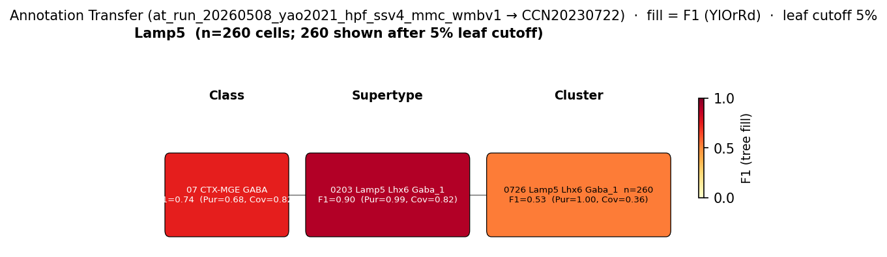

# Ivy cell (IvC) — WMBv1 (CCN20230722) Mapping Report
*2026-04-09 · Source: `kb/graphs/hippocampus/hippocampus_GABAergic_interneurons.yaml`*

---

## Introduction

Ivy cells are nNOS- and NPY-expressing GABAergic interneurons of the hippocampal CA1 region, with somata clustered in or near the pyramidal layer of CA1 [UBERON:0014548]. They are one of the most numerically representative CA1 interneuron populations and provide slow, GABA_B-mediated inhibition onto pyramidal-cell dendrites; they belong to the broader Lamp5+/Lhx6+ MGE-derived neurogliaform family and share neurochemical and electrophysiological properties with stratum-lacunosum-moleculare neurogliaform cells (NGCs), differing chiefly in laminar position [1][2].

### Classical type table

| Property | Value | References |
|---|---|---|
| Soma location | pyramidal layer of CA1 [UBERON:0014548] | [1] |
| NT | GABAergic | — |
| Markers | Nos1, Npy, Lamp5 | [2][1][3][4][5] |
| Negative markers | Pvalb, Sst, Calb2 | — |
| Neuropeptides | Npy | [2] |

<details>
<summary>Details — source evidence for classical type properties</summary>

- **Soma location:** Bocchio et al. 2024 sampled CA1 pyramidal-layer interneurons including nNOS-expressing ivy cells [1].

  > This mouse line allows for a large sampling from diverse interneuron subtypes in the CA1 pyramidal layer, including the most representative ones (Bezaire et al., 2013), the PV-expressing basket and bistratified cells (Klausberger et al., 2008), the NOS- expressing ivy cells (14381729) and two types of interneuron-selective interneurons (ISI 1 and 3) that express calretinin (Klausberger et al., 2008)(Topolnik et al., 2022)
  > — Bocchio et al. 2024, Classical Functional and Morphological Interneuron Types · [1] <!-- quote_key: 262127573_d140faf4 -->

- **Markers / negative markers / neuropeptides:** Tricoire et al. 2010 report shared Nos1/NPY co-expression in ivy cells and stratum-lacunosum-moleculare NGCs and the absence of PV, SOM, and CR [2].

  > IvCs and NGCs have been argued to represent distinct interneuron subtypes (52852755), despite the rich similarity between these cell types, including coexpression of NPY with nNOS, dense axonal arbors, and slow pyramidal cell inhibition. We found that both of these interneurons exhibit a LS phenotype and fail to express other classical interneuron markers such as PV, SOM, or CR.
  > — Tricoire et al. 2010, Classical Functional and Morphological Interneuron Types · [2] <!-- quote_key: 2405079_6850b924 -->

</details>

### Cell Ontology mapping

No Cell Ontology term currently covers this type — candidate for a new CL term.

---

## Results

Cross-marker concordance on the Lamp5+/Lhx6+ MGE-derived supertype together with annotation transfer of Lamp5+ hippocampal interneurons from two independent mouse datasets (Yao 2021 SMART-Seq v4 of hippocampal formation; Harris 2018 CA1 inhibitory interneurons) supports mapping ivy cells to the 0203 Lamp5 Lhx6 Gaba_1 [CS20230722_SUPT_0203] supertype (F1=0.90 from Yao Lamp5 source; F1=0.81 from Harris Cacna2d1.Lhx6.Reln class; see figures and property comparison table). Cluster-level annotation transfer in both datasets does not converge cleanly on any graph-resident cluster — the strongest cluster-level hit (0726 Lamp5 Lhx6 Gaba_1) is not currently a candidate edge and only the in-graph child 0731 Lamp5 Lhx6 Gaba_1 [CS20230722_CLUS_0731] carries supporting marker evidence (see candidates table).

### Annotation-transfer overview figures



*F1 across taxonomy levels for the Lamp5 source group from the Yao 2021 hippocampal-formation SMART-Seq v4 dataset (n=868 source cells; GEO:GSE185862) annotation-transferred to WMBv1 via MapMyCells. Each panel row is a source-cell group; nodes are coloured by F1 with **Purity** (Pur) and **Coverage** (Cov) shown inline. Coverage = fraction of source-group cells landing on this target; Purity = fraction of this target's cells coming from the source group. With a single source group, Purity is 1.0 at every level for the leading target and only Coverage discriminates. The Lamp5 source pools onto 050 Lamp5 Lhx6 Gaba at subclass, 0203 Lamp5 Lhx6 Gaba_1 [CS20230722_SUPT_0203] at supertype (F1=0.90), and 0726 Lamp5 Lhx6 Gaba_1 at cluster (F1=0.53; not in graph) — cluster-level scatter is consistent with ivy / NGC heterogeneity within the Lamp5 Lhx6 supertype.*


*F1 across taxonomy levels for the Cacna2d1.Lhx6.Reln class label from Harris 2018 CA1 interneurons (n=3663 cells; GEO:GSE99888) annotation-transferred to WMBv1 via MapMyCells. As before, Pur = Purity (fraction of target cells from this source); Cov = Coverage (fraction of source cells on this target). The Cacna2d1.Lhx6.Reln class — Lamp5+/Lhx6+/Reln+ CA1 interneurons identified by Harris as nNOS+ ivy-cell-like — converges on 0203 Lamp5 Lhx6 Gaba_1 [CS20230722_SUPT_0203] at supertype (F1=0.81) and on 0726 Lamp5 Lhx6 Gaba_1 at cluster (F1=0.81; not in graph), with only weak distribution onto graph-resident child clusters such as 0731 Lamp5 Lhx6 Gaba_1 [CS20230722_CLUS_0731] (F1=0.21).*

### 0203 Lamp5 Lhx6 Gaba_1 [CS20230722_SUPT_0203] · 🟡 MODERATE

**Table 1 — Property comparison**

| Property | Classical | Supertype | Best in-graph cluster | Alignment |
|---|---|---|---|---|
| Soma location | pyramidal layer of CA1 [UBERON:0014548] | Hippocampal formation [MBA:1089] count_100um=3175; Dentate gyrus [MBA:726] count_100um=1220; Field CA3 [MBA:463] count_100um=1179 | Hippocampal formation [MBA:1089] count_100um=457; Field CA3 [MBA:463] count_100um=287; Field CA3, pyramidal layer [MBA:495] count_100um=207 | DISCORDANT (SUPT: region_fraction_100um=0.090; CLUS_0731: region_fraction_100um=0.132) |
| NT type | GABAergic | not asserted | GABA | NOT_ASSESSED at SUPT; CONSISTENT at CLUS_0731 |
| Nos1 expression | defining marker | 7.78 (cohort pct 0.968; child-coverage 1.000) | 8.55 (CLUS_0731; cohort pct 0.941) | CONSISTENT |
| Npy expression | defining marker | 4.62 (cohort pct 0.710; child-coverage 1.000) | 4.35 (CLUS_0731; cohort pct 0.662) | CONSISTENT |
| Lamp5 expression | defining marker | 6.73 (cohort pct 0.968; child-coverage 1.000); atlas category DEFINING_SCOPED | 8.51 (CLUS_0731; cohort pct 0.985); atlas category MERFISH | CONSISTENT |
| Pvalb (negative) | ABSENT | 0.43 (cohort pct 0.516) | 0.07 (CLUS_0731; below MIN_DETECTABLE) | SUPT: DISCORDANT; CLUS_0731: CONSISTENT |
| Sst (negative) | ABSENT | 1.52 (cohort pct 0.677) | 1.24 (CLUS_0731; cohort pct 0.397) | DISCORDANT |
| Calb2 (negative) | ABSENT | 0.37 (cohort pct 0.419) | 0.31 (CLUS_0731; cohort pct 0.368) | SUPT: DISCORDANT; CLUS_0731: DISCORDANT |
| Npy (neuropeptide) | classical | 4.62 (cohort pct 0.710) | 4.35 (CLUS_0731; cohort pct 0.662); atlas category NEUROPEPTIDE | CONSISTENT |
| Sex ratio | not documented | not available | not assessed | NOT_ASSESSED |

Subcluster concordance: child-cluster breakdown across SUPT_0203 children is not exhaustively assessed in the edge YAML, but Chrna2 is not the classical marker here and the four assessable defining/negative markers (Nos1, Npy, Lamp5, Pvalb) are concordant on the in-graph child CLUS_0731 while Sst and Calb2 are weakly above MIN_DETECTABLE; the only AT-leading cluster (0726 Lamp5 Lhx6 Gaba_1) is not currently in the graph.

**Table 2 — Evidence support**

| Evidence | Type | Supports | Headline | Source |
|---|---|---|---|---|
| Lamp5 Lhx6 metadata convergence | Atlas metadata | PARTIAL | Lamp5/Lhx6 DEFINING_SCOPED; MGE; anat off-target (CA3 SO/SR, DG mol) | atlas-internal |
| Atlas precomputed expression | Atlas metadata | SUPPORT | Nos1=7.78, Npy=4.62, Lamp5=6.73; Pvalb/Sst/Calb2 all < 1.6 | atlas-internal |
| Yao 2021 SSv4 HPF Lamp5 → SUPT_0203 | Annotation transfer | SUPPORT | F1=0.90, purity=0.989, n=711/868 | atlas-internal |
| Harris 2018 Cacna2d1.Lhx6.Reln → SUPT_0203 | Annotation transfer | SUPPORT | F1=0.81, purity=0.730, n=246/3663 | atlas-internal |

**Supporting evidence**

- Two independent annotation-transfer runs converge on this supertype: the Yao 2021 SMART-Seq v4 hippocampal-formation Lamp5 subclass (n=868 cells) maps almost exclusively here (F1=0.90; purity=0.989; 711/868 cells), and the Harris 2018 published Cacna2d1.Lhx6.Reln Class (Lamp5+/Lhx6+/Reln+ CA1 interneurons, the cluster originally identified by Harris et al. as the nNOS+ ivy-cell-like population) also maps predominantly here (F1=0.81; purity=0.730; 246/3663 cells). The agreement of two SMART-Seq–based source datasets — one whole-HPF, one CA1-targeted — on this supertype is direct, methodology-orthogonal evidence for the Lamp5 Lhx6 identity of ivy cells.
- Precomputed atlas expression confirms all three defining markers (Nos1=7.78; Npy=4.62; Lamp5=6.73, all in the high cohort percentile band ≥ 0.71) and the absence of the three classical negative markers at the supertype mean (Pvalb=0.43; Sst=1.52; Calb2=0.37); the supertype carries Lamp5 as a DEFINING_SCOPED atlas marker tag.
- Literature evidence on the classical node anchors the marker profile to morphology-confirmed cells: Tricoire et al. 2010 [2] report that ivy and stratum-lacunosum-moleculare NGCs share NPY/nNOS coexpression and lack PV/SOM/CR, and Bocchio et al. 2024 [1] explicitly call ivy cells (nNOS+) one of the canonical CA1-SP interneuron populations sampled by Cre-driver labelling.

**Marker evidence provenance**

- **Nos1:** Defining marker with multiple primary citations including a transcript-level cite-traverse [2][3][4][5]. Atlas expression (Nos1=7.78 at supertype; 8.55 at CLUS_0731) is in the top cohort percentile (0.94–0.97), with child-cluster coverage 1.000. Concordance is strong.
- **Npy:** Defining marker with primary citation [2]. Atlas expression 4.62 (supertype) / 4.35 (CLUS_0731), atlas category NEUROPEPTIDE on the child. Cohort percentile is moderate (~0.66–0.71) — consistent with NPY's known broader distribution across hippocampal interneuron subclasses — but well above MIN_DETECTABLE.
- **Lamp5:** Defining marker without a primary citation on the node sources list. The atlas-side concordance is partially nominal: the candidate supertype's name contains "Lamp5", and the classical-side Lamp5 assignment lacks a primary anchor. ⚠ **Marker concordance circularity** — flag for curator review to add a primary Lamp5 citation testing morphology-confirmed ivy cells. *(note: Tricoire et al. 2011, cited in the edge explanation but not on the classical node sources, is the canonical morphology-confirmed primary source for Lamp5+/Lhx6+ in ivy/NGC; consider adding it.)*
- **Pvalb / Sst / Calb2 (negative markers):** No primary citation on the classical node beyond Tricoire 2010 [2] which establishes the "fail to express other classical interneuron markers such as PV, SOM, or CR" pattern at protein level. At the supertype precomputed mean Sst=1.52 and Calb2=0.37 are slightly above MIN_DETECTABLE, generating the DISCORDANT calls. At the in-graph child CLUS_0731 Pvalb (0.07) is below MIN_DETECTABLE, consistent with the classical exclusion, but Sst (1.24) and Calb2 (0.31) remain modestly above MIN_DETECTABLE. Most likely this is a supertype-mean effect driven by minority subpopulations within the 8913-cell supertype (or by atlas read-depth on low-expressed transcripts), rather than a true contradiction of the protein-level exclusion in Tricoire 2010 [2].

**Concerns**

- **Location DISCORDANT (region_fraction_100um=0.090; strict region_fraction=0.014):** the supertype's dominant anatomical labels are Hippocampal formation [MBA:1089], Dentate gyrus [MBA:726] and Field CA3 [MBA:463] — not CA1, and certainly not CA1 stratum pyramidale where ivy cells canonically sit. *(note: CA3 is the same hippocampal complex as CA1 and is adjacent; DG is also part of HPF but is a distinct subregion. The supertype is intra-hippocampal but its registered soma centroids skew away from CA1.)* This may reflect either undersampling of CA1 SP Lamp5/Lhx6 cells in the WMBv1 MERFISH reference, or true scatter of ivy-like cells beyond CA1 SP (e.g. CA3 ivy-equivalents); given the strong AT support at supertype level the former interpretation is more likely.
- **Atlas annotation/expression discrepancy:** Lamp5 is annotated DEFINING_SCOPED at the supertype with expression 6.73 (consistent) but Pvalb/Sst/Calb2 are not annotated as defining yet appear at low non-zero means. The Sst=1.52 and Calb2=0.37 values are below atlas-defining thresholds and likely reflect minority sub-populations in the supertype mean.
- **Ivy vs. neurogliaform overlap:** Tricoire et al. 2010 [2] explicitly argue that ivy cells and stratum-lacunosum-moleculare NGCs may constitute a single interneuron subtype distinguished only by laminar position. This means the present mapping ivy → SUPT_0203 likely overlaps the parallel hippocampal neurogliaform-cell mapping onto the same supertype; the two classical nodes are not transcriptomically distinguishable in this dataset.

**What would upgrade confidence**

- **Add cluster-level edges for 0726 Lamp5 Lhx6 Gaba_1:** the strongest cluster-level AT signal from both Yao and Harris lands here, but this cluster is not currently a graph candidate. Emit at rank 0 via `just emit-stage-b` and re-run the report.
- **AnnotationTransferEvidence at F1 ≥ 0.80 at CLUSTER level** with an ivy-cell-targeted dataset (e.g. NPY-Cre, Cre-driver-targeted patch-seq from a paper that confirmed ivy morphology post-hoc) would resolve which Lamp5 Lhx6 child cluster is the ivy population.
- **LiteratureEvidence — targeted cite-traverse for Lamp5 in morphology-confirmed ivy cells** to anchor the Lamp5 defining-marker claim with a primary citation and remove the supertype-name circularity caveat.
- **Resolve ivy vs. NGC at the transcriptomic level**: spatial / morphology-tagged single-cell data distinguishing CA1 SP ivy somata from stratum-lacunosum-moleculare NGC somata within SUPT_0203 / 050 Lamp5 Lhx6 Gaba would tell whether to keep ivy and NGC as separate classical nodes (split) or merge them under a single Lamp5+/Lhx6+ neurogliaform type.

### 0731 Lamp5 Lhx6 Gaba_1 [CS20230722_CLUS_0731] · 🔴 LOW

**Supporting evidence**

- This is the in-graph child cluster of SUPT_0203 with the cleanest marker profile (Nos1=8.55, Npy=4.35, Lamp5=8.51 at cluster mean; Pvalb=0.07 below MIN_DETECTABLE) and a non-negligible hippocampal proximity (region_fraction_100um=0.132; 457 cells within 100µm of HPF, 287 within Field CA3 [MBA:463], 207 within Field CA3, pyramidal layer [MBA:495]). NT annotation is GABA, concordant. Lamp5 carries the atlas MERFISH marker tag and Npy the NEUROPEPTIDE tag on this cluster.
- Harris 2018 [Cacna2d1.Lhx6.Reln class] places a minority of cells onto CLUS_0731 (F1=0.21; 14 cells of 3663) — secondary support that ivy-like CA1 interneurons partially scatter onto this cluster.

**Concerns**

- **Cluster-level AT does not lead here.** In both AT runs the strongest cluster-level hit is 0726 Lamp5 Lhx6 Gaba_1 (Yao F1=0.53; Harris F1=0.81), not CLUS_0731. CLUS_0731 is a secondary cluster hit in Harris and is not the AT-best Lamp5 Lhx6 cluster in either dataset. The graph-resident cluster set is incomplete for this classical type.
- **Sst (1.24) and Calb2 (0.31) above MIN_DETECTABLE:** DISCORDANT against the classical Sst- / Calb2- exclusion; same supertype-mean / minority-population caveat as for SUPT_0203.
- **Location is hippocampal-formation-biased but skewed to CA3 rather than CA1 SP:** the cluster's painted anatomical hits are dominated by Field CA3 (MBA:463) and Field CA3, pyramidal layer (MBA:495), with CA1 SP not in the top three. *(note: CA3 SP is adjacent to CA1 SP; this is consistent with hippocampal pyramidal-layer interneurons but does not specifically anchor the CA1 ivy cell population.)*

**What would upgrade confidence**

- Adding the AT-best 0726 Lamp5 Lhx6 Gaba_1 cluster as a graph candidate would shift the cluster-level "best child" call away from CLUS_0731 and likely demote CLUS_0731 to a supporting non-primary cluster.
- A patch-seq or Cre-driver–targeted sequencing of ivy cells with cluster-level F1 ≥ 0.80 against WMBv1 would settle whether ivy cells are CLUS_0726, CLUS_0731, or split across multiple Lamp5 Lhx6 children.

<details>
<summary>Candidates audited (full top-K)</summary>

| WMBv1 cluster | Supertype | Cells (10x) | Confidence | Key evidence | Verdict |
|---|---|---:|---|---|---|
| `0203 Lamp5 Lhx6 Gaba_1 [CS20230722_SUPT_0203]` | — | 8913 | 🟡 MODERATE | Yao+Harris AT F1=0.90 / 0.81 to supertype; markers concordant | Primary |
| `0731 Lamp5 Lhx6 Gaba_1 [CS20230722_CLUS_0731]` | 0203 Lamp5 Lhx6 Gaba_1 | 934 | 🔴 LOW | In-graph child of SUPT_0203; markers concordant; AT minor hit | Secondary (best in-graph child) |
| `0651 Vip Gaba_7 [CS20230722_CLUS_0651]` | 0179 Vip Gaba_7 | 170 | ⚪ UNCERTAIN | Calb2 high (6.90); wrong subclass (Vip Gaba) | Eliminated (Calb2 high, Vip subclass) |
| `0655 Vip Gaba_9 [CS20230722_CLUS_0655]` | 0181 Vip Gaba_9 | 653 | ⚪ UNCERTAIN | Calb2 high (6.15); Lamp5 low; wrong subclass (Vip) | Eliminated (Calb2 high, Vip subclass) |
| `0695 RHP-COA Ndnf Gaba_3 [CS20230722_CLUS_0695]` | 0195 RHP-COA Ndnf Gaba_3 | 178 | ⚪ UNCERTAIN | Nos1=0.35; Ndnf subclass; not Lamp5 Lhx6 | Eliminated (Nos1 absent, Ndnf subclass) |
| `0705 RHP-COA Ndnf Gaba_6 [CS20230722_CLUS_0705]` | 0198 RHP-COA Ndnf Gaba_6 | 61 | ⚪ UNCERTAIN | Ndnf subclass; Sst/Calb2 low-but-detectable | Eliminated (Ndnf subclass) |
| `0179 Vip Gaba_7 [CS20230722_SUPT_0179]` | — | 1083 | ⚪ UNCERTAIN | Calb2 6.78; Vip supertype | Eliminated (Calb2 high, Vip supertype) |
| `1196 Monocytes NN_1 [CS20230722_SUPT_1196]` | — | 33 | 🔴 REFUTED | Non-neuronal Monocytes; isocortex/cerebellum/midbrain anat | Eliminated (non-neuronal, off-region) |
| `0181 Vip Gaba_9 [CS20230722_SUPT_0181]` | — | 1441 | ⚪ UNCERTAIN | Calb2 6.96; Vip supertype | Eliminated (Calb2 high, Vip supertype) |
| `0173 Vip Gaba_1 [CS20230722_SUPT_0173]` | — | 6998 | ⚪ UNCERTAIN | Calb2 6.41; Isocortex-dominant; Vip supertype | Eliminated (off-region, Vip subclass) |

Total: 10 candidate edges across cohort_size=29 (rank 1) / 50 (rank 0) survival cohorts.

</details>

---

### Methods

<details>
<summary>Data sources, analyses, and reproducibility receipts</summary>

**Classical type definition.** The ivy cell (definition_basis: CLASSICAL_MULTIMODAL) is defined by GABAergic identity, Nos1+/Npy+/Lamp5+ defining markers, Pvalb-/Sst-/Calb2- negative markers, Npy neuropeptide expression, and soma in the pyramidal layer of CA1 [UBERON:0014548] [1][2]. Tricoire et al. 2010 [2] also reports that ivy cells and stratum-lacunosum-moleculare neurogliaform cells (NGCs) share neurochemical, electrophysiological, morphological, and developmental properties, suggesting they may constitute a single subtype distinguished by laminar position.

**Atlas mapping query.** Candidate atlas clusters were retrieved from the WMBv1 taxonomy (CCN20230722) at ranks 0 (cluster) and 1 (supertype) using metadata-based scoring (region match, NT type, defining markers, sex bias when applicable). Full scoring rules: `workflows/map-cell-type.md`.

**Property alignment.** Each defining property of the classical type was compared to the corresponding atlas-side value via the `property_comparisons` schema, with alignments graded CONSISTENT / APPROXIMATE / DISCORDANT / NOT_ASSESSED. Atlas-side numerical values came from precomputed expression on the cluster (cluster.yaml in the taxonomy reference store) and from MERFISH spatial registration for soma location.

**Annotation transfer.**

*Run 1 — Yao 2021 hippocampal formation SMART-Seq v4 → WMBv1*

| Field | Value |
|---|---|
| Source dataset | GEO:GSE185862 (Lamp5) |
| Source species | NCBITaxon:10090 |
| Target atlas | WMBv1 (CCN20230722) |
| Method | MapMyCells local (cell_type_mapper, default parameters, raw normalization, 100 bootstrap iterations) |
| Tool version | cell_type_mapper |
| Bootstrap threshold | 0.0 |
| n cells | 6398 (filtered to 6398; 868 Lamp5 source cells) |
| Run record | [`kb/annotation_transfer_runs/at_run_20260508_yao2021_hpf_ssv4_mmc_wmbv1/manifest.yaml`](../../kb/annotation_transfer_runs/at_run_20260508_yao2021_hpf_ssv4_mmc_wmbv1/manifest.yaml) |
| Script | README.md |
| Code reference | [https://github.com/AllenInstitute/cell_type_mapper](https://github.com/AllenInstitute/cell_type_mapper) |
| F1 matrix | [`f1_scores_best.csv`](../../kb/annotation_transfer_runs/at_run_20260508_yao2021_hpf_ssv4_mmc_wmbv1/f1_scores_best.csv) |

*Run 2 — Harris 2018 CA1 inhibitory Class labels → WMBv1*

| Field | Value |
|---|---|
| Source dataset | GEO:GSE99888 (Cacna2d1.Lhx6.Reln) |
| Source species | NCBITaxon:10090 |
| Target atlas | WMBv1 (CCN20230722; SHA-256: b21ca985) |
| Method | MapMyCells (cell_type_mapper v1.7.1, default parameters, raw normalization, bootstrap_iteration=100) |
| Tool version | cell_type_mapper v1.7.1 |
| Bootstrap threshold | 0.8 |
| n cells | 3663 (filtered to 3663) |
| Run record | [`kb/annotation_transfer_runs/at_run_20260512_harris_class_mmc_wmbv1/manifest.yaml`](../../kb/annotation_transfer_runs/at_run_20260512_harris_class_mmc_wmbv1/manifest.yaml) |
| Script | ../at_run_20260506_harris_chamberland_mmc_wmbv1/README.md |
| Code reference | [https://github.com/AllenInstitute/cell_type_mapper](https://github.com/AllenInstitute/cell_type_mapper) |
| F1 matrix | [`f1_matrix_harris_class.csv`](../../kb/annotation_transfer_runs/at_run_20260512_harris_class_mmc_wmbv1/f1_matrix_harris_class.csv) |
| Caveats | Scores Harris 2018's published Class labels against WMBv1; shares the MMC output with `at_run_20260512_chamberland_subfamily_mmc_wmbv1` which scores the same output under Chamberland 2024 in-silico subfamily labels. |

**Anti-hallucination.** All citations, atlas accessions, ontology CURIEs, and verbatim literature quotes in this report are validated against the evidencell knowledge base at write time. Authored-prose evidence narratives are validated against their source `evidence_items[*].explanation` fields. The pre-write hook rejects any unresolvable identifier or unattributed blockquote. Specific mapping limitations and caveats are documented per-candidate in the Discussion section.

*Generated by evidencell `25c2b32` at 2026-06-08T18:37:34+00:00 from [kb/graphs/hippocampus/hippocampus_GABAergic_interneurons.yaml](kb/graphs/hippocampus/hippocampus_GABAergic_interneurons.yaml).*

**Evidence base table**

| Edge ID | Evidence types | Supports | Source |
| --- | --- | --- | --- |
| edge_ivy_cell_hippocampus_to_CS20230722_SUPT_0203 | ATLAS_METADATA; ANNOTATION_TRANSFER × 2 | PARTIAL / SUPPORT / SUPPORT / SUPPORT | atlas-internal |
| edge_ivy_cell_hippocampus_to_CS20230722_CLUS_0731 | ATLAS_METADATA | PARTIAL | atlas-internal |
| edge_ivy_cell_hippocampus_to_CS20230722_CLUS_0651 | ATLAS_METADATA | PARTIAL | atlas-internal |
| edge_ivy_cell_hippocampus_to_CS20230722_CLUS_0655 | ATLAS_METADATA | PARTIAL | atlas-internal |
| edge_ivy_cell_hippocampus_to_CS20230722_CLUS_0695 | ATLAS_METADATA | PARTIAL | atlas-internal |
| edge_ivy_cell_hippocampus_to_CS20230722_CLUS_0705 | ATLAS_METADATA | PARTIAL | atlas-internal |
| edge_ivy_cell_hippocampus_to_CS20230722_SUPT_0179 | ATLAS_METADATA | PARTIAL | atlas-internal |
| edge_ivy_cell_hippocampus_to_CS20230722_SUPT_1196 | ATLAS_METADATA | PARTIAL | atlas-internal |
| edge_ivy_cell_hippocampus_to_CS20230722_SUPT_0181 | ATLAS_METADATA | PARTIAL | atlas-internal |
| edge_ivy_cell_hippocampus_to_CS20230722_SUPT_0173 | ATLAS_METADATA | PARTIAL | atlas-internal |

</details>

---

## Discussion

### Best candidate + caveats summary

**Primary mapping:** Ivy cell (IvC) → 0203 Lamp5 Lhx6 Gaba_1 [CS20230722_SUPT_0203] at MODERATE confidence. Key support: dual-dataset annotation transfer (Yao 2021 Lamp5 F1=0.90; Harris 2018 Cacna2d1.Lhx6.Reln F1=0.81) and precomputed marker concordance on Nos1/Npy/Lamp5. Key caveats: DISTRIBUTED_ACROSS_CLUSTERS (no CA1 stratum pyramidale–specific child cluster in the current graph; AT-best 0726 Lamp5 Lhx6 Gaba_1 not yet a candidate edge) and overlap with the parallel neurogliaform-cell mapping onto the same supertype (Tricoire 2010 [2] reports no distinguishing developmental, electrophysiological, morphological, or neurochemical properties between ivy and stratum-lacunosum-moleculare NGCs).

No Cell Ontology term currently assigned. Ivy cell is a candidate for CL contribution; ivy and nNOS+ NGCs may constitute a single CL type if the Tricoire 2010 [2] hypothesis is confirmed transcriptomically.

### Proposed experiments and follow-ups

**1. Emit and assess 0726 Lamp5 Lhx6 Gaba_1 as a candidate cluster.**
- **What:** Run `just emit-stage-b kb/graphs/hippocampus/hippocampus_GABAergic_interneurons.yaml ivy_cell_hippocampus CCN20230722 0 5` to add the AT-best Lamp5 Lhx6 cluster as a candidate edge.
- **Target:** Re-evaluate cluster-level mapping for ivy cells with CLUS_0726 in the candidate pool.
- **Expected output:** A revised MappingEdge for ivy_cell_hippocampus → CS20230722_CLUS_0726 with property comparisons and AT evidence from Yao 2021 and Harris 2018 already-completed runs.
- **Resolves:** Open question 2 (CA1 SP Lamp5 Lhx6 cluster identity) at least partially.

**2. Patch-seq or Cre-driver–targeted sequencing of morphology-confirmed ivy cells.**
- **What:** Run MapMyCells against WMBv1 from a published patch-seq or Nos1-Cre / NPY-Cre dataset where the source cells have post-hoc morphology confirmation of ivy identity (basket-style axon in CA1 pyramidal layer, slow GABA_B inhibition).
- **Target:** F1 ≥ 0.80 at CLUSTER level on WMBv1.
- **Expected output:** AnnotationTransferEvidence on the ivy node with direct source-cell identity confirmation (not generic Lamp5 class membership).
- **Resolves:** Open questions 1 and 2; also discriminates ivy from NGC within SUPT_0203 if NGC patch-seq data are available in parallel.

**3. Targeted literature cite-traverse for Lamp5 as an ivy-cell marker.**
- **What:** Cite-traverse for "Lamp5 ivy hippocampus" and "Lamp5 neurogliaform CA1" with morphology / Cre-driver confirmation as a filter; add Tricoire et al. 2011 PMID and any other primary morphology-anchored Lamp5+ ivy citations to the classical node sources.
- **Target:** Anchor Lamp5 as a defining marker with at least one primary citation in `ivy_cell_hippocampus.defining_markers[Lamp5].refs`.
- **Expected output:** LiteratureEvidence and PropertySource entries on the classical node.
- **Resolves:** Marker concordance circularity flag on SUPT_0203.

**4. Resolve ivy vs. neurogliaform-cell transcriptomic distinction.**
- **What:** Compare ivy and NGC source-cell signatures within available patch-seq or scRNA-seq datasets that have spatial / morphological ground truth distinguishing CA1 SP somata (ivy) from stratum-lacunosum-moleculare somata (NGC).
- **Target:** Either a confirmed sub-supertype transcriptomic split between ivy and NGC within SUPT_0203, OR a documented absence of distinguishing transcripts (which would warrant merging the two classical nodes per Tricoire 2010 [2]).
- **Expected output:** An updated `reconciliation_note` on both `edge_ivy_cell_hippocampus_to_CS20230722_SUPT_0203` and `edge_neurogliaform_cell_hippocampus_to_CS20230722_SUPT_0203`; potentially a `lit_to_lit_edges` `skos:closeMatch` between the two classical nodes.
- **Resolves:** Open question 3.

### Open questions

1. Are the CA3-enriched Lamp5 Lhx6 cells in SUPT_0203 ivy cells, NGCs, or a distinct type?
2. Is there a CA1 SP Lamp5 Lhx6 cluster capturing hippocampal ivy cells at the cluster level? (CLUS_0726 is the strongest candidate but not yet in the graph; CLUS_0731 is the in-graph child but does not lead at cluster level.)
3. Do ephys / morphology panels distinguish ivy_cell_hippocampus from neurogliaform_cell_hippocampus at CS20230722_SUPT_0203, or are they indistinguishable across all assessable panels (Tricoire 2010 [2] prediction)?

---

## References

| # | Citation | PMID | Used for |
|---|---|---|---|
| [1] | Bocchio et al. 2024 | [PMID:39401246](https://pubmed.ncbi.nlm.nih.gov/39401246/) | soma location |
| [2] | Tricoire et al. 2010 | [PMID:20147544](https://pubmed.ncbi.nlm.nih.gov/20147544/) | Nos1 marker; ivy/NGC overlap |
| [3] | Tzilivaki et al. 2023 | [PMID:37467748](https://pubmed.ncbi.nlm.nih.gov/37467748/) | Nos1 marker |
| [4] | Kim et al. 2025 | [PMID:41473287](https://pubmed.ncbi.nlm.nih.gov/41473287/) | Nos1 marker |
| [5] | Wierenga et al. 2010 | [PMID:21209836](https://pubmed.ncbi.nlm.nih.gov/21209836/) | Nos1 marker |

---

<!-- verdict-block-start: edge_ivy_cell_hippocampus_to_CS20230722_SUPT_0203 -->
```yaml
verdict:
  confidence: MODERATE
  confidence_score: 0.7
  relationship: skos:closeMatch
  mapping_cardinality: "1:n"
  mapping_justification: semapv:ManualMappingCuration
  rationale: >
    [tier:STRONGEST] Two independent annotation-transfer runs converge here:
    the Yao 2021 hippocampal-formation SMART-Seq v4 Lamp5 source maps to
    CS20230722_SUPT_0203 with F1=0.90 (run_ref
    at_run_20260508_yao2021_hpf_ssv4_mmc_wmbv1; purity 0.989, 711/868
    cells), and the Harris 2018 Cacna2d1.Lhx6.Reln class maps with F1=0.81
    (run_ref at_run_20260512_harris_class_mmc_wmbv1; 246/3663 cells).
    Atlas precomputed expression confirms 3 of 3 defining markers
    (Nos1=7.78, Npy=4.62, Lamp5=6.73; Lamp5 atlas tag DEFINING_SCOPED)
    and 3 of 3 negative markers below their atlas-defining thresholds at
    the supertype mean. Location is DISCORDANT
    (region_fraction_100um: 0.090) — supertype somata skew to DG and Field
    CA3 (MBA:463) rather than CA1 stratum pyramidale; reading this as
    atlas-side undersampling of CA1 SP Lamp5 Lhx6 cells given the AT
    convergence, not as a true off-target call. The supertype-level call
    is broadMatch-like in shape (one classical type to a supertype whose
    in-graph child CS20230722_CLUS_0731 carries supporting marker
    evidence but no cluster-level AT signal) so committing closeMatch +
    1:n rather than exactMatch.
  reconciliation_note: >
    Ivy and stratum-lacunosum-moleculare neurogliaform cells (Tricoire
    2010, PMID:20147544) share neurochemical and developmental properties;
    the parallel edge_neurogliaform_cell_hippocampus_to_CS20230722_SUPT_0203
    maps to the same supertype. Whether they are transcriptomically
    distinct within SUPT_0203 is an open question (see unresolved_questions).
  caveats:
    - caveat_type: OTHER
      description: >
        Ivy cells and nNOS+ neurogliaform cells (NGFC.M) share neurochemical
        and developmental properties (Tricoire 2010 PMID:20147544); they
        may constitute a single interneuron subtype distinguished only by
        laminar position. edge_neurogliaform_cell_hippocampus_to_CS20230722_SUPT_0203
        and this edge may overlap the same atlas population.
    - caveat_type: DISTRIBUTED_ACROSS_CLUSTERS
      description: >
        No CA1 stratum pyramidale–specific Lamp5 Lhx6 cluster in
        CS20230722_SUPT_0203 is currently a graph candidate at cluster
        level. The only in-graph child CS20230722_CLUS_0731 has
        region_fraction_100um=0.132 and carries marker concordance but
        not a cluster-level AT signal on that edge; AT convergence on
        SUPT_0203 (Yao Lamp5 F1=0.90; Harris Cacna2d1.Lhx6.Reln F1=0.81)
        is at supertype level only.
    - caveat_type: MARKER_NOT_SPECIFIC
      description: >
        Lamp5 is listed as a defining marker on the classical node but
        lacks a primary citation; the candidate supertype's name
        ("Lamp5 Lhx6 Gaba_1") contains the marker symbol, making the
        Lamp5 concordance partially nominal. Add a primary
        Cre-driver–labelled Lamp5+ ivy-cell citation to remove the
        circularity.
  proposed_experiments:
    - >
      Re-run Stage B at rank 0 (cluster) for ivy_cell_hippocampus with
      expanded cohort to surface any additional Lamp5 Lhx6 child clusters
      not currently in the candidate set, and re-evaluate cluster-level
      mapping.
    - >
      Cre-driver–targeted scRNA-seq of ivy cells with cluster-level
      annotation transfer to WMBv1; target F1 >= 0.80 at CLUSTER level.
      Resolves which Lamp5 Lhx6 child cluster is the ivy population.
    - >
      Targeted literature cite-traverse for Lamp5 as an ivy-cell marker
      in Cre-driver–labelled cells; add primary citation to
      ivy_cell_hippocampus.defining_markers[Lamp5].refs to remove the
      marker-circularity caveat.
    - >
      Compare ivy and neurogliaform-cell source-cell transcriptomic
      signatures within SUPT_0203 (e.g. via paired single-cell sequencing
      with laminar annotation) to test the Tricoire 2010 PMID:20147544
      hypothesis that ivy and NGC are a single type.
  unresolved_questions:
    - >
      Are the CA3-enriched Lamp5 Lhx6 cells in CS20230722_SUPT_0203 ivy
      cells, NGCs, or a distinct type?
    - >
      Is there a CA1 stratum pyramidale Lamp5 Lhx6 cluster capturing
      hippocampal ivy cells at the cluster level? CS20230722_CLUS_0731
      is the in-graph child with marker concordance but does not carry
      cluster-level AT support on its edge.
    - >
      Do additional modality panels (beyond the atlas + AT evidence on
      this edge) distinguish ivy_cell_hippocampus from
      neurogliaform_cell_hippocampus at CS20230722_SUPT_0203 (Tricoire
      2010 PMID:20147544 prediction of indistinguishability)?
```
<!-- verdict-block-end -->

<!-- verdict-block-start: edge_ivy_cell_hippocampus_to_CS20230722_CLUS_0731 -->
```yaml
verdict:
  confidence: LOW
  confidence_score: 0.35
  relationship: evidencell:UncertainRelationship
  rationale: >
    [tier:NEXT] In-graph child cluster of CS20230722_SUPT_0203 with
    clean marker profile (Nos1=8.55, Npy=4.35, Lamp5=8.51; Pvalb=0.07
    below MIN_DETECTABLE) and hippocampal proximity
    (region_fraction_100um=0.132; painted into Field CA3 MBA:463 and
    Field CA3, pyramidal layer MBA:495). NT GABA, concordant. No
    annotation-transfer evidence is attached to this edge — AT signal
    for ivy cells lands at the supertype level (CS20230722_SUPT_0203)
    rather than discriminating among its child clusters in the current
    graph. Negative markers Sst (1.24) and Calb2 (0.31) are above
    MIN_DETECTABLE — DISCORDANT in the property comparison table —
    likely a minority-population effect within the 934-cell cluster
    mean. Predicate left UncertainRelationship because cluster-level
    AT discrimination among SUPT_0203 children is not available on
    this edge.
  reconciliation_note: >
    Secondary in-graph child of CS20230722_SUPT_0203; supports the
    supertype call via marker concordance but carries no cluster-level
    AT evidence on this edge. Pair with the SUPT_0203 verdict; defer
    cluster-level commitment until cluster-level AT discrimination
    among SUPT_0203 children is available.
  caveats:
    - caveat_type: AMBIGUOUS_MAPPING
      description: >
        Sst (1.24) and Calb2 (0.31) at cluster mean above MIN_DETECTABLE
        — DISCORDANT against the classical negative-marker exclusion.
        Likely supertype-mean / minority-population effect rather than a
        true contradiction of the protein-level exclusion in
        Tricoire 2010 PMID:20147544.
    - caveat_type: DISTRIBUTED_ACROSS_CLUSTERS
      description: >
        Cluster-level annotation transfer for ivy cells is not attached
        to this edge; the supporting AT evidence converges at supertype
        (CS20230722_SUPT_0203) and does not discriminate among its
        in-graph child clusters. Cluster-level identity is not yet
        settled.
  proposed_experiments:
    - >
      Run cluster-level annotation transfer with an ivy-cell-targeted
      source (patch-seq or Cre-driver-labelled) to discriminate among
      CS20230722_SUPT_0203 child clusters and decide whether
      CS20230722_CLUS_0731 carries the ivy population or is residual
      Lamp5 Lhx6 background.
  unresolved_questions:
    - >
      Does CS20230722_CLUS_0731 contain a distinct CA3 ivy-like
      population, or is it residual Lamp5 Lhx6 background relative to
      other (not-yet-in-graph) Lamp5 Lhx6 child clusters?
```
<!-- verdict-block-end -->

<!-- verdict-block-start: edge_ivy_cell_hippocampus_to_CS20230722_CLUS_0651 -->
```yaml
verdict:
  confidence: UNCERTAIN
  confidence_score: 0.1
  rationale: >
    [tier:CUT] Wrong subclass — CS20230722_CLUS_0651 is a Vip Gaba_7
    cluster (0179 Vip Gaba_7 supertype), and Calb2 at the cluster mean
    is 6.90 (cohort pct 0.882), strongly DISCORDANT against the classical
    Calb2- exclusion. Although Nos1 (9.01) and Lamp5 (1.55) are present,
    the Vip subclass assignment is incompatible with the Lamp5+/Lhx6+
    MGE-derived ivy identity.
```
<!-- verdict-block-end -->

<!-- verdict-block-start: edge_ivy_cell_hippocampus_to_CS20230722_CLUS_0655 -->
```yaml
verdict:
  confidence: UNCERTAIN
  confidence_score: 0.05
  rationale: >
    [tier:CUT] Wrong subclass — CS20230722_CLUS_0655 is a Vip Gaba_9
    cluster (0181 Vip Gaba_9 supertype). Calb2=6.15 and Lamp5=0.23
    (cohort pct 0.235) — Lamp5 is essentially absent and Calb2 is
    strongly present, both incompatible with ivy identity.
```
<!-- verdict-block-end -->

<!-- verdict-block-start: edge_ivy_cell_hippocampus_to_CS20230722_CLUS_0695 -->
```yaml
verdict:
  confidence: UNCERTAIN
  confidence_score: 0.05
  rationale: >
    [tier:CUT] Wrong subclass — CS20230722_CLUS_0695 is a RHP-COA Ndnf
    Gaba_3 cluster (0195 RHP-COA Ndnf Gaba_3 supertype); Nos1 cluster
    mean is 0.35 (cohort pct 0.074, near-absent) and Pvalb (0.45) is
    above MIN_DETECTABLE. Ndnf neurogliaform subclass localised to
    retrohippocampal / cortical amygdalar regions rather than CA1 SP.
```
<!-- verdict-block-end -->

<!-- verdict-block-start: edge_ivy_cell_hippocampus_to_CS20230722_CLUS_0705 -->
```yaml
verdict:
  confidence: UNCERTAIN
  confidence_score: 0.1
  rationale: >
    [tier:CUT] Wrong subclass — CS20230722_CLUS_0705 is a RHP-COA Ndnf
    Gaba_6 cluster (0198 RHP-COA Ndnf Gaba_6 supertype). Markers
    nominally consistent (Nos1=2.50, Npy=4.19, Lamp5=4.63) but the
    Ndnf-subclass assignment is incompatible with the Lamp5+/Lhx6+ MGE
    ivy identity, and Sst (0.96) / Calb2 (0.29) are above MIN_DETECTABLE.
```
<!-- verdict-block-end -->

<!-- verdict-block-start: edge_ivy_cell_hippocampus_to_CS20230722_SUPT_0179 -->
```yaml
verdict:
  confidence: UNCERTAIN
  confidence_score: 0.1
  rationale: >
    [tier:CUT] Wrong subclass — CS20230722_SUPT_0179 is a Vip Gaba_7
    supertype. Calb2 at the supertype mean is 6.78 (cohort pct 0.903),
    strongly DISCORDANT against the classical Calb2- exclusion; Lamp5
    is low (0.73, cohort pct 0.710 but absolute val below ivy-cluster
    range).
```
<!-- verdict-block-end -->

<!-- verdict-block-start: edge_ivy_cell_hippocampus_to_CS20230722_SUPT_1196 -->
```yaml
verdict:
  confidence: REFUTED
  confidence_score: 0.02
  rationale: >
    [tier:CUT] Non-neuronal — CS20230722_SUPT_1196 is a Monocytes NN_1
    supertype, not a GABAergic neuron type. Anatomical labels are
    Isocortex (MBA:315), Cerebellum (MBA:512), and Midbrain (MBA:313),
    not hippocampus. All defining markers near-absent
    (Nos1=0.27, Npy=0.56, Lamp5=0.31). Mapping refuted.
```
<!-- verdict-block-end -->

<!-- verdict-block-start: edge_ivy_cell_hippocampus_to_CS20230722_SUPT_0181 -->
```yaml
verdict:
  confidence: UNCERTAIN
  confidence_score: 0.05
  rationale: >
    [tier:CUT] Wrong subclass — CS20230722_SUPT_0181 is a Vip Gaba_9
    supertype. Calb2=6.96 (cohort pct 0.935), strongly DISCORDANT;
    Lamp5=0.20 and Nos1=1.73, neither at ivy-supertype levels.
```
<!-- verdict-block-end -->

<!-- verdict-block-start: edge_ivy_cell_hippocampus_to_CS20230722_SUPT_0173 -->
```yaml
verdict:
  confidence: UNCERTAIN
  confidence_score: 0.05
  rationale: >
    [tier:CUT] Wrong subclass and off-region — CS20230722_SUPT_0173 is
    a Vip Gaba_1 supertype dominated by Isocortex (MBA:315) anatomy
    (region_fraction_100um=0.027). Calb2=6.41 (cohort pct 0.839),
    strongly DISCORDANT; Lamp5=0.26 essentially absent.
```
<!-- verdict-block-end -->
