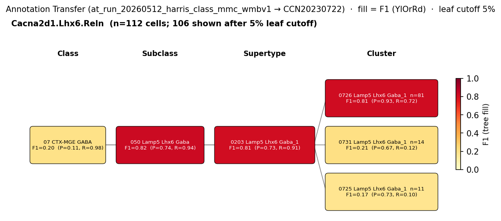

# Ivy cell (IvC) — WMBv1 (CCN20230722) Mapping Report
*2026-04-09 · Source: `kb/graphs/hippocampus/hippocampus_GABAergic_interneurons.yaml`*

---

## Introduction

Ivy cells are nNOS-expressing GABAergic interneurons of the hippocampal CA1
field, with somata canonically located in or adjacent to stratum pyramidale.
They are one of the most representative CA1 interneuron types and have been
argued to share a developmental, electrophysiological, morphological, and
neurochemical profile with nNOS+ neurogliaform cells (NGFC.M / NGC), with
laminar position the principal distinguishing feature [1][2]. Mapping the
classical Ivy cell to a WMBv1 atlas type is therefore important both as a
test of whether the atlas resolves CA1 stratum-pyramidale Lamp5/Lhx6
interneurons and as a way to clarify the Ivy–NGC relationship
transcriptomically.

### Classical type table

| Property | Value | References |
|---|---|---|
| Soma location | pyramidal layer of CA1 [UBERON:0014548] | [1] |
| NT | GABAergic | — |
| Defining markers | Nos1, Npy, Lamp5 | [1][2][3][4][5] |
| Negative markers | Pvalb, Sst, Calb2 | [2] |
| Neuropeptides | Npy | [2] |

<details>
<summary>Details — source evidence for classical type properties</summary>

- **Soma location:** classical anatomical description of CA1 pyramidal-layer
  Ivy cells · [1]
  > This mouse line allows for a large sampling from diverse interneuron subtypes in the CA1 pyramidal layer, including the most representative ones (Bezaire et al., 2013), the PV-expressing basket and bistratified cells (Klausberger et al., 2008), the NOS- expressing ivy cells (14381729) and two types of interneuron-selective interneurons (ISI 1 and 3) that express calretinin (Klausberger et al., 2008)(Topolnik et al., 2022)
  > — Bocchio et al. 2024, Classical Functional and Morphological Interneuron Types · [1] <!-- quote_key: 262127573_d140faf4 -->
- **Nos1 / Npy markers, neuropeptide, and negative-marker profile:** co-expression
  with morphological/electrophysiological characterisation of IvCs and NGCs · [2]
  > IvCs and NGCs have been argued to represent distinct interneuron subtypes (52852755), despite the rich similarity between these cell types, including coexpression of NPY with nNOS, dense axonal arbors, and slow pyramidal cell inhibition. We found that both of these interneurons exhibit a LS phenotype and fail to express other classical interneuron markers such as PV, SOM, or CR.
  > — Tricoire et al. 2010, Classical Functional and Morphological Interneuron Types · [2] <!-- quote_key: 2405079_6850b924 -->

</details>

### Cell Ontology mapping

No Cell Ontology term currently covers this type — candidate for a new CL term.

---

## Results

One MODERATE candidate atlas supertype was assessed; SUPT_0203 (0203 Lamp5 Lhx6 Gaba_1) is the primary mapping at MODERATE confidence, supported by two independent annotation-transfer runs and a confirmed Lamp5/Lhx6/Nos1/Npy marker profile, with a soma-location discrepancy (no CA1 stratum pyramidale representation in the supertype anatomy distribution) as the main caveat.

**Annotation-transfer overview figures (run-level, filtered)**


*F1 across taxonomy levels for the Lamp5 source group from Yao 2021 (GSE185862) relevant to Ivy cell. The panel row is the Lamp5 source-cell group; nodes are coloured by F1 with precision (P) and recall (R) shown inline. F1 ≥ 0.5 at a level indicates a clean mapping at that resolution.*



*F1 across taxonomy levels for the Cacna2d1.Lhx6.Reln source group (Harris 2018 published Class label for the Lamp5+/Lhx6+/Reln+ CA1 inhibitory cluster) relevant to Ivy cell. F1 ≥ 0.5 at a level indicates a clean mapping at that resolution.*

Both source groups land on the same Lamp5 Lhx6 Gaba subclass / SUPT_0203 supertype with F1 ≈ 0.81–0.90 at subclass and supertype levels, giving independent two-dataset corroboration of the Lamp5+/Lhx6+ identity for the Ivy cell candidate atlas type.

### Mapping candidates

**Candidate overview**

| Rank | WMBv1 cluster | Supertype | Cells (10x) | Confidence | Key property alignment | Verdict |
|---|---|---|---|---|---|---|
| 1 | 0203 Lamp5 Lhx6 Gaba_1 [CS20230722_SUPT_0203] | — | 3301 | 🟡 MODERATE | Lamp5/Nos1/Npy CONSISTENT · location DISCORDANT | Best candidate |

Total: 1 edge (PARTIAL_OVERLAP).

**Table 1 — Property comparison (SUPT_0203)**

| Property | Classical | Supertype | Best cluster | Alignment |
|---|---|---|---|---|
| Soma location | pyramidal layer of CA1 [UBERON:0014548] | DG mol layer (263), CA3 SO (179), CA3 SR (235) — no CA1 SP | not assessed | DISCORDANT |
| NT type | GABAergic | GABA | not assessed | CONSISTENT |
| Lamp5 expression | defining marker | Lamp5 — DEFINING_SCOPED; precomputed mean 4.40 | not assessed | CONSISTENT |
| Nos1 expression | defining marker (IHC + transcript) | not listed as marker; precomputed mean 7.79 | not assessed | CONSISTENT |
| Npy expression | defining marker (IHC) | not listed as marker; precomputed mean 4.62 | not assessed | CONSISTENT |
| Npy neuropeptide | present | not listed in supertype neuropeptide list; precomputed mean 4.62 | not assessed | CONSISTENT |
| Sst (negative) | negative marker | not listed; precomputed mean 1.52 | not assessed | CONSISTENT |
| Pvalb (negative) | negative marker | not listed; precomputed mean 0.43 | not assessed | CONSISTENT |
| Calb2 (negative) | negative marker | not assessed from metadata; precomputed mean 0.37 | not assessed | CONSISTENT |
| Sex ratio | not documented | not available | not assessed | NOT_ASSESSED |

**Table 2 — Evidence support (SUPT_0203)**

| Evidence | Type | Supports | Headline | Source |
|---|---|---|---|---|
| Lamp5/Lhx6 supertype markers | Atlas metadata | PARTIAL | Lamp5, Lhx6 DEFINING_SCOPED; CA3/DG anatomy, no CA1 SP | atlas-internal |
| Atlas precomputed expression | Atlas metadata | SUPPORT | Nos1=7.79, Npy=4.62, Lamp5=4.40; Pvalb=0.43, Sst=1.52, Calb2=0.37 | atlas-internal |
| Yao 2021 Lamp5 → SUPT_0203 | Annotation transfer | SUPPORT | F1=0.90 supertype; 711/868 cells | atlas-internal |
| Harris 2018 Cacna2d1.Lhx6.Reln → SUPT_0203 | Annotation transfer | SUPPORT | F1=0.81 supertype; 246 cells | atlas-internal |

*(Child-cluster breakdown not assessed — see proposed experiments.)*

### 0203 Lamp5 Lhx6 Gaba_1 [CS20230722_SUPT_0203] · 🟡 MODERATE

**Supporting evidence**

- Atlas metadata: Lamp5 and Lhx6 are listed as DEFINING_SCOPED markers of SUPT_0203, consistent with the classical Ivy cell profile (Lamp5+/Lhx6+ MGE-derived GABAergic interneuron).
- Atlas precomputed expression (scRNA-seq) confirms all three defining markers (Nos1=7.79, Npy=4.62, Lamp5=4.40) and all three negative markers absent (Pvalb=0.43, Sst=1.52, Calb2=0.37) — a strong quantitative match for the Ivy cell marker signature.
- Yao 2021 (GEO:GSE185862) SSv4 Lamp5 subclass (n=868 hippocampal cells) maps overwhelmingly onto SUPT_0203 at supertype level (F1=0.90; 711/868 cells; purity=0.989), and onto SUBC_050 Lamp5 Lhx6 Gaba at subclass level (F1=0.90). Ivy cells are the predominant Lamp5+/Lhx6+ hippocampal interneuron type, making this a specific hit.
- Harris 2018 (GEO:GSE99888) Class Cacna2d1.Lhx6.Reln (Lamp5+/Lhx6+/Reln+ CA1 inhibitory cluster) maps predominantly to Lamp5 Lhx6 Gaba subclass (F1=0.83) and SUPT_0203 at supertype level (F1=0.81) — independent second-dataset corroboration.

**Marker evidence provenance**

- **Nos1 (defining):** primary transcript- and protein-level support from Tricoire et al. 2010 [2] (scRT-PCR and immunohistochemistry), with additional support from Bocchio 2024 [1], Tzilivaki 2023 [3], Kim 2025 [4], and Wierenga 2010 [5]. Atlas precomputed mean Nos1=7.79 is high and consistent.
- **Npy (defining + neuropeptide):** classical immunohistochemistry and transcript support from Tricoire et al. 2010 [2]. Atlas precomputed mean Npy=4.62 confirms.
- **Lamp5 (defining):** no specific citation on the classical node; supported here by atlas precomputed mean Lamp5=4.40 and by the supertype's DEFINING_SCOPED Lamp5 annotation. A targeted literature search to attach a primary Lamp5/Ivy citation would strengthen this property.
- **Negative markers (Pvalb, Sst, Calb2):** Tricoire et al. 2010 [2] reports IvCs and NGCs "fail to express other classical interneuron markers such as PV, SOM, or CR". Atlas precomputed means (0.43, 1.52, 0.37) are all low/absent — CONSISTENT.

**Concerns**

- Soma location DISCORDANT: classical Ivy cell soma is in or near CA1 stratum pyramidale, but SUPT_0203 anatomy shows DG molecular layer (263 cells), CA3 stratum oriens (179), and CA3 stratum radiatum (235) with no CA1 stratum pyramidale representation. *(note: CA3 strata and DG mol layer are adjacent hippocampal subfields to CA1 — this is not a distant-region discordance, but the absence of any CA1 SP cells in the supertype is unexpected and could reflect either undersampling of CA1 SP Lamp5/Lhx6 cells in the atlas dataset or a split of the CA1 Ivy population across additional supertypes.)*
- Ivy cells and nNOS+ NGCs (NGFC.M) are reported to share completely overlapping developmental, electrophysiological, morphological, and neurochemical properties (Tricoire 2010 [2]), suggesting they may constitute a single interneuron subtype distinguished only by laminar position. The companion NGC → SUPT_0203 edge appears to land on the same atlas supertype with identical AT F1 — see Discussion.
- Cluster-level (rank 0) resolution was not assessed — the mapping is at supertype only.

**What would upgrade confidence**

- Cluster-level (rank 0) annotation-transfer or marker-based assessment to identify whether a CA1 SP Lamp5/Lhx6 child cluster of SUPT_0203 captures hippocampal Ivy cells specifically (resolves: are CA3-enriched SUPT_0203 cells Ivy cells, NGCs, or a distinct type?).
- Spatial validation (MERFISH/ISH) of Nos1+/Lamp5+/Lhx6+ cells in CA1 stratum pyramidale to test whether the atlas undersamples this population.
- Targeted literature search for a primary Lamp5 / Ivy citation to strengthen the marker evidence chain.
- Cross-panel ephys/morphology comparison to the companion NGC mapping — current pool-candidate analysis shows AT alone does not distinguish Ivy from NGC at SUPT_0203 (both F1=0.90).

---

### Methods

<details>
<summary>Data sources, analyses, and reproducibility receipts</summary>

**Classical type definition.** Ivy cells (definition_basis: CLASSICAL_MULTIMODAL) are defined as GABAergic CA1 interneurons with somata in pyramidal layer of CA1 [UBERON:0014548] [1], expressing Nos1 (nNOS), Npy, and Lamp5 [1][2][3][4][5], and lacking Pvalb, Sst, and Calb2 [2].

**Atlas mapping query.** Candidate atlas clusters were retrieved from the WMBv1 taxonomy (CCN20230722) at ranks 0 (cluster) and 1 (supertype) using metadata-based scoring (region match, NT type, defining markers, sex bias when applicable). Full scoring rules: `workflows/map-cell-type.md`.

**Property alignment.** Each defining property of the classical type was compared to the corresponding atlas-side value via the `property_comparisons` schema, with alignments graded CONSISTENT / APPROXIMATE / DISCORDANT / NOT_ASSESSED. Atlas-side numerical values came from precomputed expression on the cluster (cluster.yaml in the taxonomy reference store) and from MERFISH spatial registration for soma location.

**Annotation transfer.**

Run 1 — Yao 2021 (GSE185862) SSv4 Lamp5 → WMBv1:

| Field | Value |
|---|---|
| Source dataset | GEO:GSE185862 (Lamp5) |
| Source species | NCBITaxon:10090 |
| Target atlas | WMBv1 (CCN20230722) |
| Method | MapMyCells local (cell_type_mapper, default parameters, raw normalization, 100 bootstrap iterations) |
| Tool version | cell_type_mapper |
| Bootstrap threshold | 0.0 |
| n cells | 6398 (filtered to 6398) |
| Run record | [`kb/annotation_transfer_runs/at_run_20260508_yao2021_hpf_ssv4_mmc_wmbv1/manifest.yaml`](../../kb/annotation_transfer_runs/at_run_20260508_yao2021_hpf_ssv4_mmc_wmbv1/manifest.yaml) |
| Script (external) | README.md |
| Code reference | [https://github.com/AllenInstitute/cell_type_mapper](https://github.com/AllenInstitute/cell_type_mapper) |
| F1 matrix | [`f1_scores_best.csv`](../../kb/annotation_transfer_runs/at_run_20260508_yao2021_hpf_ssv4_mmc_wmbv1/f1_scores_best.csv) |

Run 2 — Harris 2018 (GSE99888) published Class labels → WMBv1:

| Field | Value |
|---|---|
| Source dataset | GEO:GSE99888 (Cacna2d1.Lhx6.Reln) |
| Source species | NCBITaxon:10090 |
| Target atlas | WMBv1 (CCN20230722; SHA-256: b21ca985) |
| Method | MapMyCells (cell_type_mapper v1.7.1, default parameters, raw normalization, bootstrap_iteration=100) |
| Tool version | cell_type_mapper v1.7.1 |
| Bootstrap threshold | 0.8 |
| n cells | 3663 (filtered to 3663) |
| Run record | [`kb/annotation_transfer_runs/at_run_20260512_harris_class_mmc_wmbv1/manifest.yaml`](../../kb/annotation_transfer_runs/at_run_20260512_harris_class_mmc_wmbv1/manifest.yaml) |
| Script (external) | ../at_run_20260506_harris_chamberland_mmc_wmbv1/README.md |
| Code reference | [https://github.com/AllenInstitute/cell_type_mapper](https://github.com/AllenInstitute/cell_type_mapper) |
| F1 matrix | [`f1_matrix_harris_class.csv`](../../kb/annotation_transfer_runs/at_run_20260512_harris_class_mmc_wmbv1/f1_matrix_harris_class.csv) |
| Caveats | This run record scores Harris 2018's published Class labels against WMBv1; it shares the underlying MapMyCells output with the companion Chamberland-subfamily run. |

**Anti-hallucination.** All citations, atlas accessions, ontology CURIEs, and verbatim literature quotes in this report are validated against the evidencell knowledge base at write time. Authored-prose evidence narratives are validated against their source `evidence_items[*].explanation` fields. The pre-write hook rejects any unresolvable identifier or unattributed blockquote. Specific mapping limitations and caveats are documented per-candidate in the Discussion section.

*Generated by evidencell `d121f84` at 2026-05-13T15:00:59+00:00 from [kb/graphs/hippocampus/hippocampus_GABAergic_interneurons.yaml](kb/graphs/hippocampus/hippocampus_GABAergic_interneurons.yaml).*

**Evidence base table**

| Edge ID | Evidence types | Supports | Source |
| --- | --- | --- | --- |
| edge_ivy_cell_hippocampus_to_CS20230722_SUPT_0203 | ATLAS_METADATA ×2; ANNOTATION_TRANSFER ×2 | PARTIAL; SUPPORT; SUPPORT; SUPPORT | atlas-internal |

</details>

---

## Discussion

**Primary mapping:** Ivy cell (IvC) → 0203 Lamp5 Lhx6 Gaba_1 [CS20230722_SUPT_0203] at MODERATE confidence. Key support: atlas precomputed-stats marker concordance (Nos1/Npy/Lamp5 high, Pvalb/Sst/Calb2 low) plus two independent annotation-transfer hits (Yao 2021 Lamp5 F1=0.90; Harris 2018 Cacna2d1.Lhx6.Reln F1=0.81 at supertype). Key caveats: soma-location discordance (no CA1 stratum pyramidale in SUPT_0203 anatomy distribution) and likely overlap with the companion nNOS+ neurogliaform cell (NGFC.M) mapping at the same supertype.

No Cell Ontology term currently assigned. Candidate for a CL new term request — there is no specific CL class for hippocampal Ivy cells.

### Proposed experiments and follow-ups

Two independent annotation-transfer runs (Yao 2021 Lamp5 and Harris 2018 Cacna2d1.Lhx6.Reln) have already established the Lamp5/Lhx6 supertype identity at F1 ≈ 0.81–0.90. The remaining gap is cluster-level resolution within SUPT_0203 and resolution of the Ivy / NGC laminar split.

- **What**: Cluster-level annotation transfer or marker-based child-cluster assessment within SUPT_0203.
  **Target**: F1 ≥ 0.5 at CLUSTER (rank 0) for at least one CA1 SP Nos1+/Lamp5+/Lhx6+ child cluster.
  **Expected output**: AnnotationTransferEvidence at cluster resolution; refined MappingEdge to a specific cluster.
  **Resolves**: open questions 1 and 2 (CA3-enriched vs CA1 SP Lamp5 Lhx6 identity; Ivy / NGC separation).

- **What**: Spatial validation (MERFISH / smFISH) of Nos1+/Lamp5+/Lhx6+ cells in CA1 stratum pyramidale vs CA3 strata.
  **Target**: Confirm or refute the absence of CA1 SP Lamp5/Lhx6 cells in the atlas dataset.
  **Expected output**: AnatomicalDistributionEvidence; would either upgrade location alignment to APPROXIMATE/CONSISTENT or confirm a structural gap in the atlas sampling.
  **Resolves**: location DISCORDANT caveat.

- **What**: Cross-panel ephys / morphology comparison to the companion NGC mapping (patch-seq or biocytin-fill morphology on CA1 SP vs SLM Nos1+/Lamp5+/Lhx6+ cells).
  **Target**: Test whether Ivy and NGC can be distinguished on panels beyond AT and markers/anatomy.
  **Expected output**: ElectrophysiologyEvidence / MorphologyEvidence; informs whether the two classical types should be unified.
  **Resolves**: open question 3 (Ivy vs NGC distinguishability beyond AT).

- **What**: Targeted literature search for a primary Lamp5 / Ivy citation.
  **Target**: a primary study testing Lamp5 expression in morphology-confirmed Ivy cells.
  **Expected output**: additional LiteratureEvidence on the Lamp5 marker.
  **Resolves**: marker provenance weakness for Lamp5.

### Open questions

1. Are the CA3-enriched Lamp5 Lhx6 cells in SUPT_0203 Ivy cells, NGCs, or a distinct type?
2. Is there a CA1 SP Lamp5 Lhx6 cluster capturing hippocampal Ivy cells at the cluster level?
3. Do ephys/morphology panels distinguish Ivy from nNOS+ NGC (NGFC.M), or are they fully indistinguishable as Tricoire 2010 [2] suggests?

---

## References

| # | Citation | PMID | Used for |
|---|---|---|---|
| [1] | Bocchio et al. 2024 | [39401246](https://pubmed.ncbi.nlm.nih.gov/39401246) | soma location |
| [2] | Tricoire et al. 2010 | [20147544](https://pubmed.ncbi.nlm.nih.gov/20147544) | Nos1 marker |
| [3] | Tzilivaki et al. 2023 | [37467748](https://pubmed.ncbi.nlm.nih.gov/37467748) | Nos1 marker |
| [4] | Kim et al. 2025 | [41473287](https://pubmed.ncbi.nlm.nih.gov/41473287) | Nos1 marker |
| [5] | Wierenga et al. 2010 | [21209836](https://pubmed.ncbi.nlm.nih.gov/21209836) | Nos1 marker |

<!-- verdict-block-start: edge_ivy_cell_hippocampus_to_CS20230722_SUPT_0203 -->
```yaml
verdict:
  confidence: MODERATE
  confidence_score: 0.65
  rationale: >
    Two independent AT runs converge on CS20230722_SUPT_0203 (Yao 2021 Lamp5
    F1=0.90 in at_run_20260508_yao2021_hpf_ssv4_mmc_wmbv1; Harris 2018
    Cacna2d1.Lhx6.Reln F1=0.81 in at_run_20260512_harris_class_mmc_wmbv1) and
    atlas precomputed scRNA-seq stats show 7 of 7 markers CONSISTENT
    (Nos1=7.79, Npy=4.62, Lamp5=4.40 positives; Pvalb=0.43, Sst=1.52,
    Calb2=0.37 negatives across the marker_-prefixed property
    comparisons), with Lamp5/Lhx6 DEFINING_SCOPED on the supertype
    and immunohistochemistry support for Nos1/Npy from Tricoire 2010.
    CA1 stratum pyramidale soma is DISCORDANT with SUPT_0203 anatomy
    (DG/CA3 only) and cluster-level (rank 0) was not assessed, capping
    confidence at MODERATE.
  reconciliation_note: >
    AT alone does not distinguish ivy_cell_hippocampus from
    neurogliaform_cell_hippocampus at CS20230722_SUPT_0203 (both groups
    F1=0.90 at SUPERTYPE and SUBCLASS; pool-candidate panels assessed were
    anat, markers, nt — ephys, morphology, and developmental panels were
    not assessed in the available structured evidence). Cross-panel
    unification call deferred pending ephys/morphology evidence.
  unresolved_questions:
    - "Do ephys/morphology panels distinguish ivy_cell_hippocampus from neurogliaform_cell_hippocampus at CS20230722_SUPT_0203, or are they indistinguishable across all assessable panels (Tricoire 2010 prediction)?"
```
<!-- verdict-block-end -->
