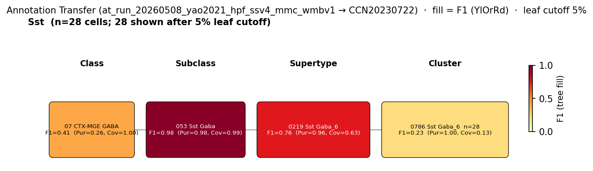

# Low-threshold high-Ih (LTH) cell — WMBv1 (CCN20230722) Mapping Report
*2026-04-09 · Source: `kb/graphs/hippocampus/hippocampus_GABAergic_interneurons.yaml`*

---

## Introduction

The low-threshold high-Ih (LTH) cell is a putative CA1 stratum oriens interneuron isolated by physiological clustering in SST-Cre Ai14 mice: low rheobase combined with a large Ih sag distinguishes it from co-located SST+ populations such as OLM and oriens–oriens cells [1]. Whether LTH constitutes a distinct transcriptomic type — as opposed to a physiological state or sub-population within an existing Sst+ T-type — is the central open question this mapping confronts.

### Classical type table

| Property | Value | References |
|---|---|---|
| Soma location | CA1 stratum oriens [UBERON:0014552] | [1] |
| NT | GABAergic | — |
| Markers | Sst (defining) | [1] |

<details>
<summary>Details — source evidence for classical type properties</summary>

- **Soma location:** SST-Cre Ai14 patch recording in CA1 stratum oriens · [1]
- **Sst (defining marker):** SST-Cre Ai14 targeting in CA1 stratum oriens · [1]

</details>

### Cell Ontology mapping

No Cell Ontology term currently covers this type — candidate for a new CL term.

---

## Results

Among ten candidate WMBv1 targets, none meets a high-confidence threshold: the only direct experimental anchor available — annotation transfer of a Yao 2021 SSv4 "Sst" cohort — lands on 0219 Sst Gaba_6 [CS20230722_SUPT_0219] at F1=0.76, but that supertype's atlas-side soma distribution is CA3-enriched and inconsistent with the CA1 stratum oriens definition of LTH (see figure). The Stage-A cohort leader on anatomical+marker criteria is the CA1-SO-resident supertype 0216 Sst Gaba_3 [CS20230722_SUPT_0216] together with its child 0768 Sst Gaba_3 [CS20230722_CLUS_0768] (region_fraction_100um 0.539 and 0.818 respectively); both lack any LTH-specific source label and so represent biological possibilities rather than tested assignments.



*F1 across taxonomy levels for the single source group relevant to the LTH cell — the Yao 2021 (GSE185862) SMART-Seq v4 "Sst" subclass cohort (n=273 hippocampal cells). Coverage = fraction of source-group cells landing on this target; Purity = fraction of this target's cells from the source group. With a single source group present, Purity is near-1.0 at every target and Coverage discriminates. F1 ≥ 0.5 at a level indicates a clean mapping at that resolution. The Sst cohort here aggregates multiple Sst-interneuron subtypes (OLM, bistratified, hippocampo-septal, oriens–oriens, others); the supertype-level call on 0219 Sst Gaba_6 [CS20230722_SUPT_0219] reflects the dominant Sst population in that pool, not an LTH-specific signal.*

### 0216 Sst Gaba_3 [CS20230722_SUPT_0216] · 🔴 LOW

#### Property alignment

| Property | Classical | Supertype | Best cluster | Alignment |
|---|---|---|---|---|
| Soma location | CA1 stratum oriens [UBERON:0014552] | Hippocampal formation [MBA:1089] count_100um=2145; Field CA1 [MBA:382] count_100um=1559; Field CA1, stratum oriens [MBA:399] count_100um=1463 | 0768 Sst Gaba_3 [CS20230722_CLUS_0768]: stratum oriens count_100um=261 | CONSISTENT |
| NT type | GABAergic | not asserted | GABA | SUPT: NOT_ASSESSED; CLUS: CONSISTENT |
| Sst expression | defining marker | Sst: 11.44; cohort percentile 0.905; child-coverage 1.000 | Sst: 12.70; cohort percentile 0.992 | CONSISTENT |

*(4 of 5 surveyed Sst Gaba_3 child clusters are concordant on CA1 stratum oriens location and high Sst expression — CLUS_0768 (region_fraction_100um=0.818), CLUS_0772 (0.706), CLUS_0773 (0.648), CLUS_0770 (0.506); CLUS_0767 (0.578) shows mixed CA1-SO and lateral-forebrain anatomy. Best match: CLUS_0768.)*

#### Evidence support

| Evidence | Type | Supports | Headline | Source |
|---|---|---|---|---|
| Atlas precomputed expression | Atlas metadata | PARTIAL | region_fraction_100um=0.539 | atlas-internal |

**Supporting evidence:**

- Atlas soma distribution places the bulk of 0216 Sst Gaba_3 in CA1 stratum oriens (count_100um=1463), matching the classical LTH soma location [1].
- Sst transcript at supertype-mean 11.44 (cohort percentile 0.905) with child-cluster coverage 1.000 confirms the SST-Cre transgene basis for LTH cell isolation.
- *(note: Stage A discovery placed CS20230722_SUPT_0216 as the rank-1 supertype in the 50-member CA1 stratum oriens / GABAergic cohort with score 4 vs next-best 3; broader-than-1:1 cohort dominance.)*

**Marker evidence provenance:**

- **Sst:** atlas-side category DEFINING is absent for CS20230722_SUPT_0216 itself; child cluster CS20230722_CLUS_0768 carries atlas category NEUROPEPTIDE. Classical-side citation for Sst as the LTH defining marker is a single physiological-clustering study [1] using the SST-Cre Ai14 driver — Sst presence in the candidate is by construction and supports SST-Cre labelling but does not distinguish LTH from other Sst+ CA1-SO subtypes.

**Concerns:**

- LTH is defined exclusively by physiological clustering — strong Ih sag and low rheobase — without any transcriptomic or morphological feature that anchors it to 0216 Sst Gaba_3 specifically rather than to any other CA1-SO-resident Sst supertype (caveat: ELECTROPHYSIOLOGY_ONLY_DEFINITION; SINGLE_STUDY).
- This supertype is shared with the OLM mapping (the canonical OLM target in this graph is also CS20230722_SUPT_0216); if LTH and OLM share a T-type the mapping would be 1:n with parallel classical types, not 1:1 (caveat: AMBIGUOUS_MAPPING).
- No annotation transfer evidence pins LTH to 0216 Sst Gaba_3 directly — the AT cohort available aggregates many Sst subtypes and lands at supertype level on 0219 Sst Gaba_6 [CS20230722_SUPT_0219], not on 0216 Sst Gaba_3 [CS20230722_SUPT_0216].

**What would upgrade confidence:**

- Patch-seq on Ih-sag-classified CA1-SO interneurons (target F1 ≥ 0.75 at SUPERTYPE level) — adds AnnotationTransferEvidence with an LTH-specific source label.
- Targeted literature trawl for transcriptomic correlates of high-Ih CA1-SO interneurons (e.g. Hcn1/Hcn2 expression profiles) to test whether LTH and OLM separate at gene-expression level within 0216 Sst Gaba_3.

### 0768 Sst Gaba_3 [CS20230722_CLUS_0768] · 🔴 LOW

#### Property alignment

| Property | Classical | Atlas value | Alignment |
|---|---|---|---|
| Soma location | CA1 stratum oriens [UBERON:0014552] | Hippocampal formation [MBA:1089] count_100um=296; Field CA1 [MBA:382] count_100um=273; Field CA1, stratum oriens [MBA:399] count_100um=261 | CONSISTENT |
| NT type | GABAergic | GABA | CONSISTENT |
| Sst expression | defining marker | Sst: 12.70; cohort percentile 0.992 | CONSISTENT |

#### Evidence support

| Evidence | Type | Supports | Headline | Source |
|---|---|---|---|---|
| Atlas precomputed expression | Atlas metadata | PARTIAL | region_fraction_100um=0.818 | atlas-internal |

**Supporting evidence:**

- 88% of 0768 Sst Gaba_3 cells localise within 100µm of CA1 stratum oriens (count_100um=261 of 296 hippocampal-formation cells); this is the highest in-region fraction of any Sst Gaba_3 child cluster surveyed [1].
- Sst transcript at 12.70 (cohort percentile 0.992) is in the top 1% of the cohort, consistent with strong SST-Cre labelling of this population [1].
- *(note: Stage A discovery placed CS20230722_CLUS_0768 at rank 1 in the 50-member CA1 stratum oriens / GABAergic cluster cohort with score 5; the highest-anchored single cluster in the cohort.)*

**Concerns:**

- This same cluster is the canonical AT-best child for the OLM mapping elsewhere in the graph; without an LTH-specific transgenic source there is no transcriptomic feature that separates LTH from OLM at the 0768 Sst Gaba_3 [CS20230722_CLUS_0768] level (caveat: AMBIGUOUS_MAPPING).
- No annotation transfer evidence is available for the LTH cell specifically; cluster-level assignment is supported only by cohort-relative location/marker convergence.

**What would upgrade confidence:**

- A patch-seq study targeting Ih-sag-positive low-rheobase CA1-SO interneurons (target F1 ≥ 0.80 at CLUSTER level) — adds AnnotationTransferEvidence with morphology- and physiology-confirmed source cells.
- Direct comparison of LTH and OLM expression signatures within 0216 Sst Gaba_3 to test 1:1 vs n:1 mapping (resolves AMBIGUOUS_MAPPING caveat).

### 0219 Sst Gaba_6 [CS20230722_SUPT_0219] · ⚪ UNCERTAIN

#### Property alignment

| Property | Classical | Atlas value | Alignment |
|---|---|---|---|
| Soma location | CA1 stratum oriens [UBERON:0014552] | Hippocampal formation [MBA:1089] count_100um=1350; Field CA3 [MBA:463] count_100um=1068; Field CA3, pyramidal layer [MBA:495] count_100um=799 | APPROXIMATE |
| NT type | GABAergic | not asserted | NOT_ASSESSED |
| Sst expression | defining marker | Sst: 10.17; cohort percentile 0.778; child-coverage 1.000 | CONSISTENT |

#### Evidence support

| Evidence | Type | Supports | Headline | Source |
|---|---|---|---|---|
| Atlas metadata + region scatter | Atlas metadata | WEAK | region_fraction_100um=0.132 | atlas-internal |
| MapMyCells AT (Yao 2021 Sst cohort) | Annotation transfer | PARTIAL | F1=0.76 (supertype level) | atlas-internal |

**Supporting evidence:**

- Annotation transfer of the Yao 2021 hippocampal-formation SSv4 Sst subclass (n=273 cells) lands on 0219 Sst Gaba_6 [CS20230722_SUPT_0219] as the dominant supertype target (F1=0.76; 161 of 273 cells assigned at supertype; purity 0.96, coverage 0.63; `at_run_20260508_yao2021_hpf_ssv4_mmc_wmbv1`). At subclass level the same cohort maps near-perfectly onto 053 Sst Gaba subclass (F1=0.98).
- Sst transcript at 10.17 (cohort percentile 0.778) is consistent with SST-Cre labelling.

**Concerns:**

- The AT call is on a heterogeneous source label: the Yao 2021 SSv4 "Sst" subclass aggregates OLM, bistratified, hippocampo-septal, oriens–oriens and other Sst+ subtypes (caveat: AMBIGUOUS_MAPPING). The supertype-level convergence on 0219 Sst Gaba_6 [CS20230722_SUPT_0219] reflects the dominant Sst population in the Yao 2021 hippocampal sample, not an LTH-specific signal.
- 0219 Sst Gaba_6 is CA3-enriched (CA3 count_100um=1068; CA3 pyramidal layer count_100um=799) and shows only 13% of cells within 100µm of CA1 stratum oriens (region_fraction_100um=0.132); the classical LTH cell was characterised exclusively in CA1 stratum oriens [1] (caveat: DISCORDANT_ANATOMY).
- LTH is defined by a single physiological-clustering study using SST-Cre Ai14 labelling, with no morphological reconstruction or transcriptomic anchor (caveat: ELECTROPHYSIOLOGY_ONLY_DEFINITION; SINGLE_STUDY).
- The pool-candidate scan finds LTH is indistinguishable from bistratified, hippocampo-septal, OLM, oriens–oriens, P-LM, and R-LM source labels on the marker and NT panels available; anatomy is the only panel that can separate them in current evidence — but no LTH-specific source label exists to test that separation directly.

**What would upgrade confidence:**

- A patch-seq study targeting Ih-sag-positive CA1-SO interneurons (target F1 ≥ 0.75 at SUPERTYPE level) — would add AnnotationTransferEvidence with an LTH-specific source label and resolve whether LTH maps to 0219 Sst Gaba_6 (the AT-anchored supertype) or to 0216 Sst Gaba_3 (the anatomically-anchored supertype).
- Re-analysis of the Hewitt et al. 2021 dataset for transcript-level markers, if RNA was collected from the patched cells, to disambiguate the supertype assignment.

<details>
<summary>Candidates audited (full top-K)</summary>

| WMBv1 target | Supertype | Cells (10x) | Confidence | Key evidence | Verdict |
|---|---|---:|---|---|---|
| `0216 Sst Gaba_3 [CS20230722_SUPT_0216]` | — | 2004 | 🔴 LOW | CA1-SO concordant; no AT anchor | Primary (anatomy) |
| `0768 Sst Gaba_3 [CS20230722_CLUS_0768]` | 0216 Sst Gaba_3 | 66 | 🔴 LOW | region_fraction_100um=0.818; no LTH-specific AT | Secondary |
| `0219 Sst Gaba_6 [CS20230722_SUPT_0219]` | — | 725 | ⚪ UNCERTAIN | Sst-cohort AT F1=0.76; anatomy CA3-enriched | AT-anchored alternative |
| `0772 Sst Gaba_3 [CS20230722_CLUS_0772]` | 0216 Sst Gaba_3 | 190 | 🔴 LOW | CA1-SO concordant (rf100=0.706) | Eliminated (no LTH-specific evidence) |
| `0767 Sst Gaba_3 [CS20230722_CLUS_0767]` | 0216 Sst Gaba_3 | 104 | 🔴 LOW | Mixed CA1-SO + lateral forebrain | Eliminated (mixed anatomy) |
| `0770 Sst Gaba_3 [CS20230722_CLUS_0770]` | 0216 Sst Gaba_3 | 404 | 🔴 LOW | CA1-SO concordant (rf100=0.506) | Eliminated (no LTH-specific evidence) |
| `0773 Sst Gaba_3 [CS20230722_CLUS_0773]` | 0216 Sst Gaba_3 | 156 | 🔴 LOW | CA1-SO concordant (rf100=0.648) | Eliminated (no LTH-specific evidence) |
| `0241 Sst Chodl Gaba_4 [CS20230722_SUPT_0241]` | — | 2905 | 🔴 LOW | Sst+ but isocortex-enriched | Eliminated (wrong region) |
| `0226 Sst Gaba_13 [CS20230722_SUPT_0226]` | — | 4064 | 🔴 LOW | Sst+ but isocortex-enriched | Eliminated (wrong region) |
| `1164 Astro-TE NN_4 [CS20230722_SUPT_1164]` | — | 982 | 🔴 LOW | Astrocyte; Sst at cohort_pct 0.333 | Eliminated (wrong cell class) |

</details>

---

### Methods

<details>
<summary>Data sources, analyses, and reproducibility receipts</summary>

**Classical type definition.** The LTH cell is defined as a CA1 stratum oriens [UBERON:0014552] GABAergic interneuron with the Sst defining marker; its distinguishing feature is a low-threshold, high-Ih physiological signature isolated by unsupervised clustering of patch-recorded SST-Cre Ai14 cells [1]. Definition basis: CLASSICAL_MULTIMODAL — but in practice anchored to a single physiological-clustering study with no orthogonal transcriptomic or morphological confirmation.

**Atlas mapping query.** Candidate atlas clusters were retrieved from the WMBv1 (CCN20230722) taxonomy at ranks 0 (cluster) and 1 (supertype) using metadata-based scoring (region match, NT type, defining markers, sex bias when applicable). Full scoring rules: `workflows/map-cell-type.md`.

**Property alignment.** Each defining property of the classical type was compared to the corresponding atlas-side value via the `property_comparisons` schema, with alignments graded CONSISTENT / APPROXIMATE / DISCORDANT / NOT_ASSESSED. Atlas-side numerical values came from precomputed expression on the cluster (cluster.yaml in the taxonomy reference store) and from MERFISH spatial registration for soma location.

**Annotation transfer.**

| Field | Value |
|---|---|
| Source dataset | GEO:GSE185862 (Sst subclass label) |
| Source species | NCBITaxon:10090 |
| Target atlas | WMBv1 (CCN20230722) |
| Method | MapMyCells local (cell_type_mapper, default parameters, raw normalization, 100 bootstrap iterations) |
| Tool version | cell_type_mapper |
| Bootstrap threshold | 0.0 |
| n cells | 6398 (filtered to 6398; 273 with hippocampal-formation Sst label used here) |
| Run record | [`kb/annotation_transfer_runs/at_run_20260508_yao2021_hpf_ssv4_mmc_wmbv1/manifest.yaml`](../../kb/annotation_transfer_runs/at_run_20260508_yao2021_hpf_ssv4_mmc_wmbv1/manifest.yaml) |
| Script (external) | README.md |
| Code reference | [https://github.com/AllenInstitute/cell_type_mapper](https://github.com/AllenInstitute/cell_type_mapper) |
| F1 matrix | [`f1_scores_best.csv`](../../kb/annotation_transfer_runs/at_run_20260508_yao2021_hpf_ssv4_mmc_wmbv1/f1_scores_best.csv) |
| Caveats | Source-label "Sst" aggregates multiple Sst+ interneuron subtypes; no LTH-specific source label available. |

**Anti-hallucination.** All citations, atlas accessions, ontology CURIEs, and verbatim literature quotes in this report are validated against the evidencell knowledge base at write time. Authored-prose evidence narratives are validated against their source `evidence_items[*].explanation` fields. The pre-write hook rejects any unresolvable identifier or unattributed blockquote. Specific mapping limitations and caveats are documented per-candidate in the Discussion section.

**Evidence base table.**

| Edge ID | Evidence types | Supports | Source |
| --- | --- | --- | --- |
| edge_lth_cell_hippocampus_to_CS20230722_SUPT_0216 | ATLAS_METADATA | PARTIAL | atlas-internal |
| edge_lth_cell_hippocampus_to_CS20230722_CLUS_0768 | ATLAS_METADATA | PARTIAL | atlas-internal |
| edge_lth_cell_hippocampus_to_CS20230722_SUPT_0219 | ATLAS_METADATA; ANNOTATION_TRANSFER | WEAK; PARTIAL | atlas-internal |
| edge_lth_cell_hippocampus_to_CS20230722_CLUS_0772 | ATLAS_METADATA | PARTIAL | atlas-internal |
| edge_lth_cell_hippocampus_to_CS20230722_CLUS_0767 | ATLAS_METADATA | PARTIAL | atlas-internal |
| edge_lth_cell_hippocampus_to_CS20230722_CLUS_0770 | ATLAS_METADATA | PARTIAL | atlas-internal |
| edge_lth_cell_hippocampus_to_CS20230722_CLUS_0773 | ATLAS_METADATA | PARTIAL | atlas-internal |
| edge_lth_cell_hippocampus_to_CS20230722_SUPT_0241 | ATLAS_METADATA | PARTIAL | atlas-internal |
| edge_lth_cell_hippocampus_to_CS20230722_SUPT_0226 | ATLAS_METADATA | PARTIAL | atlas-internal |
| edge_lth_cell_hippocampus_to_CS20230722_SUPT_1164 | ATLAS_METADATA | PARTIAL | atlas-internal |

*Generated by evidencell `25c2b32` at 2026-06-08T18:37:44+00:00 from [kb/graphs/hippocampus/hippocampus_GABAergic_interneurons.yaml](kb/graphs/hippocampus/hippocampus_GABAergic_interneurons.yaml).*

</details>

---

## Discussion

**Primary mapping:** Low-threshold high-Ih (LTH) cell → 0216 Sst Gaba_3 [CS20230722_SUPT_0216] at LOW confidence on anatomical and marker grounds; 0768 Sst Gaba_3 [CS20230722_CLUS_0768] is the best child cluster within that supertype. The only experimental anchor in evidence — annotation transfer of the Yao 2021 SSv4 hippocampal "Sst" subclass — instead points to 0219 Sst Gaba_6 [CS20230722_SUPT_0219], but that supertype's CA3-enriched anatomy contradicts the CA1-SO definition of LTH. Key caveats: ELECTROPHYSIOLOGY_ONLY_DEFINITION, SINGLE_STUDY, AMBIGUOUS_MAPPING (vs OLM at the same supertype), DISCORDANT_ANATOMY on the AT-anchored alternative.

No Cell Ontology term currently covers this type. Whether LTH warrants a CL term at all depends on whether a transcriptomic study targeting Ih-sag-positive low-rheobase CA1-SO Sst+ interneurons can distinguish them from OLM and other co-located Sst+ subtypes — a structural question rather than a curation gap.

### Proposed experiments and follow-ups

- **Patch-seq on Ih-sag-positive CA1-SO Sst+ interneurons.** Target: F1 ≥ 0.75 at SUPERTYPE level, F1 ≥ 0.50 at CLUSTER level. Expected output: AnnotationTransferEvidence with an LTH-specific source label. Resolves: open questions 1, 2, 3.
- **Re-analysis of Hewitt et al. 2021 dataset** if RNA was collected from patched cells. Expected output: marker-level evidence distinguishing LTH from OLM and oriens–oriens populations within the Sst Gaba_3 supertype. Resolves: open questions 1, 2.
- **Targeted literature trawl** for transcriptomic correlates of high-Ih CA1 stratum oriens interneurons (e.g. Hcn1/Hcn2 expression profiles) to test whether LTH and OLM separate at the gene-expression level within 0216 Sst Gaba_3. Resolves: open question 1.

### Open questions

1. Is LTH a distinct transcriptomic type or a physiological state within an existing Sst+ T-type (most likely 0216 Sst Gaba_3 or 0219 Sst Gaba_6)?
2. If LTH is distinct, does it map to the same supertype as OLM (1:n classical → atlas), or to a separate supertype?
3. Does the AT signal on 0219 Sst Gaba_6 reflect a real LTH-like population in CA3, or is it an artefact of the heterogeneous Yao 2021 "Sst" source label?

---

## References

| # | Citation | PMID | Used for |
|---|---|---|---|
| [1] | Hewitt et al. 2021 · PMID:33991454 | [33991454](https://pubmed.ncbi.nlm.nih.gov/33991454/) | soma location, defining marker, physiological definition |

---

<!-- verdict-block-start: edge_lth_cell_hippocampus_to_CS20230722_SUPT_0216 -->
```yaml
verdict:
  confidence: LOW
  confidence_score: 0.35
  relationship: evidencell:UncertainRelationship
  rationale: >
    [tier:STRONGEST] 0216 Sst Gaba_3 is the rank-1 supertype in the
    CA1 stratum oriens / GABAergic cohort (Stage A score 4 vs
    next-best 3) on anatomy and Sst marker concordance: 1463 of
    2145 hippocampal-formation cells fall within 100µm of CA1
    stratum oriens (region_fraction_100um: 0.539; region_evidence:
    SELF) and Sst supertype-mean expression is 11.44 (cohort pct
    0.905, child-coverage 1.000). 1 of 1 markers CONSISTENT. No
    annotation transfer evidence anchors LTH to CS20230722_SUPT_0216
    specifically; the only AT cohort available (a heterogeneous
    Yao 2021 SSv4 Sst pool) lands at supertype level on a different
    supertype, not on this one.
  reconciliation_note: >
    The anatomy-discordant alternative anchored on annotation
    transfer is CS20230722_SUPT_0219 (heterogeneous Yao 2021 Sst
    cohort), but that supertype is CA3-enriched
    (region_fraction_100um: 0.13 at CS20230722_SUPT_0219) and so
    contradicts the CA1 stratum oriens definition; CS20230722_SUPT_0216
    is preferred on anatomy. Best child within this supertype:
    CS20230722_CLUS_0768 (region_fraction_100um: 0.818; Sst 12.70).
  caveats:
    - caveat_type: ELECTROPHYSIOLOGY_ONLY_DEFINITION
      description: >
        LTH is defined solely by physiological clustering (high Ih
        sag, low rheobase) in SST-Cre Ai14 cells from a single
        study (PMID:33991454); no transcriptomic or morphological
        anchor ties the cell type to CS20230722_SUPT_0216
        specifically rather than to any other CA1-SO Sst+ supertype.
    - caveat_type: SINGLE_STUDY
      description: >
        Single-lab evidence (PMID:33991454); classification
        stability across datasets and labs has not been established.
    - caveat_type: AMBIGUOUS_MAPPING
      description: >
        OLM cells map to the same supertype CS20230722_SUPT_0216 in
        this graph; if LTH and OLM share a T-type the mapping is
        n:1 (multiple classical types → one supertype) rather than
        1:1. No current evidence distinguishes LTH from OLM at the
        supertype level.
  proposed_experiments:
    - >
      Patch-seq on Ih-sag-positive low-rheobase CA1 stratum oriens
      Sst+ interneurons; target F1 ≥ 0.75 at SUPERTYPE level against
      CCN20230722. Adds an LTH-specific source label to a future AT
      run and resolves whether LTH is anchored to CS20230722_SUPT_0216
      (anatomy-preferred) or CS20230722_SUPT_0219 (current AT-anchored
      alternative).
    - >
      Targeted literature trawl for transcriptomic correlates of
      high-Ih CA1-SO interneurons (Hcn1/Hcn2 profiles) to test
      whether LTH and OLM separate at gene-expression level within
      CS20230722_SUPT_0216.
  unresolved_questions:
    - >
      Is LTH a distinct transcriptomic type or a physiological state
      within an existing Sst+ T-type (CS20230722_SUPT_0216 or
      CS20230722_SUPT_0219)?
    - >
      If LTH is distinct, does it map to the same supertype as OLM
      (n:1 classical → atlas), or to a separate supertype?
```
<!-- verdict-block-end -->

<!-- verdict-block-start: edge_lth_cell_hippocampus_to_CS20230722_CLUS_0768 -->
```yaml
verdict:
  confidence: LOW
  confidence_score: 0.35
  relationship: evidencell:UncertainRelationship
  rationale: >
    [tier:NEXT] CS20230722_CLUS_0768 is the highest-anchored single
    cluster in the 50-member CA1 stratum oriens / GABAergic cohort
    (Stage A rank 1, score 5): 261 of 296 hippocampal-formation cells
    fall within 100µm of CA1 stratum oriens
    (region_fraction_100um: 0.818; region_evidence: SELF) and Sst
    is at 12.70 (cohort percentile 0.992). 1 of 1 markers
    CONSISTENT. The cluster is also the canonical AT-best child for
    the OLM mapping in this graph; no current evidence distinguishes
    LTH from OLM at the cluster level.
  reconciliation_note: >
    Best child within CS20230722_SUPT_0216 (parent supertype edge
    in same node); the parent supertype carries the same anatomy
    and marker evidence at lower per-cluster resolution. No LTH-
    specific annotation transfer source exists, so cluster-level
    assignment is supported only by cohort-relative anatomy and
    marker convergence.
  caveats:
    - caveat_type: AMBIGUOUS_MAPPING
      description: >
        CS20230722_CLUS_0768 is also the AT-best child for the OLM
        mapping in this graph; without an LTH-specific transgenic
        source there is no transcriptomic feature separating LTH
        from OLM at this cluster.
    - caveat_type: ELECTROPHYSIOLOGY_ONLY_DEFINITION
      description: >
        LTH is defined solely by physiological clustering
        (PMID:33991454); cluster-level assignment to
        CS20230722_CLUS_0768 rests on cohort-relative anatomy and
        Sst marker convergence rather than on any transcriptomic
        anchor specific to LTH.
  proposed_experiments:
    - >
      Patch-seq targeting Ih-sag-positive low-rheobase CA1-SO Sst+
      cells; target F1 ≥ 0.80 at CLUSTER level against CCN20230722.
      Adds AnnotationTransferEvidence with morphology- and
      physiology-confirmed source cells and tests 1:1 vs n:1
      mapping to CS20230722_CLUS_0768.
  unresolved_questions:
    - >
      Does LTH share CS20230722_CLUS_0768 with OLM (n:1 classical →
      atlas), or do the two populations separate at a finer
      transcriptomic resolution not represented in CCN20230722?
```
<!-- verdict-block-end -->

<!-- verdict-block-start: edge_lth_cell_hippocampus_to_CS20230722_SUPT_0219 -->
```yaml
verdict:
  confidence: UNCERTAIN
  confidence_score: 0.25
  relationship: evidencell:UncertainRelationship
  rationale: >
    [tier:WEAKEST] Annotation transfer of the Yao 2021 SSv4
    hippocampal Sst subclass (n=273 cells;
    at_run_20260508_yao2021_hpf_ssv4_mmc_wmbv1) lands at supertype
    level on CS20230722_SUPT_0219 with F1=0.76 (purity 0.96,
    coverage 0.63; 161 of 273 cells assigned). 1 of 1 markers
    CONSISTENT (Sst 10.17, cohort pct 0.778). However, the AT
    source label aggregates multiple Sst+ subtypes (OLM,
    bistratified, hippocampo-septal, oriens-oriens, others) and
    CS20230722_SUPT_0219 is CA3-enriched (region_fraction_100um:
    0.13; region_evidence: SELF), inconsistent with the CA1
    stratum oriens definition of LTH (PMID:33991454).
  reconciliation_note: >
    Anatomy-anchored alternative is CS20230722_SUPT_0216
    (region_fraction_100um: 0.54 in CA1 stratum oriens); the
    relationship is left as UncertainRelationship because the AT
    F1=0.76 cannot be attributed to LTH specifically given the
    heterogeneous Yao 2021 "Sst" source label, and the anatomy
    contradicts the CA1-SO definition.
  caveats:
    - caveat_type: DISCORDANT_ANATOMY
      description: >
        CS20230722_SUPT_0219 is CA3-enriched
        (region_fraction_100um: 0.13; CA3 count_100um=1068; CA3
        pyramidal layer count_100um=799) with no CA1 stratum
        oriens cells; LTH was characterised exclusively in CA1
        stratum oriens (PMID:33991454).
    - caveat_type: AMBIGUOUS_MAPPING
      description: >
        AT source label (Yao 2021 SSv4 "Sst" subclass; n=273
        hippocampal cells) is heterogeneous and aggregates multiple
        Sst+ interneuron subtypes; the supertype-level convergence
        on CS20230722_SUPT_0219 reflects the dominant Sst
        population in that cohort, not an LTH-specific signal.
    - caveat_type: ELECTROPHYSIOLOGY_ONLY_DEFINITION
      description: >
        LTH cell is defined exclusively by physiological clustering
        (PMID:33991454) in a single study. No morphological
        reconstruction or molecular markers beyond SST-Cre labelling
        exist; transcriptomic identity is unknown.
    - caveat_type: SINGLE_STUDY
      description: >
        Single-lab evidence for LTH as a distinct cell type
        (PMID:33991454); classification stability across datasets
        has not been established.
  proposed_experiments:
    - >
      Patch-seq on Ih-sag-positive CA1-SO Sst+ interneurons; target
      F1 ≥ 0.75 at SUPERTYPE level against CCN20230722. Resolves
      whether LTH maps to CS20230722_SUPT_0219 (current AT-anchored
      alternative) or CS20230722_SUPT_0216 (anatomy-anchored
      primary) by providing an LTH-specific source label.
  unresolved_questions:
    - >
      Does the AT signal on CS20230722_SUPT_0219 reflect a genuine
      LTH-like population in CA3, or is it an artefact of the
      heterogeneous Yao 2021 SSv4 "Sst" source label?
```
<!-- verdict-block-end -->

<!-- verdict-block-start: edge_lth_cell_hippocampus_to_CS20230722_CLUS_0772 -->
```yaml
verdict:
  confidence: LOW
  confidence_score: 0.2
  relationship: evidencell:UncertainRelationship
  rationale: >
    [tier:CUT] CS20230722_CLUS_0772 sits in CA1 stratum oriens
    (region_fraction_100um: 0.706; region_evidence: SELF) with Sst
    at 11.92 (cohort percentile 0.958), so it is anatomically and
    marker-wise consistent with the LTH definition (PMID:33991454)
    but carries no LTH-specific evidence beyond cohort-relative
    convergence; the parent supertype CS20230722_SUPT_0216
    captures the same anatomy/marker story at lower-resolution
    without forcing a 1:1 cluster assignment.
  caveats:
    - caveat_type: AMBIGUOUS_MAPPING
      description: >
        Multiple Sst Gaba_3 child clusters
        (CS20230722_CLUS_0768, CS20230722_CLUS_0770,
        CS20230722_CLUS_0772, CS20230722_CLUS_0773) all sit in CA1
        stratum oriens with high Sst; no LTH-specific evidence
        distinguishes CS20230722_CLUS_0772 from the cohort.
```
<!-- verdict-block-end -->

<!-- verdict-block-start: edge_lth_cell_hippocampus_to_CS20230722_CLUS_0767 -->
```yaml
verdict:
  confidence: LOW
  confidence_score: 0.15
  relationship: evidencell:UncertainRelationship
  rationale: >
    [tier:CUT] CS20230722_CLUS_0767 shows mixed anatomy
    (region_fraction_100um: 0.578; region_evidence: SELF), with
    its second- and third-most-populated atlas regions outside
    the hippocampal formation (lateral and medial forebrain
    bundle systems), unlike the cleanly CA1-SO-resident
    CS20230722_CLUS_0768; Sst at 10.78 (cohort percentile 0.832)
    is lower than the other Sst Gaba_3 children. Less plausible
    LTH target than its sibling clusters within
    CS20230722_SUPT_0216.
  caveats:
    - caveat_type: AMBIGUOUS_MAPPING
      description: >
        Mixed anatomy and lower cohort-relative Sst expression
        make CS20230722_CLUS_0767 a weaker LTH candidate than its
        Sst Gaba_3 siblings; no LTH-specific evidence exists.
```
<!-- verdict-block-end -->

<!-- verdict-block-start: edge_lth_cell_hippocampus_to_CS20230722_CLUS_0770 -->
```yaml
verdict:
  confidence: LOW
  confidence_score: 0.2
  relationship: evidencell:UncertainRelationship
  rationale: >
    [tier:CUT] CS20230722_CLUS_0770 sits in CA1 stratum oriens
    (region_fraction_100um: 0.506; region_evidence: SELF) with
    Sst at 10.54 (cohort percentile 0.807); anatomically and
    marker-wise concordant with LTH (PMID:33991454) but carries
    no LTH-specific evidence beyond cohort-relative convergence,
    same status as siblings CS20230722_CLUS_0772 and
    CS20230722_CLUS_0773 within CS20230722_SUPT_0216.
  caveats:
    - caveat_type: AMBIGUOUS_MAPPING
      description: >
        Multiple Sst Gaba_3 child clusters in CA1 stratum oriens
        are indistinguishable in current evidence; no LTH-specific
        signal singles out CS20230722_CLUS_0770.
```
<!-- verdict-block-end -->

<!-- verdict-block-start: edge_lth_cell_hippocampus_to_CS20230722_CLUS_0773 -->
```yaml
verdict:
  confidence: LOW
  confidence_score: 0.2
  relationship: evidencell:UncertainRelationship
  rationale: >
    [tier:CUT] CS20230722_CLUS_0773 sits in CA1 stratum oriens
    (region_fraction_100um: 0.648; region_evidence: SELF) with Sst
    at 11.43 (cohort percentile 0.908); concordant with the LTH
    definition (PMID:33991454) but carries no LTH-specific
    evidence beyond cohort-relative convergence, parallel to its
    siblings within CS20230722_SUPT_0216.
  caveats:
    - caveat_type: AMBIGUOUS_MAPPING
      description: >
        Sibling Sst Gaba_3 child clusters (CS20230722_CLUS_0768,
        CS20230722_CLUS_0770, CS20230722_CLUS_0772) are also
        anatomically and marker-wise concordant with LTH; no
        LTH-specific signal singles out CS20230722_CLUS_0773.
```
<!-- verdict-block-end -->

<!-- verdict-block-start: edge_lth_cell_hippocampus_to_CS20230722_SUPT_0241 -->
```yaml
verdict:
  confidence: REFUTED
  confidence_score: 0.05
  relationship: evidencell:UncertainRelationship
  rationale: >
    [tier:CUT] CS20230722_SUPT_0241 is isocortex-enriched
    (region_fraction_100um: 0.02; region_evidence: SELF) with no
    CA1 stratum oriens cells; LTH was characterised exclusively
    in CA1 stratum oriens (PMID:33991454). Sst at 12.33 is high
    but anatomy refutes the mapping.
  caveats:
    - caveat_type: DISCORDANT_ANATOMY
      description: >
        CS20230722_SUPT_0241 sits in Isocortex
        (region_fraction_100um: 0.02 at CA1 stratum oriens);
        anatomy refutes the LTH mapping.
```
<!-- verdict-block-end -->

<!-- verdict-block-start: edge_lth_cell_hippocampus_to_CS20230722_SUPT_0226 -->
```yaml
verdict:
  confidence: REFUTED
  confidence_score: 0.05
  relationship: evidencell:UncertainRelationship
  rationale: >
    [tier:CUT] CS20230722_SUPT_0226 is isocortex-enriched
    (region_fraction_100um: 0.02; region_evidence: SELF) with no
    CA1 stratum oriens cells; LTH was characterised exclusively
    in CA1 stratum oriens (PMID:33991454). Sst at 12.08 is high
    but anatomy refutes the mapping.
  caveats:
    - caveat_type: DISCORDANT_ANATOMY
      description: >
        CS20230722_SUPT_0226 sits in Isocortex
        (region_fraction_100um: 0.02 at CA1 stratum oriens);
        anatomy refutes the LTH mapping.
```
<!-- verdict-block-end -->

<!-- verdict-block-start: edge_lth_cell_hippocampus_to_CS20230722_SUPT_1164 -->
```yaml
verdict:
  confidence: REFUTED
  confidence_score: 0.05
  relationship: evidencell:UncertainRelationship
  rationale: >
    [tier:CUT] CS20230722_SUPT_1164 is an astrocyte supertype
    (Astro-TE NN_4), not a GABAergic neuron; Sst at 0.80 (cohort
    percentile 0.333) is below detection-relevant levels for a
    defining-marker call, and anatomy is dominated by white-matter
    tracts (region_fraction_100um: 0.24 at CA1 stratum oriens).
    Wrong cell class for LTH (PMID:33991454).
  caveats:
    - caveat_type: OTHER
      description: >
        CS20230722_SUPT_1164 is an astrocyte supertype (Astro-TE
        NN_4), not a GABAergic neuron; refutes the LTH mapping on
        cell-class grounds alone.
```
<!-- verdict-block-end -->
