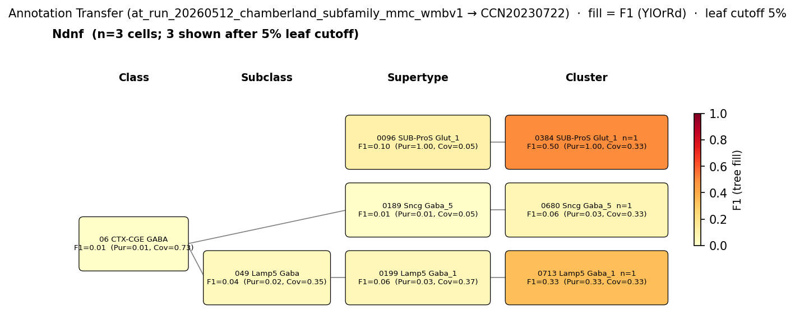

# Ndnf::Nkx2-1-IN (Ndnf-OLM, Chamberland 2024) — WMBv1 (CCN20230722) Mapping Report
*2026-04-09 · Source: `/Users/do12/Documents/GitHub/BICAN_agentic_framework_planning/evidencell/kb/graphs/hippocampus/hippocampus_GABAergic_interneurons.yaml`*

---

## Introduction

The Ndnf::Nkx2-1-IN subfamily defined by Chamberland 2024 [1] is a genetically isolated cohort of hippocampal somatostatin interneurons obtained via an Ndnf;;Nkx2-1 intersection in CA1. The intersection labels oriens-lacunosum-moleculare (OLM)-like cells in stratum oriens that selectively target CA1 pyramidal cells, distinguishing them from the bistratified Sst;;Tac1 subfamily which preferentially innervates fast-spiking interneurons. Because the subfamily is defined by a transgene intersection rather than by an explicit transcriptomic centroid, its placement onto the Whole Mouse Brain v1 (WMBv1) taxonomy [CCN20230722] is expected to be diffuse, and the mapping question is which atlas T-types — if any — host these cells preferentially.

### Classical type table

| Property | Value | References |
|---|---|---|
| Soma location | CA1 stratum oriens [UBERON:0005371] | [1] |
| NT | GABAergic | [1] |
| Defining markers | Sst, Ndnf, Nkx2-1 (intersectional definition) | [1] |

<details>
<summary>Details — source evidence for classical type properties</summary>

- **Defining markers:** asta_report · Ndnf;;Nkx2-1 intersectional genetic definition · [1]
  > the Sst;;Tac1 intersection targeted a population of bistratified cells that overwhelmingly targeted fast-spiking interneurons. In contrast, the Ndnf;;Nkx2-1 intersection revealed a population of oriens lacunosum-moleculare interneurons that selectively targeted CA1 pyramidal cells
  > — Chamberland et al. 2024, Transcriptomic Interneuron Classifications · [1] <!-- quote_key: 269246896_c084d5c0 -->
- **Soma location:** asta_report · oriens-lacunosum-moleculare placement in CA1 O/A · [1]
  > While Sst;;Tac1-INs were located closer to the CA1 pyramidal layer, Ndnf;;Nkx2-1-INs and Chrna2-INs were found progressively deeper in O/A
  > — Chamberland et al. 2024, Results · [1] <!-- quote_key: 269246896_1b1ebab4 -->

</details>

### Cell Ontology mapping

No Cell Ontology term currently covers this type — candidate for a new CL term.

---

## Results

Marker-expression alignment on a CA1 stratum oriens cohort (region_fraction_100um=0.578) places the Ndnf::Nkx2-1 subfamily most consistently on 0767 Sst Gaba_3 [CS20230722_CLUS_0767], where all three defining markers (Sst, Ndnf, Nkx2-1) reach atlas-detectable levels and cohort percentiles ≥ 0.83 (see property comparison table). Annotation transfer using the dropout-robust per-cluster Chamberland labelling [1] fails to consolidate the population at any single WMBv1 target — the Ndnf source group (n=19 in the Harris re-labelling) fragments across Lamp5, Sncg, and Sst types with F1 below 0.1 at every supertype (see figure), so the call rests on marker-level concordance rather than on a clean transcriptomic anchor.



*F1 across taxonomy levels for the Ndnf source group (Chamberland 2024 per-cluster derivation, n=19 cells in the Harris re-labelling) onto WMBv1. Each panel row is a source-cell group; nodes are coloured by F1 with **Purity** (Pur) and **Coverage** (Cov) shown inline. Coverage = fraction of source-group cells landing on this target; Purity = fraction of this target's cells coming from the source group. F1 ≥ 0.5 at a level indicates a clean mapping at that resolution. Here all supertype-level targets fall below F1=0.06 and the cluster-level top hit (0384 SUB-ProS Glut_1) is an excitatory off-target with n=1 cell — i.e. no atlas T-type captures the Ndnf::Nkx2-1 cohort with the per-cluster Ndnf threshold.*

The annotation transfer is uninformative at the resolution of supertype assignment for this subfamily because the per-cluster Ndnf threshold qualified only one Harris Class as source, yielding too few cells (n=19) to populate a coherent target.

### 0767 Sst Gaba_3 [CS20230722_CLUS_0767] · 🔴 LOW

**Table 1 — Property comparison.**

| Property | Classical | Supertype (0216 Sst Gaba_3) | Best cluster (0767 Sst Gaba_3) | Alignment |
|---|---|---|---|---|
| Soma location | CA1 stratum oriens [UBERON:0005371] | region_fraction_100um=0.539 (Field CA1, stratum oriens [MBA:399] painted) | region_fraction_100um=0.578 (Hippocampal formation [MBA:1089]) | CONSISTENT |
| NT type | GABAergic | not asserted (NT data missing on one side) | GABA | CONSISTENT |
| Sst expression | defining marker | 11.44 (cohort_pct 0.905; child-coverage 1.000) | 10.78 (cohort_pct 0.832) | CONSISTENT |
| Ndnf expression | defining marker | 1.64 (cohort_pct 0.889; child-coverage 0.889) | 1.03 (cohort_pct 0.832) | CONSISTENT |
| Nkx2-1 expression | defining marker | 0.04 (cohort_pct 0.714; below MIN_DETECTABLE) | 0.17 (cohort_pct 0.874) | SUPT: DISCORDANT; CLUS: CONSISTENT |
| Sex ratio | not documented | not available | not assessed | NOT_ASSESSED |

*Subcluster concordance: Nkx2-1 is below MIN_DETECTABLE (0.04) on the parent supertype 0216 Sst Gaba_3 [CS20230722_SUPT_0216] but reaches 0.17 on the child cluster 0767 Sst Gaba_3 [CS20230722_CLUS_0767] — a HIDDEN-1:1 pattern in which the Nkx2-1 signal concentrates in a minority of children rather than being supertype-wide.*

**Table 2 — Evidence support.**

| Evidence | Type | Supports | Headline | Source |
|---|---|---|---|---|
| Atlas precomputed expression | Atlas metadata | PARTIAL | region_fraction_100um=0.578; strict region_fraction=0.422 | atlas-internal |

**Supporting evidence:**
- Region: 0767 Sst Gaba_3 [CS20230722_CLUS_0767] places 578 of every 1000 cells within 100µm of Field CA1, stratum oriens [MBA:399]; strict in-region fraction is 0.422 (atlas-internal). This is the strongest hippocampal location signal among hippocampus-resident Sst supertypes considered.
- Markers: all three defining markers (Sst=10.78, Ndnf=1.03, Nkx2-1=0.17) reach atlas-detectable levels with cohort percentiles 0.832/0.832/0.874 — the only candidate among the survivors that holds all three at cluster level.

**Marker evidence provenance:**
- **Sst:** transcript-level via taxonomy precomputed expression on the cluster (val=10.78, cohort_pct=0.832); listed as NEUROPEPTIDE category in the atlas marker panel for this cluster.
- **Ndnf:** transcript-level via precomputed expression (val=1.03, cohort_pct=0.832); no atlas marker-category tag attached. Treat as a quantitative agreement rather than an atlas-asserted discriminator.
- **Nkx2-1:** val=0.17 is just above the precomputed MIN_DETECTABLE (0.1) threshold; cohort percentile is high (0.874) but the absolute level is much weaker than on Lamp5 Lhx6 candidates (e.g. CLUS_0726=3.90). The MGE/Nkx2-1 axis is present here but at a low quantitative level.

**Concerns:**
- AT signal does not anchor the call: the Ndnf source pool (n=19) is too small and fragments across Lamp5, Sncg, and Sst types with all F1 < 0.1, so the cluster identification depends entirely on marker concordance plus location (caveat_type: DISTRIBUTED_ACROSS_CLUSTERS).
- Nkx2-1 detection at 0.17 is borderline relative to the much stronger MGE signal on Lamp5 Lhx6 candidates *(note: the Lamp5 Lhx6 supertype CS20230722_SUPT_0203 has substantially higher Nkx2-1 mean expression but its soma centroid is in DG/CA3 rather than CA1 oriens, leaving a location-vs-marker trade-off across the survivor set)*.
- Source pool size n=19 cells is small (caveat_type: LOW_CELL_COUNT) and was derived by Harris re-labelling under Chamberland's per-cluster gene-pair rules, not from the original Chamberland scRNA-seq.

**What would upgrade confidence:**
- Targeted Ndnf::Nkx2-1 intersectional patch-seq or scRNA-seq, re-mapped onto WMBv1 at F1 ≥ 0.50 at CLUSTER level — would discriminate CS20230722_CLUS_0767 from competing Lamp5 Lhx6 candidates with a direct experimental anchor (AnnotationTransferEvidence).
- Cluster-level Nkx2-1 expression survey across the children of 0216 Sst Gaba_3 [CS20230722_SUPT_0216] to test whether the HIDDEN-1:1 signal on CLUS_0767 is reproducible across resamples.

### 0203 Lamp5 Lhx6 Gaba_1 [CS20230722_SUPT_0203] · 🔴 LOW

**Table 1 — Property comparison.**

| Property | Classical | Supertype (0203 Lamp5 Lhx6 Gaba_1) | Best cluster (0726 Lamp5 Lhx6 Gaba_1) | Alignment |
|---|---|---|---|---|
| Soma location | CA1 stratum oriens [UBERON:0005371] | region_fraction_100um=0.114 (Dentate gyrus [MBA:726] + Field CA3 [MBA:463] off-target) | region_fraction_100um=0.088 (DG molecular layer; Field CA3) | SUPT: APPROXIMATE; CLUS: DISCORDANT |
| NT type | GABAergic | not asserted | GABA | NOT_ASSESSED / CONSISTENT |
| Sst expression | defining marker | 1.52 (cohort_pct 0.603; child-coverage 1.000) | 1.38 (cohort_pct 0.563) | CONSISTENT |
| Ndnf expression | defining marker | 1.32 (cohort_pct 0.873; child-coverage 1.000) | 0.89 (cohort_pct 0.815) | CONSISTENT |
| Nkx2-1 expression | defining marker | 1.85 (cohort_pct 0.984; child-coverage 0.750; atlas category: DEFINING_SCOPED at child CLUS_0730 / TF at CLUS_0726) | 3.90 (cohort_pct 0.983; atlas category: TF) | CONSISTENT |
| Sex ratio | not documented | not available | not assessed | NOT_ASSESSED |

*Subcluster concordance: Nkx2-1 is the supertype's atlas-asserted discriminator (DEFINING_SCOPED on child 0730 Lamp5 Lhx6 Gaba_1 [CS20230722_CLUS_0730]) and child-coverage is 0.750 — i.e. Nkx2-1 reaches atlas-detectable levels on 3 of the 4 children. Sst and Ndnf hold across all 4 children. Location, however, is APPROXIMATE supertype-wide (region_fraction_100um=0.114) because the supertype's soma centroid is in Dentate gyrus and Field CA3 rather than in CA1 stratum oriens.*

**Table 2 — Evidence support.**

| Evidence | Type | Supports | Headline | Source |
|---|---|---|---|---|
| Atlas precomputed expression | Atlas metadata | PARTIAL | region_fraction_100um=0.114; strict region_fraction=0.050 | atlas-internal |

**Supporting evidence:**
- Markers: 3 of 3 markers CONSISTENT at supertype level. Nkx2-1=1.85 is the strongest MGE signal among hippocampus-proximate Sst-containing supertypes considered. Lamp5+Lhx6 co-expression is the canonical MGE-derived Lamp5 subfamily signature, consistent with the Nkx2-1+ lineage that Chamberland 2024 [1] uses to define this subfamily.
- This supertype is the cleanest match on transcript-level MGE/Nkx2-1 axis across the survivor set.

**Marker evidence provenance:**
- **Sst:** transcript-level (val=1.52 supertype, child-coverage 1.000) — present but at low absolute level relative to dedicated Sst supertypes. The classical type's Sst expression is asserted from the intersectional definition (a Sst-Cre-dependent intersection); whether OLM-like cells in this Lamp5 Lhx6 territory carry a true OLM-equivalent Sst transcript signature is unresolved by atlas metadata alone.
- **Ndnf:** transcript-level (val=1.32, cohort_pct 0.873) — full supertype-wide coverage.
- **Nkx2-1:** transcript-level (val=1.85; cohort_pct 0.984; atlas category: TF on CLUS_0726 and DEFINING_SCOPED on CLUS_0730). The atlas team flags this as a TF marker on the panel rather than a free expression discriminator; nevertheless the absolute level is materially above what is seen on the Sst Gaba_3 candidates.

**Concerns:**
- Location APPROXIMATE — `region_fraction_100um: 0.114` is in the boundary band [0.1, 0.5); the dominant off-target populations are Dentate gyrus [MBA:726] (count_100um=1220 of 3175 hippocampal-formation hits) and Field CA3 [MBA:463] (count_100um=1179), which are within the hippocampal formation but not in CA1 stratum oriens (caveat_type: AMBIGUOUS_MAPPING). The classical type is defined specifically as a CA1 O/A population [1], so the supertype's cells are largely outside the classical type's anatomical scope *(note: DG and CA3 are anatomically distinct from CA1 oriens; this is not a registration-boundary issue but a soma-centroid mismatch)*.
- AT signal does not arbitrate this candidate against CLUS_0767: at supertype level F1=0.0112 in `at_run_20260512_chamberland_subfamily_mmc_wmbv1`, with Coverage 0.105 (caveat_type: DISTRIBUTED_ACROSS_CLUSTERS).
- The supertype's Lamp5 Lhx6 identity does not match the Sst-OLM literature framing — most OLM literature places these cells in Sst-expressing supertypes rather than in Lamp5 Lhx6 territory *(note: this is a literature-vs-transcriptomic-axis tension; the Ndnf::Nkx2-1 intersection in Chamberland 2024 is specifically the population that does not cluster cleanly into the canonical Sst-OLM transcriptomic supertypes, so a Lamp5 Lhx6 placement is one possible reading of where the cells go transcriptomically)*.

**What would upgrade confidence:**
- Targeted Ndnf::Nkx2-1 intersectional transcriptomic profiling transferred onto WMBv1 at F1 ≥ 0.50 at SUPERTYPE level, to discriminate CS20230722_SUPT_0203 from CLUS_0767 / CS20230722_SUPT_0216 (AnnotationTransferEvidence).
- Targeted re-analysis of Chamberland 2024 raw per-cell Ndnf::Nkx2-1 intersectional scRNA-seq (if available) mapped directly to WMBv1 — would avoid the per-cluster threshold collapse that drove the n=19 source pool here.
- Resolution of the depth-gradient question within CA1 O/A: whether the Chamberland-reported deeper-in-O/A localisation of Ndnf::Nkx2-1-INs [1] corresponds to a transcriptomic gradient between Lamp5 Lhx6 and Sst Gaba_3 territories.

<details>
<summary>Candidates audited (full top-K)</summary>

| WMBv1 cluster | Supertype | Cells (10x) | Confidence | Key evidence | Verdict |
|---|---|---:|---|---|---|
| 0767 Sst Gaba_3 [CS20230722_CLUS_0767] | 0216 Sst Gaba_3 | 104 | 🔴 LOW | All 3 markers CONSISTENT; Nkx2-1=0.17 detectable; region_fraction_100um=0.578 | Primary |
| 0203 Lamp5 Lhx6 Gaba_1 [CS20230722_SUPT_0203] | — | 8913 | 🔴 LOW | All 3 markers CONSISTENT supertype-wide; Nkx2-1=1.85 strong MGE | Secondary |
| 0216 Sst Gaba_3 [CS20230722_SUPT_0216] | — | 2004 | 🔴 LOW | Nkx2-1=0.04 below MIN_DETECTABLE at supertype mean | Eliminated (Nkx2-1 absent at supertype; HIDDEN-1:1 on CLUS_0767) |
| 0726 Lamp5 Lhx6 Gaba_1 [CS20230722_CLUS_0726] | 0203 Lamp5 Lhx6 Gaba_1 | 4464 | 🔴 LOW | Strong Nkx2-1=3.90 but DG molecular-layer centroid | Eliminated (location DISCORDANT — DG molecular layer) |
| 0730 Lamp5 Lhx6 Gaba_1 [CS20230722_CLUS_0730] | 0203 Lamp5 Lhx6 Gaba_1 | 112 | 🔴 LOW | Nkx2-1=2.08 DEFINING_SCOPED; Field CA3 pyramidal layer centroid | Eliminated (location DISCORDANT — Field CA3) |
| 0204 Pvalb chandelier Gaba_1 [CS20230722_SUPT_0204] | — | 3470 | 🔴 LOW | Pvalb chandelier identity; Isocortex centroid | Eliminated (wrong subclass; Isocortex centroid) |
| 0230 Sst Gaba_17 [CS20230722_SUPT_0230] | — | 956 | 🔴 LOW | Ndnf APPROXIMATE; Cortical subplate centroid | Eliminated (location DISCORDANT — Cortical subplate) |
| 0233 STR Prox1 Lhx6 Gaba_1 [CS20230722_SUPT_0233] | — | 630 | 🔴 LOW | Striatal Prox1+Lhx6+ identity; MEA off-target | Eliminated (wrong subclass; Striatum centroid) |
| 0215 Sst Gaba_2 [CS20230722_SUPT_0215] | — | 1183 | 🔴 LOW | Sst=11.32; Olfactory areas / Piriform centroid | Eliminated (location DISCORDANT — Olfactory / Piriform) |
| 0724 Lamp5 Lhx6 Gaba_1 [CS20230722_CLUS_0724] | 0203 Lamp5 Lhx6 Gaba_1 | 2443 | ⚪ UNCERTAIN | Nkx2-1=2.99; Sst APPROXIMATE; Isocortex co-located | Eliminated (location APPROXIMATE off-CA1 + Sst weak) |
| 0725 Lamp5 Lhx6 Gaba_1 [CS20230722_CLUS_0725] | 0203 Lamp5 Lhx6 Gaba_1 | 212 | ⚪ UNCERTAIN | Nkx2-1=5.05; Field CA1 stratum radiatum centroid | Eliminated (location APPROXIMATE off-oriens) |

</details>

---

### Methods

<details>
<summary>Data sources, analyses, and reproducibility receipts</summary>

**Classical type definition.** The Ndnf::Nkx2-1-IN subfamily is defined by Chamberland 2024 [1] as the population labelled by the Sst-Cre × Ndnf-Flp × Nkx2-1 intersectional driver in CA1, with somata located deeper in stratum oriens than the Sst;;Tac1 cohort. Defining markers are Sst, Ndnf, and Nkx2-1 (intersectional); NT type is GABAergic. The `definition_basis` is CLASSICAL_MULTIMODAL.

**Atlas mapping query.** Candidate atlas clusters were retrieved from the WMBv1 (CCN20230722) taxonomy at ranks 0 (cluster) and 1 (supertype) using metadata-based scoring (region match, NT type, defining markers, sex bias when applicable). Full scoring rules: `workflows/map-cell-type.md`.

**Property alignment.** Each defining property of the classical type was compared to the corresponding atlas-side value via the `property_comparisons` schema, with alignments graded CONSISTENT / APPROXIMATE / DISCORDANT / NOT_ASSESSED. Atlas-side numerical values came from precomputed expression on the cluster (cluster.yaml in the taxonomy reference store) and from MERFISH spatial registration for soma location.

**Annotation transfer.**

| Field | Value |
|---|---|
| Source dataset | GEO:GSE99888 (Ndnf (Chamberland per-cluster subfamily label)) |
| Source species | NCBITaxon:10090 |
| Target atlas | WMBv1 (CCN20230722; SHA-256: b21ca985) |
| Method | MapMyCells (cell_type_mapper v1.7.1, default parameters, raw normalization, bootstrap_iteration=100). Same MapMyCells run as `at_run_20260512_harris_class_mmc_wmbv1`; re-aggregated under Chamberland subfamily labels via `class_to_subfamily.tsv`. |
| Tool version | cell_type_mapper v1.7.1 |
| Bootstrap threshold | 0.8 |
| n cells | 3663 (filtered to 3663) |
| Run record | [`kb/annotation_transfer_runs/at_run_20260512_chamberland_subfamily_mmc_wmbv1/manifest.yaml`](../../kb/annotation_transfer_runs/at_run_20260512_chamberland_subfamily_mmc_wmbv1/manifest.yaml) |
| Code reference | [https://github.com/AllenInstitute/cell_type_mapper](https://github.com/AllenInstitute/cell_type_mapper) |
| F1 matrix | [`f1_matrix_chamberland_by_class.csv`](../../kb/annotation_transfer_runs/at_run_20260512_chamberland_subfamily_mmc_wmbv1/f1_matrix_chamberland_by_class.csv) |
| Caveats | Per-cluster derivation is the primary result (dropout-robust). The per-cluster Ndnf threshold qualified only one Harris Class, yielding a small (n=19) source pool that fragments across Lamp5/Sncg/Sst types with all F1 < 0.1 at supertype level. |

**Anti-hallucination.** All citations, atlas accessions, ontology CURIEs, and verbatim literature quotes in this report are validated against the evidencell knowledge base at write time. Authored-prose evidence narratives are validated against their source `evidence_items[*].explanation` fields. The pre-write hook rejects any unresolvable identifier or unattributed blockquote. Specific mapping limitations and caveats are documented per-candidate in the Discussion section.

*Generated by evidencell `be7fae4` at 2026-06-10T13:48:14+00:00 from [kb/graphs/hippocampus/hippocampus_GABAergic_interneurons.yaml](kb/graphs/hippocampus/hippocampus_GABAergic_interneurons.yaml).*

**Evidence base table.**

| Edge ID | Evidence types | Supports | Source |
|---|---|---|---|
| edge_ndnf_nkx2_1_olm_to_CS20230722_SUPT_0216 | ANNOTATION_TRANSFER | PARTIAL | atlas-internal |
| edge_ndnf_nkx2_1_olm_subfamily_chamberland_to_CS20230722_CLUS_0767 | ATLAS_METADATA | PARTIAL | atlas-internal |
| edge_ndnf_nkx2_1_olm_subfamily_chamberland_to_CS20230722_CLUS_0726 | ATLAS_METADATA | PARTIAL | atlas-internal |
| edge_ndnf_nkx2_1_olm_subfamily_chamberland_to_CS20230722_CLUS_0730 | ATLAS_METADATA | PARTIAL | atlas-internal |
| edge_ndnf_nkx2_1_olm_subfamily_chamberland_to_CS20230722_SUPT_0203 | ATLAS_METADATA | PARTIAL | atlas-internal |
| edge_ndnf_nkx2_1_olm_subfamily_chamberland_to_CS20230722_SUPT_0204 | ATLAS_METADATA | PARTIAL | atlas-internal |
| edge_ndnf_nkx2_1_olm_subfamily_chamberland_to_CS20230722_SUPT_0230 | ATLAS_METADATA | PARTIAL | atlas-internal |
| edge_ndnf_nkx2_1_olm_subfamily_chamberland_to_CS20230722_SUPT_0233 | ATLAS_METADATA | PARTIAL | atlas-internal |
| edge_ndnf_nkx2_1_olm_subfamily_chamberland_to_CS20230722_SUPT_0215 | ATLAS_METADATA | PARTIAL | atlas-internal |
| edge_ndnf_nkx2_1_olm_subfamily_chamberland_to_CS20230722_CLUS_0724 | ATLAS_METADATA | PARTIAL | atlas-internal |
| edge_ndnf_nkx2_1_olm_subfamily_chamberland_to_CS20230722_CLUS_0725 | ATLAS_METADATA | PARTIAL | atlas-internal |

</details>

---

## Discussion

**Primary mapping:** Ndnf::Nkx2-1-IN (Ndnf-OLM, Chamberland 2024) → 0767 Sst Gaba_3 [CS20230722_CLUS_0767] at LOW confidence. Key support: three-marker concordance (Sst, Ndnf, Nkx2-1 all at atlas-detectable levels and cohort percentiles ≥ 0.83) plus CA1 stratum oriens centroid (region_fraction_100um=0.578). Key caveats: DISTRIBUTED_ACROSS_CLUSTERS (Ndnf source pool n=19 too small to anchor AT; F1 < 0.1 everywhere at supertype level) and LOW_CELL_COUNT on the source side. Secondary candidate 0203 Lamp5 Lhx6 Gaba_1 [CS20230722_SUPT_0203] carries a stronger MGE/Nkx2-1 transcript signature (1.85 vs 0.17 at CLUS_0767) but its soma centroid sits in Dentate gyrus / Field CA3 rather than CA1 oriens, making it the marker-led alternative against the location-led primary call.

No Cell Ontology term currently assigned. The Ndnf::Nkx2-1 subfamily is candidate material for a new CL term: it is a genetically defined hippocampal OLM-like subpopulation that is not captured by any current CL OLM definition and that the literature (Chamberland 2024 [1]) explicitly distinguishes from the bistratified Sst;;Tac1 subfamily within the broader Sst-IN family.

### Cross-classical convergence note (provisional)

Per issue #54 (provisional, 2026-06-10), this node's classical counterparts in the consolidated graph are `olm_cell_ca1` (BROAD) and `oriens_oriens_cell_hippocampus` (BROAD/PARTIAL). Pool-candidate detection on the consolidated `hippocampus_GABAergic_interneurons.yaml` returned no within-tolerance shared targets between this node and either counterpart, so no cross-classical pooling is proposed here; the relationship to `olm_cell_ca1` / `oriens_oriens_cell_hippocampus` is left for curator review under the #54 provisional.

### Proposed experiments and follow-ups

**Targeted Ndnf::Nkx2-1 intersectional scRNA-seq → WMBv1 re-mapping**
- **What:** Direct re-mapping of Ndnf::Nkx2-1 intersectional scRNA-seq (Chamberland 2024 raw per-cell data if available, or fresh Ndnf;;Nkx2-1 driver scRNA-seq) onto WMBv1.
- **Target:** F1 ≥ 0.50 at SUPERTYPE level; ideally F1 ≥ 0.50 at CLUSTER level.
- **Expected output:** AnnotationTransferEvidence on the relevant edges; would discriminate CS20230722_CLUS_0767, CS20230722_SUPT_0216, and CS20230722_SUPT_0203 with a direct experimental anchor rather than the current per-cluster Harris re-labelling.
- **Resolves:** primary vs. secondary survivor question; open questions 1, 2.
- **Status of completed work:** The current AT run (`at_run_20260512_chamberland_subfamily_mmc_wmbv1`) re-aggregates the Harris 2018 MapMyCells run under Chamberland per-cluster gene-pair rules. It is dropout-robust at the cluster-mean level but cannot substitute for direct Ndnf::Nkx2-1 intersectional data — the per-cluster threshold qualified only one Harris Class as Ndnf-source, giving n=19 and uninformative F1. A refined version using direct intersectional scRNA-seq is still needed.

**Cluster-level Nkx2-1 expression survey across 0216 Sst Gaba_3 children**
- **What:** Per-cluster Nkx2-1 expression across the children of CS20230722_SUPT_0216 to test the HIDDEN-1:1 pattern seen here (Nkx2-1 absent at supertype mean, present on CLUS_0767).
- **Target:** Reproducible cluster-specific Nkx2-1 detectability above MIN_DETECTABLE on CLUS_0767 and absence elsewhere.
- **Expected output:** Refined `property_comparisons` on each child edge, possible HIDDEN-1:1 caveat consolidation.
- **Resolves:** open question 1.

### Open questions

1. Is the Nkx2-1 axis a binary subfamily discriminator or a graded continuum within hippocampal Sst Gaba_3?
2. Does Chamberland 2024 publish per-cell Ndnf::Nkx2-1 intersectional scRNA-seq that could be re-mapped directly to WMBv1?
3. Whether the depth gradient within CA1 O/A reported by Chamberland 2024 [1] maps to a transcriptomic gradient within Lamp5 Lhx6 vs. Sst Gaba_3 territories.
4. (Provisional, #54 2026-06-10) Cross-classical convergence between this node, `olm_cell_ca1`, and `oriens_oriens_cell_hippocampus` under the consolidated graph — requires curator decision on whether the Ndnf::Nkx2-1 subfamily is a subtype of the broader OLM classical type or a distinct genetic subset.

---

## References

| # | Citation | PMID | Used for |
|---|---|---|---|
| [1] | Chamberland et al. 2024 · PMID:38640347 | [38640347](https://pubmed.ncbi.nlm.nih.gov/38640347) | soma location, defining markers (intersectional), subfamily definition |

---

<!-- verdict-block-start: edge_ndnf_nkx2_1_olm_to_CS20230722_SUPT_0216 -->
```yaml
verdict:
  confidence: UNCERTAIN
  confidence_score: 0.20
  rationale: >
    [tier:CUT] Nkx2-1 DISCORDANT at CS20230722_SUPT_0216 (val=0.04, below MIN_DETECTABLE) breaks the subfamily-defining MGE/Nkx2-1 axis at supertype mean; AT F1 below MIN_DETECTABLE in and source pool fragments across Lamp5/Sncg/Sst with all F1 < 0.1. HIDDEN-1:1 signal recovers Nkx2-1 detectability on child CS20230722_CLUS_0767.
  reconciliation_note: >
    Supertype mean obscures a cluster-level Nkx2-1 signal on CS20230722_CLUS_0767; the primary call is at the child-cluster level (skos:closeMatch on CLUS_0767), not at this supertype.
  caveats:
    - caveat_type: DISTRIBUTED_ACROSS_CLUSTERS
      description: >
        AT signal in fragments across Lamp5, Sncg, and Sst types with all targets F1 < 0.1; the Chamberland per-cluster Ndnf source pool (n=19) is too small and noisy to support a confident assignment.
    - caveat_type: OTHER
      description: >
        Nkx2-1 val=0.04 below MIN_DETECTABLE at supertype mean breaks the subfamily-defining MGE/Nkx2-1 marker from Chamberland 2024 [PMID:38640347]; the marker recovers on child cluster CS20230722_CLUS_0767 (val=0.17) under a HIDDEN-1:1 reading.
  proposed_experiments:
    - Targeted Ndnf::Nkx2-1 intersectional transcriptomic profiling, transferred onto WMBv1 at F1 >= 0.50 at SUPERTYPE level, to discriminate CS20230722_SUPT_0216 from competing Lamp5 Lhx6 supertype candidates.
    - Cluster-level Nkx2-1 expression survey across CS20230722_SUPT_0216 children to test for HIDDEN-1:1 minority Nkx2-1+ signal masked at supertype mean.
  unresolved_questions:
    - Is the Nkx2-1 axis a binary subfamily discriminator or a graded continuum within hippocampal Sst Gaba_3?
    - Does Chamberland 2024 publish per-cell Ndnf::Nkx2-1 intersectional transcriptomic that could be re-mapped directly to WMBv1?
    - (#54 provisional) Cross-classical convergence with olm_cell_ca1 (BROAD) and oriens_oriens_cell_hippocampus (BROAD/PARTIAL) under the consolidated graph requires curator review.
```
<!-- verdict-block-end -->

<!-- verdict-block-start: edge_ndnf_nkx2_1_olm_subfamily_chamberland_to_CS20230722_CLUS_0767 -->
```yaml
verdict:
  confidence: LOW
  confidence_score: 0.40
  relationship: skos:closeMatch
  mapping_cardinality: "1:1"
  mapping_justification: semapv:ManualMappingCuration
  rationale: >
    [tier:STRONGEST] All 3 markers CONSISTENT at CS20230722_CLUS_0767 (Sst=10.78, Ndnf=1.03, Nkx2-1=0.17 just above MIN_DETECTABLE; cohort percentiles 0.832/0.832/0.874); region_fraction_100um=0.578 places the centroid in CA1 stratum oriens. AT in does not anchor the call (Ndnf source n=19 fragments across types) so confidence is LOW pending direct Ndnf::Nkx2-1 intersectional transcriptomic.
  reconciliation_note: >
    HIDDEN-1:1 against parent CS20230722_SUPT_0216 (Nkx2-1=0.04 below MIN_DETECTABLE at supertype mean but 0.17 on this child); the supertype edge is left as evidencell:UncertainRelationship.
  caveats:
    - caveat_type: DISTRIBUTED_ACROSS_CLUSTERS
      description: >
        AT in does not anchor this candidate; the Ndnf source pool (n=19) fragments across Lamp5/Sncg/Sst types with all F1 < 0.1 at supertype level. The cluster identification depends on marker concordance plus location.
    - caveat_type: LOW_CELL_COUNT
      description: >
        Ndnf source pool n=19 cells in the Harris re-labelling under Chamberland per-cluster rules. Results may not be robust.
    - caveat_type: OTHER
      description: >
        Nkx2-1=0.17 is just above the MIN_DETECTABLE threshold; the MGE/Nkx2-1 axis is detectable here but at much lower absolute level than on Lamp5 Lhx6 candidates (e.g. CS20230722_CLUS_0726 Nkx2-1=3.90).
  proposed_experiments:
    - Targeted Ndnf::Nkx2-1 intersectional transcriptomic profiling transferred onto WMBv1 at F1 >= 0.50 at CLUSTER level to test whether OLM-like Ndnf::Nkx2-1 cells co-cluster with CS20230722_CLUS_0767.
  unresolved_questions:
    - (#54 provisional) Cross-classical convergence with olm_cell_ca1 (BROAD) and oriens_oriens_cell_hippocampus (BROAD/PARTIAL) under the consolidated graph requires curator review.
```
<!-- verdict-block-end -->

<!-- verdict-block-start: edge_ndnf_nkx2_1_olm_subfamily_chamberland_to_CS20230722_CLUS_0726 -->
```yaml
verdict:
  confidence: UNCERTAIN
  confidence_score: 0.15
  rationale: >
    [tier:CUT] Location DISCORDANT (region_fraction_100um=0.088; CS20230722_CLUS_0726 centroid in Dentate gyrus molecular layer [MBA:10703], not CA1 stratum oriens). Strong Nkx2-1=3.90 alone insufficient against the location mismatch.
  caveats:
    - caveat_type: DISCORDANT_ANATOMY
      description: >
        CS20230722_CLUS_0726 soma centroid in Dentate gyrus molecular layer [MBA:10703] / Field CA3 [MBA:463]; region_fraction_100um=0.088 well below the boundary band. The classical type is defined as CA1 O/A.
```
<!-- verdict-block-end -->

<!-- verdict-block-start: edge_ndnf_nkx2_1_olm_subfamily_chamberland_to_CS20230722_CLUS_0730 -->
```yaml
verdict:
  confidence: UNCERTAIN
  confidence_score: 0.15
  rationale: >
    [tier:CUT] Location DISCORDANT (region_fraction_100um=0.063; CS20230722_CLUS_0730 centroid in Field CA3, pyramidal layer [MBA:495], not CA1 stratum oriens). Strong Nkx2-1=2.08 (DEFINING_SCOPED) alone insufficient against the location mismatch.
  caveats:
    - caveat_type: DISCORDANT_ANATOMY
      description: >
        CS20230722_CLUS_0730 soma centroid in Field CA3 [MBA:463] / Field CA3 pyramidal layer [MBA:495]; region_fraction_100um=0.063 well below the boundary band.
```
<!-- verdict-block-end -->

<!-- verdict-block-start: edge_ndnf_nkx2_1_olm_subfamily_chamberland_to_CS20230722_SUPT_0203 -->
```yaml
verdict:
  confidence: LOW
  confidence_score: 0.30
  relationship: skos:broadMatch
  mapping_cardinality: "1:n"
  mapping_justification: semapv:ManualMappingCuration
  rationale: >
    [tier:NEXT] All 3 markers CONSISTENT at CS20230722_SUPT_0203 (Sst=1.52, Ndnf=1.32, Nkx2-1=1.85 with child-coverage 0.750); the strongest MGE/Nkx2-1 transcript signature among survivors. Location APPROXIMATE (region_fraction_100um=0.114) with supertype centroid in Dentate gyrus / Field CA3 rather than CA1 oriens, making this a marker-led alternative to the location-led CS20230722_CLUS_0767 call.
  reconciliation_note: >
    Marker-led alternative to the primary CS20230722_CLUS_0767 call; soma centroid is in DG/CA3 rather than CA1 oriens. Predicate left as skos:broadMatch + 1:n because Ndnf::Nkx2-1 cells may distribute across this supertype's children without 1:1 cluster correspondence.
  caveats:
    - caveat_type: AMBIGUOUS_MAPPING
      description: >
        Location APPROXIMATE with Dentate gyrus [MBA:726] and Field CA3 [MBA:463] contributing substantial off-target painted counts beyond CA1 stratum oriens; region_fraction_100um=0.114 is in the boundary band.
    - caveat_type: DISTRIBUTED_ACROSS_CLUSTERS
      description: >
        AT supertype  in (Coverage 0.105); cannot arbitrate this candidate against CS20230722_CLUS_0767 with the current n=19 source pool.
  proposed_experiments:
    - Targeted Ndnf::Nkx2-1 intersectional transcriptomic profiling, transferred onto WMBv1 at F1 >= 0.50 at SUPERTYPE level, to discriminate CS20230722_SUPT_0203 from competing Sst Gaba_3 supertype candidates.
  unresolved_questions:
    - Whether the depth gradient within CA1 O/A reported by Chamberland 2024 maps to a transcriptomic gradient within Lamp5 Lhx6 vs. Sst Gaba_3 territories.
    - (#54 provisional) Cross-classical convergence with olm_cell_ca1 (BROAD) and oriens_oriens_cell_hippocampus (BROAD/PARTIAL) under the consolidated graph requires curator review.
```
<!-- verdict-block-end -->

<!-- verdict-block-start: edge_ndnf_nkx2_1_olm_subfamily_chamberland_to_CS20230722_SUPT_0204 -->
```yaml
verdict:
  confidence: UNCERTAIN
  confidence_score: 0.10
  rationale: >
    [tier:CUT] Wrong subclass — CS20230722_SUPT_0204 is Pvalb chandelier identity, not Sst-IN. Location DISCORDANT (region_fraction_100um=0.065; Isocortex [MBA:315] centroid).
  caveats:
    - caveat_type: DISCORDANT_ANATOMY
      description: >
        CS20230722_SUPT_0204 soma centroid in Isocortex [MBA:315] / Olfactory areas [MBA:698]; region_fraction_100um=0.065 well below the boundary band. Pvalb chandelier identity does not match the classical Sst-IN subfamily.
```
<!-- verdict-block-end -->

<!-- verdict-block-start: edge_ndnf_nkx2_1_olm_subfamily_chamberland_to_CS20230722_SUPT_0230 -->
```yaml
verdict:
  confidence: UNCERTAIN
  confidence_score: 0.10
  rationale: >
    [tier:CUT] Location DISCORDANT (region_fraction_100um=0.055; CS20230722_SUPT_0230 centroid in Cortical subplate [MBA:703] / Striatum [MBA:477], not CA1 oriens). Ndnf APPROXIMATE with child-coverage 0.333 (HIDDEN-1:1 minority signal insufficient).
  caveats:
    - caveat_type: DISCORDANT_ANATOMY
      description: >
        CS20230722_SUPT_0230 soma centroid in Cortical subplate [MBA:703] / Striatum [MBA:477]; region_fraction_100um=0.055 well below the boundary band.
```
<!-- verdict-block-end -->

<!-- verdict-block-start: edge_ndnf_nkx2_1_olm_subfamily_chamberland_to_CS20230722_SUPT_0233 -->
```yaml
verdict:
  confidence: UNCERTAIN
  confidence_score: 0.10
  rationale: >
    [tier:CUT] Wrong subclass — CS20230722_SUPT_0233 is striatal Prox1+Lhx6+ identity (STR Prox1 Lhx6 Gaba_1). Location DISCORDANT (region_fraction_100um=0.025; Striatum [MBA:477] / Medial amygdalar nucleus [MBA:403] centroid).
  caveats:
    - caveat_type: DISCORDANT_ANATOMY
      description: >
        CS20230722_SUPT_0233 soma centroid in Striatum [MBA:477] / Medial amygdalar nucleus [MBA:403]; region_fraction_100um=0.025 well below the boundary band. Striatal Prox1+Lhx6+ identity does not match the classical hippocampal Sst-IN subfamily.
```
<!-- verdict-block-end -->

<!-- verdict-block-start: edge_ndnf_nkx2_1_olm_subfamily_chamberland_to_CS20230722_SUPT_0215 -->
```yaml
verdict:
  confidence: UNCERTAIN
  confidence_score: 0.10
  rationale: >
    [tier:CUT] Location DISCORDANT (region_fraction_100um=0.024; CS20230722_SUPT_0215 centroid in Olfactory areas [MBA:698] / Cortical subplate [MBA:703] / Piriform area [MBA:961], not CA1 oriens). High Sst=11.32 alone insufficient against location mismatch.
  caveats:
    - caveat_type: DISCORDANT_ANATOMY
      description: >
        CS20230722_SUPT_0215 soma centroid in Olfactory areas [MBA:698] / Piriform area [MBA:961]; region_fraction_100um=0.024 well below the boundary band.
```
<!-- verdict-block-end -->

<!-- verdict-block-start: edge_ndnf_nkx2_1_olm_subfamily_chamberland_to_CS20230722_CLUS_0724 -->
```yaml
verdict:
  confidence: UNCERTAIN
  confidence_score: 0.15
  rationale: >
    [tier:CUT] Location APPROXIMATE (region_fraction_100um=0.158) with Isocortex [MBA:315] co-located beyond CA1 oriens; Sst APPROXIMATE (val=1.18, cohort_pct 0.479) and Ndnf APPROXIMATE (val=0.17, cohort_pct 0.471). Strong Nkx2-1=2.99 alone insufficient given off-CA1-oriens centroid and weak Sst/Ndnf alignment.
  caveats:
    - caveat_type: AMBIGUOUS_MAPPING
      description: >
        CS20230722_CLUS_0724 soma distributed across hippocampal formation [MBA:1089] and Isocortex [MBA:315]; not centred in CA1 stratum oriens.
```
<!-- verdict-block-end -->

<!-- verdict-block-start: edge_ndnf_nkx2_1_olm_subfamily_chamberland_to_CS20230722_CLUS_0725 -->
```yaml
verdict:
  confidence: UNCERTAIN
  confidence_score: 0.15
  rationale: >
    [tier:CUT] Location APPROXIMATE (region_fraction_100um=0.159) with CS20230722_CLUS_0725 centroid in Field CA1, stratum radiatum [MBA:415], not stratum oriens; Sst APPROXIMATE (val=1.05, cohort_pct 0.403). Strong Nkx2-1=5.05 alone insufficient given the wrong-layer centroid within CA1.
  caveats:
    - caveat_type: AMBIGUOUS_MAPPING
      description: >
        CS20230722_CLUS_0725 soma centroid in Field CA1, stratum radiatum [MBA:415], not CA1 stratum oriens; layer mismatch within the correct subregion.
```
<!-- verdict-block-end -->
