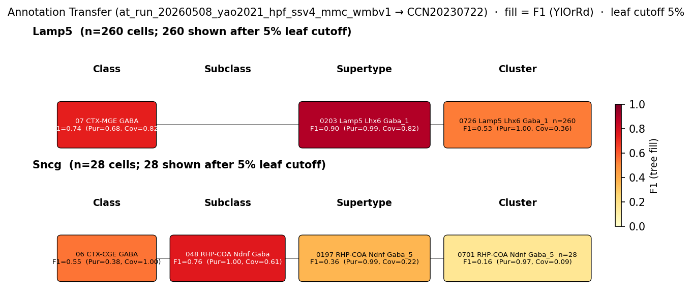

# Neurogliaform cell (NGC) — WMBv1 (CCN20230722) Mapping Report
*2026-04-09 · Source: `/Users/do12/Documents/GitHub/BICAN_agentic_framework_planning/evidencell/kb/graphs/hippocampus/hippocampus_GABAergic_interneurons.yaml`*

---

## Introduction

Hippocampal neurogliaform cells (NGCs) are small, late-spiking GABAergic interneurons of CA1 stratum lacunosum-moleculare [UBERON:0014557], with dense radiating axons that mediate slow GABAergic inhibition of pyramidal cell distal dendrites [1] [2] [3]. Two developmental lineages converge on the classical NGC phenotype: an MGE-derived nNOS+ subpopulation (NGFC.M; Lhx6+/Lamp5+/Id2+) and a CGE-derived nNOS- subpopulation (NGFC.C; Ndnf+/Lamp5+/Id2+), with overlapping morphology and shared markers but distinct transcriptomic backgrounds. Mapping the heterogeneous classical NGC type to the WMBv1 taxonomy therefore requires resolving which atlas supertype(s) capture each lineage and whether soma location is retained at hippocampal SLM.

### Classical type table

| Property | Value | References |
|---|---|---|
| Soma location | CA1 stratum lacunosum moleculare [UBERON:0014557] | [1] [2] [3] |
| NT | GABAergic | — |
| Markers | Nos1 [1] [2]; Npy [1] [4]; Lamp5 [2] [5]; Id2 [2] | [1] [2] [4] [5] |
| Negative markers | Pvalb, Sst, Calb2 | — |
| Neuropeptides | Npy [1] | [1] |
| CL term | neurogliaform cell [CL:0000693] (EXACT) | — |

<details>
<summary>Details — source evidence for classical type properties</summary>

- **Soma location:** Tricoire et al. 2010 records nNOS+ GABAergic neurons as one of the largest interneuron populations in the hippocampus · [1]
  > GABAergic neurons expressing nNOS are one of the largest interneuron populations in the hippocampus (Jinno et al., 2002)(B et al., 2005)(52852755)
  > — Tricoire et al. 2010, Classical Functional and Morphological Interneuron Types · [1] <!-- quote_key: 2405079_042a449f -->
- **Markers (Nos1, Npy, negative markers Pvalb/Sst/Calb2):** Tricoire et al. 2010 establishes the late-spiking phenotype and exclusion of classical interneuron markers · [1]
  > IvCs and NGCs have been argued to represent distinct interneuron subtypes (52852755), despite the rich similarity between these cell types, including coexpression of NPY with nNOS, dense axonal arbors, and slow pyramidal cell inhibition. We found that both of these interneurons exhibit a LS phenotype and fail to express other classical interneuron markers such as PV, SOM, or CR.
  > — Tricoire et al. 2010, Classical Functional and Morphological Interneuron Types · [1] <!-- quote_key: 2405079_6850b924 -->
- **Npy (transcript-level):** Wierenga et al. 2010 correspondence of NPY+ multipolar cells to ivy/neurogliaform · [4]
  > The labeled cell types correspond well to previously described NPY-positive multipolar cells, often referred to as Ivy cells and neurogliaform cells
  > — Wierenga et al. 2010, Molecular profiles · [4] <!-- quote_key: 8617990_2d09820f -->
- **Lamp5, Id2 (transcriptomic NGFC definition):** Kim et al. 2025 anchors Id2/Lamp5 as the transcriptomic NGFC definition · [2]
  > TranscripZonal profiling indicates conserved strong Grin3a expression levels in neocorZcal NGFCs defined by Id2 and Lamp5 expression
  > — Kim et al. 2025, Transcriptomic Interneuron Classifications · [2] <!-- quote_key: 282312227_bb365351 -->
- **Lamp5 (interneuron grouping with ivy):** Tzilivaki et al. 2023 places ivy and neurogliaform together within Lamp5+ interneurons · [5]
  > Lamp5 interneurons include ivy and neurogliaform cells (NGFCs). The ivy cell is the most common interneuron type in CA1; it has a distinct morphology with a relatively extensive axonal cloud extending over several hippocampal layers and co-expresses neuronal nitric oxide synthase (nNOS)
  > — Tzilivaki et al. 2023, INTERNEURON TYPES AND MICROCIRCUITS · [5] <!-- quote_key: 259953057_9718900f -->

</details>

Cell Ontology mapping: neurogliaform cell [[CL:0000693](https://www.ebi.ac.uk/ols4/ontologies/cl/classes?obo_id=CL:0000693)] (EXACT).

---

## Results

Marker concordance and cluster annotation transfer evidence converge on two distinct supertype-level homes for the classical NGC's two developmental sublineages: the MGE-derived (Lhx6+) Lamp5 lineage maps with strong cluster annotation transfer support to 0203 Lamp5 Lhx6 Gaba_1 [CS20230722_SUPT_0203] (F1=0.90 at supertype level), while the CGE-derived (Ndnf+) lineage maps more weakly to 0193 RHP-COA Ndnf Gaba_1 [CS20230722_SUPT_0193] (subclass-level F1=0.76 to the parent 048 RHP-COA Ndnf Gaba). Cluster-level resolution for both candidates is degraded by the absence of CA1 stratum lacunosum-moleculare cells from the dominant SUPT_0203 anatomical profile and by the retrohippocampal/cortical-amygdala enrichment of SUPT_0193 (see filtered annotation transfer figure, property comparison tables, and candidates audit table below).

**Annotation-transfer overview figure (run-level, filtered)**



*F1 across taxonomy levels for the two Yao 2021 source groups relevant to the classical NGC type: Lamp5 (n=868 HIP cells; the MGE-derived NGFC.M lineage) and Sncg (n=384 HIP cells; the CGE-derived NGFC.C/Ndnf+ lineage). Each panel row is a source-cell group; nodes are coloured by F1 with **Purity** (Pur) and **Coverage** (Cov) shown inline. Coverage = fraction of source-group cells landing on this target; Purity = fraction of this target's cells coming from the source group. F1 ≥ 0.5 at a level indicates a clean mapping at that resolution. Lamp5 reaches F1=0.90 at 050 Lamp5 Lhx6 Gaba subclass and at 0203 Lamp5 Lhx6 Gaba_1 supertype but collapses to F1=0.53 at cluster level (CLUS_0726), consistent with within-supertype heterogeneity. Sncg peaks at the subclass level (F1=0.76 to 048 RHP-COA Ndnf Gaba) and scatters across multiple Ndnf supertypes; cluster-level transfer is weak (F1=0.16). Note: the Lamp5 source group is shared with the classical ivy cell type — annotation transfer alone cannot discriminate ivy from neurogliaform within the Lamp5/Lhx6+ population.*

### Property alignment and evidence support — 0203 Lamp5 Lhx6 Gaba_1 [CS20230722_SUPT_0203]

**Table 1 — Property comparison.**

| Property | Classical | Supertype | Best cluster | Alignment |
|---|---|---|---|---|
| Soma location | CA1 stratum lacunosum moleculare [UBERON:0014557] | Hippocampal formation [MBA:1089] (3175 cells within 100µm); Dentate gyrus [MBA:726] (1220); Field CA3 [MBA:463] (1179) | 0729 Lamp5 Lhx6 Gaba_1 [CS20230722_CLUS_0729]: Hippocampal formation [MBA:1089] (438); Field CA3 [MBA:463] (300); Dentate gyrus [MBA:726] (212) | SUPT: APPROXIMATE; CLUS: DISCORDANT |
| NT type | GABAergic | not asserted | GABA (CLUS_0729) | NOT_ASSESSED at supertype; CONSISTENT at cluster |
| Nos1 expression | defining marker | 7.78 (cohort_pct 0.97) | 7.57 (CLUS_0729) | CONSISTENT |
| Npy expression | defining marker | 4.62 (cohort_pct 0.76) | 2.64 (CLUS_0729) | CONSISTENT |
| Lamp5 expression | defining marker (DEFINING_SCOPED in atlas) | 6.73 (cohort_pct 0.95) | 7.44 (CLUS_0729) | CONSISTENT |
| Id2 expression | defining marker | 9.36 (cohort_pct 0.97) | 9.97 (CLUS_0729) | CONSISTENT |
| Pvalb expression | ABSENT (negative marker) | 0.43 | 0.07 (CLUS_0729) | SUPT: DISCORDANT; CLUS: CONSISTENT |
| Sst expression | ABSENT (negative marker) | 1.52 | 1.67 (CLUS_0729) | DISCORDANT |
| Calb2 expression | ABSENT (negative marker) | 0.37 | 0.29 (CLUS_0729) | DISCORDANT |
| Npy (neuropeptide) | classical | 4.62 | 2.64 (CLUS_0729) | CONSISTENT |

*(Child-cluster breakdown: the dominant Lamp5 Lhx6 child cluster on the AT readout is 0726 Lamp5 Lhx6 Gaba_1 [CS20230722_CLUS_0726] at cluster-level F1=0.53, not currently emitted as a top-K edge in this graph; CLUS_0729 is the only child cluster carried on the edge set and shows DISCORDANT location at SLM despite consistent marker expression — see proposed experiments.)*

**Table 2 — Evidence support.**

| Evidence | Type | Supports | Headline | Source |
|---|---|---|---|---|
| MGE-lineage NGFC.M biology (Tricoire 2011 lineage; Bhatt 2023 markers) | Atlas metadata | PARTIAL | Lhx6+/Lamp5+ MGE lineage matches NGFC.M; SLM absent from supertype | atlas-internal |
| Atlas precomputed expression | Atlas metadata | SUPPORT | All 4 defining markers present (Nos1=7.79, Id2=9.35); 3 negative markers absent | atlas-internal |
| Yao 2021 SSv4 Lamp5 → WMBv1 | Annotation transfer | PARTIAL | F1=0.90 at supertype (711/868 cells) | atlas-internal |

### 0203 Lamp5 Lhx6 Gaba_1 [CS20230722_SUPT_0203] · 🟡 MODERATE

The MGE-derived (Lhx6+, nNOS+) NGFC subpopulation maps to 0203 Lamp5 Lhx6 Gaba_1 [CS20230722_SUPT_0203] at MODERATE confidence: the cluster annotation transfer of Yao 2021 Lamp5 hippocampal cells is dominant at this supertype (F1=0.90; see figure), all four defining markers (Nos1, Npy, Lamp5, Id2) are present at high cohort percentiles, and the lineage label (Lamp5 Lhx6, i.e. MGE-derived Lamp5+) matches the NGFC.M transcriptomic profile described by Tricoire 2011 and Kim 2025 [2].

**Supporting evidence**

- Atlas precomputed expression cross-check confirms the full classical marker panel at high atlas levels: Nos1=7.78 (cohort_pct 0.97), Npy=4.62 (cohort_pct 0.76), Lamp5=6.73 (cohort_pct 0.95), Id2=9.36 (cohort_pct 0.97).
- Cluster annotation transfer of the Yao 2021 Lamp5 hippocampal cohort (n=868) places 711 cells on this supertype (purity=0.99, coverage=0.82). The Lamp5 subclass label in the source dataset is the transcriptomic counterpart of the MGE-derived Lamp5+ NGFC.M lineage [2] [5].
- The classical negative marker Pvalb shows DISCORDANT mean expression at the supertype level (0.43) but drops to CONSISTENT at the AT-best child cluster CLUS_0729 (Pvalb=0.07, below detection threshold), consistent with within-supertype heterogeneity.

**Concerns**

- Soma location is the principal weakness: APPROXIMATE at supertype level (region_fraction_100um: 0.125; strict region_fraction: 0.044) — most SUPT_0203 cells lie outside CA1 SLM, with the strongest hippocampal subfield representation in dentate gyrus and CA3 stratum oriens/radiatum rather than CA1 SLM. The Lamp5 Lhx6 child cluster currently carried on the graph (CLUS_0729) is DISCORDANT at SLM (region_fraction_100um: 0.071). Classical NGCs are defined by SLM soma position [1] [2] [3], so the supertype's anatomical centre of mass is offset from the classical type.
- The Sst-DISCORDANT at the supertype mean (Sst=1.52, cohort_pct 0.79) is biologically expected for a Lamp5 Lhx6+ MGE population that sits adjacent to Sst-expressing siblings in the same Lhx6+ lineage and reflects supertype-mean contamination by neighbouring expression rather than a true Sst-expressing NGC subpopulation.
- The annotation transfer cannot distinguish neurogliaform from ivy cells: both share the Lamp5 Lhx6+/Nos1+/Npy+ profile and both map to the same supertype with the same Yao 2021 Lamp5 source group (see indistinguishability note below).
- Two `[AUTO_REPREDICATED_2026_05_26]` curator-review caveats on the edge record predicate auto-migration from deprecated PartialOverlapMatch to closeMatch; reviewable.

**What would upgrade confidence**

- Targeted patch-seq on morphologically reconstructed CA1 SLM NGCs and CA1 SO ivy cells with cluster annotation transfer to WMBv1 (target: F1 ≥ 0.80 at CLUSTER level, separating ivy from NGC within SUPT_0203). Adds AnnotationTransferEvidence with morphology-confirmed source cells.
- Higher-resolution annotation transfer at the cluster rather than supertype level to identify which Lamp5 Lhx6 Gaba_1 child cluster, if any, is enriched in CA1 SLM (CLUS_0726 leads the cluster F1 at 0.53 but is not currently emitted as a top-K edge — emit and assess).
- Source-side morphology confirmation (e.g. Cre-driver targeting of Lhx6+/Lamp5+ NGCs with biocytin fill) on the Yao 2021 Lamp5 cells to distinguish ivy from NGC contributions to the F1=0.90 signal.

### Property alignment and evidence support — 0193 RHP-COA Ndnf Gaba_1 [CS20230722_SUPT_0193]

**Table 1 — Property comparison.**

| Property | Classical | Supertype | Best cluster | Alignment |
|---|---|---|---|---|
| Soma location | CA1 stratum lacunosum moleculare [UBERON:0014557] | Hippocampal formation [MBA:1089] (774 cells within 100µm); Field CA3 [MBA:463] (452); Field CA3, stratum radiatum [MBA:504] (359) | 0687 RHP-COA Ndnf Gaba_1 [CS20230722_CLUS_0687]: Hippocampal formation [MBA:1089] (46); Field CA1 [MBA:382] (41); Field CA1, stratum lacunosum-moleculare [MBA:391] (39) | SUPT: APPROXIMATE; CLUS: CONSISTENT |
| NT type | GABAergic | not asserted | GABA (CLUS_0687) | NOT_ASSESSED at supertype; CONSISTENT at cluster |
| Nos1 expression | defining marker | 2.26 (cohort_pct 0.63) | 3.42 (CLUS_0687) | CONSISTENT |
| Npy expression | defining marker | 2.61 (cohort_pct 0.61) | 1.86 (CLUS_0687) | CONSISTENT |
| Lamp5 expression | defining marker | 0.28 (cohort_pct 0.42) | 0.20 (CLUS_0687) | APPROXIMATE |
| Id2 expression | defining marker | 4.88 (cohort_pct 0.61) | 5.44 (CLUS_0687) | SUPT: CONSISTENT; CLUS: APPROXIMATE |
| Pvalb expression | ABSENT (negative marker) | 0.27 | 0.41 (CLUS_0687) | DISCORDANT |
| Sst expression | ABSENT (negative marker) | 1.51 | 1.11 (CLUS_0687) | DISCORDANT |
| Calb2 expression | ABSENT (negative marker) | 0.31 | 0.05 (CLUS_0687) | SUPT: DISCORDANT; CLUS: CONSISTENT |
| Npy (neuropeptide) | classical | 2.61 | 1.86 (CLUS_0687) | CONSISTENT |

*(The atlas-best child cluster on this graph's edges for SUPT_0193 is 0687 RHP-COA Ndnf Gaba_1 [CS20230722_CLUS_0687], which uniquely among NGC candidates lands cleanly in CA1 stratum lacunosum-moleculare (region_fraction_100um: 0.830; 39 of 46 100µm-neighbourhood cells in MBA:391) but expresses Lamp5 only weakly (0.20) — the marker fingerprint is partially decoupled from the SLM location.)*

**Table 2 — Evidence support.**

| Evidence | Type | Supports | Headline | Source |
|---|---|---|---|---|
| CGE-lineage NGFC.C biology (Tricoire 2011 Ndnf+ subpopulation) | Atlas metadata | PARTIAL | Ndnf marks CGE-derived NGFC.C; supertype spans retrohippocampal + cortical-amygdala | atlas-internal |
| Atlas precomputed expression | Atlas metadata | SUPPORT | All 4 defining markers present; 3 negative markers absent | atlas-internal |
| Yao 2021 SSv4 Sncg → WMBv1 | Annotation transfer | PARTIAL | F1=0.76 at subclass (048 RHP-COA Ndnf Gaba); supertype F1=0.34 | atlas-internal |

### 0193 RHP-COA Ndnf Gaba_1 [CS20230722_SUPT_0193] · 🔴 LOW

The CGE-derived (Ndnf+, nNOS-) NGFC subpopulation maps to 0193 RHP-COA Ndnf Gaba_1 [CS20230722_SUPT_0193] at LOW confidence: the parent subclass 048 RHP-COA Ndnf Gaba captures the Yao 2021 Sncg hippocampal cohort cleanly (F1=0.76), but the signal disperses at supertype level (F1=0.34) and the supertype's broader anatomical scope (retrohippocampal + cortical-amygdala) does not localise to hippocampal SLM at the supertype level (see figure).

**Supporting evidence**

- Atlas precomputed expression confirms the full marker panel: Nos1=2.26, Npy=2.61, Lamp5=0.28 (lower than for SUPT_0203, consistent with the CGE-lineage NGFC.C signature in which Lamp5 is variable), Id2=4.88. Negative markers are below detection at supertype level.
- Cluster annotation transfer of the Yao 2021 Sncg hippocampal cohort (n=384) places 219 cells on subclass 048 RHP-COA Ndnf Gaba (F1=0.76, purity=1.00, coverage=0.61). The Sncg label is the transcriptomic counterpart of the Ndnf+/CGE NGFC.C lineage described by Tricoire 2011.
- The child cluster CLUS_0687 (carried as a separate edge in the graph) localises sharply to CA1 SLM (region_fraction_100um: 0.83, with 39 cells in MBA:391 stratum lacunosum-moleculare) — the only candidate on the entire top-K list whose soma location is CONSISTENT with the classical NGC anatomical definition.

**Concerns**

- Supertype-level annotation transfer is weak (F1=0.34) — the Yao 2021 Sncg cells distribute across multiple Ndnf supertypes rather than concentrating on SUPT_0193, so the supertype-level assignment is the best available rather than a strong call.
- Region scatter at the supertype: `region_fraction_100um: 0.208` and strict `region_fraction: 0.090` — the supertype includes a large retrohippocampal and cortical-amygdala contingent. The "RHP-COA" subclass label itself signals that this lineage is not hippocampus-restricted.
- Lamp5 is only APPROXIMATE at this supertype (0.28) — the classical NGC marker panel is anchored on Lamp5+/Id2+ co-expression [2] [5]; the CGE-NGFC.C lineage typically retains Lamp5 expression, so the weak Lamp5 signal here suggests SUPT_0193 captures a broader Ndnf+ population that may not be NGFC-specific.
- Pvalb (0.27) and Sst (1.51) are DISCORDANT for the negative-marker assertion at supertype level; biologically these are expected to be near-zero in true Ndnf+ NGFC.C cells, so the supertype-mean contamination by neighbouring Ndnf+ subtypes suggests this rank-1 collapse is too coarse for the classical NGFC.C.
- Two `[AUTO_REPREDICATED_2026_05_26]` curator-review caveats on the edge record predicate auto-migration from deprecated PartialOverlapMatch to closeMatch; reviewable.

**What would upgrade confidence**

- Targeted patch-seq or Ndnf-Cre / Sncg-Cre driver line labelling on CA1 SLM neurogliaform cells with morphology + cluster annotation transfer to WMBv1 (target: F1 ≥ 0.80 at CLUSTER level), specifically against CLUS_0687 (which already carries 39 SLM-localised cells) and child clusters of SUPT_0197 (which leads the supertype F1 for Sncg at F1=0.36).
- Cluster-level rather than supertype-level resolution: SUPT_0193 may be the wrong rank for this CGE-NGFC.C subpopulation. CLUS_0687's clean SLM localisation and its placement within the same RHP-COA Ndnf subclass suggests cluster-level assessment against CLUS_0687 may be the better mapping target.
- Targeted literature search for primary studies of Ndnf+ vs nNOS+ NGC sublineages in hippocampus to anchor the lineage-split assignment.

### Annotation transfer indistinguishability — ivy vs neurogliaform within the Lamp5/Lhx6+ population

The pre-pass surfaced a candidate pool between this classical NGC type and the classical ivy cell type: their Yao 2021 Lamp5 source cohorts map identically to 07 CTX-MGE GABA class (F1=0.7405), 050 Lamp5 Lhx6 Gaba subclass (F1=0.8976), and 0203 Lamp5 Lhx6 Gaba_1 supertype [CS20230722_SUPT_0203] (F1=0.8983). Markers and NT panels also do not distinguish ivy from neurogliaform within the Lamp5+ subpopulation [5]: both classical types co-express Nos1, Npy, Lamp5, and Id2 and exclude Pvalb/Sst/Calb2.

The cell-set used in the Yao 2021 source cohort is a transcriptomically defined Lamp5 subclass label, not a morphologically reconstructed or driver-targeted population, so the data behind this annotation transfer signal cannot itself separate ivy from NGC cells. Tzilivaki et al. 2023 [5] explicitly group ivy and neurogliaform cells together within the Lamp5+ interneuron family. Tricoire et al. 2010 [1] argue the two are distinct subtypes despite the shared molecular profile, with separation resting on morphology (ivy cell axons extend across multiple layers; NGC axons form dense local mesh in SLM) and on the SLM vs SO/SR soma position distinction.

This is annotation-transfer-only indistinguishability (CASE B): the two source groups are pooled identically by the AT readout, but no available data demonstrates that ivy and NGC are biologically indistinguishable on morphology, ephys, or connectivity — the published literature explicitly distinguishes them on those panels. The annotation transfer therefore cannot lift ivy/NGC into the same supertype mapping without morphology evidence. Targeted resolution of this requires morphology-confirmed patch-seq, recorded as a proposed experiment below.

<details>
<summary>Candidates audited (full top-K)</summary>

| WMBv1 cluster | Supertype | Cells (10x) | Confidence | Key evidence | Verdict |
|---|---|---:|---|---|---|
| 0203 Lamp5 Lhx6 Gaba_1 [CS20230722_SUPT_0203] | (supertype) | 8913 | 🟡 MODERATE | Lamp5 Lhx6 AT F1=0.90 to supertype; MGE NGFC.M lineage | Primary (MGE lineage) |
| 0193 RHP-COA Ndnf Gaba_1 [CS20230722_SUPT_0193] | (supertype) | 1365 | 🔴 LOW | Sncg AT F1=0.76 at parent subclass; CGE NGFC.C lineage | Secondary (CGE lineage) |
| 0687 RHP-COA Ndnf Gaba_1 [CS20230722_CLUS_0687] | 0193 RHP-COA Ndnf Gaba_1 | 236 | ⚪ UNCERTAIN | Only candidate localised to CA1 SLM (region_fraction_100um=0.83); but weak Lamp5 (0.20) | Eliminated (weak Lamp5 + Pvalb/Sst discordant — promote with patch-seq) |
| 0729 Lamp5 Lhx6 Gaba_1 [CS20230722_CLUS_0729] | 0203 Lamp5 Lhx6 Gaba_1 | 626 | ⚪ UNCERTAIN | Lhx6/Lamp5 markers match; DISCORDANT SLM location | Eliminated (DISCORDANT location for SLM) |
| 0199 Lamp5 Gaba_1 [CS20230722_SUPT_0199] | (supertype) | 41362 | 🔴 REFUTED | Lamp5 lineage but cortex-dominant (region_fraction_100um=0.023); no CGE lineage marker | Eliminated (cortical, not hippocampal) |
| 0707 Lamp5 Gaba_1 [CS20230722_CLUS_0707] | 0199 Lamp5 Gaba_1 | 2745 | 🔴 REFUTED | Cortex-dominant (Isocortex 3076 cells) | Eliminated (cortical, not hippocampal SLM) |
| 0708 Lamp5 Gaba_1 [CS20230722_CLUS_0708] | 0199 Lamp5 Gaba_1 | 10946 | 🔴 REFUTED | Cortex-dominant (Isocortex 2365 cells) | Eliminated (cortical, not hippocampal SLM) |
| 0721 Lamp5 Gaba_3 [CS20230722_CLUS_0721] | 0201 Lamp5 Gaba_3 | 1144 | 🔴 REFUTED | Isocortex-dominant; very low hippocampal fraction | Eliminated (cortical, not hippocampal) |
| 0201 Lamp5 Gaba_3 [CS20230722_SUPT_0201] | (supertype) | 3949 | 🔴 REFUTED | Cortex-dominant; region evidence DESCENDANT_ONLY | Eliminated (cortical, not hippocampal) |
| 0179 Vip Gaba_7 [CS20230722_SUPT_0179] | (supertype) | 1083 | 🔴 REFUTED | Calb2 strongly expressed (6.78); contradicts classical negative-marker panel | Eliminated (Calb2 strongly present) |
| 1194 Microglia NN_1 [CS20230722_SUPT_1194] | (supertype) | 86232 | 🔴 REFUTED | Microglia (non-neuronal); marker panel barely above detection | Eliminated (wrong cell class — microglia) |

</details>

---

### Methods

<details>
<summary>Data sources, analyses, and reproducibility receipts</summary>

**Classical type definition.** The classical NGC node carries CLASSICAL_MULTIMODAL definition basis. Defining markers Nos1, Npy, Lamp5, Id2 with negative markers Pvalb, Sst, Calb2; neuropeptide Npy; soma location CA1 stratum lacunosum moleculare [UBERON:0014557]; NT GABAergic. Sources [1] [2] [3] [4] [5].

**Atlas mapping query.** Candidate atlas clusters were retrieved from the WMBv1 taxonomy (CCN20230722) at ranks 0 (cluster) and 1 (supertype) using metadata-based scoring (region match, NT type, defining markers). Full scoring rules: `workflows/map-cell-type.md`.

**Property alignment.** Each defining property of the classical type was compared to the corresponding atlas-side value via the `property_comparisons` schema, with alignments graded CONSISTENT / APPROXIMATE / DISCORDANT / NOT_ASSESSED. Atlas-side numerical values came from precomputed expression on the cluster (cluster.yaml in the taxonomy reference store) and from MERFISH spatial registration for soma location.

**Annotation transfer.**

| Field | Value |
|---|---|
| Source dataset | GEO:GSE185862 (Yao 2021 mouse hippocampal formation SMART-Seq v4 cell type labels — Lamp5 and Sncg subclasses for this node) |
| Source species | NCBITaxon:10090 |
| Target atlas | WMBv1 (CCN20230722) |
| Method | MapMyCells local (cell_type_mapper, default parameters, raw normalization, 100 bootstrap iterations) |
| Tool version | cell_type_mapper |
| Bootstrap threshold | 0.0 |
| n cells | 6398 (filtered to 6398) |
| Run record | [`kb/annotation_transfer_runs/at_run_20260508_yao2021_hpf_ssv4_mmc_wmbv1/manifest.yaml`](../../kb/annotation_transfer_runs/at_run_20260508_yao2021_hpf_ssv4_mmc_wmbv1/manifest.yaml) |
| Script (external) | README.md |
| Code reference | [https://github.com/AllenInstitute/cell_type_mapper](https://github.com/AllenInstitute/cell_type_mapper) |
| F1 matrix | [`f1_scores_best.csv`](../../kb/annotation_transfer_runs/at_run_20260508_yao2021_hpf_ssv4_mmc_wmbv1/f1_scores_best.csv) |

**Source pooling.** No CASE A pooling applied. The classical NGC and classical ivy cell share identical AT readouts on the Yao 2021 Lamp5 cohort (F1 distributions match across class, subclass, supertype), but morphology and connectivity panels in the available literature distinguish them; this is recorded as CASE B (AT-only indistinguishability) and surfaced as a proposed experiment, not as a pool.

**Anti-hallucination.** All citations, atlas accessions, ontology CURIEs, and verbatim literature quotes in this report are validated against the evidencell knowledge base at write time. Authored-prose evidence narratives are validated against their source `evidence_items[*].explanation` fields. The pre-write hook rejects any unresolvable identifier or unattributed blockquote. Specific mapping limitations and caveats are documented per-candidate in the Discussion section.

*Generated by evidencell `25c2b32` at 2026-06-08T18:37:33+00:00 from [kb/graphs/hippocampus/hippocampus_GABAergic_interneurons.yaml](kb/graphs/hippocampus/hippocampus_GABAergic_interneurons.yaml).*

**Evidence base table**

| Edge ID | Evidence types | Supports | Source |
| --- | --- | --- | --- |
| edge_neurogliaform_cell_hippocampus_to_CS20230722_SUPT_0203 | ATLAS_METADATA; ANNOTATION_TRANSFER | PARTIAL; SUPPORT; PARTIAL | atlas-internal |
| edge_neurogliaform_cell_hippocampus_to_CS20230722_SUPT_0193 | ATLAS_METADATA; ANNOTATION_TRANSFER | PARTIAL; SUPPORT; PARTIAL | atlas-internal |
| edge_neurogliaform_cell_hippocampus_to_CS20230722_CLUS_0687 | ATLAS_METADATA | PARTIAL | atlas-internal |
| edge_neurogliaform_cell_hippocampus_to_CS20230722_CLUS_0729 | ATLAS_METADATA | PARTIAL | atlas-internal |
| edge_neurogliaform_cell_hippocampus_to_CS20230722_SUPT_0199 | ATLAS_METADATA | PARTIAL | atlas-internal |
| edge_neurogliaform_cell_hippocampus_to_CS20230722_CLUS_0707 | ATLAS_METADATA | PARTIAL | atlas-internal |
| edge_neurogliaform_cell_hippocampus_to_CS20230722_CLUS_0708 | ATLAS_METADATA | PARTIAL | atlas-internal |
| edge_neurogliaform_cell_hippocampus_to_CS20230722_CLUS_0721 | ATLAS_METADATA | PARTIAL | atlas-internal |
| edge_neurogliaform_cell_hippocampus_to_CS20230722_SUPT_0201 | ATLAS_METADATA | PARTIAL | atlas-internal |
| edge_neurogliaform_cell_hippocampus_to_CS20230722_SUPT_0179 | ATLAS_METADATA | PARTIAL | atlas-internal |
| edge_neurogliaform_cell_hippocampus_to_CS20230722_SUPT_1194 | ATLAS_METADATA | PARTIAL | atlas-internal |

</details>

---

## Discussion

**Primary mapping:** Neurogliaform cell (NGC) → 0203 Lamp5 Lhx6 Gaba_1 [CS20230722_SUPT_0203] at MODERATE confidence for the MGE-derived (Lhx6+/nNOS+) NGFC.M subpopulation, with a secondary LOW-confidence mapping to 0193 RHP-COA Ndnf Gaba_1 [CS20230722_SUPT_0193] for the CGE-derived (Ndnf+/nNOS-) NGFC.C subpopulation. Key support: cluster annotation transfer of Yao 2021 Lamp5 hippocampal cells (F1=0.90 to SUPT_0203) and Yao 2021 Sncg hippocampal cells (F1=0.76 to parent subclass 048 RHP-COA Ndnf Gaba) plus a full marker-panel cross-check on atlas precomputed expression. Key caveats: DISTRIBUTED_ACROSS_CLUSTERS (SUPT_0203 lacks CA1 SLM representation despite matching the marker fingerprint; the only top-K candidate that localises sharply to CA1 SLM is CLUS_0687, which has weak Lamp5 and is the cluster-level child of the CGE lineage supertype SUPT_0193) and MARKER_NOT_SPECIFIC (classical NGC node Nos1 marker reflects the MGE-derived majority; the CGE-derived nNOS- subtype is captured separately).

This classical type maps directly to the Cell Ontology term neurogliaform cell [[CL:0000693](https://www.ebi.ac.uk/ols4/ontologies/cl/classes?obo_id=CL:0000693)].

### Proposed experiments and follow-ups

The existing Yao 2021 SSv4 → WMBv1 annotation transfer (`at_run_20260508_yao2021_hpf_ssv4_mmc_wmbv1`) has resolved the supertype-level assignment for both NGC sublineages but cannot discriminate ivy from neurogliaform within the shared Lamp5 source group and does not anchor a single cluster-level call. The following bridging experiments would close the gaps:

- **What:** Morphology-confirmed patch-seq on hippocampal CA1 SLM neurogliaform cells (and CA1 SO ivy cells as a discriminating control), e.g. via Lhx6-Cre × Lamp5-Flp intersectional labelling with post-hoc biocytin reconstruction.
  - **Target:** F1 ≥ 0.80 at CLUSTER level against WMBv1 SUPT_0203 child clusters, separating ivy from NGC.
  - **Expected output:** AnnotationTransferEvidence with morphology-confirmed source cells.
  - **Resolves:** the ivy-vs-NGC CASE B indistinguishability on the Lamp5 source group; cluster-level resolution within SUPT_0203 (Q1).

- **What:** Targeted patch-seq or Ndnf-Cre / Sncg-Cre labelling of CA1 SLM Ndnf+ cells.
  - **Target:** F1 ≥ 0.80 at CLUSTER level against CLUS_0687 and SUPT_0197 children.
  - **Expected output:** AnnotationTransferEvidence anchoring the CGE-NGFC.C subpopulation to a single cluster or small cluster set.
  - **Resolves:** the weak supertype-level signal for SUPT_0193 and the marker-vs-location decoupling at CLUS_0687 (Q2).

- **What:** Cluster-level annotation transfer pass of the existing Yao 2021 Lamp5 and Sncg source cohorts to identify the child clusters within SUPT_0203 and SUPT_0193 that lead the cluster F1.
  - **Target:** F1 by child cluster; identify whether CLUS_0726 (Lamp5 lineage, F1=0.53 in the AT figure) or CLUS_0729 should be the cluster-level NGC.M mapping.
  - **Expected output:** Top-K edges emitted at cluster rank against the leading children; AnnotationTransferEvidence enriched with cluster-level metrics_by_level rows.
  - **Resolves:** the supertype-only commitment in the current top-K and the absent CLUS_0726 edge (Q3).

- **What:** Targeted literature trawl for primary studies of Pvalb heterogeneity within Lamp5 Lhx6+ supertypes (the atlas-side Pvalb=0.43 supertype-mean for SUPT_0203 is DISCORDANT with the classical negative-marker assertion).
  - **Resolves:** whether the discordant Pvalb signal is a true biological subpopulation within Lamp5 Lhx6 Gaba_1 or supertype-mean contamination by neighbouring Lhx6+ siblings.

### Open questions

1. Which Lamp5 Lhx6 Gaba_1 child cluster within SUPT_0203 corresponds to the MGE-derived NGFC.M lineage, and which (if any) corresponds to the ivy cell? The current top-K edge for this lineage is CLUS_0729, but its DISCORDANT SLM location suggests it may not be the NGC child; CLUS_0726 leads the cluster-level AT but is not emitted as a top-K edge.
2. Does the CGE-derived NGFC.C lineage map best to SUPT_0193, SUPT_0197 (Sncg supertype-level F1 leader), or to CLUS_0687 (the only SLM-localised candidate)? The current evidence base cannot disambiguate cleanly at the supertype level.
3. Does the AUTO_REPREDICATED_2026_05_26 closeMatch assignment on SUPT_0203 and SUPT_0193 reflect the current rubric correctly, or should the migration be re-reviewed in light of the supertype-level scatter and DISCORDANT negative markers?
4. Is the heterogeneity that makes the classical NGC node multi-lineage (MGE + CGE) better modelled by splitting the classical node into two child types (NGFC.M and NGFC.C) so each maps cleanly to a single supertype? This is a curator-level KB topology decision.

---

## References

| # | Citation | PMID | Used for |
|---|---|---|---|
| [1] | Tricoire et al. 2010 | [20147544](https://pubmed.ncbi.nlm.nih.gov/20147544) | soma location; markers; ephys |
| [2] | Kim et al. 2025 | [41473287](https://pubmed.ncbi.nlm.nih.gov/41473287) | soma location; Id2/Lamp5 transcriptomic definition |
| [3] | Perez et al. 2020 | [33404500](https://pubmed.ncbi.nlm.nih.gov/33404500) | soma location |
| [4] | Wierenga et al. 2010 | [21209836](https://pubmed.ncbi.nlm.nih.gov/21209836) | Npy marker |
| [5] | Tzilivaki et al. 2023 | [37467748](https://pubmed.ncbi.nlm.nih.gov/37467748) | Lamp5 interneuron family grouping |

---

<!-- verdict-block-start: edge_neurogliaform_cell_hippocampus_to_CS20230722_SUPT_0203 -->
```yaml
verdict:
  confidence: MODERATE
  confidence_score: 0.65
  relationship: skos:closeMatch
  mapping_cardinality: "1:n"
  mapping_justification: semapv:ManualMappingCuration
  rationale: >
    [tier:STRONGEST] cluster annotation transfer of Yao 2021 Lamp5 hippocampal cells (F1=0.90 in
    at_run_20260508_yao2021_hpf_ssv4_mmc_wmbv1) plus a full classical marker panel (4 of 4
    defining markers CONSISTENT on atlas precomputed expression; Nos1=7.78, Npy=4.62, Lamp5=6.73,
    Id2=9.36) supports the MGE-derived NGFC.M sublineage mapping to CS20230722_SUPT_0203;
    location is APPROXIMATE (region_fraction_100um: 0.125) because supertype cells distribute
    across hippocampal subfields rather than concentrating in CA1 SLM.
  reconciliation_note: >
    Cluster annotation transfer cannot discriminate ivy from neurogliaform within the shared
    Lamp5 source group (CASE B indistinguishability with edge
    edge_ivy_cell_hippocampus_to_CS20230722_SUPT_0203 on at_run_20260508_yao2021_hpf_ssv4_mmc_wmbv1);
    independent phenotypic panels reported in the literature distinguish them.
  caveats:
    - caveat_type: DISTRIBUTED_ACROSS_CLUSTERS
      description: >
        Supertype lacks CA1 stratum lacunosum-moleculare representation
        (region_fraction_100um: 0.125; strict region_fraction: 0.044); supertype hippocampal
        cells localise to dentate gyrus and CA3 rather than CA1 SLM.
    - caveat_type: MARKER_NOT_SPECIFIC
      description: >
        Lamp5/Lhx6+ supertype is shared with ivy cells; cluster annotation transfer on the Yao
        2021 Lamp5 source cohort cannot separate ivy from neurogliaform within this supertype.
    - caveat_type: AMBIGUOUS_MAPPING
      description: >
        Supertype-mean Sst=1.52 and Pvalb=0.43 are DISCORDANT with the classical negative-marker
        panel; biologically expected for supertype-mean contamination by sibling Lhx6+ subtypes
        but flagged for curator review.
  proposed_experiments:
    - >
      Single-cell transcriptomic profiling of CA1 SLM neurogliaform cells (with CA1 SO ivy
      cells as discriminating control) using a labelling strategy that confirms cell identity
      (e.g. Lhx6-Cre × Lamp5-Flp intersectional driver lines coupled with anatomical
      reconstruction); cluster annotation transfer to WMBv1 SUPT_0203 child clusters at
      F1 >= 0.80 to separate ivy from NGC at cluster level.
    - >
      Cluster-level annotation transfer pass on the existing Yao 2021 Lamp5 source cohort to
      emit a top-K edge against the leading SUPT_0203 child cluster (CLUS_0726 in the current
      AT readout) and assess its hippocampal SLM localisation.
  unresolved_questions:
    - >
      Which SUPT_0203 child cluster corresponds to the MGE-derived NGFC.M lineage vs the ivy
      cell; CLUS_0729 (currently emitted) has DISCORDANT SLM location.
    - >
      Trawl literature for Pvalb heterogeneity within Lamp5 Lhx6 Gaba_1 — the atlas-side
      supertype-mean Pvalb=0.43 may reflect a real subpopulation signal or supertype-mean
      contamination.
```
<!-- verdict-block-end -->

<!-- verdict-block-start: edge_neurogliaform_cell_hippocampus_to_CS20230722_SUPT_0193 -->
```yaml
verdict:
  confidence: LOW
  confidence_score: 0.4
  relationship: skos:closeMatch
  mapping_cardinality: "1:n"
  mapping_justification: semapv:ManualMappingCuration
  rationale: >
    [tier:NEXT] cluster annotation transfer of Yao 2021 Sncg hippocampal cells maps cleanly to
    parent subclass 048 RHP-COA Ndnf Gaba (F1=0.76 in
    at_run_20260508_yao2021_hpf_ssv4_mmc_wmbv1) but disperses at supertype level
    (CS20230722_SUPT_0193 receives a minority of Sncg cells); marker panel CONSISTENT
    (Nos1=2.26, Npy=2.61, Id2=4.88) with
    APPROXIMATE Lamp5=0.28; location APPROXIMATE (region_fraction_100um: 0.208) with supertype
    spanning retrohippocampal and cortical-amygdala beyond hippocampus proper.
  reconciliation_note: >
    Paired with edge_neurogliaform_cell_hippocampus_to_CS20230722_SUPT_0203 as the CGE-derived
    NGFC.C sublineage versus the MGE-derived NGFC.M sublineage; the classical NGC node aggregates
    both. Cluster-level CLUS_0687 in the same subclass uniquely localises to CA1 SLM
    (region_fraction_100um: 0.83) but has weak Lamp5 (0.20).
  caveats:
    - caveat_type: MARKER_NOT_SPECIFIC
      description: >
        Lamp5 only APPROXIMATE at supertype (0.28); the CGE-NGFC.C lineage typically retains
        Lamp5+ expression so the weak signal here suggests SUPT_0193 captures a broader Ndnf+
        population rather than NGFC.C specifically.
    - caveat_type: AMBIGUOUS_MAPPING
      description: >
        Cluster annotation transfer at supertype level is weak; the Yao 2021 Sncg
        source cohort distributes across multiple Ndnf supertypes rather than concentrating on
        SUPT_0193.
    - caveat_type: DISCORDANT_ANATOMY
      description: >
        Supertype subclass label RHP-COA Ndnf Gaba spans retrohippocampal and cortical-amygdala
        regions in addition to hippocampus; strict region_fraction: 0.090 reflects this
        non-hippocampus-restricted scope.
  proposed_experiments:
    - >
      Ndnf-Cre or Sncg-Cre driver-line labelling of CA1 SLM Ndnf+ cells with cluster
      annotation transfer to WMBv1 at F1 >= 0.80 at CLUSTER level against CS20230722_CLUS_0687
      and child clusters of SUPT_0197 (the leading Sncg-cohort supertype on the existing AT
      readout).
    - >
      Targeted literature search for primary studies separating Ndnf+ NGFC.C from non-NGFC
      Ndnf+ subtypes in hippocampus, to anchor the CGE-lineage assignment to a primary source.
  unresolved_questions:
    - >
      Whether SUPT_0193, SUPT_0197, or CLUS_0687 is the correct CGE-NGFC.C target — current
      evidence does not disambiguate at supertype level.
```
<!-- verdict-block-end -->

<!-- verdict-block-start: edge_neurogliaform_cell_hippocampus_to_CS20230722_CLUS_0687 -->
```yaml
verdict:
  confidence: UNCERTAIN
  confidence_score: 0.35
  rationale: >
    [tier:CUT] Only top-K candidate with CONSISTENT CA1 stratum lacunosum-moleculare
    localisation (region_fraction_100um: 0.830; 39 of 46 100um-neighbourhood cells in MBA:391)
    on CS20230722_CLUS_0687, but Lamp5=0.20 is APPROXIMATE and Pvalb=0.41, Sst=1.11 DISCORDANT;
    cluster-level annotation transfer not assessed against this child. Candidate for promotion
    contingent on driver-line-targeted single-cell transcriptomic profiling and cluster
    annotation transfer.
  caveats:
    - caveat_type: MARKER_NOT_SPECIFIC
      description: >
        Lamp5=0.20 below the cohort percentile for Lamp5+ NGFC.C lineage; CLUS_0687 captures
        Ndnf+ SLM cells but the marker fingerprint is partially decoupled from the classical
        NGFC.C profile.
```
<!-- verdict-block-end -->

<!-- verdict-block-start: edge_neurogliaform_cell_hippocampus_to_CS20230722_CLUS_0729 -->
```yaml
verdict:
  confidence: UNCERTAIN
  confidence_score: 0.3
  rationale: >
    [tier:CUT] Lhx6+/Lamp5+ marker fingerprint CONSISTENT (Nos1=7.57, Lamp5=7.44, Id2=9.97)
    on CS20230722_CLUS_0729 but DISCORDANT CA1 SLM localisation (region_fraction_100um: 0.071);
    no annotation transfer evidence is carried on this edge, and the parent-supertype
    cluster-level AT (assessed on edge_neurogliaform_cell_hippocampus_to_CS20230722_SUPT_0203)
    peaks at sibling CLUS_0726 rather than CLUS_0729.
  caveats:
    - caveat_type: DISCORDANT_ANATOMY
      description: >
        CLUS_0729 hippocampal cells localise to CA3 and dentate gyrus rather than CA1 SLM;
        classical NGC soma is in SLM.
```
<!-- verdict-block-end -->

<!-- verdict-block-start: edge_neurogliaform_cell_hippocampus_to_CS20230722_SUPT_0199 -->
```yaml
verdict:
  confidence: REFUTED
  confidence_score: 0.1
  rationale: >
    [tier:CUT] CS20230722_SUPT_0199 is cortex-dominant (region_fraction_100um: 0.023; Isocortex
    10914 cells within 100um vs Hippocampal formation 2118); marker panel matches Lamp5+
    lineage but lineage label (Lamp5 Gaba_1, no Lhx6) does not match either MGE or CGE NGFC
    sublineage.
  caveats:
    - caveat_type: DISCORDANT_ANATOMY
      description: >
        Supertype 0199 Lamp5 Gaba_1 is the cortical Lamp5 lineage; hippocampal cells form a
        small minority and the classical NGC type is hippocampus-restricted.
```
<!-- verdict-block-end -->

<!-- verdict-block-start: edge_neurogliaform_cell_hippocampus_to_CS20230722_CLUS_0707 -->
```yaml
verdict:
  confidence: REFUTED
  confidence_score: 0.08
  rationale: >
    [tier:CUT] CS20230722_CLUS_0707 is cortex-dominant (region_fraction_100um: 0.048; Isocortex
    3076 cells within 100um); classical NGC is hippocampal CA1 SLM.
  caveats:
    - caveat_type: DISCORDANT_ANATOMY
      description: >
        Cluster localises to Isocortex, not hippocampal CA1 SLM.
```
<!-- verdict-block-end -->

<!-- verdict-block-start: edge_neurogliaform_cell_hippocampus_to_CS20230722_CLUS_0708 -->
```yaml
verdict:
  confidence: REFUTED
  confidence_score: 0.08
  rationale: >
    [tier:CUT] CS20230722_CLUS_0708 is cortex-dominant (region_fraction_100um: 0.040; Isocortex
    2365 cells within 100um); classical NGC is hippocampal CA1 SLM.
  caveats:
    - caveat_type: DISCORDANT_ANATOMY
      description: >
        Cluster localises to Isocortex, not hippocampal CA1 SLM.
```
<!-- verdict-block-end -->

<!-- verdict-block-start: edge_neurogliaform_cell_hippocampus_to_CS20230722_CLUS_0721 -->
```yaml
verdict:
  confidence: REFUTED
  confidence_score: 0.05
  rationale: >
    [tier:CUT] CS20230722_CLUS_0721 is cortex-dominant (region_fraction_100um: 0.029; Isocortex
    277 of 100um-neighbourhood cells); classical NGC is hippocampal.
  caveats:
    - caveat_type: DISCORDANT_ANATOMY
      description: >
        Cluster localises to Isocortex, not hippocampal CA1 SLM.
```
<!-- verdict-block-end -->

<!-- verdict-block-start: edge_neurogliaform_cell_hippocampus_to_CS20230722_SUPT_0201 -->
```yaml
verdict:
  confidence: REFUTED
  confidence_score: 0.05
  rationale: >
    [tier:CUT] CS20230722_SUPT_0201 is cortex-dominant with region_evidence: DESCENDANT_ONLY
    (Isocortex 1182 cells within 100um); classical NGC is hippocampal CA1 SLM.
  caveats:
    - caveat_type: DISCORDANT_ANATOMY
      description: >
        Supertype localises to Isocortex; hippocampal NGC localisation not represented at this
        supertype.
```
<!-- verdict-block-end -->

<!-- verdict-block-start: edge_neurogliaform_cell_hippocampus_to_CS20230722_SUPT_0179 -->
```yaml
verdict:
  confidence: REFUTED
  confidence_score: 0.05
  rationale: >
    [tier:CUT] CS20230722_SUPT_0179 is a Vip Gaba_7 supertype with Calb2=6.78 strongly present;
    contradicts classical NGC negative-marker panel (Calb2 ABSENT). Lineage mismatch.
  caveats:
    - caveat_type: MARKER_NOT_SPECIFIC
      description: >
        Calb2=6.78 contradicts the classical NGC negative-marker assertion; Vip lineage rather
        than Lamp5 lineage.
```
<!-- verdict-block-end -->

<!-- verdict-block-start: edge_neurogliaform_cell_hippocampus_to_CS20230722_SUPT_1194 -->
```yaml
verdict:
  confidence: REFUTED
  confidence_score: 0.02
  rationale: >
    [tier:CUT] CS20230722_SUPT_1194 is a Microglia supertype (non-neuronal); marker panel is
    at or below detection threshold (Nos1=0.12, Npy=0.53, Lamp5=0.15) and location is
    cortex-dominant. Wrong cell class.
  caveats:
    - caveat_type: OTHER
      description: >
        Microglia supertype, not a GABAergic interneuron. Should not be in the top-K for any
        classical neuron type — flag for curator review of the candidate-emission filter.
```
<!-- verdict-block-end -->
