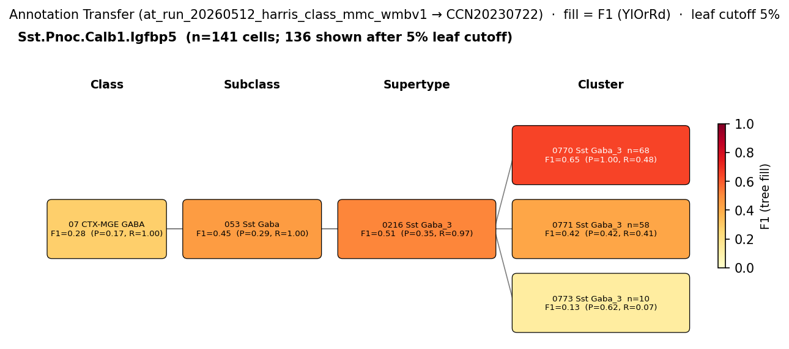
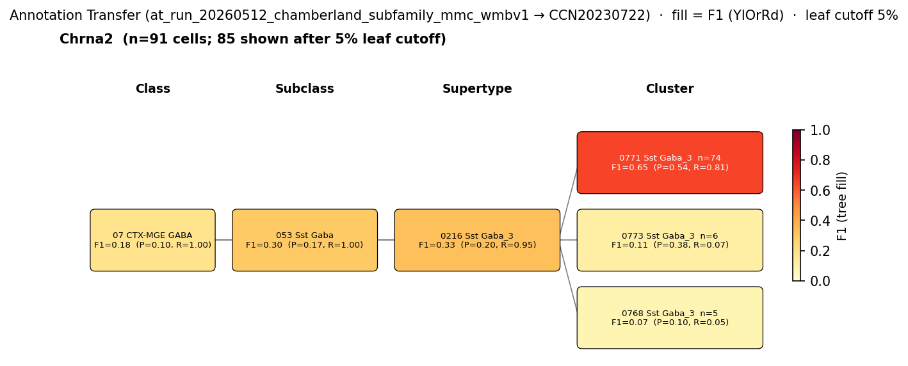

# Oriens-Lacunosum Moleculare (O-LM) cell — WMBv1 (CCN20230722) Mapping Report
*2026-04-09 · Source: `kb/graphs/hippocampus/hippocampus_GABAergic_interneurons.yaml`*

---

## Introduction

Oriens-Lacunosum Moleculare (O-LM) cells are Sst-expressing GABAergic interneurons of the hippocampal CA1 region whose somata sit in stratum oriens and whose axons project to stratum lacunosum-moleculare, where they inhibit the apical tuft of pyramidal cells [1][2][3][4][5][6]. Establishing how this classical, multimodally-defined population maps onto the WMBv1 transcriptomic taxonomy is a prerequisite for cross-walk between decades of slice physiology and ontology-driven cell-type frameworks.

### Classical type table

| Property | Value | References |
|---|---|---|
| Soma location | CA1 stratum oriens [UBERON:0014552]; CA1 stratum lacunosum moleculare [UBERON:0014557] | [1][2][3][4][5][6][7] |
| NT | GABAergic | [4] |
| Markers | Sst, Chrna2, Reln | Sst [4][8][5][6]; Chrna2 [6][4]; Reln [4] |
| Negative markers | Pvalb | — |
| Neuropeptides | Sst, Npy, Pnoc | [4] |
| CL term | — (no Cell Ontology term currently covers OLM cell) | — |

Details — source evidence for classical type properties

- **Soma location:** Friend et al. 2019 — *Electrophysiological Properties and Function* · [1]
  > Hippocampal CA1 stratum oriens interneuron subtypes include oriens lacunosum-moleculare (O-LM) interneurons, which can be identified by the expression of somatostatin and have regular-to-fast action potential spiking patterns (Oren et al., 2009)(Nicholson et al., 2014)(Huh et al., 2016). O-LM cell soma and dendrites reside in the stratum oriens and their axons project to the stratum lacunosum-moleculare layer
  > — Friend et al. 2019, Electrophysiological Properties and Function · [1] <!-- quote_key: 116862536_5f5f2ae8 -->
- **Soma location:** Tecuatl et al. 2020 — *Projection Patterns and Connectivity* · [2]
  > CA1 oriens-lacunosum moleculare (O-LM) interneurons innervate only the apical tuft of pyramidal cells (PCs) in stratum lacunosum-moleculare (SLM) and receive inputs only in stratum oriens (SO) (McBain et al., 1994)(Losonczy et al., 2002)(Zemankovics et al., 2010).
  > — Tecuatl et al. 2020, Projection Patterns and Connectivity · [2] <!-- quote_key: 229694907_6865b9db -->
- **Soma location:** Bezaire et al. 2016 — *Molecular Markers and Gene Expression* · [3]
  > oriens-lacunosum moleculare (O-LM) cells (these SOM+ cells project to the distal dendrites in the stratum lacunosum-moleculare though their somata are located in the stratum oriens)
  > — Bezaire et al. 2016, Molecular Markers and Gene Expression · [3] <!-- quote_key: 4776309_dd48b1ec -->
- **NT type:** Winterer et al. 2019 — *Results 3.3* · [4]
  > Independent of the Cre line used for cell collection, we found consistent expression of GABA release‐related Gad1, Gad2 and Slc6a1 in all OLM interneurons. By contrast, glutamate release‐related vesicular glutamate transporter Slc17a7 (detected in 2/46 cells) and Slc17a6 (detected in 1/46 cells) genes were virtually not expressed across the whole population.
  > — Winterer et al. 2019, Results 3.3 · [4] <!-- quote_key: 201041756_1d024a35 -->
- **Sst marker:** Winterer et al. 2019 — *Results 3.3* · [4]
  > we found consistent expression of Sst and Reln, and sparse expression of Pvalb across both OLM neuron types
  > — Winterer et al. 2019, Results 3.3 · [4] <!-- quote_key: 201041756_2d5a5fb3 -->
- **Chrna2 marker:** Nichol et al. 2018 — *Anatomical Location and Morphology* · [6]
  > The nicotinic acetylcholine receptor alpha2 subunit (Chrna2) is a specific marker for oriens lacunosum-moleculare (OLM) interneurons in the dorsal CA1 region of the hippocampus
  > — Nichol et al. 2018, Anatomical Location and Morphology · [6] <!-- quote_key: 3591966_644f1e68 -->
- **Chrna2 marker:** Winterer et al. 2019 — *Results 3.3* · [4]
  > as well as expression of Chrna2, which has been used as a marker for hippocampal OLM interneurons
  > — Winterer et al. 2019, Results 3.3 · [4] <!-- quote_key: 201041756_bd56f851 -->
- **Npy neuropeptide:** Winterer et al. 2019 — *Molecular Markers and Gene Expression* · [4]
  > we found a surprisingly consistent expression of Npy in OLMs
  > — Winterer et al. 2019, Molecular Markers and Gene Expression · [4] <!-- quote_key: 201041756_8d16e821 -->
- **Pnoc neuropeptide:** Winterer et al. 2019 — *Results 3.3* · [4]
  > we detected Pnoc in both Htr3aCre‐OLM (14/23) and SstCre‐OLM (13/23)
  > — Winterer et al. 2019, Results 3.3 · [4] <!-- quote_key: 201041756_1d20426d -->

### Cell Ontology mapping

No Cell Ontology term currently covers this type — candidate for a new CL term.

---

## Results

One supertype candidate edge was assessed; CS20230722_SUPT_0216 (0216 Sst Gaba_3) is the primary mapping at MODERATE confidence with PARTIAL_OVERLAP, reflecting that the supertype pools OLM cells together with other Sst-positive interneurons (bistratified, hippocampo-septal) that are not separable at supertype resolution.

*F1 across taxonomy levels for the 1 source group (Yao 2021 SSv4 "Sst") relevant to the OLM cell mapping. The Sst subclass is highly resolved at SUBCLASS level (F1=0.983 onto SUBC_053 Sst Gaba) but splits at SUPERTYPE level between SUPT_0219 (Sst Gaba_6, F1=0.759) and SUPT_0216 (Sst Gaba_3, F1=0.488), consistent with Yao's coarse "Sst" label encompassing several Sst interneuron types.*

*F1 for the 1 Harris 2018 Class (Sst.Pnoc.Calb1.Igfbp5, the published OLM-type cluster) onto WMBv1. High recall onto SUPT_0216 Sst Gaba_3 (group_purity 0.965) corroborates the Yao 2021 supertype assignment; low precision reflects that the WMBv1 supertype contains additional Sst types beyond the Harris OLM cluster.*

*F1 for the 1 Chamberland per-cluster subfamily (Chrna2-OLM, derived from Harris cluster-mean Sst+/Chrna2+ gene-pair rules) onto WMBv1. The Chrna2 subfamily sub-resolves to CLUS_0771 Sst Gaba_3 with F1=0.649 (group_purity 0.813), identifying a candidate cluster-level home for the Chrna2-OLM subset inside SUPT_0216.*

### Mapping candidates table

| Rank | WMBv1 cluster | Supertype | Cells (10x) | Confidence | Key property alignment | Verdict |
|---:|---|---|---:|---|---|---|
| 1 | — (supertype-level) | 0216 Sst Gaba_3 [CS20230722_SUPT_0216] | 2712 | 🟡 MODERATE | Sst CONSISTENT · Reln CONSISTENT · Chrna2 APPROXIMATE | Best candidate (PARTIAL_OVERLAP) |

*Total: 1 edge; relationship PARTIAL_OVERLAP.*

### Property alignment table — 0216 Sst Gaba_3 [CS20230722_SUPT_0216]

**Table 1 — Property comparison.**

| Property | Classical | Supertype | Best cluster | Alignment |
|---|---|---|---|---|
| NT type | GABAergic | GABA | not assessed | CONSISTENT |
| Soma location (CA1 stratum oriens) | CA1 stratum oriens [UBERON:0014552] — soma | CA1 stratum oriens (MBA:399, 818 cells) | not assessed | CONSISTENT |
| Sst (marker) | Sst — defining marker | Sst subclass; precomputed mean 11.44 | not assessed | CONSISTENT |
| Chrna2 (marker) | Chrna2 — defining marker | not in supertype defining_markers; scattered expression in Sst Gaba_3; precomputed mean 1.53 | not assessed | APPROXIMATE |
| Reln (marker) | Reln — defining marker (RT-PCR in OLM, PMID:31420995) | Reln in DEFINING markers; precomputed mean 7.90 | not assessed | CONSISTENT |
| Sst (neuropeptide) | Sst — neuropeptide | Sst subclass defining; precomputed mean 11.44 | not assessed | CONSISTENT |
| Pvalb (negative marker) | Pvalb — low/absent | Sst subclass (not Pvalb subclass); precomputed mean 1.48 | not assessed | CONSISTENT |
| Sex ratio | not documented | not available | not available | NOT_ASSESSED |

**Table 2 — Evidence support.**

| Evidence | Type | Supports | Headline | Source |
|---|---|---|---|---|
| Atlas metadata — Sst subclass + CA1 SO soma + Reln defining | Atlas metadata | PARTIAL | OLM cells fall in Sst subclass; SO-CA1 primary location; bistratified + HS contamination | atlas-internal |
| Atlas precomputed expression cross-check | Atlas metadata | SUPPORT | Sst=11.44, Reln=7.90, Chrna2=1.53, Pvalb=1.48; Npy=5.07, Pnoc=3.69 | atlas-internal |
| Yao 2021 SSv4 Sst → WMBv1 AT | Annotation transfer | PARTIAL | F1=0.488 at SUPT_0216 (83/273 Sst cells; SUBC F1=0.983) | atlas-internal |
| Harris 2018 Sst.Pnoc.Calb1.Igfbp5 → WMBv1 AT | Annotation transfer | SUPPORT | F1=0.514 at SUPT_0216 (group_purity 0.965) | atlas-internal |
| Chamberland Chrna2-OLM (per-cluster) → WMBv1 AT | Annotation transfer | SUPPORT | F1=0.649 at CLUS_0771 (group_purity 0.813) | atlas-internal |

*(Child-cluster breakdown not assessed at supertype level — the Chamberland Chrna2 subfamily AT result identifies CLUS_0771 inside SUPT_0216 as the candidate Chrna2-OLM home, but a full enumeration of the supertype's other child clusters and their classical-type assignments was not collected. See proposed experiments.)*

### 0216 Sst Gaba_3 [CS20230722_SUPT_0216] · 🟡 MODERATE

**Supporting evidence:**

- Atlas metadata places SUPT_0216 in the Sst subclass with GABA neurotransmitter type and a primary CA1 stratum oriens soma distribution (818 cells), aligning with the canonical OLM soma layer. Reln appears in the supertype's DEFINING markers, consistent with Winterer et al.'s RT-PCR detection of Reln in OLM cells [4].
- Precomputed expression cross-check confirms the OLM marker profile at supertype level: Sst=11.44, Reln=7.90 (both high), Chrna2=1.53 (low but present), Pvalb=1.48 (effectively absent at the Sst subclass), Npy=5.07, Pnoc=3.69 — i.e. all three classical neuropeptides are detected in line with Winterer's findings [4].
- Yao 2021 (GSE185862) SSv4 annotation transfer routes 83/273 hippocampal "Sst" cells onto SUPT_0216 with target_purity=1.0 (group_purity 0.323; F1 0.488); at the SUBCLASS level, the same Sst population maps to SUBC_053 Sst Gaba at F1=0.983, anchoring the supertype's Sst identity.
- Harris 2018 (GSE99888) Class Sst.Pnoc.Calb1.Igfbp5 — the published OLM-type cluster (n=254) — maps to SUPT_0216 at group_purity=0.965, an independent corroboration that the Harris-defined OLM cluster concentrates within Sst Gaba_3.
- Chamberland per-cluster Chrna2-OLM subfamily labels (Sst+/Chrna2+ gene-pair on Harris cluster means; n=153) sub-resolve to CLUS_0771 Sst Gaba_3 at F1=0.649 (group_purity 0.813), identifying a candidate cluster-level Chrna2-OLM home inside SUPT_0216.

**Marker evidence provenance:**

- **Sst (defining marker, neuropeptide):** Transcript-level evidence in Winterer et al. [4] from Cre-line-identified OLM cells; additional citations [5][6][8] support Sst as defining. Atlas precomputed mean = 11.44 confirms abundant expression. No discrepancy.
- **Chrna2 (defining marker):** Transcript-level (Winterer scRT-PCR [4]; Nichol et al. [6] designate Chrna2 as a *specific* OLM marker in dorsal CA1). Atlas precomputed mean = 1.53 at supertype level (low but present); ABC Atlas spatial filter retains Sst Gaba_3 but not Sst Gaba_6, consistent with scattered Chrna2+ cells within Sst Gaba_3. APPROXIMATE alignment reflects the supertype averaging across Chrna2+ and Chrna2− Sst subtypes; cluster-level resolution (CLUS_0771 from Chamberland AT) is required to recover the OLM-specific signal.
- **Reln (defining marker):** Transcript-level (Winterer scRT-PCR [4]) on Cre-identified OLM cells. Atlas precomputed mean = 7.90; Reln is in the supertype's DEFINING marker set. CONSISTENT.
- **Pvalb (negative marker):** No specific primary citation on the node for Pvalb as a negative marker, but Winterer [4] reports sparse Pvalb expression across both OLM neuron types (consistent with low/absent at population level). Atlas precomputed mean = 1.48 (effectively absent at Sst subclass) — CONSISTENT. Flag: targeted literature search may strengthen this.
- **Npy (neuropeptide):** Transcript-level (Winterer [4]). Atlas precomputed mean = 5.07. Note species caveat in node `notes`: Npy expression is consistent in mouse but absent in rat. CONSISTENT in mouse.
- **Pnoc (neuropeptide):** Transcript-level (Winterer [4], detected in 14/23 Htr3aCre and 13/23 SstCre OLM cells). Atlas precomputed mean = 3.69. CONSISTENT.

**Concerns:**

- DISTRIBUTED_ACROSS_CLUSTERS caveat: SUPT_0216 contains at least three classical hippocampal cell types — OLM, bistratified, and hippocampo-septal — that are not separable at supertype level. The supertype-level edge therefore represents the best metadata-driven resolution but cannot uniquely identify OLM cells. *(note: this is transcriptomic continuity within the Sst subclass; cluster-level annotation transfer is the path to disambiguation.)*
- Prosubiculum (259 cells) and posterior amygdala (780 cells) are prominent in this supertype, while classical OLM characterisation is primarily in CA1. The non-CA1 cells in this supertype likely include non-OLM Sst interneurons. *(note: a population-composition caveat, not a contradiction of the CA1 OLM mapping itself.)*
- Yao 2021 SSv4 "Sst" label is a coarse mixed-subtype population (n=273 HIP cells, includes OLM, bistratified, HS, oriens-oriens and others); F1=0.488 at SUPT_0216 versus F1=0.759 at SUPT_0219 (Sst Gaba_6) raises a quantitative uncertainty about whether OLM cells preferentially home to SUPT_0216 or SUPT_0219, which the Yao label alone cannot resolve.
- Chrna2 alignment is APPROXIMATE at supertype level (precomputed mean 1.53; scattered expression across Sst Gaba_3 child clusters). The OLM-specific Chrna2+ population is sub-supertype in scale.

**What would upgrade confidence:**

- Cluster-level MapMyCells annotation transfer of a morphology- or Cre-line-confirmed OLM dataset (e.g. Chrna2-Cre or Htr3a-Cre / Sst-Cre OLM samples from Winterer et al. [4]) onto WMBv1 — target F1 ≥ 0.80 at CLUSTER level inside SUPT_0216, expected output AnnotationTransferEvidence. This would disambiguate OLM from bistratified and HS cells inside SUPT_0216 and confirm or refute CLUS_0771 as the Chrna2-OLM cluster.
- Targeted Chrna2-Cre patch-seq or in-situ validation on the candidate CLUS_0771 (Sst Gaba_3) child cluster — would add MorphElectroEvidence / MarkerAnalysisEvidence tying cluster identity to OLM morphology.
- Resolution of the Yao 2021 SUPT_0216 vs SUPT_0219 split: annotation transfer of an OLM-enriched source (e.g. Chrna2-Cre Yao SMART-seq subset, if available) would clarify which supertype contains the OLM-specific signal.
- Targeted literature search for a primary citation testing Pvalb negativity on morphology-confirmed OLM cells — current evidence is implicit in Winterer's "sparse Pvalb" finding [4] rather than from a dedicated study.

---

### Methods

Data sources, analyses, and reproducibility receipts

**Classical type definition.** The OLM cell as represented here is defined as CLASSICAL_MULTIMODAL: GABAergic [4]; defining markers Sst [4][8][5][6], Chrna2 [6][4], and Reln [4]; negative marker Pvalb; neuropeptides Sst, Npy, Pnoc [4]; soma in CA1 stratum oriens [UBERON:0014552] with axon to CA1 stratum lacunosum-moleculare [UBERON:0014557] [1][2][3][4][5][6][7]. The node carries curator notes flagging molecular heterogeneity (a PV+ subpopulation with distinct theta vs gamma coupling), a mouse/rat species difference for Npy, the Ndnf::Nkx2-1 intersection that selectively targets OLM cells, and at least 3 Chrna2+ subclusters.

**Atlas mapping query.** Candidate atlas clusters were retrieved from the WMBv1 (CCN20230722) taxonomy at ranks 0 (cluster) and 1 (supertype) using metadata-based scoring (region match, NT type, defining markers, sex bias when applicable). Full scoring rules: `workflows/map-cell-type.md`.

**Property alignment.** Each defining property of the classical type was compared to the corresponding atlas-side value via the `property_comparisons` schema, with alignments graded CONSISTENT / APPROXIMATE / DISCORDANT / NOT_ASSESSED. Atlas-side numerical values came from precomputed expression on the cluster (cluster.yaml in the taxonomy reference store) and from MERFISH spatial registration for soma location.

**Annotation transfer.**

| Field | Value |
|---|---|
| Source dataset | GEO:GSE185862 (Yao 2021 SSv4 HIP "Sst" subclass) |
| Source species | NCBITaxon:10090 |
| Target atlas | WMBv1 (CCN20230722) |
| Method | MapMyCells local (cell_type_mapper, default parameters, raw normalization, 100 bootstrap iterations). |
| Tool version | cell_type_mapper |
| Bootstrap threshold | 0.0 |
| n cells | 6398 (filtered to 6398) |
| Run record | [`kb/annotation_transfer_runs/at_run_20260508_yao2021_hpf_ssv4_mmc_wmbv1/manifest.yaml`](../../kb/annotation_transfer_runs/at_run_20260508_yao2021_hpf_ssv4_mmc_wmbv1/manifest.yaml) |
| Script (external) | README.md |
| Code reference | [https://github.com/AllenInstitute/cell_type_mapper](https://github.com/AllenInstitute/cell_type_mapper) |
| F1 matrix | [`f1_scores_best.csv`](../../kb/annotation_transfer_runs/at_run_20260508_yao2021_hpf_ssv4_mmc_wmbv1/f1_scores_best.csv) |

| Field | Value |
|---|---|
| Source dataset | GEO:GSE99888 (Harris 2018 published Class labels, 49 fine-grained subtypes, 3663 CA1 inhibitory neurons) |
| Source species | NCBITaxon:10090 |
| Target atlas | WMBv1 (CCN20230722; SHA-256: b21ca985) |
| Method | MapMyCells (cell_type_mapper v1.7.1, default parameters, raw normalization, bootstrap_iteration=100). |
| Tool version | cell_type_mapper v1.7.1 |
| Bootstrap threshold | 0.8 |
| n cells | 3663 (filtered to 3663) |
| Run record | [`kb/annotation_transfer_runs/at_run_20260512_harris_class_mmc_wmbv1/manifest.yaml`](../../kb/annotation_transfer_runs/at_run_20260512_harris_class_mmc_wmbv1/manifest.yaml) |
| Script (external) | ../at_run_20260506_harris_chamberland_mmc_wmbv1/README.md |
| Code reference | [https://github.com/AllenInstitute/cell_type_mapper](https://github.com/AllenInstitute/cell_type_mapper) |
| F1 matrix | [`f1_matrix_harris_class.csv`](../../kb/annotation_transfer_runs/at_run_20260512_harris_class_mmc_wmbv1/f1_matrix_harris_class.csv) |
| Caveats | This run record scores Harris 2018's *published Class labels* against WMBv1; the companion `at_run_20260512_chamberland_subfamily_mmc_wmbv1` scores the same MMC output under Chamberland 2024 in-silico gene-pair subfamily labels. |

| Field | Value |
|---|---|
| Source dataset | GEO:GSE99888 (Chamberland 2024 in-silico per-cluster subfamily labels derived from Harris 2018) |
| Source species | NCBITaxon:10090 |
| Target atlas | WMBv1 (CCN20230722; SHA-256: b21ca985) |
| Method | MapMyCells (cell_type_mapper v1.7.1, default parameters, raw normalization, bootstrap_iteration=100). Per-cluster gene-pair labels (Chrna2 > Ndnf > Sst_Nos1 > Sst_Tac1 priority). |
| Tool version | cell_type_mapper v1.7.1 |
| Bootstrap threshold | 0.8 |
| n cells | 3663 (filtered to 3663) |
| Run record | [`kb/annotation_transfer_runs/at_run_20260512_chamberland_subfamily_mmc_wmbv1/manifest.yaml`](../../kb/annotation_transfer_runs/at_run_20260512_chamberland_subfamily_mmc_wmbv1/manifest.yaml) |
| Script (external) | ../at_run_20260506_harris_chamberland_mmc_wmbv1/README.md |
| Code reference | [https://github.com/AllenInstitute/cell_type_mapper](https://github.com/AllenInstitute/cell_type_mapper) |
| F1 matrix | [`f1_matrix_chamberland_by_class.csv`](../../kb/annotation_transfer_runs/at_run_20260512_chamberland_subfamily_mmc_wmbv1/f1_matrix_chamberland_by_class.csv) |
| Caveats | Per-cluster derivation is the primary result (dropout-robust, gene-pair rules on Harris cluster means). Headline: Chrna2-OLM → CLUS_0771 (F1 0.65). |

**Anti-hallucination.** All citations, atlas accessions, ontology CURIEs, and verbatim literature quotes in this report are validated against the evidencell knowledge base at write time. Authored-prose evidence narratives are validated against their source `evidence_items[*].explanation` fields. The pre-write hook rejects any unresolvable identifier or unattributed blockquote. Specific mapping limitations and caveats are documented per-candidate in the Discussion section.

*Generated by evidencell `01f89d6` at 2026-05-13T15:46:15+00:00 from [kb/graphs/hippocampus/hippocampus_GABAergic_interneurons.yaml](kb/graphs/hippocampus/hippocampus_GABAergic_interneurons.yaml).*

**Evidence base table.**

| Edge ID | Evidence types | Supports | Source |
| --- | --- | --- | --- |
| edge_olm_cell_ca1_to_CS20230722_SUPT_0216 | ATLAS_METADATA; ATLAS_METADATA; ANNOTATION_TRANSFER; ANNOTATION_TRANSFER; ANNOTATION_TRANSFER | PARTIAL; SUPPORT; PARTIAL; SUPPORT; SUPPORT | atlas-internal |

---

## Discussion

**Primary mapping:** Oriens-Lacunosum Moleculare (O-LM) cell → 0216 Sst Gaba_3 [CS20230722_SUPT_0216] at MODERATE confidence. Key support: atlas metadata (Sst subclass, CA1 SO soma, Reln defining marker, marker precomputed-stats cross-check) and three independent MapMyCells annotation transfers (Yao 2021 SSv4 Sst at SUBCLASS F1=0.983 and SUPERTYPE F1=0.488; Harris 2018 Sst.Pnoc.Calb1.Igfbp5 group_purity 0.965 at SUPT_0216; Chamberland Chrna2-OLM F1=0.649 at CLUS_0771). Key caveats: DISTRIBUTED_ACROSS_CLUSTERS (SUPT_0216 also contains bistratified and hippocampo-septal Sst interneurons) and non-CA1 cell-composition (prosubiculum + posterior amygdala fractions).

No Cell Ontology term currently assigned. The node `notes` field indicates that CL:4023017 'sst GABAergic interneuron' is the nearest superclass but does not capture OLM-specific morphology — making OLM a candidate for a new CL term request.

### Proposed experiments and follow-ups

Cross-checking against existing evidence: three MapMyCells annotation transfers are already on this edge (Yao 2021 SSv4 Sst, Harris 2018 Class, Chamberland per-cluster subfamily). What remains unresolved is cluster-level OLM-specific assignment within SUPT_0216.

- **What:** MapMyCells annotation transfer using a morphology- or Cre-line-confirmed OLM source dataset (Chrna2-Cre, Htr3a-Cre, or SstCre + post-hoc morphological reconstruction — e.g. Winterer et al. [4] OLM cells).
  **Target:** F1 ≥ 0.80 at CLUSTER level for a single WMBv1 cluster inside SUPT_0216 (candidate CLUS_0771 from the Chamberland Chrna2 result).
  **Expected output:** AnnotationTransferEvidence on a cluster-level edge.
  **Resolves:** disambiguation of OLM from bistratified and HS Sst interneurons within SUPT_0216; confirmation of CLUS_0771 as the Chrna2-OLM cluster.
- **What:** Resolution of the Yao 2021 SUPT_0216 vs SUPT_0219 (Sst Gaba_6) split via an OLM-enriched source subset.
  **Target:** F1 stratification showing OLM-specific routing to one supertype.
  **Expected output:** AnnotationTransferEvidence with subtype-resolved source labels.
  **Resolves:** open question 1 below.
- **What:** Targeted literature cite-traversal for a primary, morphology-confirmed Pvalb-negativity study in OLM cells.
  **Target:** LITERATURE evidence with method = scRT-PCR or IHC on morphology-confirmed OLM neurons.
  **Expected output:** LiteratureEvidence on the negative marker.
  **Resolves:** weak primary-source coverage for the Pvalb-negative defining property.

### Open questions

1. Within the Yao 2021 SSv4 "Sst" mapping, do OLM cells preferentially populate SUPT_0216 (Sst Gaba_3) or SUPT_0219 (Sst Gaba_6)? The current AT (mixed-subtype Sst label) cannot resolve this.
2. Which WMBv1 child clusters of SUPT_0216 correspond to OLM, bistratified, and hippocampo-septal cells respectively? The Chamberland Chrna2-OLM result nominates CLUS_0771 for OLM but a full child-cluster enumeration was not collected here.
3. Does the prosubiculum and posterior amygdala component of SUPT_0216 represent OLM-like cells outside CA1, or distinct non-OLM Sst populations? *(note: classical OLM characterisation is CA1-specific, so the most parsimonious reading is the latter.)*

---

## References

| # | Citation | PMID | Used for |
|---|---|---|---|
| [1] | Friend et al. 2019 | [30987110](https://pubmed.ncbi.nlm.nih.gov/30987110) | soma location |
| [2] | Tecuatl et al. 2020 | [33361464](https://pubmed.ncbi.nlm.nih.gov/33361464) | soma location |
| [3] | Bezaire et al. 2016 | [28009257](https://pubmed.ncbi.nlm.nih.gov/28009257) | soma location |
| [4] | Winterer et al. 2019 | [31420995](https://pubmed.ncbi.nlm.nih.gov/31420995) | soma location, NT type, Sst/Chrna2/Reln markers, Pvalb negative, Sst/Npy/Pnoc neuropeptides |
| [5] | Leão et al. 2012 | [23042082](https://pubmed.ncbi.nlm.nih.gov/23042082) | soma location, Sst marker |
| [6] | Nichol et al. 2018 | [29487503](https://pubmed.ncbi.nlm.nih.gov/29487503) | soma location, Chrna2 marker |
| [7] | Chamberland et al. 2024 | [38640347](https://pubmed.ncbi.nlm.nih.gov/38640347) | soma location |
| [8] | Chamberland et al. 2023 | [37162922](https://pubmed.ncbi.nlm.nih.gov/37162922) | Sst marker |
