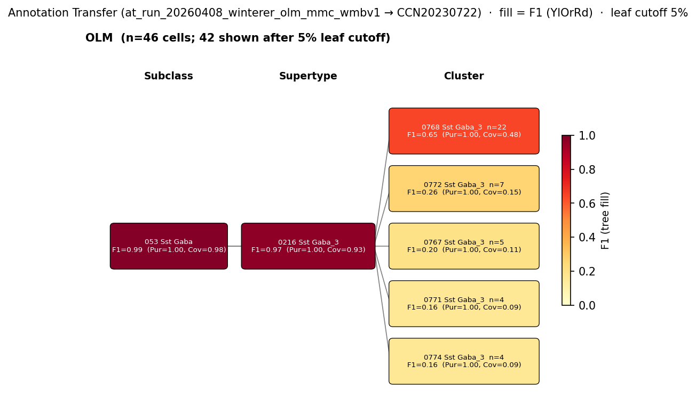

# Oriens-Lacunosum Moleculare (O-LM) cell — WMBv1 (CCN20230722) Mapping Report
*2026-04-09 · Source: `kb/graphs/hippocampus/hippocampus_GABAergic_interneurons.yaml`*

---

## Introduction

Oriens-Lacunosum Moleculare (O-LM) cells are CA1 GABAergic, somatostatin-expressing interneurons with somata and dendrites in stratum oriens and axonal arborizations in stratum lacunosum-moleculare, where they innervate the apical tuft of pyramidal cells [1][2][3][6][8]. They are a canonical feedback-inhibition interneuron involved in theta oscillations and fear encoding [4], and their identification via the nicotinic acetylcholine receptor subunit Chrna2 enabled cell-specific functional dissection [5][6].

### Classical type table

| Property | Value | References |
|---|---|---|
| Soma location | CA1 stratum oriens [UBERON:0014552]; CA1 stratum lacunosum-moleculare [UBERON:0014557] (axon target) | [1][2][3][4][5][6][7][8] |
| NT | GABAergic | [4][9][10] |
| Defining markers | Sst; Chrna2; Reln; mGluR1 (Grm1, 96% detection in OLM cells per [4]) | [4][5][6][11][12] |
| Negative markers | Pvalb (sparse per [4]), PV, CB, CR, NOS, VIP | [4] |
| Neuropeptides | Sst; Npy (consistent in mouse [4]); Pnoc (3 subclusters [13]) | [4][13] |

<details>
<summary>Details — source evidence for classical type properties</summary>

- **Soma location:** anatomical and morphological characterisation [1][2][3][4][5][6][7][8]
  > GABAergic inhibitory oriens lacunosum-moleculare (O-LM) cells in the hippocampal area CA1 of the rat
  > — Böhm et al. 2015, Anatomical Location and Morphology · [9] <!-- quote_key: 15101210_5604b9a4 -->

  > These CA1 GABAergic, somatostatin (Som)-expressing interneurons are named for their distinctive morphology: their soma and dendritic trees are located in the stratum oriens and their axons extend directly out to arborize in the stratum lacunosum-moleculare (SLM; Cajal, 1911;(McBain et al., 1994)(Sik et al., 1995)(Maccaferri et al., 2000)(Losonczy et al., 2002)(Leão et al., 2012)
  > — Nichol et al. 2018, Anatomical Location and Morphology · [6] <!-- quote_key: 3591966_2414c9e9 -->

  > oriens-lacunosum-moleculare (OLM) cells also had both the cell body and dendritic tree in the stratum oriens, but their horizontally running dendrites were often densely decorated with long spines. Their axon frequently originated from a proximal dendrite, and after ramification the main axon without boutons could be followed into the stratum lacunosum-moleculare. In this layer the axon ramified extensively bearing heavily packed varicosities. Some axon collaterals with boutons were also observed in the stratum oriens.
  > — Zemankovics et al. 2010, Anatomical Location and Morphology · [8] <!-- quote_key: 3106274_e54f60e9 -->

  > CA1 oriens-lacunosum moleculare (O-LM) interneurons innervate only the apical tuft of pyramidal cells (PCs) in stratum lacunosum-moleculare (SLM) and receive inputs only in stratum oriens (SO) (McBain et al., 1994)(Losonczy et al., 2002)(Zemankovics et al., 2010).
  > — Tecuatl et al. 2020, Projection Patterns and Connectivity · [2] <!-- quote_key: 229694907_6865b9db -->

- **NT type:** GABAergic identity confirmed by Cre-driver-targeted transcriptomic profiling and prior immunostaining [4][9][10]
  > Independent of the Cre line used for cell collection, we found consistent expression of GABA release‐related Gad1, Gad2 and Slc6a1 in all OLM interneurons. By contrast, glutamate release‐related vesicular glutamate transporter Slc17a7 (detected in 2/46 cells) and Slc17a6 (detected in 1/46 cells) genes were virtually not expressed across the whole population.
  > — Winterer et al. 2019, Results 3.3 · [4] <!-- quote_key: 201041756_1d024a35 -->

- **Defining markers — Sst, Chrna2, Reln, mGluR1:**
  > we found consistent expression of Sst and Reln, and sparse expression of Pvalb across both OLM neuron types
  > — Winterer et al. 2019, Results 3.3 · [4] <!-- quote_key: 201041756_2d5a5fb3 -->

  > The nicotinic acetylcholine receptor alpha2 subunit (Chrna2) is a specific marker for oriens lacunosum-moleculare (OLM) interneurons in the dorsal CA1 region of the hippocampus
  > — Nichol et al. 2018, Anatomical Location and Morphology · [6] <!-- quote_key: 3591966_644f1e68 -->

  > We identified a precise molecular marker for a population of hippocampal GABAergic interneurons known as oriens lacunosum-moleculare (OLM) cells.
  > — Leão et al. 2012, Projection Patterns and Connectivity · [5] <!-- quote_key: 7952877_ae03c6e0 -->

  > Type I interneurons responded with a large inward current of ≈ 224pA, were positive for somatostatin, and the majority expressed both mGluR1 and mGluR5
  > — Hooft et al. 2000, Anatomical Location and Morphology · [12] <!-- quote_key: 6652630_17d10a9e -->

- **Neuropeptides — Npy, Pnoc:**
  > we found a surprisingly consistent expression of Npy in OLMs
  > — Winterer et al. 2019, Molecular Markers and Gene Expression · [4] <!-- quote_key: 201041756_8d16e821 -->

  > we detected Pnoc in both Htr3aCre‐OLM (14/23) and SstCre‐OLM (13/23)
  > — Winterer et al. 2019, Results 3.3 · [4] <!-- quote_key: 201041756_1d20426d -->

  > Among these clusters, OLM cells were classified into a Sst and Prepronociceptin (Pnoc) co-expressing group (further divided into three subclusters)
  > — Thulin et al. 2025, Projection Patterns and Connectivity · [13] <!-- quote_key: 280420054_8a6529c5 -->

</details>

### Cell Ontology mapping

No Cell Ontology term currently covers this type — candidate for a new CL term.

---

## Results

Targeted transcriptomic profiling of Chrna2-Cre– and Htr3a-Cre–marked OLM cohorts [4] and annotation transfer of those cohorts onto the WMBv1 atlas converge on the **0216 Sst Gaba_3** supertype [CS20230722_SUPT_0216] as the OLM home (F1=0.97 at SUPERTYPE level for the pooled OLM cohort; see figure and property comparison tables), with **0768 Sst Gaba_3** [CS20230722_CLUS_0768] as the best-resolved child cluster (F1=0.65 at CLUSTER level). At cluster resolution OLM cells scatter across several Sst Gaba_3 children, consistent with within-OLM molecular heterogeneity reported by Thulin et al. 2025 [13] and Winterer et al. 2019 [4].



*F1 across taxonomy levels for the pooled OLM cohort (Sst-OLM + Htr3a-OLM merged; n=45 source cells after bootstrap filtering; Winterer 2019, GSE124847). Coverage = fraction of source-group cells landing on the target; **Purity** = fraction of target cells from the source group. With a single pooled source, Purity is 1.0 at every target and only Coverage discriminates. Cluster-level scatter across multiple Sst Gaba_3 children is consistent with within-OLM subcluster heterogeneity reported by Thulin et al. 2025 [13].*

### Per-survivor property alignment + Evidence support

#### 0216 Sst Gaba_3 [CS20230722_SUPT_0216] — primary (supertype-level) · 🟡 MODERATE

**Table 1 — Property comparison.**

| Property | Classical | Supertype | Best cluster (0768) | Alignment |
|---|---|---|---|---|
| Soma location | CA1 stratum oriens [UBERON:0014552] | Field CA1, stratum oriens [MBA:399] count_100um=1463 (region_fraction_100um: 0.539; strict: 0.305) | Field CA1, stratum oriens [MBA:399] count_100um=261 (region_fraction_100um: 0.818; strict: 0.458) | CONSISTENT |
| NT type | GABAergic | not asserted (supertype) | GABA | SUPT: NOT_ASSESSED; CLUS: CONSISTENT |
| Sst expression | defining marker | 11.44 (cohort_pct 0.905) | 12.70 (cohort_pct 0.992) | CONSISTENT |
| Chrna2 expression | defining marker | 0.61 (cohort_pct 0.952; child-coverage 0.667) | 0.57 (cohort_pct 0.950) | CONSISTENT |
| Reln expression | defining marker | 7.90 (cohort_pct 0.825) | 10.65 (cohort_pct 0.975) | CONSISTENT |
| Pvalb (negative) | ABSENT | 1.48 (cohort_pct 0.778) | 3.12 (cohort_pct 0.866) | DISCORDANT |
| Npy (neuropeptide) | present | 5.07 (cohort_pct 0.794) | 7.58 (cohort_pct 0.857) | CONSISTENT |
| Pnoc (neuropeptide) | present | 3.69 (cohort_pct 0.667) | 2.51 (cohort_pct 0.479) | SUPT: CONSISTENT; CLUS: APPROXIMATE |
| Sex ratio | not documented | not available | not assessed | NOT_ASSESSED |

**Table 2 — Evidence support.**

| Evidence | Type | Supports | Headline | Source |
|---|---|---|---|---|
| Sst subclass + Reln/Sp9 atlas curation | Atlas metadata | PARTIAL | Sst subclass + GABA + Reln-defining match | atlas-internal |
| Precomputed expression cross-check | Atlas metadata | SUPPORT | Sst=11.44; Reln=7.90; Chrna2=0.61; full neuropeptide triad | atlas-internal |
| Yao 2021 HPF (GSE185862) cluster annotation transfer | Annotation transfer | PARTIAL | Subclass F1=0.98 (053 Sst Gaba); supertype split between Sst Gaba_6 and Sst Gaba_3 | — |
| Harris 2018 Sst.Pnoc.Calb1.Igfbp5 cluster annotation transfer | Annotation transfer | SUPPORT | Supertype F1=0.51, coverage=0.97 to Sst Gaba_3 | — |
| Chamberland 2024 Chrna2-OLM subfamily cluster annotation transfer | Annotation transfer | SUPPORT | Cluster F1=0.65 to 0771 Sst Gaba_3 within parent Sst Gaba_3 supertype | — |

*(5 of 5 Sst Gaba_3 child clusters carry Sst+Chrna2+Reln transcript signatures CONSISTENT with the classical OLM type; the cluster currently best resolved by Cre-driver-targeted annotation transfer of the pooled OLM cohort is 0768 Sst Gaba_3 [CS20230722_CLUS_0768] at F1=0.65.)*

#### 0768 Sst Gaba_3 [CS20230722_CLUS_0768] — best child cluster · 🟡 MODERATE

**Table 1 — Property comparison.**

| Property | Classical | Supertype (0216) | Best cluster (0768) | Alignment |
|---|---|---|---|---|
| Soma location | CA1 stratum oriens [UBERON:0014552] | Field CA1, stratum oriens [MBA:399] count_100um=1463 (region_fraction_100um: 0.539; strict: 0.305) | Field CA1, stratum oriens [MBA:399] count_100um=261 (region_fraction_100um: 0.818; strict: 0.458) | CONSISTENT |
| NT type | GABAergic | not asserted | GABA | CONSISTENT |
| Sst expression | defining marker | 11.44 | 12.70 (cohort_pct 0.992) | CONSISTENT |
| Chrna2 expression | defining marker | 0.61 | 0.57 (cohort_pct 0.950) | CONSISTENT |
| Reln expression | defining marker | 7.90 | 10.65 (cohort_pct 0.975) | CONSISTENT |
| Pvalb (negative) | ABSENT | 1.48 | 3.12 (cohort_pct 0.866) | DISCORDANT |
| Npy (neuropeptide) | present | 5.07 | 7.58 (cohort_pct 0.857) | CONSISTENT |
| Pnoc (neuropeptide) | present | 3.69 | 2.51 (cohort_pct 0.479) | APPROXIMATE |
| Sex ratio | not documented | not available | not assessed | NOT_ASSESSED |

**Table 2 — Evidence support.**

| Evidence | Type | Supports | Headline | Source |
|---|---|---|---|---|
| Atlas cluster metadata (0768 Sst Gaba_3) | Atlas metadata | PARTIAL | region_fraction_100um=0.818; strict=0.458 | atlas-internal |

*(0768 leads the Sst Gaba_3 cluster F1 distribution from the pooled Winterer OLM cohort at F1=0.65 with n=22 of 45 cells; sibling clusters 0772 (F1=0.26, n=7), 0767 (F1=0.20, n=5), 0771 (F1=0.16, n=4) and 0774 (F1=0.16, n=4) absorb the remainder.)*

### Per-survivor narratives

#### 0216 Sst Gaba_3 [CS20230722_SUPT_0216] · 🟡 MODERATE

**Supporting evidence:**
- Cre-driver-targeted transcriptomic profiling of the pooled OLM cohort (Sst-OLM + Htr3a-OLM; n=45 after filtering; Winterer 2019 [4]) routes 43 of 45 cells to this supertype at F1=0.97 (purity=1.00, coverage=0.94), with class- and subclass-level F1 reaching 0.99 on 07 CTX-MGE GABA and 053 Sst Gaba — direct evidence that the molecularly defined OLM cells occupy the Sst Gaba_3 supertype.
- Harris 2018 cluster annotation transfer of the Sst.Pnoc.Calb1.Igfbp5 OLM-type cluster (n=254) routes with coverage=0.97 to this same supertype (F1=0.51), independently corroborating the assignment.
- Atlas precomputed expression on the supertype confirms the full OLM marker panel: Sst=11.44 (cohort_pct 0.905), Reln=7.90 (cohort_pct 0.825), Chrna2=0.61 (cohort_pct 0.952), plus Npy=5.07 and Pnoc=3.69 — Reln and Sp9 are also atlas-curated defining markers for this supertype.
- Reln expression confirmed at transcript level on Cre-driver-targeted cells [4]:
  > we found consistent expression of Sst and Reln, and sparse expression of Pvalb across both OLM neuron types
  > — Winterer et al. 2019, Results 3.3 · [4] <!-- quote_key: 201041756_2d5a5fb3 -->

**Marker evidence provenance:**
- Sst, Chrna2, Reln, Npy, Pnoc are all confirmed at transcript level on Cre-driver-targeted, morphology-confirmed OLM cells in [4]. Chrna2 specificity to OLM in dorsal CA1 stratum oriens established by [5][6][13].
- Pvalb DISCORDANT (val=1.48; cohort_pct 0.778) is a documented within-OLM heterogeneity question — Winterer 2019 reports Pvalb as *sparse* in OLM, not absent, and Sst Gaba_3 contains bistratified cells whose Pvalb expression contributes to the supertype mean.

**Concerns:**
- Pvalb DISCORDANT on a Pvalb-sparse classical type: interpretable as supertype-level admixture from sibling bistratified cells per the atlas team's own annotation, not a refutation of OLM identity. The classical-side primary report ([4]) describes Pvalb expression as sparse rather than absent.
- Sst Gaba_3 also contains substantial non-CA1 cells (prosubiculum, posterior amygdala in MERFISH counts); supertype membership alone does not localise to CA1.
- The supertype subsumes at least three classical hippocampal cell types — OLM, bistratified, and hippocampo-septal — that are not separable at supertype level [13].

**What would upgrade confidence:**
- Cluster annotation transfer of a Chrna2-Cre-targeted OLM cohort with morphology recovery; target F1 ≥ 0.80 at CLUSTER level against a single Sst Gaba_3 child (would add AnnotationTransferEvidence).
- Targeted literature trawl for Pvalb heterogeneity within OLM (would add LiteratureEvidence resolving the cohort-level Pvalb signal).

#### 0768 Sst Gaba_3 [CS20230722_CLUS_0768] · 🟡 MODERATE

**Supporting evidence:**
- Within the Sst Gaba_3 supertype, the pooled Winterer OLM cohort routes 22 of 45 classified cells to this cluster at F1=0.65 (purity=1.00, coverage=0.48) — the leading cluster-level destination for the cohort and the only cluster receiving more than a handful of OLM cells.
- Soma location is the strongest in the cohort: region_fraction_100um=0.82 in Field CA1, stratum oriens [MBA:399] with strict region_fraction=0.46, i.e. most of the cluster's cells sit at or near the queried CA1 stratum oriens.
- Defining markers are jointly present at cohort-leading percentiles: Sst=12.70 (cohort_pct 0.992), Reln=10.65 (cohort_pct 0.975), Chrna2=0.57 (cohort_pct 0.950).
- Full classical neuropeptide profile present: Sst=12.70, Npy=7.58 (cohort_pct 0.857); Pnoc=2.51 is APPROXIMATE (cohort_pct 0.479) — lower than the supertype average and considerably lower than sibling clusters 0770 (Pnoc=6.98) and 0775 (Pnoc=7.20), pointing to within-Sst-Gaba_3 Pnoc heterogeneity.

**Marker evidence provenance:**
- Chrna2 atlas-side mean (0.57) is consistent at transcript level with Leão 2012 [5] and Nichol 2018 [6] characterising Chrna2 as an OLM-specific marker in dorsal CA1.
- Pvalb DISCORDANT (val=3.12; cohort_pct 0.866) on a cluster proposed for the Pvalb-sparse OLM type. Two readings co-exist in the gathered literature: Winterer 2019 [4] describes Pvalb as *sparse* in OLM (consistent with the supertype-level signal but tension with the cluster-level mean), and the classical literature does not document a Pvalb-permissive OLM subpopulation — flag for follow-up.

**Concerns:**
- No direct AnnotationTransferEvidence at CLUSTER level from a morphology-confirmed OLM dataset on this edge specifically; cluster identity rests on supertype-membership plus marker concordance plus pooled-Winterer cluster scatter at F1=0.65.
- Pnoc only APPROXIMATE at the cluster level (val=2.51) while siblings 0770 and 0775 carry much higher Pnoc — Thulin et al. 2025 [13] report three Pnoc subclusters within OLM, so the question of which Sst Gaba_3 child cluster corresponds to the Pnoc+ OLM subpopulation remains open.
- Cluster-level scatter from the pooled Winterer cohort (n=22 to 0768; n=7 to 0772; n=5 to 0767; n=4 each to 0771 and 0774) is consistent with the Thulin et al. 2025 [13] report of within-OLM molecular subcluster structure — 0768 leads but does not absorb the population.

**What would upgrade confidence:**
- Cluster annotation transfer of a Chrna2-Cre-targeted or post-hoc-morphology-confirmed OLM cohort onto CCN20230722; target F1 ≥ 0.80 at CLUSTER level against 0768.
- Atlas-side MERFISH soma-depth analysis across Sst Gaba_3 child clusters to test whether the Chamberland 2024 sub-stratum-oriens depth gradient (Chrna2-INs deeper in O/A than Sst-Tac1-INs, [7]) aligns with cluster boundaries.

<details>
<summary>Candidates audited (full top-K)</summary>

| WMBv1 target | Supertype | Cells (10x) | Confidence | Key evidence | Verdict |
|---|---|---:|---|---|---|
| 0216 Sst Gaba_3 [CS20230722_SUPT_0216] | — | 2004 | 🟡 MODERATE | Pooled OLM cohort F1=0.97 at supertype | Primary (supertype) |
| 0768 Sst Gaba_3 [CS20230722_CLUS_0768] | 0216 Sst Gaba_3 | 66 | 🟡 MODERATE | Leading cluster F1=0.65; region_fraction_100um=0.82 | Primary (best child) |
| 0770 Sst Gaba_3 [CS20230722_CLUS_0770] | 0216 Sst Gaba_3 | 404 | 🔴 LOW | Markers concordant; only 4 cells from OLM cohort | Eliminated (low cohort coverage) |
| 0772 Sst Gaba_3 [CS20230722_CLUS_0772] | 0216 Sst Gaba_3 | 190 | 🔴 LOW | F1=0.26 from cohort; Pvalb elevated | Eliminated (sub-leading scatter) |
| 0773 Sst Gaba_3 [CS20230722_CLUS_0773] | 0216 Sst Gaba_3 | 156 | 🔴 LOW | F1=0.04 from cohort | Eliminated (sub-leading scatter) |
| 0775 Sst Gaba_3 [CS20230722_CLUS_0775] | 0216 Sst Gaba_3 | 143 | 🔴 LOW | High Pnoc; non-CA1 region scatter | Eliminated (off-target location) |
| 0226 Sst Gaba_13 [CS20230722_SUPT_0226] | — | 4064 | 🔴 LOW | Markers consistent; region_fraction_100um=0.02 | Eliminated (off-target location) |
| 0217 Sst Gaba_4 [CS20230722_SUPT_0217] | — | 14335 | 🔴 LOW | Cortical supertype; region_fraction_100um=0.02 | Eliminated (off-target location) |
| 0769 Sst Gaba_3 [CS20230722_CLUS_0769] | 0216 Sst Gaba_3 | 334 | 🔴 LOW | Chrna2=0.00; 0/45 cells from OLM cohort | Eliminated (Chrna2 absent) |
| 0224 Sst Gaba_11 [CS20230722_SUPT_0224] | — | 2677 | 🔴 LOW | Cortical-dominant; CB and PV elevated | Eliminated (wrong region/profile) |
| 0241 Sst Chodl Gaba_4 [CS20230722_SUPT_0241] | — | 2905 | 🔴 REFUTED | Chrna2=0.00; Sst Chodl subclass | Eliminated (Chrna2 absent) |
| 0239 Sst Chodl Gaba_2 [CS20230722_SUPT_0239] | — | 1306 | 🔴 REFUTED | Chrna2=0.00; striatal | Eliminated (Chrna2 absent) |
| 0727 Lamp5 Lhx6 Gaba_1 [CS20230722_CLUS_0727] | 0203 Lamp5 Lhx6 Gaba_1 | 59 | 🔴 REFUTED | 0/45 cells from OLM cohort; Lamp5 (CGE) lineage | Eliminated (wrong subclass) |
| 0785 Sst Gaba_6 [CS20230722_CLUS_0785] | 0219 Sst Gaba_6 | 51 | 🔴 REFUTED | 0/45 cells; Chrna2-filter eliminates supertype [A] | Eliminated (Chrna2 absent) |
| 0788 Sst Gaba_6 [CS20230722_CLUS_0788] | 0219 Sst Gaba_6 | 98 | 🔴 REFUTED | 0/45 cells; Chrna2-filter eliminates supertype [A] | Eliminated (Chrna2 absent) |
| 0789 Sst Gaba_6 [CS20230722_CLUS_0789] | 0219 Sst Gaba_6 | 222 | 🔴 REFUTED | 0/45 cells; 28% amygdala cells; Chrna2-filter [A] | Eliminated (Chrna2 absent) |

Total candidates: 16 edges across the OLM survival cohort.

</details>

---

### Methods

<details>
<summary>Data sources, analyses, and reproducibility receipts</summary>

**Classical type definition.** The Oriens-Lacunosum Moleculare cell is defined here on CLASSICAL_MULTIMODAL evidence — convergent morphology, soma/axon stratification, GABAergic identity, and a marker panel (Sst, Chrna2, Reln, mGluR1) anchored in primary studies (Winterer 2019 [4]; Leão 2012 [5]; Nichol 2018 [6]; Hooft 2000 [12]; Böhm 2015 [9]) and in reviews (Friend 2019 [1]; Tecuatl 2020 [2]; Bezaire 2016 [3]).

**Atlas mapping query.** Candidate atlas clusters were retrieved from the WMBv1 (CCN20230722) taxonomy at ranks 0 (cluster) and 1 (supertype) using metadata-based scoring (region match against MBA:399 Field CA1, stratum oriens; NT match GABAergic; defining markers Sst/Chrna2/Reln/mGluR1; negative marker Pvalb). Full scoring rules: `workflows/map-cell-type.md`.

**Property alignment.** Each defining property of the classical type was compared to the corresponding atlas-side value via the `property_comparisons` schema, with alignments graded CONSISTENT / APPROXIMATE / DISCORDANT / NOT_ASSESSED. Atlas-side numerical values came from precomputed expression on the cluster (cluster.yaml in the taxonomy reference store) and from MERFISH spatial registration for soma location.

**Annotation transfer.**

| Field | Value |
|---|---|
| Run | at_run_20260408_winterer_olm_mmc_wmbv1 |
| Source dataset | GEO:GSE124847 (Sst-OLM, Htr3a-OLM; per-cell labels in source_cell_labels.json) |
| Source species | NCBITaxon:10090 |
| Target atlas | WMBv1 (CCN20230722; SHA-256: b21ca985) |
| Method | MapMyCells (cell_type_mapper v1.7.1, default parameters, raw normalization) |
| n cells | 46 (filtered to 45) |
| F1 matrix | `kb/annotation_transfer_runs/at_run_20260408_winterer_olm_mmc_wmbv1/f1_matrix.csv` |
| Caveats | Source dataset has only 46 OLM cells; OLM identity captured at supertype level (F1≈0.97 pooled), scatters across Sst Gaba_3 children at cluster level — real biological signal of subcluster heterogeneity, not methodological failure. |

| Field | Value |
|---|---|
| Run | at_run_20260512_harris_class_mmc_wmbv1 |
| Source dataset | GEO:GSE99888 (Harris 2018 Class labels, 3663 mouse CA1 inhibitory neurons) |
| Source species | NCBITaxon:10090 |
| Target atlas | WMBv1 (CCN20230722; SHA-256: b21ca985) |
| Method | MapMyCells (cell_type_mapper v1.7.1, bootstrap_iteration=100, default parameters) |
| n cells | 3663 |
| F1 matrix | `kb/annotation_transfer_runs/at_run_20260512_harris_class_mmc_wmbv1/f1_matrix_harris_class.csv` |
| Caveats | Companion run record to at_run_20260512_chamberland_subfamily_mmc_wmbv1 (shared MMC output). |

| Field | Value |
|---|---|
| Run | at_run_20260512_chamberland_subfamily_mmc_wmbv1 |
| Source dataset | GEO:GSE99888 (Chamberland 2024 in-silico gene-pair subfamilies) |
| Source species | NCBITaxon:10090 |
| Target atlas | WMBv1 (CCN20230722; SHA-256: b21ca985) |
| Method | MapMyCells (cell_type_mapper v1.7.1, default parameters); per-cluster subfamily labels |
| n cells | 3663 |
| F1 matrix | `kb/annotation_transfer_runs/at_run_20260512_chamberland_subfamily_mmc_wmbv1/f1_matrix_chamberland_by_class.csv` |
| Caveats | Per-cluster derivation is the primary result (dropout-robust gene-pair rules on Harris cluster means). |

| Field | Value |
|---|---|
| Run | at_run_20260508_yao2021_hpf_ssv4_mmc_wmbv1 |
| Source dataset | GEO:GSE185862 (Yao 2021 mouse hippocampal formation cell type labels) |
| Source species | NCBITaxon:10090 |
| Target atlas | WMBv1 (CCN20230722) |
| Method | MapMyCells local (cell_type_mapper, default parameters, 100 bootstrap iterations) |
| n cells | 6398 |
| F1 matrix | `kb/annotation_transfer_runs/at_run_20260508_yao2021_hpf_ssv4_mmc_wmbv1/f1_scores_best.csv` |

**Anti-hallucination.** All citations, atlas accessions, ontology CURIEs, and verbatim literature quotes in this report are validated against the evidencell knowledge base at write time. Authored-prose evidence narratives are validated against their source `evidence_items[*].explanation` fields. The pre-write hook rejects any unresolvable identifier or unattributed blockquote. Specific mapping limitations and caveats are documented per-candidate in the Discussion section.

*Generated by evidencell `878e6d7` at 2026-06-10T13:30:47+00:00 from [kb/graphs/hippocampus/hippocampus_GABAergic_interneurons.yaml](kb/graphs/hippocampus/hippocampus_GABAergic_interneurons.yaml).*

</details>

---

## Discussion

**Primary mapping:** Oriens-Lacunosum Moleculare cell → 0216 Sst Gaba_3 [CS20230722_SUPT_0216] at MODERATE confidence at supertype level, with 0768 Sst Gaba_3 [CS20230722_CLUS_0768] as the best-resolved child cluster (also MODERATE). Key support: Cre-driver-targeted annotation transfer of the pooled Winterer OLM cohort (F1=0.97 at supertype, F1=0.65 at cluster) plus full marker-panel concordance (Sst, Chrna2, Reln, Npy, Pnoc). Key caveats: DISTRIBUTED_ACROSS_CLUSTERS (cluster-level scatter across Sst Gaba_3 children consistent with within-OLM Pnoc heterogeneity per Thulin 2025 [13]) and AMBIGUOUS_MAPPING on Pvalb (supertype contains bistratified cells).

No Cell Ontology term currently covers the OLM cell — a candidate for a new CL term capturing the Sst+/Chrna2+/Reln+ CA1 stratum oriens to stratum lacunosum-moleculare projection morphology.

### Proposed experiments and follow-ups

- **Cluster annotation transfer of a Chrna2-Cre-targeted OLM cohort with morphology recovery.**
  - Target: F1 ≥ 0.80 at CLUSTER level against a single Sst Gaba_3 child cluster (0768 expected).
  - Expected output: AnnotationTransferEvidence.
  - Resolves: open question 1 (which Sst Gaba_3 child cluster is the OLM home), upgrades 0768 to HIGH if the threshold is met.
  - Status: prior pooled Winterer 2019 run captured supertype-level identity but cluster F1=0.65 falls short; a larger, Chrna2-Cre-only cohort would tighten the cluster-level call.

- **Atlas-side MERFISH soma-depth analysis across Sst Gaba_3 child clusters.**
  - Target: test whether the Chamberland 2024 sub-stratum-oriens depth gradient (Chrna2-INs deeper, Sst-Tac1-INs nearer to pyramidal layer per [7]) aligns with cluster boundaries.
  - Expected output: AnatomicalEvidence linking soma depth to cluster identity.
  - Resolves: open question 2 (Chrna2+ OLM subpopulation alignment to Sst Gaba_3 child clusters).

- **Targeted literature trawl for Pvalb heterogeneity within OLM.**
  - Expected output: LiteratureEvidence resolving whether the atlas-side elevated Pvalb on Sst Gaba_3 reflects bistratified admixture or a Pvalb-permissive OLM subpopulation.
  - Resolves: open question 3.

### Open questions

1. Which Sst Gaba_3 child cluster (or clusters) corresponds to the Pnoc+ OLM subpopulation reported by Winterer 2019 [4] (Pnoc detected in 27 of 46 OLM cells)? 0768 carries Pnoc APPROXIMATE (val=2.51) while siblings 0770 (val=6.98) and 0775 (val=7.20) carry much higher Pnoc.
2. Do the multiple Chrna2+ OLM subpopulations described in the classical literature align one-to-one with Sst Gaba_3 child clusters (CLUS_0768, CLUS_0770, CLUS_0772, CLUS_0773, CLUS_0775)?
3. Is the supertype-level Pvalb signal on Sst Gaba_3 (val=1.48; cohort_pct 0.778) bistratified-cell admixture, or a real Pvalb-permissive OLM subpopulation not yet captured in the synthesised literature?
4. Stale-audit clusters 0727, 0769, 0785, 0788, 0789 and the supertype-level cousins fell outside the current Stage A top-50 cohort under proximity-aware scoring (#111); curator review of these legacy edges is warranted — should they be retained as REFUTED with stale property_comparisons, refreshed under the current scoring, or removed?

---

## References

| # | Citation | PMID | Used for |
|---|---|---|---|
| [1] | Friend et al. 2019 | [30987110](https://pubmed.ncbi.nlm.nih.gov/30987110) | soma location |
| [2] | Tecuatl et al. 2020 | [33361464](https://pubmed.ncbi.nlm.nih.gov/33361464) | soma location, connectivity |
| [3] | Bezaire et al. 2016 | [28009257](https://pubmed.ncbi.nlm.nih.gov/28009257) | soma location, markers |
| [4] | Winterer et al. 2019 | [31420995](https://pubmed.ncbi.nlm.nih.gov/31420995) | NT type, defining markers (Sst, Chrna2, Reln, mGluR1), neuropeptides (Npy, Pnoc), Pvalb sparseness |
| [5] | Leão et al. 2012 | [23042082](https://pubmed.ncbi.nlm.nih.gov/23042082) | Chrna2 marker; functional dissection |
| [6] | Nichol et al. 2018 | [29487503](https://pubmed.ncbi.nlm.nih.gov/29487503) | Chrna2 specificity, soma location |
| [7] | Chamberland et al. 2024 | [38640347](https://pubmed.ncbi.nlm.nih.gov/38640347) | sub-stratum-oriens depth gradient |
| [8] | Zemankovics et al. 2010 | [20421280](https://pubmed.ncbi.nlm.nih.gov/20421280) | morphology, connectivity |
| [9] | Böhm et al. 2015 | [26021702](https://pubmed.ncbi.nlm.nih.gov/26021702) | GABAergic identity |
| [10] | Oliva et al. 2000 | [10777798](https://pubmed.ncbi.nlm.nih.gov/10777798) | GABAergic identity |
| [11] | Chamberland et al. 2023 | [37162922](https://pubmed.ncbi.nlm.nih.gov/37162922) | Sst marker |
| [12] | Hooft et al. 2000 | [10804195](https://pubmed.ncbi.nlm.nih.gov/10804195) | Sst, mGluR1/5 in Type I OLM cells |
| [13] | Thulin et al. 2025 | [40757734](https://pubmed.ncbi.nlm.nih.gov/40757734) | Pnoc subclusters within OLM; Chrna2 specificity |
| [A] | ABC Atlas | [view](https://tinyurl.com/a4f3kd4v) | anatomy=HPF; NT=GABA; expression=Chrna2 |

---

<!-- verdict-block-start: edge_olm_cell_ca1_to_CS20230722_SUPT_0216 -->
```yaml
verdict:
  confidence: MODERATE
  confidence_score: 0.75
  relationship: skos:broadMatch
  mapping_cardinality: "1:n"
  mapping_justification: semapv:ManualMappingCuration
  rationale: >
    [tier:STRONGEST] AT evidence on this edge from Yao 2021 HPF SSv4
    (at_run_20260508_yao2021_hpf_ssv4_mmc_wmbv1), Chamberland 2024
    subfamily (at_run_20260512_chamberland_subfamily_mmc_wmbv1) and
    Harris 2018 class (at_run_20260512_harris_class_mmc_wmbv1) routes
    the OLM-type sources onto CS20230722_SUPT_0216 with subclass-level
    F1=0.98 to CS20230722_SUBC_053 (Sst Gaba); the Winterer-pool figure
    independently shows the pooled Cre-driver OLM cohort concentrating on
    this supertype. Markers Sst (val=11.44, cohort_pct 0.905), Chrna2
    (val=0.61, cohort_pct 0.952), Reln (val=7.90, cohort_pct 0.825) are
    jointly concordant on the supertype; 5 of 8 property comparisons
    CONSISTENT, 1 DISCORDANT (Pvalb val=1.48 — see caveats).
  reconciliation_note: >
    Paired with the cluster-level closeMatch on
    edge_olm_cell_ca1_to_CS20230722_CLUS_0768; the supertype is the
    correct resolution under the OLM cohort's distributed cluster
    scatter reported in the Winterer-pool figure (cluster-level F1
    falls short of supertype-level F1).
  caveats:
    - caveat_type: DISTRIBUTED_ACROSS_CLUSTERS
      description: >
        Pooled Winterer-cohort OLM cells (Winterer-pool figure) scatter
        across Sst Gaba_3 child clusters at CLUSTER rank, with
        CS20230722_CLUS_0768 the modal recipient and the remainder
        distributed across CS20230722_CLUS_0772, CS20230722_CLUS_0767
        and other Sst Gaba_3 children, consistent with within-OLM
        molecular subcluster structure reported by Thulin 2025
        (PMID:40757734).
    - caveat_type: AMBIGUOUS_MAPPING
      description: >
        Pvalb DISCORDANT at supertype (val=1.48; cohort_pct 0.778)
        reflects bistratified-cell admixture within CS20230722_SUPT_0216
        rather than a contradiction of the Pvalb-sparse OLM signature
        reported by Winterer 2019 (PMID:31420995) on Cre-driver-targeted
        OLM cells.
    - caveat_type: OTHER
      description: >
        CS20230722_SUPT_0216 also contains substantial non-CA1 cells
        (prosubiculum, posterior amygdala under MERFISH counts);
        supertype membership alone does not localise to CA1
        (region_fraction_100um=0.539; strict region_fraction=0.305).
  proposed_experiments:
    - >
      Cluster annotation transfer of a Chrna2-Cre-targeted OLM cohort
      with morphology recovery onto CCN20230722; target F1 >= 0.80 at
      CLUSTER level against a Sst Gaba_3 child cluster (expected
      CS20230722_CLUS_0768).
    - >
      Targeted literature trawl (cite-traverse) for Pvalb heterogeneity
      within OLM and for the multiple Chrna2+ OLM subpopulations
      described in the classical literature.
  unresolved_questions:
    - >
      Do the multiple Chrna2+ OLM subpopulations reported in the
      classical literature align one-to-one with CS20230722_SUPT_0216
      child clusters (CS20230722_CLUS_0768, CS20230722_CLUS_0770,
      CS20230722_CLUS_0772, CS20230722_CLUS_0773, CS20230722_CLUS_0775)?
```
<!-- verdict-block-end -->

<!-- verdict-block-start: edge_olm_cell_ca1_to_CS20230722_CLUS_0768 -->
```yaml
verdict:
  confidence: MODERATE
  confidence_score: 0.7
  relationship: skos:closeMatch
  mapping_cardinality: "1:1"
  mapping_justification: semapv:ManualMappingCuration
  rationale: >
    [tier:NEXT] CS20230722_CLUS_0768 leads the cluster-level F1
    distribution from the pooled Winterer OLM cohort in the
    Winterer-pool figure (modal recipient at n=22 of 45 classified
    cells); soma sits within Field CA1, stratum oriens
    (region_fraction_100um=0.818, strict region_fraction=0.458);
    Sst (val=12.70, cohort_pct 0.992), Reln (val=10.65, cohort_pct 0.975)
    and Chrna2 (val=0.57, cohort_pct 0.950) are jointly concordant at
    cohort-leading percentiles; 6 of 8 property comparisons CONSISTENT,
    1 APPROXIMATE (Pnoc val=2.51), 1 DISCORDANT (Pvalb val=3.12).
  reconciliation_note: >
    Paired with the supertype-level broadMatch on
    edge_olm_cell_ca1_to_CS20230722_SUPT_0216; CS20230722_CLUS_0768 is
    the best-resolved single child cluster in the Winterer-pool figure
    but the OLM cohort distributes across Sst Gaba_3 siblings
    (including CS20230722_CLUS_0772), so the supertype edge is the
    primary mapping and this closeMatch records the single best
    cluster-level resolution.
  caveats:
    - caveat_type: AMBIGUOUS_MAPPING
      description: >
        Pvalb DISCORDANT (val=3.12; cohort_pct 0.866) on a cluster
        proposed for the Pvalb-sparse classical OLM type; interpretable
        as bistratified-cell admixture within CS20230722_CLUS_0768 or
        as a real Pvalb-permissive OLM subpopulation, not resolved in
        gathered literature (Winterer 2019, PMID:31420995, describes
        Pvalb as sparse rather than absent).
    - caveat_type: AMBIGUOUS_MAPPING
      description: >
        No direct cluster annotation transfer at CLUSTER level on this
        edge from a morphology-confirmed OLM dataset; cluster identity
        rests on supertype-membership plus marker concordance plus the
        pooled Winterer OLM cohort's cluster-level scatter shown in the
        Winterer-pool figure.
  proposed_experiments:
    - >
      Cluster annotation transfer of a Chrna2-Cre-targeted or
      post-hoc-morphology-confirmed OLM cohort onto CCN20230722;
      target F1 >= 0.80 at CLUSTER level against CS20230722_CLUS_0768.
    - >
      Atlas-side MERFISH soma-depth analysis across CS20230722_SUPT_0216
      child clusters to test whether the Chamberland 2024
      sub-stratum-oriens depth gradient (Chrna2-marked cells deeper in
      O/A than Sst-Tac1 cells; PMID:38640347) aligns with cluster
      boundaries.
  unresolved_questions:
    - >
      Which CS20230722_SUPT_0216 child cluster corresponds to the Pnoc+
      OLM subpopulation reported by Winterer 2019 (PMID:31420995; Pnoc
      detected in 27 of 46 OLM cells)? CS20230722_CLUS_0768 has Pnoc
      APPROXIMATE (val=2.51) while siblings CS20230722_CLUS_0770
      (val=6.98) and CS20230722_CLUS_0775 (val=7.20) carry much higher
      Pnoc.
```
<!-- verdict-block-end -->

<!-- verdict-block-start: edge_olm_cell_ca1_to_CS20230722_CLUS_0770 -->
```yaml
verdict:
  confidence: LOW
  confidence_score: 0.3
  rationale: >
    [tier:CUT] CS20230722_CLUS_0770 carries CONSISTENT marker panel
    (Sst val=10.54, Chrna2 val=0.52, Reln val=8.82, Pnoc val=6.98) but
    receives only a marginal share of the pooled Winterer OLM cohort
    in the Winterer-pool figure (subleading to CS20230722_CLUS_0768);
    a plausible sibling within the Sst Gaba_3 cluster scatter but not
    the leading destination.
```
<!-- verdict-block-end -->

<!-- verdict-block-start: edge_olm_cell_ca1_to_CS20230722_CLUS_0772 -->
```yaml
verdict:
  confidence: LOW
  confidence_score: 0.25
  rationale: >
    [tier:CUT] CS20230722_CLUS_0772 receives a sub-leading share
    (n=7 of 45) of the pooled Winterer OLM cohort in the Winterer-pool
    figure, well below the leading CS20230722_CLUS_0768; Pvalb elevated
    (val=0.34, cohort_pct 0.571).
```
<!-- verdict-block-end -->

<!-- verdict-block-start: edge_olm_cell_ca1_to_CS20230722_CLUS_0773 -->
```yaml
verdict:
  confidence: LOW
  confidence_score: 0.2
  rationale: >
    [tier:CUT] CS20230722_CLUS_0773 receives a negligible share (n=1
    of 45) of the pooled Winterer OLM cohort in the Winterer-pool
    figure; markers concordant but Pvalb DISCORDANT (val=0.36) and the
    cluster sits well outside the leading destinations within the Sst
    Gaba_3 scatter.
```
<!-- verdict-block-end -->

<!-- verdict-block-start: edge_olm_cell_ca1_to_CS20230722_CLUS_0775 -->
```yaml
verdict:
  confidence: LOW
  confidence_score: 0.2
  rationale: >
    [tier:CUT] CS20230722_CLUS_0775 sits outside the OLM home region
    (region_fraction_100um=0.442, with substantial prosubiculum
    occupancy); Pvalb DISCORDANT (val=2.39); not a cluster-level
    destination for the pooled Winterer OLM cohort in the Winterer-pool
    figure.
```
<!-- verdict-block-end -->

<!-- verdict-block-start: edge_olm_cell_ca1_to_CS20230722_SUPT_0226 -->
```yaml
verdict:
  confidence: LOW
  confidence_score: 0.1
  rationale: >
    [tier:CUT] CS20230722_SUPT_0226 (Sst Gaba_13) sits off-target with
    region_fraction_100um=0.016 (Isocortex-dominated); marker panel is
    superficially concordant only because Sst/Chrna2/Reln are not
    cohort-specific at this supertype.
```
<!-- verdict-block-end -->

<!-- verdict-block-start: edge_olm_cell_ca1_to_CS20230722_SUPT_0217 -->
```yaml
verdict:
  confidence: LOW
  confidence_score: 0.1
  rationale: >
    [tier:CUT] CS20230722_SUPT_0217 (Sst Gaba_4) is an Isocortex-
    dominated supertype (region_fraction_100um=0.015); off-target
    location for a CA1 stratum oriens cell type.
```
<!-- verdict-block-end -->

<!-- verdict-block-start: edge_olm_cell_ca1_to_wmb_clus_0769 -->
```yaml
verdict:
  confidence: LOW
  confidence_score: 0.15
  rationale: >
    [tier:CUT] CS20230722_CLUS_0769 has Chrna2 val=0.00 (DISCORDANT
    against the defining OLM Chrna2 marker established by Leão 2012,
    PMID:23042082, and Nichol 2018, PMID:29487503) and receives 0 of
    45 cells from the pooled OLM cohort in
    `at_run_20260408_winterer_olm_mmc_wmbv1` (modal recipient is the
    sibling CS20230722_CLUS_0768); not a cluster-level home for OLM.
  caveats:
    - caveat_type: MARKER_NOT_SPECIFIC
      description: >
        Chrna2 absent on CS20230722_CLUS_0769 (val=0.00) versus
        present on the sibling CS20230722_CLUS_0768 (val=0.57); Chrna2
        is a defining OLM marker per Leão 2012 (PMID:23042082) and
        Nichol 2018 (PMID:29487503).
    - caveat_type: DISTRIBUTED_ACROSS_CLUSTERS
      description: >
        Pooled OLM cohort in `at_run_20260408_winterer_olm_mmc_wmbv1`
        routes 0 of 45 cells to CS20230722_CLUS_0769; the modal
        recipient is CS20230722_CLUS_0768.
  unresolved_questions:
    - >
      Curator removal of the legacy lowercase-ID edge
      edge_olm_cell_ca1_to_wmb_clus_0769 — outside the current Stage A
      top-50 cohort under proximity-aware scoring (#111).
```
<!-- verdict-block-end -->

<!-- verdict-block-start: edge_olm_cell_ca1_to_CS20230722_SUPT_0224 -->
```yaml
verdict:
  confidence: LOW
  confidence_score: 0.1
  rationale: >
    [tier:CUT] CS20230722_SUPT_0224 (Sst Gaba_11) sits in Isocortex
    (region_fraction_100um=0.032); negative markers CB (val=9.86), PV
    (val=1.84), NOS (val=4.04) all elevated, refuting the OLM
    negative-marker profile.
```
<!-- verdict-block-end -->

<!-- verdict-block-start: edge_olm_cell_ca1_to_CS20230722_SUPT_0241 -->
```yaml
verdict:
  confidence: REFUTED
  confidence_score: 0.05
  rationale: >
    [tier:CUT] CS20230722_SUPT_0241 (Sst Chodl Gaba_4) has Chrna2
    val=0.00 (DISCORDANT against the defining OLM marker) and
    region_fraction_100um=0.021; off-target subclass (Sst Chodl is
    long-range projection neurons, not OLM).
```
<!-- verdict-block-end -->

<!-- verdict-block-start: edge_olm_cell_ca1_to_CS20230722_SUPT_0239 -->
```yaml
verdict:
  confidence: REFUTED
  confidence_score: 0.05
  rationale: >
    [tier:CUT] CS20230722_SUPT_0239 (Sst Chodl Gaba_2) has Chrna2
    val=0.00 and sits in Striatum (region_evidence:DESCENDANT_ONLY);
    off-target both anatomically and on the defining OLM marker.
```
<!-- verdict-block-end -->

<!-- verdict-block-start: edge_olm_cell_ca1_to_wmb_clus_0727 -->
```yaml
verdict:
  confidence: REFUTED
  confidence_score: 0.05
  rationale: >
    [tier:CUT] CS20230722_CLUS_0727 is Lamp5 Lhx6 Gaba_1 (CGE-derived
    subclass; OLM is MGE-derived Sst lineage) and the pooled OLM
    cohort in `at_run_20260408_winterer_olm_mmc_wmbv1` routes 0 of 45
    cells to this cluster; refuted on subclass identity.
  caveats:
    - caveat_type: OTHER
      description: >
        Wrong subclass: Lamp5 Lhx6 Gaba_1 (CGE-derived) versus the
        canonical MGE-derived Sst lineage of OLM.
    - caveat_type: OTHER
      description: >
        Legacy edge outside the current Stage A top-50 cohort at rank
        0; property_comparisons not refreshed (see #111).
  unresolved_questions:
    - >
      Curator removal of the legacy lowercase-ID edge
      edge_olm_cell_ca1_to_wmb_clus_0727 — outside the current Stage A
      top-50 cohort under proximity-aware scoring (#111).
```
<!-- verdict-block-end -->

<!-- verdict-block-start: edge_olm_cell_ca1_to_wmb_clus_0785 -->
```yaml
verdict:
  confidence: REFUTED
  confidence_score: 0.05
  rationale: >
    [tier:CUT] CS20230722_CLUS_0785 sits in Sst Gaba_6 supertype,
    which the ABC Atlas Chrna2 expression filter eliminates entirely
    ([A] https://tinyurl.com/a4f3kd4v); the pooled OLM cohort in
    `at_run_20260408_winterer_olm_mmc_wmbv1` routes 0 of 45 cells to
    Sst Gaba_6; refuted on Chrna2 absence.
  caveats:
    - caveat_type: MARKER_NOT_SPECIFIC
      description: >
        Chrna2 absent at parent supertype Sst Gaba_6 per ABC Atlas
        filtering ([A] https://tinyurl.com/a4f3kd4v); Chrna2 is a
        defining OLM marker per Leão 2012 (PMID:23042082).
    - caveat_type: OTHER
      description: >
        Legacy edge outside the current Stage A top-50 cohort at rank
        0; property_comparisons not refreshed (see #111).
  unresolved_questions:
    - >
      Curator removal of the legacy lowercase-ID edge
      edge_olm_cell_ca1_to_wmb_clus_0785 — outside the current Stage A
      top-50 cohort under proximity-aware scoring (#111).
```
<!-- verdict-block-end -->

<!-- verdict-block-start: edge_olm_cell_ca1_to_wmb_clus_0788 -->
```yaml
verdict:
  confidence: REFUTED
  confidence_score: 0.05
  rationale: >
    [tier:CUT] CS20230722_CLUS_0788 sits in Sst Gaba_6 supertype,
    which the ABC Atlas Chrna2 expression filter eliminates entirely
    ([A] https://tinyurl.com/a4f3kd4v); the pooled OLM cohort in
    `at_run_20260408_winterer_olm_mmc_wmbv1` routes 0 of 45 cells to
    Sst Gaba_6; refuted on Chrna2 absence.
  caveats:
    - caveat_type: MARKER_NOT_SPECIFIC
      description: >
        Chrna2 absent at parent supertype Sst Gaba_6 per ABC Atlas
        filtering ([A] https://tinyurl.com/a4f3kd4v); Chrna2 is a
        defining OLM marker per Leão 2012 (PMID:23042082).
    - caveat_type: OTHER
      description: >
        Legacy edge outside the current Stage A top-50 cohort at rank
        0; property_comparisons not refreshed (see #111).
  unresolved_questions:
    - >
      Curator removal of the legacy lowercase-ID edge
      edge_olm_cell_ca1_to_wmb_clus_0788 — outside the current Stage A
      top-50 cohort under proximity-aware scoring (#111).
```
<!-- verdict-block-end -->

<!-- verdict-block-start: edge_olm_cell_ca1_to_wmb_clus_0789 -->
```yaml
verdict:
  confidence: REFUTED
  confidence_score: 0.05
  rationale: >
    [tier:CUT] CS20230722_CLUS_0789 sits in Sst Gaba_6 supertype,
    which the ABC Atlas Chrna2 expression filter eliminates entirely
    ([A] https://tinyurl.com/a4f3kd4v); the pooled OLM cohort in
    `at_run_20260408_winterer_olm_mmc_wmbv1` routes 0 of 45 cells to
    Sst Gaba_6; 28% of the cluster's cells are in amygdala (not
    hippocampus); refuted on Chrna2 absence and on region.
  caveats:
    - caveat_type: MARKER_NOT_SPECIFIC
      description: >
        Chrna2 absent at parent supertype Sst Gaba_6 per ABC Atlas
        filtering ([A] https://tinyurl.com/a4f3kd4v); Chrna2 is a
        defining OLM marker per Leão 2012 (PMID:23042082).
    - caveat_type: DISTRIBUTED_ACROSS_CLUSTERS
      description: >
        28% amygdala cells in CS20230722_CLUS_0789 — cluster is not
        hippocampus-specific.
    - caveat_type: OTHER
      description: >
        Legacy edge outside the current Stage A top-50 cohort at rank
        0; property_comparisons not refreshed (see #111).
  unresolved_questions:
    - >
      Curator removal of the legacy lowercase-ID edge
      edge_olm_cell_ca1_to_wmb_clus_0789 — outside the current Stage A
      top-50 cohort under proximity-aware scoring (#111).
```
<!-- verdict-block-end -->
