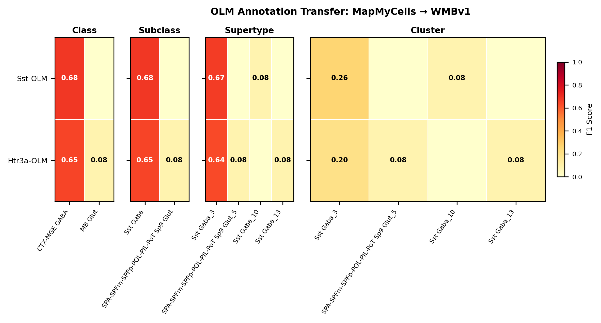

# Oriens-Lacunosum Moleculare (O-LM) interneuron — WMBv1 Mapping Report
*draft · 2026-03-25 · Source: `kb/draft/hippocampus/hippocampus_OLM.yaml`*

**⚠ Draft mappings. Evidence is atlas-metadata only unless otherwise noted. All edges require expert review before use.**

---

## Introduction

Oriens-Lacunosum Moleculare (O-LM) interneurons are a canonical class of hippocampal
GABAergic feedback interneurons whose somata and horizontally-oriented dendrites lie in
CA1 stratum oriens and whose axons project to stratum lacunosum-moleculare, where they
target the apical-tuft dendrites of pyramidal cells [1], [2], [3]. They express
somatostatin (Sst) and the nicotinic acetylcholine receptor alpha-2 subunit (Chrna2),
the latter functioning as a precise transgenic handle for the population [2], [7], [8].
Mapping classical O-LM identity onto the Whole Mouse Brain v1 (WMBv1, CCN20230722)
taxonomy is non-trivial because OLM is morphologically defined and likely
heterogeneous at the transcriptomic level — recent scRNA-seq has resolved at least
three Sst/Pnoc OLM subclusters [9].

No Cell Ontology term is currently assigned to this classical type; it is a candidate
for CL contribution.

### Classical type table

| Property | Value | References |
|---|---|---|
| Soma location | hippocampus stratum oriens [UBERON:0005371]; stratum lacunosum-moleculare of hippocampus [UBERON:0007637] | [1], [2], [3] |
| NT | GABAergic | [4], [5] |
| Defining markers | Sst, Chrna2, mGluR1 (Grm1 — 96% detection in OLM scRNA-seq, GSE124847) | [2], [6], [7], [8] |
| Negative markers | PV, CB, CR, NOS, VIP | |
| Neuropeptides | Sst, Npy, Pnoc | [7], [9] |

Details — source evidence for classical type properties

- **Soma location:** classical morphology / IHC · CA1 hippocampus, mouse and rat · [1], [2], [3]

  > oriens-lacunosum-moleculare (OLM) cells also had both the cell body and dendritic tree in the stratum oriens, but their horizontally running dendrites were often densely decorated with long spines. Their axon frequently originated from a proximal dendrite, and after ramification the main axon without boutons could be followed into the stratum lacunosum-moleculare. In this layer the axon ramified extensively bearing heavily packed varicosities. Some axon collaterals with boutons were also observed in the stratum oriens.
  > — Zemankovics et al. 2010, Anatomical Location and Morphology · [1] <!-- quote_key: 3106274_e54f60e9 -->

  > These CA1 GABAergic, somatostatin (Som)-expressing interneurons are named for their distinctive morphology: their soma and dendritic trees are located in the stratum oriens and their axons extend directly out to arborize in the stratum lacunosum-moleculare (SLM; Cajal, 1911;(McBain et al., 1994)(Sik et al., 1995)(Maccaferri et al., 2000)(Losonczy et al., 2002)(Leão et al., 2012)
  > — Nichol et al. 2018, Anatomical Location and Morphology · [2] <!-- quote_key: 3591966_2414c9e9 -->

  > CA1 oriens-lacunosum moleculare (O-LM) interneurons innervate only the apical tuft of pyramidal cells (PCs) in stratum lacunosum-moleculare (SLM) and receive inputs only in stratum oriens (SO) (McBain et al., 1994)(Losonczy et al., 2002)(Zemankovics et al., 2010).
  > — Tecuatl et al. 2020, Projection Patterns and Connectivity · [3] <!-- quote_key: 229694907_6865b9db -->

- **NT type:** classical IHC / transgenic reporter · CA1, rat and mouse · [4], [5]

  > GABAergic inhibitory oriens lacunosum-moleculare (O-LM) cells in the hippocampal area CA1 of the rat
  > — Böhm et al. 2015, Anatomical Location and Morphology · [4] <!-- quote_key: 15101210_5604b9a4 -->

  > EGFP was found to be expressed in a subpopulation of somatostatin-containing GABAergic interneurons in the hippocampus and neocortex
  > — Oliva et al. 2000, Molecular Markers and Gene Expression · [5] <!-- quote_key: 13398453_9154fc23 -->

- **Sst marker:** ISH / scRNA-seq · CA1 stratum oriens, mouse · [6], [7]

  > Type I interneurons had large horizontally oriented cell somata located at the border of stratum oriens and the alveus, indicating that these cells were most likely identical with the previously described somatostatin-positive oriens-lacunosum moleculare (O-LM) cells (Freund et al., 1998). Reconstruction of type I interneurons revealed their horizontally oriented dendritic tree in stratum oriens and their axonal arborizations in stratum lacunosum-moleculare (n = 5) (Fig. 2 A), and in situ hybridization for somatostatin showed that four of four cells were indeed positive for somatostatin (Fig. 2 B)
  > — Hooft et al. 2000, Anatomical Location and Morphology · [6] <!-- quote_key: 6652630_215c5f40 -->

  > oriens-lacunosum moleculare (OLM) interneurons. OLMs express somatostatin (Sst), generate feedback inhibition and play important roles in theta oscillations and fear encoding
  > — Winterer et al. 2019, Molecular Markers and Gene Expression · [7] <!-- quote_key: 201041756_69dc904d -->

- **Chrna2 marker:** transgenic / optogenetics · dorsal CA1, mouse · [2], [8], [7]

  > The nicotinic acetylcholine receptor alpha2 subunit (Chrna2) is a specific marker for oriens lacunosum-moleculare (OLM) interneurons in the dorsal CA1 region of the hippocampus
  > — Nichol et al. 2018, Anatomical Location and Morphology · [2] <!-- quote_key: 3591966_644f1e68 -->

  > The vast diversity of GABAergic interneurons is believed to endow hippocampal microcircuits with the required flexibility for memory encoding and retrieval. However, dissection of the functional roles of defined interneuron types has been hampered by the lack of cell-specific tools. We identified a precise molecular marker for a population of hippocampal GABAergic interneurons known as oriens lacunosum-moleculare (OLM) cells. By combining transgenic mice and optogenetic tools, we found that OLM cells are important for gating the information flow in CA1, facilitating the transmission of intrahippocampal information (from CA3) while reducing the influence of extrahippocampal inputs (from the entorhinal cortex). Furthermore, we found that OLM cells were interconnected by gap junctions, received direct cholinergic inputs from subcortical afferents and accounted for the effect of nicotine on synaptic plasticity of the Schaffer collateral pathway. Our results suggest that acetylcholine acting through OLM cells can control the mnemonic processes executed by the hippocampus.
  > — Leão et al. 2012, Projection Patterns and Connectivity · [8] <!-- quote_key: 7952877_ae03c6e0 -->

- **mGluR1 marker:** patch / ISH · stratum oriens, mouse · [6], [7]

  > Type I interneurons responded with a large inward current of ≈ 224pA, were positive for somatostatin, and the majority expressed both mGluR1 and mGluR5
  > — Hooft et al. 2000, Anatomical Location and Morphology · [6] <!-- quote_key: 6652630_17d10a9e -->

- **Npy neuropeptide:** scRNA-seq · OLM, mouse · [7]

  > we found a surprisingly consistent expression of Npy in OLMs
  > — Winterer et al. 2019, Molecular Markers and Gene Expression · [7] <!-- quote_key: 201041756_8d16e821 -->

- **Pnoc neuropeptide:** scRNA-seq · CA1 hippocampal interneurons, mouse · [9], [7]

  > The Chrna2 gene expression is restricted to the stratum oriens in the hippocampus in both rats and mice (Ishii et al., 2005) and is specifically expressed in a subset of CA1 hippocampal interneurons, the oriens lacunosummoleculare (OLM) cells (Leão et al., 2012). Traditionally, OLM cells have been identified through their expression of somatostatin (Sst). However, in-depth single-cell transcriptomic cluster analysis has unveiled at least 11 distinct subpopulations of Sst-expressing interneurons (2017). Within these clusters, various classes of interneurons were identified, including back projecting, hippocampo-septal, oriens-bistratified, and OLM cells. Among these clusters, OLM cells were classified into a Sst and Prepronociceptin (Pnoc) co-expressing group (further divided into three subclusters)
  > — Thulin et al. 2025, Projection Patterns and Connectivity · [9] <!-- quote_key: 280420054_8a6529c5 -->

---

## Results

Five candidate WMBv1 clusters were assessed: one MODERATE-confidence primary mapping
to CLUS_0769 (Sst Gaba_3 supertype), one LOW-confidence speculative mapping to CLUS_0727
(Lamp5 Lhx6 Gaba_1), and three UNCERTAIN candidates within the Sst Gaba_6 supertype
(CLUS_0785, CLUS_0788, CLUS_0789) which are eliminated by Chrna2 absence and zero
annotation-transfer support. Annotation transfer of 46 OLM scRNA-seq cells (GSE124847,
Winterer 2019) clarifies that OLM identity maps cleanly to the Sst Gaba_3 supertype
(43/46 cells, F1=0.67) but disperses across sibling clusters within it — the
single-best cluster is actually CLUS_0768 (15/46), not CLUS_0769 (0/46).

*F1 across taxonomy levels for the two source-cell groups (Sst-OLM, Htr3a-OLM) in
GSE124847. Both groups map cleanly at class / subclass / supertype (F1 ≈ 0.65) but
scatter across child clusters at cluster rank (best F1 = 0.26 to Sst Gaba_3, with
the modal child cluster being CLUS_0768 rather than CLUS_0769) — this reflects real
biological structure (WMBv1's leaf clusters split Sst Gaba_3 finer than the OLM
transcriptomic identity warrants), not method failure. Run record:
[`kb/annotation_transfer_runs/20260408_winterer_olm_mmc_wmbv1/`](../../kb/annotation_transfer_runs/20260408_winterer_olm_mmc_wmbv1/manifest.yaml).*

### Mapping candidates table

| Rank | WMBv1 cluster | Supertype | Cells | Confidence | Key property alignment | Verdict |
|---|---|---|---|---|---|---|
| 1 | 0769 Sst Gaba_3 | Sst Gaba_3 | not assessed | 🟡 MODERATE | Sst CONSISTENT · Chrna2 APPROXIMATE | Best candidate |
| 2 | 0727 Lamp5 Lhx6 Gaba_1 | Lamp5 Lhx6 Gaba_1 | not assessed | 🔴 LOW | Sst APPROXIMATE · Npy DISCORDANT | Speculative |
| — | 0785 Sst Gaba_6 | Sst Gaba_6 | not assessed | ⚪ UNCERTAIN | Chrna2 DISCORDANT · Pnoc DISCORDANT | Eliminated (Chrna2) |
| — | 0788 Sst Gaba_6 | Sst Gaba_6 | not assessed | ⚪ UNCERTAIN | Chrna2 DISCORDANT · location APPROXIMATE | Eliminated (Chrna2) |
| — | 0789 Sst Gaba_6 | Sst Gaba_6 | not assessed | ⚪ UNCERTAIN | Chrna2 DISCORDANT · 28% amygdala | Eliminated (Chrna2) |

5 candidate edges total; relationship type for all edges: `TYPE_A_SPLITS` (the
classical OLM type splits across multiple atlas clusters within at least one
supertype).

### 0769 Sst Gaba_3 · 🟡 MODERATE

#### Property comparison (Table 1)

| Property | Classical | Supertype | Best cluster | Alignment |
|---|---|---|---|---|
| NT type | GABAergic | GABA | GABA | CONSISTENT |
| Soma location | stratum oriens (UBERON:0005371); SLM (UBERON:0007637) | not available | CA1 SO (MBA:399, 87 cells); prosubiculum; posterior amygdala (CLUS_0769) | APPROXIMATE |
| Sst expression | defining marker | Sst subclass | Sst subclass (CLUS_0769) | CONSISTENT |
| Chrna2 expression | defining marker | Chrna2 expressed (scattered) per ABC Atlas | scattered across Sst Gaba_3 clusters | APPROXIMATE |
| mGluR1 (Grm1) expression | defining marker (96% in GSE124847) | not resolvable | not resolvable from atlas metadata | NOT_ASSESSED |
| Sst (neuropeptide) | present | present | present | CONSISTENT |
| Npy (neuropeptide) | present | present | present | CONSISTENT |
| Pnoc (neuropeptide) | present | present | present | CONSISTENT |
| Sex ratio | not documented | not available | not assessed | NOT_ASSESSED |

#### Evidence support (Table 2)

| Evidence | Type | Supports | Headline | Source |
|---|---|---|---|---|
| Atlas metadata — CA1 SO + Sst + full neuropeptide triad | Atlas metadata | SUPPORT | 87 CA1 SO cells; Sst+Npy+Pnoc all present | atlas-internal |
| MapMyCells AT (Winterer 2019) | Annotation transfer | PARTIAL | F1=0.67 at SUPERTYPE (43/46); 0/46 to CLUS_0769 | atlas-internal |

*(OLM source cells map robustly to the Sst Gaba_3 supertype but disperse across its
child clusters; CLUS_0768 is the modal child (22/46 raw, F1=0.47 at CLUSTER) rather
than CLUS_0769. Best match within Sst Gaba_3 by AT alone: CLUS_0768.)*

**Supporting evidence**

- Atlas metadata shows CLUS_0769 has its strongest CA1 signal in stratum oriens
  (MBA:399, 87 cells) — the canonical OLM somatic location — and carries the full
  Sst + Npy + Pnoc neuropeptide triad expected from the literature [7], [9].
- Sst and GABA assignments at the subclass level are CONSISTENT.
- MapMyCells annotation transfer of 46 mouse OLM cells (GSE124847, Winterer 2019)
  delivers F1=0.67 at SUPERTYPE level, with 43/46 cells mapping to Sst Gaba_3 [7].
  This is strong same-species evidence that OLM identity sits at the Sst Gaba_3
  supertype.
- Direct re-analysis of GSE124847 quantifies Grm1 detection in 44/46 (96%) of
  source-side OLM cells — a defining marker now confirmed at the source side, even
  though the WMBv1 atlas does not surface it in cluster-level defining_markers or
  neuropeptides.

**Marker evidence provenance**

- **Sst:** confirmed at protein and transcript level in morphologically reconstructed
  OLM cells [6], and at the transcriptomic level in OLM scRNA-seq [7]. Strong,
  multi-modal provenance.
- **Chrna2:** strong primary citations targeting morphology-confirmed OLM via
  Chrna2-Cre transgenic lines [2], [8]. At the atlas, Chrna2 is scattered across
  Sst Gaba_3 clusters per the ABC Atlas filter (anatomy=HPF; NT=GABA;
  expression=Chrna2) [A] — present but not a cluster-level defining marker.
- **mGluR1 / Grm1:** classical evidence is patch-clamp + pharmacology in
  morphology-identified type I (= OLM) cells [6]. Source-side Grm1 expression is
  now quantified (44/46 OLM cells, GSE124847); atlas-side remains unresolvable
  from metadata. Source-side confirmed at 96%; target-side still unresolvable from
  atlas metadata.
- **Negative markers (PV, CB, CR, NOS, VIP):** listed without specific primary
  citations on the classical node — a targeted cite-traverse for, e.g.,
  "calbindin OLM hippocampus" would strengthen the negative-marker chain.

**Concerns**

- Location APPROXIMATE: SLM is absent from the cluster's MERFISH soma profile,
  consistent with the well-known fact that O-LM somas sit in stratum oriens and
  their *axons* (not somas) project to SLM — but extra-hippocampal cells in
  prosubiculum (61) and posterior amygdala (95) suggest the cluster contains
  non-OLM Sst interneurons from adjacent regions.
  *(adjacent / extra-regional spread — moderate counter-evidence; the cluster is
  not OLM-pure.)*
- Annotation transfer maps OLM cells to Sst Gaba_3 supertype but to sibling clusters
  (primarily CLUS_0768, 22/46 raw and F1=0.47), not CLUS_0769 (0/46). This may
  indicate the appropriate mapping level is **supertype**, not cluster — and that
  CLUS_0769 specifically may not be the right cluster-level target.
- Grm1 (mGluR1) is not resolvable from atlas metadata, so a defining classical
  marker remains unverified at the cluster level (`MARKER_NOT_SPECIFIC`).

**What would upgrade confidence**

- *Targeted scRNA-seq or MERFISH of Chrna2-Cre+ stratum oriens neurons* — would
  pin OLM identity directly to a WMBv1 cluster via Chrna2-driven labelling
  (`AnnotationTransferEvidence`, target F1 ≥ 0.80 at CLUSTER).
- *Promote the mapping to supertype level* (SUPT_0216 Sst Gaba_3) — would convert
  the existing PARTIAL AT support (F1=0.67) into a cleaner SUPPORT at the level
  the data actually resolves to.
- *Patch-seq on morphology-identified OLM cells* — would link Grm1 expression
  to a specific WMBv1 cluster, addressing the remaining `MARKER_NOT_SPECIFIC`
  caveat.
- *Targeted literature search on negative markers (Calb1, Pvalb, Vip, Calb2,
  Nos1) in morphology-confirmed OLM cells* — would close the citation gap on
  classical-node negative markers.

### 0727 Lamp5 Lhx6 Gaba_1 · 🔴 LOW

#### Evidence support (Table 2)

| Evidence | Type | Supports | Headline | Source |
|---|---|---|---|---|
| Atlas metadata — CA3 SO+SLM, Sst neuropeptide, no Npy | Atlas metadata | PARTIAL | Lamp5 Lhx6 (CGE) subclass — discordant with Sst MGE OLM | atlas-internal |
| MapMyCells AT (Winterer 2019) | Annotation transfer | REFUTE | F1=0.0 at SUBCLASS (0/46) | atlas-internal |

**Supporting evidence**

- CA3 SO + SLM presence in MERFISH is consistent with hippocampal stratum oriens /
  lacunosum-moleculare anatomy.
- Sst and Pnoc neuropeptides are present.

**Concerns**

- Subclass is **Lamp5 Lhx6** (CGE-derived) rather than Sst (MGE-derived) — a
  developmental-origin discordance with canonical OLM identity.
  *(distant identity — strong counter-evidence; OLM is canonically MGE/Sst, so
  this would require independent validation to be biologically credible.)*
- Npy is DISCORDANT (absent) where OLM expresses Npy [7].
- MapMyCells AT (Winterer 2019) maps **0/46** OLM cells to the Lamp5 Lhx6 subclass
  (F1=0.0) — direct refutation from same-species annotation transfer.
- Chrna2 and mGluR1 not resolvable from atlas metadata.

**What would upgrade confidence**

- *Patch-seq of Lamp5-Lhx6 neurons in CA3 stratum oriens* — would test whether
  the cluster contains any cells with OLM-like morphology / electrophysiology
  (`PatchSeqEvidence`).
- *Chrna2-Cre + MapMyCells* — would test whether any Chrna2+ neurons map here
  (expected: 0%; would consolidate REFUTE).

## Eliminated candidates

All three Sst Gaba_6 clusters (CLUS_0785, CLUS_0788, CLUS_0789) are eliminated by
the same primary disqualifying signal: the parent supertype Sst Gaba_6 has no
detectable Chrna2 expression in the ABC Atlas (anatomy=HPF; NT=GABA;
expression=Chrna2 filter [A]), and MapMyCells AT delivers 0/46 cells to this
supertype across all three clusters. Chrna2 is a defining OLM marker [2], [7], [8],
so its absence is direct counter-evidence at the supertype level.

### 0785 Sst Gaba_6

- CA3 SO (39) + CA3 SLM (11) — anatomically plausible. *(adjacent CA3 stratum,
  not CA1 — weaker counter-evidence on location alone.)*
- Sst subclass + GABA CONSISTENT.
- **Chrna2 DISCORDANT** (eliminated by ABC Atlas filter [A]).
- **Pnoc DISCORDANT** (absent; OLM expresses Pnoc [9]).
- **MapMyCells AT REFUTE** (0/46 OLM cells map here; F1=0.0).

### 0788 Sst Gaba_6

- CA3 SO (13) + CA1 SO (8); no SLM. Small counts. *(some CA1 SO presence —
  slightly better than 0785 on location, but still weak.)*
- Full Sst+Npy+Pnoc neuropeptide triad plus Cort.
- **Chrna2 DISCORDANT** (ABC Atlas filter [A]).
- **MapMyCells AT REFUTE** (0/46; F1=0.0).
- 50 cells total with 4 corpus callosum cells — `LOW_CELL_COUNT` plus possible
  contamination.

### 0789 Sst Gaba_6

- CA3 SO (25); 28% medial / posterior amygdala cells — cluster is not
  hippocampus-specific. *(distant region — stronger counter-evidence; this
  cluster is unlikely to be a hippocampal OLM type even at supertype level.)*
- **Chrna2 DISCORDANT** (ABC Atlas filter [A]).
- **MapMyCells AT REFUTE** (0/46; F1=0.0).

---

### Methods

Data sources, analyses, and reproducibility receipts

**Classical type definition.** The classical Oriens-Lacunosum Moleculare (O-LM)
interneuron is defined by the convergence of morphology (horizontal somatic and
dendritic profile in CA1 stratum oriens, axonal arborisation in stratum
lacunosum-moleculare [1], [2], [3]), neurotransmitter phenotype (GABAergic [4],
[5]), and a small set of defining markers — Sst [6], [7], Chrna2 [2], [7], [8],
and mGluR1 [6], [7] — together with the Sst+Npy+Pnoc neuropeptide triad [7], [9].
The classical node carries `definition_basis = CLASSICAL_MULTIMODAL`, reflecting
the multi-modal evidentiary base (morphology, IHC, transgenic reporters, patch-clamp,
scRNA-seq).

**Atlas mapping query.** Candidate atlas clusters were retrieved from the WMBv1
taxonomy (CCN20230722) at ranks 0 (cluster) and 1 (supertype) using metadata-based
scoring (region match, NT type, defining markers, sex bias when applicable). Full
scoring rules: `workflows/map-cell-type.md`.

**Property alignment.** Each defining property of the classical type was compared
to the corresponding atlas-side value via the `property_comparisons` schema, with
alignments graded CONSISTENT / APPROXIMATE / DISCORDANT / NOT_ASSESSED. Atlas-side
numerical values came from precomputed expression on the cluster (cluster.yaml in
the taxonomy reference store) and from MERFISH spatial registration for soma
location.

**Annotation transfer.** A single MapMyCells run (`at_run_20260408_winterer_olm_mmc_wmbv1`)
provides the AT evidence used across all five candidate edges. Provenance:

| Field | Value |
|---|---|
| Source dataset | GEO:GSE124847 (Sst-OLM, Htr3a-OLM per-cell labels in `source_cell_labels.json`) |
| Source species | NCBITaxon:10090 (Mus musculus) |
| Target atlas | WMBv1 (CCN20230722; SHA-256: `b21ca985`) |
| Method | MapMyCells (cell_type_mapper v1.7.1, default parameters, raw normalization) |
| Tool version | cell_type_mapper v1.7.1 |
| Bootstrap threshold | 0.0 |
| n cells | 46 (filtered to 45) |
| Run record | [`kb/annotation_transfer_runs/20260408_winterer_olm_mmc_wmbv1/manifest.yaml`](../../kb/annotation_transfer_runs/20260408_winterer_olm_mmc_wmbv1/manifest.yaml) |
| Code reference | [https://github.com/AllenInstitute/cell_type_mapper](https://github.com/AllenInstitute/cell_type_mapper) |
| F1 matrix | [`f1_matrix.csv`](../../kb/annotation_transfer_runs/20260408_winterer_olm_mmc_wmbv1/f1_matrix.csv) |
| Heatmap figure | [`figures/f1_heatmap.png`](../../kb/annotation_transfer_runs/20260408_winterer_olm_mmc_wmbv1/figures/f1_heatmap.png) (embedded in Results above) |
| Caveats | Source dataset has only 46 OLM cells; F1 stability at cluster rank is limited. The cluster-level scatter reflects real biological structure: WMBv1 leaf clusters split Sst Gaba_3 finer than OLM identity warrants. Supertype-level mapping is the appropriate resolution. |

Per-cluster F1 values appear in the Results section (Evidence support tables).

**Anti-hallucination.** All citations, atlas accessions, ontology CURIEs, and
verbatim literature quotes in this report are validated against the evidencell
knowledge base at write time. Authored-prose evidence narratives are validated
against their source `evidence_items[*].explanation` fields. The pre-write hook
rejects any unresolvable identifier or unattributed blockquote. Specific mapping
limitations and caveats are documented per-candidate in the Discussion section.

**Reproducibility footer.**

*Generated by evidencell `9e1926b` at 2026-04-30T10:00:00+00:00 from
[`kb/draft/hippocampus/hippocampus_OLM.yaml`](../../kb/draft/hippocampus/hippocampus_OLM.yaml).*

Evidence base table

| Edge ID | Evidence types | Supports | Source |
| --- | --- | --- | --- |
| edge_olm_to_wmb_clus_0769 | ATLAS_METADATA; ANNOTATION_TRANSFER | SUPPORT; PARTIAL | atlas-internal |
| edge_olm_to_wmb_clus_0727 | ATLAS_METADATA; ANNOTATION_TRANSFER | PARTIAL; REFUTE | atlas-internal |
| edge_olm_to_wmb_clus_0785 | ATLAS_METADATA; ATLAS_QUERY; ANNOTATION_TRANSFER | PARTIAL; REFUTE; REFUTE | atlas-internal, [A] |
| edge_olm_to_wmb_clus_0788 | ATLAS_METADATA; ATLAS_QUERY; ANNOTATION_TRANSFER | PARTIAL; REFUTE; REFUTE | atlas-internal, [A] |
| edge_olm_to_wmb_clus_0789 | ATLAS_METADATA; ATLAS_QUERY; ANNOTATION_TRANSFER | PARTIAL; REFUTE; REFUTE | atlas-internal, [A] |

---

## Discussion

**Primary mapping:** Oriens-Lacunosum Moleculare (O-LM) interneuron → 0769 Sst Gaba_3 [CS20230722_CLUS_0769]
at MODERATE confidence. Key support: ATLAS_METADATA (CA1 SO + Sst+Npy+Pnoc triad)
and ANNOTATION_TRANSFER (F1=0.67 at SUPERTYPE for the parent Sst Gaba_3, 43/46
cells; Winterer 2019 GSE124847). Key caveats: `MARKER_NOT_SPECIFIC` (Grm1 not
resolvable from atlas metadata) and `OTHER` (annotation transfer maps OLM cells
primarily to sibling cluster CLUS_0768, not CLUS_0769 — mapping may be more
appropriate at supertype than cluster level).

No Cell Ontology term currently assigned. The classical OLM node is a candidate
for CL contribution — there is no existing CL term that captures the morphology +
Sst + Chrna2 + mGluR1 combination distinctive of this cell class.

### Proposed experiments and follow-ups

The single existing MapMyCells AT run (GSE124847 → WMBv1) has already done the
work of testing same-species OLM identity against this taxonomy: it confirms
Sst Gaba_3 supertype as the correct level and rules out Sst Gaba_6 and the
Lamp5 Lhx6 candidates. What remains is finer-grained, cluster-level
disambiguation.

- **Reanalysis pathway: Harris 2018 + Chamberland 2024 subfamily labels → MapMyCells**.
  The current annotation-transfer evidence is drawn from a single source dataset
  (Winterer et al. 2019) in which OLM cells were labelled by Sst-Cre and Htr3a-Cre,
  neither of which resolves recently described Sst-IN subfamilies. Chamberland et al.
  2024 partition hippocampal Sst+ interneurons into four genetically distinct
  subfamilies and provide per-cell subfamily labels overlaid on the publicly
  available Harris et al. 2018 CA1 scRNA-seq dataset. Running MapMyCells with the
  Harris matrix and Chamberland's subfamily labels against WMBv1 would directly
  test whether the cluster-level scatter within Sst Gaba_3 reflects over-clustering
  or genuine Ndnf::Nkx2-1-OLM versus Chrna2-OLM substructure, with no new data
  generation required.
- **Chrna2-Cre + MapMyCells** (proposed on edges 0769, 0727, 0788, 0789).
  - **What:** scRNA-seq of Chrna2-Cre+ stratum oriens neurons (CA1 and CA3),
    followed by MapMyCells against WMBv1.
  - **Target:** F1 ≥ 0.80 at CLUSTER level for an OLM-pure source population.
  - **Expected output:** `AnnotationTransferEvidence` items resolving whether
    OLM maps to CLUS_0768 vs CLUS_0769 (or stays at supertype) and confirming
    the elimination of Sst Gaba_6 clusters.
  - **Resolves:** Open questions 2, 4 (below); refines the primary mapping
    (edge 0769) and provides an independent REFUTE for the eliminated edges.
  - **Refinement note:** the existing GSE124847 AT run combined Sst-OLM and
    Htr3a-OLM source clusters; a Chrna2-Cre source population would target
    canonical Sst+ OLM specifically, addressing the source-side heterogeneity
    that may have caused the cell dispersion across Sst Gaba_3 child clusters.
- **Patch-seq of Sst+ stratum oriens neurons** (proposed on edges 0727, 0788).
  - **What:** patch-clamp + scRNA-seq + morphological reconstruction of
    Sst+ neurons in CA1 and CA3 stratum oriens, with explicit OLM
    morphology-confirmation.
  - **Target:** ≥10 morphology-confirmed OLM cells per CA1 vs CA3.
  - **Expected output:** `PatchSeqEvidence` linking morphology-confirmed OLM
    identity to specific WMBv1 clusters; resolves whether CA3-enriched Sst
    Gaba_6 clusters or the Lamp5 Lhx6 cluster contain any OLM-morphology
    cells.
  - **Resolves:** Open questions 1, 3, 5.
- **Region-specific dissection of CLUS_0789** (proposed on edge 0789).
  - **What:** dissect CA3 stratum oriens vs amygdala portions of CLUS_0789
    separately and re-cluster.
  - **Expected output:** clarifies whether CLUS_0789 is a mixed cluster or
    a distinct amygdalar Sst type that happens to colonise CA3 SO.
  - **Resolves:** Open question 6.
- **Targeted literature search on negative markers** (recommended from marker
  evidence provenance — not on edge proposed_experiments).
  - **What:** cite-traverse for "Calb1 OLM hippocampus", "PV OLM", "VIP OLM"
    in morphology-confirmed OLM studies.
  - **Expected output:** primary citations for negative markers, strengthening
    the `negative_markers` evidence chain on the classical node.

### Open questions

1. Are the CA1 SO cells in CLUS_0769 OLM-morphology, and what are the
   prosubiculum / posterior amygdala cells in this cluster? (edge 0769)
2. Why do OLM cells map preferentially to CLUS_0768 rather than CLUS_0769
   within the Sst Gaba_3 supertype? Do these clusters differ in hippocampal
   enrichment or in expression of one of the OLM defining markers? (edge 0769)
3. Is the Sst expression in the Lamp5 Lhx6 Gaba_1 cluster (CLUS_0727)
   biologically meaningful, and do any of its cells have OLM
   morphology / electrophysiology? (edge 0727)
4. Given Chrna2 absence in the Sst Gaba_6 supertype, is it best understood
   as a *non-OLM* Sst stratum oriens type (e.g. O-Bi, hippocampo-septal)?
   (edges 0785, 0788, 0789 — shared)
5. Are the CA1/CA3 SO cells in CLUS_0788 OLM-morphology? What are the
   corpus callosum cells? (edge 0788)
6. Are the CA3 SO cells in CLUS_0789 OLM, and what is the medial / posterior
   amygdala population this cluster contains? (edge 0789)

---

## References

| # | Citation | PMID | Used for |
|---|---|---|---|
| [1] | Zemankovics et al. 2010 | [20421280](https://pubmed.ncbi.nlm.nih.gov/20421280/) | soma location |
| [2] | Nichol et al. 2018 | [29487503](https://pubmed.ncbi.nlm.nih.gov/29487503/) | soma location |
| [3] | Tecuatl et al. 2020 | [33361464](https://pubmed.ncbi.nlm.nih.gov/33361464/) | soma location |
| [4] | Böhm et al. 2015 | [26021702](https://pubmed.ncbi.nlm.nih.gov/26021702/) | neurotransmitter type |
| [5] | Oliva et al. 2000 | [10777798](https://pubmed.ncbi.nlm.nih.gov/10777798/) | neurotransmitter type |
| [6] | Hooft et al. 2000 | [10804195](https://pubmed.ncbi.nlm.nih.gov/10804195/) | Sst marker |
| [7] | Winterer et al. 2019 | [31420995](https://pubmed.ncbi.nlm.nih.gov/31420995/) | Sst marker |
| [8] | Leão et al. 2012 | [23042082](https://pubmed.ncbi.nlm.nih.gov/23042082/) | Chrna2 marker |
| [9] | Thulin et al. 2025 | [40757734](https://pubmed.ncbi.nlm.nih.gov/40757734/) | Pnoc neuropeptide |
| [10] | Harris et al. 2018 | [29912866](https://pubmed.ncbi.nlm.nih.gov/29912866/) | CA1 inhibitory taxonomy (reanalysis source) |
| [11] | Chamberland et al. 2024 | [38640347](https://pubmed.ncbi.nlm.nih.gov/38640347/) | Sst-IN subfamily classification (Chrna2 vs Ndnf::Nkx2-1 OLM) |
| [A] | ABC Atlas — anatomy=HPF; NT=GABA; expression=Chrna2 ([view](https://tinyurl.com/a4f3kd4v)) | — | atlas query — Chrna2+ HPF GABA filter |
