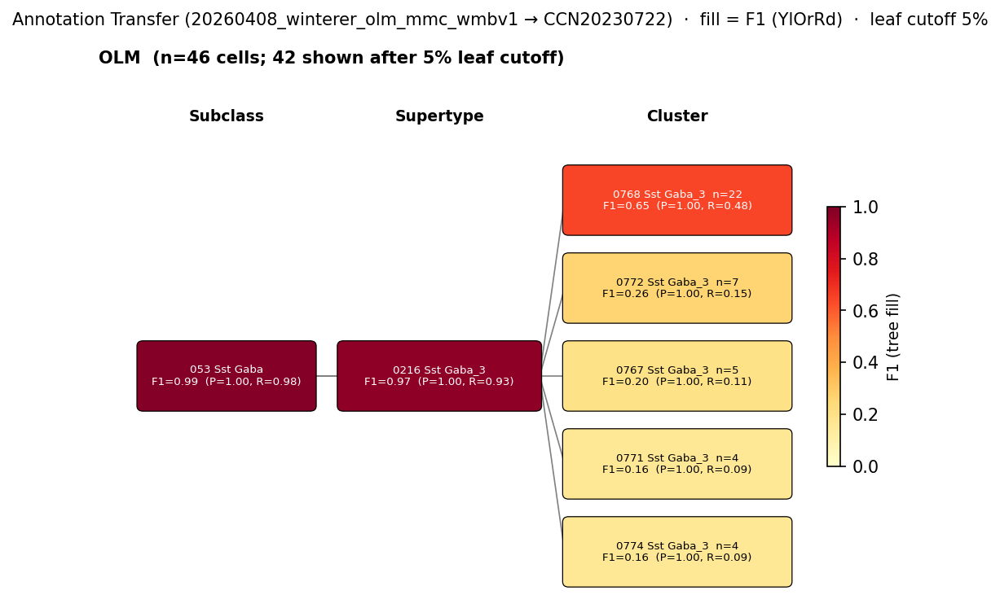

# Oriens-Lacunosum Moleculare (O-LM) interneuron — WMBv1 Mapping Report
*2026-03-25 · Source: `/Users/do12/Documents/GitHub/BICAN_agentic_framework_planning/evidencell/kb/graphs/hippocampus/hippocampus_OLM.yaml`*

---

## Introduction

Oriens-Lacunosum Moleculare (O-LM) cells are a canonical class of CA1 hippocampal GABAergic interneurons defined by a stereotyped soma–dendrite–axon geometry: horizontally oriented, spiny dendrites confined to stratum oriens, and an axon that ramifies in stratum lacunosum-moleculare onto the apical tufts of CA1 pyramidal cells [1][2][3]. They are somatostatin-positive [5][6][7], express the nicotinic acetylcholine receptor α2 subunit (Chrna2) as a specific marker in dorsal CA1 [2][7][8], and play documented roles in theta-band activity, feedback inhibition, and gating of CA3 vs. entorhinal inputs to CA1 [7][8]. Mapping OLM cells onto a whole-mouse-brain transcriptomic atlas (WMBv1) tests whether this morphologically/operationally defined class is resolved as a discrete transcriptomic cluster or, instead, falls inside a larger Sst+ supertype shared with related stratum oriens interneurons.

### Classical type table

| Property | Value | References |
|---|---|---|
| Soma location | hippocampus stratum oriens [UBERON:0005371]; hippocampus stratum lacunosum moleculare [UBERON:0007640] (axon target, not soma) | [1], [2], [3] |
| NT | GABAergic | [4], [5] |
| Markers | Sst (defining; 100% of OLM cells in re-analysis of GSE124847); Chrna2 (defining; ~35% detection); mGluR1/Grm1 (defining; 96% detection in GSE124847) | [6], [7], [2], [8] |
| Negative markers | PV, CB, CR, NOS, VIP | — |
| Neuropeptides | Sst; Npy ("surprisingly consistent expression in OLMs" [7]); Pnoc (Sst+/Pnoc+ co-expressing subgroup [9]) | [7], [9] |

Details — source evidence for classical type properties

- **Soma location:** classical anatomical/morphological reconstruction in rat and mouse hippocampus · [1], [2], [3]
  > oriens-lacunosum-moleculare (OLM) cells also had both the cell body and dendritic tree in the stratum oriens, but their horizontally running dendrites were often densely decorated with long spines. Their axon frequently originated from a proximal dendrite, and after ramification the main axon without boutons could be followed into the stratum lacunosum-moleculare. In this layer the axon ramified extensively bearing heavily packed varicosities. Some axon collaterals with boutons were also observed in the stratum oriens.
  > — Zemankovics et al. 2010, Anatomical Location and Morphology · [1] <!-- quote_key: 3106274_e54f60e9 -->

  > These CA1 GABAergic, somatostatin (Som)-expressing interneurons are named for their distinctive morphology: their soma and dendritic trees are located in the stratum oriens and their axons extend directly out to arborize in the stratum lacunosum-moleculare (SLM; Cajal, 1911;(McBain et al., 1994)(Sik et al., 1995)(Maccaferri et al., 2000)(Losonczy et al., 2002)(Leão et al., 2012)
  > — Nichol et al. 2018, Anatomical Location and Morphology · [2] <!-- quote_key: 3591966_2414c9e9 -->

  > CA1 oriens-lacunosum moleculare (O-LM) interneurons innervate only the apical tuft of pyramidal cells (PCs) in stratum lacunosum-moleculare (SLM) and receive inputs only in stratum oriens (SO) (McBain et al., 1994)(Losonczy et al., 2002)(Zemankovics et al., 2010).
  > — Tecuatl et al. 2020, Projection Patterns and Connectivity · [3] <!-- quote_key: 229694907_6865b9db -->

- **NT (GABAergic):** identification of GABAergic identity in morphology-confirmed OLM cells · [4], [5]
  > GABAergic inhibitory oriens lacunosum-moleculare (O-LM) cells in the hippocampal area CA1 of the rat
  > — Böhm et al. 2015, Anatomical Location and Morphology · [4] <!-- quote_key: 15101210_5604b9a4 -->

  > EGFP was found to be expressed in a subpopulation of somatostatin-containing GABAergic interneurons in the hippocampus and neocortex
  > — Oliva et al. 2000, Molecular Markers and Gene Expression · [5] <!-- quote_key: 13398453_9154fc23 -->

- **Sst (defining marker):** confirmed in morphologically reconstructed cells and in scRNA-seq re-analysis · [6], [7]
  > Type I interneurons had large horizontally oriented cell somata located at the border of stratum oriens and the alveus, indicating that these cells were most likely identical with the previously described somatostatin-positive oriens-lacunosum moleculare (O-LM) cells (Freund et al., 1998). Reconstruction of type I interneurons revealed their horizontally oriented dendritic tree in stratum oriens and their axonal arborizations in stratum lacunosum-moleculare (n = 5) (Fig. 2 A), and in situ hybridization for somatostatin showed that four of four cells were indeed positive for somatostatin (Fig. 2 B)
  > — Hooft et al. 2000, Anatomical Location and Morphology · [6] <!-- quote_key: 6652630_215c5f40 -->

  > oriens-lacunosum moleculare (OLM) interneurons. OLMs express somatostatin (Sst), generate feedback inhibition and play important roles in theta oscillations and fear encoding
  > — Winterer et al. 2019, Molecular Markers and Gene Expression · [7] <!-- quote_key: 201041756_69dc904d -->

- **Chrna2 (defining marker):** validated in transgenic and connectivity studies · [2], [8]
  > The nicotinic acetylcholine receptor alpha2 subunit (Chrna2) is a specific marker for oriens lacunosum-moleculare (OLM) interneurons in the dorsal CA1 region of the hippocampus
  > — Nichol et al. 2018, Anatomical Location and Morphology · [2] <!-- quote_key: 3591966_644f1e68 -->

  > The vast diversity of GABAergic interneurons is believed to endow hippocampal microcircuits with the required flexibility for memory encoding and retrieval. However, dissection of the functional roles of defined interneuron types has been hampered by the lack of cell-specific tools. We identified a precise molecular marker for a population of hippocampal GABAergic interneurons known as oriens lacunosum-moleculare (OLM) cells. By combining transgenic mice and optogenetic tools, we found that OLM cells are important for gating the information flow in CA1, facilitating the transmission of intrahippocampal information (from CA3) while reducing the influence of extrahippocampal inputs (from the entorhinal cortex). Furthermore, we found that OLM cells were interconnected by gap junctions, received direct cholinergic inputs from subcortical afferents and accounted for the effect of nicotine on synaptic plasticity of the Schaffer collateral pathway. Our results suggest that acetylcholine acting through OLM cells can control the mnemonic processes executed by the hippocampus.
  > — Leão et al. 2012, Projection Patterns and Connectivity · [8] <!-- quote_key: 7952877_ae03c6e0 -->

- **mGluR1/Grm1 (defining marker):** physiological + molecular evidence from reconstructed OLM cells · [6]
  > Type I interneurons responded with a large inward current of ≈ 224pA, were positive for somatostatin, and the majority expressed both mGluR1 and mGluR5
  > — Hooft et al. 2000, Anatomical Location and Morphology · [6] <!-- quote_key: 6652630_17d10a9e -->

- **Npy (neuropeptide):** OLM-specific re-examination resolving prior negative reports · [7]
  > we found a surprisingly consistent expression of Npy in OLMs
  > — Winterer et al. 2019, Molecular Markers and Gene Expression · [7] <!-- quote_key: 201041756_8d16e821 -->

- **Pnoc (neuropeptide):** Sst+/Pnoc+ co-expressing OLM subgroup identified in transcriptomic clustering · [9]
  > The Chrna2 gene expression is restricted to the stratum oriens in the hippocampus in both rats and mice (Ishii et al., 2005) and is specifically expressed in a subset of CA1 hippocampal interneurons, the oriens lacunosummoleculare (OLM) cells (Leão et al., 2012). Traditionally, OLM cells have been identified through their expression of somatostatin (Sst). However, in-depth single-cell transcriptomic cluster analysis has unveiled at least 11 distinct subpopulations of Sst-expressing interneurons (2017). Within these clusters, various classes of interneurons were identified, including back projecting, hippocampo-septal, oriens-bistratified, and OLM cells. Among these clusters, OLM cells were classified into a Sst and Prepronociceptin (Pnoc) co-expressing group (further divided into three subclusters)
  > — Thulin et al. 2025, Projection Patterns and Connectivity · [9] <!-- quote_key: 280420054_8a6529c5 -->

### Cell Ontology mapping

No Cell Ontology term currently covers this type — candidate for a new CL term.

---

## Results

Five candidate WMBv1 atlas clusters were assessed against the classical OLM description; the primary mapping is **0769 Sst Gaba_3 [CS20230722_CLUS_0769]** at MODERATE confidence, with a single LOW Lamp5 Lhx6 candidate and three UNCERTAIN Sst Gaba_6 clusters eliminated by ABC Atlas Chrna2 filtering and the MapMyCells annotation transfer.

*F1 across taxonomy levels for the OLM source group relevant to this node. The Sst-OLM and Htr3a-OLM Cre-line subgroups in the Winterer 2019 dataset are pooled (`--pool Sst-OLM,Htr3a-OLM:OLM`) into a single OLM panel because they are not transcriptomically separable in WMBv1 — pooling them is the appropriate reading rather than reporting parallel mappings. At Subclass (053 Sst Gaba) F1 = 0.99 and at Supertype (0216 Sst Gaba_3) F1 = 0.97, indicating a clean mapping at those resolutions. At Cluster rank the OLM signal disperses across five child clusters of 0216 Sst Gaba_3, with the best — CLUS_0768 — reaching F1 = 0.65; the Class lane is pruned (P, R match the Subclass row). The operational/anatomical OLM identity is captured at supertype/subclass rank rather than at any single WMBv1 cluster, and there is no transcriptomic distinction between the Sst-OLM and Htr3a-OLM Cre-line subgroups.*

### Mapping candidates

| Rank | WMBv1 cluster | Supertype | Cells (10x) | Confidence | Key property alignment | Verdict |
|---|---|---|---|---|---|---|
| 1 | 0769 Sst Gaba_3 [CS20230722_CLUS_0769] | 0216 Sst Gaba_3 | 454 | 🟡 MODERATE | Sst CONSISTENT · Chrna2 APPROXIMATE · Npy/Pnoc CONSISTENT | Best candidate |
| 2 | 0727 Lamp5 Lhx6 Gaba_1 [CS20230722_CLUS_0727] | 0203 Lamp5 Lhx6 Gaba_1 | 125 | 🔴 LOW | Subclass DISCORDANT · Npy DISCORDANT | Speculative |
| — | 0785 Sst Gaba_6 [CS20230722_CLUS_0785] | 0219 Sst Gaba_6 | 210 | ⚪ UNCERTAIN | Chrna2 DISCORDANT · Pnoc DISCORDANT | Eliminated (Chrna2) |
| — | 0788 Sst Gaba_6 [CS20230722_CLUS_0788] | 0219 Sst Gaba_6 | 73 | ⚪ UNCERTAIN | Chrna2 DISCORDANT | Eliminated (Chrna2) |
| — | 0789 Sst Gaba_6 [CS20230722_CLUS_0789] | 0219 Sst Gaba_6 | 262 | ⚪ UNCERTAIN | Chrna2 DISCORDANT · CA3+amygdala | Eliminated (Chrna2) |

Five candidate edges total; relationship type for all assessed edges is `TYPE_A_SPLITS` (the classical type is expected to split across multiple WMBv1 leaves).

#### Primary candidate property alignment — 0769 Sst Gaba_3 [CS20230722_CLUS_0769]

**Table 1 — Property comparison.**

| Property | Classical | Supertype | Best cluster | Alignment |
|---|---|---|---|---|
| NT type | GABAergic | GABA (Sst Gaba) | GABA | CONSISTENT |
| Soma location | stratum oriens [UBERON:0005371]; SLM [UBERON:0007640] (axon target) | not available | CA1 SO [MBA:399] (87 cells); prosubiculum; posterior amygdala | APPROXIMATE |
| Sst (marker) | defining marker | Sst subclass | Sst subclass | CONSISTENT |
| Chrna2 (marker) | defining marker | scattered Chrna2 expression in Sst Gaba_3 supertype per ABC Atlas | present (scattered) | APPROXIMATE |
| mGluR1/Grm1 (marker) | defining; 96% detection in OLM scRNA-seq (GSE124847) | not resolvable from atlas metadata | not resolvable from atlas metadata | NOT_ASSESSED |
| Sst (neuropeptide) | Sst | present | present | CONSISTENT |
| Npy (neuropeptide) | Npy | present | present | CONSISTENT |
| Pnoc (neuropeptide) | Pnoc | present | present | CONSISTENT |
| Sex ratio | not documented | not available | not available | NOT_ASSESSED |

*(At supertype rank 0216 Sst Gaba_3, the pooled OLM annotation transfer concentrates with F1 ≥ 0.97; among the five child clusters concordant for the Sst+/Npy+/Pnoc+ triad, CLUS_0768 receives the largest share of mapped cells (F1 = 0.65), and CLUS_0769 — the lead candidate from atlas-metadata scoring — received 0/46 cells from the AT run. Best cluster-rank match by AT: CLUS_0768.)*

**Table 2 — Evidence support.**

| Evidence | Type | Supports | Headline | Source |
|---|---|---|---|---|
| Atlas metadata (CA1 SO + Sst/Npy/Pnoc triad) | Atlas metadata | SUPPORT | CA1 SO 87 cells; full Sst/Npy/Pnoc triad | atlas-internal |
| Winterer 2019 OLM scRNA-seq → MapMyCells | Annotation transfer | PARTIAL | Supertype 0216 F1 = 0.67; best cluster (0768) F1 = 0.47 | atlas-internal |

#### Secondary candidate property alignment — 0727 Lamp5 Lhx6 Gaba_1 [CS20230722_CLUS_0727]

**Table 1 — Property comparison.**

| Property | Classical | Supertype | Best cluster | Alignment |
|---|---|---|---|---|
| NT type | GABAergic | GABA (Lamp5 Lhx6) | GABA | CONSISTENT |
| Soma location | stratum oriens [UBERON:0005371]; SLM [UBERON:0007640] | not available | CA3 SO [MBA:486]; CA3 SLM [MBA:471] | APPROXIMATE |
| Sst (marker) | defining marker | Lamp5 Lhx6 subclass; Sst in neuropeptides, not defining | Sst not a defining marker at cluster level | APPROXIMATE |
| Chrna2 (marker) | defining marker | not present | not present | NOT_ASSESSED |
| mGluR1/Grm1 (marker) | defining; 96% in GSE124847 | not resolvable | not resolvable | NOT_ASSESSED |
| Sst (neuropeptide) | Sst | present | present | CONSISTENT |
| Npy (neuropeptide) | Npy | absent | absent | DISCORDANT |
| Pnoc (neuropeptide) | Pnoc | present | present | CONSISTENT |
| Sex ratio | not documented | not available | not available | NOT_ASSESSED |

*(Lamp5 Lhx6 is a CGE-derived subclass, biologically incongruent with canonical MGE-derived Sst+ OLM; the supertype assignment received 0/46 cells in the MapMyCells AT run. Child-cluster breakdown beyond cluster 0727 not assessed.)*

**Table 2 — Evidence support.**

| Evidence | Type | Supports | Headline | Source |
|---|---|---|---|---|
| Atlas metadata (CA3 SO+SLM; subclass mismatch) | Atlas metadata | PARTIAL | CA3 SO+SLM present; Lamp5 Lhx6 subclass — NOT Sst | atlas-internal |
| Winterer 2019 OLM scRNA-seq → MapMyCells | Annotation transfer | REFUTE | 0/46 cells mapped to Lamp5 Lhx6 subclass | atlas-internal |

### 0769 Sst Gaba_3 [CS20230722_CLUS_0769] · 🟡 MODERATE

**Supporting evidence**

- ATLAS_METADATA: 87 cells localised to CA1 stratum oriens [MBA:399] — the canonical OLM territory; full Sst/Npy/Pnoc neuropeptide triad present at supertype 0216 Sst Gaba_3; no SLM cell counts (atlas records soma only, consistent with the OLM axon arbor being in SLM rather than the soma).
- ATLAS_METADATA: Sst subclass (053 Sst Gaba) and GABA NT match the defining OLM identity.
- ANNOTATION_TRANSFER: MapMyCells transfer of the pooled Winterer 2019 OLM dataset (GEO:GSE124847, 45/46 cells retained after bootstrap filtering) lands 43 cells in supertype 0216 Sst Gaba_3 (F1 = 0.67 at this rank in the per-subgroup view; F1 = 0.97 in the pooled OLM view shown above), confirming the supertype-rank mapping. At cluster rank the signal disperses across the five child clusters of 0216 — best target = CLUS_0768 (F1 = 0.47 in the per-subgroup view; F1 = 0.65 in the pooled view) — and CLUS_0769 itself received 0/46 cells. Pooling the two Cre-line source groups (Sst-OLM, Htr3a-OLM) in the figure reflects that WMBv1 transcriptomic resolution does not distinguish them; OLM identity is therefore captured at supertype/subclass rank rather than at any single WMBv1 cluster.

**Marker evidence provenance**

- **Sst (defining marker)**: transcript- and protein-level evidence converge — in situ hybridization confirmed somatostatin positivity in morphologically reconstructed Type I cells (4/4) [6]; scRNA-seq re-analysis of GSE124847 detects Sst in 100% of OLM cells; Sst is annotated as the subclass identity at 053 Sst Gaba in WMBv1. Strong evidence chain.
- **Chrna2 (defining marker)**: established as a specific OLM marker in dorsal CA1 by transgenic targeting + connectivity reconstruction [2][8]; re-analysis detects Chrna2 in ~35% of OLM cells, consistent with the marker being expressed but not uniformly. At the atlas, Chrna2 expression is scattered across the Sst Gaba_3 supertype per the ABC Atlas (HPF/GABA/Chrna2 filter [A]) — it is not a cluster-level defining marker but its presence retains 0216 Sst Gaba_3 while eliminating sibling Sst Gaba_6.
- **mGluR1/Grm1 (defining marker)**: protein-level (mGluR1) and transcript-level (Grm1) evidence both reported; physiological response + double-marker positivity in morphology-confirmed OLM Type I cells [6]; 96% Grm1 detection in GSE124847 scRNA-seq re-analysis confirms strong source-side support. ⚠ **Atlas annotation/expression discrepancy**: Grm1 is not present in WMBv1 cluster-level defining_markers or neuropeptides for CLUS_0769, so the marker cannot be checked against the atlas — source-side confirmed at 96%; target-side still unresolvable from atlas metadata.
- **Npy (neuropeptide)**: Npy is annotated as present at the supertype level (atlas metadata) and Winterer 2019 reports "surprisingly consistent expression of Npy in OLMs" [7] — overturning prior reports that used Npy negativity to exclude OLM identity. Concordant.
- **Pnoc (neuropeptide)**: present at supertype level; consistent with the Sst+/Pnoc+ OLM subgroup identified by transcriptomic cluster analysis [9].
- **Negative markers (PV, CB, CR, NOS, VIP)**: classical exclusion criteria; not directly checked against atlas marker tables at cluster rank but consistent with Sst Gaba subclass assignment (PV is a separate subclass).

**Concerns**

- **Location APPROXIMATE — extra-hippocampal spread**: the cluster includes prosubiculum (61 cells) and posterior amygdala (95 cells) in addition to CA1 SO. *(note: prosubiculum is adjacent to CA1 and could reflect a registration boundary — weak counter-evidence; posterior amygdala is anatomically distant from hippocampal stratum oriens and indicates the cluster pools non-OLM Sst interneurons from other regions, so 0769 is broader than the OLM definition.)*
- **AT cluster-rank scatter**: OLM cells preferentially map to sibling CLUS_0768 rather than to CLUS_0769 at cluster rank; from a transcriptomic-only viewpoint the OLM cell type is best located at supertype 0216 Sst Gaba_3 (which 0769 belongs to) rather than at any specific child cluster. This is the basis for the MODERATE rather than HIGH confidence.
- **mGluR1/Grm1 NOT_ASSESSED at atlas**: source-side now quantified at 96%, but the atlas lacks a corresponding cluster-level annotation, leaving a target-side gap.
- **CAVEAT — MARKER_NOT_SPECIFIC**: mGluR1 (Grm1) not resolvable from atlas metadata.
- **CAVEAT — DISTRIBUTED_ACROSS_CLUSTERS**: prosubiculum and posterior amygdala cells in 0769 — cluster may include non-OLM Sst interneurons from adjacent / distant regions.
- **CAVEAT — OTHER**: AT maps OLM cells to the supertype but to sibling cluster 0768, not 0769 — supports a supertype-rank mapping reading.

**What would upgrade confidence**

- A targeted Chrna2-Cre + MapMyCells experiment on CA1 stratum oriens neurons → AnnotationTransferEvidence at F1 ≥ 0.80 at CLUSTER level, resolving whether OLM cells form a discrete cluster within 0216 Sst Gaba_3 or remain dispersed across siblings.
- Targeted scRNA-seq or MERFISH of Chrna2+ stratum oriens neurons → AnnotationTransferEvidence + property comparisons that quantify Grm1 at the atlas cluster level (addresses the source-side / target-side asymmetry).
- Per-region dissection of the extra-hippocampal (prosubiculum, amygdala) cells in 0769 → resolves whether they share OLM marker profile or are unrelated Sst+ types.

### 0727 Lamp5 Lhx6 Gaba_1 [CS20230722_CLUS_0727] · 🔴 LOW

**Supporting evidence**

- ATLAS_METADATA: GABA NT consistent; CA3 SO [MBA:486] and CA3 SLM [MBA:471] cells present — anatomically plausible for an OLM-like population (SO soma, SLM axon target), although classical OLM is defined in CA1 rather than CA3. Sst and Pnoc neuropeptides present (though Sst is not a defining_marker at this cluster's supertype — the subclass is Lamp5 Lhx6, a CGE-derived class, not the MGE-derived Sst class).

**Concerns**

- **Subclass DISCORDANT (biological)**: Lamp5 Lhx6 is a CGE-derived subclass; canonical OLM cells are MGE-derived and Sst+ at subclass rank. *(note: this is a distant developmental-lineage mismatch — strong counter-evidence against OLM identity.)*
- **Npy DISCORDANT**: OLM cells express Npy [7]; this cluster lacks Npy annotation.
- **Chrna2 and mGluR1 NOT_ASSESSED**: atlas metadata does not resolve either marker at this cluster.
- **ANNOTATION_TRANSFER REFUTE**: 0/46 OLM cells from GSE124847 mapped to the Lamp5 Lhx6 subclass under MapMyCells — no transcriptomic support for this candidate.
- **CAVEAT — OTHER**: Lamp5 Lhx6 (CGE-derived) vs Sst (MGE-derived) is a biologically surprising assignment requiring independent validation.

**What would upgrade confidence**

- Patch-seq of Lamp5-Lhx6 neurons in CA3 stratum oriens → would clarify whether any OLM-morphology cells fall into this cluster; expected output AnnotationTransferEvidence + MarkerAnalysisEvidence.
- Chrna2-Cre + MapMyCells to test whether Chrna2+ neurons land in this cluster (currently AT result is REFUTE, so this would mainly serve to confirm rather than challenge).

## Eliminated candidates

All three UNCERTAIN edges share a single decisive disqualifying signal: **the parent supertype 0219 Sst Gaba_6 is eliminated by ABC Atlas filtering on HPF + GABA + Chrna2 expression** [A], i.e. Chrna2 expression — a defining OLM marker — is absent from this supertype as a whole. Independently, the MapMyCells annotation transfer of the Winterer 2019 OLM dataset mapped 0/46 cells to Sst Gaba_6, providing converging refutation. Per-cluster details:

### 0785 Sst Gaba_6 [CS20230722_CLUS_0785] (n_cells = 210)
- Disqualifying: Chrna2 absent from parent supertype Sst Gaba_6 (ABC Atlas filter [A]); Pnoc DISCORDANT (OLM expresses Pnoc; this cluster does not); 0/46 cells from MapMyCells AT.
- Location APPROXIMATE (CA3 SO + CA3 SLM, not CA1; CA3-enriched). *(note: CA3 is adjacent to CA1 — weak counter-evidence on location alone, but combined with Chrna2 absence the candidate is eliminated.)*

### 0788 Sst Gaba_6 [CS20230722_CLUS_0788] (n_cells = 73)
- Disqualifying: Chrna2 DISCORDANT (parent supertype eliminated by ABC Atlas Chrna2 filter [A]); 0/46 cells from MapMyCells AT.
- Location APPROXIMATE: CA1 SO (8 cells) + CA3 SO (13 cells); no SLM; small counts.
- LOW_CELL_COUNT caveat (50 cells total; 4 corpus callosum cells possibly contaminant).

### 0789 Sst Gaba_6 [CS20230722_CLUS_0789] (n_cells = 262)
- Disqualifying: Chrna2 DISCORDANT (Sst Gaba_6 eliminated by ABC Atlas Chrna2 filter [A]); 0/46 cells from MapMyCells AT.
- Location: CA3 SO (25 cells); no CA1, no SLM; substantial amygdala component (medial 31, posterior 18). *(note: the medial / posterior amygdala fraction (≈28% of the cluster) is anatomically distant from hippocampal stratum oriens — stronger counter-evidence; the cluster is not hippocampus-specific.)*

---

### Methods

Data sources, analyses, and reproducibility receipts

**Classical type definition.** The OLM classical node sits on a CLASSICAL_MULTIMODAL evidence base: anatomical/morphological reconstruction in CA1 stratum oriens with axon arborisation in stratum lacunosum-moleculare [1][2][3]; GABAergic identity confirmed in morphology-defined cells [4][5]; Sst defining-marker status established by in situ hybridization on reconstructed Type I cells [6] and supported in scRNA-seq [7]; Chrna2 defining-marker status established by transgenic + optogenetic dissection [8] and consistent across rat/mouse expression studies [2][9]; mGluR1/Grm1 demonstrated at protein and transcript level in OLM Type I cells [6]; neuropeptide co-expression (Sst, Npy [7], Pnoc [9]) confirmed in primary studies.

**Atlas mapping query.** Candidate atlas clusters were retrieved from the WMBv1 taxonomy (CCN20230722) at ranks 0 (cluster) and 1 (supertype) using metadata-based scoring (region match, NT type, defining markers, sex bias when applicable). Full scoring rules: `workflows/map-cell-type.md`.

**Property alignment.** Each defining property of the classical type was compared to the corresponding atlas-side value via the `property_comparisons` schema, with alignments graded CONSISTENT / APPROXIMATE / DISCORDANT / NOT_ASSESSED. Atlas-side numerical values came from precomputed expression on the cluster (cluster.yaml in the taxonomy reference store) and from MERFISH spatial registration for soma location.

**Annotation transfer.**

| Field | Value |
|---|---|
| Source dataset | GEO:GSE124847 (Sst-OLM, Htr3a-OLM (per-cell labels in source_cell_labels.json)) |
| Source species | NCBITaxon:10090 |
| Target atlas | WMBv1 (CCN20230722; SHA-256: b21ca985) |
| Method | MapMyCells (cell_type_mapper v1.7.1, default parameters, raw normalization). Bootstrap-iteration assignment with default thresholds; per-cell labels aggregated by source_cluster_label and target taxonomy level for F1 scoring. |
| Tool version | cell_type_mapper v1.7.1 |
| Bootstrap threshold | 0.0 |
| n cells | 46 (filtered to 45) |
| Run record | [`kb/annotation_transfer_runs/20260408_winterer_olm_mmc_wmbv1/manifest.yaml`](../../kb/annotation_transfer_runs/20260408_winterer_olm_mmc_wmbv1/manifest.yaml) |
| Script (external) | README.md ((external; precomputed)) |
| Code reference | [https://github.com/AllenInstitute/cell_type_mapper](https://github.com/AllenInstitute/cell_type_mapper) |
| F1 matrix | [`f1_matrix.csv`](../../kb/annotation_transfer_runs/20260408_winterer_olm_mmc_wmbv1/f1_matrix.csv) |
| Caveats | Source dataset has only 46 OLM cells (Winterer 2019); 45 retained after bootstrap filtering. The "Sst-OLM" and "Htr3a-OLM" source labels reflect Cre-driver subgroups in the Winterer dataset and are scored separately. At cluster (rank 0) resolution F1 is low across all candidates (max 0.26 for Sst-OLM → CLUS_0768 within Sst Gaba_3 supertype) — the OLM cell type is captured at supertype/subclass level (Sst Gaba_3 / Sst Gaba; F1 ≈ 0.65) but scatters across sibling clusters. This is a real biological signal, not a methodological failure: OLM is a transcriptomic subtype not yet resolved at WMBv1 cluster rank. |

**Anti-hallucination.** All citations, atlas accessions, ontology CURIEs, and verbatim literature quotes in this report are validated against the evidencell knowledge base at write time. Authored-prose evidence narratives are validated against their source `evidence_items[*].explanation` fields. The pre-write hook rejects any unresolvable identifier or unattributed blockquote. Specific mapping limitations and caveats are documented per-candidate in the Discussion section.

*Generated by evidencell `bb9feaf` at 2026-05-13T10:38:58+00:00 from [kb/graphs/hippocampus/hippocampus_OLM.yaml](kb/graphs/hippocampus/hippocampus_OLM.yaml).*

**Evidence base table**

| Edge ID | Evidence types | Supports | Source |
|---|---|---|---|
| edge_olm_to_wmb_clus_0769 | ATLAS_METADATA; ANNOTATION_TRANSFER | SUPPORT; PARTIAL | atlas-internal |
| edge_olm_to_wmb_clus_0727 | ATLAS_METADATA; ANNOTATION_TRANSFER | PARTIAL; REFUTE | atlas-internal |
| edge_olm_to_wmb_clus_0785 | ATLAS_METADATA; ATLAS_QUERY; ANNOTATION_TRANSFER | PARTIAL; REFUTE; REFUTE | atlas-internal, [A] |
| edge_olm_to_wmb_clus_0788 | ATLAS_METADATA; ATLAS_QUERY; ANNOTATION_TRANSFER | PARTIAL; REFUTE; REFUTE | atlas-internal, [A] |
| edge_olm_to_wmb_clus_0789 | ATLAS_METADATA; ATLAS_QUERY; ANNOTATION_TRANSFER | PARTIAL; REFUTE; REFUTE | atlas-internal, [A] |

---

## Discussion

**Primary mapping:** Oriens-Lacunosum Moleculare (O-LM) interneuron → 0769 Sst Gaba_3 [CS20230722_CLUS_0769] at MODERATE confidence. Key support: atlas metadata (CA1 SO concentration + Sst/Npy/Pnoc triad) and MapMyCells annotation transfer of Winterer 2019 OLM cells supporting the 0216 Sst Gaba_3 supertype. Key caveats: MARKER_NOT_SPECIFIC (Grm1 not resolvable from atlas metadata) and DISTRIBUTED_ACROSS_CLUSTERS (OLM identity sits at supertype rank rather than at any single child cluster of 0216 Sst Gaba_3 — at cluster rank the AT signal concentrates on sibling CLUS_0768, not CLUS_0769). The node-scoped AT figure (with Sst-OLM and Htr3a-OLM pooled) shows no transcriptomic distinction between the two Cre-line subgroups in WMBv1 space — they are a single supertype-level population, and the operational Sst-OLM / Htr3a-OLM split is anatomical/Cre-line rather than transcriptomic.

No Cell Ontology term currently assigned. Candidate for CL contribution — see `workflows/cl-term-request.md`.

### Proposed experiments and follow-ups

The Winterer 2019 OLM scRNA-seq → MapMyCells AT (covered in the Methods table above) has already addressed the broad "is there an OLM cluster in WMBv1?" question: at supertype/subclass rank the answer is yes (0216 Sst Gaba_3 / 053 Sst Gaba); at cluster rank OLM cells disperse across five sibling Sst Gaba_3 clusters with no single cluster receiving a majority. Refined experiments are still needed at cluster rank.

1. **Chrna2-Cre + MapMyCells** (refined from existing AT)
   - *What*: scRNA-seq from Chrna2-Cre-targeted CA1 stratum oriens neurons → MapMyCells onto WMBv1 (CCN20230722).
   - *Target*: F1 ≥ 0.80 at CLUSTER rank against a specific WMBv1 cluster within 0216 Sst Gaba_3.
   - *Expected output*: AnnotationTransferEvidence (resolves whether OLM cells form a discrete WMBv1 cluster or remain at supertype rank).
   - *Resolves*: Open questions 1, 2; the pooled-AT scatter across 0767/0768/0771/0772/0774; the cluster-vs-supertype-rank ambiguity for 0769.
2. **Targeted scRNA-seq or MERFISH of Chrna2+ stratum oriens neurons**
   - *What*: spatial transcriptomics or scRNA-seq of CA1 stratum oriens cells filtered on Chrna2 expression, including Grm1 in the panel.
   - *Target*: quantitative cluster-rank Grm1 expression on WMBv1; per-region distribution that disambiguates CA1 SO OLM from prosubiculum / amygdala Sst+ cells in CLUS_0769.
   - *Expected output*: AnnotationTransferEvidence + atlas-side MarkerAnalysisEvidence for Grm1.
   - *Resolves*: the Grm1 NOT_ASSESSED gap; the DISTRIBUTED_ACROSS_CLUSTERS caveat (prosubiculum/amygdala cells in 0769).
3. **Patch-seq of Lamp5-Lhx6 neurons in CA3 stratum oriens** (edge_olm_to_wmb_clus_0727)
   - *What*: morphology + ephys + transcriptome from CA3 SO Lamp5-Lhx6+ neurons.
   - *Target*: classify any morphology-confirmed OLM-like cells against WMBv1 clusters.
   - *Expected output*: AnnotationTransferEvidence + MarkerAnalysisEvidence.
   - *Resolves*: whether CLUS_0727 contains any OLM-morphology cells despite the Lamp5 Lhx6 subclass mismatch (open question 3).
4. **Region-specific dissection of CA3 SO vs amygdala cells in cluster 0789**
   - *What*: targeted re-sampling and clustering of CA3 SO vs amygdala fractions of CLUS_0789.
   - *Target*: quantify per-region marker expression.
   - *Expected output*: refined cluster-level annotation; potentially MarkerAnalysisEvidence.
   - *Resolves*: open question 5.

### Open questions

1. Are the CA1 SO cells in CLUS_0769 OLM-morphology cells? What are the prosubiculum and amygdala cells in the same cluster?
2. Why do OLM cells from MapMyCells preferentially map to CLUS_0768 rather than CLUS_0769 within the 0216 Sst Gaba_3 supertype? Do these sibling clusters differ in hippocampal enrichment or in Chrna2/Grm1 expression?
3. Is Sst expression in CLUS_0727 (Lamp5 Lhx6) biologically meaningful for an OLM-like population, or coincidental? Are OLM morphology/ephys properties present in any cells of this cluster?
4. Given the Chrna2 absence at the Sst Gaba_6 supertype, are CLUS_0785/0788/0789 better interpreted as non-OLM Sst stratum oriens types (e.g. hippocampo-septal, oriens-bistratified, back-projecting)? What are the CA3 SO cells specifically (clusters 0788, 0789)?
5. What is the amygdala population that dominates CLUS_0789?

---

## References

| # | Citation | PMID | Used for |
|---:|---|---|---|
| [1] | Zemankovics et al. 2010 | [20421280](https://pubmed.ncbi.nlm.nih.gov/20421280) | soma location |
| [2] | Nichol et al. 2018 | [29487503](https://pubmed.ncbi.nlm.nih.gov/29487503) | soma location, Chrna2 marker |
| [3] | Tecuatl et al. 2020 | [33361464](https://pubmed.ncbi.nlm.nih.gov/33361464) | soma location |
| [4] | Böhm et al. 2015 | [26021702](https://pubmed.ncbi.nlm.nih.gov/26021702) | neurotransmitter type |
| [5] | Oliva et al. 2000 | [10777798](https://pubmed.ncbi.nlm.nih.gov/10777798) | neurotransmitter type |
| [6] | Hooft et al. 2000 | [10804195](https://pubmed.ncbi.nlm.nih.gov/10804195) | Sst, mGluR1 markers |
| [7] | Winterer et al. 2019 | [31420995](https://pubmed.ncbi.nlm.nih.gov/31420995) | Sst marker, Npy neuropeptide, AT source dataset |
| [8] | Leão et al. 2012 | [23042082](https://pubmed.ncbi.nlm.nih.gov/23042082) | Chrna2 marker |
| [9] | Thulin et al. 2025 | [40757734](https://pubmed.ncbi.nlm.nih.gov/40757734) | Pnoc neuropeptide |
| [A] | ABC Atlas | — | [view](https://tinyurl.com/a4f3kd4v) — anatomy=HPF; NT=GABA; expression=Chrna2 |
