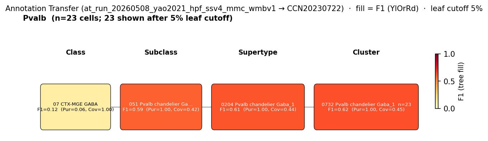

# Parvalbumin-positive basket cell — WMBv1 (CCN20230722) Mapping Report
*2026-04-09 · Source: `/Users/do12/Documents/GitHub/BICAN_agentic_framework_planning/evidencell/kb/graphs/hippocampus/hippocampus_GABAergic_interneurons.yaml`*

---

## Introduction

Parvalbumin-positive (PV+) basket cells are fast-spiking GABAergic interneurons whose somata lie in the pyramidal layers of CA1/CA3 and the granule cell layer of the dentate gyrus, with axonal arborisations confined to the pyramidal layer where they form dense perisomatic inhibitory contacts onto principal neurons. They are one of the two principal perisomatic-targeting GABAergic populations in the hippocampus (alongside CCK+ basket cells) and are conventionally defined by parvalbumin expression and the absence of cannabinoid receptor 1 (Cnr1) [1][6][8][5]. The mapping question is which Whole Mouse Brain v1 (WMBv1; CCN20230722) cluster(s) best correspond to this classical type, given that several morphologically distinct PV+ subtypes (basket, axo-axonic, bistratified) share high transcriptomic similarity within the Pvalb subclass.

### Classical type table

| Property | Value | References |
|---|---|---|
| Soma location | pyramidal layer of CA1 [UBERON:0014548]; pyramidal layer of CA3 [UBERON:0014550]; dentate gyrus granule cell layer [UBERON:0005381] | [1][2][3][4] |
| NT | GABAergic | [5] |
| Defining markers | Pvalb, Gad1, Gad2 | [1][6][7][8] |
| Negative markers | Cnr1 | [5] |
| Definition basis | CLASSICAL_MULTIMODAL | — |

<details>
<summary>Details — source evidence for classical type properties</summary>

- **Soma location & morphology:** patch-fill / biocytin reconstruction of fast-spiking interneurons in rat CA1, with full axonal-arbor analysis and calcium-binding-protein immunoreactivity (Sik et al. 1995) [2].
  > Fast spiking interneurons in the CA1 area of the dorsal hippocampus were recorded from and filled with biocytin in anesthetized rats. The full extent of their dendrites and axonal arborizations as well as their calcium binding protein content were examined. Based on the spatial extent of axon collaterals, local circuit cells (basket and O- LM neurons) and long-range cells (bistratified, trilaminar, and backprojection neurons) could be distinguished. Basket cells were immunoreactive for parvalbumin and their axon collaterals were confined to the pyramidal layer. A single basket cell contacted more than 1500 pyramidal neurons and 60 other parvalbumin-positive interneurons.
  > — Sik et al. 1995, Anatomical Location and Morphology · [2] <!-- quote_key: 10664418_9acd7ec1 -->

- **Soma location (DG / CA fields):** PV+ immunohistochemistry on rat hippocampus (Rivera et al. 2014) [1].
  > Parvalbumin + cells were specifically localized in the granular and polymorphic cell layers of the dentate gyrus and the strata oriens and pyramidale in CA1/3 fields of the rat hippocampus (Kosaka et al., 1987). They have been considered a subpopulation of GABAergic interneurons, including basket and axo-axonic cell types, which innervate the somata and proximal axons of pyramidal cells, respectively (Soriano et al., 1990)
  > — Rivera et al. 2014, Classical Functional and Morphological Interneuron Types · [1] <!-- quote_key: 10540334_bdfa426a -->

- **Definition note on PV vs CCK split:** intersectional genetic mapping of PV- and CCK-GABA populations across forebrain (Whissell et al. 2015) [5].
  > Cholecystokinin (CCK)- and parvalbumin (PV)-expressing neurons constitute the two major populations of perisomatic GABAergic neurons in the cortex and the hippocampus. As CCK- and PV-GABA neurons differ in an array of morphological, biochemical and electrophysiological features, it has been proposed that they form distinct inhibitory ensembles which differentially contribute to network oscillations and behavior.
  > — Whissell et al. 2015, Classification Schemes and Methodological Approaches · [5] <!-- quote_key: 16859318_009e9f36 -->

- **Pvalb marker:** Contreras et al. 2019 [8] reviews PV+ interneuron molecular and physiological identity.
  > the majority of interneurons in these regions express either the neuropeptide cholecystokinin or the calcium binding protein parvalbumin
  > — Contreras et al. 2019, SOMA AND AXON TARGETING INTERNEURONS · [8] <!-- quote_key: 195584607_37a80af5 -->

- **Hippocampal interneuron compendium:** Bocchio et al. 2024 names PV-expressing basket and bistratified cells as the most representative PV+ types (cite-traverse 2026-04-10) [4].
  > the most representative ones, the PV-expressing basket and bistratified cells, the NOS-expressing ivy cells and 2 types of interneuron-selective interneurons (ISI 1 and 3) that express calretinin
  > — Bocchio et al. 2024, Results · [4] <!-- quote_key: 262127573_ba6d02e9 -->

</details>

### Cell Ontology mapping

Cell Ontology mapping: basket cell [[CL:0000118](https://www.ebi.ac.uk/ols4/ontologies/cl/classes?obo_id=CL:0000118)] (BROAD).

**Proposed CL term:** *parvalbumin-positive basket cell* (SUBMITTED). Candidate-definition prose drawn from the cited primary studies [1][2][6][5][8]: a basket cell of the hippocampal formation that expresses the calcium-binding protein parvalbumin (Pvalb) in rodents (Rivera et al., 2014; Que et al., 2021; Contreras et al., 2019). Somata located in the pyramidal layers of CA1 and CA3 and the granule cell layer of the dentate gyrus. Axon collaterals confined to the pyramidal layer, forming dense perisomatic inhibitory synapses on the somata of principal neurons; a single cell contacts more than 1500 pyramidal neurons (Sik et al., 1995). A fast-spiking GABAergic interneuron with sustained firing rates exceeding 200 Hz, distinguished from CCK basket cells by absence of cannabinoid receptor 1 (Cnr1) expression (Whissell et al., 2015).

---

## Results

Marker alignment and annotation transfer of morphologically identified PV basket cells (Que et al. 2021 patch-seq; Pvalb-Flp; n=62 BC) support a supertype-level placement at 0206 Pvalb Gaba_2 [CS20230722_SUPT_0206] (F1=0.79; coverage=0.90) with the rank-1 child cluster 0739 Pvalb Gaba_2 [CS20230722_CLUS_0739] as the best cluster-level resolution (F1=0.83; purity=0.86; coverage=0.79) — see filtered Que figure and Table 1. The aggregated SSv4 Pvalb subclass label from Yao et al. 2021 splits between the chandelier supertype (0204 Pvalb chandelier Gaba_1, F1=0.61) and 0206 Pvalb Gaba_2 (F1=0.32) — consistent with the SSv4 Pvalb label being a mixed PV-IN population (basket + axo-axonic + bistratified), which the morphologically labelled Que cohort separates.

**Annotation-transfer overview figure — Que 2021 morphologically labelled BC cohort (filtered)**


*F1 across taxonomy levels for the Que 2021 morphologically identified basket cell cohort (BC = hBC + vBC, n=62; 31 cells mapped at cluster level). Each panel row is a source-cell group; nodes are coloured by F1 with **Purity** (Pur) and **Coverage** (Cov) shown inline. Coverage = fraction of source-group cells landing on this target; Purity = fraction of this target's cells coming from the source group. F1 ≥ 0.5 at a level indicates a clean mapping at that resolution. The cluster-level signal lands cleanly on 0739 Pvalb Gaba_2 within the 0206 Pvalb Gaba_2 supertype; the BC/BIC separation within SUPT_0206 (BC→CLUS_0739, BIC→CLUS_0737) is a genuine transcriptomic subtype signal from morphologically labelled cells.*

**Annotation-transfer overview figure — Yao 2021 SSv4 Pvalb subclass (filtered)**



*F1 across taxonomy levels for the Yao 2021 hippocampal-formation SSv4 Pvalb subclass label (n=66 cells). As before, Pur = Purity (fraction of target cells from this source); Cov = Coverage (fraction of source cells on this target). The mapping favours the chandelier supertype 0204 Pvalb chandelier Gaba_1 (F1=0.61) over 0206 Pvalb Gaba_2 (F1=0.32 at supertype; CLUS_0739 receives only 5/66 cells at F1=0.18 with purity 1.0). The mixed Pvalb subclass label cannot resolve PV-basket-specific identity; the morphologically labelled Que cohort is required.*

### 0206 Pvalb Gaba_2 [CS20230722_SUPT_0206] · 🟡 MODERATE

**Table 1 — Property comparison (supertype, with rank-1 child).**

| Property | Classical | Supertype (SUPT_0206) | Best cluster (CLUS_0739) | Alignment |
|---|---|---|---|---|
| Soma location | pyramidal layer of CA1 [UBERON:0014548]; pyramidal layer of CA3 [UBERON:0014550]; dentate gyrus granule cell layer [UBERON:0005381] | Hippocampal formation [MBA:1089] count_100um=1558; Field CA1 [MBA:382] count_100um=922; Cortical subplate [MBA:703] count_100um=824 | Hippocampal formation [MBA:1089] count_100um=461; Field CA1 [MBA:382] count_100um=238; Field CA3 [MBA:463] count_100um=229 | SUPT: APPROXIMATE; CLUS: APPROXIMATE |
| NT type | GABAergic | not asserted | GABA | SUPT: NOT_ASSESSED; CLUS: CONSISTENT |
| Pvalb expression | defining marker | 8.74 (cohort_pct 0.982; child-cov 1.000) | 10.63 (cohort_pct 0.991) | CONSISTENT |
| Gad1 expression | defining marker | 10.34 (cohort_pct 0.947; child-cov 1.000) | 10.52 (cohort_pct 0.902) | CONSISTENT |
| Gad2 expression | defining marker | 9.28 (cohort_pct 0.316; child-cov 1.000) | 8.43 (cohort_pct 0.152) | SUPT: APPROXIMATE; CLUS: APPROXIMATE |
| Cnr1 (negative marker) | ABSENT | 1.93 (cohort_pct 0.263) | 1.68 (cohort_pct 0.196) | DISCORDANT |
| Sex ratio | not documented | not available | not available | NOT_ASSESSED |

*(Pvalb-expressing PV-IN subtypes (basket, axo-axonic, bistratified) have high transcriptomic similarity and are not cleanly separable at supertype level; the best cluster-within-supertype resolution is CLUS_0739, with sibling CLUS_0737 receiving the morphologically labelled bistratified cells from the same Que 2021 cohort.)*

**Table 2 — Evidence support.**

| Evidence | Type | Supports | Headline | Source |
|---|---|---|---|---|
| Atlas metadata (subclass + region) | Atlas metadata | PARTIAL | Pvalb subclass; CA1 SO + CA3 SO present but supertype also spans piriform | atlas-internal |
| Precomputed stats (defining markers) | Atlas metadata | SUPPORT | Pvalb=8.74; Gad1=10.34; Gad2=9.28; Cnr1=1.93 (absent) | atlas-internal |
| MapMyCells transfer (Yao 2021 SSv4 Pvalb subclass) | Annotation transfer | PARTIAL | F1=0.32 at supertype (12/66 cells); chandelier supertype dominates | atlas-internal |
| MapMyCells transfer (Que 2021 patch-seq BC) | Annotation transfer | SUPPORT | F1=0.79 at supertype (53/62 cells, coverage 0.90) | atlas-internal |

Marker concordance: 3 of 3 defining markers CONSISTENT or APPROXIMATE on the supertype (Pvalb, Gad1, Gad2); the negative marker Cnr1 is present at low but non-zero level (DISCORDANT). The morphologically targeted Que 2021 BC cohort (patch-seq; biocytin-confirmed perisomatic basket morphology) lands 53/62 cells on this supertype at F1=0.79 — a direct experimental anchor from cells whose classical identity was confirmed by morphology before sequencing. The Yao 2021 SSv4 Pvalb label (n=66) is a mixed PV-IN subclass that splits across the chandelier and Pvalb-Gaba supertypes; this is expected behaviour given the SSv4 label is not morphology-resolved, and the split is consistent with the literature view that PV+ basket, axo-axonic, and bistratified cells share the Pvalb subclass [4]. The supertype spans hippocampus (CA1 SO + CA3 SO) and piriform area, so the placement is broad with respect to the hippocampus-specific classical definition.

**Concerns:**
- Cnr1 expression DISCORDANT (val 1.93, cohort_pct 0.263): the classical PV basket type is defined by Cnr1 absence; the residual atlas signal may reflect bulk-mean contributions from neighbouring CCK-expressing cells in pooled clusters, or genuine low-level Cnr1 transcript in a minority of PV cells. Investigate at single-cell level.
- Supertype location APPROXIMATE: `region_fraction_100um: 0.16` for the supertype as a whole — the supertype spans hippocampus and piriform area, so the supertype-level mapping is hippocampus-broad, not hippocampus-specific.
- Multiple PV+ morphological subtypes co-populate the Pvalb-Gaba subclass with high transcriptomic similarity (PMID:33398060); supertype-level mapping aggregates basket, bistratified, and axo-axonic identities.

**What would upgrade confidence:**
- Higher-resolution patch-seq with broader sampling of hippocampal PV+ cohorts (axo-axonic and bistratified included as comparators) to confirm BC-specific separation at cluster level beyond Que 2021 (already F1=0.83 at CLUS_0739 — see child-cluster section below).
- Single-cell re-examination of Cnr1 transcript distribution within CLUS_0739 to resolve the DISCORDANT negative marker.

### 0739 Pvalb Gaba_2 [CS20230722_CLUS_0739] · 🟡 MODERATE

**Table 1 — Property comparison (cluster).**

| Property | Classical | Cluster (CLUS_0739) | Alignment |
|---|---|---|---|
| Soma location | pyramidal layer of CA1 [UBERON:0014548]; pyramidal layer of CA3 [UBERON:0014550]; dentate gyrus granule cell layer [UBERON:0005381] | Hippocampal formation [MBA:1089] count_100um=461; Field CA1 [MBA:382] count_100um=238; Field CA3 [MBA:463] count_100um=229 | APPROXIMATE |
| NT type | GABAergic | GABA | CONSISTENT |
| Pvalb expression | defining marker | 10.63 (cohort_pct 0.991) | CONSISTENT |
| Gad1 expression | defining marker | 10.52 (cohort_pct 0.902) | CONSISTENT |
| Gad2 expression | defining marker | 8.43 (cohort_pct 0.152) | APPROXIMATE |
| Cnr1 (negative marker) | ABSENT | 1.68 (cohort_pct 0.196) | DISCORDANT |
| Sex ratio | not documented | MFR not recorded | NOT_ASSESSED |

**Table 2 — Evidence support.**

| Evidence | Type | Supports | Headline | Source |
|---|---|---|---|---|
| Atlas metadata (cluster region + neuropeptide panel) | Atlas metadata | PARTIAL | CA1 SO (124), CA3 SO (80), CA1 pyramidal (26), CA1 SR (45); Cck neuropeptide score 7.6 (discordant) | atlas-internal |
| Precomputed stats (defining markers) | Atlas metadata | SUPPORT | Pvalb=10.63 (strongest in SUPT_0206 children); Gad1=10.52; Gad2=8.43; Cnr1=1.68 | atlas-internal |
| MapMyCells transfer (Yao 2021 SSv4 Pvalb subclass) | Annotation transfer | PARTIAL | F1=0.18 at cluster (5/66 cells, purity 1.0); chandelier CLUS_0732 dominates Pvalb subclass | atlas-internal |
| MapMyCells transfer (Que 2021 patch-seq BC) | Annotation transfer | SUPPORT | F1=0.83 (31/62 cells, purity 0.86, coverage 0.79) — top cluster hit | atlas-internal |

The Que 2021 BC cohort (morphologically confirmed perisomatic basket cells; patch-fill + biocytin recovery) maps to CLUS_0739 with F1=0.83 at cluster level — the strongest single-cluster signal in the SUPT_0206 child set and a direct experimental anchor for the classical PV basket type. Bistratified cells from the same Que dataset preferentially map to sibling CLUS_0737, so the BC/BIC split within SUPT_0206 is a genuine transcriptomic subtype signal from morphologically labelled cells rather than a clustering artefact. Pvalb expression on CLUS_0739 is the highest among SUPT_0206 children (val 10.63; cohort_pct 0.991), confirming PV identity at cluster level. Region alignment is APPROXIMATE — `region_fraction_100um: 0.331` reflects the cluster's centring in CA1 SO + CA3 SO with adjacent stratum radiatum and pyramidal layers; PV basket somata are classically in the pyramidal layer with axonal arbors confined there, so the cluster's stratum-oriens enrichment is the expected reading for somata recovered by perisomatic-targeting biocytin fills *(note: the atlas records soma position only; basket cell axonal innervation of stratum pyramidale is not captured in MERFISH soma counts)*. The atlas-side Cck neuropeptide score (7.6) on CLUS_0739 is discordant with the classical Cnr1-negative PV basket identity and may indicate a minority Cck-co-expressing subpopulation or atlas-side bulk-cluster contamination from neighbouring CCK basket cells.

**Marker evidence provenance:**
- **Pvalb (defining):** confirmed at transcript level on CLUS_0739 (val 10.63; cohort_pct 0.991; atlas category: MERFISH panel) and at protein/transcript level in primary studies [1][6][7][8]. CLUS_0739 is the highest-Pvalb cluster within SUPT_0206.
- **Gad1, Gad2 (defining):** no specific primary citations on the classical node; Gad1/Gad2 are pan-GABAergic markers, consistent with GABA NT assertion on the cluster.
- **Cnr1 (negative):** classical sources [5] identify PV vs CCK as the two perisomatic GABA populations with distinguishing Cnr1 status. Atlas-side Cnr1 = 1.68 on CLUS_0739 is low but above the absence threshold expected for a Cnr1-negative type. ⚠ **Atlas annotation/expression flag**: Cck appears in the cluster's neuropeptide panel at score 7.6 despite the cluster being classified as Pvalb-Gaba — flag for investigation (mixed-population artifact vs. genuine low-level Cck co-expression in a PV subset).

**Concerns:**
- Cnr1 expression DISCORDANT (val 1.68): see above.
- Cck neuropeptide score 7.6 on CLUS_0739: classical PV basket cells are Cnr1-negative; the Cck signal suggests possible mixed-cluster content or non-specific peptide expression in a minority subset.
- Patch-seq age range P10–P77 in Que 2021 (most cells juvenile, mean ~P30) versus the adult mice in the WMBv1 reference; Que et al. report high transcriptomic similarity of morphological types across ages, but cross-age transfer may inflate or dampen specific cluster F1.

**What would upgrade confidence:**
- Single-cell Cnr1 and Cck transcript inspection within CLUS_0739 to determine whether the cluster contains a distinguishable PV-only sub-population.
- Adult-cohort patch-seq replication of Que 2021 (morphologically confirmed BC; PV-Cre or Pvalb-Flp targeted; matched to WMBv1 adult age range) at F1 ≥ 0.85 to confirm BC-specific cluster placement.
- MERFISH re-examination of PV basket soma distribution across the CA1/CA3 pyramidal layer + stratum oriens to verify the somatic position consistent with the perisomatic basket morphology rather than other PV-IN morphologies.

<details>
<summary>Candidates audited (full top-K)</summary>

| WMBv1 cluster | Supertype | Cells (10x) | Confidence | Key evidence | Verdict |
|---|---|---:|---|---|---|
| `0206 Pvalb Gaba_2 [CS20230722_SUPT_0206]` | (supertype itself) | 650 | 🟡 MODERATE | Que 2021 BC AT F1=0.79; Pvalb subclass | Primary (supertype) |
| `0739 Pvalb Gaba_2 [CS20230722_CLUS_0739]` | 0206 Pvalb Gaba_2 | 55 | 🟡 MODERATE | Que 2021 BC AT F1=0.83 (top cluster); strongest Pvalb | Primary (cluster) |
| `0724 Lamp5 Lhx6 Gaba_1 [CS20230722_CLUS_0724]` | 0203 Lamp5 Lhx6 Gaba_1 | 2443 | ⚪ UNCERTAIN | Pvalb=0.23 (absent); wrong subclass | Eliminated (wrong subclass, no Pvalb) |
| `0730 Lamp5 Lhx6 Gaba_1 [CS20230722_CLUS_0730]` | 0203 Lamp5 Lhx6 Gaba_1 | 112 | ⚪ UNCERTAIN | Pvalb=0.39 (absent); wrong subclass | Eliminated (wrong subclass, no Pvalb) |
| `0512 DG-PIR Ex IMN_2 [CS20230722_CLUS_0512]` | 0141 DG-PIR Ex IMN_2 | 174 | ⚪ UNCERTAIN | Glutamatergic (Slc17a-class); not PV-IN | Eliminated (wrong class; not GABAergic IN) |
| `0695 RHP-COA Ndnf Gaba_3 [CS20230722_CLUS_0695]` | 0195 RHP-COA Ndnf Gaba_3 | 178 | ⚪ UNCERTAIN | Ndnf subclass; Cnr1 high (11.22) | Eliminated (Ndnf subclass; Cnr1-positive) |
| `0698 RHP-COA Ndnf Gaba_4 [CS20230722_CLUS_0698]` | 0196 RHP-COA Ndnf Gaba_4 | 80 | ⚪ UNCERTAIN | Ndnf subclass; Cnr1 high (10.92) | Eliminated (Ndnf subclass; Cnr1-positive) |
| `0219 Sst Gaba_6 [CS20230722_SUPT_0219]` | (supertype) | 725 | ⚪ UNCERTAIN | Sst subclass; Pvalb only 1.68 | Eliminated (Sst subclass; not PV+) |
| `0196 RHP-COA Ndnf Gaba_4 [CS20230722_SUPT_0196]` | (supertype) | 167 | ⚪ UNCERTAIN | Ndnf subclass; Cnr1 high (11.11) | Eliminated (Ndnf subclass; Cnr1-positive) |
| `0197 RHP-COA Ndnf Gaba_5 [CS20230722_SUPT_0197]` | (supertype) | 426 | ⚪ UNCERTAIN | Ndnf subclass; Cnr1 high (12.30) | Eliminated (Ndnf subclass; Cnr1-positive) |
| `0203 Lamp5 Lhx6 Gaba_1 [CS20230722_SUPT_0203]` | (supertype) | 8913 | ⚪ UNCERTAIN | Lamp5/Lhx6 subclass; Pvalb=0.43 (low) | Eliminated (wrong subclass, no Pvalb) |

</details>

---

### Methods

<details>
<summary>Data sources, analyses, and reproducibility receipts</summary>

**Classical type definition.** The classical PV basket cell is defined by parvalbumin (Pvalb) expression, GABAergic NT identity (Gad1/Gad2), and Cnr1 negativity, with somata in CA1/CA3 pyramidal layers and the DG granule cell layer; axonal arbors confined to the pyramidal layer with dense perisomatic innervation [1][2][3][4][5][6][7][8]. Definition basis is CLASSICAL_MULTIMODAL (morphology + ephys + marker + NT).

**Atlas mapping query.** Candidate atlas clusters were retrieved from the WMBv1 (CCN20230722) taxonomy at ranks 0 (cluster) and 1 (supertype) using metadata-based scoring (region match, NT type, defining markers, sex bias when applicable). Full scoring rules: `workflows/map-cell-type.md`.

**Property alignment.** Each defining property of the classical type was compared to the corresponding atlas-side value via the `property_comparisons` schema, with alignments graded CONSISTENT / APPROXIMATE / DISCORDANT / NOT_ASSESSED. Atlas-side numerical values came from precomputed expression on the cluster (cluster.yaml in the taxonomy reference store) and from MERFISH spatial registration for soma location.

**Annotation transfer — Que 2021 patch-seq PV interneurons (morphologically labelled).**

| Field | Value |
|---|---|
| Source dataset | GEO:GSE142546 (BC = hBC + vBC; n=62) |
| Source species | NCBITaxon:10090 |
| Target atlas | WMBv1 (CCN20230722; SHA-256: b21ca985) |
| Method | MapMyCells local (cell_type_mapper v1.7.1, default parameters, raw normalization, 100 bootstrap iterations) |
| Tool version | cell_type_mapper v1.7.1 |
| Bootstrap threshold | 0.0 |
| n cells | 88 (filtered to 88; BC=62 / BIC=20 / AAC=6) |
| Run record | [`kb/annotation_transfer_runs/at_run_20260508_que2021_pvin_mmc_wmbv1/manifest.yaml`](../../kb/annotation_transfer_runs/at_run_20260508_que2021_pvin_mmc_wmbv1/manifest.yaml) |
| Code reference | [https://github.com/AllenInstitute/cell_type_mapper](https://github.com/AllenInstitute/cell_type_mapper) |
| F1 matrix | [`f1_scores_aggregated_best.csv`](../../kb/annotation_transfer_runs/at_run_20260508_que2021_pvin_mmc_wmbv1/f1_scores_aggregated_best.csv) |
| Caveats | Patch-seq input is TPM (Kallisto gene-level) used as pseudo-counts; age range P10–P77 (mean ~P30) vs WMBv1 adult; AAC n=6 uninformative. Key finding: BC and BIC separate cleanly within SUPT_0206 — BC→CLUS_0739 (F1=0.83), BIC→CLUS_0737 (F1=0.80). |

**Annotation transfer — Yao 2021 SSv4 hippocampal formation (Pvalb subclass label).**

| Field | Value |
|---|---|
| Source dataset | GEO:GSE185862 (Pvalb subclass; n=66 HIP cells) |
| Source species | NCBITaxon:10090 |
| Target atlas | WMBv1 (CCN20230722) |
| Method | MapMyCells local (cell_type_mapper, default parameters, raw normalization, 100 bootstrap iterations) |
| Tool version | cell_type_mapper |
| n cells | 6398 (filtered to 6398) |
| Run record | [`kb/annotation_transfer_runs/at_run_20260508_yao2021_hpf_ssv4_mmc_wmbv1/manifest.yaml`](../../kb/annotation_transfer_runs/at_run_20260508_yao2021_hpf_ssv4_mmc_wmbv1/manifest.yaml) |
| Code reference | [https://github.com/AllenInstitute/cell_type_mapper](https://github.com/AllenInstitute/cell_type_mapper) |
| F1 matrix | [`f1_scores_best.csv`](../../kb/annotation_transfer_runs/at_run_20260508_yao2021_hpf_ssv4_mmc_wmbv1/f1_scores_best.csv) |
| Caveats | SSv4 Pvalb subclass label is a mixed PV-IN population (basket + axo-axonic + bistratified); cannot separate PV basket from chandelier at this label resolution. Pvalb cells split between SUBC_051 (Pvalb chandelier) and SUBC_052 (Pvalb Gaba) — chandelier dominates the F1 ranking. |

**Anti-hallucination.** All citations, atlas accessions, ontology CURIEs, and verbatim literature quotes in this report are validated against the evidencell knowledge base at write time. Authored-prose evidence narratives are validated against their source `evidence_items[*].explanation` fields. The pre-write hook rejects any unresolvable identifier or unattributed blockquote. Specific mapping limitations and caveats are documented per-candidate in the Discussion section.

*Generated by evidencell `25c2b32` at 2026-06-08T18:37:25+00:00 from [kb/graphs/hippocampus/hippocampus_GABAergic_interneurons.yaml](kb/graphs/hippocampus/hippocampus_GABAergic_interneurons.yaml).*

**Evidence base table**

| Edge ID | Evidence types | Supports | Source |
| --- | --- | --- | --- |
| edge_pv_basket_cell_hippocampus_to_CS20230722_SUPT_0206 | ATLAS_METADATA (×2); ANNOTATION_TRANSFER (×2) | PARTIAL + SUPPORT | atlas-internal |
| edge_pv_basket_cell_hippocampus_to_CS20230722_CLUS_0739 | ATLAS_METADATA (×2); ANNOTATION_TRANSFER (×2) | PARTIAL + SUPPORT | atlas-internal |
| edge_pv_basket_cell_hippocampus_to_CS20230722_CLUS_0724 | ATLAS_METADATA | PARTIAL | atlas-internal |
| edge_pv_basket_cell_hippocampus_to_CS20230722_CLUS_0730 | ATLAS_METADATA | PARTIAL | atlas-internal |
| edge_pv_basket_cell_hippocampus_to_CS20230722_CLUS_0512 | ATLAS_METADATA | PARTIAL | atlas-internal |
| edge_pv_basket_cell_hippocampus_to_CS20230722_CLUS_0695 | ATLAS_METADATA | PARTIAL | atlas-internal |
| edge_pv_basket_cell_hippocampus_to_CS20230722_CLUS_0698 | ATLAS_METADATA | PARTIAL | atlas-internal |
| edge_pv_basket_cell_hippocampus_to_CS20230722_SUPT_0219 | ATLAS_METADATA | PARTIAL | atlas-internal |
| edge_pv_basket_cell_hippocampus_to_CS20230722_SUPT_0196 | ATLAS_METADATA | PARTIAL | atlas-internal |
| edge_pv_basket_cell_hippocampus_to_CS20230722_SUPT_0197 | ATLAS_METADATA | PARTIAL | atlas-internal |
| edge_pv_basket_cell_hippocampus_to_CS20230722_SUPT_0203 | ATLAS_METADATA | PARTIAL | atlas-internal |

</details>

---

## Discussion

### Best candidate + caveats summary

**Primary mapping:** Parvalbumin-positive basket cell → 0206 Pvalb Gaba_2 [CS20230722_SUPT_0206] at MODERATE confidence (supertype-level `skos:broadMatch + 1:n`), with the rank-1 child cluster 0739 Pvalb Gaba_2 [CS20230722_CLUS_0739] as the best cluster-level resolution at MODERATE confidence (`skos:closeMatch + 1:1`). Key support: morphologically labelled Que 2021 patch-seq BC cohort (AT F1=0.79 at supertype; F1=0.83 at cluster) plus Pvalb-defining marker concordance across both targets. Key caveats: DISTRIBUTED_ACROSS_CLUSTERS (PV+ basket, axo-axonic, bistratified subtypes share the Pvalb-Gaba subclass with high transcriptomic similarity) and MARKER_NOT_SPECIFIC (Cnr1 negative marker is DISCORDANT at low residual atlas signal; Cck neuropeptide score on CLUS_0739 is unexpected).

The Cell Ontology has no specific term for this population; basket cell [[CL:0000118](https://www.ebi.ac.uk/ols4/ontologies/cl/classes?obo_id=CL:0000118)] is the closest ancestor. CL:0000118 covers perisomatic-targeting GABAergic interneurons but does not capture PV-specific identity. No hippocampus-specific PV basket cell term exists in CL — a candidate new term *parvalbumin-positive basket cell* has been drafted (status: SUBMITTED) with CL:0000118 as parent.

### Proposed experiments and follow-ups

Two AT runs are already in evidence: Yao 2021 SSv4 (mixed Pvalb subclass; limited resolution) and Que 2021 patch-seq (morphologically labelled BC; F1=0.83 at CLUS_0739). Refined follow-ups:

- **What:** Adult-cohort patch-seq replication of morphologically confirmed PV basket cells (PV-Cre or Pvalb-Flp; biocytin morphology recovery; matched to WMBv1 adult age range).
  **Target:** F1 ≥ 0.85 at CLUSTER level on CLUS_0739.
  **Expected output:** AnnotationTransferEvidence on the supertype and cluster edges.
  **Resolves:** Q2 (Que 2021 stability across adult cohorts); strengthens primary mapping confidence from MODERATE to HIGH.

- **What:** Single-cell Cnr1 and Cck transcript inspection within CLUS_0739 (re-analysis of WMBv1 source 10x raw counts at single-cell level).
  **Target:** identify whether a Cnr1-negative / Cck-low PV sub-population is distinguishable within CLUS_0739.
  **Expected output:** MarkerAnalysisEvidence on the cluster edge.
  **Resolves:** Q1 (PV basket vs sister PV-IN sub-population separation within SUPT_0206); the discordant negative marker.

- **What:** MERFISH spatial assessment of CLUS_0739 soma distribution across CA1/CA3 strata.
  **Target:** confirm pyramidal-layer + adjacent stratum oriens enrichment consistent with PV basket morphology.
  **Expected output:** atlas-internal anatomical refinement; supports the supertype-level location alignment story.

### Open questions

1. Are PV basket, axo-axonic, and bistratified subtypes separable at sub-cluster level within CS20230722_SUPT_0206, given high transcriptomic similarity? (raised on edge to SUPT_0206 and CLUS_0739)
2. Does CS20230722_CLUS_0739 contain a Cck-co-expressing PV sub-population, or do cluster boundaries mix with the CCK basket cell ensemble?
3. Are Que 2021 patch-seq mappings stable when applied to adult mouse cohorts matched to WMBv1 age range?

---

## References

| # | Citation | PMID | Used for |
|---|---|---|---|
| [1] | Rivera et al. 2014 · PMID:25018703 | [25018703](https://pubmed.ncbi.nlm.nih.gov/25018703/) | soma location |
| [2] | Sik et al. 1995 · PMID:7472426 | [7472426](https://pubmed.ncbi.nlm.nih.gov/7472426/) | soma location, morphology |
| [3] | Müller & Remy 2014 · PMID:25324774 | [25324774](https://pubmed.ncbi.nlm.nih.gov/25324774/) | soma location |
| [4] | Bocchio et al. 2024 · PMID:39401246 | [39401246](https://pubmed.ncbi.nlm.nih.gov/39401246/) | soma location, PV interneuron types |
| [5] | Whissell et al. 2015 · PMID:26441554 | [26441554](https://pubmed.ncbi.nlm.nih.gov/26441554/) | NT, PV vs CCK distinction |
| [6] | Que et al. 2021 · PMID:33398060 | [33398060](https://pubmed.ncbi.nlm.nih.gov/33398060/) | Pvalb marker, PV-IN subtypes |
| [7] | Perrenoud et al. 2022 · PMID:35802727 | [35802727](https://pubmed.ncbi.nlm.nih.gov/35802727/) | Pvalb marker |
| [8] | Contreras et al. 2019 · PMID:31297048 | [31297048](https://pubmed.ncbi.nlm.nih.gov/31297048/) | Pvalb marker |

---

<!-- verdict-block-start: edge_pv_basket_cell_hippocampus_to_CS20230722_SUPT_0206 -->
```yaml
verdict:
  confidence: MODERATE
  confidence_score: 0.70
  relationship: skos:broadMatch
  mapping_cardinality: "1:n"
  mapping_justification: semapv:ManualMappingCuration
  rationale: >
    [tier:STRONGEST] Morphologically labelled cluster annotation transfer of basket cells
    (Que 2021 BC, n=62) transfers to CS20230722_SUPT_0206 at F1=0.79 (coverage 0.90) in
    at_run_20260508_que2021_pvin_mmc_wmbv1; 3 of 4 defining-marker comparisons
    CONSISTENT or APPROXIMATE (Pvalb=8.74 cohort_pct 0.982; Gad1=10.34;
    Gad2=9.28). Negative-marker Cnr1 DISCORDANT at low residual (1.93). The
    supertype aggregates PV basket, axo-axonic, and bistratified subtypes
    (PMID:33398060) so the broadMatch + 1:n cardinality is the supportable
    level; the rank-1 child cluster CS20230722_CLUS_0739 carries the closer
    cluster-level mapping.
  reconciliation_note: >
    Paired with sibling edge to CS20230722_CLUS_0739 (skos:closeMatch + 1:1) —
    the supertype broadMatch captures the Pvalb-Gaba_2 envelope while the
    child cluster captures the BC-specific cluster signal from
    morphology-labelled cells.
  caveats:
    - caveat_type: DISTRIBUTED_ACROSS_CLUSTERS
      description: >
        Supertype spans hippocampus (CA1 SO, CA3 SO) and piriform area;
        not hippocampus-specific. PV basket, axo-axonic, and bistratified
        morphological subtypes co-populate the Pvalb-Gaba subclass with
        high transcriptomic similarity (PMID:33398060) and are not cleanly
        separable at supertype level.
    - caveat_type: MARKER_NOT_SPECIFIC
      description: >
        Cnr1 negative-marker status unverifiable from atlas supertype
        metadata; residual mean expression 1.93 (cohort_pct 0.263) is low
        but non-zero.
    - caveat_type: TAXONOMY_LEVEL_MISMATCH
      description: >
        The classical type's morphological resolution (basket vs axo-axonic
        vs bistratified) sits below the supertype; cluster-level mapping
        (CS20230722_CLUS_0739) is required for morphology-specific identity.
  proposed_experiments:
    - >
      Adult-cohort patch-seq replication of morphology-confirmed BC cells
      (Pvalb-Flp + biocytin morphology recovery) matched to WMBv1 adult
      age range; target F1 >= 0.85 at CLUSTER level on CS20230722_CLUS_0739.
    - >
      Cluster annotation transfer of additional morphology-labelled PV-IN
      cohorts (axo-axonic, bistratified, basket) to test whether the three
      subtypes resolve onto distinct children of CS20230722_SUPT_0206
      (BC->CLUS_0739, BIC->CLUS_0737 already observed in Que 2021).
  unresolved_questions:
    - >
      Are PV basket, axo-axonic, and bistratified subtypes separable at
      sub-cluster level within CS20230722_SUPT_0206 given high
      transcriptomic similarity?
```
<!-- verdict-block-end -->

<!-- verdict-block-start: edge_pv_basket_cell_hippocampus_to_CS20230722_CLUS_0739 -->
```yaml
verdict:
  confidence: MODERATE
  confidence_score: 0.72
  relationship: skos:closeMatch
  mapping_cardinality: "1:1"
  mapping_justification: semapv:ManualMappingCuration
  rationale: >
    [tier:NEXT] Morphologically labelled patch-seq basket cells (Que 2021 BC)
    transfer to CS20230722_CLUS_0739 at F1=0.83 (purity 0.86, coverage 0.79,
    31 cells) in at_run_20260508_que2021_pvin_mmc_wmbv1 — the top cluster
    hit within the Pvalb-Gaba_2 supertype and the highest-Pvalb cluster in
    that family (val 10.63, cohort_pct 0.991). 3 of 4 defining-marker
    comparisons CONSISTENT or APPROXIMATE; negative-marker Cnr1 DISCORDANT
    at low residual (1.68). Bistratified cells from the same Que cohort
    preferentially map to sibling CS20230722_CLUS_0737, so the BC/BIC
    split within the supertype is a genuine subtype signal from
    morphology-labelled cells.
  reconciliation_note: >
    Paired with parent supertype edge to CS20230722_SUPT_0206
    (skos:broadMatch + 1:n) — this cluster captures the BC-specific
    transcriptomic signal within the broader Pvalb-Gaba_2 envelope.
  caveats:
    - caveat_type: MARKER_NOT_SPECIFIC
      description: >
        Cck neuropeptide at high atlas-side score (7.6) on this cluster is
        discordant with the classical Cnr1-negative PV basket identity;
        may indicate minority Cck co-expression in a PV subset or
        cluster-boundary mixing with adjacent CCK basket cells. Cnr1
        residual 1.68 (cohort_pct 0.196) is low but above the absence
        threshold expected for a Cnr1-negative type.
    - caveat_type: DISTRIBUTED_ACROSS_CLUSTERS
      description: >
        PV+ hippocampal interneurons (basket, axo-axonic, bistratified)
        have high transcriptomic similarity (PMID:33398060);
        CS20230722_CLUS_0739 may contain a residual minority of
        non-basket PV-IN subtypes.
    - caveat_type: SINGLE_STUDY
      description: >
        Cluster-level F1=0.83 derives from a single morphology-labelled
        patch-seq study (Que 2021); replication in an independent adult
        cohort is needed to confirm BC-specific cluster placement.
  proposed_experiments:
    - >
      Single-cell Cnr1 and Cck transcript re-analysis within
      CS20230722_CLUS_0739 (WMBv1 source 10x raw counts) to identify
      whether a Cnr1-negative / Cck-low PV sub-population is
      distinguishable.
    - >
      Adult patch-seq replication of morphology-confirmed BC (Pvalb-Flp
      + biocytin recovery) matched to WMBv1 adult cohort; target
      cluster-level F1 >= 0.85 on CS20230722_CLUS_0739.
    - >
      MERFISH spatial assessment of CS20230722_CLUS_0739 soma
      distribution across CA1/CA3 strata (expected pyramidal layer +
      adjacent stratum oriens enrichment consistent with perisomatic
      basket morphology).
  unresolved_questions:
    - >
      Does CS20230722_CLUS_0739 contain a Cck-co-expressing PV
      sub-population, or do cluster boundaries mix with the CCK basket
      cell ensemble?
    - >
      Are Que 2021 patch-seq mappings stable when applied to adult mouse
      cohorts matched to WMBv1 age range?
```
<!-- verdict-block-end -->

<!-- verdict-block-start: edge_pv_basket_cell_hippocampus_to_CS20230722_CLUS_0724 -->
```yaml
verdict:
  confidence: UNCERTAIN
  rationale: >
    [tier:CUT] Wrong subclass — CS20230722_CLUS_0724 sits in the
    Lamp5-Lhx6 Gaba subclass with Pvalb mean expression 0.23 (essentially
    absent); incompatible with a Pvalb-defining classical type.
```
<!-- verdict-block-end -->

<!-- verdict-block-start: edge_pv_basket_cell_hippocampus_to_CS20230722_CLUS_0730 -->
```yaml
verdict:
  confidence: UNCERTAIN
  rationale: >
    [tier:CUT] Wrong subclass — CS20230722_CLUS_0730 is a Lamp5-Lhx6 Gaba
    cluster (Pvalb=0.39, near-absent); does not match a Pvalb-defining
    classical type.
```
<!-- verdict-block-end -->

<!-- verdict-block-start: edge_pv_basket_cell_hippocampus_to_CS20230722_CLUS_0512 -->
```yaml
verdict:
  confidence: UNCERTAIN
  rationale: >
    [tier:CUT] Wrong class — CS20230722_CLUS_0512 is a glutamatergic
    DG-PIR Ex IMN_2 cluster (Gad1=0.83, Gad2=0.80, both near-absent);
    not a GABAergic interneuron.
```
<!-- verdict-block-end -->

<!-- verdict-block-start: edge_pv_basket_cell_hippocampus_to_CS20230722_CLUS_0695 -->
```yaml
verdict:
  confidence: UNCERTAIN
  rationale: >
    [tier:CUT] Wrong subclass — CS20230722_CLUS_0695 is an
    RHP-COA Ndnf Gaba cluster with Cnr1 strongly expressed (11.22) and
    Pvalb low (0.45); incompatible with a Cnr1-negative Pvalb-defining
    classical type.
```
<!-- verdict-block-end -->

<!-- verdict-block-start: edge_pv_basket_cell_hippocampus_to_CS20230722_CLUS_0698 -->
```yaml
verdict:
  confidence: UNCERTAIN
  rationale: >
    [tier:CUT] Wrong subclass — CS20230722_CLUS_0698 is an
    RHP-COA Ndnf Gaba cluster with Cnr1 strongly expressed (10.92) and
    Pvalb low (0.37); incompatible with a Cnr1-negative Pvalb-defining
    classical type.
```
<!-- verdict-block-end -->

<!-- verdict-block-start: edge_pv_basket_cell_hippocampus_to_CS20230722_SUPT_0219 -->
```yaml
verdict:
  confidence: UNCERTAIN
  rationale: >
    [tier:CUT] Wrong subclass — CS20230722_SUPT_0219 is an Sst-Gaba
    supertype with Pvalb only at 1.68 and Cnr1 residual at 3.04;
    Sst-subclass identity is incompatible with the Pvalb-defining PV
    basket type.
```
<!-- verdict-block-end -->

<!-- verdict-block-start: edge_pv_basket_cell_hippocampus_to_CS20230722_SUPT_0196 -->
```yaml
verdict:
  confidence: UNCERTAIN
  rationale: >
    [tier:CUT] Wrong subclass — CS20230722_SUPT_0196 is an
    RHP-COA Ndnf Gaba supertype with Cnr1 high (11.11) and Pvalb low
    (0.48); incompatible with a Cnr1-negative Pvalb-defining classical
    type.
```
<!-- verdict-block-end -->

<!-- verdict-block-start: edge_pv_basket_cell_hippocampus_to_CS20230722_SUPT_0197 -->
```yaml
verdict:
  confidence: UNCERTAIN
  rationale: >
    [tier:CUT] Wrong subclass — CS20230722_SUPT_0197 is an
    RHP-COA Ndnf Gaba supertype with Cnr1 highly expressed (12.30) and
    Pvalb low (0.41); incompatible with a Cnr1-negative Pvalb-defining
    classical type.
```
<!-- verdict-block-end -->

<!-- verdict-block-start: edge_pv_basket_cell_hippocampus_to_CS20230722_SUPT_0203 -->
```yaml
verdict:
  confidence: UNCERTAIN
  rationale: >
    [tier:CUT] Wrong subclass — CS20230722_SUPT_0203 is the
    Lamp5-Lhx6 Gaba supertype with Pvalb=0.43 (near-absent) and Cnr1
    residual 3.71; incompatible with a Pvalb-defining classical type.
```
<!-- verdict-block-end -->
