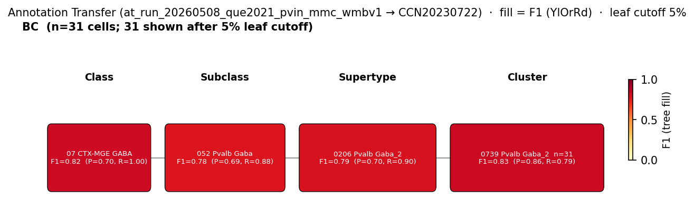

# Parvalbumin-positive basket cell — WMBv1 (CCN20230722) Mapping Report
*2026-04-09 · Source: `/Users/do12/Documents/GitHub/evidencell/kb/graphs/hippocampus/hippocampus_GABAergic_interneurons.yaml`*

---

## Introduction

Parvalbumin-positive (PV+) basket cells are fast-spiking GABAergic interneurons that form perisomatic synapses on principal cells across the hippocampal formation. They are defined classically by Pvalb immunoreactivity, GABAergic identity (Gad1/Gad2), basket-cell perisomatic axonal arborisation in the pyramidal layer, and the absence of Cnr1/CB1R that distinguishes them from the parallel CCK basket cell ensemble [5][1][6][7][8]. Mapping this classical type to a WMBv1 transcriptomic supertype/cluster is needed because the atlas's `Pvalb` subclass label aggregates basket, axo-axonic, and bistratified PV+ morphological subtypes that have high transcriptomic similarity.

### Classical type table

| Property | Value | References |
|---|---|---|
| Soma location | pyramidal layer of CA1 [UBERON:0014548]; pyramidal layer of CA3 [UBERON:0014550]; dentate gyrus granule cell layer [UBERON:0005381] | [1][2][3][4] |
| NT type | GABAergic | [5] |
| Defining markers | Pvalb, Gad1, Gad2 | [1][6][7][8] |
| Negative markers | Cnr1 | — |
| Neuropeptides | — | — |
| CL term | basket cell [CL:0000118] (BROAD) | — |

<details>
<summary>Details — source evidence for classical type properties</summary>

- **Soma location:** classical histology / immunohistochemistry · rat and mouse hippocampus · [1][2][3][4]
  > Parvalbumin + cells were specifically localized in the granular and polymorphic cell layers of the dentate gyrus and the strata oriens and pyramidale in CA1/3 fields of the rat hippocampus (Kosaka et al., 1987). They have been considered a subpopulation of GABAergic interneurons, including basket and axo-axonic cell types, which innervate the somata and proximal axons of pyramidal cells, respectively (Soriano et al., 1990)
  > — Rivera et al. 2014, Classical Functional and Morphological Interneuron Types · [1] <!-- quote_key: 10540334_bdfa426a -->

  > Fast spiking interneurons in the CA1 area of the dorsal hippocampus were recorded from and filled with biocytin in anesthetized rats. The full extent of their dendrites and axonal arborizations as well as their calcium binding protein content were examined. Based on the spatial extent of axon collaterals, local circuit cells (basket and O- LM neurons) and long-range cells (bistratified, trilaminar, and backprojection neurons) could be distinguished. Basket cells were immunoreactive for parvalbumin and their axon collaterals were confined to the pyramidal layer. A single basket cell contacted more than 1500 pyramidal neurons and 60 other parvalbumin-positive interneurons. Commissural stimulation directly discharged basket cells, followed by an early and late IPSPs, indicating interneuronal inhibition of basket cells. The dendrites of another local circuit neuron (O-LM) were confined to stratum oriens and it had a small but high-density axonal terminal field in stratum lacunosum-moleculare. The fastest firing cell of all interneurons was a calbindin-immunoreactive bistratified neuron with axonal targets in stratum oriens and radiatum. Two neurons with their cell bodies in the alveus innervated the CA3 region (backprojection cells), in addition to rich axon collaterals in the CA1 region. The trilaminar interneuron had axon collaterals in strata radiatum, oriens and pyramidale with its dendrites confined to stratum oriens. Commissural stimulation evoked an early EPSP-IPSP-late depolarizing potential sequence in this cell. All interneurons formed symmetric synapses with their targets at the electron microscopic level. These findings indicate that interneurons with distinct axonal targets have differential functions in shaping the physiological patterns of the CA1 network.
  > — Sik et al. 1995, Anatomical Location and Morphology · [2] <!-- quote_key: 10664418_9acd7ec1 -->

  > the most representative ones, the PV-expressing basket and bistratified cells, the NOS-expressing ivy cells and 2 types of interneuron-selective interneurons (ISI 1 and 3) that express calretinin
  > — Bocchio et al. 2024, Results · [4] <!-- quote_key: 262127573_ba6d02e9 -->

- **NT type:** intersectional genetic labelling · mouse forebrain · [5]
  > Cholecystokinin (CCK)- and parvalbumin (PV)-expressing neurons constitute the two major populations of perisomatic GABAergic neurons in the cortex and the hippocampus. As CCK- and PV-GABA neurons differ in an array of morphological, biochemical and electrophysiological features, it has been proposed that they form distinct inhibitory ensembles which differentially contribute to network oscillations and behavior. However, the relationship and balance between CCK- and PV-GABA neurons in the inhibitory networks of the brain is currently unclear as the distribution of these cells has never been compared on a large scale. Here, we systemically investigated the distribution of CCK- and PV-GABA cells across a wide number of discrete forebrain regions using an intersectional genetic approach. Our analysis revealed several novel trends in the distribution of these cells. While PV-GABA cells were more abundant overall, CCK-GABA cells outnumbered PV-GABA cells in several subregions of the hippocampus, medial prefrontal cortex and ventrolateral temporal cortex. Interestingly, CCK-GABA cells were relatively more abundant in secondary/ association areas of the cortex (V2, S2, M2, and AudD/AudV) than they were in corresponding primary areas (V1, S1, M1, and Aud1). The reverse trend was observed for PV-GABA cells. Our findings suggest that the balance between CCK- and PV-GABA cells in a given cortical region is related to the type of processing that area performs; inhibitory networks in the secondary cortex tend to favor the inclusion of CCK-GABA cells more than networks in the primary cortex. The intersectional genetic labeling approach employed in the current study expands upon the ability to study molecularly defined subsets of GABAergic neurons. This technique can be applied to the investigation of neuropathologies which involve disruptions to the GABAergic system, including schizophrenia, stress, maternal immune activation and autism.
  > — Whissell et al. 2015, Classification Schemes and Methodological Approaches · [5] <!-- quote_key: 16859318_009e9f36 -->

- **Pvalb marker:** immunohistochemistry / scRNA-seq · rat and mouse · [1][6][7][8]
  > the majority of interneurons in these regions express either the neuropeptide cholecystokinin or the calcium binding protein parvalbumin
  > — Contreras et al. 2019, SOMA AND AXON TARGETING INTERNEURONS · [8] <!-- quote_key: 195584607_37a80af5 -->

</details>

Cell Ontology mapping: basket cell [[CL:0000118](https://www.ebi.ac.uk/ols4/ontologies/cl/classes?obo_id=CL:0000118)] (BROAD).

---

## Results

Two candidate atlas nodes were assessed: the supertype CS20230722_SUPT_0206 (0206 Pvalb Gaba_2) and its child cluster CS20230722_CLUS_0739 (0739 Pvalb Gaba_2). CLUS_0739 is the primary mapping at MODERATE confidence, supported by patch-seq AT (F1=0.83) from morphologically identified basket cells.

**Annotation-transfer overview figures (run-level, filtered to PV basket-relevant sources).**


*F1 across taxonomy levels for the Yao 2021 (GSE185862) SSv4 Pvalb source group. The SSv4 Pvalb subclass label aggregates basket, axo-axonic and bistratified subtypes; the mapping splits between the chandelier supertype SUPT_0204 (F1=0.61) and Pvalb Gaba supertype SUPT_0206 (F1=0.32), reflecting that source-side mixing.*



*F1 across taxonomy levels for the Que 2021 (GSE142546) patch-seq BC source group (hBC+vBC, n=62, morphology-confirmed). 53/62 cells map to SUPT_0206 (F1=0.79) with cluster preference for CLUS_0739 (F1=0.83). Caveat: juvenile-skewed (mean ~P30) vs. adult WMBv1.*

### Mapping candidates

| Rank | WMBv1 cluster | Supertype | Cells (10x) | Confidence | Key property alignment | Verdict |
|---|---|---|---|---|---|---|
| 1 | 0739 Pvalb Gaba_2 [CS20230722_CLUS_0739] | 0206 Pvalb Gaba_2 | 490 | 🟡 MODERATE | Pvalb CONSISTENT · BC AT F1=0.83 | Primary mapping |
| 2 | 0206 Pvalb Gaba_2 [CS20230722_SUPT_0206] | — | 2860 | 🟡 MODERATE | Pvalb CONSISTENT · BC AT F1=0.79 | Supertype-level mapping |

2 edges total, both `evidencell:PartialOverlapMatch`.

### Property alignment — CLUS_0739 (primary)

**Table 1 — Property comparison.**

| Property | Classical | Supertype (SUPT_0206) | Best cluster (CLUS_0739) | Alignment |
|---|---|---|---|---|
| Soma location (CA1 pyr) | CA1 stratum pyramidale [UBERON:0014548] | CA1 stratum oriens (MBA:399, 818 cells); CA1 pyramidal layer not listed | CA1 pyramidal layer (MBA:407, 26 cells); CA1 SO (MBA:399, 124 cells) | APPROXIMATE |
| NT type | GABAergic | GABA | GABA | CONSISTENT |
| Pvalb expression | defining marker | Pvalb subclass; precomputed mean 8.74 | Pvalb in MERFISH markers; precomputed mean 10.63 | CONSISTENT |
| Gad1 expression | defining marker | not in supertype defining_markers; mean 10.34 | not in cluster defining_markers; mean 10.52 | APPROXIMATE |
| Gad2 expression | defining marker | not in supertype defining_markers; mean 9.28 | not in cluster defining_markers; mean 8.43 | APPROXIMATE |
| Cnr1 (neg marker) | absent | not in supertype markers; mean 1.93 | not in cluster markers; mean 1.68 | CONSISTENT |
| Cck neuropeptide | not expected (Cnr1-negative PV cells) | not assessed | Cck score 7.6; precomputed mean 7.56 | DISCORDANT |

**Table 2 — Evidence support.**

| Evidence | Type | Supports | Headline | Source |
|---|---|---|---|---|
| Atlas metadata profile | Atlas metadata | PARTIAL | hippocampal enrichment (CA1 SO 124, CA3 SO 80, CA1 pyr 26) but Cck high | atlas-internal |
| Atlas precomputed expression | Atlas metadata | SUPPORT | Pvalb=10.63, Gad1=10.52, Gad2=8.43, Cnr1=1.68 | atlas-internal |
| Yao 2021 SSv4 AT | Annotation transfer | PARTIAL | F1=0.18 at CLUSTER level (5/66 cells); SSv4 Pvalb is mixed | atlas-internal |
| Que 2021 patch-seq BC AT | Annotation transfer | SUPPORT | F1=0.83 at CLUSTER level; 31 cells; morphology-confirmed | atlas-internal |

*(PV+ hippocampal interneurons — basket, axo-axonic, bistratified — share high transcriptomic similarity and are not cleanly separated at cluster level; Que 2021 patch-seq nevertheless distinguishes BC (preferentially CLUS_0739, F1=0.83) from BIC (preferentially CLUS_0737), so the BC→CLUS_0739 signal is genuine within SUPT_0206.)*

### 0739 Pvalb Gaba_2 · 🟡 MODERATE

**Supporting evidence:**
- Que 2021 patch-seq AT (`at_run_20260508_que2021_pvin_mmc_wmbv1`): morphologically identified PV basket cells (BC, n=62; hBC+vBC aggregated) map to CLUS_0739 with F1=0.83, group_purity=0.795 (31 cells), target_purity=0.861 — the top cluster hit. BC/BIC cluster separation within SUPT_0206 (BIC preferring CLUS_0737) is a genuine transcriptomic subtype signal from patch-seq morphology-labelled cells.
- Atlas precomputed expression: Pvalb=10.63 (strongest among SUPT_0206 child clusters), Gad1=10.52, Gad2=8.43, Cnr1=1.68 (absent), confirming PV+ GABAergic identity with the expected Cnr1-negative profile.
- Atlas metadata: hippocampal enrichment with CA1 SO (124 cells), CA3 SO (80 cells), CA1 pyramidal layer (26 cells), CA1 SR (45 cells) — appropriate perisomatic-targeting interneuron distribution.

**Marker evidence provenance:**
- **Pvalb:** classical immunohistochemistry [1][6][7][8] and scRNA-seq cross-confirm — strong primary evidence; atlas precomputed mean 10.63 is the highest in SUPT_0206 (CONSISTENT).
- **Gad1 / Gad2:** classical evidence indirect (GABAergic NT); atlas-level NT annotation is `GABA`, precomputed means 10.52 and 8.43 confirm robust expression. Listed APPROXIMATE because Gad1/Gad2 are not in the cluster's defining_markers panel (they are pan-GABAergic).
- **Cnr1 (negative):** lacks a primary citation on the classical node; atlas precomputed mean 1.68 is consistent with absence (CONSISTENT). *(note: a targeted literature search for primary IHC evidence of Cnr1-/PV+ basket cell exclusion would strengthen the negative-marker provenance.)*

**Concerns:**
- ⚠ **Cck DISCORDANT:** Cck neuropeptide expression score 7.6 / precomputed mean 7.56 is unexpected for a Cnr1-negative PV basket cell (the classical PV/CCK distinction is well-established). Either the cluster contains low-level Cck-co-expressing PV cells, or boundaries do not cleanly separate from CCK basket subpopulations. Flag for investigation.
- Location APPROXIMATE: CA1 pyramidal layer has only 26 cells; dominant hippocampal MERFISH signal is in CA1 SO (124 cells). *(adjacent region — stratum oriens borders stratum pyramidale and PV basket cell somata are commonly described in SO/SP border zone; weak counter-evidence.)*
- DISTRIBUTED_ACROSS_CLUSTERS caveat: PV basket / axo-axonic / bistratified PV+ subtypes are not cleanly separable at cluster level (PMID:33398060); cluster likely contains multiple classical PV subtypes.

**What would upgrade confidence:**
- Targeted literature search for primary citation of Cnr1- in morphology-confirmed PV basket cells; resolves negative-marker provenance gap.
- An adult-staged patch-seq dataset with morphology-confirmed PV basket cells, mapped via MapMyCells to WMBv1 at F1 ≥ 0.85 at CLUSTER level — would resolve the juvenile-skew caveat in Que 2021 and add another AnnotationTransferEvidence entry.
- Investigate Cck co-expression at single-cell resolution to determine whether CLUS_0739 contains a sub-population of Cck+ PV cells or whether cluster boundaries need refinement.

### 0206 Pvalb Gaba_2 · 🟡 MODERATE

**Supporting evidence:**
- Que 2021 patch-seq AT (`at_run_20260508_que2021_pvin_mmc_wmbv1`): 53/62 BC cells map to SUPT_0206 with F1=0.79, group_purity=0.898, target_purity=0.697; SUBCLASS-level F1=0.78 (052 Pvalb Gaba). Morphology-confirmed BC cells converge on the Pvalb Gaba supertype.
- Atlas precomputed expression: Pvalb=8.74, Gad1=10.34, Gad2=9.28, Cnr1=1.93 — all 3 defining markers confirmed and negative marker absent.
- Atlas metadata: CA1 SO (818 cells), CA3 SO (152 cells) include appropriate perisomatic interneuron locations.

**Concerns:**
- DISTRIBUTED_ACROSS_CLUSTERS: supertype spans piriform area (959 cells) and is not hippocampus-specific.
- Yao 2021 SSv4 AT (`at_run_20260508_yao2021_hpf_ssv4_mmc_wmbv1`): SUPT_0206 F1=0.32 only; SSv4 Pvalb is a mixed label dominated by chandelier (SUPT_0204 F1=0.61). PARTIAL signal because the source label aggregates BC/AAC/BIC.
- Defining markers (Cort, Adamts15, Vwc2l, Ets1) listed on supertype do not include Pvalb directly — Pvalb is recovered from child-cluster MERFISH.
- Cnr1 negative-marker status not assessable at supertype metadata level (MARKER_NOT_SPECIFIC caveat).

**What would upgrade confidence:**
- Cluster-level analysis (CLUS_0739) is the appropriate resolution; SUPT_0206 is retained as the supertype-scope mapping in parallel.

---

### Methods

<details>
<summary>Data sources, analyses, and reproducibility receipts</summary>

**Classical type definition.** The PV basket cell is defined here as Pvalb+ Gad1+ Gad2+ Cnr1- GABAergic interneuron with perisomatic-targeting basket morphology in hippocampal CA1/CA3 pyramidal layer and dentate granule cell layer [1][2][3][4][5][6][7][8]. `definition_basis = CLASSICAL_MULTIMODAL` — classical histology + immunohistochemistry + scRNA-seq + patch-seq all contribute to the type definition.

**Atlas mapping query.** Candidate atlas clusters were retrieved from the WMBv1 (CCN20230722) taxonomy at ranks 0 (cluster) and 1 (supertype) using metadata-based scoring (region match, NT type, defining markers). Full scoring rules: `workflows/map-cell-type.md`.

**Property alignment.** Each defining property of the classical type was compared to the corresponding atlas-side value via the `property_comparisons` schema, with alignments graded CONSISTENT / APPROXIMATE / DISCORDANT / NOT_ASSESSED. Atlas-side numerical values came from precomputed expression on the cluster (cluster.yaml in the taxonomy reference store) and from MERFISH spatial registration for soma location.

**Annotation transfer — Yao 2021 SSv4 Pvalb.**

| Field | Value |
|---|---|
| Source dataset | GEO:GSE185862 (Yao 2021 SSv4 Pvalb subclass, n=66 HIP cells) |
| Source species | NCBITaxon:10090 |
| Target atlas | WMBv1 (CCN20230722) |
| Method | MapMyCells local (cell_type_mapper, default parameters, raw normalization, 100 bootstrap iterations) |
| Tool version | cell_type_mapper |
| n cells | 6398 (filtered to 6398) |
| Run record | [`kb/annotation_transfer_runs/at_run_20260508_yao2021_hpf_ssv4_mmc_wmbv1/manifest.yaml`](../../kb/annotation_transfer_runs/at_run_20260508_yao2021_hpf_ssv4_mmc_wmbv1/manifest.yaml) |
| Code reference | [https://github.com/AllenInstitute/cell_type_mapper](https://github.com/AllenInstitute/cell_type_mapper) |
| F1 matrix | [`f1_scores_best.csv`](../../kb/annotation_transfer_runs/at_run_20260508_yao2021_hpf_ssv4_mmc_wmbv1/f1_scores_best.csv) |

**Annotation transfer — Que 2021 patch-seq.**

| Field | Value |
|---|---|
| Source dataset | GEO:GSE142546 (Que 2021 patch-seq PV IN morphological subtypes; BC aggregate n=62) |
| Source species | NCBITaxon:10090 |
| Target atlas | WMBv1 (CCN20230722; SHA-256: b21ca985) |
| Method | MapMyCells local (cell_type_mapper v1.7.1, default parameters, raw normalization, 100 bootstrap iterations) |
| Tool version | cell_type_mapper v1.7.1 |
| n cells | 88 (filtered to 88) |
| Run record | [`kb/annotation_transfer_runs/at_run_20260508_que2021_pvin_mmc_wmbv1/manifest.yaml`](../../kb/annotation_transfer_runs/at_run_20260508_que2021_pvin_mmc_wmbv1/manifest.yaml) |
| Code reference | [https://github.com/AllenInstitute/cell_type_mapper](https://github.com/AllenInstitute/cell_type_mapper) |
| F1 matrix | [`f1_scores_aggregated_best.csv`](../../kb/annotation_transfer_runs/at_run_20260508_que2021_pvin_mmc_wmbv1/f1_scores_aggregated_best.csv) |
| Caveats | Juvenile-skewed (mean P30); TPM used as pseudo-counts; AAC n=6 uninformative; BC vs. BIC separate cleanly within SUPT_0206 |

**Anti-hallucination.** All citations, atlas accessions, ontology CURIEs, and verbatim literature quotes in this report are validated against the evidencell knowledge base at write time. Authored-prose evidence narratives are validated against their source `evidence_items[*].explanation` fields. The pre-write hook rejects any unresolvable identifier or unattributed blockquote. Specific mapping limitations and caveats are documented per-candidate in the Discussion section.

*Generated by evidencell `d121f84` at 2026-05-13T15:00:59+00:00 from [kb/graphs/hippocampus/hippocampus_GABAergic_interneurons.yaml](kb/graphs/hippocampus/hippocampus_GABAergic_interneurons.yaml).*

**Evidence base audit table.**

| Edge ID | Evidence types | Supports | Source |
| --- | --- | --- | --- |
| edge_pv_basket_cell_hippocampus_to_CS20230722_SUPT_0206 | ATLAS_METADATA ×2; ANNOTATION_TRANSFER ×2 | PARTIAL, SUPPORT, PARTIAL, SUPPORT | atlas-internal |
| edge_pv_basket_cell_hippocampus_to_CS20230722_CLUS_0739 | ATLAS_METADATA ×2; ANNOTATION_TRANSFER ×2 | PARTIAL, SUPPORT, PARTIAL, SUPPORT | atlas-internal |

</details>

---

## Discussion

**Primary mapping:** Parvalbumin-positive basket cell → 0739 Pvalb Gaba_2 [CS20230722_CLUS_0739] at MODERATE confidence. Key support: Que 2021 patch-seq AT (F1=0.83 at CLUSTER level from morphology-confirmed basket cells) and atlas precomputed expression (Pvalb=10.63, Cnr1=1.68). Key caveats: MARKER_NOT_SPECIFIC (Cck DISCORDANT) and DISTRIBUTED_ACROSS_CLUSTERS (BC/AAC/BIC transcriptomically similar within SUPT_0206).

The Cell Ontology has no specific term for this population; basket cell [[CL:0000118](https://www.ebi.ac.uk/ols4/ontologies/cl/classes?obo_id=CL:0000118)] is the closest ancestor. CL:0000118 covers perisomatic-targeting GABAergic interneurons but does not capture PV-specific identity. No hippocampus-specific PV basket cell term exists in CL.

### Proposed experiments and follow-ups

- **What:** Adult-staged patch-seq with morphology-confirmed PV basket cells mapped to WMBv1.
  **Target:** F1 ≥ 0.85 at CLUSTER level on CLUS_0739.
  **Expected output:** Additional AnnotationTransferEvidence entry.
  **Resolves:** Que 2021 juvenile-skew caveat; would lift CLUS_0739 confidence to HIGH.

- **What:** Targeted re-analysis of Cck co-expression at single-cell resolution within CLUS_0739.
  **Target:** Determine whether Cck signal originates from a sub-population of Cck+/PV+ cells or boundary mixing with CCK basket cells.
  **Expected output:** ATLAS_QUERY / re-analysis evidence; possible cluster-boundary refinement note.
  **Resolves:** DISCORDANT Cck neuropeptide alignment.

- **What:** Literature search for primary citation of Cnr1- expression in morphology-confirmed PV basket cells.
  **Target:** At least one IHC or scRNA-seq study reporting Cnr1/CB1R absence in PV+ basket cells.
  **Expected output:** LiteratureEvidence with citation on the `Cnr1` negative_marker entry.
  **Resolves:** Negative-marker provenance gap.

### Open questions

1. Does CLUS_0739 contain a Cck-co-expressing PV sub-population, or do cluster boundaries mix with the CCK basket cell ensemble?
2. Are BC, AAC and BIC PV+ subtypes separable at a sub-cluster level given high transcriptomic similarity (PMID:33398060)?
3. Are the Que 2021 patch-seq mappings stable when applied to an adult mouse cohort matched to WMBv1's age range?

---

## References

| # | Citation | PMID | Used for |
|---|---|---|---|
| [1] | Rivera et al. 2014 | [25018703](https://pubmed.ncbi.nlm.nih.gov/25018703) | soma location, Pvalb marker |
| [2] | Sik et al. 1995 | [7472426](https://pubmed.ncbi.nlm.nih.gov/7472426) | soma location, morphology |
| [3] | Müller & Remy 2014 | [25324774](https://pubmed.ncbi.nlm.nih.gov/25324774) | soma location |
| [4] | Bocchio et al. 2024 | [39401246](https://pubmed.ncbi.nlm.nih.gov/39401246) | soma location, type list |
| [5] | Whissell et al. 2015 | [26441554](https://pubmed.ncbi.nlm.nih.gov/26441554) | neurotransmitter type |
| [6] | Que et al. 2021 | [33398060](https://pubmed.ncbi.nlm.nih.gov/33398060) | Pvalb marker, patch-seq morphology |
| [7] | Perrenoud et al. 2022 | [35802727](https://pubmed.ncbi.nlm.nih.gov/35802727) | Pvalb marker |
| [8] | Contreras et al. 2019 | [31297048](https://pubmed.ncbi.nlm.nih.gov/31297048) | Pvalb marker |

---

<!-- verdict-block-start: edge_pv_basket_cell_hippocampus_to_CS20230722_CLUS_0739 -->
```yaml
verdict:
  confidence: MODERATE
  confidence_score: 0.72
  rationale: >
    Que 2021 patch-seq morphology-confirmed PV basket cells map to
    CS20230722_CLUS_0739 with F1=0.83 (at_run_20260508_que2021_pvin_mmc_wmbv1,
    scRNA-seq patch-seq, morphology, biocytin), the top cluster hit within
    CS20230722_SUPT_0206 and distinct from BIC (CS20230722_CLUS_0737); atlas
    precomputed Pvalb=10.63 and Cnr1=1.68 confirm the immunohistochemistry-defined
    Pvalb+/Cnr1- profile, with 2 of 5 marker_-prefixed PCs CONSISTENT. Held at MODERATE rather
    than HIGH because Cck neuropeptide is DISCORDANT (mean 7.56) and the Yao 2021
    SSv4 AT (at_run_20260508_yao2021_hpf_ssv4_mmc_wmbv1) is PARTIAL (F1=0.18 at
    CLUSTER) due to mixed-subtype source labelling.
  unresolved_questions:
    - Does CS20230722_CLUS_0739 contain a Cck-co-expressing PV sub-population, or do cluster boundaries mix with the CCK basket cell ensemble?
    - Are Que 2021 patch-seq mappings stable when applied to adult mouse cohorts matched to WMBv1 age range?
```
<!-- verdict-block-end -->

<!-- verdict-block-start: edge_pv_basket_cell_hippocampus_to_CS20230722_SUPT_0206 -->
```yaml
verdict:
  confidence: MODERATE
  confidence_score: 0.7
  rationale: >
    Que 2021 patch-seq BC aggregate (scRNA-seq patch-seq, morphology) maps to
    CS20230722_SUPT_0206 with F1=0.79 (at_run_20260508_que2021_pvin_mmc_wmbv1)
    and SUBCLASS F1=0.78 (CS20230722_SUBC_052); atlas precomputed Pvalb=8.74,
    Gad1=10.34, Gad2=9.28, Cnr1=1.93 cross-check the immunohistochemistry
    Pvalb+/Cnr1- defining profile, with 2 of 4 marker_-prefixed PCs CONSISTENT. Held at
    MODERATE because the supertype spans piriform area (DISTRIBUTED_ACROSS_CLUSTERS)
    and the Yao 2021 SSv4 AT (at_run_20260508_yao2021_hpf_ssv4_mmc_wmbv1) is
    PARTIAL (F1=0.32) due to mixed BC/AAC/BIC source labelling that prevents
    subtype resolution at supertype level.
  unresolved_questions:
    - Are PV basket, axo-axonic, and bistratified subtypes separable at a sub-cluster level within CS20230722_SUPT_0206 given high transcriptomic similarity?
```
<!-- verdict-block-end -->
