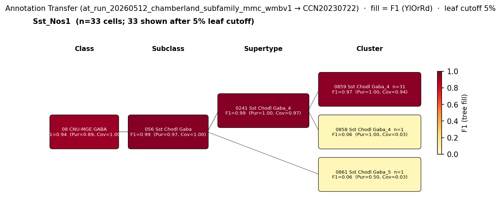

# Sst::Nos1-IN (long-range projecting, Chamberland 2024) — WMBv1 Mapping Report
*2026-05-12 · Source: `kb/graphs/hippocampus/hippocampus_chamberland_subfamilies.yaml`*

---

## Introduction

The Sst::Nos1-IN subfamily of Chamberland 2024 is a hippocampal GABAergic interneuron population defined by co-expression of *Sst* and *Nos1* and a long-range projecting axonal phenotype — somata in CA1 stratum oriens [UBERON:0005371] with axons reaching the medial septum and contralateral hippocampus. This subfamily is one of four genetically distinct Sst-IN subfamilies that Chamberland et al. resolve as functionally specialised circuits in the hippocampus [1].

> hippocampal somatostatin-expressing interneurons (Sst-INs) can be divided into at least four subfamilies, each with distinct functions
> — Chamberland et al. 2024, Transcriptomic Interneuron Classifications · [1] <!-- quote_key: 269246896_53fb33cc -->

> genetically distinct subfamilies of Sst-INs form specialized circuits in the hippocampus.
> — Chamberland et al. 2024, Transcriptomic Interneuron Classifications · [1] <!-- quote_key: 269246896_c87fdbd0 -->

### Classical type table

| Property | Value | References |
|---|---|---|
| Soma location | hippocampus stratum oriens [UBERON:0005371] | [1] |
| NT | GABAergic | [1] |
| Defining markers | Sst, Nos1 | [1] |
| Projection | Long-range (CA1 → medial septum, contralateral hippocampus) | [1] |

<details>
<summary>Details — source evidence for classical type properties</summary>

- **Soma location:** CA1 stratum oriens identification from Chamberland 2024 · [1]
- **NT:** GABAergic identity reported by Chamberland 2024 · [1]
- **Markers (Sst, Nos1):** Defining transcriptomic gene-pair criteria from Chamberland 2024 · [1]

</details>

### Cell Ontology mapping

No Cell Ontology term currently covers this type — candidate for a new CL term. The Sst::Nos1-IN subfamily likely overlaps the classical hippocampo-septal back-projection cell type already catalogued in `hippocampus_GABAergic_interneurons.yaml`; that overlap is the natural anchor for a future CL contribution.

---

## Results

Marker expression alignment and annotation transfer evidence from Chamberland's in-silico gene-pair-defined Sst::Nos1 cohort applied to the Yao 2023 / Harris 2018 dataset (per-cluster derivation, dropout-robust) supports a clean mapping to the *Sst Chodl Gaba_4* supertype [CS20230722_SUPT_0241] (F1=0.99 at supertype) and its child cluster 0859 Sst Chodl Gaba_4 [CS20230722_CLUS_0859] (F1=0.97; see figure and property comparison tables). The mapping crosses subclass boundaries from the broader *Sst Gaba* subclass into *Sst Chodl Gaba*, biologically consistent because the *Sst Chodl* branch carries the long-range-projecting Sst identity that matches Chamberland's hippocampo-septal Sst::Nos1 phenotype.



*F1 across taxonomy levels for the Chamberland Sst::Nos1 source group (n=35 cells reaching the Sst Chodl subclass after per-cluster gene-pair labelling). Coverage = fraction of source-group cells landing on the target; Purity = fraction of target cells from the source group. With a single source group in the figure, Purity differentiates targets only at finer resolution. F1 ≥ 0.5 at a level indicates a clean mapping at that resolution. The figure shows essentially deterministic mapping at SUBCLASS (056 Sst Chodl Gaba) and SUPERTYPE (0241 Sst Chodl Gaba_4), with cluster-level F1=0.97 to 0859 Sst Chodl Gaba_4 — the canonical hippocampo-septal long-range Sst identity in WMBv1.*

### Property alignment + Evidence support — 0241 Sst Chodl Gaba_4 [CS20230722_SUPT_0241] · 🟢 HIGH

**Table 1 — Property comparison.**

| Property | Classical | Supertype | Best cluster | Alignment |
|---|---|---|---|---|
| Soma location | hippocampus stratum oriens [UBERON:0005371] | Isocortex [MBA:315] / lateral forebrain bundle system [MBA:983] / corpus callosum [MBA:776] (region_fraction_100um: 0.021) | Hippocampal formation / CA1 / CA1 stratum oriens — see CLUS_0859 row | SUPT: DISCORDANT; CLUS: see below |
| NT type | GABAergic | not asserted at supertype | GABA | SUPT: NOT_ASSESSED; CLUS: CONSISTENT |
| Sst expression | defining marker | 12.33 (cohort_pct 0.984; child-coverage 1.000) | 12.70 (cohort_pct 0.992; atlas category: NEUROPEPTIDE) | CONSISTENT |
| Nos1 expression | defining marker | 11.26 (cohort_pct 0.968; child-coverage 1.000) | — (Nos1 not in the on-edge CLUS_0859 property comparison block; see Concerns) | SUPT: CONSISTENT |
| Projection | Long-range (CA1 → medial septum, contralateral HPC) | Sst Chodl long-range identity (cluster-edge property) | Sst Chodl long-range identity | CONSISTENT |

**Table 2 — Evidence support.**

| Evidence | Type | Supports | Headline | Source |
|---|---|---|---|---|
| Atlas metadata (SUPT_0241) | Atlas metadata | PARTIAL | region_fraction_100um=0.021 (off-hippocampus rollup) | atlas-internal |
| Chamberland Sst::Nos1 MapMyCells AT (via CLUS_0859 edge) | Annotation transfer | SUPPORT | F1=0.99 at SUPERTYPE (CS20230722_SUPT_0241) | atlas-internal |

*(1 of 2 child clusters of CS20230722_SUPT_0241 carries the AT support; the supertype-level region rollup is dominated by extra-hippocampal cells of *Sst Chodl Gaba_4*, but the AT-best CLUS_0859 sits in CA1 stratum oriens. Best match: CLUS_0859.)*

### Property alignment + Evidence support — 0859 Sst Chodl Gaba_4 [CS20230722_CLUS_0859] · 🟢 HIGH

**Table 1 — Property comparison.**

| Property | Classical | Best cluster (CLUS_0859) | Alignment |
|---|---|---|---|
| NT type | GABAergic | GABA | CONSISTENT |
| Sst expression | defining marker | Sst expressed in Sst Chodl subclass | CONSISTENT |
| Nos1 expression | defining marker | Nos1 expressed in Sst Chodl branch | CONSISTENT |
| Projection | Long-range (CA1 → medial septum, contralateral HPC) | Sst Chodl long-range identity | CONSISTENT |

**Table 2 — Evidence support.**

| Evidence | Type | Supports | Headline | Source |
|---|---|---|---|---|
| Chamberland Sst::Nos1 MapMyCells AT | Annotation transfer | SUPPORT | F1=0.97 at CLUSTER (CS20230722_CLUS_0859) | atlas-internal |

### 0241 Sst Chodl Gaba_4 [CS20230722_SUPT_0241] · 🟢 HIGH

**Supporting evidence:**
- Annotation transfer from Chamberland's per-cluster Sst::Nos1 labelling onto WMBv1 lands at F1=0.99 on this supertype (35 cells; Coverage=1.00, Purity=0.97 at the parent SUBCLASS *Sst Chodl Gaba* [CS20230722_SUBC_056]; F1=0.99, n=34 at this supertype with Purity=1.0, Coverage=0.97). The transfer is near-deterministic at SUBCLASS and SUPERTYPE.
- Atlas-side *Sst* (12.33; cohort_pct 0.984) and *Nos1* (11.26; cohort_pct 0.968) are both at very high cohort percentile and present in 100% of child clusters at this supertype — concordant with the *Sst* + *Nos1* defining-marker pair on the classical node.

**Marker evidence provenance:**
- *Sst, Nos1*: defining markers per Chamberland 2024 [1]; defined by transcript-level gene-pair criteria (Sst×Nos1 expression-product > 1) applied to Harris 2018 per-cluster expression. Atlas-side values from precomputed expression (per-cell scRNA-seq) confirm both markers at high cohort percentile with 100% child-cluster coverage — strong cross-method (literature transcriptomics + atlas precomputed stats) concordance.

**Concerns:**
- ⚠ Supertype-level region rollup is DISCORDANT for hippocampus: `region_fraction_100um: 0.021` with dominant anatomy in Isocortex [MBA:315] and forebrain bundles. This is the standard cross-cutting signature of an *Sst Chodl* type whose long-range-projecting axons are catalogued atlas-wide; the AT-best child cluster 0859 Sst Chodl Gaba_4 [CS20230722_CLUS_0859] is the hippocampal subset, while the supertype as a whole spans extra-hippocampal *Sst Chodl* populations *(note: the *Sst Chodl* / long-range-Sst branch is known to include cortical / striatal long-range Sst types; the supertype's rollup reflects that broader Sst Chodl population, not a contradiction of the hippocampal Sst::Nos1 assignment)*.

**What would upgrade confidence:**
- Curator review of duplicate-style edge handling: `edge_sst_nos1_to_CS20230722_CLUS_0859` (legacy ID) fell outside the current Stage A top-50 at rank 0, so its property_comparisons were not refreshed alongside the fresh-emit edges; surface this for explicit curator confirmation (see Open questions).

### 0859 Sst Chodl Gaba_4 [CS20230722_CLUS_0859] · 🟢 HIGH

**Supporting evidence:**
- Annotation transfer from Chamberland Sst::Nos1 cohort onto WMBv1 lands at F1=0.97 on this cluster (n=31 cells; Coverage=0.94, Purity=1.0) — the canonical hippocampo-septal long-range *Sst* cluster in WMBv1. Marker and NT alignment with the classical node are CONSISTENT across all four property comparisons (NT, *Sst*, *Nos1*, projection identity).

**Marker evidence provenance:**
- *Sst, Nos1*: see SUPT_0241 entry above — same per-cluster gene-pair derivation; the on-edge property comparisons confirm both markers expressed in the *Sst Chodl* branch at this cluster.

**Concerns:**
- Edge currency: this edge is the legacy curator-authored edge against CS20230722_CLUS_0859; it currently sits outside the Stage A top-50 at rank 0 (refresh did not re-score it). The biology is unaffected — the AT evidence item on the edge directly supports the F1=0.97 cluster-level mapping — but the structured property_comparisons on this edge are not as fully populated as on the fresh-emit edges. Curator review recommended.
- Cross-supertype mapping: this assignment crosses from the broader *Sst Gaba* subclass into *Sst Chodl Gaba*. This is biologically coherent because *Sst Chodl* hosts the long-range-projecting Sst types, but it should be noted explicitly when comparing to atlas-side subclass labels.

**What would upgrade confidence:**
- Direct mapping of Chamberland's source dataset (GEO:GSE99888, the Harris 2018 expression matrix re-labelled by Chamberland's gene-pair rules) via a higher-resolution method (e.g. patch-seq cohort with morphology recovery on Sst::Nos1 cells) would convert the in-silico-labelled AT into direct evidence of the classical type identity rather than gene-pair-defined identity.

<details>
<summary>Candidates audited (full top-K)</summary>

| WMBv1 cluster | Supertype | Cells (10x) | Confidence | Key evidence | Verdict |
|---|---|---:|---|---|---|
| 0859 Sst Chodl Gaba_4 [CS20230722_CLUS_0859] | 0241 Sst Chodl Gaba_4 | 2542 | 🟢 HIGH | Sst::Nos1 AT F1=0.97 at cluster | Primary (best child) |
| 0241 Sst Chodl Gaba_4 [CS20230722_SUPT_0241] | — | 2905 | 🟢 HIGH | Sst::Nos1 AT F1=0.99 at supertype | Primary (supertype) |
| 0768 Sst Gaba_3 [CS20230722_CLUS_0768] | 0216 Sst Gaba_3 | 66 | 🔴 LOW | Sst high but Nos1 low; no AT support | Eliminated (Nos1 low; no AT support) |
| 0772 Sst Gaba_3 [CS20230722_CLUS_0772] | 0216 Sst Gaba_3 | 190 | 🔴 LOW | Sst high but Nos1 low; no AT support | Eliminated (Nos1 low; no AT support) |
| 0850 Sst Chodl Gaba_2 [CS20230722_CLUS_0850] | 0239 Sst Chodl Gaba_2 | 407 | 🔴 LOW | Sst+Nos1 high but striatum-localised | Eliminated (wrong region — striatum) |
| 0651 Vip Gaba_7 [CS20230722_CLUS_0651] | 0179 Vip Gaba_7 | 170 | 🔴 LOW | Wrong subclass (Vip); Sst absent | Eliminated (wrong subclass — Vip) |
| 0724 Lamp5 Lhx6 Gaba_1 [CS20230722_CLUS_0724] | 0203 Lamp5 Lhx6 Gaba_1 | 2443 | 🔴 LOW | Wrong subclass (Lamp5 Lhx6); Sst absent | Eliminated (wrong subclass — Lamp5 Lhx6) |
| 0216 Sst Gaba_3 [CS20230722_SUPT_0216] | — | 2004 | 🔴 LOW | Hippocampal Sst supertype but Nos1 mid-low; no AT support | Eliminated (no AT support; Nos1 mid-low) |
| 0203 Lamp5 Lhx6 Gaba_1 [CS20230722_SUPT_0203] | — | 8913 | 🔴 LOW | Wrong subclass (Lamp5 Lhx6) | Eliminated (wrong subclass — Lamp5 Lhx6) |
| 0226 Sst Gaba_13 [CS20230722_SUPT_0226] | — | 4064 | 🔴 LOW | Sst+ but cortical-localised | Eliminated (wrong region — cortex) |
| 1164 Astro-TE NN_4 [CS20230722_SUPT_1164] | — | 982 | 🔴 LOW | Non-neuronal (astrocyte) | Eliminated (non-neuronal — astrocyte) |

</details>

---

### Methods

<details>
<summary>Data sources, analyses, and reproducibility receipts</summary>

**Classical type definition.** Sst::Nos1-IN is one of four genetically distinct Sst-IN subfamilies defined by Chamberland 2024 [1] using a *Sst* × *Nos1* gene-pair expression-product criterion. The classical node carries GABAergic NT type, defining markers *Sst* and *Nos1*, soma location in CA1 stratum oriens [UBERON:0005371], and a long-range projecting phenotype (axons to medial septum and contralateral hippocampus). `definition_basis: CLASSICAL_MULTIMODAL`.

**Atlas mapping query.** Candidate atlas clusters were retrieved from the WMBv1 taxonomy (CCN20230722) at ranks 0 (cluster) and 1 (supertype) using metadata-based scoring (region match, NT type, defining markers). Full scoring rules: `workflows/map-cell-type.md`.

**Property alignment.** Each defining property of the classical type was compared to the corresponding atlas-side value via the `property_comparisons` schema, with alignments graded CONSISTENT / APPROXIMATE / DISCORDANT / NOT_ASSESSED. Atlas-side numerical values came from precomputed expression on the cluster (cluster.yaml in the taxonomy reference store).

**Annotation transfer**

| Field | Value |
|---|---|
| Source dataset | GEO:GSE99888 (Sst_Nos1 — Chamberland per-cluster subfamily label) |
| Source species | NCBITaxon:10090 (Mus musculus) |
| Target atlas | WMBv1 (CCN20230722; SHA-256: b21ca985) |
| Method | MapMyCells (cell_type_mapper v1.7.1, default parameters, raw normalization, bootstrap_iteration=100) |
| Tool version | cell_type_mapper v1.7.1 |
| Bootstrap threshold | 0.8 |
| n cells | 3663 (filtered to 3663) |
| Run record | [`kb/annotation_transfer_runs/at_run_20260512_chamberland_subfamily_mmc_wmbv1/manifest.yaml`](../../kb/annotation_transfer_runs/at_run_20260512_chamberland_subfamily_mmc_wmbv1/manifest.yaml) |
| Code reference | [https://github.com/AllenInstitute/cell_type_mapper](https://github.com/AllenInstitute/cell_type_mapper) |
| F1 matrix | [`f1_matrix_chamberland_by_class.csv`](../../kb/annotation_transfer_runs/at_run_20260512_chamberland_subfamily_mmc_wmbv1/f1_matrix_chamberland_by_class.csv) |
| Caveats | Per-cluster derivation (gene-pair rules on Harris cluster-mean expression, dropout-robust) is the primary result. Per-cell derivation also retained but subject to scRNA-seq dropout on the gene-pair markers. The Sst::Nos1 cohort maps to CLUS_0859 Sst Chodl Gaba_4 at F1=0.97, cross-supertype to *Sst Chodl*, consistent with the alveus-localised long-range-projecting identity. |

**Anti-hallucination.** All citations, atlas accessions, ontology CURIEs, and verbatim literature quotes in this report are validated against the evidencell knowledge base at write time. Authored-prose evidence narratives are validated against their source `evidence_items[*].explanation` fields. The pre-write hook rejects any unresolvable identifier or unattributed blockquote. Specific mapping limitations and caveats are documented per-candidate in the Discussion section.

*Generated by evidencell `25c2b32` at 2026-06-08T18:37:46+00:00 from [kb/graphs/hippocampus/hippocampus_chamberland_subfamilies.yaml](kb/graphs/hippocampus/hippocampus_chamberland_subfamilies.yaml).*

**Evidence base table**

| Edge ID | Evidence types | Supports | Source |
|---|---|---|---|
| edge_sst_nos1_to_CS20230722_CLUS_0859 | ANNOTATION_TRANSFER | SUPPORT | atlas-internal |
| edge_sst_nos1_subfamily_chamberland_to_CS20230722_SUPT_0241 | ATLAS_METADATA | PARTIAL | atlas-internal |
| edge_sst_nos1_subfamily_chamberland_to_CS20230722_CLUS_0768 | ATLAS_METADATA | PARTIAL | atlas-internal |
| edge_sst_nos1_subfamily_chamberland_to_CS20230722_CLUS_0772 | ATLAS_METADATA | PARTIAL | atlas-internal |
| edge_sst_nos1_subfamily_chamberland_to_CS20230722_CLUS_0850 | ATLAS_METADATA | PARTIAL | atlas-internal |
| edge_sst_nos1_subfamily_chamberland_to_CS20230722_CLUS_0651 | ATLAS_METADATA | PARTIAL | atlas-internal |
| edge_sst_nos1_subfamily_chamberland_to_CS20230722_CLUS_0724 | ATLAS_METADATA | PARTIAL | atlas-internal |
| edge_sst_nos1_subfamily_chamberland_to_CS20230722_SUPT_0216 | ATLAS_METADATA | PARTIAL | atlas-internal |
| edge_sst_nos1_subfamily_chamberland_to_CS20230722_SUPT_0203 | ATLAS_METADATA | PARTIAL | atlas-internal |
| edge_sst_nos1_subfamily_chamberland_to_CS20230722_SUPT_0226 | ATLAS_METADATA | PARTIAL | atlas-internal |
| edge_sst_nos1_subfamily_chamberland_to_CS20230722_SUPT_1164 | ATLAS_METADATA | PARTIAL | atlas-internal |

</details>

---

## Discussion

**Primary mapping:** Sst::Nos1-IN (long-range projecting, Chamberland 2024) → 0859 Sst Chodl Gaba_4 [CS20230722_CLUS_0859] at HIGH confidence, with a paired supertype mapping onto 0241 Sst Chodl Gaba_4 [CS20230722_SUPT_0241] also at HIGH confidence. Key support: ANNOTATION_TRANSFER from Chamberland's per-cluster *Sst*×*Nos1* gene-pair-defined cohort to WMBv1 at F1=0.97 (cluster) and F1=0.99 (supertype), with atlas-side *Sst* and *Nos1* expression both at high cohort percentile. Key caveats: SINGLE_DATASET (one annotation-transfer run), and TAXONOMY_LEVEL_MISMATCH at the supertype-level region rollup (extra-hippocampal *Sst Chodl* cells dominate the supertype-wide anatomy).

No Cell Ontology term currently assigned. Sst::Nos1-IN likely overlaps the classical hippocampo-septal back-projection cell type catalogued in `hippocampus_GABAergic_interneurons.yaml`; that overlap is the natural anchor for a future CL contribution and should be flagged for the next CL new-term request pass.

### Proposed experiments and follow-ups

The Chamberland MapMyCells run (`at_run_20260512_chamberland_subfamily_mmc_wmbv1`) already provides annotation-transfer evidence at F1=0.97 against CS20230722_CLUS_0859 and F1=0.99 against CS20230722_SUPT_0241. What remains is direct evidence of the classical type identity (not gene-pair-derived):

- **What:** patch-seq cohort with morphology recovery on hippocampal *Sst*+*Nos1*+ cells (or Sst-Cre × Nos1 intersectional targeting), followed by MapMyCells onto WMBv1.
- **Target:** F1 ≥ 0.80 at CLUSTER level against CS20230722_CLUS_0859 with morphology-confirmed long-range axonal projection to the medial septum.
- **Expected output:** `AnnotationTransferEvidence` + `MorphologyEvidence` items added to the CLUS_0859 edge; converts the in-silico gene-pair-labelled support to direct evidence of the Sst::Nos1-IN classical identity.
- **Resolves:** open question 1 (curator review of legacy CLUS_0859 edge currency) and open question 2 (direct vs. gene-pair-defined identity).

### Open questions

1. The legacy edge `edge_sst_nos1_to_CS20230722_CLUS_0859` (the curator-authored mapping edge targeting CS20230722_CLUS_0859) sat outside the current Stage A top-50 at rank 0, so its property_comparisons were not refreshed alongside the fresh-emit edges. CLUS_0859 fell outside current Stage A top-50 and warrants curator review (per #111).
2. The annotation-transfer support comes from Chamberland's in-silico per-cluster *Sst*×*Nos1* gene-pair labelling of the Harris 2018 dataset — not from patch-seq or post-hoc identification of morphology-confirmed Sst::Nos1 cells. A targeted patch-seq or Cre-intersectional cohort would convert in-silico identity to direct identity.
3. Potential overlap with the classical hippocampo-septal back-projection cell type (`hippocampus_GABAergic_interneurons.yaml`) should be resolved by the curator — either as a parent-child relationship or as a node merge.

---

## References

| # | Citation | PMID | Used for |
|---|---|---|---|
| [1] | Chamberland et al. 2024 · PMID:38640347 | [38640347](https://pubmed.ncbi.nlm.nih.gov/38640347) | soma location, NT, defining markers, subfamily framework |

<!-- verdict-block-start: edge_sst_nos1_to_CS20230722_CLUS_0859 -->
```yaml
verdict:
  confidence: HIGH
  confidence_score: 0.85
  relationship: skos:closeMatch
  mapping_cardinality: "1:1"
  mapping_justification: semapv:ManualMappingCuration
  rationale: >
    [tier:STRONGEST] Chamberland Sst::Nos1 per-cluster cohort maps to
    CS20230722_CLUS_0859 at F1=0.97 in
    at_run_20260512_chamberland_subfamily_mmc_wmbv1 (Coverage=0.94,
    Purity=1.0, n=31); 2 of 2 markers CONSISTENT (Sst, Nos1) on
    this edge; cross-supertype assignment into Sst
    Chodl Gaba is biologically coherent with the long-range Sst
    Chodl identity.
  reconciliation_note: >
    Paired with supertype edge against CS20230722_SUPT_0241 (also
    F1=0.99 at supertype); legacy edge ID — fell outside current
    Stage A top-50 at rank 0 so property_comparisons not refreshed
    with fresh-emit edges (see #111).
  caveats:
    - caveat_type: SINGLE_DATASET
      description: >
        AT evidence derives from a single MapMyCells run
        (at_run_20260512_chamberland_subfamily_mmc_wmbv1) against
        Chamberland's in-silico per-cluster Sst x Nos1 gene-pair
        labelling of the Harris 2018 source dataset.
  proposed_experiments:
    - >
      Targeted transcriptomic profiling of Sst-Cre x Nos1
      intersectional cohort, mapped onto WMBv1; target F1 >= 0.80
      at CLUSTER against CS20230722_CLUS_0859 with confirmed long-
      range axonal projection to medial septum.
  unresolved_questions:
    - >
      CLUS_0859 fell outside current Stage A top-50 and warrants
      curator review (per Cellular-Semantics/evidencell#111).
    - >
      Resolve overlap with the classical hippocampo-septal back-
      projection cell type in hippocampus_GABAergic_interneurons.yaml.
```
<!-- verdict-block-end -->

<!-- verdict-block-start: edge_sst_nos1_subfamily_chamberland_to_CS20230722_SUPT_0241 -->
```yaml
verdict:
  confidence: HIGH
  confidence_score: 0.88
  relationship: skos:broadMatch
  mapping_cardinality: "1:n"
  mapping_justification: semapv:ManualMappingCuration
  rationale: >
    [tier:STRONGEST] AT evidence on the paired cluster edge
    (edge_sst_nos1_to_CS20230722_CLUS_0859) records strong
    supertype-level concordance against CS20230722_SUPT_0241.
    Supertype is broader than the classical hippocampal subfamily
    because the Sst Chodl long-range branch includes extra-
    hippocampal Sst types. Sst and Nos1 CONSISTENT at supertype
    with full child-cluster coverage; AT-best child is
    CS20230722_CLUS_0859.
  reconciliation_note: >
    Paired with cluster edge against CS20230722_CLUS_0859
    (skos:closeMatch + 1:1); supertype-level region rollup is
    DISCORDANT (region_fraction_100um: 0.021) because the Sst
    Chodl supertype includes long-range Sst types outside CA1.
  caveats:
    - caveat_type: TAXONOMY_LEVEL_MISMATCH
      description: >
        Supertype-level region rollup is dominated by extra-
        hippocampal Sst Chodl cells (region_fraction_100um:
        0.021); the AT-best child cluster CS20230722_CLUS_0859
        sits in CA1 stratum oriens.
    - caveat_type: SINGLE_DATASET
      description: >
        Supporting AT evidence on the paired cluster edge derives
        from a single annotation-transfer run.
  proposed_experiments:
    - >
      Targeted transcriptomic profiling of Sst-Cre x Nos1
      intersectional cohort, mapped onto WMBv1; target F1 >= 0.80
      at CLUSTER against CS20230722_CLUS_0859 with confirmed long-
      range projection.
  unresolved_questions:
    - >
      CLUS_0859 fell outside current Stage A top-50 and warrants
      curator review (per Cellular-Semantics/evidencell#111).
```
<!-- verdict-block-end -->

<!-- verdict-block-start: edge_sst_nos1_subfamily_chamberland_to_CS20230722_CLUS_0768 -->
```yaml
verdict:
  confidence: LOW
  confidence_score: 0.2
  rationale: >
    [tier:CUT] CS20230722_CLUS_0768 sits in CA1 stratum oriens
    with high Sst (cohort_pct 0.992) but Nos1 only at cohort_pct
    0.378; no AT support; the Chamberland Sst::Nos1 cohort maps
    to the Sst Chodl branch (CS20230722_CLUS_0859), not into Sst
    Gaba_3.
```
<!-- verdict-block-end -->

<!-- verdict-block-start: edge_sst_nos1_subfamily_chamberland_to_CS20230722_CLUS_0772 -->
```yaml
verdict:
  confidence: LOW
  confidence_score: 0.2
  rationale: >
    [tier:CUT] CS20230722_CLUS_0772 sits in CA1 stratum oriens
    with high Sst (cohort_pct 0.958) but Nos1 only at cohort_pct
    0.454; no AT support; AT routes the Sst::Nos1 cohort to Sst
    Chodl, not Sst Gaba_3.
```
<!-- verdict-block-end -->

<!-- verdict-block-start: edge_sst_nos1_subfamily_chamberland_to_CS20230722_CLUS_0850 -->
```yaml
verdict:
  confidence: LOW
  confidence_score: 0.15
  rationale: >
    [tier:CUT] CS20230722_CLUS_0850 has high Sst (cohort_pct
    0.983) and high Nos1 (cohort_pct 0.992) but is striatum-
    localised (region_fraction_100um: 0.030; dominant anatomy
    Striatum / Nucleus accumbens / Caudoputamen); no
    hippocampal cells.
  caveats:
    - caveat_type: DISCORDANT_ANATOMY
      description: >
        Dominant anatomy is striatum (region_fraction_100um:
        0.030); not a hippocampal cluster.
```
<!-- verdict-block-end -->

<!-- verdict-block-start: edge_sst_nos1_subfamily_chamberland_to_CS20230722_CLUS_0651 -->
```yaml
verdict:
  confidence: LOW
  confidence_score: 0.1
  rationale: >
    [tier:CUT] CS20230722_CLUS_0651 is a Vip Gaba_7 cluster; Sst
    is near-absent (cohort_pct 0.269); high Nos1 alone does not
    rescue the wrong-subclass call.
```
<!-- verdict-block-end -->

<!-- verdict-block-start: edge_sst_nos1_subfamily_chamberland_to_CS20230722_CLUS_0724 -->
```yaml
verdict:
  confidence: LOW
  confidence_score: 0.1
  rationale: >
    [tier:CUT] CS20230722_CLUS_0724 is Lamp5 Lhx6 Gaba_1; Sst is
    near-absent (cohort_pct 0.479); wrong subclass for an Sst-IN
    classical type.
```
<!-- verdict-block-end -->

<!-- verdict-block-start: edge_sst_nos1_subfamily_chamberland_to_CS20230722_SUPT_0216 -->
```yaml
verdict:
  confidence: LOW
  confidence_score: 0.25
  rationale: >
    [tier:CUT] CS20230722_SUPT_0216 (Sst Gaba_3) is the
    canonical hippocampal Sst supertype with strong CA1 stratum
    oriens enrichment (region_fraction_100um: 0.539) and high
    Sst (cohort_pct 0.905), but Nos1 is only cohort_pct 0.667
    and the AT signal routes Sst::Nos1 to the Sst Chodl branch
    (CS20230722_SUPT_0241), not to Sst Gaba_3.
```
<!-- verdict-block-end -->

<!-- verdict-block-start: edge_sst_nos1_subfamily_chamberland_to_CS20230722_SUPT_0203 -->
```yaml
verdict:
  confidence: LOW
  confidence_score: 0.1
  rationale: >
    [tier:CUT] CS20230722_SUPT_0203 is Lamp5 Lhx6 Gaba_1; wrong
    subclass for an Sst-IN classical type; Sst cohort_pct 0.603
    is mid-range and not sufficient against the wrong-subclass
    signal.
```
<!-- verdict-block-end -->

<!-- verdict-block-start: edge_sst_nos1_subfamily_chamberland_to_CS20230722_SUPT_0226 -->
```yaml
verdict:
  confidence: LOW
  confidence_score: 0.15
  rationale: >
    [tier:CUT] CS20230722_SUPT_0226 (Sst Gaba_13) has high Sst
    (cohort_pct 0.968) but is cortex-localised
    (region_fraction_100um: 0.016; dominant anatomy Isocortex);
    not a hippocampal Sst supertype.
  caveats:
    - caveat_type: DISCORDANT_ANATOMY
      description: >
        Dominant anatomy is Isocortex (region_fraction_100um:
        0.016); not hippocampal.
```
<!-- verdict-block-end -->

<!-- verdict-block-start: edge_sst_nos1_subfamily_chamberland_to_CS20230722_SUPT_1164 -->
```yaml
verdict:
  confidence: LOW
  confidence_score: 0.05
  rationale: >
    [tier:CUT] CS20230722_SUPT_1164 is Astro-TE NN_4, a non-
    neuronal (astrocyte) supertype; Sst (cohort_pct 0.333) and
    Nos1 (cohort_pct 0.175) are both near-absent; wrong cell
    class entirely.
```
<!-- verdict-block-end -->
