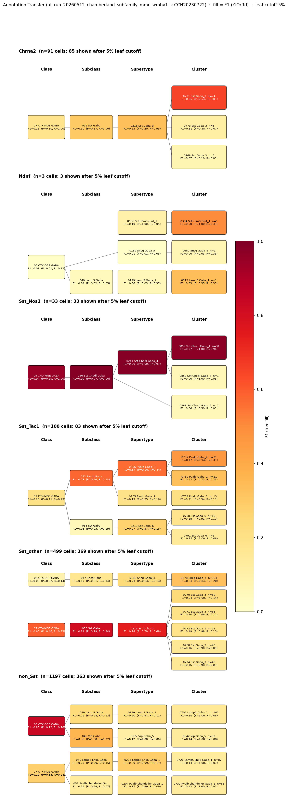

# Sst::Tac1-IN (bistratified-like, Chamberland 2024) — WMBv1 Mapping Report
*2026-05-12 · Source: `/Users/do12/Documents/GitHub/BICAN_agentic_framework_planning/evidencell/kb/graphs/hippocampus/hippocampus_chamberland_subfamilies.yaml`*

---

## Introduction

The Sst::Tac1-IN subfamily is one of four hippocampal somatostatin-expressing interneuron subfamilies defined by Chamberland and colleagues using intersectional Sst×Tac1 genetics in mouse CA1 [1]. Distinct from the other Sst-IN subfamilies that target pyramidal cells, the Sst::Tac1 intersection labels a population of bistratified-like cells whose axonal output is preferentially directed onto fast-spiking interneurons rather than principal cells — an interneuron-selective inhibitory motif within CA1 oriens/alveus.

> the Sst;;Tac1 intersection targeted a population of bistratified cells that overwhelmingly targeted fast-spiking interneurons. In contrast, the Ndnf;;Nkx2-1 intersection revealed a population of oriens lacunosum-moleculare interneurons that selectively targeted CA1 pyramidal cells
> — Chamberland et al. 2024, Transcriptomic Interneuron Classifications · [1] <!-- quote_key: 269246896_c084d5c0 -->

The mapping question is non-trivial because the source intersection is Sst-driven, yet the functional readout (bistratified-like, interneuron-targeting) points toward circuitry traditionally occupied by Pvalb basket/bistratified cells.

### Classical type table

| Property | Value | References |
|---|---|---|
| Soma location | hippocampus stratum oriens [UBERON:0005371] (CA1 stratum oriens) | [1] |
| NT | GABAergic | [1] |
| Markers | Sst, Tac1 (intersectional definition) | [1] |

<details>
<summary>Details — source evidence for classical type properties</summary>

- **Soma location:** CA1 stratum oriens, with Sst::Tac1 cells positioned closer to the pyramidal layer than other Sst-IN subfamilies · [1]
  > While Sst;;Tac1-INs were located closer to the CA1 pyramidal layer, Ndnf;;Nkx2-1-INs and Chrna2-INs were found progressively deeper in O/A
  > — Chamberland et al. 2024, Results · [1] <!-- quote_key: 269246896_1b1ebab4 -->
- **Defining markers (Sst, Tac1):** Chamberland intersectional definition; Sst::Tac1 axonal targeting profile distinguishes the subfamily · [1]
  > the Sst;;Tac1 intersection targeted a population of bistratified cells that overwhelmingly targeted fast-spiking interneurons. In contrast, the Ndnf;;Nkx2-1 intersection revealed a population of oriens lacunosum-moleculare interneurons that selectively targeted CA1 pyramidal cells
  > — Chamberland et al. 2024, Transcriptomic Interneuron Classifications · [1] <!-- quote_key: 269246896_c084d5c0 -->

</details>

### Cell Ontology mapping

No Cell Ontology term currently covers this type — candidate for a new CL term.

---

## Results

Annotation transfer from a Chamberland-rule-labelled re-analysis of Harris et al. 2018 hippocampal scRNA-seq maps Sst::Tac1-IN dominantly to the Pvalb Gaba subclass and to supertype 0206 Pvalb Gaba_2 [CS20230722_SUPT_0206] rather than to any Sst-tagged WMBv1 supertype (F1=0.58 at subclass; F1=0.57 at supertype; see figure and property comparison table). Cluster-level transfer is distributed across multiple Pvalb Gaba_2 children, consistent with a functionally defined subfamily that spans transcriptomic subclusters rather than collapsing to a single one.



*F1 across WMBv1 taxonomy levels for the Chamberland Sst_Tac1 per-cluster source group derived from Harris 2018 (n=167 source cells assigned to Sst_Tac1). Each panel row is a source-cell group; nodes are coloured by F1 with **Purity** (Pur) and **Coverage** (Cov) shown inline. Coverage = fraction of source-group cells landing on this target; Purity = fraction of this target's cells coming from the source group. F1 ≥ 0.5 at a level indicates a clean mapping at that resolution. The Sst::Tac1 row peaks on the Pvalb Gaba subclass (Cov=0.78) and on the Pvalb Gaba_2 supertype, surfacing transcriptomic Sst–Pvalb continuity for bistratified-type cells — a relationship not visible from Sst-marker matching alone.*

### 0206 Pvalb Gaba_2 [CS20230722_SUPT_0206] · 🟡 MODERATE

**Table 1 — Property comparison**

| Property | Classical | Supertype | Best cluster | Alignment |
|---|---|---|---|---|
| NT type | GABAergic | not asserted | not assessed | NOT_ASSESSED |
| Soma location | hippocampus stratum oriens [UBERON:0005371] | Hippocampal formation [MBA:1089] count_100um=1558; Field CA1 [MBA:382] count_100um=922 | not assessed | APPROXIMATE |
| Sst (defining) | defining marker | Sst: 2.72; cohort_pct 0.698; child-coverage 1.000 | not assessed | CONSISTENT |
| Tac1 (defining) | defining marker | Tac1: 5.36; cohort_pct 0.921; child-coverage 1.000 | not assessed | CONSISTENT |

*(Child-cluster breakdown not assessed — see proposed experiments.)*

**Table 2 — Evidence support**

| Evidence | Type | Supports | Headline | Source |
|---|---|---|---|---|
| Atlas precomputed expression | Atlas metadata | PARTIAL | region_fraction_100um=0.287; Tac1 cohort_pct 0.921 | atlas-internal |

**Supporting evidence**
- Both defining markers (Sst, Tac1) are present at the supertype with full child-cluster coverage (Sst child-coverage 1.000; Tac1 child-coverage 1.000) — the Sst::Tac1 combination is genuinely a feature of Pvalb Gaba_2 rather than a noisy artefact of one outlier child.
- Tac1 is strongly enriched at the supertype (cohort_pct 0.921) — Pvalb Gaba_2 is one of the Tac1-richest hippocampal-region supertypes in the queried GABAergic stratum-oriens cohort.
- Annotation transfer on the Sst_Tac1 Chamberland-rule source group lands on the Pvalb Gaba subclass (F1=0.58, Coverage=0.78), with Pvalb Gaba_2 the top WMBv1 supertype within that subclass (F1=0.57). This is independent of marker-based scoring and reflects how MapMyCells reads the entire transcriptome.

**Marker evidence provenance**
- **Sst:** intersectional driver marker on the classical node; supertype shows Sst=2.72 with child-coverage 1.000. Sst is not in the Pvalb-subclass atlas defining set, so the concordance here is at the level of expression rather than atlas curation. *(note: Sst-Pvalb transcriptomic continuity for bistratified-type interneurons is consistent with the functional reading that Sst::Tac1 cells operate within Pvalb-target circuitry.)*
- **Tac1:** intersectional driver marker; supertype shows Tac1=5.36 (cohort_pct 0.921, child-coverage 1.000). Tac1 is the defining marker that most cleanly aligns the source population with this Pvalb-subclass supertype.

**Concerns**
- Location is APPROXIMATE — `region_fraction_100um: 0.287` is in the boundary band (cells lie partly in Hippocampal formation [MBA:1089] but also in Cortical subplate [MBA:703] count_100um=824). This is weak counter-evidence; the supertype is not a pure hippocampal supertype, which fits a transcriptomic class whose members tile multiple regions.
- The AT signal at cluster level is distributed (best cluster F1=0.466), not concentrated on a single Pvalb Gaba_2 child — the supertype is the supportable resolution.
- Source-side data are mouse scRNA-seq with Chamberland gene-pair rules applied to Harris 2018 cluster-mean expression; the original Chamberland intersectional genetics (Sst×Tac1 reporter cohorts) was not directly mapped. The classical-to-AT bridge therefore relies on the in-silico rule re-labelling rather than on transgene-targeted sequencing.

**What would upgrade confidence**
- Direct MapMyCells of cells obtained from Chamberland's Sst×Tac1 intersectional reporter line (rather than rule-relabelled Harris data) onto WMBv1 at F1 ≥ 0.70 at supertype level would convert the transcriptomic-continuity reading into direct evidence.
- Patch-seq with morphological reconstruction confirming bistratified axonal targeting on cells whose transcriptomes anchor in Pvalb Gaba_2 would tie functional identity to atlas placement.

### 0216 Sst Gaba_3 [CS20230722_SUPT_0216] · 🔴 LOW

**Table 1 — Property comparison**

| Property | Classical | Supertype | Best cluster | Alignment |
|---|---|---|---|---|
| NT type | GABAergic | not asserted | not assessed | NOT_ASSESSED |
| Soma location | hippocampus stratum oriens [UBERON:0005371] | Field CA1, stratum oriens [MBA:399] count_100um=1463 | not assessed | CONSISTENT |
| Sst (defining) | defining marker | Sst: 11.44; cohort_pct 0.905; child-coverage 1.000 | 0768 Sst Gaba_3 [CS20230722_CLUS_0768] Sst=12.70 | CONSISTENT |
| Tac1 (defining) | defining marker | Tac1: 0.55; cohort_pct 0.619; child-coverage 0.667 | 0768 Sst Gaba_3 [CS20230722_CLUS_0768] Tac1=0.15 | CONSISTENT (SUPT); APPROXIMATE (CLUS) |

*(2 of 3 child Sst Gaba_3 clusters carry Tac1 above the cohort median; the supertype-mean is dragged up by the Tac1-richest children, while the best stratum-oriens-localised child cluster 0768 Sst Gaba_3 [CS20230722_CLUS_0768] shows Tac1=0.15 (cohort_pct 0.303). Best stratum-oriens match within this supertype: CLUS_0768.)*

**Table 2 — Evidence support**

| Evidence | Type | Supports | Headline | Source |
|---|---|---|---|---|
| Atlas precomputed expression | Atlas metadata | PARTIAL | region_fraction_100um=0.539; Tac1 cohort_pct 0.619 | atlas-internal |

**Supporting evidence**
- Sst Gaba_3 has the strongest stratum-oriens soma footprint of any Sst-named hippocampal supertype (`region_fraction_100um: 0.539`; Field CA1, stratum oriens [MBA:399] is the dominant anat term). Source-side soma location is consistent.
- Sst is strongly expressed at the supertype (Sst=11.44, cohort_pct 0.905) — concordant with the source-side Sst+ definition.

**Concerns**
- Annotation transfer on the Sst_Tac1 Chamberland-rule source group does **not** land here. The Sst Gaba_3 supertype is on the wrong transcriptomic branch under MapMyCells; the AT-best WMBv1 subclass is Pvalb Gaba, not Sst Gaba subclasses.
- Tac1 is low at the supertype (Tac1=0.55, cohort_pct 0.619) and very low at the best stratum-oriens child cluster (Tac1=0.15 at 0768 Sst Gaba_3 [CS20230722_CLUS_0768], cohort_pct 0.303). For a subfamily defined by Sst×Tac1 intersection, the Tac1 signal here is weak relative to Pvalb Gaba_2 (Tac1=5.36).
- This supertype is the canonical Sst-OLM supertype family (it absorbs the Chrna2-IN and Sst-projection OLM subfamilies in companion mappings); placing Sst::Tac1-IN here would conflict with the Chamberland functional taxonomy in which OLM vs. Sst::Tac1 are distinct subfamilies.

**What would upgrade confidence**
- Direct MapMyCells of Sst×Tac1 reporter cells onto WMBv1 would either confirm the Pvalb Gaba_2 placement (and refute Sst Gaba_3) or, less plausibly given the rule-relabelled-Harris result, reveal Sst::Tac1 cells split across both supertypes.

<details>
<summary>Candidates audited (full top-K)</summary>

| WMBv1 cluster / supertype | Cells (10x) | Confidence | Key evidence | Verdict |
|---|---:|---|---|---|
| `0206 Pvalb Gaba_2 [CS20230722_SUPT_0206]` (Pvalb Gaba subclass) | 650 | 🟡 MODERATE | AT F1=0.57 at supertype; Tac1 cohort_pct 0.921 | Primary |
| `0216 Sst Gaba_3 [CS20230722_SUPT_0216]` | 2004 | 🔴 LOW | Strong stratum-oriens region; AT does not land | Secondary (region-based) |
| `052 Pvalb Gaba` (subclass) | 42314 | — | AT F1=0.58, Coverage=0.78; subclass-level | Supports broader mapping (subclass row; subclass IDs not bracketed in body) |
| `0768 Sst Gaba_3 [CS20230722_CLUS_0768]` | 66 | 🔴 LOW | Best Sst Gaba_3 child for stratum oriens; Tac1=0.15 | Eliminated (Tac1 absent; AT off-branch) |
| `0772 Sst Gaba_3 [CS20230722_CLUS_0772]` | 190 | 🔴 LOW | Sst-high stratum-oriens child; Tac1=0.14 | Eliminated (Tac1 absent; AT off-branch) |
| `0767 Sst Gaba_3 [CS20230722_CLUS_0767]` | 104 | 🔴 LOW | Tac1=0.80; mixed region | Eliminated (AT off-branch) |
| `0774 Sst Gaba_3 [CS20230722_CLUS_0774]` | 145 | 🔴 LOW | Tac1=2.65; APPROXIMATE region | Eliminated (AT off-branch) |
| `0791 Sst Gaba_6 [CS20230722_CLUS_0791]` | 100 | 🔴 LOW | Tac1=8.27 (cohort_pct 0.992); poor region | Eliminated (wrong supertype family; AT off-branch) |
| `0212 Pvalb Gaba_8 [CS20230722_SUPT_0212]` | 7777 | 🔴 LOW | Tac1=7.58 high; isocortex-dominant | Eliminated (DISCORDANT location: Isocortex [MBA:315]) |
| `0211 Pvalb Gaba_7 [CS20230722_SUPT_0211]` | 567 | 🔴 LOW | Tac1=7.65 high; isocortex-dominant | Eliminated (DISCORDANT location) |
| `0203 Lamp5 Lhx6 Gaba_1 [CS20230722_SUPT_0203]` | 8913 | 🔴 LOW | Tac1=2.64; off-target subclass | Eliminated (wrong subclass; AT off-branch) |

</details>

### Methods

<details>
<summary>Data sources, analyses, and reproducibility receipts</summary>

**Classical type definition.** Sst::Tac1-IN is one of four hippocampal Sst-IN subfamilies defined by Chamberland 2024 using intersectional Sst×Tac1 genetics [1]; the intersection labels CA1 stratum-oriens bistratified-like interneurons whose axons preferentially target fast-spiking interneurons rather than pyramidal cells. `definition_basis`: CLASSICAL_MULTIMODAL (intersectional reporter genetics + functional connectivity + axonal target characterisation).

**Atlas mapping query.** Candidate atlas clusters were retrieved from the WMBv1 taxonomy (CCN20230722) at ranks 0 (cluster) and 1 (supertype) using metadata-based scoring (region match, NT type, defining markers, sex bias when applicable). Full scoring rules: `workflows/map-cell-type.md`.

**Property alignment.** Each defining property of the classical type was compared to the corresponding atlas-side value via the `property_comparisons` schema, with alignments graded CONSISTENT / APPROXIMATE / DISCORDANT / NOT_ASSESSED. Atlas-side numerical values came from precomputed expression on the cluster (cluster.yaml in the taxonomy reference store) and from MERFISH spatial registration for soma location.

**Annotation transfer**

| Field | Value |
|---|---|
| Source dataset | GEO:GSE99888 (Sst_Tac1, Chamberland per-cluster subfamily label) |
| Source species | NCBITaxon:10090 |
| Target atlas | WMBv1 (CCN20230722; SHA-256: b21ca985) |
| Method | MapMyCells (cell_type_mapper v1.7.1, default parameters, raw normalization, bootstrap_iteration=100) |
| Tool version | cell_type_mapper v1.7.1 |
| Bootstrap threshold | 0.8 |
| n cells | 3663 (filtered to 3663) |
| Run record | [`kb/annotation_transfer_runs/at_run_20260512_chamberland_subfamily_mmc_wmbv1/manifest.yaml`](../../kb/annotation_transfer_runs/at_run_20260512_chamberland_subfamily_mmc_wmbv1/manifest.yaml) |
| Code reference | [https://github.com/AllenInstitute/cell_type_mapper](https://github.com/AllenInstitute/cell_type_mapper) |
| F1 matrix | [`f1_matrix_chamberland_by_class.csv`](../../kb/annotation_transfer_runs/at_run_20260512_chamberland_subfamily_mmc_wmbv1/f1_matrix_chamberland_by_class.csv) |
| Caveats | Per-cluster derivation (gene-pair rules applied to Harris cluster-mean expression) is dropout-robust and the primary result. The Sst_Tac1 row places this subfamily on the Pvalb Gaba subclass (subclass-level recall 0.78), surfacing transcriptomic Sst–Pvalb continuity for bistratified types. Source-side genetics from Chamberland 2024 (Sst×Tac1 intersection) were not directly sequenced; the AT signal is derived from rule-relabelled Harris 2018 expression. |

**Anti-hallucination.** All citations, atlas accessions, ontology CURIEs, and verbatim literature quotes in this report are validated against the evidencell knowledge base at write time. Authored-prose evidence narratives are validated against their source `evidence_items[*].explanation` fields. The pre-write hook rejects any unresolvable identifier or unattributed blockquote. Specific mapping limitations and caveats are documented per-candidate in the Discussion section.

**Evidence base table**

| Edge ID | Evidence types | Supports | Source |
|---|---|---|---|
| edge_sst_tac1_to_CS20230722_SUBC_052 | ANNOTATION_TRANSFER | SUPPORT | atlas-internal |
| edge_sst_tac1_subfamily_chamberland_to_CS20230722_CLUS_0768 | ATLAS_METADATA | PARTIAL | atlas-internal |
| edge_sst_tac1_subfamily_chamberland_to_CS20230722_CLUS_0772 | ATLAS_METADATA | PARTIAL | atlas-internal |
| edge_sst_tac1_subfamily_chamberland_to_CS20230722_CLUS_0767 | ATLAS_METADATA | PARTIAL | atlas-internal |
| edge_sst_tac1_subfamily_chamberland_to_CS20230722_CLUS_0774 | ATLAS_METADATA | PARTIAL | atlas-internal |
| edge_sst_tac1_subfamily_chamberland_to_CS20230722_CLUS_0791 | ATLAS_METADATA | PARTIAL | atlas-internal |
| edge_sst_tac1_subfamily_chamberland_to_CS20230722_SUPT_0216 | ATLAS_METADATA | PARTIAL | atlas-internal |
| edge_sst_tac1_subfamily_chamberland_to_CS20230722_SUPT_0212 | ATLAS_METADATA | PARTIAL | atlas-internal |
| edge_sst_tac1_subfamily_chamberland_to_CS20230722_SUPT_0211 | ATLAS_METADATA | PARTIAL | atlas-internal |
| edge_sst_tac1_subfamily_chamberland_to_CS20230722_SUPT_0206 | ATLAS_METADATA | PARTIAL | atlas-internal |
| edge_sst_tac1_subfamily_chamberland_to_CS20230722_SUPT_0203 | ATLAS_METADATA | PARTIAL | atlas-internal |

*Generated by evidencell `25c2b32` at 2026-06-08T18:37:47+00:00 from [kb/graphs/hippocampus/hippocampus_chamberland_subfamilies.yaml](kb/graphs/hippocampus/hippocampus_chamberland_subfamilies.yaml).*

</details>

---

## Discussion

**Primary mapping:** Sst::Tac1-IN (bistratified-like, Chamberland 2024) → 0206 Pvalb Gaba_2 [CS20230722_SUPT_0206] at MODERATE confidence. Key support: annotation transfer (F1=0.57 at supertype; F1=0.58 at the Pvalb Gaba subclass; Coverage=0.78) and concordant defining markers (Sst, Tac1 both CONSISTENT with full child-coverage). Key caveats: AMBIGUOUS_MAPPING (cluster-level transfer distributed across multiple Pvalb Gaba_2 children rather than concentrated on one); SINGLE_DATASET (one Chamberland-rule-relabelled re-analysis of one source dataset). The Sst Gaba_3 supertype 0216 Sst Gaba_3 [CS20230722_SUPT_0216] retains the strongest stratum-oriens soma footprint of any Sst-named supertype, but annotation transfer places Sst::Tac1-IN on the Pvalb branch — the Sst-marker concordance there is not sufficient to override the transcriptome-wide signal.

No Cell Ontology term currently assigned. This is a Chamberland 2024 functional subfamily defined by intersectional genetics + axonal target identity; CL has no term that captures the Sst+Tac1 bistratified-like, interneuron-targeting CA1 population. Candidate for CL contribution.

### Proposed experiments and follow-ups

**Direct MapMyCells of Chamberland Sst×Tac1 intersectional reporter cells.**
- **What:** scRNA-seq of cells obtained from the Chamberland Sst×Tac1 intersectional reporter line + MapMyCells onto WMBv1.
- **Target:** F1 ≥ 0.70 at supertype level on CS20230722_SUPT_0206 (or refute and identify the true placement).
- **Expected output:** AnnotationTransferEvidence in KB, replacing the current rule-relabelled-Harris signal.
- **Resolves:** open question (1); promotes confidence on the SUPT_0206 edge from MODERATE to HIGH or REFUTED.
- **Note:** the existing annotation transfer is from a Chamberland-rule re-analysis of Harris 2018, not from direct intersectional-reporter sequencing — a refined run with the actual transgene cohort is materially stronger than the rule-relabelled proxy.

**Patch-seq on bistratified-like CA1 stratum-oriens interneurons.**
- **What:** patch-clamp recording + morphological reconstruction + scRNA-seq on stratum-oriens cells with bistratified axonal targeting; map transcriptomes onto WMBv1.
- **Target:** confirm Pvalb Gaba_2 placement for cells with bistratified morphology and fast-spiking-interneuron-target connectivity.
- **Expected output:** AnnotationTransferEvidence with PATCH_SEQ method tag; ties functional identity (axonal target) to transcriptomic placement.
- **Resolves:** open question (2).

### Open questions

1. Does direct sequencing of Chamberland's Sst×Tac1 intersectional reporter cells (rather than rule-relabelled Harris 2018 expression) confirm the Pvalb Gaba_2 supertype placement at F1 ≥ 0.70?
2. Within Pvalb Gaba_2, does the Sst::Tac1 subfamily resolve to a single child cluster under direct AT, or does it remain genuinely distributed across multiple Pvalb Gaba_2 children — i.e. is Sst::Tac1 best read as a within-supertype 1:n mapping?
3. The Sst::Tac1 functional subfamily is likely to overlap the classical `bistratified_cell_hippocampus` type defined elsewhere in `hippocampus_GABAergic_interneurons.yaml`; should these two classical nodes be reconciled, with the Chamberland subfamily acting as a functional refinement of the broader bistratified type?

---

## References

| # | Citation | PMID | Used for |
|---|---|---|---|
| [1] | Chamberland et al. 2024 · [PMID:38640347](https://pubmed.ncbi.nlm.nih.gov/38640347/) | 38640347 | soma location; defining-marker provenance; functional identity (bistratified-like, fast-spiking-IN-targeting) |

---

<!-- verdict-block-start: edge_sst_tac1_to_CS20230722_SUBC_052 -->
```yaml
verdict:
  confidence: MODERATE
  confidence_score: 0.55
  rationale: >
    [tier:NEXT] Annotation transfer on the Sst_Tac1 Chamberland-rule
    source group lands on the Pvalb Gaba subclass (F1=0.58,
    Coverage=0.78) under at_run_20260512_chamberland_subfamily_mmc_wmbv1;
    the subclass-level transfer is the structural basis for placing the
    Sst::Tac1 subfamily on the Pvalb branch rather than on Sst-named
    supertypes. Subclass-level edge supports the broader mapping; the
    supertype-level call is on edge_sst_tac1_subfamily_chamberland_to_CS20230722_SUPT_0206.
  reconciliation_note: >
    Subclass-level companion to the supertype edge
    edge_sst_tac1_subfamily_chamberland_to_CS20230722_SUPT_0206
    (Pvalb Gaba_2); both narrate the same AT signal at adjacent
    taxonomy ranks.
  caveats:
    - caveat_type: SINGLE_DATASET
      description: >
        AT signal derives from one rule-relabelled re-analysis of Harris
        2018 (GEO:GSE99888); direct sequencing of Chamberland Sst×Tac1
        intersectional reporter cells has not been performed.
    - caveat_type: DISTRIBUTED_ACROSS_CLUSTERS
      description: >
        Cluster-level transfer is distributed across multiple Pvalb
        Gaba_2 children; the subclass is the supportable level for this
        edge.
  proposed_experiments:
    - >
      Direct MapMyCells of cells from the Chamberland Sst×Tac1
      intersectional reporter line onto WMBv1 at F1 ≥ 0.70 at subclass
      level would convert this rule-relabelled-Harris signal into
      transgene-anchored AnnotationTransferEvidence.
  unresolved_questions:
    - >
      Does direct sequencing of Sst×Tac1 reporter cells reproduce the
      Pvalb Gaba subclass placement at F1 ≥ 0.70?
```
<!-- verdict-block-end -->

<!-- verdict-block-start: edge_sst_tac1_subfamily_chamberland_to_CS20230722_SUPT_0206 -->
```yaml
verdict:
  confidence: MODERATE
  confidence_score: 0.55
  relationship: skos:closeMatch
  mapping_cardinality: "1:n"
  mapping_justification: semapv:ManualMappingCuration
  rationale: >
    [tier:STRONGEST] Annotation transfer
    (at_run_20260512_chamberland_subfamily_mmc_wmbv1) places the
    Sst_Tac1 Chamberland-rule source group on CS20230722_SUPT_0206
    (F1=0.57) with both defining markers concordant at the supertype
    (Sst cohort_pct 0.905, Tac1 cohort_pct 0.921; child-coverage 1.000
    on each). 2 of 2 markers CONSISTENT. Location is APPROXIMATE
    (region_fraction_100um: 0.287 — boundary scatter; supertype is not
    a pure hippocampal supertype). Cluster-level AT is distributed
    across Pvalb Gaba_2 children (cardinality 1:n).
  reconciliation_note: >
    Subclass-level companion edge edge_sst_tac1_to_CS20230722_SUBC_052
    (F1=0.58 on Pvalb Gaba subclass) supports the broader Pvalb-branch
    placement; this supertype edge is the finest resolution the AT
    signal supports cleanly.
  caveats:
    - caveat_type: SINGLE_DATASET
      description: >
        AT signal derives from one rule-relabelled re-analysis of Harris
        2018 (GEO:GSE99888); direct Sst×Tac1 reporter sequencing has not
        been performed.
    - caveat_type: DISTRIBUTED_ACROSS_CLUSTERS
      description: >
        Cluster-level transfer is distributed across multiple Pvalb
        Gaba_2 children (best child F1=0.466); the supertype is the
        supportable mapping resolution.
    - caveat_type: AMBIGUOUS_MAPPING
      description: >
        Source intersection is Sst-driven, yet the AT signal lands on
        the Pvalb subclass — the mapping rests on transcriptomic Sst-Pvalb
        continuity rather than on Sst-supertype concordance.
  proposed_experiments:
    - >
      Direct MapMyCells of Chamberland Sst×Tac1 intersectional reporter
      cells onto WMBv1 at F1 ≥ 0.70 at supertype level on
      CS20230722_SUPT_0206 would convert the rule-relabelled-Harris
      signal into transgene-anchored AnnotationTransferEvidence.
    - >
      Patch-seq on bistratified-like CA1 stratum-oriens interneurons
      with biocytin morphology recovery + scRNA-seq would tie functional
      bistratified identity to CS20230722_SUPT_0206 placement.
  unresolved_questions:
    - >
      Within Pvalb Gaba_2, does Sst::Tac1 resolve to a single child
      cluster under direct AT or remain genuinely 1:n across multiple
      Pvalb Gaba_2 children?
```
<!-- verdict-block-end -->

<!-- verdict-block-start: edge_sst_tac1_subfamily_chamberland_to_CS20230722_SUPT_0216 -->
```yaml
verdict:
  confidence: LOW
  confidence_score: 0.25
  rationale: >
    [tier:NEXT] CS20230722_SUPT_0216 carries the strongest
    stratum-oriens soma footprint of any Sst-named hippocampal
    supertype (region_fraction_100um: 0.539; Field CA1, stratum oriens
    MBA:399 count_100um=1463) and Sst is strongly expressed
    (cohort_pct 0.905); however annotation transfer
    (at_run_20260512_chamberland_subfamily_mmc_wmbv1) does not land
    on this supertype's branch, and Tac1 at the best
    stratum-oriens-localised child CS20230722_CLUS_0768 is very low
    (Tac1=0.15, cohort_pct 0.303). Region + Sst marker concordance
    is insufficient against the transcriptome-wide AT signal pointing
    to the Pvalb branch.
  reconciliation_note: >
    Sst Gaba_3 retains the canonical Sst-OLM supertype role in
    companion mappings; placing Sst::Tac1-IN here would conflict with
    the Chamberland functional taxonomy in which OLM vs. Sst::Tac1 are
    distinct subfamilies.
  caveats:
    - caveat_type: AMBIGUOUS_MAPPING
      description: >
        Region + Sst concordance pull toward CS20230722_SUPT_0216 but AT
        pulls toward CS20230722_SUPT_0206 (Pvalb Gaba_2); the two
        signals are in tension and the AT signal carries more weight.
  proposed_experiments:
    - >
      Direct MapMyCells of Chamberland Sst×Tac1 reporter cells onto
      WMBv1 at F1 ≥ 0.70 at supertype level would either confirm
      CS20230722_SUPT_0206 (refuting CS20230722_SUPT_0216) or surface a
      genuine split across both supertypes.
  unresolved_questions:
    - >
      Is the Sst marker concordance at CS20230722_SUPT_0216 driven by
      contaminant or genuine subpopulation overlap, or is it incidental
      to the supertype's broader Sst-OLM membership?
```
<!-- verdict-block-end -->

<!-- verdict-block-start: edge_sst_tac1_subfamily_chamberland_to_CS20230722_CLUS_0768 -->
```yaml
verdict:
  confidence: LOW
  confidence_score: 0.15
  rationale: >
    [tier:CUT] CS20230722_CLUS_0768 is the best stratum-oriens-localised
    child of Sst Gaba_3 (region_fraction_100um: 0.818) but Tac1=0.15
    (cohort_pct 0.303) is far below the cohort median for a Tac1-defined
    subfamily, and annotation transfer
    (at_run_20260512_chamberland_subfamily_mmc_wmbv1) does not place
    Sst::Tac1 on the Sst Gaba_3 branch.
  caveats:
    - caveat_type: AMBIGUOUS_MAPPING
      description: >
        Strong region + Sst signal here conflict with AT, which points
        to the Pvalb branch; cluster-level placement on CS20230722_CLUS_0768
        is not supported.
```
<!-- verdict-block-end -->

<!-- verdict-block-start: edge_sst_tac1_subfamily_chamberland_to_CS20230722_CLUS_0772 -->
```yaml
verdict:
  confidence: LOW
  confidence_score: 0.12
  rationale: >
    [tier:CUT] CS20230722_CLUS_0772 has a strong stratum-oriens
    footprint (region_fraction_100um: 0.706) and high Sst (cohort_pct
    0.958) but Tac1=0.14 (cohort_pct 0.261) is incompatible with a
    Tac1-defined subfamily; AT does not land here.
  caveats:
    - caveat_type: AMBIGUOUS_MAPPING
      description: Tac1-absent stratum-oriens Sst Gaba_3 child; AT off-branch.
```
<!-- verdict-block-end -->

<!-- verdict-block-start: edge_sst_tac1_subfamily_chamberland_to_CS20230722_CLUS_0767 -->
```yaml
verdict:
  confidence: LOW
  confidence_score: 0.15
  rationale: >
    [tier:CUT] CS20230722_CLUS_0767 carries moderate Tac1 (0.80,
    cohort_pct 0.706) and Sst (10.78, cohort_pct 0.832) but
    region_fraction_100um: 0.578 with substantial off-target mass in
    cerebrum-related and medial-forebrain-bundle anat terms; AT
    (at_run_20260512_chamberland_subfamily_mmc_wmbv1) does not place
    Sst::Tac1 on Sst Gaba_3.
  caveats:
    - caveat_type: AMBIGUOUS_MAPPING
      description: Mixed region; AT off-branch.
```
<!-- verdict-block-end -->

<!-- verdict-block-start: edge_sst_tac1_subfamily_chamberland_to_CS20230722_CLUS_0774 -->
```yaml
verdict:
  confidence: LOW
  confidence_score: 0.18
  rationale: >
    [tier:CUT] CS20230722_CLUS_0774 has the most plausible Sst Gaba_3
    Tac1 signal (Tac1=2.65, cohort_pct 0.866) and high Sst (cohort_pct
    0.975), but region_fraction_100um: 0.497 is APPROXIMATE and AT
    (at_run_20260512_chamberland_subfamily_mmc_wmbv1) does not land on
    the Sst Gaba_3 branch.
  caveats:
    - caveat_type: AMBIGUOUS_MAPPING
      description: AT off-branch despite plausible Tac1 + Sst signal.
```
<!-- verdict-block-end -->

<!-- verdict-block-start: edge_sst_tac1_subfamily_chamberland_to_CS20230722_CLUS_0791 -->
```yaml
verdict:
  confidence: LOW
  confidence_score: 0.15
  rationale: >
    [tier:CUT] CS20230722_CLUS_0791 (Sst Gaba_6) has the highest Tac1
    in the Sst-named candidate set (Tac1=8.27, cohort_pct 0.992) but
    region_fraction_100um: 0.410 with off-target mass in Field CA3
    and AT (at_run_20260512_chamberland_subfamily_mmc_wmbv1) does not
    land on Sst Gaba_6.
  caveats:
    - caveat_type: AMBIGUOUS_MAPPING
      description: Wrong supertype family; AT off-branch.
```
<!-- verdict-block-end -->

<!-- verdict-block-start: edge_sst_tac1_subfamily_chamberland_to_CS20230722_SUPT_0212 -->
```yaml
verdict:
  confidence: REFUTED
  confidence_score: 0.05
  rationale: >
    [tier:CUT] CS20230722_SUPT_0212 (Pvalb Gaba_8) shows strong Tac1
    (cohort_pct 0.968) but location is DISCORDANT
    (region_fraction_100um: 0.053; dominant anat term is Isocortex
    MBA:315 count_100um=6762) — this is a cortical Pvalb supertype,
    not a hippocampal one. AT (at_run_20260512_chamberland_subfamily_mmc_wmbv1)
    does not land here.
  caveats:
    - caveat_type: DISCORDANT_ANATOMY
      description: Isocortex-dominant supertype; not hippocampal.
```
<!-- verdict-block-end -->

<!-- verdict-block-start: edge_sst_tac1_subfamily_chamberland_to_CS20230722_SUPT_0211 -->
```yaml
verdict:
  confidence: REFUTED
  confidence_score: 0.05
  rationale: >
    [tier:CUT] CS20230722_SUPT_0211 (Pvalb Gaba_7) shows strong Tac1
    (cohort_pct 0.984) but location is DISCORDANT
    (region_fraction_100um: 0.082; Isocortex MBA:315 dominant) — a
    cortical Pvalb supertype. AT does not land here.
  caveats:
    - caveat_type: DISCORDANT_ANATOMY
      description: Isocortex-dominant supertype; not hippocampal.
```
<!-- verdict-block-end -->

<!-- verdict-block-start: edge_sst_tac1_subfamily_chamberland_to_CS20230722_SUPT_0203 -->
```yaml
verdict:
  confidence: LOW
  confidence_score: 0.10
  rationale: >
    [tier:CUT] CS20230722_SUPT_0203 (Lamp5 Lhx6 Gaba_1) carries Tac1
    cohort_pct 0.841 and Sst cohort_pct 0.603 but
    region_fraction_100um: 0.114 is APPROXIMATE with Dentate gyrus
    MBA:726 as a major off-target, and the Lamp5 Lhx6 subclass is the
    wrong transcriptomic subclass for a Sst×Tac1 intersectional
    subfamily. AT (at_run_20260512_chamberland_subfamily_mmc_wmbv1)
    does not land here.
  caveats:
    - caveat_type: AMBIGUOUS_MAPPING
      description: Wrong subclass (Lamp5 Lhx6); AT off-branch.
```
<!-- verdict-block-end -->
