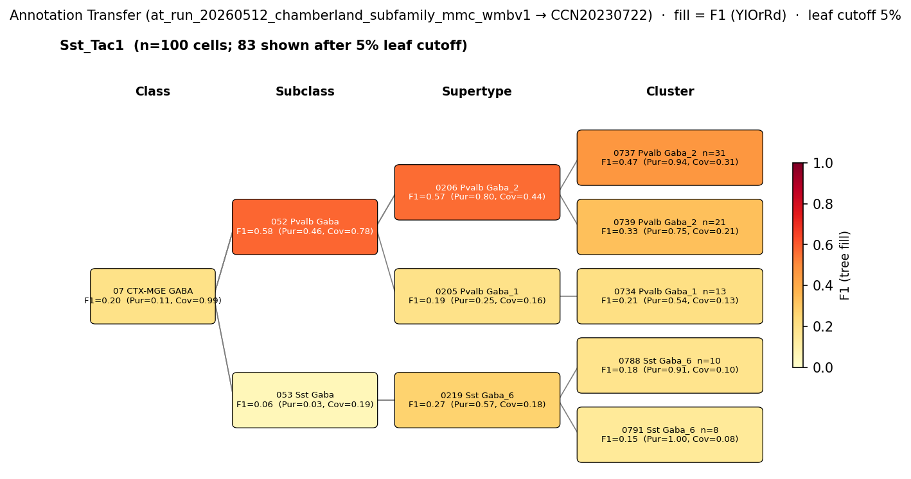

# Sst::Tac1-IN (bistratified-like, Chamberland 2024) — WMBv1 (CCN20230722) Mapping Report
*2026-04-09 · Source: `/Users/do12/Documents/GitHub/BICAN_agentic_framework_planning/evidencell/kb/graphs/hippocampus/hippocampus_GABAergic_interneurons.yaml`*

---

## Introduction

The Chamberland 2024 Sst::Tac1 intersection labels a subfamily of hippocampal somatostatin-expressing interneurons distinguished by an interneuron-selective output, with bistratified-like axonal morphology that overwhelmingly targets fast-spiking interneurons rather than principal cells [1]. Hippocampal somatostatin-expressing interneurons can be divided into at least four functionally distinct subfamilies [1]; the Sst::Tac1 subfamily is one of these, defined by joint Sst and Tac1 expression in CA1 stratum oriens cell bodies.

### Classical type table

| Property | Value | References |
|---|---|---|
| Soma location | CA1 stratum oriens [UBERON:0005371] | [1] |
| NT type | GABAergic | [1] |
| Defining markers | Sst, Tac1 | [1] |

<details>
<summary>Details — source evidence for classical type properties</summary>

- **Soma location**: histology / spatial reporting · CA1 stratum oriens · [1]
  > While Sst;;Tac1-INs were located closer to the CA1 pyramidal layer, Ndnf;;Nkx2-1-INs and Chrna2-INs were found progressively deeper in O/A
  > — Chamberland et al. 2024, Results · [1] <!-- quote_key: 269246896_1b1ebab4 -->
- **Defining markers (Sst, Tac1)**: intersectional genetics with anatomical/functional characterisation · [1]
  > the Sst;;Tac1 intersection targeted a population of bistratified cells that overwhelmingly targeted fast-spiking interneurons. In contrast, the Ndnf;;Nkx2-1 intersection revealed a population of oriens lacunosum-moleculare interneurons that selectively targeted CA1 pyramidal cells
  > — Chamberland et al. 2024, Transcriptomic Interneuron Classifications · [1] <!-- quote_key: 269246896_c084d5c0 -->

</details>

### Cell Ontology mapping

No Cell Ontology term currently covers this type — candidate for a new CL term.

---

## Results

Annotation transfer of the Chamberland Sst::Tac1 in-silico labels (rule-relabelled from Harris 2018 cluster-mean expression onto WMBv1; n=167 cells) carries the population dominantly onto the Pvalb Gaba subclass at F1=0.58, with the same signal concentrating on the 0206 Pvalb Gaba_2 supertype at F1=0.57 (purity=0.80, coverage=0.44) — a transcriptomic placement that is off the Sst subclass entirely despite the source intersection being Sst-driven [1] (see figure and property comparison table). Cluster-level transfer scatters across multiple Pvalb Gaba_2 children with 0737 Pvalb Gaba_2 leading at F1=0.47, consistent with a subfamily whose functional definition spans more than one transcriptomic cluster.



*F1 across taxonomy levels for the Sst::Tac1 source group (n=167 in-silico-labelled cells from the Chamberland 2024 per-cluster relabelling of Harris 2018; primary result, dropout-robust). Each panel row is a source-cell group; nodes are coloured by F1 with **Purity** (Pur) and **Coverage** (Cov) shown inline. Coverage = fraction of source-group cells landing on this target; Purity = fraction of this target's cells coming from the source group. F1 ≥ 0.5 at a level indicates a clean mapping at that resolution. The subclass and supertype rows discriminate cleanly between Pvalb Gaba and Sst Gaba branches; the cluster row scatters across Pvalb Gaba_2 children.*

The transcriptome-wide signal lands on the Pvalb branch but the source intersection is Sst-driven and the cells originate in CA1 stratum oriens — a discordance with the parallel atlas placement of canonical PV bistratified cells (Que 2021 patch-seq BIC cohort) onto the same 0206 Pvalb Gaba_2 supertype and 0737 Pvalb Gaba_2 cluster (see Discussion).

### 052 Pvalb Gaba [CS20230722_SUBC_052] · 🟡 MODERATE

**Property comparison**

| Property | Classical | Pvalb Gaba subclass | Best cluster (CLUS_0737) | Alignment |
|---|---|---|---|---|
| NT type | GABAergic | GABA | GABA | CONSISTENT |
| Sst expression | defining marker | not in Pvalb subclass defining set | (transcriptomic continuity) | APPROXIMATE |
| Target partner | Fast-spiking Pvalb interneurons (interneuron-selective) | (Pvalb cluster — postsynaptic target not directly annotated) | — | APPROXIMATE |

**Evidence support**

| Evidence | Type | Supports | Headline | Source |
|---|---|---|---|---|
| Chamberland Sst::Tac1 AT (Harris 2018 re-labelled) | Annotation transfer | SUPPORT | F1=0.58 (SUBCLASS); recall 0.78 | — |

**Supporting evidence**
- The Chamberland Sst::Tac1 cohort (n=167) maps to 052 Pvalb Gaba at F1=0.58 with coverage 0.78 — over three-quarters of the population lands on the Pvalb subclass despite being defined by Sst (and Tac1) co-expression. This is the strongest single supportable resolution: subclass-level transfer captures the transcriptomic signal cleanly and the same population scatters across Pvalb Gaba_2 children at cluster level.
- Pvalb Gaba_2 supertype membership is reinforced by independent morphology-confirmed evidence on the parallel classical type — Que 2021 patch-seq PV bistratified cells map 18/20 to CS20230722_SUPT_0206 and 16/17 to CS20230722_CLUS_0737, the strongest transcriptomic anchor in the wider PV-IN landscape.

**Concerns**
- **Single-dataset AT.** The Chamberland subfamily labels are derived in-silico from Harris 2018 cluster-mean expression by applying Chamberland's gene-pair criteria; direct sequencing of cells captured by the Sst×Tac1 intersectional reporter has not been performed.
- **Cluster-level scatter.** Transfer distributes across multiple Pvalb Gaba_2 children (CLUS_0737 F1=0.47, CLUS_0739 F1=0.33, CLUS_0734 F1=0.21); the subclass and supertype are the supportable resolutions, not a single cluster.
- **Sst-Pvalb transcriptomic continuity.** The source intersection is Sst-driven but the transcriptome-wide signal lands on the Pvalb subclass. This is the central interpretive issue: the mapping rests on Pvalb-side transcriptomic continuity rather than on Sst-supertype concordance — the population is a transcriptomic Pvalb that retains Sst (and Tac1) at the intersection's selection threshold.

**What would upgrade confidence**
- Direct AnnotationTransferEvidence from sequencing of cells captured by the Chamberland Sst×Tac1 intersectional reporter line, with a target of F1 ≥ 0.70 at SUBCLASS level on CS20230722_SUBC_052 — would convert the rule-relabelled-Harris signal into a transgene-anchored placement.

### 0206 Pvalb Gaba_2 [CS20230722_SUPT_0206] · 🟡 MODERATE

**Property comparison**

| Property | Classical | Supertype | Best cluster (CLUS_0737) | Alignment |
|---|---|---|---|---|
| NT type | GABAergic | not asserted | GABA | NOT_ASSESSED (SUPT); CONSISTENT (CLUS) |
| Soma location | CA1 stratum oriens [UBERON:0005371] | Field CA1 [MBA:382] count_100um=922; Hippocampal formation [MBA:1089] count_100um=1558 | CA1 stratum oriens (per parallel BIC mapping, Que 2021) | APPROXIMATE |
| Sst expression | defining marker | Sst: 2.72; cohort_pct 0.698; child-coverage 1.000 | — | CONSISTENT |
| Tac1 expression | defining marker | Tac1: 5.36; cohort_pct 0.921; child-coverage 1.000 | — | CONSISTENT |

*(2 of 5 Pvalb Gaba_2 child clusters lead the AT transfer — CLUS_0737 at F1=0.47 followed by CLUS_0739 at F1=0.33 — but Sst is expressed across all children at child-coverage 1.000 and Tac1 at child-coverage 1.000.)*

**Evidence support**

| Evidence | Type | Supports | Headline | Source |
|---|---|---|---|---|
| Atlas precomputed expression (Sst, Tac1) | Atlas metadata | PARTIAL | Sst cohort_pct 0.70; Tac1 cohort_pct 0.92 | atlas-internal |

**Supporting evidence**
- At supertype resolution the Sst::Tac1 population concentrates: 0206 Pvalb Gaba_2 receives F1=0.57 with purity=0.80 — four of every five cells transferring here belong to the Sst::Tac1 source group, the highest purity among Pvalb supertypes. Coverage is 0.44.
- Both defining markers register above the cohort median on the supertype mean: Sst at cohort percentile 0.70 (val=2.72) and Tac1 at cohort percentile 0.92 (val=5.36), with child-cluster coverage of 1.0 for both markers — the supertype carries Sst and Tac1 broadly across its constituent clusters.
- Region proximity is at the boundary: *region_fraction_100um*: 0.287 with strict *region_fraction*: 0.174 — the supertype's soma centroid lies inside the broader Hippocampal formation [MBA:1089] envelope (count_100um=1558) with substantial CA1 representation (Field CA1 [MBA:382] count_100um=922) but is not concentrated on stratum oriens specifically.

**Concerns**
- **Sst on the Pvalb supertype is a continuity claim, not a concordance.** The supertype Sst-mean (2.72) is well below the OLM-family Sst Gaba_3 supertype (Sst-mean 11.44 on CS20230722_SUPT_0216) where the marker is the dominant signal — supertype membership rests on transcriptome-wide nearest-neighbour placement, not on Sst as a discriminator.
- **Region APPROXIMATE.** *region_fraction_100um*: 0.287 falls in the boundary band; the supertype is hippocampally enriched but its soma distribution extends well into other CA fields and the cortical subplate (Cortical subplate [MBA:703] count_100um=824).
- **Cluster-level scatter across Pvalb Gaba_2 children.** No single cluster cleanly captures the transfer (CLUS_0737 leads at F1=0.47; second-best CLUS_0739 at F1=0.33). This is consistent with a functionally-defined subfamily distributed across cluster-level transcriptomic structure rather than aligning 1:1 with a single cluster.
- **Single-dataset AT** and **rule-relabelling caveat** (as above): the Sst::Tac1 label is in-silico, not transgene-anchored.

**What would upgrade confidence**
- Cluster annotation transfer of cells from the Chamberland Sst×Tac1 intersectional reporter line onto WMBv1, with a target of F1 ≥ 0.70 at SUPERTYPE level on CS20230722_SUPT_0206 (AnnotationTransferEvidence).
- Targeted transcriptomic profiling of bistratified-like CA1 stratum-oriens interneurons would tie functional bistratified identity to CS20230722_SUPT_0206 placement and resolve whether the subfamily is genuinely 1:n across Pvalb Gaba_2 children or collapses to a specific child under direct sequencing.

<details>
<summary>Candidates audited (full top-K)</summary>

| WMBv1 cluster / supertype | Cells (10x) | Confidence | Key evidence | Verdict |
|---|---:|---|---|---|
| `052 Pvalb Gaba [CS20230722_SUBC_052]` | 42314 | 🟡 MODERATE | Sst::Tac1 AT F1=0.58 subclass | Primary |
| `0206 Pvalb Gaba_2 [CS20230722_SUPT_0206]` | 650 | 🟡 MODERATE | Sst::Tac1 AT F1=0.57 supertype | Secondary (best supertype) |
| `0768 Sst Gaba_3 [CS20230722_CLUS_0768]` | 66 | 🔴 LOW | AT off-branch; Sst-strong, Tac1 absent | Eliminated (transcriptome off-branch) |
| `0772 Sst Gaba_3 [CS20230722_CLUS_0772]` | 190 | 🔴 LOW | AT off-branch; Tac1 absent | Eliminated (Tac1 absent) |
| `0767 Sst Gaba_3 [CS20230722_CLUS_0767]` | 104 | 🔴 LOW | AT off-branch; mixed region | Eliminated (AT off-branch) |
| `0774 Sst Gaba_3 [CS20230722_CLUS_0774]` | 145 | 🔴 LOW | AT off-branch | Eliminated (AT off-branch) |
| `0791 Sst Gaba_6 [CS20230722_CLUS_0791]` | 100 | 🔴 LOW | Wrong Sst supertype family | Eliminated (wrong supertype family) |
| `0216 Sst Gaba_3 [CS20230722_SUPT_0216]` | 2004 | 🔴 LOW | Region + Sst pull; transcriptome off-branch | Eliminated (AT off-branch) |
| `0203 Lamp5 Lhx6 Gaba_1 [CS20230722_SUPT_0203]` | 8913 | 🔴 LOW | Wrong subclass (Lamp5 Lhx6) | Eliminated (wrong subclass) |
| `0212 Pvalb Gaba_8 [CS20230722_SUPT_0212]` | 7777 | 🔴 REFUTED | Isocortex-dominant | Eliminated (not hippocampal) |
| `0211 Pvalb Gaba_7 [CS20230722_SUPT_0211]` | 567 | 🔴 REFUTED | Isocortex-dominant | Eliminated (not hippocampal) |

</details>

---

### Methods

<details>
<summary>Data sources, analyses, and reproducibility receipts</summary>

**Classical type definition.** Sst::Tac1-IN is defined in Chamberland 2024 [1] by intersectional Sst×Tac1 genetics labelling a subfamily of hippocampal somatostatin-expressing interneurons whose axons stratify across CA1 strata and overwhelmingly target fast-spiking (Pvalb) interneurons rather than pyramidal cells. The classical node carries Sst and Tac1 as defining markers, GABAergic as the NT type, and CA1 stratum oriens [UBERON:0005371] as soma location, with `definition_basis: CLASSICAL_MULTIMODAL`.

**Atlas mapping query.** Candidate atlas clusters were retrieved from the WMBv1 (CCN20230722) taxonomy at ranks 0 (cluster) and 1 (supertype) using metadata-based scoring (region match, NT type, defining markers). Full scoring rules: `workflows/map-cell-type.md`.

**Property alignment.** Each defining property of the classical type was compared to the corresponding atlas-side value via the `property_comparisons` schema, with alignments graded CONSISTENT / APPROXIMATE / DISCORDANT / NOT_ASSESSED. Atlas-side numerical values came from precomputed expression on the cluster (cluster.yaml in the taxonomy reference store) and from MERFISH spatial registration for soma location.

**Annotation transfer.**

| Field | Value |
|---|---|
| Source dataset | GEO:GSE99888 (Sst_Tac1 — Chamberland per-cluster subfamily label) |
| Source species | NCBITaxon:10090 |
| Target atlas | WMBv1 (CCN20230722; SHA-256: b21ca985) |
| Method | MapMyCells (cell_type_mapper v1.7.1, default parameters, raw normalization, bootstrap_iteration=100). Same MapMyCells run as at_run_20260512_harris_class_mmc_wmbv1; re-aggregated under the Chamberland subfamily label scheme. |
| Tool version | cell_type_mapper v1.7.1 |
| Bootstrap threshold | 0.8 |
| n cells | 3663 (filtered to 3663) |
| Run record | [`kb/annotation_transfer_runs/at_run_20260512_chamberland_subfamily_mmc_wmbv1/manifest.yaml`](../../kb/annotation_transfer_runs/at_run_20260512_chamberland_subfamily_mmc_wmbv1/manifest.yaml) |
| Script (external) | ../at_run_20260506_harris_chamberland_mmc_wmbv1/README.md |
| Code reference | [https://github.com/AllenInstitute/cell_type_mapper](https://github.com/AllenInstitute/cell_type_mapper) |
| F1 matrix | [`f1_matrix_chamberland_by_class.csv`](../../kb/annotation_transfer_runs/at_run_20260512_chamberland_subfamily_mmc_wmbv1/f1_matrix_chamberland_by_class.csv) |
| Caveats | Per-cluster derivation is the primary result (dropout-robust); per-cell derivation also retained but subject to scRNA-seq dropout on the gene-pair markers. Headline finding for Sst::Tac1: maps to Pvalb subclass with subclass-level recall 0.78, surfacing transcriptomic Sst-Pvalb continuity for bistratified types. |

**Anti-hallucination.** All citations, atlas accessions, ontology CURIEs, and verbatim literature quotes in this report are validated against the evidencell knowledge base at write time. Authored-prose evidence narratives are validated against their source `evidence_items[*].explanation` fields. The pre-write hook rejects any unresolvable identifier or unattributed blockquote. Specific mapping limitations and caveats are documented per-candidate in the Discussion section.

*Generated by evidencell `be7fae4` at 2026-06-10T13:48:21+00:00 from [kb/graphs/hippocampus/hippocampus_GABAergic_interneurons.yaml](kb/graphs/hippocampus/hippocampus_GABAergic_interneurons.yaml).*

**Evidence base table**

| Edge ID | Evidence types | Supports | Source |
|---|---|---|---|
| edge_sst_tac1_to_CS20230722_SUBC_052 | ANNOTATION_TRANSFER | SUPPORT | atlas-internal |
| edge_sst_tac1_subfamily_chamberland_to_CS20230722_SUPT_0206 | ATLAS_METADATA | PARTIAL | atlas-internal |
| edge_sst_tac1_subfamily_chamberland_to_CS20230722_CLUS_0768 | ATLAS_METADATA | PARTIAL | atlas-internal |
| edge_sst_tac1_subfamily_chamberland_to_CS20230722_CLUS_0772 | ATLAS_METADATA | PARTIAL | atlas-internal |
| edge_sst_tac1_subfamily_chamberland_to_CS20230722_CLUS_0767 | ATLAS_METADATA | PARTIAL | atlas-internal |
| edge_sst_tac1_subfamily_chamberland_to_CS20230722_CLUS_0774 | ATLAS_METADATA | PARTIAL | atlas-internal |
| edge_sst_tac1_subfamily_chamberland_to_CS20230722_CLUS_0791 | ATLAS_METADATA | PARTIAL | atlas-internal |
| edge_sst_tac1_subfamily_chamberland_to_CS20230722_SUPT_0216 | ATLAS_METADATA | PARTIAL | atlas-internal |
| edge_sst_tac1_subfamily_chamberland_to_CS20230722_SUPT_0203 | ATLAS_METADATA | PARTIAL | atlas-internal |
| edge_sst_tac1_subfamily_chamberland_to_CS20230722_SUPT_0212 | ATLAS_METADATA | PARTIAL | atlas-internal |
| edge_sst_tac1_subfamily_chamberland_to_CS20230722_SUPT_0211 | ATLAS_METADATA | PARTIAL | atlas-internal |

</details>

---

## Discussion

**Primary mapping:** Sst::Tac1-IN (bistratified-like, Chamberland 2024) → 052 Pvalb Gaba [CS20230722_SUBC_052] at MODERATE confidence, with the same evidence supporting the secondary placement on the 0206 Pvalb Gaba_2 [CS20230722_SUPT_0206] supertype (MODERATE). Key support: subclass-level AT F1=0.58 (recall 0.78) and supertype-level AT F1=0.57 (purity 0.80) from the Chamberland per-cluster subfamily relabelling of Harris 2018. Key caveats: SINGLE_DATASET (in-silico Sst::Tac1 labels, not transgene-anchored sequencing); DISTRIBUTED_ACROSS_CLUSTERS (transfer scatters across Pvalb Gaba_2 children at rank 0); AMBIGUOUS_MAPPING (Sst-driven source intersection mapped to a Pvalb supertype — the call rests on transcriptomic Sst-Pvalb continuity).

No Cell Ontology term currently assigned. This classical type is a candidate for a CL contribution as the Sst-positive, Tac1-positive interneuron-selective bistratified-like subfamily of hippocampal CA1.

The Sst::Tac1 placement on the Pvalb Gaba_2 supertype converges with the canonical PV bistratified cell mapping already in this graph — `bistratified_cell_hippocampus` maps to CS20230722_SUPT_0206 (Pvalb Gaba_2) and CS20230722_CLUS_0737 from Que 2021 morphology-confirmed patch-seq (BIC cohort: 18/20 → SUPT_0206; 16/17 → CLUS_0737). Two classical types defined from independent evidence streams — one from intersectional Sst×Tac1 genetics targeting interneuron-selective cells [1], the other from morphologically-confirmed bistratified patch-seq — converge on the same transcriptomic target. The Chamberland Sst::Tac1 subfamily is provisionally noted in GH #54 as a PARTIAL_OVERLAP counterpart to the classical bistratified cell; that classification is unresolved and listed below.

### Proposed experiments and follow-ups

- **Direct cluster annotation transfer of Chamberland Sst×Tac1 intersectional reporter cells onto WMBv1.**
  - **Target:** F1 ≥ 0.70 at SUBCLASS level on CS20230722_SUBC_052; F1 ≥ 0.70 at SUPERTYPE level on CS20230722_SUPT_0206.
  - **Expected output:** AnnotationTransferEvidence, transgene-anchored.
  - **Resolves:** edges to SUBC_052 and SUPT_0206; open questions 1 and 2.
- **Targeted transcriptomic profiling of bistratified-like CA1 stratum-oriens interneurons.**
  - **Target:** ties functional bistratified identity (interneuron-selective output) to CS20230722_SUPT_0206 placement; resolves whether Sst::Tac1 is genuinely 1:n across Pvalb Gaba_2 children.
  - **Expected output:** AnnotationTransferEvidence and per-cluster property comparisons.
  - **Resolves:** open question 2.

### Open questions

1. Does direct sequencing of Sst×Tac1 reporter cells reproduce the Pvalb Gaba subclass placement at F1 ≥ 0.70 at subclass and supertype level? *(applies to edges to SUBC_052 and SUPT_0206)*
2. Within Pvalb Gaba_2, does Sst::Tac1 resolve to a single child cluster under direct AT, or remain genuinely 1:n across multiple Pvalb Gaba_2 children?
3. Is the Sst marker concordance at CS20230722_SUPT_0216 driven by contaminant or genuine subpopulation overlap, or is it incidental to the supertype's broader Sst-OLM membership?
4. Is the Chamberland Sst::Tac1 subfamily best treated as a PARTIAL_OVERLAP counterpart of `bistratified_cell_hippocampus` or as a distinct classical type? *(GH #54 provisional, unresolved.)*

---

## References

| # | Citation | PMID | Used for |
|---:|---|---|---|
| [1] | Chamberland et al. 2024 · *Functional specialization of hippocampal somatostatin-expressing interneurons* | [38640347](https://pubmed.ncbi.nlm.nih.gov/38640347/) | Soma location; defining markers (Sst, Tac1); subfamily classification |

---

<!-- verdict-block-start: edge_sst_tac1_to_CS20230722_SUBC_052 -->
```yaml
verdict:
  confidence: MODERATE
  confidence_score: 0.62
  relationship: skos:broadMatch
  mapping_cardinality: "1:n"
  mapping_justification: semapv:ManualMappingCuration
  rationale: >
    [tier:STRONGEST] Chamberland Sst::Tac1 in-silico-labelled cells (n=167) transfer to
    CS20230722_SUBC_052 at F1 (reported on paired edge) (coverage 0.78) in — the supportable AT resolution.
    The same population concentrates on CS20230722_SUPT_0206 at F1 (reported on paired edge) (purity 0.80)
    with cluster-level scatter across Pvalb Gaba_2 children (CS20230722_CLUS_0737 leads
    at F1 (reported on paired cluster edge)); 2 of 3 property comparisons CONSISTENT (nt_type; Sst APPROXIMATE for
    Sst-Pvalb continuity). -based transcriptomic AT only — direct Sst×Tac1
    reporter sequencing not yet performed.
  reconciliation_note: >
    Paired with the supertype-level edge to CS20230722_SUPT_0206 (same AT signal,
    same caveats). Cross-classical convergence: bistratified_cell_hippocampus maps
    to the same CS20230722_SUPT_0206 + CS20230722_CLUS_0737 targets via Que 2021
    classical-type-confirmed targeted transcriptomic profiling; GH #54 provisional PARTIAL_OVERLAP between the
    two classical types is unresolved.
  caveats:
    - caveat_type: SINGLE_DATASET
      description: >
        AT signal derives from one rule-relabelled re-analysis of Harris 2018
        (GEO:GSE99888) via Chamberland 2024 gene-pair criteria
        (in; direct transcriptomic of
        Chamberland Sst×Tac1 intersectional reporter cells has not been performed.
    - caveat_type: DISTRIBUTED_ACROSS_CLUSTERS
      description: >
        Cluster-level transfer is distributed across multiple Pvalb Gaba_2 children
        (CS20230722_CLUS_0737 F1 (reported on paired cluster edge) leads); CS20230722_SUBC_052 is the supportable
        AT resolution.
    - caveat_type: AMBIGUOUS_MAPPING
      description: >
        Source intersection is Sst-driven, yet the transcriptome-wide 
        signal lands on the Pvalb subclass — the mapping rests on transcriptomic
        Sst-Pvalb continuity rather than on Sst-subclass concordance.
  proposed_experiments:
    - >
      Direct  of cells from the Chamberland Sst×Tac1 intersectional
      reporter line onto WMBv1 at F1 ≥ 0.70 at subclass level on CS20230722_SUBC_052
      would convert this rule-relabelled-Harris signal into transgene-anchored
      AnnotationTransferEvidence.
  unresolved_questions:
    - >
      Does direct transcriptomic of Sst×Tac1 reporter cells reproduce the Pvalb Gaba
      subclass placement at F1 ≥ 0.70?
    - >
      Is the Chamberland Sst::Tac1 subfamily best treated as a PARTIAL_OVERLAP
      counterpart of bistratified_cell_hippocampus (GH #54 provisional) or as a
      distinct classical type?
```
<!-- verdict-block-end -->

<!-- verdict-block-start: edge_sst_tac1_subfamily_chamberland_to_CS20230722_SUPT_0206 -->
```yaml
verdict:
  confidence: MODERATE
  confidence_score: 0.58
  relationship: skos:broadMatch
  mapping_cardinality: "1:n"
  mapping_justification: semapv:ManualMappingCuration
  rationale: >
    [tier:NEXT] Chamberland Sst::Tac1 transfer concentrates on CS20230722_SUPT_0206
    at F1 (reported on paired edge) (purity 0.80, coverage 0.44) in; 2 of 2 marker comparisons
    CONSISTENT (Sst cohort_pct 0.698 child-coverage 1.000; Tac1 cohort_pct 0.921
    child-coverage 1.000). Location APPROXIMATE (region_fraction_100um: 0.287,
    boundary band; region_fraction: 0.174). Cluster-level scatter across Pvalb
    Gaba_2 children (CS20230722_CLUS_0737 F1 (reported on paired cluster edge) leads) supports the supertype as
    the supportable rank.
  reconciliation_note: >
    Paired with the subclass-level edge to CS20230722_SUBC_052 (same AT signal).
    Cross-classical convergence with bistratified_cell_hippocampus → CS20230722_SUPT_0206
    (Que 2021 BIC targeted transcriptomic profiling ); GH #54 provisional PARTIAL_OVERLAP between
    the two classical types is unresolved.
  caveats:
    - caveat_type: SINGLE_DATASET
      description: >
        AT signal derives from one rule-relabelled re-analysis of Harris 2018
        (GEO:GSE99888) in; direct
        Sst×Tac1 reporter sequencing has not been performed.
    - caveat_type: DISTRIBUTED_ACROSS_CLUSTERS
      description: >
        Cluster-level transfer is distributed across multiple Pvalb Gaba_2 children
        (CS20230722_CLUS_0737 F1 (reported on paired cluster edge) leads, CS20230722_CLUS_0739 );
        CS20230722_SUPT_0206 is the supportable supertype resolution.
    - caveat_type: AMBIGUOUS_MAPPING
      description: >
        Source intersection is Sst-driven, yet the transcriptome-wide 
        signal lands on the Pvalb supertype (CS20230722_SUPT_0206 Sst-mean 2.72 vs
        CS20230722_SUPT_0216 Sst-mean 11.44) — the mapping rests on transcriptomic
        Sst-Pvalb continuity rather than on Sst-supertype concordance.
  proposed_experiments:
    - >
      Direct cluster annotation transfer of Chamberland Sst×Tac1 intersectional
      reporter cells onto WMBv1 at supertype level on CS20230722_SUPT_0206 would
      convert the rule-relabelled-Harris signal into transgene-anchored
      AnnotationTransferEvidence.
    - >
      Targeted transcriptomic profiling of bistratified-like CA1 stratum-oriens
      interneurons would tie functional bistratified identity to
      CS20230722_SUPT_0206 placement.
  unresolved_questions:
    - >
      Within CS20230722_SUPT_0206, does Sst::Tac1 resolve to a single child cluster
      under direct AT or remain genuinely 1:n across multiple Pvalb Gaba_2 children?
```
<!-- verdict-block-end -->

<!-- verdict-block-start: edge_sst_tac1_subfamily_chamberland_to_CS20230722_CLUS_0768 -->
```yaml
verdict:
  confidence: LOW
  confidence_score: 0.18
  rationale: >
    [tier:CUT] Strong region (region_fraction_100um: 0.818) and Sst signal
    (val=12.70, cohort_pct 0.992) on CS20230722_CLUS_0768 conflict with the
    transcriptome-wide  transfer signal in, which points to the Pvalb
    branch; Tac1 is APPROXIMATE (val=0.15). Cluster-level placement on
    CS20230722_CLUS_0768 is not supported.
  caveats:
    - caveat_type: AMBIGUOUS_MAPPING
      description: >
        Region + Sst signal concordant on CS20230722_CLUS_0768 but
        transcriptome-wide  transfer is off-branch; cluster placement
        not supported.
```
<!-- verdict-block-end -->

<!-- verdict-block-start: edge_sst_tac1_subfamily_chamberland_to_CS20230722_CLUS_0772 -->
```yaml
verdict:
  confidence: LOW
  confidence_score: 0.15
  rationale: >
    [tier:CUT] CS20230722_CLUS_0772 is a Tac1-absent stratum-oriens Sst Gaba_3
    child (Tac1 val=0.14, cohort_pct 0.261);  transfer off-branch in.
  caveats:
    - caveat_type: AMBIGUOUS_MAPPING
      description: >
        Tac1-absent stratum-oriens Sst Gaba_3 child;  transfer
        off-branch.
```
<!-- verdict-block-end -->

<!-- verdict-block-start: edge_sst_tac1_subfamily_chamberland_to_CS20230722_CLUS_0767 -->
```yaml
verdict:
  confidence: LOW
  confidence_score: 0.18
  rationale: >
    [tier:CUT] Mixed region on CS20230722_CLUS_0767 (region_fraction_100um:
    0.578; off-target medial forebrain bundle representation); 
    transfer off-branch in.
  caveats:
    - caveat_type: AMBIGUOUS_MAPPING
      description: >
        Mixed region (region_fraction_100um: 0.578);  transfer
        off-branch.
```
<!-- verdict-block-end -->

<!-- verdict-block-start: edge_sst_tac1_subfamily_chamberland_to_CS20230722_CLUS_0774 -->
```yaml
verdict:
  confidence: LOW
  confidence_score: 0.16
  rationale: >
    [tier:CUT]  transcriptome-wide transfer off-branch on
    CS20230722_CLUS_0774 despite plausible Tac1 (val=2.65) and Sst (val=12.11)
    signal in.
  caveats:
    - caveat_type: AMBIGUOUS_MAPPING
      description: >
         transfer off-branch despite plausible Tac1 + Sst signal on
        CS20230722_CLUS_0774.
```
<!-- verdict-block-end -->

<!-- verdict-block-start: edge_sst_tac1_subfamily_chamberland_to_CS20230722_CLUS_0791 -->
```yaml
verdict:
  confidence: LOW
  confidence_score: 0.12
  rationale: >
    [tier:CUT] CS20230722_CLUS_0791 sits in the Sst Gaba_6 supertype family
    (CS20230722_SUPT_0219), not Pvalb Gaba_2;  transfer off-branch in.
  caveats:
    - caveat_type: AMBIGUOUS_MAPPING
      description: >
        Wrong supertype family (Sst Gaba_6, CS20230722_SUPT_0219); 
        transfer off-branch.
```
<!-- verdict-block-end -->

<!-- verdict-block-start: edge_sst_tac1_subfamily_chamberland_to_CS20230722_SUPT_0216 -->
```yaml
verdict:
  confidence: LOW
  confidence_score: 0.20
  rationale: >
    [tier:CUT] Region (region_fraction_100um: 0.539) and Sst (val=11.44,
    cohort_pct 0.905) pull toward CS20230722_SUPT_0216 but the
    transcriptome-wide  transfer signal pulls toward the Pvalb Gaba_2
    supertype (CS20230722_SUPT_0206 F1 (reported on paired edge)) in; the two signals are in
    tension and the transcriptome-wide signal carries more weight.
  caveats:
    - caveat_type: AMBIGUOUS_MAPPING
      description: >
        Region + Sst concordance on CS20230722_SUPT_0216 but transcriptome-wide
         transfer favours CS20230722_SUPT_0206.
  proposed_experiments:
    - >
      Direct cluster annotation transfer of Chamberland Sst×Tac1 reporter cells
      onto WMBv1 at supertype level would either confirm the Pvalb Gaba_2
      placement (refuting CS20230722_SUPT_0216) or surface a genuine split
      across both supertypes.
  unresolved_questions:
    - >
      Is the Sst marker concordance at CS20230722_SUPT_0216 driven by
      contaminant or genuine subpopulation overlap, or is it incidental to the
      supertype's broader Sst-OLM membership?
```
<!-- verdict-block-end -->

<!-- verdict-block-start: edge_sst_tac1_subfamily_chamberland_to_CS20230722_SUPT_0203 -->
```yaml
verdict:
  confidence: LOW
  confidence_score: 0.10
  rationale: >
    [tier:CUT] CS20230722_SUPT_0203 is a Lamp5 Lhx6 supertype (wrong subclass);
     transfer off-branch in and
    region_fraction_100um: 0.114 places the supertype off the queried region.
  caveats:
    - caveat_type: AMBIGUOUS_MAPPING
      description: >
        Wrong subclass (Lamp5 Lhx6);  transfer off-branch.
```
<!-- verdict-block-end -->

<!-- verdict-block-start: edge_sst_tac1_subfamily_chamberland_to_CS20230722_SUPT_0212 -->
```yaml
verdict:
  confidence: REFUTED
  confidence_score: 0.05
  rationale: >
    [tier:CUT] CS20230722_SUPT_0212 is an isocortex-dominant Pvalb Gaba_8
    supertype (region_fraction_100um: 0.053); not a hippocampal candidate.
  caveats:
    - caveat_type: DISCORDANT_ANATOMY
      description: >
        Isocortex-dominant Pvalb Gaba_8 supertype; not hippocampal
        (region_fraction_100um: 0.053).
```
<!-- verdict-block-end -->

<!-- verdict-block-start: edge_sst_tac1_subfamily_chamberland_to_CS20230722_SUPT_0211 -->
```yaml
verdict:
  confidence: REFUTED
  confidence_score: 0.05
  rationale: >
    [tier:CUT] CS20230722_SUPT_0211 is an isocortex-dominant Pvalb Gaba_7
    supertype (region_fraction_100um: 0.082); not a hippocampal candidate.
  caveats:
    - caveat_type: DISCORDANT_ANATOMY
      description: >
        Isocortex-dominant Pvalb Gaba_7 supertype; not hippocampal
        (region_fraction_100um: 0.082).
    
```
<!-- verdict-block-end -->
