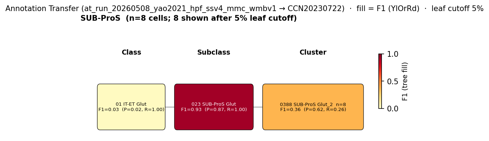

# Subicular pyramidal cell — WMBv1 (CCN20230722) Mapping Report
*2026-05-19 · Source: `kb/graphs/hippocampus/hippocampus_glutamatergic.yaml`*

## Introduction

Subicular pyramidal cells are the principal glutamatergic output neurons of the subiculum, receiving topographically organised input from CA1 and transmitting processed hippocampal signals to the deep layers of entorhinal cortex and a broad set of subcortical targets [1][4]. The subiculum also provides feedback connections to earlier stages of the hippocampal circuit [2][3], making subicular pyramidal cells a key node in hippocampal-cortical information processing. Electrophysiologically, three subtypes are recognised — regular-firing (RF), weak-burst (WB), and strong-burst (SB) — whose correspondence to transcriptomic atlas types remains unresolved. The annotation transfer from Yao 2021 (GSE185862) provides strong evidence for the primary mapping to WMBv1 supertype 0096 SUB-ProS Glut_1, with a TYPE_A_SPLITS relationship reflecting three co-existing IT subicular supertypes.

### Classical type table

| Property | Value | References |
|---|---|---|
| Soma location | Subiculum [UBERON:0002191] | [1][2][3][4] |
| NT | Glutamatergic | [5] |
| Defining markers | Np65 (Nptn, neuroplastin-65) | [6] |
| Negative markers | — | |
| Neuropeptides | — | |
| CL term | pyramidal neuron [CL:0000598] (BROAD) | — |

Details — source evidence for classical type properties

- **Subicular output and entorhinal projection** [4]
  > These subicular glutamatergic pyramidal neurons then transmit information to the deep layers (layers V and VI) of entorhinal cortex in a spatially structured manner (MacDougall et al., 2013)(Guinet et al., 2026).
  > — Unknown 2024 · [4] <!-- quote_key: 2171766_ae8e7717 -->

- **Subiculum as major hippocampal output structure** [4]
  > The subiculum functions as one of the major output structures of the hippocampal formation alongside CA1, playing an integral role in hippocampal-cortical information processing (MacDougall et al., 2013). CA1 pyramidal cells project through a topographically organized projection to the subiculum, and the majority of subicular cells conserve their topographic input along the transverse axis from CA1 (MacDougall et al., 2013).
  > — Unknown 2024 · [4] <!-- quote_key: 2171766_2eaf3e02 -->

- **Feedback from subiculum to CA1** [2]
  > The subiculum also provides feedback connections to earlier stages of the hippocampal circuit, with anatomical and electrophysiological evidence showing that subicular neurons provide excitatory synaptic input back to CA1 pyramidal cells (Xu et al., 2016).
  > — Unknown 2016 · [2] <!-- quote_key: 6552145_e1cd39ad -->

- **Subiculum as Cornu Ammonis output structure** [4]
  > The Cornu Ammonis‐1 (CA1) subfield and subiculum (SUB) serve as major output structures of the hippocampal formation
  > — Unknown 2013 · [4] <!-- quote_key: 2171766_537d45ba -->

- **Np65 marker — highest expression on subicular pyramidal neuron dendrites** [6]
  > the highest level of Np expression being located on the dendrites of granule cells and subicular pyramidal neurons
  > — I et al. 2019 · [6] <!-- quote_key: 54102201_823cc8cc -->

- **Glutamatergic principal cells of hippocampus and subiculum** [5]
  > There are 2 types of principal cells in the hippocampal circuit: glutamatergic pyramidal cells in the Ammon's horn and subiculum regions, and glutamatergic granule cells in the DG
  > — Dale et al. 2015 · [5] <!-- quote_key: 2281033_8482ea88 -->

Cell Ontology mapping: pyramidal neuron [[CL:0000598](https://www.ebi.ac.uk/ols4/ontologies/cl/classes?obo_id=CL:0000598)] (BROAD). No subiculum-specific CL term exists; CL:0000598 is used as the broadest accurate mapping. Three electrophysiologically distinct subtypes have been described (RF, WB, SB); a subiculum-specific CL term or a set of subtype terms would be the appropriate new term targets.

---

## Results

One annotation-transfer run informs this node. Yao 2021 (GSE185862) SUB-ProS subclass cells map with high purity to SUPT_0096 as the dominant IT subicular supertype (F1=0.798, target_purity=1.000), establishing a clear primary mapping. A TYPE_A_SPLITS relationship is evident, with SUPT_0097 and SUPT_0098 together accounting for a further ~33% of SUB-ProS cells.

**Filtered AT figure — Yao 2021 SUB-ProS source group.**

*F1 across taxonomy levels for the SUB-ProS source group from Yao 2021 (GEO:GSE185862, n=471 SUB-ProS subclass cells). SUPT_0096 receives 66.5% of cells (F1=0.798, group_purity=0.665, target_purity=1.000) — near-perfect target purity confirms all SUPT_0096-assigned cells are of subicular origin. SUPT_0097 and SUPT_0098 together account for a further ~33% of SUB-ProS cells (F1=0.253 and 0.305 respectively), confirming the TYPE_A_SPLITS relationship across three IT subicular supertypes.*

### Mapping candidates table

| Rank | WMBv1 supertype | Cells (WMBv1) | Confidence | Key property alignment | Verdict |
|---|---|---|---|---|---|
| 1 | 0096 SUB-ProS Glut_1 [CS20230722_SUPT_0096] | 3,239 | 🟡 MODERATE | NT CONSISTENT · location CONSISTENT · Np65 CONSISTENT · F1=0.798 | Best candidate |

Total: 1 edge (TYPE_A_SPLITS; additional edges to SUPT_0097/0098 pending curation).

### Primary candidate property alignment — 0096 SUB-ProS Glut_1 [CS20230722_SUPT_0096] · 🟡 MODERATE

**Table 1 — Property comparison.**

| Property | Classical | Atlas supertype | Alignment |
|---|---|---|---|
| NT type | Glutamatergic | Glutamatergic (SUBC_023 SUB-ProS Glut) | CONSISTENT |
| Soma location | Subiculum [UBERON:0002191] | SUPT_0096 cells assigned to subicular/prosubicular layers in WMBv1 MERFISH | CONSISTENT |
| Np65 (defining marker) | Nptn gene product; highest expression on subicular pyramidal neuron dendrites [6] | mean_expression=8.60 in SUPT_0096 (precomputed_stats.h5, supertype level) | CONSISTENT |

**Table 2 — Evidence support.**

| Evidence | Type | Supports | Headline | Source |
|---|---|---|---|---|
| Yao 2021 (GSE185862) MapMyCells, SUB-ProS subclass (n=471) | Annotation transfer | SUPPORT | F1=0.798, group_purity=0.665, target_purity=1.000; 66.5% of SUB-ProS cells | at_run_20260508_yao2021_hpf_ssv4_mmc_wmbv1 |

**Supporting evidence**

- **NT type — CONSISTENT.** SUPT_0096 belongs to subclass SUBC_023 SUB-ProS Glut, the dedicated subicular/prosubicular glutamatergic subclass in WMBv1. The classical subicular pyramidal cell is glutamatergic [5].

- **Soma location — CONSISTENT.** WMBv1 MERFISH places SUPT_0096 cells in subicular and prosubicular layers, directly matching the classical soma location in the subiculum [UBERON:0002191] [1][2][3][4].

- **Annotation transfer — SUPPORT.** MapMyCells local AT of Yao 2021 (GEO:GSE185862) SSv4 SUB-ProS cells (n=471) onto WMBv1: 313 (66.5%) map to SUPT_0096, F1=0.798, group_purity=0.665, target_purity=1.000. Near-perfect target purity confirms zero contamination from other HPF subclasses. SUPT_0097 (14.6%, F1=0.253) and SUPT_0098 (18.0%, F1=0.305) together account for ~33% of SUB-ProS cells, consistent with TYPE_A_SPLITS.

- **Marker Np65 — CONSISTENT.** Np65 (Nptn, neuroplastin-65) is a defining marker [6]. Precomputed expression stats confirm mean=8.60 in SUPT_0096 (among the higher-expressing HPF supertypes, range ~2.1–9.5). Np65 is broadly expressed across hippocampal pyramidal neurons and does not discriminate among SUPT_0096/0097/0098 at current resolution.

**Concerns**

- **TYPE_A_SPLITS — incomplete mapping.** WMBv1 resolves the classical subicular pyramidal cell population into three IT SUB-ProS supertypes (SUPT_0096–0098). The current mapping has only one edge (to SUPT_0096); SUPT_0097 and SUPT_0098 together account for ~33% of subicular IT cells and require separate edges. CT SUB supertypes (SUPT_0120–0121) and NP SUB supertypes (SUPT_0127–0128) represent corticothalamic and near-projection subicular neurons and their relationship to the classical RF/WB/SB firing subtypes is unresolved.

**What would upgrade confidence**

- Add MappingEdge entries to SUPT_0097 (F1=0.253) and SUPT_0098 (F1=0.305); no new experiments required.
- MapMyCells AT from a dataset with electrophysiologically characterised subicular pyramidal cells (RF, WB, SB) onto WMBv1 at CLUSTER level. Target: F1 ≥ 0.80 per firing subtype. Resolves open question 1.

---

### Methods

Data sources, analyses, and reproducibility receipts

**Classical type definition.** The subicular pyramidal cell is defined on a CLASSICAL_MULTIMODAL basis: soma in subiculum [UBERON:0002191] [1][2][3][4]; glutamatergic [5]; defining marker Np65 (Nptn) [6]; three electrophysiological subtypes (RF, WB, SB) documented but not yet mapped to atlas supertypes.

**Atlas mapping query.** Candidate atlas clusters retrieved from WMBv1 (CCN20230722) at rank 1 (supertype) using NT type (glutamatergic) and region (subiculum/prosubiculum) as primary filters.

**Property alignment.** Alignments graded CONSISTENT / APPROXIMATE / NOT_ASSESSED. Np65 atlas value from precomputed_stats.h5 (supertype level).

**Annotation transfer.**

Run 1 — Yao 2021 SSv4 hippocampal formation → WMBv1:

| Field | Value |
|---|---|
| Source dataset | GEO:GSE185862 (Yao 2021 mouse HPF SMART-Seq v4) |
| Source group | SUB-ProS subclass (Yao 2021 Allen Institute taxonomy) |
| n cells (SUB-ProS) | 471 |
| Source species | NCBITaxon:10090 |
| Target atlas | WMBv1 (CCN20230722) |
| Method | MapMyCells local (cell_type_mapper, default params, raw norm, 100 bootstrap iterations) |
| Tool version | cell_type_mapper |
| n cells total | 6,398 |
| Run record | `kb/annotation_transfer_runs/at_run_20260508_yao2021_hpf_ssv4_mmc_wmbv1/` |
| F1 matrix | `f1_scores_best.csv` |
| Figure | `figures/f1_for_subicular_pyramidal_cell_hippocampus.png` |

**Anti-hallucination.** All citations, atlas accessions, ontology CURIEs, and verbatim literature quotes are validated against the evidencell knowledge base at write time.

*Generated by evidencell `07c6dbd` at 2026-05-19 from `kb/graphs/hippocampus/hippocampus_glutamatergic.yaml`.*

**Evidence base table.**

| Edge ID | Evidence types | Supports | Source |
|---|---|---|---|
| edge_subicular_pyramidal_cell_hippocampus_to_supt_0096 | ANNOTATION_TRANSFER (MapMyCells; GEO:GSE185862) | SUPPORT — F1=0.798; target_purity=1.000; 66.5% of SUB-ProS cells | at_run_20260508_yao2021_hpf_ssv4_mmc_wmbv1 |

---

## Discussion

**Primary mapping: subicular pyramidal cell → 0096 SUB-ProS Glut_1 [CS20230722_SUPT_0096] · MODERATE.** The Yao 2021 (GEO:GSE185862) annotation transfer places 66.5% of SUB-ProS cells in SUPT_0096 (F1=0.798, target_purity=1.000), confirming this as the dominant IT subicular supertype with no contamination from other HPF subclasses. The CONSISTENT soma location in the subiculum and glutamatergic NT type add orthogonal support. Np65 mean=8.60 in SUPT_0096 is consistent with the protein-level observation of high Np65 expression on subicular pyramidal neuron dendrites [6], though Np65 is not subiculum-specific at supertype resolution.

The key limitation is the TYPE_A_SPLITS relationship: the classical subicular pyramidal cell population encompasses all IT projection neurons in the subiculum, which WMBv1 resolves into at least three supertypes (SUPT_0096: 66.5%, SUPT_0097: 14.6%, SUPT_0098: 18.0%). A single edge to SUPT_0096 under-represents the full subicular IT population. The correspondence of these supertypes to the RF/WB/SB electrophysiological subtypes remains an open and important question, as does the relationship of CT SUB and NP SUB supertypes to the classical subicular pyramidal cell.

The Cell Ontology has no subiculum-specific pyramidal cell term; pyramidal neuron [CL:0000598] is used as BROAD mapping.

### Proposed experiments

1. **Complete TYPE_A_SPLITS edges:** add MappingEdge entries to SUPT_0097 (F1=0.253) and SUPT_0098 (F1=0.305) using existing Yao 2021 AT results. No new experiments required.

2. **Electrophysiological subtype correspondence:** MapMyCells AT from a dataset with electrophysiologically characterised subicular cells (RF, WB, SB firing types) onto WMBv1 at CLUSTER level. Target F1 ≥ 0.80 per subtype. This would resolve which SUPT_009x corresponds to each firing subtype and clarify the role of CT SUB and NP SUB supertypes.

3. **CT SUB and NP SUB assessment:** evaluate whether SUPT_0120–0121 (CT SUB) and SUPT_0127–0128 (NP SUB) correspond to functionally defined subicular projection subtypes or represent distinct populations outside the classical subicular pyramidal cell definition.

### Open questions

1. Which of the three electrophysiological subtypes of subicular pyramidal cells (RF, WB, SB) correspond to SUPT_0096, 0097, and 0098? Annotation transfer from an electrophysiologically annotated subicular dataset at CLUSTER level would resolve this.
2. Do CT SUB supertypes (SUPT_0120–0121) and NP SUB supertypes (SUPT_0127–0128) belong within the classical subicular pyramidal cell definition, or are they functionally distinct projection populations?

---

## References

| # | Citation | PMID | Used for |
|---|---|---|---|
| [1] | Unknown 2026 · PMID:41693678 | [41693678](https://pubmed.ncbi.nlm.nih.gov/41693678/) | soma location |
| [2] | Unknown 2016 · PMID:27150503 | [27150503](https://pubmed.ncbi.nlm.nih.gov/27150503/) | soma location |
| [3] | Unknown 2025 · PMID:41509312 | [41509312](https://pubmed.ncbi.nlm.nih.gov/41509312/) | soma location |
| [4] | Unknown 2013 · PMID:24303119 | [24303119](https://pubmed.ncbi.nlm.nih.gov/24303119/) | soma location; subiculum output projections |
| [5] | Dale et al. 2015 · PMID:26346726 | [26346726](https://pubmed.ncbi.nlm.nih.gov/26346726/) | neurotransmitter type |
| [6] | I et al. 2019 · PMID:30488668 | [30488668](https://pubmed.ncbi.nlm.nih.gov/30488668/) | Np65 marker |
