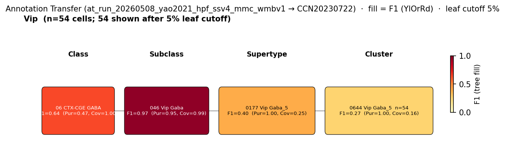

# VIP-positive basket cell — WMBv1 (CCN20230722) Mapping Report
*2026-04-09 · Source: `kb/graphs/hippocampus/hippocampus_GABAergic_interneurons.yaml`*

## Introduction

VIP-positive basket cells are GABAergic interneurons with soma in the CA1 pyramidal layer that, unlike VIP+ interneuron-selective (IS) cells, provide asynchronous perisomatic inhibition onto CA1 pyramidal neurons rather than targeting other interneurons. The single primary characterisation in mouse hippocampus (Tyan et al. 2014, PMID:24671999) establishes VIP as the defining marker and contrasts the basket type with IS interneurons that share VIP expression but differ in postsynaptic target.

### Classical type table

| Property | Value | References |
|---|---|---|
| Soma location | pyramidal layer of CA1 [UBERON:0014548] | — |
| NT | GABAergic | — |
| Markers | Vip | — |

<details>
<summary>Details — source evidence for classical type properties</summary>

No per-property literature sources are recorded on the classical node (stub created from cite-traverse on 2026-04-10, with Tyan et al. 2014 identified as the single primary description). Marker, soma location and NT assignments rest on the Tyan et al. 2014 description carried in the node's notes; primary citations should be added to `sources[]` in a follow-up curation pass.

</details>

### Cell Ontology mapping

No Cell Ontology term currently covers this type — candidate for a new CL term.

---

## Results

Annotation transfer of the Yao 2021 hippocampal SMART-Seq v4 Vip subclass onto WMBv1 lands cleanly at SUBCLASS level (046 Vip Gaba, F1=0.97) but fragments across multiple Vip supertypes and clusters; the candidate carrying both the Tyan 2014 CA1-pyramidal-layer location signal and atlas-side CA1 anatomy is 0179 Vip Gaba_7 [CS20230722_SUPT_0179], with 0649 Vip Gaba_7 [CS20230722_CLUS_0649] as its CA1-enriched child cluster (see figure and property comparison table). Subclass-level AT cannot discriminate VIP basket cells from VIP+ interneuron-selective (IS) interneurons because the Yao 2021 Vip label aggregates both populations.



*F1 across taxonomy levels for the single Yao 2021 Vip source group (n=476 hippocampal cells). Coverage = fraction of source-group cells landing on the target; Purity = fraction of this target's cells coming from the source group. With a single source group, Purity collapses toward 1 at the deeper levels and only Coverage discriminates. The Vip population is clean at SUBCLASS (046 Vip Gaba, F1=0.97) but fragments at SUPERTYPE (top 0177 Vip Gaba_5, F1=0.40) and CLUSTER (top 0644 Vip Gaba_5, F1=0.27) — a signature of multiple VIP subtypes within the source label that the source dataset does not resolve.*

### Property alignment and evidence support — 0179 Vip Gaba_7 [CS20230722_SUPT_0179]

**Table 1 — Property comparison.**

| Property | Classical | Supertype | Best cluster | Alignment |
|---|---|---|---|---|
| Soma location | pyramidal layer of CA1 [UBERON:0014548] | Hippocampal formation [MBA:1089]; Field CA3 [MBA:463]; Field CA1 [MBA:382] (region_fraction_100um: 0.271) | Field CA1 [MBA:382] count_100um=24; Field CA3 [MBA:463] count_100um=20 (CS20230722_CLUS_0649) | APPROXIMATE |
| NT type | GABAergic | not asserted | GABA (CS20230722_CLUS_0649) | NOT_ASSESSED at supertype; CONSISTENT at cluster |
| Vip expression | defining marker | Vip: 6.82; cohort_pct 0.929; child-coverage 1.000; atlas category: DEFINING | Vip: 9.17; cohort_pct 0.952 (CS20230722_CLUS_0649) | CONSISTENT |
| Sex ratio | not documented | not available | not assessed (CS20230722_CLUS_0649) | NOT_ASSESSED |

*(1 of 5 child clusters of 0179 Vip Gaba_7 (CS20230722_CLUS_0649) sits with appreciable CA1-pyramidal-layer / CA1 representation in atlas anatomy; the remainder of the supertype's anatomy is CA3-enriched (CA3 pyr 23, CA3 SO 25, CA3 SR 17, CA3 lucidum 11 reported on the supertype). Best CA1 match: CLUS_0649.)*

**Table 2 — Evidence support.**

| Evidence | Type | Supports | Headline | Source |
|---|---|---|---|---|
| Atlas metadata (CA1/CA3 anat + Vip DEFINING) | Atlas metadata | PARTIAL | Vip mean=6.82; CA1 pyr 11, CA1 SO 24 | atlas-internal |
| MapMyCells AT (Yao 2021 Vip → WMBv1) | Annotation transfer | PARTIAL | SUBC_046 F1=0.97; SUPT_0179 F1=0.38 | atlas-internal |

### 0179 Vip Gaba_7 [CS20230722_SUPT_0179] · 🔴 LOW

**Supporting evidence:**
- Vip is the atlas team's defining marker for this supertype (mean 6.82; cohort percentile 0.93 against the 50-member GABAergic-hippocampal cohort; child-coverage 1.00), matching the Tyan et al. 2014 marker assignment.
- Atlas anatomy for the supertype includes CA1 pyramidal layer (11 cells) and CA1 stratum oriens (24 cells), the only candidate that places any cells in stratum pyramidale at supertype level. Annotation transfer of the Yao 2021 hippocampal Vip subclass returns 0179 Vip Gaba_7 as a second-strongest supertype target (F1=0.38; purity 0.97; coverage 0.25; 96 of 476 source cells).

**Marker evidence provenance:**
- Vip on the classical node is listed without a primary citation in `sources[]`; the Tyan et al. 2014 PMID is referenced in node notes only. The marker concordance is therefore biologically supported by Tyan 2014 but the curation chain should be tightened — add a primary citation to the Vip marker `refs[]`.

**Concerns:**
- AT subclass F1=0.97 (clean) fragments to supertype F1=0.38 / cluster F1=0.27. The source Yao 2021 Vip label is an undifferentiated mixture of VIP basket cells, VIP+ IS cells, and other VIP interneurons, so subclass-clean / supertype-scattered behaviour is expected and the AT result cannot by itself confirm basket-type assignment over IS-cell assignment to this supertype.
- 0179 Vip Gaba_7 is the primary candidate supertype for IS interneurons as well as for VIP basket cells (the calretinin/VIP+ interneuron-selective cells of Tyan et al. 2014). Without additional discriminators (e.g. Cnr1 or other basket-identity markers, Calb2 for IS identity) atlas metadata cannot resolve which functional subtype this supertype represents.
- Supertype anatomy is CA3-enriched (region_fraction_100um: 0.271; strict region_fraction: 0.093). The bulk of the population sits in CA3 rather than CA1, so a CA1-pyramidal-layer-specific basket cell is at best a minority component of this supertype.
- Single-study evidence base on the classical side (Tyan et al. 2014 only).

**What would upgrade confidence:**
- Run MapMyCells using a source dataset that morphologically or genetically separates VIP basket cells from VIP+ IS cells (e.g. Vip-Cre lines combined with morphological reconstruction or post-hoc connectivity assays) and target F1 ≥ 0.80 at cluster level within 0179 Vip Gaba_7's children. Expected output: AnnotationTransferEvidence with a basket-specific source label.
- Targeted literature trawl for VIP basket cell additional markers (Cnr1, Calb1, other peptide co-expression) to enable atlas-metadata discrimination from VIP+ IS interneurons.
- Add the Tyan et al. 2014 primary citation to the Vip marker entry on the classical node.

### 0649 Vip Gaba_7 [CS20230722_CLUS_0649] · 🔴 LOW

**Supporting evidence:**
- Child cluster of 0179 Vip Gaba_7; carries the supertype's CA1 representation (Field CA1 count_100um=24; Field CA3 count_100um=20; region_fraction_100um: 0.254). This is the within-supertype best candidate to host a CA1-pyramidal-layer VIP basket cell.
- Vip expression confirmed on the cluster (mean 9.17; cohort percentile 0.95; raw tier 2).
- NT annotation GABA, consistent with the classical type.

**Marker evidence provenance:**
- As for the parent supertype: the marker concordance for Vip is the only structured marker comparison currently on the edge. Adding Cnr1 or other VIP-basket discriminators to the classical node would let the comparison narrow this candidate further.

**Concerns:**
- The cluster shares the parent supertype's ambiguity between VIP basket and VIP+ IS identity; subclass-level AT (F1=0.97) does not propagate to cluster-level discrimination (best cluster anywhere is 0644 Vip Gaba_5 at F1=0.27, in a different supertype).
- Strict region_fraction is low (0.055); the cluster's CA1 representation is genuine but a minority of its 409 cells. The proximity-based region_fraction_100um=0.254 lifts the location signal into the boundary band, consistent with VIP interneurons whose soma can sit at the stratum pyramidale / stratum oriens boundary, but does not by itself resolve basket-vs-IS assignment.

**What would upgrade confidence:**
- The same morphologically- or genetically-disambiguated AT experiment proposed above would resolve the cluster placement.
- Adding a transcript-level negative marker (e.g. Calb2 absence) to the classical node would let the property comparison flag IS-cell-leaning clusters within 0179 Vip Gaba_7's children.

<details>
<summary>Candidates audited (full top-K)</summary>

| WMBv1 cluster | Supertype | Cells (10x) | Confidence | Key evidence | Verdict |
|---|---|---:|---|---|---|
| 0179 Vip Gaba_7 [CS20230722_SUPT_0179] | — | 1083 | 🔴 LOW | Vip DEFINING; CA1 pyr/SO present; AT F1=0.38 | Primary (basket–IS ambiguous) |
| 0649 Vip Gaba_7 [CS20230722_CLUS_0649] | 0179 Vip Gaba_7 | 409 | 🔴 LOW | CA1 child of SUPT_0179; Vip 9.17 | Secondary (CA1-enriched child) |
| 0644 Vip Gaba_5 [CS20230722_CLUS_0644] | 0177 Vip Gaba_5 | 1039 | ⚪ UNCERTAIN | Vip 11.23 but isocortex-dominated anat | Eliminated (mostly isocortex, low CA1) |
| 0653 Vip Gaba_8 [CS20230722_CLUS_0653] | 0180 Vip Gaba_8 | 290 | ⚪ UNCERTAIN | Vip 11.77 but strict region_fraction 0.014 | Eliminated (sparse CA1 cells) |
| 0680 Sncg Gaba_5 [CS20230722_CLUS_0680] | 0189 Sncg Gaba_5 | 396 | ⚪ UNCERTAIN | Sncg supertype; isocortex-leaning anat | Eliminated (wrong supertype identity) |
| 0698 RHP-COA Ndnf Gaba_4 [CS20230722_CLUS_0698] | 0196 RHP-COA Ndnf Gaba_4 | 80 | ⚪ UNCERTAIN | Vip 0.65; Ndnf supertype; CA3 SO anat | Eliminated (Ndnf type, near-zero Vip) |
| 0219 Sst Gaba_6 [CS20230722_SUPT_0219] | — | 725 | 🔴 REFUTED | Vip 0.44; Sst supertype | Eliminated (wrong subclass, Sst) |
| 0196 RHP-COA Ndnf Gaba_4 [CS20230722_SUPT_0196] | — | 167 | 🔴 REFUTED | Vip 0.93; Ndnf supertype | Eliminated (wrong subclass, Ndnf) |
| 0180 Vip Gaba_8 [CS20230722_SUPT_0180] | — | 1511 | ⚪ UNCERTAIN | Vip 12.00 but isocortex-dominated | Eliminated (location DISCORDANT) |
| 0176 Vip Gaba_4 [CS20230722_SUPT_0176] | — | 6083 | ⚪ UNCERTAIN | Vip 11.25 but isocortex-dominated | Eliminated (location DISCORDANT) |
| 0174 Vip Gaba_2 [CS20230722_SUPT_0174] | — | 5710 | ⚪ UNCERTAIN | Vip 10.55 but isocortex-dominated | Eliminated (location DISCORDANT) |

</details>

---

### Methods

<details>
<summary>Data sources, analyses, and reproducibility receipts</summary>

**Classical type definition.** VIP-positive basket cell is a GABAergic interneuron with soma in the CA1 pyramidal layer [UBERON:0014548], defined by Vip expression and described by Tyan et al. 2014 (PMID:24671999) as providing asynchronous perisomatic inhibition onto CA1 pyramidal cells. `definition_basis: CLASSICAL_MULTIMODAL`.

**Atlas mapping query.** Candidate atlas clusters were retrieved from the WMBv1 taxonomy (CCN20230722) at ranks 0 (cluster) and 1 (supertype) using metadata-based scoring (region match, NT type, defining markers, sex bias when applicable). Full scoring rules: `workflows/map-cell-type.md`.

**Property alignment.** Each defining property of the classical type was compared to the corresponding atlas-side value via the `property_comparisons` schema, with alignments graded CONSISTENT / APPROXIMATE / DISCORDANT / NOT_ASSESSED. Atlas-side numerical values came from precomputed expression on the cluster (cluster.yaml in the taxonomy reference store) and from MERFISH spatial registration for soma location.

**Annotation transfer.**

| Field | Value |
|---|---|
| Source dataset | GEO:GSE185862 (Yao 2021 SMART-Seq v4 hippocampal formation, Allen Institute taxonomy labels including Vip) |
| Source species | NCBITaxon:10090 |
| Target atlas | WMBv1 (CCN20230722) |
| Method | MapMyCells local (cell_type_mapper, default parameters, raw normalization, 100 bootstrap iterations). Per-cell labels aggregated by source_cluster_label and target taxonomy level for F1 scoring. |
| Tool version | cell_type_mapper |
| Bootstrap threshold | 0.0 |
| n cells | 6398 (filtered to 6398) |
| Run record | [`kb/annotation_transfer_runs/at_run_20260508_yao2021_hpf_ssv4_mmc_wmbv1/manifest.yaml`](../../kb/annotation_transfer_runs/at_run_20260508_yao2021_hpf_ssv4_mmc_wmbv1/manifest.yaml) |
| Code reference | [https://github.com/AllenInstitute/cell_type_mapper](https://github.com/AllenInstitute/cell_type_mapper) |
| F1 matrix | [`f1_scores_best.csv`](../../kb/annotation_transfer_runs/at_run_20260508_yao2021_hpf_ssv4_mmc_wmbv1/f1_scores_best.csv) |

**Anti-hallucination.** All citations, atlas accessions, ontology CURIEs, and verbatim literature quotes in this report are validated against the evidencell knowledge base at write time. Authored-prose evidence narratives are validated against their source `evidence_items[*].explanation` fields. The pre-write hook rejects any unresolvable identifier or unattributed blockquote. Specific mapping limitations and caveats are documented per-candidate in the Discussion section.

*Generated by evidencell `25c2b32` at 2026-06-08T18:37:40+00:00 from [kb/graphs/hippocampus/hippocampus_GABAergic_interneurons.yaml](kb/graphs/hippocampus/hippocampus_GABAergic_interneurons.yaml).*

**Evidence base table.**

| Edge ID | Evidence types | Supports | Source |
|---|---|---|---|
| edge_vip_basket_cell_hippocampus_to_CS20230722_SUPT_0179 | ATLAS_METADATA; ANNOTATION_TRANSFER | PARTIAL; PARTIAL | atlas-internal |
| edge_vip_basket_cell_hippocampus_to_CS20230722_CLUS_0649 | ATLAS_METADATA | PARTIAL | atlas-internal |
| edge_vip_basket_cell_hippocampus_to_CS20230722_CLUS_0644 | ATLAS_METADATA | PARTIAL | atlas-internal |
| edge_vip_basket_cell_hippocampus_to_CS20230722_CLUS_0653 | ATLAS_METADATA | PARTIAL | atlas-internal |
| edge_vip_basket_cell_hippocampus_to_CS20230722_CLUS_0680 | ATLAS_METADATA | PARTIAL | atlas-internal |
| edge_vip_basket_cell_hippocampus_to_CS20230722_CLUS_0698 | ATLAS_METADATA | PARTIAL | atlas-internal |
| edge_vip_basket_cell_hippocampus_to_CS20230722_SUPT_0219 | ATLAS_METADATA | PARTIAL | atlas-internal |
| edge_vip_basket_cell_hippocampus_to_CS20230722_SUPT_0196 | ATLAS_METADATA | PARTIAL | atlas-internal |
| edge_vip_basket_cell_hippocampus_to_CS20230722_SUPT_0180 | ATLAS_METADATA | PARTIAL | atlas-internal |
| edge_vip_basket_cell_hippocampus_to_CS20230722_SUPT_0176 | ATLAS_METADATA | PARTIAL | atlas-internal |
| edge_vip_basket_cell_hippocampus_to_CS20230722_SUPT_0174 | ATLAS_METADATA | PARTIAL | atlas-internal |

</details>

---

## Discussion

**Primary mapping:** VIP-positive basket cell → 0179 Vip Gaba_7 [CS20230722_SUPT_0179] at LOW confidence, with 0649 Vip Gaba_7 [CS20230722_CLUS_0649] as the best CA1-enriched child cluster. Key support: Vip is the atlas-side defining marker on the supertype (mean 6.82; cohort percentile 0.93), and the supertype is the only candidate with appreciable CA1 pyramidal layer and stratum oriens representation. Key caveats: AMBIGUOUS_MAPPING (the same supertype is also the candidate for VIP+ IS interneurons, and currently available markers do not distinguish basket-from-IS), SINGLE_STUDY classical evidence base (Tyan et al. 2014 only). The SUBCLASS-level annotation transfer (Yao 2021 Vip → 046 Vip Gaba, F1=0.97) cannot be propagated to the basket type specifically because the source Vip label aggregates basket and IS populations.

No Cell Ontology term currently assigned. Candidate for CL contribution once basket-vs-IS marker discrimination is curated.

### Proposed experiments and follow-ups

- **What**: Annotation transfer from a VIP-basket-specific source (Vip-Cre-targeted cells with morphological reconstruction or post-hoc connectivity onto pyramidal cells). **Target**: F1 ≥ 0.80 at CLUSTER level within children of 0179 Vip Gaba_7. **Expected output**: AnnotationTransferEvidence with a basket-specific source_cluster_label. **Resolves**: the basket-vs-IS ambiguity on SUPT_0179 / CLUS_0649. The Yao 2021 round already exists at SUBCLASS resolution (F1=0.97) but the subclass label conflates VIP subtypes; a basket-targeted dataset is the refinement needed.
- **What**: Targeted literature trawl for VIP basket cell discriminating markers (Cnr1, Calb1, other peptide co-expression) and primary marker citation for Vip on the classical node. **Expected output**: additional `defining_markers[]` / `negative_markers[]` entries on the classical node and citations on Vip. **Resolves**: enables atlas-metadata discrimination of basket vs. IS interneurons via property comparison.

### Open questions

1. Does the basket-vs-IS distinction within Vip Gaba_7 (SUPT_0179) map to a child-cluster split, or is it cross-cutting at cluster level? (Resolves once a basket-targeted AT run is available.)
2. Are there transcript-level markers, in addition to Vip, that separate VIP basket cells from VIP+ IS interneurons in mouse CA1?

---

## References

| # | Citation | PMID | Used for |
|---|---|---|---|

(No literature references are currently attached to edges or marker `sources[]` for this node; Tyan et al. 2014, PMID:24671999, is referenced in classical node notes only and is not registered in `reference_index`.)

---

<!-- verdict-block-start: edge_vip_basket_cell_hippocampus_to_CS20230722_SUPT_0179 -->
```yaml
verdict:
  confidence: LOW
  confidence_score: 0.35
  relationship: evidencell:UncertainRelationship
  rationale: >
    [tier:STRONGEST] Vip is the atlas DEFINING marker on CS20230722_SUPT_0179
    (mean 6.82, cohort percentile 0.929) and the supertype is the only
    candidate with CA1 pyramidal layer and CA1 stratum oriens cells in
    atlas anatomy; MapMyCells annotation transfer of the Yao 2021 Vip
    subclass lands cleanly at SUBCLASS level (CS20230722_SUBC_046,
    F1=0.97; CLASS F1=0.64) but fragments below subclass because the
    source Vip label aggregates VIP basket and VIP+ IS populations.
    SUPT_0179 is also the primary candidate for IS interneurons, so
    basket-vs-IS assignment cannot be resolved from atlas metadata or
    this AT run.
  reconciliation_note: >
    AT-only indistinguishable from is_interneuron_hippocampus on
    CS20230722_SUBC_046 and CS20230722_CLAS_06 (Vip subclass label
    in at_run_20260508_yao2021_hpf_ssv4_mmc_wmbv1 pools both populations;
    anat panel does distinguish in classical lit but no AT-source
    cohort separates them); see Tyan et al. 2014 PMID:24671999.
    Paired with edge_vip_basket_cell_hippocampus_to_CS20230722_CLUS_0649
    as best CA1-enriched child cluster within this supertype.
  caveats:
    - caveat_type: AMBIGUOUS_MAPPING
      description: >
        CS20230722_SUPT_0179 is also the candidate supertype for VIP+
        IS interneurons. Without additional discriminators atlas
        metadata cannot resolve basket-vs-IS assignment.
    - caveat_type: SINGLE_STUDY
      description: >
        Classical evidence base is a single primary study (Tyan et al.
        2014, PMID:24671999).
    - caveat_type: LOW_CELL_COUNT
      description: >
        CA1 pyramidal layer representation in CS20230722_SUPT_0179 is
        very low (11 cells); the supertype is CA3-enriched
        (region_fraction_100um: 0.271; strict region_fraction: 0.093).
  proposed_experiments:
    - >
      Annotation transfer from a VIP-basket-specific source dataset
      (Vip-Cre with post-hoc pyramidal-cell connectivity assays)
      targeting F1 >= 0.80 at cluster level within children of
      CS20230722_SUPT_0179; would resolve basket-vs-IS assignment.
    - >
      Targeted literature trawl for VIP basket cell discriminating
      markers (Cnr1, Calb1, other peptide co-expression) and add
      primary citation for Vip on the classical node.
  unresolved_questions:
    - >
      Does the VIP basket vs. VIP+ IS interneuron distinction within
      CS20230722_SUPT_0179 correspond to a child-cluster split, or is
      it cross-cutting at cluster level?
```
<!-- verdict-block-end -->

<!-- verdict-block-start: edge_vip_basket_cell_hippocampus_to_CS20230722_CLUS_0649 -->
```yaml
verdict:
  confidence: LOW
  confidence_score: 0.3
  relationship: evidencell:UncertainRelationship
  rationale: >
    [tier:NEXT] CS20230722_CLUS_0649 is the CA1-enriched child of
    CS20230722_SUPT_0179 (Field CA1 count_100um=24; region_fraction_100um:
    0.254) and carries the Vip defining marker (mean 9.17, cohort
    percentile 0.952); it is the best within-supertype candidate to host
    a CA1-pyramidal-layer VIP basket cell. No annotation-transfer
    metrics are recorded on this cluster edge; cluster-level AT does
    not discriminate because the Yao 2021 Vip source label aggregates
    basket and IS subtypes.
  reconciliation_note: >
    Paired with edge_vip_basket_cell_hippocampus_to_CS20230722_SUPT_0179
    as the supertype-best CA1 child cluster; basket-vs-IS ambiguity
    inherited from the parent supertype.
  caveats:
    - caveat_type: AMBIGUOUS_MAPPING
      description: >
        Inherits basket-vs-IS ambiguity from parent CS20230722_SUPT_0179;
        cluster-level AT does not separate the two.
    - caveat_type: SINGLE_STUDY
      description: >
        Classical evidence base is a single primary study (Tyan et al.
        2014, PMID:24671999).
  proposed_experiments:
    - >
      Same basket-targeted annotation transfer as proposed on the parent
      supertype (target F1 >= 0.80 at cluster level).
  unresolved_questions: []
```
<!-- verdict-block-end -->

<!-- verdict-block-start: edge_vip_basket_cell_hippocampus_to_CS20230722_CLUS_0644 -->
```yaml
verdict:
  confidence: UNCERTAIN
  confidence_score: 0.15
  rationale: >
    [tier:CUT] CS20230722_CLUS_0644 (0644 Vip Gaba_5) shows high Vip
    expression (mean 11.23, cohort percentile 0.976) but its anatomy is
    isocortex-leaning with only minor CA1 representation
    (region_fraction_100um: 0.171; strict region_fraction: 0.055); a
    CA1-pyramidal-layer VIP basket cell is not the best biological
    reading.
```
<!-- verdict-block-end -->

<!-- verdict-block-start: edge_vip_basket_cell_hippocampus_to_CS20230722_CLUS_0653 -->
```yaml
verdict:
  confidence: UNCERTAIN
  confidence_score: 0.15
  rationale: >
    [tier:CUT] CS20230722_CLUS_0653 (0653 Vip Gaba_8) carries Vip mean
    11.77 but strict region_fraction is 0.014 (very few cells truly in
    the queried region); CA1-pyramidal-layer assignment is not supported.
```
<!-- verdict-block-end -->

<!-- verdict-block-start: edge_vip_basket_cell_hippocampus_to_CS20230722_CLUS_0680 -->
```yaml
verdict:
  confidence: UNCERTAIN
  confidence_score: 0.1
  rationale: >
    [tier:CUT] CS20230722_CLUS_0680 sits within the Sncg Gaba_5
    supertype (0189 Sncg Gaba_5), a Sncg-defined transcriptomic identity
    distinct from the Vip-defined classical type; Vip expression (mean
    10.75) appears here too but the supertype identity is wrong.
```
<!-- verdict-block-end -->

<!-- verdict-block-start: edge_vip_basket_cell_hippocampus_to_CS20230722_CLUS_0698 -->
```yaml
verdict:
  confidence: UNCERTAIN
  confidence_score: 0.05
  rationale: >
    [tier:CUT] CS20230722_CLUS_0698 sits within the Ndnf supertype
    0196 RHP-COA Ndnf Gaba_4; Vip mean is only 0.65 (cohort percentile
    0.758, raw tier 1) and the supertype is a retrohippocampal-cortical
    amygdala Ndnf population, not a VIP basket identity.
```
<!-- verdict-block-end -->

<!-- verdict-block-start: edge_vip_basket_cell_hippocampus_to_CS20230722_SUPT_0219 -->
```yaml
verdict:
  confidence: REFUTED
  confidence_score: 0.02
  rationale: >
    [tier:CUT] CS20230722_SUPT_0219 is a Sst-defined supertype (0219
    Sst Gaba_6); Vip mean is 0.44 (cohort percentile 0.679) and the
    subclass identity is wrong for a VIP basket cell.
```
<!-- verdict-block-end -->

<!-- verdict-block-start: edge_vip_basket_cell_hippocampus_to_CS20230722_SUPT_0196 -->
```yaml
verdict:
  confidence: REFUTED
  confidence_score: 0.05
  rationale: >
    [tier:CUT] CS20230722_SUPT_0196 (0196 RHP-COA Ndnf Gaba_4) is an
    Ndnf-defined supertype; Vip expression is only 0.93 and the
    supertype identity is wrong for a VIP basket cell.
```
<!-- verdict-block-end -->

<!-- verdict-block-start: edge_vip_basket_cell_hippocampus_to_CS20230722_SUPT_0180 -->
```yaml
verdict:
  confidence: UNCERTAIN
  confidence_score: 0.1
  rationale: >
    [tier:CUT] CS20230722_SUPT_0180 (0180 Vip Gaba_8) has Vip mean 12.00
    but its anatomy is isocortex-dominated (region_fraction_100um: 0.075;
    strict region_fraction: 0.011; location DISCORDANT); the CA1
    pyramidal layer is not the type's home region.
```
<!-- verdict-block-end -->

<!-- verdict-block-start: edge_vip_basket_cell_hippocampus_to_CS20230722_SUPT_0176 -->
```yaml
verdict:
  confidence: UNCERTAIN
  confidence_score: 0.05
  rationale: >
    [tier:CUT] CS20230722_SUPT_0176 (0176 Vip Gaba_4) is isocortex-
    dominated (region_fraction_100um: 0.027; strict region_fraction:
    0.004; location DISCORDANT); a hippocampal VIP basket cell is not
    the best biological reading despite Vip mean 11.25.
```
<!-- verdict-block-end -->

<!-- verdict-block-start: edge_vip_basket_cell_hippocampus_to_CS20230722_SUPT_0174 -->
```yaml
verdict:
  confidence: UNCERTAIN
  confidence_score: 0.05
  rationale: >
    [tier:CUT] CS20230722_SUPT_0174 (0174 Vip Gaba_2) is isocortex-
    dominated (region_fraction_100um: 0.021; strict region_fraction:
    0.005; location DISCORDANT); a hippocampal VIP basket cell is not
    the best biological reading despite Vip mean 10.55.
```
<!-- verdict-block-end -->
