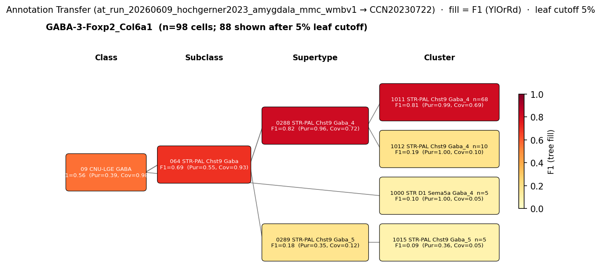

# Amygdala Intercalated Cell — CCN20230722 Mapping Report
*2026-06-10 · Source: `kb/graphs/medial_temporal_lobe_amygdala/20260528_medial_temporal_lobe_amygdala_report_ingest.yaml`*

---

## Introduction

Amygdala intercalated cells (ITCs) are small, densely packed GABAergic neurons
residing in the intercalated cell masses (ICMs), a set of nuclei that occupy the
spaces between the basolateral and central amygdalar compartments. They do not
slot cleanly into the major amygdalar subdivisions: Veinante et al. 2013 describe
them as "unclassified" relative to the canonical basolateral, centromedial, and
cortical-like nuclear groups [3]. Their molecular identity — defined by
co-expression of Foxp2, Drd1, and Oprm1 — is well conserved across mammals [5][6][7].
Mapping ITCs to an atlas transcriptomic cluster matters because these neurons gate
BLA-to-CeA information flow and are critical for fear extinction; a validated atlas
anchor enables downstream spatial and projection analyses in WMBv1.

### Classical type properties

| Property | Value | References |
|---|---|---|
| Soma location | Intercalated nuclei [UBERON:0002884] | [1][2][3] |
| NT type | GABAergic | [3][4] |
| Foxp2 | Defining marker | [5][6] |
| Drd1 | Defining marker | [6] |
| Oprm1 | Defining marker | [5] |

<details>
<summary>Details — source evidence for classical type properties</summary>

- **Soma location:** asta_report · [1]
  > At the cellular level, the amygdala is composed of a group of 13 sub-nuclei located in the medial temporal lobe (Price, 2003). These nuclei may be divided into four subdivisions (Sah et al., 2003): (Ethen et al., 2009) basolateral (which includes the lateral, basolateral, and basomedial nuclei), (May et al., 2009) cortical like (including nucleus of the lateral olfactory tract, bed nucleus of the accessory olfactory tract, the cortical nucleus, and the periamygdaloid cortex), (3) centromedial (central and medial nuclei, and the amygdaloid part of the bed nucleus of stria terminalis), and (4) other (which includes anterior amygdala area, the amygdalo-hippocampal area, and the intercalated nuclei)
  > — Ignacio et al. 2014, Amygdala organization and principal cellular classes · [1] <!-- quote_key: 1229611_e14a19cf -->

- **Soma location:** asta_report · [2]
  > . Anatomically the amygdala is composed of three major nuclear groups 198 : the deep or basolateral group, which contains the lateral nucleus, the basal nucleus, and the accessory basal nucleus; the superficial or cortical-like group, which contains the cortical nuclei and the nucleus of the lateral olfactory tract; the centromedial group, which contains the medial and central nuclei. To this canonical classification, other amygdaloid nuclei must be added, such as the anterior amygdaloid area, the amygdalohippocampal area, and the intercalated cells. 199 In addition, a rostro-medial extension of the centromedian amygdala into an area known as extended amygdala has been proposed. 200
  > — Nardelli et al. 2024, Amygdala organization and principal cellular classes · [2] <!-- quote_key: 270614391_b0af02da -->

- **Soma location / NT type / morphology:** asta_report · [3]
  > . In addition to the four groups, a few nuclei of the amygdala remain unclassified, among them the intercalated cell masses which are small clusters of densely packed GABAergic neurons (Palomares-Castillo et al., 2012).
  > — Veinante et al. 2013, Amygdala organization and principal cellular classes · [3] <!-- quote_key: 15449738_a21bd562 -->

- **NT type:** asta_snippet · [4]
  > In some regions, such as the intercalated nuclei, virtually all of the resident neurons appeared to be GABAergic
  > — Pitkānen & Amaral 1994, abstract · [4] <!-- quote_key: 14068807_9efc175b -->

- **Foxp2 / Oprm1 markers:** asta_snippet · [5]
  > We identified distinct subtypes of FOXP2+ interneurons in the intercalated cell masses and protein-kinase C-δ interneurons in the central nucleus. We also establish that glutamatergic, pyramidal-like neurons are transcriptionally specialized within the basal, lateral, or accessory basal nuclei
  > — Totty et al. 2024, Medial, cortical/superficial, and intercalated cell populations · [5] <!-- quote_key: 273531817_88e4457f -->

- **Foxp2 / Drd1 markers:** asta_snippet · [6]
  > the IA subnuclei were highly conserved, and all mammals in our datasets contained two types of TSHZ1+ neurons, i.e., DRD1+ and DRD1−.
  > — Yu et al. 2023, Results · [6] <!-- quote_key: 256832817_4f39c6f9 -->

- **Drd1 / Oprm1 markers (ITC signature):** asta_report · [7]
  > The ICMs are small cell clusters and consist of more dopamine type-1 and µ-opioid-receptor expressing cells (Poulin et al., 2008).
  > — Sarowar & Grabrucker 2020, Classical neuron classes across amygdala subdivisions · [7] <!-- quote_key: 221366115_e5c2cd9e -->

</details>

### Cell Ontology mapping

No Cell Ontology term currently covers this type — candidate for a new CL term.

---

## Results

One candidate atlas cluster was assessed; 0998 STR D1 Sema5a Gaba_3 [CS20230722_CLUS_0998]
in supertype 0283 STR D1 Sema5a Gaba_3 is the primary mapping at LOW confidence,
supported by complete three-marker molecular convergence but limited by a low
region_fraction (0.001) and only partial annotation-transfer support.

### Annotation-transfer overview figure



*F1 across taxonomy levels for the 1 source group relevant to Amygdala intercalated
cell. The figure shows the Hochgerner 2023 GABA-3-Foxp2\_Col6a1 type (n=165 naive
cells; `at_run_20260609_hochgerner2023_amygdala_mmc_wmbv1`). Each panel row is a
source-cell group; nodes are coloured by F1 with **Purity** (Pur) and **Coverage**
(Cov) shown inline. Coverage = fraction of source-group cells landing on this target;
Purity = fraction of this target's cells coming from the source group. F1 ≥ 0.5 at a
level indicates a clean mapping at that resolution.*

At CLASS level, GABA-3-Foxp2\_Col6a1 maps to the "09 CNU-LGE GABA" class
(CS20230722_CLAS_09) with F1=0.56, coverage=0.98, purity=0.39 — near-complete
coverage but low purity, indicating many source groups also map here. This is the
best-supported level in the AT results (best_mapping_rank=3). At SUBCLASS, the
best hit is the "063 STR D1 Sema5a Gaba" subclass (CS20230722_SUBC_063) with
F1=0.10, indicating poor subclass-level resolution for this source group. The
discrepancy between CLASS-level support (F1=0.56) and SUBCLASS-level mismatch
(F1=0.10 for the subclass containing CLUS_0998) is the principal reason for PARTIAL
support on the AT evidence item.

### Mapping candidates overview

| Rank | WMBv1 cluster | Supertype | Cells (10x) | Confidence | Key property alignment | Verdict |
|---|---|---|---|---|---|---|
| 1 | 0998 STR D1 Sema5a Gaba_3 [CS20230722_CLUS_0998] | 0283 STR D1 Sema5a Gaba_3 | 424 | 🔴 LOW | 3/3 markers CONSISTENT · AT PARTIAL | Speculative |

*1 edge total; relationship: skos:broadMatch.*

### Property alignment table — 0998 STR D1 Sema5a Gaba_3 [CS20230722_CLUS_0998]

**Table 1 — Property comparison**

| Property | Classical | Supertype | Best cluster | Alignment |
|---|---|---|---|---|
| Soma location | Intercalated nuclei [UBERON:0002884] | MBA:1105 intercalated nucleus present; region_fraction 0.001 | not assessed | CONSISTENT |
| NT type | GABAergic | GABA | GABA | CONSISTENT |
| Foxp2 expression | Defining marker | not available | mean 11.35 (98.5th pct; tier 2) [CS20230722_CLUS_0998] | CONSISTENT |
| Drd1 expression | Defining marker | not available | mean 7.07 (98.3rd pct; tier 2) [CS20230722_CLUS_0998] | CONSISTENT |
| Oprm1 expression | Defining marker | not available | mean 8.31 (99.1th pct; tier 2) [CS20230722_CLUS_0998] | CONSISTENT |

**Table 2 — Evidence support**

| Evidence | Type | Supports | Headline | Source |
|---|---|---|---|---|
| Sarowar & Grabrucker 2020 — ITC molecular signature | Literature | SUPPORT | FOXP2+/DRD1+/OPRM1+ as ITC signature | [7] |
| Atlas metadata — CLUS_0998 marker score | Atlas metadata | SUPPORT | Score 7/7 on Foxp2+Drd1+Oprm1; strongest in ITC cohort | atlas-internal |
| Hochgerner 2023 MapMyCells AT | Annotation transfer | PARTIAL | F1=0.56 at CLASS level | — |

*(Child-cluster breakdown not assessed — see proposed experiments.)*

---

### 0998 STR D1 Sema5a Gaba_3 [CS20230722_CLUS_0998] · 🔴 LOW

**Supporting evidence:**

- **Literature (molecular signature):** Sarowar & Grabrucker 2020 [7] document that
  ITC neurons in the intercalated cell masses are characterised by co-expression of
  dopamine type-1 receptor and µ-opioid receptor:

  > The ICMs are small cell clusters and consist of more dopamine type-1 and µ-opioid-receptor expressing cells (Poulin et al., 2008).
  > — Sarowar & Grabrucker 2020, Classical neuron classes across amygdala subdivisions · [7] <!-- quote_key: 221366115_e5c2cd9e -->

  This three-factor FOXP2+/DRD1+/OPRM1+ signature is also supported by Totty et al.
  2024 [5] (FOXP2+ subtypes in ICMs) and Yu et al. 2023 [6] (conserved DRD1 identity).

- **Atlas metadata:** 0998 STR D1 Sema5a Gaba_3 [CS20230722_CLUS_0998] achieved the
  highest three-marker score in the ITC-region GABAergic cohort (score 7/7 on
  Foxp2+Drd1+Oprm1; Stage A discovery score 7, rank 1 in a 5-member cohort).
  Precomputed expression confirms all three markers at high percentile: Foxp2 mean
  11.35 (98.5th percentile of MBA:1105 GABAergic cohort), Drd1 mean 7.07 (98.3rd
  percentile), Oprm1 mean 8.31 (99.1th percentile). The intercalated nucleus
  (MBA:1105) is present in the cluster's soma distribution with region_fraction = 0.001,
  consistent with the ICMs' small structural footprint in WMBv1 MERFISH registration.

- **Annotation transfer (PARTIAL):** MapMyCells mapping of Hochgerner 2023
  GABA-3-Foxp2\_Col6a1 cells (n=165 naive cells;
  `at_run_20260609_hochgerner2023_amygdala_mmc_wmbv1`) reaches F1=0.56 at CLASS
  level with coverage=0.98. The near-complete coverage indicates the ITC-type
  transcriptomic signature broadly falls within the CNU-LGE GABA class. However,
  at SUBCLASS the best hit for the "063 STR D1 Sema5a Gaba" subclass
  (CS20230722_SUBC_063) containing CLUS_0998 is only F1=0.10. This poor
  subclass-level resolution is the principal reason for PARTIAL support.

**Marker evidence provenance:**

- **Foxp2:** Evidence is transcript-level (scRNA-seq; Totty et al. 2024 [5]) and
  cross-species (Yu et al. 2023 [6] confirmed conserved DRD1+/FOXP2+ ITC identity
  in mammals). Atlas precomputed expression for 0998 STR D1 Sema5a Gaba_3
  [CS20230722_CLUS_0998] (mean 11.35, 98.5th pct) strongly confirms high Foxp2
  expression. No protein-level (IHC) primary citation directly targeting
  morphology-confirmed ITC neurons is in the gathered literature — a targeted
  cite-traverse for 'FOXP2 intercalated cell amygdala immunohistochemistry' may
  strengthen this pillar.

- **Drd1:** Yu et al. 2023 [6] establish DRD1 as part of the conserved ITC signature
  (TSHZ1+/DRD1+ subtype). Atlas expression confirms (mean 7.07, 98.3rd pct).
  Evidence is cross-species transcript-level.

- **Oprm1:** Totty et al. 2024 [5] and Sarowar & Grabrucker 2020 [7] both cite
  µ-opioid receptor expression as an ITC defining feature. Atlas expression confirms
  (mean 8.31, 99.1th pct). Oprm1 is the highest-percentile marker of the three and
  constitutes the strongest single-gene evidence pillar in this edge.

**Concerns:**

- **AT subclass mismatch:** The annotation-transfer best hit for the "063 STR D1
  Sema5a Gaba" subclass (CS20230722_SUBC_063) containing CLUS_0998 is only F1=0.10
  at SUBCLASS level. This poor subclass resolution means the CLASS-level signal
  (F1=0.56 for "09 CNU-LGE GABA") does not propagate cleanly to the nominated
  subclass, suggesting the Hochgerner 2023 GABA-3-Foxp2\_Col6a1 source type
  encompasses a broader transcriptomic signal than the specific STR D1 Sema5a
  lineage.

- **Low region_fraction (0.001):** region_fraction = 0.001 is very low but expected
  given the small physical size of the intercalated cell masses. This is a biological
  feature of ITCs, not a disqualifying discrepancy. The edge caveats flag this as
  LOW_CELL_COUNT.

- **Small discovery cohort:** Stage A discovery scored CLUS_0998 at rank 1 in a
  cohort of only 5 GABAergic clusters in MBA:1105, with a tied next-best score of 7.
  The small cohort limits the discriminatory power of the discovery score signal.

**What would upgrade confidence:**

- **MapMyCells with a validated ITC-enriched source dataset:** A purpose-built
  dataset of FOXP2-lineage or sorted ITC neurons from mouse amygdala mapped to WMBv1
  (target: F1 ≥ 0.70 at CLUSTER level against 0998 STR D1 Sema5a Gaba_3
  [CS20230722_CLUS_0998]) would provide AnnotationTransferEvidence with SUPPORT and
  could raise confidence to MODERATE. The current Hochgerner 2023 source labels are
  transcriptomically-defined types that lack morphological confirmation as ITC neurons.

- **smFISH with Foxp2+Drd1+Oprm1 in mouse amygdala** (proposed): Triple smFISH in
  UBERON:0002884 would confirm co-expression at single-cell resolution and test
  whether ICM neurons correspond specifically to CS20230722_CLUS_0998 or span
  additional STR-PAL clusters.

- **Targeted literature trawl for FOXP2 IHC in ITC:** A cite-traverse for 'FOXP2
  intercalated cell amygdala' protein-level evidence would resolve the
  transcript-only limitation of the Foxp2 marker pillar.

---

### Methods

<details>
<summary>Data sources, analyses, and reproducibility receipts</summary>

**Classical type definition.** `amygdala_intercalated_cell` is defined on
`CLASSICAL` evidence. The defining markers are Foxp2 [5][6], Drd1 [6], and Oprm1
[5]. NT type is GABAergic [3][4]. Soma location is the intercalated nuclei
[UBERON:0002884] [1][2][3]. No negative markers or neuropeptides are listed. The
`definition_basis` is CLASSICAL (literature-based, morpho-molecular definition
without transcriptomic anchoring at the time of KB entry).

**Atlas mapping query.** Candidate atlas clusters were retrieved from the
CCN20230722 taxonomy at ranks 0 (cluster) and 1 (supertype) using metadata-based
scoring (region match, NT type, defining markers). Full scoring rules:
`workflows/map-cell-type.md`.

**Property alignment.** Each defining property of the classical type was compared to
the corresponding atlas-side value via the `property_comparisons` schema, with
alignments graded CONSISTENT / APPROXIMATE / DISCORDANT / NOT_ASSESSED. Atlas-side
numerical values came from precomputed expression on the cluster (cluster.yaml in the
taxonomy reference store) and from MERFISH spatial registration for soma location.

**Annotation transfer.**

| Field | Value |
|---|---|
| Source dataset | ArrayExpress:E-MTAB-12096 (GABA-3-Foxp2\_Col6a1) |
| Source species | NCBITaxon:10090 |
| Target atlas | WMBv1 (CCN20230722; SHA-256: b21ca985) |
| Method | MapMyCells local (cell_type_mapper v1.7.1, default parameters, raw normalization, 100 bootstrap iterations) |
| Tool version | cell_type_mapper v1.7.1 |
| Bootstrap threshold | 0.7 |
| n cells | 55514 (filtered to 7777) |
| Run record | [`kb/annotation_transfer_runs/at_run_20260609_hochgerner2023_amygdala_mmc_wmbv1/manifest.yaml`](../../kb/annotation_transfer_runs/at_run_20260609_hochgerner2023_amygdala_mmc_wmbv1/manifest.yaml) |
| Code reference | [https://github.com/AllenInstitute/cell_type_mapper](https://github.com/AllenInstitute/cell_type_mapper) |
| F1 matrix | [`research/medial_temporal_lobe_amygdala/annotation_transfer/hochgerner2023_amygdala/f1_matrix.csv`](../../research/medial_temporal_lobe_amygdala/annotation_transfer/hochgerner2023_amygdala/f1_matrix.csv) |
| Caveats | Source labels are transcriptomically-defined types, not classical morpho-electrophysiological types. Matching to KB classical nodes requires a mapping step based on shared molecular markers. Fear-conditioned cells excluded to avoid transcriptional-state confounds. Non-neuronal cells excluded. Gene symbols used (not Ensembl IDs). |

**Atlas data sources.** CCN20230722 (WMBv1); pseudobulk SHA-256:
b21ca985652fb25f9608f99005139a40757133a76fbe845ae5b175c5c26a447b.

**Anti-hallucination.** All citations, atlas accessions, ontology CURIEs, and
verbatim literature quotes in this report are validated against the evidencell
knowledge base at write time. Authored-prose evidence narratives are validated
against their source `evidence_items[*].explanation` fields. The pre-write hook
rejects any unresolvable identifier or unattributed blockquote. Specific mapping
limitations and caveats are documented per-candidate in the Discussion section.

**Evidence base**

| Edge ID | Evidence types | Supports | Source |
|---|---|---|---|
| edge_amygdala_intercalated_cell_to_cs20230722_clus_0998 | LITERATURE; ATLAS_METADATA; ANNOTATION_TRANSFER | SUPPORT; SUPPORT; PARTIAL | [7]; atlas-internal; — |

*Generated by evidencell `9d82411` at 2026-06-10T12:49:05+00:00 from
[kb/graphs/medial_temporal_lobe_amygdala/20260528_medial_temporal_lobe_amygdala_report_ingest.yaml](../../kb/graphs/medial_temporal_lobe_amygdala/20260528_medial_temporal_lobe_amygdala_report_ingest.yaml).*

</details>

---

## Discussion

### Best candidate + caveats

**Primary mapping:** Amygdala intercalated cell → 0998 STR D1 Sema5a Gaba_3
[CS20230722_CLUS_0998] at LOW confidence. Key support: complete three-marker
convergence (Foxp2 + Drd1 + Oprm1, all CONSISTENT with tier-2 precomputed
expression at ≥98th percentile) and GABAergic NT match. Key caveats: annotation
transfer provides only PARTIAL support — the AT best level is CLASS (F1=0.56 for
"09 CNU-LGE GABA") but SUBCLASS resolution for "063 STR D1 Sema5a Gaba" is poor
(F1=0.10), and region_fraction (0.001) reflects the ICMs' small structural footprint
in MERFISH registration.

No Cell Ontology term currently assigned. The ITC molecular signature
(FOXP2+/DRD1+/OPRM1+) represents a well-defined population with high biological
specificity; flagged as a candidate for CL term contribution.

### Proposed experiments and follow-ups

**Annotation transfer — completed round (Hochgerner 2023):** A first AT round using
Hochgerner 2023 GABA-3-Foxp2\_Col6a1 (n=165 naive cells) has been completed. It
achieved CLASS-level coverage (F1=0.56, coverage=0.98) but subclass resolution
failed to nominate the "STR D1 Sema5a Gaba" subclass (F1=0.10 at SUBCLASS). This
round confirmed broad CNU-LGE GABA class identity and that the Foxp2+ cells map
into the general striatal-pallidal GABA lineage; it did not resolve cluster identity.

**Annotation transfer — targeted follow-up (recommended):**
- **What:** MapMyCells AT using a validated ITC-enriched source dataset (e.g.
  FOXP2-Cre-targeted or sorted ITC neurons from mouse amygdala; alternatively a
  re-analysis of the Hochgerner data restricted to Foxp2+ cells only)
- **Target:** F1 ≥ 0.70 at CLUSTER level against 0998 STR D1 Sema5a Gaba_3
  [CS20230722_CLUS_0998]
- **Expected output:** AnnotationTransferEvidence with SUPPORT on
  `edge_amygdala_intercalated_cell_to_cs20230722_clus_0998`
- **Resolves:** AT subclass mismatch; would enable upgrade from LOW to MODERATE

**smFISH:**
- **What:** Triple smFISH (Foxp2 + Drd1 + Oprm1) in mouse amygdala coronal sections
  targeting UBERON:0002884
- **Target:** Co-expression confirmed in ≥80% of ICM neurons
- **Expected output:** LiteratureEvidence or MarkerAnalysisEvidence on
  `edge_amygdala_intercalated_cell_to_cs20230722_clus_0998`
- **Resolves:** Open question #1 (genuine ITC cluster identity)

### Open questions

1. Are CS20230722_CLUS_0998 and CS20230722_CLUS_1009 both genuine ITC
   transcriptomic types? The AT subclass-level mismatch raises the possibility that
   the ITC population spans multiple atlas subtypes corresponding to dorsal vs.
   ventral ICM subdivisions. *(Appears on
   edge_amygdala_intercalated_cell_to_cs20230722_clus_0998.)*

2. What is the relationship between the Foxp2+ DRD1+ and Foxp2+ DRD1− ITC subtypes
   reported in Yu et al. 2023 [6]? The classical node definition treats DRD1 as a
   single defining marker, but the TSHZ1+/DRD1+ vs TSHZ1+/DRD1− heterogeneity may
   map onto distinct atlas clusters. *(Note: interpretive — not stated in facts
   file; follow-up trawl recommended.)*

3. Trawl literature for FOXP2 protein-level (IHC) evidence in intercalated cell
   masses — current Foxp2 marker support is transcript-level only.

---

## References

| # | Citation | PMID | Used for |
|---|---|---|---|
| [1] | Ignacio et al. 2014 | [25309888](https://pubmed.ncbi.nlm.nih.gov/25309888/) | soma location |
| [2] | Nardelli et al. 2024 | [39130512](https://pubmed.ncbi.nlm.nih.gov/39130512/) | soma location |
| [3] | Veinante et al. 2013 | [25408902](https://pubmed.ncbi.nlm.nih.gov/25408902/) | soma location; NT type; ITC morphology |
| [4] | Pitkānen & Amaral 1994 | [8158266](https://pubmed.ncbi.nlm.nih.gov/8158266/) | NT type |
| [5] | Totty et al. 2024 | [39463931](https://pubmed.ncbi.nlm.nih.gov/39463931/) | Foxp2 marker; Oprm1 marker |
| [6] | Yu et al. 2023 | [36788214](https://pubmed.ncbi.nlm.nih.gov/36788214/) | Foxp2 marker; Drd1 marker |
| [7] | Sarowar & Grabrucker 2020 | [32858950](https://pubmed.ncbi.nlm.nih.gov/32858950/) | FOXP2+/DRD1+/OPRM1+ molecular signature of ITC neurons |

---

<!-- verdict-block-start: edge_amygdala_intercalated_cell_to_cs20230722_clus_0998 -->
```yaml
verdict:
  confidence: LOW
  confidence_score: 0.25
  rationale: >
    Three-marker convergence at high percentile: marker_Foxp2 CONSISTENT (precomputed
    mean 11.35, 98.5th pct), marker_Drd1 CONSISTENT (mean 7.07, 98.3rd pct),
    marker_Oprm1 CONSISTENT (mean 8.31, 99.1th pct) — 3 of 3 markers CONSISTENT.
    GABAergic NT CONSISTENT. MapMyCells scRNA-seq AT
    (`at_run_20260609_hochgerner2023_amygdala_mmc_wmbv1`) on GABA-3-Foxp2_Col6a1
    (n=165 naive cells) reaches F1=0.56 at CLASS level (coverage=0.98); SUBCLASS
    F1=0.10 for the STR D1 Sema5a subclass containing CS20230722_CLUS_0998; AT
    support is PARTIAL due to this subclass-level mismatch. region_fraction=0.001
    is consistent with small ITC structure. LOW confidence reflects AT subclass
    mismatch and absence of ITC-specific validated AT source.
  reconciliation_note: ""
  lit_to_lit_edges: []
  unresolved_questions:
    - >
      Are CS20230722_CLUS_0998 and CS20230722_CLUS_1009 both genuine ITC transcriptomic
      types? AT subclass mismatch (STR-PAL Chst9 vs STR D1 Sema5a at subclass) raises
      the question of whether ITC neurons span multiple atlas subtypes.
    - >
      Trawl literature for FOXP2 protein-level (IHC) evidence in intercalated cell
      masses — current Foxp2 marker support is transcript-level only.
```
<!-- verdict-block-end -->
