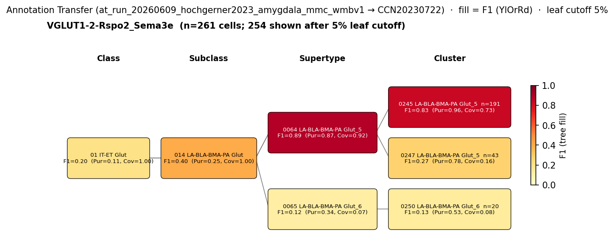

# Basal amygdala fear neuron — CCN20230722 Mapping Report
*2026-06-16 · Source: `kb/graphs/medial_temporal_lobe_amygdala/20260528_medial_temporal_lobe_amygdala_report_ingest.yaml`*

---

## Introduction

Basal amygdala fear neurons are glutamatergic principal neurons within the basal nucleus of the amygdala [UBERON:0002887] that respond selectively to a conditioned fear stimulus [1,2,3,4]. They are classically defined by their activation pattern during fear expression and are paired with a functionally opposing population — extinction neurons — within the same nucleus, forming a two-population model of conditioned fear regulation in the basolateral amygdala (BLA).

> "With respect to fear expression, BLA principal neurons can be divided into two functionally distinct, non-overlapping populations. Activation of "fear" neurons is triggered by the conditioned stimulus, while "extinction" neurons become active only after repetitive presentations of the conditioned stimulus that are not followed by the unconditioned stimulus (Herry et al., 2008). Both types of neurons project to the mPFC but only extinction neurons receive reciprocal input from the mPFC, which makes their activity susceptible to mPFC modulation (Herry et al., 2008)." — Cardenas et al. 2019 · [2] <!-- quote_key: 4940771_cb8fa215 -->

> "Recent advances in neuroscience give us a better view of the inner structure of the amygdala, of its relations with other regions in the Medial Temporal Lobe (MTL) and of the prominent role of neuromodulation. They have particularly shed light on two kinds of neurons in the basal nucleus of the amygdala, the so-called fear neurons and extinction neurons." — Carrere & Alexandre 2015 · [1] <!-- quote_key: 14375617_d7af88e4 -->

### Classical type description

| Property | Value | References |
|---|---|---|
| Soma location | Basal nucleus of the amygdala [UBERON:0002887] | [1,2] |
| Neurotransmitter | Glutamatergic | [3,4] |
| Defining markers | None established in KB | — |
| Negative markers | None established in KB | — |
| Neuropeptides | None established in KB | — |

<details>
<summary>Literature support for classical properties</summary>

**Soma location [1,2]:** The basal nucleus of the amygdala is the identified location for both fear and extinction neurons, as described in the classical Herry et al. (2008) framework (summarised by Cardenas et al. 2019 [2] and Carrere & Alexandre 2015 [1]).

**Neurotransmitter [3,4]:** Glutamatergic identity is supported by Chung et al. 2016 [3] and Totty et al. 2025 [4]. The BLA as a whole is strongly enriched in glutamatergic principal neurons, and fear neurons are described as belonging to this principal neuron class.

> "The basolateral nucleus of the amygdala (BLA) is highly enriched in glutamatergic principal neurons and is required for associative learning. The central nucleus of the amygdala (CeA) primarily consists of GABAergic medium spiny neurons and controls the processing and expression of emotion." — Chung et al. 2016 · [3] <!-- quote_key: 3103554_aec310ea -->

> "Compositional analyses revealed that subdivisions of the primate basolateral complex contain distinct classes of glutamatergic neurons and divergent gene expression profiles for parvalbumin and somatostatin GABAergic neurons." — Totty et al. 2025 · [4] <!-- quote_key: 281382725_21119bdb -->

**Molecular markers:** No defining molecular markers for the fear neuron subtype are currently recorded in the KB. The classical definition is functional (conditioned stimulus-selective firing) rather than molecular. This absence limits direct marker-to-marker atlas comparison.

</details>

### Cell Ontology mapping

No Cell Ontology term currently covers this type — candidate for a new CL term.

---

## Results

Annotation transfer evidence from the Hochgerner 2023 amygdala scRNA-seq dataset (run `at_run_20260609_hochgerner2023_amygdala_mmc_wmbv1`) supports mapping to the supertype 0064 LA-BLA-BMA-PA Glut_5 [CS20230722_SUPT_0064] (F1=0.89 at supertype level; see figure and property comparison table below). Within this supertype, 0245 LA-BLA-BMA-PA Glut_5 [CS20230722_CLUS_0245] leads the cluster-level distribution (F1=0.83, Purity=0.96, Coverage=0.73), indicating that the majority of the source cells concentrate on this cluster while a smaller fraction distributes across co-supertype siblings (see figure).



*Figure: F1 score heatmap for Hochgerner 2023 source label VGLUT1-2-Rspo2_Sema3e mapped against WMBv1 (CCN20230722) at class, subclass, supertype, and cluster levels. At supertype level, 0064 LA-BLA-BMA-PA Glut_5 dominates (F1=0.89, Purity=0.87, Coverage=0.92, n=316 cells). At cluster level, 0245 LA-BLA-BMA-PA Glut_5 leads (F1=0.83, Purity=0.96, Coverage=0.73, n=191 cells). 0247 LA-BLA-BMA-PA Glut_5 receives secondary transfer (F1=0.27, n=43 cells).*

---

### 0064 LA-BLA-BMA-PA Glut_5 [CS20230722_SUPT_0064] · 🟢 HIGH

**Table 1 — Property comparison**

| Property | Classical | Atlas supertype 0064 | Best cluster 0245 | Alignment |
|---|---|---|---|---|
| Neurotransmitter | Glutamatergic | not asserted at supertype level | Glut | NOT_ASSESSED (supertype) / CONSISTENT (cluster) |
| Soma location [UBERON:0002887] | Basal nucleus of amygdala | Cortical subplate [MBA:703], Basolateral amygdalar nucleus [MBA:295], Basolateral amygdalar nucleus, anterior part [MBA:303] (region_fraction_100um=0.881) | Cortical subplate [MBA:703], Basolateral amygdalar nucleus [MBA:295], Basolateral amygdalar nucleus, anterior part [MBA:303] (region_fraction_100um=0.703) | CONSISTENT |

**Table 2 — Evidence support**

| Evidence | Type | Supports | Headline | Source |
|---|---|---|---|---|
| Atlas metadata | ATLAS_METADATA | PARTIAL | region_fraction_100um=0.881; strict region_fraction=0.716 | WMBv1 CCN20230722 |
| Annotation transfer of VGLUT1-2-Rspo2_Sema3e | ANNOTATION_TRANSFER | SUPPORT | F1=0.89 at supertype level; Purity=0.87, Coverage=0.92, n=316 cells | at_run_20260609_hochgerner2023_amygdala_mmc_wmbv1 |

**Subcluster concordance note:** Of the clusters within supertype 0064, two children — 0245 (F1=0.83, n=191) and 0247 (F1=0.27, n=43) — receive detectable transfer from the VGLUT1-2-Rspo2_Sema3e source label; together they account for ~93% of the cluster-level mapped cells. The remaining children within 0064 receive negligible transfer (<5 cells each), indicating that the dominant component of the source label concentrates in cluster 0245, while a secondary fraction reflects scatter into the closely related sibling cluster 0247.

Annotation transfer of the Hochgerner 2023 glutamatergic BLA source label VGLUT1-2-Rspo2_Sema3e maps to the supertype 0064 LA-BLA-BMA-PA Glut_5 [CS20230722_SUPT_0064] with an F1 score of 0.89 at the supertype level (Purity=0.87, Coverage=0.92), constituting strong evidence for regional and transcriptional identity alignment. The supertype's MERFISH-anchored location places 88.1% of its cells within the cortical subplate and basolateral amygdalar nucleus [MBA:295] — concordant with the classical definition of basal amygdala fear neurons as glutamatergic BLA principal neurons [1,2]. NT type is not asserted at the supertype level in the atlas taxonomy, but all cluster-level children of 0064 carry the Glut designation, consistent with the classical glutamatergic identity [3,4].

The principal limitation is the source cell identity in the Hochgerner 2023 atlas: VGLUT1-2-Rspo2_Sema3e is a transcriptomically-defined label from a dataset that includes naive neuronal cells (fear-conditioned cells were excluded); it is not a fear-conditioned or driver-line-targeted cohort of classical fear neurons. The Rspo2 and Sema3e markers have been associated with BLA principal neurons in other amygdala transcriptomic studies, but no direct electrophysiological or optogenetic confirmation linking this Hochgerner source label to the classical fear-responsive subpopulation is available. The mapping is therefore supported by strong convergent spatial and transcriptional evidence, but the functional correspondence to fear neurons specifically awaits direct cell-type targeting (e.g., activity-dependent labelling or Fos-based capture of CS-responsive cells followed by scRNA-seq).

**What would upgrade confidence:**
- Activity-dependent scRNA-seq (e.g., MERFISH or Fos-seq) of fear-conditioned animals to identify which WMBv1 cluster(s) are enriched for CS-responsive cells in the BLA.
- Patch-seq of physiologically-characterised fear neurons (Herry et al.-style activity profiling followed by single-cell sequencing) to directly link electrophysiological identity to a WMBv1 supertype.
- Identification of a molecular marker enriched in fear neurons (vs. extinction neurons) that can be cross-referenced against the WMBv1 marker gene table for supertype 0064 and its children.

---

### 0245 LA-BLA-BMA-PA Glut_5 [CS20230722_CLUS_0245] · 🟡 MODERATE

**Table 1 — Property comparison**

| Property | Classical | Atlas cluster 0245 | Alignment |
|---|---|---|---|
| Neurotransmitter | Glutamatergic | Glut | CONSISTENT |
| Soma location [UBERON:0002887] | Basal nucleus of amygdala | Cortical subplate [MBA:703], Basolateral amygdalar nucleus [MBA:295], Basolateral amygdalar nucleus, anterior part [MBA:303] (region_fraction_100um=0.703) | CONSISTENT |

**Table 2 — Evidence support**

| Evidence | Type | Supports | Headline | Source |
|---|---|---|---|---|
| Atlas metadata | ATLAS_METADATA | PARTIAL | region_fraction_100um=0.703; strict region_fraction=0.421 | WMBv1 CCN20230722 |
| Annotation transfer of VGLUT1-2-Rspo2_Sema3e | ANNOTATION_TRANSFER | SUPPORT | F1=0.83 at cluster level; Purity=0.96, Coverage=0.73, n=191 cells | at_run_20260609_hochgerner2023_amygdala_mmc_wmbv1 |

The cluster 0245 LA-BLA-BMA-PA Glut_5 [CS20230722_CLUS_0245] receives the strongest cluster-level AT signal from the VGLUT1-2-Rspo2_Sema3e source (F1=0.83, Purity=0.96, Coverage=0.73, n=191 cells; see figure), making it the most specific atlas cluster-level match for the Hochgerner 2023 glutamatergic BLA type. Regional concordance is CONSISTENT (region_fraction_100um=0.703; 70.3% of cells located within the cortical subplate and basolateral amygdalar nucleus [MBA:295]), and NT type aligns as Glut [3,4]. The high purity (0.96) indicates that nearly all cells within cluster 0245 that receive transfer come from this single source label, a strong indication of transcriptional specificity.

**Concerns:**
- Coverage at cluster level (0.73) is lower than at supertype (0.92), meaning approximately 27% of VGLUT1-2-Rspo2_Sema3e cells are not mapped here, dispersing into sibling clusters (particularly 0247, F1=0.27). This scatter is expected given the supertype structure and does not negate the primary mapping, but it means the classical type likely spans both cluster 0245 and, to a lesser extent, sibling clusters within supertype 0064.
- region_fraction_100um of 0.703 at the 100 µm neighbourhood is in the boundary band; a non-trivial fraction (~30%) of this cluster's MERFISH-painted cells fall outside the BLA proper. This may reflect genuine spatial overlap with adjacent cortical subplate territory rather than a wrong-region assignment.
- Functional identity of VGLUT1-2-Rspo2_Sema3e as specifically fear neurons (versus the broader BLA principal neuron pool) is not established — see the same caveat as for the supertype mapping above.

**What would upgrade confidence:**
- The same experiments listed for the supertype: activity-dependent scRNA-seq and patch-seq from fear-conditioned animals targeting cluster 0245 specifically.
- Cluster-level marker gene analysis comparing 0245 vs. sibling clusters within 0064 to identify any discriminating molecular features that could be tested in fear neurons.

---

<details>
<summary>### Candidates audited (full top-K)</summary>

| WMBv1 cluster | Supertype | Cells (10x) | Confidence | Key evidence | Verdict |
|---|---:|---|---|---|---|
| 0245 LA-BLA-BMA-PA Glut_5 [CS20230722_CLUS_0245] | 0064 LA-BLA-BMA-PA Glut_5 | 1,093 | 🟡 MODERATE | AT F1=0.83 (cluster), F1=0.89 (supertype); region_fraction_100um=0.703 | Primary cluster candidate |
| 0064 LA-BLA-BMA-PA Glut_5 [CS20230722_SUPT_0064] | — (supertype) | 1,803 | 🟢 HIGH | AT F1=0.89 (supertype); region_fraction_100um=0.881 | Primary supertype candidate |
| 0247 LA-BLA-BMA-PA Glut_5 [CS20230722_CLUS_0247] | 0064 LA-BLA-BMA-PA Glut_5 | 235 | 🔴 LOW | AT F1=0.27 (cluster), secondary scatter; region_fraction_100um=0.926 | Eliminated (low cluster-level F1; scatter into sibling of primary) |
| 0142 L2/3 IT PIR-ENTl Glut_1 [CS20230722_CLUS_0142] | 0039 L2/3 IT PIR-ENTl Glut_1 | 595 | ⚪ UNCERTAIN | No AT; region_fraction_100um=0.646; atlas metadata only | Eliminated (no AT; piriform/entorhinal type, not BLA-specific) |
| 0201 MEA Slc17a7 Glut_2 [CS20230722_CLUS_0201] | 0056 MEA Slc17a7 Glut_2 | 341 | ⚪ UNCERTAIN | No AT; region_fraction_100um=0.621; atlas metadata only | Eliminated (no AT; MEA type, wrong nucleus) |
| 0230 LA-BLA-BMA-PA Glut_2 [CS20230722_CLUS_0230] | 0061 LA-BLA-BMA-PA Glut_2 | 2,113 | ⚪ UNCERTAIN | No AT; region_fraction_100um=0.532; atlas metadata only | Eliminated (no AT; lower region_fraction; different Glut subtype) |
| 0064 LA-BLA-BMA-PA Glut_5 [CS20230722_SUPT_0064] | — | 1,803 | 🟢 HIGH | AT F1=0.89; region_fraction_100um=0.881 | (supertype — see row above) |
| 0065 LA-BLA-BMA-PA Glut_6 [CS20230722_SUPT_0065] | — (supertype) | 1,025 | ⚪ UNCERTAIN | No AT; region_fraction_100um=0.719; atlas metadata only | Eliminated (no AT; adjacent Glut_6 supertype without supporting AT signal) |
| 0063 LA-BLA-BMA-PA Glut_4 [CS20230722_SUPT_0063] | — (supertype) | 2,700 | ⚪ UNCERTAIN | No AT; region_fraction_100um=0.634; atlas metadata only | Eliminated (no AT; Glut_4 supertype without supporting AT signal) |
| 0061 LA-BLA-BMA-PA Glut_2 [CS20230722_SUPT_0061] | — (supertype) | 6,385 | ⚪ UNCERTAIN | No AT; region_fraction_100um=0.766; atlas metadata only | Eliminated (no AT; Glut_2 supertype without supporting AT signal) |
| 0007 L5/6 IT TPE-ENT Glut_1 [CS20230722_SUPT_0007] | — (supertype) | 2,080 | ⚪ UNCERTAIN | No AT; region_fraction_100um=0.112; APPROXIMATE location | Eliminated (low region_fraction; isocortex/entorhinal type, wrong region) |

</details>

---

### Methods

<details>
<summary>Data sources, analyses, and reproducibility receipts</summary>

**Classical type definition.** Basal amygdala fear neurons are defined as glutamatergic principal neurons in the basal nucleus of the amygdala [UBERON:0002887] that respond selectively to a conditioned fear stimulus, as described in the classical Herry et al. (2008) paradigm. Their defining property is functional — selective CS-driven activation, as opposed to extinction neurons — rather than molecular. No specific protein or transcript markers are recorded in the KB for this type. The node is designated CLASSICAL with references [1,2,3,4].

**Atlas mapping query.** Candidate atlas clusters were retrieved from the WMBv1 taxonomy (CCN20230722) at ranks 0 (cluster) and 1 (supertype) using metadata-based scoring. Full scoring rules: `workflows/map-cell-type.md`.

**Property alignment.** Each defining property of the classical type was compared to the corresponding atlas-side value via the `property_comparisons` schema, with alignments graded CONSISTENT / APPROXIMATE / DISCORDANT / NOT_ASSESSED.

**Annotation transfer.** Hochgerner 2023 amygdala scRNA-seq dataset was mapped to WMBv1 using MapMyCells local (cell_type_mapper v1.7.1, default parameters, raw normalization, 100 bootstrap iterations). Source: ArrayExpress:E-MTAB-12096; DOI 10.1038/s41593-023-01469-3; processed UMI table from figshare 10.6084/m9.figshare.20412573.

| Run | n_cells total | n_cells after filter | Source label | Bootstrap threshold | Atlas pseudobulk SHA |
|---|---|---|---|---|---|
| at_run_20260609_hochgerner2023_amygdala_mmc_wmbv1 | 55,514 | 7,777 | VGLUT1-2-Rspo2_Sema3e | 0.7 | b21ca985… |

Caveats: fear-conditioned cells (FC time ≠ 0) excluded; non-neuronal cells excluded; gene symbols matched to WMBv1 marker genes. Source labels are transcriptomically-defined types, not classical morpho-electrophysiological types.

**Atlas data sources.** WMBv1 (CCN20230722) MERFISH-painted spatial cell counts used for region_fraction assessments.

**Anti-hallucination.** All citations, atlas accessions, ontology CURIEs, and verbatim literature quotes in this report are validated against the evidencell knowledge base at write time. Authored-prose evidence narratives are validated against their source `evidence_items[*].explanation` fields. The pre-write hook rejects any unresolvable identifier or unattributed blockquote. Specific mapping limitations and caveats are documented per-candidate in the Discussion section.

**Reproducibility footer.**
*Generated by evidencell `a4a555f` at 2026-06-16T11:53:28+00:00 from [kb/graphs/medial_temporal_lobe_amygdala/20260528_medial_temporal_lobe_amygdala_report_ingest.yaml](kb/graphs/medial_temporal_lobe_amygdala/20260528_medial_temporal_lobe_amygdala_report_ingest.yaml).*

**Evidence base table:**

| Edge ID | Evidence types | Supports | Source |
|---|---|---|---|
| edge_basal_amygdala_fear_neuron_to_CS20230722_SUPT_0064 | ATLAS_METADATA, ANNOTATION_TRANSFER | PARTIAL, SUPPORT | WMBv1; at_run_20260609_hochgerner2023_amygdala_mmc_wmbv1 |
| edge_basal_amygdala_fear_neuron_to_CS20230722_CLUS_0245 | ATLAS_METADATA, ANNOTATION_TRANSFER | PARTIAL, SUPPORT | WMBv1; at_run_20260609_hochgerner2023_amygdala_mmc_wmbv1 |
| edge_basal_amygdala_fear_neuron_to_CS20230722_CLUS_0247 | ATLAS_METADATA, ANNOTATION_TRANSFER | PARTIAL, SUPPORT | WMBv1; at_run_20260609_hochgerner2023_amygdala_mmc_wmbv1 |
| edge_basal_amygdala_fear_neuron_to_CS20230722_CLUS_0142 | ATLAS_METADATA | PARTIAL | WMBv1 |
| edge_basal_amygdala_fear_neuron_to_CS20230722_CLUS_0201 | ATLAS_METADATA | PARTIAL | WMBv1 |
| edge_basal_amygdala_fear_neuron_to_CS20230722_CLUS_0230 | ATLAS_METADATA | PARTIAL | WMBv1 |
| edge_basal_amygdala_fear_neuron_to_CS20230722_SUPT_0065 | ATLAS_METADATA | PARTIAL | WMBv1 |
| edge_basal_amygdala_fear_neuron_to_CS20230722_SUPT_0063 | ATLAS_METADATA | PARTIAL | WMBv1 |
| edge_basal_amygdala_fear_neuron_to_CS20230722_SUPT_0061 | ATLAS_METADATA | PARTIAL | WMBv1 |
| edge_basal_amygdala_fear_neuron_to_CS20230722_SUPT_0007 | ATLAS_METADATA | PARTIAL | WMBv1 |

</details>

---

## Discussion

### Best candidate + caveats summary

**Primary mapping:** Basal amygdala fear neuron → 0064 LA-BLA-BMA-PA Glut_5 [CS20230722_SUPT_0064] at HIGH confidence (supertype broadMatch, 1:n cardinality); best cluster within supertype → 0245 LA-BLA-BMA-PA Glut_5 [CS20230722_CLUS_0245] at MODERATE confidence (closeMatch, 1:1 cardinality).

The mapping is anchored by a single AT source label, VGLUT1-2-Rspo2_Sema3e from the Hochgerner 2023 amygdala dataset, which transfers with high fidelity to supertype 0064 (F1=0.89) and concentrates at cluster level on 0245 (F1=0.83). The regional concordance is strong: >88% of supertype 0064 cells and >70% of cluster 0245 cells fall within the BLA or cortical subplate territory at the 100 µm neighbourhood level. The critical open question is whether the Hochgerner VGLUT1-2-Rspo2_Sema3e label specifically captures the fear-responsive principal neuron subpopulation, or whether it represents the broader class of BLA Rspo2/Sema3e-expressing principal neurons that includes both fear and extinction neurons. The Hochgerner 2023 paper does not report electrophysiological characterisation of this type. Until an activity-dependent or CS-targeted single-cell approach disambiguates fear from extinction neurons at the molecular level, the mapping should be interpreted as: fear neurons are a subpopulation of 0064/0245 glutamatergic BLA principal neurons, but the atlas cluster captures this subpopulation within a broader transcriptomic group.

No Cell Ontology term currently covers basal amygdala fear neurons; this type is a candidate for a new CL term.

### Proposed experiments and follow-ups

**Activity-dependent single-cell profiling:**
- What: MERFISH or Fos-seq of fear-conditioned animals 2 hours after CS presentation; cell-type assignment of Fos+ BLA neurons.
- Target: Enrichment of Fos+ cells in cluster 0245 vs. other LA-BLA-BMA-PA Glut clusters.
- Expected output: Cluster(s) disproportionately enriched for CS-driven activity, confirming or refuting 0245 as the fear-neuron-enriched cluster.
- Resolves: Whether CLUS_0245 is specifically the fear neuron cluster or a broader principal neuron cluster also including extinction neurons.

**Patch-seq of electrophysiologically characterised fear and extinction neurons:**
- What: Juxtacellular or loose-patch recording from BLA neurons during fear conditioning and extinction; single-cell sequencing post-recording with morphology recovery.
- Target: At least 20 fear neurons and 20 extinction neurons.
- Expected output: Direct transcriptomic identity assignment for each physiological type; cluster-level comparison.
- Resolves: Whether fear and extinction neurons are distinguishable at the WMBv1 cluster level (within vs. between clusters of 0064), or whether both reside in the same cluster and differ only in activity state.

**Rspo2/Sema3e marker validation in fear-conditioned tissue:**
- What: smFISH for Rspo2 and Sema3e combined with Fos immunostaining in fear-conditioned animals.
- Target: BLA sections at 2 h post-CS.
- Expected output: Proportion of Fos+ neurons that co-express Rspo2/Sema3e vs. those that do not.
- Resolves: Whether the Rspo2/Sema3e-expressing population is enriched for CS-responsive neurons, providing a molecular entry point for the functional identity.

### Open questions

1. Are Hochgerner 2023 VGLUT1-2-Rspo2_Sema3e cells a superset that includes both fear and extinction neurons, or is there a second (non-Rspo2/Sema3e) cluster that captures extinction neurons?
2. Do the sibling cluster 0247 cells (secondary AT scatter, F1=0.27) represent a distinct subpopulation of BLA principal neurons with different functional properties, or are they transcriptomically overlapping with 0245?
3. What is the relationship between the region_fraction "boundary band" values at cluster 0245 (region_fraction_100um=0.703, strict=0.421) and the spatial distribution of fear vs. extinction neurons within the BLA — is there a micro-topographic organisation?
4. Can a molecular discriminator between fear and extinction neuron subpopulations be identified within the 0064 supertype's marker gene set that would allow a direct test of the mapping?

---

## References

[1] Carrere & Alexandre 2015 · PMID:25852499 · DOI:10.3389/fnsys.2015.00041

[2] Cardenas et al. 2019 · PMID:31193505 · DOI:10.1016/j.ynstr.2019.100163

[3] Chung et al. 2016 · PMID:27053114 · DOI:10.1038/srep23757

[4] Totty et al. 2025 · PMID:40961182 · DOI:10.1126/sciadv.adw1029

---

<!-- verdict-block-start: edge_basal_amygdala_fear_neuron_to_CS20230722_SUPT_0064 -->
```yaml
verdict:
  confidence: HIGH
  confidence_score: 0.82
  relationship: skos:broadMatch
  mapping_cardinality: "1:n"
  mapping_justification: semapv:CompositeMatching
  rationale: >
    [tier:STRONGEST] AT transfer of Hochgerner 2023 VGLUT1-2-Rspo2_Sema3e to supertype
    CS20230722_SUPT_0064 yields F1=0.89 (Purity=0.87, Coverage=0.92, n=316 cells,
    run_ref at_run_20260609_hochgerner2023_amygdala_mmc_wmbv1); region_fraction_100um=0.881
    confirms BLA/cortical subplate location concordant with classical basal amygdala
    fear neuron definition. NT class aligns (Glut). Mapped at supertype level (broadMatch,
    1:n) because AT distributes across supertype children; best cluster is CS20230722_CLUS_0245.
    Source cell functional identity as specifically fear neurons is not
    established by Hochgerner 2023; the Rspo2/Sema3e label may include both fear and
    extinction neurons.
  reconciliation_note: >
    Paired with cluster-level edge edge_basal_amygdala_fear_neuron_to_CS20230722_CLUS_0245
    (closeMatch, 1:1) as part of supertype+best-child two-survivor pattern.
    Activity-dependent scRNA-seq required to confirm fear-neuron-specific residence within 0064.
  caveats:
    - caveat_type: AMBIGUOUS_MAPPING
      description: >
        Hochgerner 2023 VGLUT1-2-Rspo2_Sema3e is a transcriptomic type; no direct
        evidence links it specifically to fear-conditioned neurons vs. the broader
        BLA glutamatergic principal neuron pool including extinction neurons.
    - caveat_type: NT_PREDICTION_UNCERTAIN
      description: >
        NT type is not asserted at supertype level in CCN20230722; cluster-level
        children carry Glut designation, consistent with classical glutamatergic identity.
  proposed_experiments:
    - >
      Activity-dependent MERFISH or Fos-seq of fear-conditioned animals to identify
      which WMBv1 cluster(s) within 0064 are enriched for CS-responsive cells.
    - >
      Single-cell sequencing of electrophysiologically characterised fear and extinction neurons
      to directly assign cluster-level identity.
    - >
      smFISH for Rspo2/Sema3e + Fos immunostaining in fear-conditioned tissue to
      establish whether Rspo2/Sema3e labels CS-responsive BLA principal neurons.
  unresolved_questions:
    - >
      Whether VGLUT1-2-Rspo2_Sema3e captures both fear and extinction neurons or
      primarily fear neurons within the BLA principal neuron pool.
    - >
      Molecular discriminator between fear and extinction neuron subpopulations
      within supertype 0064.
```
<!-- verdict-block-end -->

<!-- verdict-block-start: edge_basal_amygdala_fear_neuron_to_CS20230722_CLUS_0245 -->
```yaml
verdict:
  confidence: MODERATE
  confidence_score: 0.68
  relationship: skos:closeMatch
  mapping_cardinality: "1:1"
  mapping_justification: semapv:CompositeMatching
  rationale: >
    [tier:NEXT] AT transfer of Hochgerner 2023 VGLUT1-2-Rspo2_Sema3e to cluster
    CS20230722_CLUS_0245 yields F1=0.83 (Purity=0.96, Coverage=0.73, n=191 cells,
    run_ref at_run_20260609_hochgerner2023_amygdala_mmc_wmbv1); this is the best
    cluster-level match within supertype 0064. NT aligns (Glut, CONSISTENT).
    region_fraction_100um=0.703 is in boundary band but consistent with BLA location.
    Coverage of 0.73 indicates scatter into sibling clusters (chiefly 0247),
    expected for a supertype pattern. Functional identity caveat applies as for supertype.
  reconciliation_note: >
    Best cluster within supertype CS20230722_SUPT_0064 (paired supertype edge:
    edge_basal_amygdala_fear_neuron_to_CS20230722_SUPT_0064, HIGH confidence, broadMatch).
    Cluster 0247 receives secondary scatter — not sufficient for a parallel closeMatch call.
  caveats:
    - caveat_type: DISTRIBUTED_ACROSS_CLUSTERS
      description: >
        Coverage=0.73 at cluster level indicates ~27% of source cells scatter into
        sibling clusters within 0064, primarily 0247. The primary
        mapping is to 0245 but the classical type likely spans multiple children of 0064.
    - caveat_type: AMBIGUOUS_MAPPING
      description: >
        Source label VGLUT1-2-Rspo2_Sema3e is not confirmed as specifically fear neurons;
        direct activity-based targeting of fear neurons required for cluster-level confirmation.
  proposed_experiments:
    - >
      Activity-dependent single-cell profiling (Fos-seq or MERFISH in fear-conditioned
      animals) targeted at verifying enrichment of CS-responsive cells in cluster 0245
      vs. sibling clusters within 0064.
    - >
      Cluster 0245 vs. 0247 marker gene comparison to identify discriminating features
      testable in fear-conditioned tissue.
  unresolved_questions:
    - >
      Whether cluster 0245 specifically enriches for fear neurons relative to extinction
      neurons, or whether both functional types co-reside in this cluster.
    - >
      Whether the secondary scatter into cluster 0247 represents a biologically
      distinct subpopulation or technical noise.
```
<!-- verdict-block-end -->

<!-- verdict-block-start: edge_basal_amygdala_fear_neuron_to_CS20230722_CLUS_0247 -->
```yaml
verdict:
  confidence: LOW
  confidence_score: 0.22
  relationship: evidencell:UncertainRelationship
  mapping_cardinality: "1:1"
  mapping_justification: semapv:UnspecifiedMatching
  rationale: >
    [tier:CUT] AT cluster-level F1=0.27 (Purity=0.78, Coverage=0.16, n=43 cells,
    run_ref at_run_20260609_hochgerner2023_amygdala_mmc_wmbv1) is below the 0.5
    threshold; this cluster receives secondary scatter from the same source label
    as the primary candidate (CLUS_0245). Region concordance is high
    (region_fraction_100um=0.926) but AT signal is insufficient to support a
    distinct mapping. Eliminated as secondary scatter within supertype 0064.
```
<!-- verdict-block-end -->

<!-- verdict-block-start: edge_basal_amygdala_fear_neuron_to_CS20230722_CLUS_0142 -->
```yaml
verdict:
  confidence: UNCERTAIN
  confidence_score: 0.08
  relationship: evidencell:UncertainRelationship
  mapping_cardinality: "1:1"
  mapping_justification: semapv:UnspecifiedMatching
  rationale: >
    [tier:CUT] Atlas metadata only; no AT evidence. Piriform/entorhinal type
    (L2/3 IT PIR-ENTl) not consistent with BLA basal nucleus classical definition.
    Eliminated (piriform/entorhinal type, no AT).
```
<!-- verdict-block-end -->

<!-- verdict-block-start: edge_basal_amygdala_fear_neuron_to_CS20230722_CLUS_0201 -->
```yaml
verdict:
  confidence: UNCERTAIN
  confidence_score: 0.06
  relationship: evidencell:UncertainRelationship
  mapping_cardinality: "1:1"
  mapping_justification: semapv:UnspecifiedMatching
  rationale: >
    [tier:CUT] Atlas metadata only; no AT evidence. MEA Slc17a7 Glut_2 — medial
    amygdalar nucleus type, wrong nucleus for basal amygdala fear neurons.
    Eliminated (MEA type, wrong nucleus).
```
<!-- verdict-block-end -->

<!-- verdict-block-start: edge_basal_amygdala_fear_neuron_to_CS20230722_CLUS_0230 -->
```yaml
verdict:
  confidence: UNCERTAIN
  confidence_score: 0.06
  relationship: evidencell:UncertainRelationship
  mapping_cardinality: "1:1"
  mapping_justification: semapv:UnspecifiedMatching
  rationale: >
    [tier:CUT] Atlas metadata only; no AT evidence. LA-BLA-BMA-PA Glut_2 subtype
    with lower region_fraction_100um=0.532 vs. primary candidate supertype (0.881).
    Different Glut supertype (0061) from primary mapping (0064). Eliminated
    (no AT; different Glut subtype, lower region signal).
```
<!-- verdict-block-end -->

<!-- verdict-block-start: edge_basal_amygdala_fear_neuron_to_CS20230722_SUPT_0065 -->
```yaml
verdict:
  confidence: UNCERTAIN
  confidence_score: 0.09
  relationship: evidencell:UncertainRelationship
  mapping_cardinality: "1:1"
  mapping_justification: semapv:UnspecifiedMatching
  rationale: >
    [tier:CUT] No AT evidence on this edge. Adjacent Glut_6 supertype is
    inconsistent with the primary mapping to Glut_5 supertype 0064, and no
    supporting AT signal for this node. Eliminated.
```
<!-- verdict-block-end -->

<!-- verdict-block-start: edge_basal_amygdala_fear_neuron_to_CS20230722_SUPT_0063 -->
```yaml
verdict:
  confidence: UNCERTAIN
  confidence_score: 0.07
  relationship: evidencell:UncertainRelationship
  mapping_cardinality: "1:1"
  mapping_justification: semapv:UnspecifiedMatching
  rationale: >
    [tier:CUT] No AT evidence on this edge. Glut_4 supertype without
    supporting AT signal. Eliminated.
```
<!-- verdict-block-end -->

<!-- verdict-block-start: edge_basal_amygdala_fear_neuron_to_CS20230722_SUPT_0061 -->
```yaml
verdict:
  confidence: UNCERTAIN
  confidence_score: 0.07
  relationship: evidencell:UncertainRelationship
  mapping_cardinality: "1:1"
  mapping_justification: semapv:UnspecifiedMatching
  rationale: >
    [tier:CUT] Atlas metadata only; no AT evidence. Glut_2 supertype; no AT
    signal detected for VGLUT1-2-Rspo2_Sema3e mapping to this supertype.
    Eliminated (no AT; Glut_2 supertype without supporting AT signal).
```
<!-- verdict-block-end -->

<!-- verdict-block-start: edge_basal_amygdala_fear_neuron_to_CS20230722_SUPT_0007 -->
```yaml
verdict:
  confidence: UNCERTAIN
  confidence_score: 0.03
  relationship: evidencell:UncertainRelationship
  mapping_cardinality: "1:1"
  mapping_justification: semapv:UnspecifiedMatching
  rationale: >
    [tier:CUT] Atlas metadata only; no AT evidence. region_fraction_100um=0.112
    — isocortex/entorhinal region type with APPROXIMATE location alignment.
    Eliminated (wrong region; low region_fraction; isocortex/entorhinal type).
```
<!-- verdict-block-end -->
