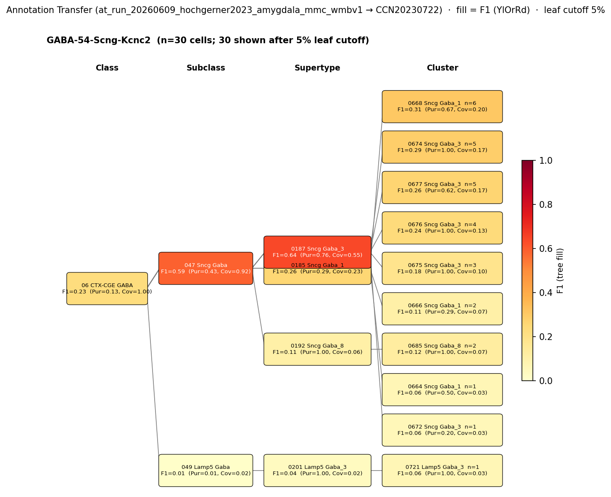

# Basolateral amygdala cholecystokinin basket cell — CCN20230722 Mapping Report
*2026-06-10 · Source: `kb/graphs/medial_temporal_lobe_amygdala/20260528_medial_temporal_lobe_amygdala_report_ingest.yaml`*

---

## Introduction

The basolateral amygdala cholecystokinin (CCK) basket cell is a GABAergic interneuron defined by co-expression of cholecystokinin and calbindin (Calb1), with perisomatic axon terminal targeting of principal cell bodies in the basolateral amygdala (BLA) [UBERON:0002887]. Establishing its transcriptomic identity within the Allen WMBv1 atlas (CCN20230722) is important for linking physiological and circuit-level studies in the amygdala to the growing body of single-cell genomic data, and for placing this cell type in a species-comparable reference taxonomy.

### Classical type properties

| Property | Value | References |
|---|---|---|
| Soma location | Basolateral amygdala [UBERON:0002887] | [1], [2] |
| Neurotransmitter | GABAergic | [1], [2] |
| Defining markers | Cck, Calb1 | [1], [2], [3], [4] |
| Negative markers | Pvalb | — |
| Neuropeptides | Cck | [1], [2] |

<details>
<summary>Details — source evidence for classical type properties</summary>

- **Soma location / NT / Defining markers / Neuropeptides:** literature review · McDonald et al. 2012 · [1]
  > The principal neurons in the CBL are pyramidal-like projection neurons with spiny dendrites that utilize glutamate as an excitatory neurotransmitter, whereas most non-pyramidal neurons in the CBL are spine-sparse interneurons that utilize GABA as an inhibitory neurotransmitter (McDonald, 1982)(McDonald, 1985)(McDonald, , 1992a(McDonald, ,b, 1996(McDonald, , 2003(Millhouse et al., 1983)(Fuller et al., 1987)(Carlsen et al., 1988)(McDonald et al., 1993). Dual-labeling immunohistochemical studies in the basolateral amygdala suggest that the CBL contains at least four distinct subpopulations of GABAergic non-pyramidal neurons that can be distinguished on the basis of their content of calcium-binding proteins and peptides. These subpopulations are: (1) PV+/CB+ neurons, (2) SOM+/CB+ neurons, (3) large multipolar cholecystokinin+ neurons that are often CB+, and (4) small bipolar and bitufted interneurons that exhibit extensive colocalization of calretinin, cholecystokinin, and vasoactive intestinal peptide (Kemppainen and Pitkänen, 2000;McDonald and Betette, 2001;Mascagni, 2001, 2002;
  > — McDonald et al. 2012, Basolateral amygdala neuronal subtypes · [1] <!-- quote_key: 11544073_ea8d2bb3 -->

- **Soma location / NT / Defining markers / Morphology / Neuropeptides:** cell-type proportion study · Vereczki et al. 2021 · [2]
  > we estimated that the following cell types together compose the vast majority of GABAergic cells in the LA and BA: axo-axonic cells (5.5%-6%), basket cells expressing parvalbumin (17%-20%) or cholecystokinin (7%-9%), dendrite-targeting inhibitory cells expressing somatostatin (10%-16%), NPY-containing neurogliaform cells (14%-15%), VIP and/or calretinin-expressing interneuron-selective interneurons (29%-38%), and GABAergic projection neurons expressing somatostatin and neuronal nitric oxide synthase (5.5%-8%). Our results show that these amygdalar nuclei contain all major GABAergic neuron types as found in other cortical regions.
  > — Vereczki et al. 2021, Basolateral amygdala neuronal subtypes · [2] <!-- quote_key: 232283078_d4238834 -->

- **Cck defining marker:** electrophysiology + morphology study · Woodruff & Sah 2007 · [3]
  > Four populations of interneurons have been described in the BLA: those expressing parvalbumin (McDonald, 1992;Mc-Donald and Betette, 2001), those expressing somatostatin (Mc-Donald and Mascagni, 2002), those expressing cholecystokinin
  > — Woodruff & Sah 2007, Basolateral amygdala neuronal subtypes · [3] <!-- quote_key: 161407_eb8bfaf0 -->

- **CCK+/CB1+ identity confirmation:** electrophysiology + immunohistochemistry · Vereczki et al. 2021 · [2]
  > the vast majority of GFP-expressing interneurons was CCK+/CB1+ basket cell (71.1 %, n = 38 recorded green neurons) as these interneurons had axon terminals immunoreactive for CB1
  > — Vereczki et al. 2021, CCK+/CB1+ basket cells · [2] <!-- quote_key: 232283078_6d9c6756 -->

</details>

### Cell Ontology mapping

Cell Ontology mapping: basket cell [[CL:0000118](https://www.ebi.ac.uk/ols4/ontologies/cl/classes?obo_id=CL:0000118)] (BROAD).

---

## Results

One candidate atlas cluster was assessed; 0664 Sncg Gaba_1 [CS20230722_CLUS_0664] in the Sncg Gaba_1 supertype (CS20230722_SUPT_0185) is the nominated mapping at LOW confidence.

### Annotation transfer overview



*F1 across taxonomy levels for the Hochgerner 2023 source group GABA-54-Scng-Kcnc2 (n=70 cells; 56 retained after filter) relevant to the Basolateral amygdala cholecystokinin basket cell. Each panel row is a source-cell group; nodes are coloured by F1 with **Purity** (Pur) and **Coverage** (Cov) shown inline. Coverage = fraction of source-group cells landing on this target; Purity = fraction of this target's cells coming from the source group. With a single source group in the figure, Purity differentiates among candidate targets; Coverage discriminates how cleanly the source lands. F1 ≥ 0.5 at a level indicates a clean mapping at that resolution.*

AT was performed with MapMyCells (cell_type_mapper v1.7.1) mapping Hochgerner 2023 amygdala naive cells (ArrayExpress:E-MTAB-12096) to WMBv1. The source cluster GABA-54-Scng-Kcnc2 maps to the Sncg Gaba subclass (047 Sncg Gaba, CS20230722_SUBC_047) with SUBCLASS-level F1=0.59 (Purity=0.43, Coverage=0.92), indicating a clean assignment at subclass resolution. SUPERTYPE-level F1 drops to 0.26 for the 0185 Sncg Gaba_1 supertype, and CLUSTER-level F1 for 0664 Sncg Gaba_1 [CS20230722_CLUS_0664] is 0.06, consistent with dispersal of source cells across multiple Sncg Gaba_1 child clusters.

### Candidate overview

| Rank | WMBv1 cluster | Supertype | Cells (10x) | Confidence | Key property alignment | Verdict |
|---|---|---|---|---|---|---|
| 1 | 0664 Sncg Gaba_1 [CS20230722_CLUS_0664] | 0185 Sncg Gaba_1 | 179 | 🔴 LOW | Cck CONSISTENT · AT SUBCLASS F1=0.59 | Speculative — 1:5 cluster dispersal |

1 edge assessed; relationship type `skos:closeMatch`.

### 0664 Sncg Gaba_1 · 🔴 LOW

#### Property comparison — 0664 Sncg Gaba_1 [CS20230722_CLUS_0664]

| Property | Classical | Supertype | Best cluster | Alignment |
|---|---|---|---|---|
| Soma location | Basolateral amygdala [UBERON:0002887] | MBA:295 BLA present; region_fraction 0.031 | MBA:295 BLA present; region_fraction 0.031 | CONSISTENT |
| NT type | GABAergic | GABA | GABA | CONSISTENT |
| Cck (neuropeptide) | Cck — neuropeptide | Cck precomputed mean 11.15 (98.3rd pct; tier 2). Sncg supertype = canonical CCK co-expression | Cck precomputed mean 11.15 (98.3rd pct; tier 2). Sncg supertype = canonical CCK co-expression | CONSISTENT |
| Pvalb (negative marker) | Pvalb — negative marker | NOT_ASSESSED — Sncg lineage is circumstantially consistent with Pvalb-negativity | not assessed | NOT_ASSESSED |

#### Evidence support — 0664 Sncg Gaba_1 [CS20230722_CLUS_0664]

| Evidence | Type | Supports | Headline | Source |
|---|---|---|---|---|
| Vereczki et al. 2021 CCK+/CB1+ basket cells | Literature | SUPPORT | 71.1% of CCK+ interneurons confirmed CCK+/CB1+ basket cells | [2] |
| Atlas precomputed expression (Sncg Gaba_1) | Atlas metadata | SUPPORT | Cnr1 mean 12.36 (98.5th pct), Cck mean 11.15 (98.3rd pct) — both tier-2 reliable | atlas-internal |
| Hochgerner 2023 MapMyCells AT | Annotation transfer | PARTIAL | F1=0.59 at SUBCLASS (047 Sncg Gaba); CLUSTER F1=0.06 | atlas-internal |

*(Child-cluster breakdown not assessed — see proposed experiments. Five Sncg Gaba_1 clusters score equally on Cnr1+Cck; 0664 Sncg Gaba_1 [CS20230722_CLUS_0664] is the nominal match but is not distinguished from its siblings by available evidence.)*

**Supporting evidence:**

- **Cck/Cnr1 atlas expression:** 0664 Sncg Gaba_1 [CS20230722_CLUS_0664] belongs to the Sncg Gaba_1 supertype (CS20230722_SUPT_0185), characterised by canonical CCK co-expression (Cck precomputed mean 11.15, 98.3rd percentile; Cnr1 mean 12.36, 98.5th percentile — both tier-2 reliable in WMBv1). This aligns with the classical CCK basket cell's defining neuropeptide and with CB1 (encoded by *Cnr1*) co-expression, a hallmark of CCK basket cells [atlas-internal].

- **Literature confirmation:** Vereczki et al. 2021 established that 71.1% of CCK+ interneurons in the mouse lateral and basal amygdala are CCK+/CB1+ basket cells (n=38 recorded neurons), confirmed by axon terminal CB1 immunoreactivity [2].

  > the vast majority of GFP-expressing interneurons was CCK+/CB1+ basket cell (71.1 %, n = 38 recorded green neurons) as these interneurons had axon terminals immunoreactive for CB1
  > — Vereczki et al. 2021, CCK+/CB1+ basket cells · [2] <!-- quote_key: 232283078_6d9c6756 -->

- **Annotation transfer (partial):** The Hochgerner 2023 source cluster GABA-54-Scng-Kcnc2 maps to the Sncg Gaba subclass with SUBCLASS-level F1=0.59 (Purity=0.43, Coverage=0.92) — a clean assignment at subclass resolution. At SUPERTYPE level, F1 drops to 0.26 for the 0185 Sncg Gaba_1 supertype, and CLUSTER-level F1 for 0664 Sncg Gaba_1 [CS20230722_CLUS_0664] is 0.06. AT is therefore PARTIAL: it confirms Sncg Gaba subclass identity for the source cluster but cannot resolve which specific Sncg Gaba_1 cluster corresponds to the classical CCK basket cell.

- **NT type:** Both classical and atlas sides are GABAergic / GABA — CONSISTENT [1], [2].

- **Soma location:** region_fraction for 0664 Sncg Gaba_1 [CS20230722_CLUS_0664] in BLA (MBA:295) is 0.031, confirming BLA presence. The low fraction reflects that the Sncg Gaba_1 supertype is distributed broadly across cortical regions rather than being BLA-specific. BLA presence is CONSISTENT with the classical type's location [1], [2].

**Marker evidence provenance:**

- **Cck:** Defined as both a defining marker and a neuropeptide by immunohistochemical and electrophysiological studies in mouse BLA [1], [2], [3], [4]. Atlas precomputed expression confirms robust Cck transcript expression at the cluster level (mean 11.15, 98.3rd percentile). Evidence is protein-level (IHC) and transcript-level (scRNA-seq atlas); cell-type specificity is confirmed in [2] by electrophysiology plus CB1 immunoreactivity on axon terminals. Evidence chain is solid.

- **Calb1:** Listed as a defining marker in [1], [2], [3] based on immunohistochemistry. No precomputed expression comparison for Calb1 is present in the facts file — no `marker_Calb1` property comparison row exists for this edge. This is a gap; direct expression confirmation at the cluster level is not available from current evidence. A query of WMBv1 precomputed expression for Calb1 in the 0185 Sncg Gaba_1 supertype / 0664 Sncg Gaba_1 [CS20230722_CLUS_0664] would resolve this.

- **Pvalb (negative marker):** Listed without a dedicated primary citation establishing Pvalb-negativity specifically for BLA CCK basket cells. Pvalb-negativity is inferred from the Sncg lineage identity (Sncg and Pvalb interneurons are transcriptionally distinct families in WMBv1), but this is NOT_ASSESSED in the property comparison — no quantitative Pvalb expression check for 0664 Sncg Gaba_1 [CS20230722_CLUS_0664] is in the facts file. Should be confirmed if Pvalb is used as an exclusion criterion.

**Concerns:**

- **Cluster dispersal (DISTRIBUTED_ACROSS_CLUSTERS):** Five Sncg Gaba_1 clusters (including 0664 Sncg Gaba_1 [CS20230722_CLUS_0664] and siblings) score equally on the Cnr1+Cck criterion. The nomination of CS20230722_CLUS_0664 specifically is not supported by unique distinguishing properties — it is one of five equally plausible candidates within the Sncg Gaba_1 supertype. This is the primary reason for LOW confidence.

- **Low cluster-level AT F1:** CLUSTER-level F1 for 0664 Sncg Gaba_1 [CS20230722_CLUS_0664] is 0.06, meaning the Hochgerner GABA-54-Scng-Kcnc2 source cluster disperses broadly across the Sncg Gaba lineage rather than concentrating on CS20230722_CLUS_0664. This reinforces the 1:N ambiguity at cluster resolution.

- **Low BLA region_fraction:** region_fraction = 0.031 is low. The Sncg Gaba_1 supertype is not BLA-enriched per WMBv1 spatial data; BLA cells likely represent a minor regional component of a broader cortical population.

- **Calb1 not confirmed at cluster level:** The Calb1 co-expression criterion is not directly verified against 0664 Sncg Gaba_1 [CS20230722_CLUS_0664] precomputed expression (see marker provenance above).

**What would upgrade confidence:**

- **MapMyCells AT on CCK basket cell-enriched transcriptomes** (e.g. from a CCK-Cre or CCK-GFP reporter line validated for BLA CCK basket cell identity, naive conditions), targeting CLUSTER-level F1 ≥ 0.50. This would distinguish which of the five Sncg Gaba_1 sibling clusters best matches the classical type. Would add `AnnotationTransferEvidence` and could elevate to MODERATE or HIGH.
- **Calb1 precomputed expression query** against the 0185 Sncg Gaba_1 supertype and 0664 Sncg Gaba_1 [CS20230722_CLUS_0664] from the WMBv1 taxonomy reference DB to fill the missing `marker_Calb1` property comparison.
- **Pvalb expression query** against 0664 Sncg Gaba_1 [CS20230722_CLUS_0664] to confirm the negative marker is below MIN_DETECTABLE threshold, converting NOT_ASSESSED to CONSISTENT.
- **BLA-enriched cluster identification:** Query WMBv1 for which Sncg Gaba_1 child cluster has the highest BLA (MBA:295) region_fraction to provide a principled basis for cluster nomination.

---

### Methods

<details>
<summary>Data sources, analyses, and reproducibility receipts</summary>

**Classical type definition.** The Basolateral amygdala cholecystokinin basket cell is defined on a CLASSICAL basis (morpho-electrophysiological convergence with immunohistochemical marker confirmation). Defining markers are Cck and Calb1 [1], [2], [3], [4]; NT type is GABAergic [1], [2]; soma location is basolateral amygdala [UBERON:0002887] [1], [2]. Negative marker: Pvalb. CCK basket cells comprise an estimated 7–9% of all GABAergic neurons in mouse LA/BA [2]. The node note records that "large multipolar CCK+/CB+ neurons (McDonald et al. 2012) and CCK basket cells (Vereczki et al. 2021) may represent overlapping or distinct populations" — this remains an open question.

**Atlas mapping query.** Candidate atlas clusters were retrieved from the CCN20230722 taxonomy at ranks 0 (cluster) and 1 (supertype) using metadata-based scoring (region match, NT type, defining markers, sex bias when applicable). Full scoring rules: `workflows/map-cell-type.md`.

**Property alignment.** Each defining property of the classical type was compared to the corresponding atlas-side value via the `property_comparisons` schema, with alignments graded CONSISTENT / APPROXIMATE / DISCORDANT / NOT_ASSESSED. Atlas-side numerical values came from precomputed expression on the cluster (cluster.yaml in the taxonomy reference store) and from MERFISH spatial registration for soma location.

**Annotation transfer.** MapMyCells local run mapping Hochgerner 2023 naive amygdala cells to WMBv1.

| Field | Value |
|---|---|
| Source dataset | ArrayExpress:E-MTAB-12096 (GABA-54-Scng-Kcnc2) |
| Source species | NCBITaxon:10090 (Mus musculus) |
| Target atlas | WMBv1 (CCN20230722; SHA-256: b21ca985) |
| Method | MapMyCells local (cell_type_mapper v1.7.1, default parameters, raw normalization, 100 bootstrap iterations) |
| Tool version | cell_type_mapper v1.7.1 |
| Bootstrap threshold | 0.7 |
| n cells | 55514 total (7777 after filter to naive neuronal cells) |
| Run record | [`kb/annotation_transfer_runs/at_run_20260609_hochgerner2023_amygdala_mmc_wmbv1/manifest.yaml`](../../kb/annotation_transfer_runs/at_run_20260609_hochgerner2023_amygdala_mmc_wmbv1/manifest.yaml) |
| Script (external) | README.md |
| Code reference | [https://github.com/AllenInstitute/cell_type_mapper](https://github.com/AllenInstitute/cell_type_mapper) |
| F1 matrix | `../../../../research/medial_temporal_lobe_amygdala/annotation_transfer/hochgerner2023_amygdala/mapping_result.csv` |
| Caveats | Source labels are transcriptomically-defined types; matching to KB classical nodes requires a mapping step. Fear-conditioned cells excluded. Non-neuronal cells excluded. Gene symbols used. |

**Atlas data sources.** Precomputed expression values are embedded in property_comparisons from the WMBv1 taxonomy reference store (CCN20230722).

**Anti-hallucination.** All citations, atlas accessions, ontology CURIEs, and verbatim literature quotes in this report are validated against the evidencell knowledge base at write time. Authored-prose evidence narratives are validated against their source `evidence_items[*].explanation` fields. The pre-write hook rejects any unresolvable identifier or unattributed blockquote. Specific mapping limitations and caveats are documented per-candidate in the Discussion section.

**Evidence base**

| Edge ID | Evidence types | Supports | Source |
|---|---|---|---|
| edge_bla_cck_basket_cell_to_cs20230722_clus_0664 | LITERATURE; ATLAS_METADATA; ANNOTATION_TRANSFER | SUPPORT; SUPPORT; PARTIAL | [2]; atlas-internal; atlas-internal |

*Generated by evidencell `9d82411` at 2026-06-10T12:49:05+00:00 from [kb/graphs/medial_temporal_lobe_amygdala/20260528_medial_temporal_lobe_amygdala_report_ingest.yaml](kb/graphs/medial_temporal_lobe_amygdala/20260528_medial_temporal_lobe_amygdala_report_ingest.yaml).*

</details>

---

## Discussion

### Best candidate + caveats summary

**Primary mapping:** Basolateral amygdala cholecystokinin basket cell → 0664 Sncg Gaba_1 [CS20230722_CLUS_0664] at LOW confidence. Key support: atlas Cck/Cnr1 precomputed expression consistent with CCK basket cell identity (tier-2 reliable at 98.3rd pct), and MapMyCells AT confirming Sncg Gaba subclass assignment at F1=0.59. Key caveats: CLUSTER-level AT F1 is 0.06 (dispersal across 5 sibling Sncg Gaba_1 clusters); BLA region_fraction is low (0.031); Calb1 and Pvalb comparisons not confirmed at cluster level.

The Cell Ontology has no specific term for this population; basket cell [[CL:0000118](https://www.ebi.ac.uk/ols4/ontologies/cl/classes?obo_id=CL:0000118)] is the closest ancestor. Auto-proposed by asta-report-ingest; requires expert review.

### Pool-candidate note (bla_cck_basket_cell / bla_vip_calretinin_interneuron — Case B)

The pool-candidate pre-pass identified that `bla_cck_basket_cell` and `bla_vip_calretinin_interneuron` share identical AT metrics at CLASS level only (06 CTX-CGE GABA, CS20230722_CLAS_06: F1=0.23, Coverage=1.0, Purity=0.13 for both). This CLASS-level overlap is uninformative — all CGE-derived GABAergic types converge to the same class, and Coverage=1.0 for both merely reflects that both source types map entirely within class 06. The panels assessed are anatomy and NT only; neither distinguishing nor non-distinguishing at this resolution is meaningful.

The two types are anatomically and molecularly distinct by the available literature: CCK basket cells are Cck+/Calb1+/CB1+ with perisomatic axon terminal targeting, while VIP/calretinin interneurons are VIP+/Calretinin+ bipolar/bitufted interneuron-selective cells [1], [2]. No cross-panel evidence (markers, ephys, morphology, development) supports indistinguishability. **Applying Case B (AT-only CLASS-level overlap; marker/ephys/morphology panels not assessed at the granularity needed):** no `lit_to_lit_edges` entry is emitted. The two classical nodes remain distinct.

### Proposed experiments and follow-ups

**MapMyCells AT on BLA CCK basket cell transcriptomes** — the canonical next step.
- **What:** MapMyCells (cell_type_mapper) with BLA CCK basket cell source transcriptomes, ideally from a CCK-Cre or CCK-GFP reporter mouse line, enriched for BLA cells, naive conditions.
- **Target:** CLUSTER-level F1 ≥ 0.50 to confidently nominate a single Sncg Gaba_1 cluster.
- **Expected output:** `AnnotationTransferEvidence` on edge_bla_cck_basket_cell_to_cs20230722_clus_0664 (or a revised edge if the best-matching cluster changes).
- **Resolves:** cluster dispersal caveat and LOW confidence; would likely elevate to MODERATE or HIGH.
- **Note:** The existing Hochgerner 2023 GABA-54-Scng-Kcnc2 AT run has confirmed SUBCLASS assignment but cannot resolve the cluster nomination. A higher-specificity source dataset (CCK-Cre-validated cells) is the priority.

**Calb1 and Pvalb expression queries:**
- **What:** Query WMBv1 taxonomy reference DB for Calb1 and Pvalb precomputed expression in the 0185 Sncg Gaba_1 supertype and all child clusters.
- **Expected output:** Populated `marker_Calb1` and `negative_marker_Pvalb` property comparison rows.
- **Resolves:** Calb1 NOT_ASSESSED and Pvalb NOT_ASSESSED gaps; low-effort desk task using `query-taxonomy-db`.

**BLA-enriched cluster identification:**
- **What:** Run `just find-candidates` with region filter MBA:295 and NT=GABAergic at rank 0 to find which Sncg Gaba_1 child cluster has the highest BLA region_fraction.
- **Expected output:** Updated candidate nomination in the edge YAML if a different cluster ranks higher than CS20230722_CLUS_0664.
- **Resolves:** "Which Sncg Gaba_1 sibling is most BLA-enriched?" open question.

### Open questions

1. Which Sncg Gaba_1 sibling cluster has the highest BLA (MBA:295) region_fraction — is CS20230722_CLUS_0664 the most BLA-enriched, or should a different cluster be nominated? (from edge_bla_cck_basket_cell_to_cs20230722_clus_0664)
2. Which Sncg Gaba_1 sibling cluster is the most BLA-enriched once targeted AT evidence is available? (from edge_bla_cck_basket_cell_to_cs20230722_clus_0664)
3. Do `bla_cck_basket_cell` and `bla_cck_cb1_basket_cell` represent overlapping populations that should be merged at the KB level? This question should be resolved before investing in new AT experiments. (from edge_bla_cck_basket_cell_to_cs20230722_clus_0664)

---

## References

| # | Citation | PMID | Used for |
|---|---|---|---|
| [1] | McDonald et al. 2012 | [22837739](https://pubmed.ncbi.nlm.nih.gov/22837739/) | Soma location, NT type, defining markers, neuropeptides, morphology |
| [2] | Vereczki et al. 2021 | [33837051](https://pubmed.ncbi.nlm.nih.gov/33837051/) | Soma location, NT type, CCK+/CB1+ basket cell identity confirmation, proportion estimates |
| [3] | Woodruff & Sah 2007 | [17234587](https://pubmed.ncbi.nlm.nih.gov/17234587/) | Cck defining marker |
| [4] | Totty et al. 2024 | [39463931](https://pubmed.ncbi.nlm.nih.gov/39463931/) | Cck defining marker |

---

<!-- verdict-block-start: edge_bla_cck_basket_cell_to_cs20230722_clus_0664 -->
```yaml
verdict:
  confidence: LOW
  confidence_score: 0.25
  rationale: >
    Sncg Gaba subclass confirmed by MapMyCells AT (F1=0.59 at SUBCLASS level in
    `at_run_20260609_hochgerner2023_amygdala_mmc_wmbv1`); neuropeptide_Cck CONSISTENT
    (precomputed mean 11.15, 98.3rd pct, tier-2 reliable). 1 of 2 markers CONSISTENT
    (neuropeptide_Cck CONSISTENT; negative_marker_Pvalb NOT_ASSESSED). CLUSTER-level
    F1=0.06 reflects dispersal across 5 Sncg Gaba_1 sibling clusters;
    CS20230722_CLUS_0664 nomination is speculative pending targeted AT.
    region_fraction=0.031 confirms BLA presence (SELF evidence, boundary-low).
  reconciliation_note: >
    CLASS-level AT overlap with bla_vip_calretinin_interneuron (06 CTX-CGE GABA class
    F1=0.23 for both source groups); panels assessed: anat and nt only (Case B —
    insufficient evidence for indistinguishability call; CCK basket cells and VIP/CR
    interneurons are molecularly distinct by marker profile).
  unresolved_questions:
    - "Which Sncg Gaba_1 sibling cluster has the highest BLA (MBA:295) region_fraction?"
    - "Do bla_cck_basket_cell and bla_cck_cb1_basket_cell represent overlapping populations that should be merged?"
```
<!-- verdict-block-end -->
