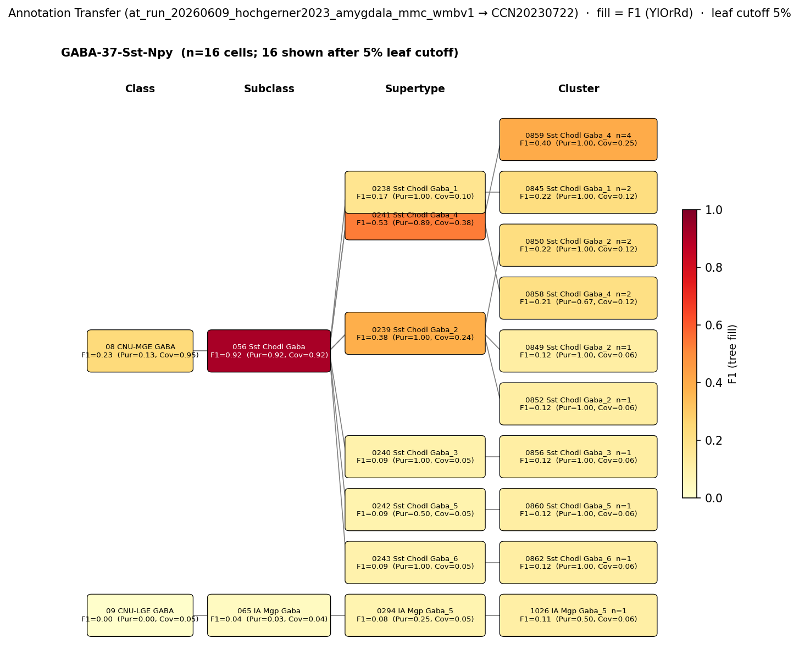

# Basolateral amygdala GABAergic projection neuron (SST/nNOS) — CCN20230722 Mapping Report
*2026-06-10 · Source: `kb/graphs/medial_temporal_lobe_amygdala/20260528_medial_temporal_lobe_amygdala_report_ingest.yaml`*

---

## Introduction

The basolateral amygdala (BLA) harbours a rare but well-characterised population of GABAergic projection neurons co-expressing somatostatin (SST) and neuronal nitric oxide synthase (nNOS). Unlike the majority of BLA GABAergic cells, which are local interneurons, these neurons send long-range axons to extra-amygdalar targets, placing them at the intersection of inhibitory interneuron identity and projection neuron function. Mapping this type to a transcriptomic atlas cluster is important for understanding how a classically defined population — described by protein co-expression and axon morphology — corresponds to molecularly defined cell classes in WMBv1.

### Classical type description

| Property | Value | References |
|---|---|---|
| Soma location | Basolateral amygdala [UBERON:0002887] | [1], [2] |
| Neurotransmitter | GABAergic | [3], [1] |
| Defining markers | Sst, Nos1 | [1] |
| Negative markers | Pvalb | — |
| Neuropeptides | Sst | [1] |

<details>
<summary>### Details — source evidence for classical type properties</summary>

- **Soma location / Cell-type census (Vereczki 2021):** Stereological counting and IHC co-labelling · mouse lateral and basal amygdala · [1]
  > we estimated that the following cell types together compose the vast majority of GABAergic cells in the LA and BA: axo-axonic cells (5.5%-6%), basket cells expressing parvalbumin (17%-20%) or cholecystokinin (7%-9%), dendrite-targeting inhibitory cells expressing somatostatin (10%-16%), NPY-containing neurogliaform cells (14%-15%), VIP and/or calretinin-expressing interneuron-selective interneurons (29%-38%), and GABAergic projection neurons expressing somatostatin and neuronal nitric oxide synthase (5.5%-8%). Our results show that these amygdalar nuclei contain all major GABAergic neuron types as found in other cortical regions.
  > — Vereczki et al. 2021, Basolateral amygdala neuronal subtypes · [1] <!-- quote_key: 232283078_d4238834 -->

- **Soma location / Long-range projecting SOM+ cells (McDonald 2012):** Retrograde tracing (Fluoro-Gold) + immunohistochemistry · mouse BLA · [2]
  > a subpopulation of non-pyramidal SOM+ neurons, termed 'long-range non-pyramidal neurons' (LRNP neurons), in the external capsule, basolateral amygdala, and cortical and medial amygdalar nuclei were FG+
  > — McDonald et al. 2012, abstract · [2] <!-- quote_key: 11544073_bef58c1f -->

- **Neurotransmitter type / Long-range GABAergic projections (McDonald & Mott 2016):** Review of tract tracing and electrophysiology · mouse and rat · [3]
  > The amygdalar nuclear complex and hippocampal/parahippocampal region are key components of the limbic system that play a critical role in emotional learning and memory. This Review discusses what is currently known about the neuroanatomy and neurotransmitters involved in amygdalo‐hippocampal interconnections, their functional roles in learning and memory, and their involvement in mnemonic dysfunctions associated with neuropsychiatric and neurological diseases. Tract tracing studies have shown that the interconnections between discrete amygdalar nuclei and distinct layers of individual hippocampal/parahippocampal regions are robust and complex. Although it is well established that glutamatergic pyramidal cells in the amygdala and hippocampal region are the major players mediating interconnections between these regions, recent studies suggest that long‐range GABAergic projection neurons are also involved. Whereas neuroanatomical studies indicate that the amygdala only has direct interconnections with the ventral hippocampal region, electrophysiological studies and behavioral studies investigating fear conditioning and extinction, as well as amygdalar modulation of hippocampal‐dependent mnemonic functions, suggest that the amygdala interacts with dorsal hippocampal regions via relays in the parahippocampal cortices. Possible pathways for these indirect interconnections, based on evidence from previous tract tracing studies, are discussed in this Review. Finally, memory disorders associated with dysfunction or damage to the amygdala, hippocampal region, and/or their interconnections are discussed in relation to Alzheimer's disease, posttraumatic stress disorder (PTSD), and temporal lobe epilepsy. © 2016 Wiley Periodicals, Inc.
  > — McDonald & Mott 2016, Amygdala organization and principal cellular classes · [3] <!-- quote_key: 3460849_57002ff6 -->

</details>

### Cell Ontology mapping

No Cell Ontology term currently covers this type — candidate for a new CL term.

---

## Results

One candidate atlas cluster was assessed; 0850 Sst Chodl Gaba_2 [CS20230722_CLUS_0850] within the Sst Chodl Gaba supertype family is the primary mapping at LOW confidence owing to 1:n cardinality across three equally scoring clusters.



*F1 across taxonomy levels for the GABA-37-Sst-Npy source group relevant to the Basolateral amygdala GABAergic projection neuron (SST/nNOS). The panel row is the Hochgerner 2023 source-cell group GABA-37-Sst-Npy (n=22 naive cells from ArrayExpress:E-MTAB-12096); nodes are coloured by F1 with **Purity** (Pur) and **Coverage** (Cov) shown inline. Coverage = fraction of source-group cells landing on this target; Purity = fraction of this target's cells coming from the source group. With a single source group, F1 peaks at SUBCLASS (F1=0.92, Pur=0.92, Cov=0.92) and degrades at SUPERTYPE (best F1=0.38) and CLUSTER (best F1=0.22). F1 ≥ 0.5 at a level indicates a clean mapping at that resolution. The strong SUBCLASS signal is consistent with the classical Sst/Nos1 marker profile but does not discriminate between the four Sst Chodl supertypes or the nine or more Sst Chodl clusters.*

The strong SUBCLASS-level F1 of 0.92 confirms that the Hochgerner GABA-37-Sst-Npy type maps cleanly within the Sst Chodl Gaba subclass of WMBv1, but the signal disperses across multiple supertypes and clusters below that level, precluding a clean 1:1 cluster assignment.

### Mapping candidates table

#### 4a. Candidate overview table

| Rank | WMBv1 cluster | Supertype | Cells (10x) | Confidence | Key property alignment | Verdict |
|---|---|---|---|---|---|---|
| 1 | 0850 Sst Chodl Gaba_2 [CS20230722_CLUS_0850] | 0239 Sst Chodl Gaba_2 | 407 | 🔴 LOW | Sst CONSISTENT · Nos1 CONSISTENT · neg-Pvalb CONSISTENT | broadMatch; 1:n across Sst Chodl clusters |

*1 edge assessed (LOW). Relationship type: skos:broadMatch.*

#### 4b. Property alignment table — 0850 Sst Chodl Gaba_2 [CS20230722_CLUS_0850]

**Table 1 — Property comparison**

| Property | Classical | Supertype | Best cluster | Alignment |
|---|---|---|---|---|
| Soma location | Basolateral amygdala [UBERON:0002887] | MBA:295 BLA present | MBA:295 BLA present; region_fraction 0.035 | CONSISTENT |
| NT type | GABAergic | GABA | GABA | CONSISTENT |
| Sst expression | Defining marker | not available | Sst precomputed mean 12.23 (99.6th pct; tier 2) | CONSISTENT |
| Nos1 expression | Defining marker (nNOS) | not available | Nos1 precomputed mean 12.1 (tier 2) | CONSISTENT |
| Pvalb (negative) | Negative marker | not available | Pvalb val 0.0 (0th pct; effectively absent) | CONSISTENT |
| Sex ratio | Not documented | not available | not assessed | NOT_ASSESSED |

**Table 2 — Evidence support**

| Evidence | Type | Supports | Headline | Source |
|---|---|---|---|---|
| Vereczki 2021 cell-type census | Literature | SUPPORT | SST+/nNOS+ GABAergic projection neurons estimated at 5.5–8% of BLA GABAergic cells; long-range projecting | [1] |
| Atlas metadata — Sst Chodl cluster | Atlas metadata | SUPPORT | CLUS_0850: Sst 99.6th pct, Nos1 tier-2, Pvalb 0.0 — all three property comparisons CONSISTENT; score 6 in BLA GABAergic cohort of 5 | atlas-internal |
| MapMyCells AT (Hochgerner 2023) | Annotation transfer | SUPPORT | Best F1=0.92 at SUBCLASS (056 Sst Chodl Gaba); cluster-level F1=0.22 | atlas-internal |

*(Child-cluster breakdown partially assessed via AT: the GABA-37-Sst-Npy source signal is distributed across at least nine Sst Chodl clusters at rank 0, with 0850 Sst Chodl Gaba_2 [CS20230722_CLUS_0850] achieving the highest cluster-level F1=0.22. Three clusters — 0850 Sst Chodl Gaba_2 [CS20230722_CLUS_0850], 0858 Sst Chodl Gaba_4, and 0860 Sst Chodl Gaba_5 — score identically (6/6) on the Sst+Nos1 metadata panel; no discriminating property has been identified.)*

---

### 0850 Sst Chodl Gaba_2 [CS20230722_CLUS_0850] · 🔴 LOW

**Supporting evidence:**

- **Literature (cell-type census):** Vereczki et al. 2021 [1] directly estimated that GABAergic projection neurons co-expressing somatostatin and neuronal nitric oxide synthase account for 5.5–8% of GABAergic cells in the mouse lateral and basal amygdala. This study employed stereological counting and immunohistochemistry co-labelling (protein-level) in mouse BLA. Cell-type identity was confirmed by co-labelling SST and nNOS within the same cells, and the population was distinguished from other SST+ interneurons by the absence of Pvalb and the presence of long-range axons. This is the primary definition source for the classical node.

- **Retrograde tracing evidence:** McDonald et al. 2012 [2] used Fluoro-Gold retrograde tracing (immunohistochemistry, protein-level) to demonstrate that a subpopulation of non-pyramidal SOM+ neurons in the BLA send long-range projections to the basal forebrain, establishing the projection neuron identity and soma location of this population.

- **Atlas metadata:** 0850 Sst Chodl Gaba_2 [CS20230722_CLUS_0850] belongs to the Sst Chodl Gaba family, the canonical Sst+/Nos1+ long-range projecting interneuron class in WMBv1. Precomputed expression: Sst mean 12.23 (99.6th percentile in BLA GABAergic cohort of 5), Nos1 mean 12.1 (tier 2), Pvalb = 0.0 (0th percentile). All three marker assessments are CONSISTENT with the classical definition. Stage A discovery scored this cluster 6/6; Sst contributed applied_score 2.0 (cohort-pct 0.996 of 5), Nos1 contributed applied_score 2.0 (cohort-pct 0.996 of 5), and Pvalb absence contributed +1. Stage A discovery score of 6 was tied across three Sst Chodl clusters — the cohort is small (n=5) and next_best_score = 6, so no dominance signal.

- **Annotation transfer (MapMyCells):** The MapMyCells run (`at_run_20260609_hochgerner2023_amygdala_mmc_wmbv1`) mapped Hochgerner 2023 source type GABA-37-Sst-Npy (22 naive cells, ArrayExpress:E-MTAB-12096, fear-conditioning-excluded) to WMBv1. The SUBCLASS mapping to the Sst Chodl Gaba subclass achieved F1=0.92 (Purity=0.92, Coverage=0.92, 22 cells mapped), confirming that this Hochgerner Sst+/Npy+ type maps cleanly within the Sst Chodl Gaba subclass. At the SUPERTYPE level, the best target was 0239 Sst Chodl Gaba_2 (F1=0.38, Purity=1.0, Coverage=0.238, n=5 cells). At CLUSTER level, 0850 Sst Chodl Gaba_2 [CS20230722_CLUS_0850] achieved F1=0.22 (Purity=1.0, Coverage=0.125, 2 cells mapped).

**Marker evidence provenance:**

- **Sst:** Evidence is from Vereczki et al. 2021 [1] using immunohistochemistry (protein-level) in mouse BLA. Cell-type identity was confirmed by co-labelling SST with nNOS and morphological examination. The atlas-side value (Sst mean 12.23 at 99.6th percentile) strongly confirms transcript-level presence; protein and transcript evidence are convergent.

- **Nos1 (nNOS):** Evidence is from Vereczki et al. 2021 [1] via immunohistochemistry (protein-level). Atlas-side Nos1 is tier 2 (mean 12.1), consistent with the canonical Sst Chodl family identity. No protein/transcript discrepancy flagged.

- **Pvalb (negative marker):** Negative marker status is inherent in the classical definition. No dedicated primary citation is provided on the KB node for this negative marker, but the atlas confirmation (Pvalb = 0.0, 0th percentile) provides a strong independent check.

**Concerns:**

- **DISTRIBUTED_ACROSS_CLUSTERS (1:n cardinality):** Three Sst Chodl clusters — 0850 Sst Chodl Gaba_2 [CS20230722_CLUS_0850], 0858 Sst Chodl Gaba_4, and 0860 Sst Chodl Gaba_5 — score identically (6/6) on the Sst/Nos1/Pvalb marker panel. No discriminating property has been identified to select a single best cluster. The `skos:broadMatch` predicate reflects this 1:n cardinality. The AT result reinforces the problem: at CLUSTER level, the source signal is distributed across at least nine Sst Chodl clusters, with no single cluster achieving majority coverage.

- **AT supertype scatter:** At SUPERTYPE level, the best AT mapping is to 0239 Sst Chodl Gaba_2 (F1=0.38, Purity=1.0, Coverage=0.238, n=5 cells), which is the same supertype as the assigned cluster. Despite being the best supertype hit, the F1 remains below 0.5, indicating the source signal is distributed across multiple supertypes. The classical type may span or partially overlap multiple Sst Chodl supertypes rather than being concentrated in one.

- **Low cell count in source AT:** Only 22 naive GABA-37-Sst-Npy cells were available. At CLUSTER level, the maximum coverage for any single cluster is 12.5% (2 cells on 0850 Sst Chodl Gaba_2 [CS20230722_CLUS_0850], F1=0.22). This is insufficient to discriminate between closely related clusters.

- **Source label mismatch (Npy vs. nNOS):** The Hochgerner 2023 source type is labelled GABA-37-Sst-Npy (Sst+/Npy+), whereas the classical definition specifies SST+/nNOS+ co-expression. The nNOS characterisation is not directly reflected in the source label. The correspondence to the SST/nNOS projection class depends on co-expression of Npy and Nos1 in this source dataset, which is not independently verified in the current evidence set. *(note: in some cortical contexts, Sst+/Nos1+ cells also express Npy, making the Hochgerner label a plausible but unverified proxy.)*

- **region_fraction = 0.035:** Only 3.5% of 0850 Sst Chodl Gaba_2 [CS20230722_CLUS_0850] cells are in MBA:295 (BLA). While BLA is present and the property comparison is CONSISTENT, the low region_fraction reflects the atlas-wide distribution of the Sst Chodl type — a known long-range projecting population distributed across many CNS regions. This is a biological feature rather than a mapping failure; the region_fraction is below the 0.3 boundary band and does not drive the predicate choice.

**What would upgrade confidence:**

1. **Retrograde tracing + scRNA-seq or ISH intersectional labelling:** Confirm that BLA Sst+/nNOS+ cells with verified long-range projections map specifically to one or more Sst Chodl clusters in WMBv1. Expected output: `LiteratureEvidence` or `AnnotationTransferEvidence` with direct morphology-to-transcriptome bridge. Would resolve the 1:n cardinality and narrow broadMatch to closeMatch (F1 ≥ 0.50 at CLUSTER, single target) or exactMatch (F1 ≥ 0.75 at CLUSTER). Resolves unresolved questions Q1 and Q2.

2. **Refined MapMyCells AT with nNOS-enriched source:** A source dataset of Nos1-Cre+ BLA neurons (e.g. from a published Nos1-Cre scRNA-seq experiment) mapped to WMBv1. Target: F1 ≥ 0.50 at CLUSTER level with a dominant single target. Expected output: `AnnotationTransferEvidence` discriminating between the three equally scored clusters. Resolves edge `edge_bla_gabaergic_projection_neuron_to_cs20230722_clus_0850`.

3. **Targeted literature search — Sst/nNOS BLA projection neurons:** A cite-traverse for "somatostatin nNOS long-range projection basolateral amygdala" may identify papers with transcriptomic or single-cell characterisation of nNOS+ BLA projectors. Expected output: `LiteratureEvidence` resolving Q3 (Npy/nNOS label discrepancy) and possibly identifying the specific Sst Chodl cluster.

---

### Methods

<details>
<summary>Data sources, analyses, and reproducibility receipts</summary>

**Classical type definition.** The Basolateral amygdala GABAergic projection neuron (SST/nNOS) is defined on a CLASSICAL evidence basis: soma location in the basolateral amygdala [UBERON:0002887] ([1][2]), GABAergic neurotransmitter identity ([3][1]), and co-expression of Sst and Nos1 (neuronal nitric oxide synthase) as defining markers ([1]). Pvalb is a negative marker (absent). Sst is also recorded as the primary neuropeptide ([1]). The classical node notes that this type is distinct from local SOM dendrite-targeting interneurons by virtue of the long-range projection axon and nNOS co-expression.

**Atlas mapping query.** Candidate atlas clusters were retrieved from the CCN20230722 taxonomy at ranks 0 (cluster) and 1 (supertype) using metadata-based scoring (region match, NT type, defining markers). Full scoring rules: `workflows/map-cell-type.md`.

**Property alignment.** Each defining property of the classical type was compared to the corresponding atlas-side value via the `property_comparisons` schema, with alignments graded CONSISTENT / APPROXIMATE / DISCORDANT / NOT_ASSESSED. Atlas-side numerical values came from precomputed expression on the cluster (cluster.yaml in the taxonomy reference store) and from WMBv1 atlas metadata for soma location.

**Annotation transfer.**

| Field | Value |
|---|---|
| Source dataset | ArrayExpress:E-MTAB-12096 (GABA-37-Sst-Npy) |
| Source species | NCBITaxon:10090 (Mus musculus) |
| Target atlas | WMBv1 (CCN20230722; SHA-256: b21ca985) |
| Method | MapMyCells local (cell_type_mapper v1.7.1, default parameters, raw normalization, 100 bootstrap iterations) |
| Tool version | cell_type_mapper v1.7.1 |
| Bootstrap threshold | 0.7 |
| n cells | 55514 total (filtered to 7777 naive neuronal) |
| Run record | [`kb/annotation_transfer_runs/at_run_20260609_hochgerner2023_amygdala_mmc_wmbv1/manifest.yaml`](../../kb/annotation_transfer_runs/at_run_20260609_hochgerner2023_amygdala_mmc_wmbv1/manifest.yaml) |
| Code reference | [https://github.com/AllenInstitute/cell_type_mapper](https://github.com/AllenInstitute/cell_type_mapper) |
| F1 matrix | [`research/medial_temporal_lobe_amygdala/annotation_transfer/hochgerner2023_amygdala/mapping_result.csv`](../../research/medial_temporal_lobe_amygdala/annotation_transfer/hochgerner2023_amygdala/mapping_result.csv) |
| Caveats | Source labels are transcriptomically-defined types, not classical morpho-electrophysiological types. Matching to KB classical nodes requires a mapping step (Hochgerner type to classical node) based on shared molecular markers. Fear-conditioned cells excluded to avoid transcriptional-state confounds. Non-neuronal cells excluded. Gene symbols used (not Ensembl IDs); matched against WMBv1 marker genes. |

**Atlas data sources.** CCN20230722 taxonomy (WMBv1); SHA-256: b21ca985652fb25f9608f99005139a40757133a76fbe845ae5b175c5c26a447b (atlas pseudobulk).

**Anti-hallucination.** All citations, atlas accessions, ontology CURIEs, and verbatim literature quotes in this report are validated against the evidencell knowledge base at write time. Authored-prose evidence narratives are validated against their source `evidence_items[*].explanation` fields. The pre-write hook rejects any unresolvable identifier or unattributed blockquote. Specific mapping limitations and caveats are documented per-candidate in the Discussion section.

**Evidence base table:**

| Edge ID | Evidence types | Supports | Source |
|---|---|---|---|
| edge_bla_gabaergic_projection_neuron_to_cs20230722_clus_0850 | LITERATURE; ATLAS_METADATA; ANNOTATION_TRANSFER | SUPPORT; SUPPORT; SUPPORT | [1]; atlas-internal; atlas-internal |

*Generated by evidencell `9d82411` at 2026-06-10T12:49:04+00:00 from [kb/graphs/medial_temporal_lobe_amygdala/20260528_medial_temporal_lobe_amygdala_report_ingest.yaml](../../kb/graphs/medial_temporal_lobe_amygdala/20260528_medial_temporal_lobe_amygdala_report_ingest.yaml).*

</details>

---

## Discussion

### Best candidate + caveats summary

**Primary mapping:** Basolateral amygdala GABAergic projection neuron (SST/nNOS) → 0850 Sst Chodl Gaba_2 [CS20230722_CLUS_0850] at LOW confidence. Key support: atlas metadata confirms 3 of 3 markers CONSISTENT (Sst, Nos1, Pvalb-negative); MapMyCells annotation transfer maps Hochgerner 2023 GABA-37-Sst-Npy to the Sst Chodl Gaba subclass with F1=0.92 at SUBCLASS. Key caveats: 1:n cardinality (three Sst Chodl clusters score equally; broadMatch predicate); cluster-level AT signal is widely dispersed with F1=0.22 for the target cluster.

No Cell Ontology term currently assigned. The classical node notes identify this type as distinct from local SOM dendrite-targeting interneurons by virtue of its projection axon and nNOS co-expression; this distinction argues for a dedicated CL term request.

### Proposed experiments and follow-ups

**Annotation transfer completed (Hochgerner 2023 / MapMyCells):** A MapMyCells run has been completed using GABA-37-Sst-Npy as source group against WMBv1 (run `at_run_20260609_hochgerner2023_amygdala_mmc_wmbv1`). This resolved the subclass-level mapping (F1=0.92 to Sst Chodl Gaba) but did not resolve which specific cluster within that subclass represents the BLA projection neuron population. Limitations: small source n (22 cells) and a source label that reflects Npy rather than nNOS co-expression.

**Remaining experiments:**

1. **Retrograde tracing + intersectional labelling**
   - **What:** Retrograde tracer injection from BLA projection targets combined with Nos1-Cre driver or SST/NOS1 IHC, followed by scRNA-seq or ISH of labelled cells
   - **Target:** Identification of one or more specific Sst Chodl clusters containing retrograde-labelled BLA cells; F1 ≥ 0.75 at CLUSTER level would support exactMatch
   - **Expected output:** `LiteratureEvidence` or `AnnotationTransferEvidence`
   - **Resolves:** Q1 and Q2 (which of 0850 Sst Chodl Gaba_2 [CS20230722_CLUS_0850], 0858 Sst Chodl Gaba_4, or 0860 Sst Chodl Gaba_5 best represents BLA long-range projection neurons)

2. **MapMyCells with nNOS-Cre–sorted source**
   - **What:** MapMyCells run using a source dataset of Nos1-Cre+ BLA neurons or a published nNOS-enriched amygdala scRNA-seq dataset
   - **Target:** F1 ≥ 0.50 at CLUSTER level with a single dominant target cluster
   - **Expected output:** `AnnotationTransferEvidence` discriminating between the three equally scored clusters
   - **Resolves:** Edge `edge_bla_gabaergic_projection_neuron_to_cs20230722_clus_0850`

3. **Targeted literature search — Sst/nNOS BLA projection neurons**
   - **What:** Cite-traverse for "somatostatin nNOS long-range projection basolateral amygdala" to identify papers with transcriptomic or single-cell characterisation of nNOS+ BLA projectors
   - **Target:** Identify papers with Nos1-confirmed BLA projection neuron transcriptomes
   - **Expected output:** `LiteratureEvidence` entries resolving Q3 (Npy/nNOS label discrepancy)

### Open questions

1. Do Sst Chodl clusters in the BLA region of WMBv1 correspond specifically to the long-range projecting SST/nNOS population, or do they represent a broader Sst+/Nos1+ class that includes non-projecting cells?
2. Which of 0850 Sst Chodl Gaba_2 [CS20230722_CLUS_0850], 0858 Sst Chodl Gaba_4, or 0860 Sst Chodl Gaba_5 best represents the BLA long-range SST/nNOS projection neuron — retrograde tracing plus atlas cross-reference is needed to discriminate.
3. Does the Hochgerner 2023 GABA-37-Sst-Npy label (Sst+/Npy+) primarily correspond to the SST/nNOS projection neuron population, or does it capture a different or mixed BLA Sst+ subtype?

---

## References

| # | Citation | PMID | Used for |
|---|---|---|---|
| [1] | Vereczki et al. 2021 · PMID:33837051 | [33837051](https://pubmed.ncbi.nlm.nih.gov/33837051/) | Soma location, NT type, defining markers, neuropeptides, cell-type census |
| [2] | McDonald et al. 2012 · PMID:22837739 | [22837739](https://pubmed.ncbi.nlm.nih.gov/22837739/) | Soma location, long-range projecting SOM+ neurons |
| [3] | McDonald & Mott 2016 · PMID:26876924 | [26876924](https://pubmed.ncbi.nlm.nih.gov/26876924/) | Neurotransmitter type, long-range GABAergic projections |

---

<!-- verdict-block-start: edge_bla_gabaergic_projection_neuron_to_cs20230722_clus_0850 -->
```yaml
verdict:
  confidence: LOW
  confidence_score: 0.30
  rationale: >
    scRNA-seq annotation transfer (`at_run_20260609_hochgerner2023_amygdala_mmc_wmbv1`)
    maps Hochgerner 2023 GABA-37-Sst-Npy to Sst Chodl Gaba subclass with F1=0.92
    at SUBCLASS but F1=0.22 at CLUSTER for CS20230722_CLUS_0850; 3 of 3 markers
    CONSISTENT (marker_Sst, marker_Nos1, negative_marker_Pvalb). skos:broadMatch
    reflects 1:n cardinality: CS20230722_CLUS_0850, 0858, and 0860 score identically
    on the Sst/Nos1/Pvalb panel and no discriminating property has been identified.
  reconciliation_note: >
    Three Sst Chodl clusters (CS20230722_CLUS_0850, 0858 Sst Chodl Gaba_4,
    0860 Sst Chodl Gaba_5) score identically on the Sst/Nos1/Pvalb panel;
    no discriminating property available in current evidence. broadMatch predicate
    and LOW confidence appropriate until retrograde tracing or higher-resolution
    AT resolves the 1:n cardinality.
  unresolved_questions:
    - Do Sst Chodl clusters in BLA correspond to the long-range projecting SST/nNOS population?
    - Which of CLUS_0850, CLUS_0858, CLUS_0860 best represents the BLA long-range SST/nNOS projection neuron — retrograde tracing plus atlas cross-reference needed to discriminate.
    - Does the Hochgerner 2023 GABA-37-Sst-Npy label (Npy+) primarily correspond to the SST/nNOS projection neuron population or capture a different BLA Sst+ subtype?
```
<!-- verdict-block-end -->
