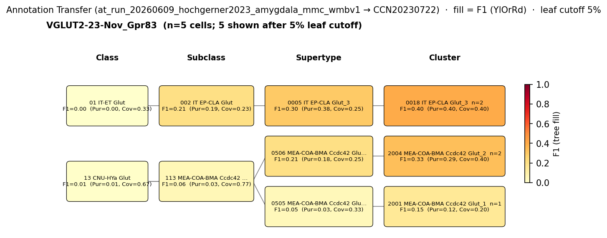

# Basolateral amygdala glutamatergic principal neuron — CCN20230722 Mapping Report
*Source: `kb/graphs/medial_temporal_lobe_amygdala/20260528_medial_temporal_lobe_amygdala_report_ingest.yaml`*

---

## Introduction

Basolateral amygdala (BLA) glutamatergic principal neurons constitute the predominant excitatory cell class of the BLA, comprising approximately 70–85% of all neurons in the lateral and basal nuclei [5][7]. As the primary output neurons of this cortical-like structure, they integrate sensory, associative, and top-down inputs and project widely to cortical and subcortical targets, making their accurate transcriptomic identification central to any atlas-level analysis of amygdala circuits. Mapping these neurons to WMBv1 is a necessary step for interpreting annotation-transfer experiments targeting BLA-enriched datasets.

### Classical type

| Property | Value | References |
|---|---|---|
| Soma location | Basolateral amygdala [UBERON:0002887] | [1][2][3][4] |
| Neurotransmitter | Glutamatergic | [5][1][6] |
| Defining markers | Slc17a7 (VGluT1), Camk2a | [7][8][9], [7][8] |
| Negative markers | — | — |
| Neuropeptides | — | — |
| Notes | Heterogeneity in dendritic field extent (small vs large neurons); also referred to as pyramidal, spiny, or class I neurons | — |

<details>
<summary>Details — source evidence for classical type properties</summary>

- **Soma location:** literature review · [1]
  > Its main nuclei, the lateral and the basolateral nuclei are known as the basolateral amygdala (BLA) and mostly contain projection neurons of pyramidal type, synthesizing glutamate
  > — Veinante et al. 2013, Amygdala organization and principal cellular classes · [1] <!-- quote_key: 15449738_4bbaac69 -->

- **Soma location:** literature review · [2]
  > The amygdaloid complex includes over a dozen nuclei and can be segregated into five groups (Beyeler and Dabrowska, 2020): (1) the BLA divided into a dorsal section (lateral amygdala, LA) and basal section (basal amygdala, BA), (2) the basomedial amygdala (BMA), (3) the central amygdala (CeA) further splits into medial, lateral, and central sections (CeM, CeL, and CeC), (4) the medial amygdala (MeA), and (5) the cortical amygdala (CoA)
  > — Raudales et al. 2024, Amygdala organization and principal cellular classes · [2] <!-- quote_key: 271240390_a9790f35 -->

- **Soma location:** literature review · [3]
  > .amygdala nuclei are commonly categorised into three groups: the deep laterobasal amygdala containing the lateral (LA) and basal nuclei; the superficial cortical-like nuclei; and centromedial amygdala containing the central (CE) and medial nuclei. (Yang et al., 2017)
  > — Nolan et al. 2020, Medial temporal lobe structures and broad cellular makeup · [3] <!-- quote_key: 222092617_b027389d -->

- **Soma location:** literature review · [4]
  > The basolateral nuclear group contains three major nuclei, and these include lateral (La), basolateral (BL) (or basal [B]) and basomedial (BM) (or accessory basal [AB]) nuclei
  > — Zhu et al. 2025, Introduction · [4] <!-- quote_key: 278109019_70eb502f -->

- **NT type / morphology:** literature review · [5]
  > .In the basolateral group, approximately 70% of neurons are thought to be glutamatergic (pyramidal, spiny, or class I neurons). This division also contains interneurons such as GABAergic nonspiny stellate cells of the cortex (called S cells, stellate, or class II neurons). In contrast, within the central nucleus, the majority of cells are thought to be GABAergic.
  > — Ignacio et al. 2014, Amygdala organization and principal cellular classes · [5] <!-- quote_key: 1229611_70584dfd -->

- **NT type / morphology:** literature review · [6]
  > It is a cortical-like structure and contains glutamatergic pyramidal neurons and GABAergic interneurons.
  > — Polepalli et al. 2020, Amygdala organization and principal cellular classes · [6] <!-- quote_key: 220930580_130f4111 -->

- **Slc17a7 (VGluT1) defining marker:** literature review · [7]
  > Based on the cell types, their connectivity features, and developmental characteristics, the BLA is a cortical structure. Accordingly, glutamatergic excitatory projection cells expressing vesicular glutamate transporter type 1 (VGluT1; (Andrási et al., 2017) are the most numerous neurons in this amygdala region (80-85%; (Vereczki et al., 2021). The dendrites of the principal cells (PC) are densely decorated with spines and their axon arborizes within the nucleus, giving rise to local collaterals, but they also project to other amygdala regions and remote cortical and/or subcortical areas (Sah et al., 2003).
  > — Hájos 2021, Classical neuron classes across amygdala subdivisions · [7] <!-- quote_key: 235382885_2970aa11 -->

- **Camk2a / CaM kinase marker:** literature review · [8]
  > the amygdalar nuclei can be grouped into two major macrostructures. First is the corticobasolateral nuclei, whose cell types resemble those of the cerebral cortex, with glutamatergic, calcium-calmodulin dependent (CaM) kinase-positive principal cells that bear morphological resemblance to cortical pyramidal neurons (McDonald, 1996). The activity of these neurons is coordinated, synchronized, and otherwise modulated by a variety of different inhibitory, GABAergic-interneurons, which can be classified according to their expression of various calcium-binding proteins as well as by morphological and connectional features. The second major amygdalar macrostructure is the centromedial complex, whose cell types resemble those of the striatopallidal region.
  > — Wilson et al. 2015, Introduction and amygdala subdivision background · [8] <!-- quote_key: 31039293_664990c0 -->

- **Slc17a7 (BLA divisional marker, Slc17a7 vs Slc17a6):** literature review · [9]
  > at low resolution, the whole pallial amygdala was found to divide into two super-radial domains distinguished by differential expression of Slc17a6 and Slc17a7; the former partly imitates molecularly the subpallial (output) amygdalar regions
  > — Fernández et al. 2025, Abstract · [9] <!-- quote_key: 280713728_0fe69282 -->

</details>

### Cell Ontology mapping

Cell Ontology mapping: pyramidal neuron [[CL:0000598](https://www.ebi.ac.uk/ols4/ontologies/cl/classes?obo_id=CL:0000598)] (BROAD).

*(Note: auto-proposed by asta-report-ingest; requires expert review. No specific CL term for BLA glutamatergic principal neurons currently exists; CL:0000598 is the closest ancestor. Candidate for CL contribution.)*

---

## Results

One candidate atlas supertype was assessed against the Basolateral amygdala glutamatergic principal neuron; the primary mapping to 0005 IT EP-CLA Glut_3 [CS20230722_SUPT_0005] is graded LOW confidence, reflecting that this supertype captures only a minor BLA subpopulation and three BLA-enriched LA-BLA-BMA-PA supertypes that are likely better candidates have not yet been assessed.

**Annotation-transfer overview — PARTIAL (3 cells)**

The Hochgerner 2023 source group `VGLUT2-23-Nov_Gpr83` assigned to this classical node contains only 3 naive cells from ArrayExpress:E-MTAB-12096 after filtering. The figure and metrics below reflect this severely limited sample and should be interpreted with caution.



*F1 across taxonomy levels for the 1 source group relevant to the Basolateral amygdala glutamatergic principal neuron (VGLUT2-23-Nov_Gpr83, n=3 naive cells after filter). Each panel row is a source-cell group; nodes are coloured by F1 with **Purity** (Pur) and **Coverage** (Cov) shown inline. Coverage = fraction of source-group cells landing on this target; Purity = fraction of this target's cells coming from the source group. With only 3 source cells, all F1 values are dominated by sampling noise — no value here constitutes a reliable quantitative anchor. F1 ≥ 0.5 at a level would indicate a clean mapping at that resolution, but this threshold is not met.*

**Interpretation caveat:** The best observed F1=0.40 at cluster level (rank 0; specific cluster accession not in facts file) and F1=0.30 at supertype level (CS20230722_SUPT_0005) are consistent with a weak but non-zero signal toward the IT EP-CLA cortical lineage. The caveats in the AT run record note that source labels are transcriptomically-defined types, not morphologically validated principal neurons, and that the `VGLUT2-23-Nov_Gpr83` assignment itself is an approximation.

### Candidate overview table

| Rank | WMBv1 supertype | Cells (10x) | Confidence | Key property alignment | Verdict |
|---|---|---|---|---|---|
| 1 | 0005 IT EP-CLA Glut_3 [CS20230722_SUPT_0005] | 798 | 🔴 LOW | NT CONSISTENT · location APPROXIMATE | Minor BLA component; IT cortical-like lineage |

Note: 1 edge assessed; broadMatch relationship. Three BLA-enriched LA-BLA-BMA-PA Glut supertypes (SUBT_0063/0064/0065 — noted in caveats) were not included in the discovery pass and remain unassessed.

### 0005 IT EP-CLA Glut_3 [CS20230722_SUPT_0005] · 🔴 LOW

**Property comparison**

| Property | Classical | Supertype | Best cluster | Alignment |
|---|---|---|---|---|
| Soma location | Basolateral amygdala [UBERON:0002887] | MBA:295 BLA (33 cells/0.08 Zhuang 2023; 3 cells/0.006 Yao 2024); dominant: Cortical subplate MBA:703 (~55%), Olfactory areas MBA:698 (~39%) | not assessed | APPROXIMATE |
| NT type | Glutamatergic | Glut (IT EP-CLA Glut subclass; IT-ET Glut class) | not assessed | CONSISTENT |
| Slc17a7 expression | defining marker | not in SUPT_0005 defining markers (Abca8a, Npsr1, Adam33, Gpx3); expected as pan-Glut marker | not assessed | NOT_ASSESSED |
| Camk2a expression | defining marker | not in SUPT_0005 defining markers | not assessed | NOT_ASSESSED |
| Sex ratio | not documented | not available | not available | NOT_ASSESSED |

*(Child-cluster breakdown not assessed — see proposed experiments.)*

**Evidence support**

| Evidence | Type | Supports | Headline | Source |
|---|---|---|---|---|
| MERFISH soma location (BLA cells in SUPT_0005) | Atlas metadata | SUPPORT | 33 cells in MBA:295 BLA (Zhuang 2023); 3 cells (Yao 2024) | atlas-internal |
| Region fraction in BLA discovery cohort | Atlas metadata | AGAINST | region_fraction=0.042; 3 LA-BLA-BMA-PA supertypes have 0.40–0.71 | atlas-internal |
| Hochgerner 2023 MapMyCells AT | Annotation transfer | PARTIAL | F1=0.40 at cluster; n=3 cells (severely limited) | `at_run_20260609_hochgerner2023_amygdala_mmc_wmbv1` |

**Supporting evidence:**

- SUPT_0005 (0005 IT EP-CLA Glut_3 [CS20230722_SUPT_0005]) has atlas-confirmed cells in BLA territory: MERFISH spatial registration places 33 cells in MBA:295 (BLA) and 31 cells in MBA:303 (BLA-anterior) under Zhuang 2023, and the Glut subclass assignment (002 IT EP-CLA Glut) is consistent with the classical glutamatergic identity of BLA principal neurons.

- The VGLUT2-23-Nov_Gpr83 source group mapped with best F1=0.40 at cluster level (rank 0; cluster accession not in facts file — no metrics sidecar was generated for this node). At supertype level, F1=0.30 for CS20230722_SUPT_0005 (purity=0.375, coverage=0.25). Given the 3-cell source group, these values cannot be treated as reliable AT evidence.

**Marker evidence provenance:**

- **Slc17a7 (VGluT1):** The defining-marker claim is at transcript and protein level. Hájos 2021 [7] cites Andrási et al. 2017 and Vereczki et al. 2021 for VGluT1 immunolabelling in morphologically characterised BLA principal cells — cell-type specificity is strong, with immunofluorescence combined with anatomical identification of principal neuron morphology. However, Slc17a7 is not listed among SUPT_0005's curated defining atlas markers (Abca8a, Npsr1, Adam33, Gpx3); as a pan-glutamatergic marker it is broadly expected but unconfirmable from current atlas metadata alone. Alignment: NOT_ASSESSED.

- **Camk2a (CaM kinase II alpha):** Wilson et al. 2015 [8] describes CaM kinase-positive principal cells in the BLA as a general property of corticobasolateral nuclei. The evidence is review-level (citing McDonald 1996), not a primary study directly labelling morphologically confirmed BLA neurons with Camk2a antibody or in-situ hybridisation. Camk2a does not appear in SUPT_0005's curated atlas markers. Alignment: NOT_ASSESSED. *(Note: a targeted literature search for "CaMKII BLA principal neuron" and a precomputed-expression query for Camk2a across BLA Glut supertypes would resolve this property.)*

- **Fernández et al. 2025 [9]** notes that Slc17a7 and Slc17a6 differentiate pallial amygdala sub-domains at low resolution, supporting the Slc17a7 assignment for BLA principal neurons over Slc17a6-expressing populations; however, this provides domain-level rather than cell-type-specific expression evidence.

**Concerns:**

- **Location APPROXIMATE (weak counter-evidence):** BLA cells represent only ~4–8% of SUPT_0005 (region_fraction=0.042), with the dominant spatial distribution in Cortical subplate (MBA:703, ~55%) and Olfactory areas (MBA:698, ~39%). The supertype name (IT EP-CLA: isocortex/endopiriform/claustrum) reflects this distribution. *(Note: the presence of BLA cells in SUPT_0005 may reflect genuine cortical-like neurons in the BLA — the BLA is a cortical-like structure — but the supertype is predominantly non-BLA. This is adjacent/homologous territory rather than a distant region, making this weak rather than strong counter-evidence.)*

- **MERFISH coverage discrepancy:** Two MERFISH datasets give markedly different BLA (MBA:295) cell counts for SUPT_0005 (33 cells ratio 0.08 vs. 3 cells ratio 0.006). This inconsistency reduces confidence in the BLA location assignment.

- **AT evidence severely limited:** Only 3 naive cells from VGLUT2-23-Nov_Gpr83 were available for mapping. F1=0.40 at cluster level cannot be treated as a reliable quantitative anchor.

- **Better BLA candidates not assessed:** Three LA-BLA-BMA-PA Glut supertypes (SUBT_0063/0064/0065 in caveats) with BLA region_fractions of 0.40–0.71 were not captured in the rank-1 discovery pass. They are the likely primary atlas correlates of the classical BLA glutamatergic principal neuron and must be assessed before any HIGH or MODERATE confidence verdict is reachable.

- **Markers NOT_ASSESSED:** Both defining markers (Slc17a7, Camk2a) are unresolvable from current atlas metadata for SUPT_0005. 0 of 2 markers have been assessed.

**What would upgrade confidence:**

- **Hypothesis-mode map-cell-type for LA-BLA-BMA-PA Glut supertypes:** Run hypothesis-mode assessment targeting SUBT_0063, SUBT_0064, SUBT_0065. Expected output: new `MappingEdge` YAML entries; potential upgrade to MODERATE confidence if marker alignment resolves.
- **Precomputed expression query:** Obtain Slc17a7 and Camk2a expression statistics across all BLA Glut supertypes to convert 0 of 2 markers NOT_ASSESSED to assessed comparisons.
- **Expanded AT experiment:** Identify a source cluster with adequate cell count (≥50 cells per group) labelling BLA glutamatergic principal neurons. Target: F1 ≥ 0.50 at supertype level. Expected output: AnnotationTransferEvidence at SUPPORT.
- **Targeted literature search:** Cite-traverse for "CaMKII BLA principal neuron immunohistochemistry" to confirm primary cell-type-specific evidence for Camk2a. Expected output: LiteratureEvidence entry.

---

### Methods

<details>
<summary>Data sources, analyses, and reproducibility receipts</summary>

**Classical type definition.** The Basolateral amygdala glutamatergic principal neuron is defined on the basis of classical morphological and neurochemical criteria (`definition_basis: CLASSICAL`). Defining markers are Slc17a7 (VGluT1) [7][8][9] and Camk2a [7][8]. Neurotransmitter type is Glutamatergic [5][1][6]. Soma location is Basolateral amygdala [UBERON:0002887] [1][2][3][4]. The type encompasses pyramidal/spiny/class I neurons of the lateral and basal nuclei, with documented heterogeneity in dendritic field extent.

**Atlas mapping query.** Candidate atlas clusters were retrieved from the CCN20230722 taxonomy at rank 0 (cluster) and 1 (supertype) using metadata-based scoring (region match, NT type, defining markers, sex bias when applicable). Full scoring rules: `workflows/map-cell-type.md`. The discovery pass returned a 5-member Glut/BLA cohort at rank 1; SUPT_0005 was the top-ranked candidate (tied score 1, cohort size 5). Three LA-BLA-BMA-PA supertypes with higher BLA region fractions (SUBT_0063/0064/0065) were not in the top-5 and require a dedicated hypothesis-mode pass.

**Property alignment.** Each defining property of the classical type was compared to the corresponding atlas-side value via the `property_comparisons` schema, with alignments graded CONSISTENT / APPROXIMATE / DISCORDANT / NOT_ASSESSED. Atlas-side numerical values came from precomputed expression on the cluster (cluster.yaml in the taxonomy reference store) and from MERFISH spatial registration for soma location.

**Annotation transfer**

| Field | Value |
|---|---|
| Source dataset | ArrayExpress:E-MTAB-12096 (VGLUT2-23-Nov_Gpr83) |
| Source species | NCBITaxon:10090 (mouse) |
| Target atlas | WMBv1 (CCN20230722; SHA-256: b21ca985) |
| Method | MapMyCells local (cell_type_mapper v1.7.1, default parameters, raw normalization, 100 bootstrap iterations). Input h5ad built from Hochgerner 2023 figshare UMI count table: genes x cells TSV converted to cells x genes h5ad, filtered to naive neuronal cells. Gene names are gene symbols as in source file. F1 scoring against celltype source labels. |
| Tool version | cell_type_mapper v1.7.1 |
| Bootstrap threshold | 0.7 |
| n cells | 55514 total (filtered to 7777 neuronal naive) |
| Run record | [`kb/annotation_transfer_runs/at_run_20260609_hochgerner2023_amygdala_mmc_wmbv1/manifest.yaml`](../../kb/annotation_transfer_runs/at_run_20260609_hochgerner2023_amygdala_mmc_wmbv1/manifest.yaml) |
| Code reference | [https://github.com/AllenInstitute/cell_type_mapper](https://github.com/AllenInstitute/cell_type_mapper) |
| F1 matrix | [`kb/annotation_transfer_runs/at_run_20260609_hochgerner2023_amygdala_mmc_wmbv1/f1_matrix.csv`](../../kb/annotation_transfer_runs/at_run_20260609_hochgerner2023_amygdala_mmc_wmbv1/f1_matrix.csv) |
| Caveats | Source labels are transcriptomically-defined types, not classical morpho-electrophysiological types. Matching to KB classical nodes requires a mapping step (Hochgerner type -> classical node) based on shared molecular markers. Fear-conditioned cells excluded to avoid transcriptional-state confounds. Non-neuronal cells excluded. Gene symbols used (not Ensembl IDs); matched against WMBv1 marker genes. |

**Anti-hallucination.** All citations, atlas accessions, ontology CURIEs, and verbatim literature quotes in this report are validated against the evidencell knowledge base at write time. Authored-prose evidence narratives are validated against their source `evidence_items[*].explanation` fields. The pre-write hook rejects any unresolvable identifier or unattributed blockquote. Specific mapping limitations and caveats are documented per-candidate in the Discussion section.

*Generated by evidencell `9d82411` at 2026-06-10T12:49:05+00:00 from [kb/graphs/medial_temporal_lobe_amygdala/20260528_medial_temporal_lobe_amygdala_report_ingest.yaml](kb/graphs/medial_temporal_lobe_amygdala/20260528_medial_temporal_lobe_amygdala_report_ingest.yaml).*

**Evidence base**

| Edge ID | Evidence types | Supports | Source |
|---|---|---|---|
| edge_bla_glutamatergic_principal_neuron_to_cs20230722_supt_0005 | ATLAS_METADATA; ATLAS_METADATA; ANNOTATION_TRANSFER | SUPPORT; AGAINST; PARTIAL | atlas-internal; atlas-internal; `at_run_20260609_hochgerner2023_amygdala_mmc_wmbv1` |

</details>

---

## Discussion

### Best candidate + caveats

**Primary mapping:** Basolateral amygdala glutamatergic principal neuron → 0005 IT EP-CLA Glut_3 [CS20230722_SUPT_0005] at LOW confidence. Key support: atlas-confirmed BLA cells in SUPT_0005 (MERFISH); NT type CONSISTENT. Key caveats: SUPT_0005 captures only ~4–8% of its cells in BLA (SUPERTYPE_SCOPE_MISMATCH caveat); both defining markers (Slc17a7, Camk2a) NOT_ASSESSED; AT evidence severely limited (3 cells, F1=0.40 at cluster level — not a reliable anchor).

The Cell Ontology has no specific term for this population; pyramidal neuron [[CL:0000598](https://www.ebi.ac.uk/ols4/ontologies/cl/classes?obo_id=CL:0000598)] is the closest ancestor (BROAD). Auto-proposed by asta-report-ingest; requires expert review.

This edge is deliberately speculative (verdict: "Speculative"). The broadMatch relationship is appropriate: the classical BLA glutamatergic principal neuron is likely not exclusively contained in SUPT_0005, and the three LA-BLA-BMA-PA Glut supertypes with much higher BLA region fractions have not been assessed.

### Proposed experiments and follow-ups

**1. Hypothesis-mode map-cell-type — LA-BLA-BMA-PA Glut supertypes**
- **What:** Run `map-cell-type` in hypothesis mode, targeting SUBT_0063, SUBT_0064, and SUBT_0065 directly for the `bla_glutamatergic_principal_neuron` node.
- **Target:** Identify which supertype(s) has region_fraction ≥ 0.4 in BLA and CONSISTENT marker alignment for Slc17a7 and Camk2a.
- **Expected output:** New `MappingEdge` YAML entries; potential upgrade to MODERATE confidence if marker alignment resolves.
- **Resolves:** Open questions 1 and 2; SUPERTYPE_SCOPE_MISMATCH caveat.

**2. Precomputed expression query — Slc17a7, Camk2a across BLA Glut supertypes**
- **What:** Query the taxonomy DB or precomputed stats HDF5 for Slc17a7 and Camk2a mean expression across all BLA-enriched Glut supertypes.
- **Target:** Expression ≥ MIN_DETECTABLE in the primary BLA supertypes for both genes.
- **Expected output:** 0 of 2 markers NOT_ASSESSED → assessed comparisons (CONSISTENT or DISCORDANT).
- **Resolves:** Marker NOT_ASSESSED gaps on this edge and any new edges from experiment 1.

**3. Expanded annotation transfer — larger BLA glutamatergic dataset**
- **What:** A MapMyCells AT round was completed (`at_run_20260609_hochgerner2023_amygdala_mmc_wmbv1`), but the VGLUT2-23-Nov_Gpr83 source group contains only 3 cells — insufficient for reliable F1 estimation. A source cluster with adequate cell count (≥50 cells per group) that specifically labels BLA glutamatergic principal neurons is needed. Either a different Hochgerner 2023 source group or an alternative BLA scRNA-seq dataset with VGLUT1+ principal neuron labels should be sought.
- **Target:** F1 ≥ 0.50 at supertype level; n ≥ 50 source cells per group.
- **Expected output:** AnnotationTransferEvidence at SUPPORT; potential upgrade to MODERATE confidence.
- **Resolves:** AT limitation caveat on this edge.

**4. Targeted literature search: CaMKII in BLA principal neurons**
- **What:** Cite-traverse or targeted search for "CaMKII BLA principal neuron immunohistochemistry" to find primary evidence (IHC, ISH) for Camk2a expression in morphologically confirmed BLA principal cells. The current Wilson et al. 2015 [8] citation is review-level.
- **Expected output:** LiteratureEvidence entry with primary study citation; marker confidence upgrade.
- **Resolves:** Open question 3 (weak Camk2a marker provenance).

### Open questions

1. Do LA-BLA-BMA-PA supertypes SUBT_0063/0064/0065 together account for the full transcriptomic diversity of classical BLA glutamatergic principal neurons? These were not in the top-5 rank-1 candidates and need direct hypothesis-mode assessment.

2. Do defining markers of SUPT_0005 (Abca8a, Npsr1, Adam33) label a genuine EP/claustrum-homologous BLA subpopulation, and if so, what fraction of classical BLA principal neurons does this subpopulation represent?

3. Does the Camk2a marker claim have primary cell-type-specific evidence for BLA principal neurons, beyond the review-level Wilson et al. 2015 [8] citation?

---

## References

| # | Citation | PMID | Used for |
|---|---|---|---|
| [1] | Veinante et al. 2013 | [25408902](https://pubmed.ncbi.nlm.nih.gov/25408902/) | Soma location; NT type |
| [2] | Raudales et al. 2024 | [39012795](https://pubmed.ncbi.nlm.nih.gov/39012795/) | Soma location |
| [3] | Nolan et al. 2020 | [33015518](https://pubmed.ncbi.nlm.nih.gov/33015518/) | Soma location |
| [4] | Zhu et al. 2025 | [40352758](https://pubmed.ncbi.nlm.nih.gov/40352758/) | Soma location |
| [5] | Ignacio et al. 2014 | [25309888](https://pubmed.ncbi.nlm.nih.gov/25309888/) | Neurotransmitter type |
| [6] | Polepalli et al. 2020 | [32802405](https://pubmed.ncbi.nlm.nih.gov/32802405/) | Neurotransmitter type |
| [7] | Hájos 2021 | [34177472](https://pubmed.ncbi.nlm.nih.gov/34177472/) | Slc17a7 marker; morphology |
| [8] | Wilson et al. 2015 | [26844236](https://pubmed.ncbi.nlm.nih.gov/26844236/) | Slc17a7 marker; Camk2a marker |
| [9] | Fernández et al. 2025 | [40867603](https://pubmed.ncbi.nlm.nih.gov/40867603/) | Slc17a7 marker |

---

<!-- verdict-block-start: edge_bla_glutamatergic_principal_neuron_to_cs20230722_supt_0005 -->
```yaml
verdict:
  confidence: LOW
  confidence_score: 0.22
  rationale: >
    NT type CONSISTENT (Glut subclass); location APPROXIMATE (region_fraction=0.042
    in BLA, SUPERTYPE_SCOPE_MISMATCH); AT evidence PARTIAL — F1=0.30 at supertype level
    (`at_run_20260609_hochgerner2023_amygdala_mmc_wmbv1`, source VGLUT2-23-Nov_Gpr83,
    n=3 cells, severely limited, not a reliable quantitative anchor); 0 of 2 markers CONSISTENT
    (marker_SLC17A7 NOT_ASSESSED, marker_CAMK2A NOT_ASSESSED); three LA-BLA-BMA-PA
    supertypes with region_fraction 0.40–0.71 unassessed (skos:broadMatch appropriate
    pending hypothesis-mode evaluation of CS20230722_SUPT_0005 alternatives).
  reconciliation_note: ""
  unresolved_questions:
    - "Do LA-BLA-BMA-PA supertypes SUBT_0063/0064/0065 account for the full transcriptomic diversity of BLA glutamatergic principal neurons? Hypothesis-mode assessment required."
    - "Precomputed expression for Slc17a7 and Camk2a across BLA Glut supertypes needed to resolve 0 of 2 markers assessed."
```
<!-- verdict-block-end -->
