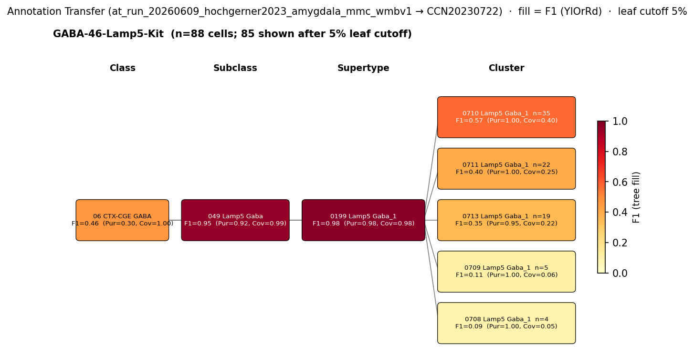

# Basolateral amygdala NPY neurogliaform cell — CCN20230722 Mapping Report
*2026-06-15 · Source: `kb/graphs/medial_temporal_lobe_amygdala/20260528_medial_temporal_lobe_amygdala_report_ingest.yaml`*

---

## Introduction

NPY-containing neurogliaform cells are a well-defined GABAergic interneuron class of the basolateral amygdala (BLA), constituting an estimated 14–15% of total inhibitory neurons in the lateral (LA) and basal (BA) nuclei [1]. They are defined by expression of the neuropeptide Npy in the absence of Pvalb or Sst, placing them in a distinct molecular space from the parvalbumin basket cell and somatostatin dendrite-targeting populations that together account for a further 27–36% of BLA GABAergic neurons [1]. Understanding their transcriptomic identity is important for connecting the classical circuit-function literature — in which NPY neurogliaform cells are recognised as a circuit brake on BLA principal neuron activity — to modern single-cell atlas data that can drive targeted manipulation.

| Property | Value | References |
|---|---|---|
| Soma location | Basolateral amygdala [UBERON:0002887] | [1] |
| NT type | GABAergic | [1] |
| Defining markers | Npy | [1], [2] |
| Negative markers | Pvalb, Sst | — |
| Neuropeptides | Npy | [1], [3] |

<details>
<summary>### Details — source evidence for classical type properties</summary>

- **Soma location:** immunocytochemistry combined with unbiased stereology in transgenic mice and viral labelling strategy · mouse BLA (LA and BA nuclei) · [1]

  > we estimated that the following cell types together compose the vast majority of GABAergic cells in the LA and BA: axo-axonic cells (5.5%-6%), basket cells expressing parvalbumin (17%-20%) or cholecystokinin (7%-9%), dendrite-targeting inhibitory cells expressing somatostatin (10%-16%), NPY-containing neurogliaform cells (14%-15%), VIP and/or calretinin-expressing interneuron-selective interneurons (29%-38%), and GABAergic projection neurons expressing somatostatin and neuronal nitric oxide synthase (5.5%-8%). Our results show that these amygdalar nuclei contain all major GABAergic neuron types as found in other cortical regions.
  > — Vereczki et al. 2021, Basolateral amygdala neuronal subtypes · [1] <!-- quote_key: 232283078_d4238834 -->

- **Npy (defining marker and neuropeptide):** immunocytochemistry, marker co-expression study · mouse · [1], [2]

- **Npy (neuropeptide):** neurochemical classification review · [3]

  > One commonly adopted method segregates IN subpopulations based on neurochemical content, including expression of Ca 2+ -binding proteins [e.g., parvalbumin (PV); (McDonald et al., 2001)(McDonald et al., 2001)] and neuropeptides such as somatostatin (SOM), neuropeptide Y (NPY), and cholecystokinin (CCK; Mascagni and McDonald, 2003;(Kepecs et al., 2014)
  > — Rovira-Esteban et al. 2019, Basolateral amygdala and corticobasal cell types · [3] <!-- quote_key: 204835327_bf931431 -->

</details>

**Cell Ontology mapping:** neurogliaform cell [[CL:0000693](https://www.ebi.ac.uk/ols4/ontologies/cl/classes?obo_id=CL:0000693)] (BROAD).

---

## Results

Annotation transfer of the Hochgerner 2023 Lamp5-Kit GABAergic type (GABA-46-Lamp5-Kit; ArrayExpress:E-MTAB-12096) using MapMyCells against WMBv1 (CCN20230722) cleanly resolves to supertype 0199 Lamp5 Gaba_1 [CS20230722_SUPT_0199] at F1=0.98, with cluster-level scatter distributing across multiple children of that supertype (see figure and property comparison table). The best cluster-level match is 0710 Lamp5 Gaba_1 [CS20230722_CLUS_0710] at F1=0.57. A critical caveat is that the Hochgerner source label is a transcriptomically defined Lamp5+Kit+ type, not a morphologically confirmed NPY neurogliaform cell; the bridging assumption that GABA-46-Lamp5-Kit corresponds to the classical NPY neurogliaform population requires direct experimental validation (see Discussion).



*F1 across taxonomy levels for the GABA-46-Lamp5-Kit source group (Hochgerner 2023; n=167 source cells mapped). Each panel row is a source-cell group; nodes are coloured by F1 with **Purity** (Pur) and **Coverage** (Cov) shown inline. Coverage = fraction of source-group cells landing on this target; Purity = fraction of this target's cells coming from the source group. With a single source group, Purity differentiates the target at cluster level; with a single pooled source, Purity is 1.0 at every target and only Coverage discriminates. F1 ≥ 0.5 at a level indicates a clean mapping at that resolution. Cluster-level scatter across multiple Lamp5 Gaba_1 children is consistent with transcriptomic heterogeneity within the source population.*

---

### Property alignment and evidence support

**Table 1 — Property comparison**

| Property | Classical | Atlas supertype (0199 Lamp5 Gaba_1) | Best cluster (0710 Lamp5 Gaba_1) | Alignment |
|---|---|---|---|---|
| Soma location | Basolateral amygdala [UBERON:0002887] | MBA:295 BLA present; region_fraction 0.02 | MBA:295 BLA present; region_fraction 0.02 | APPROXIMATE |
| NT type | GABAergic | GABA | GABA | CONSISTENT |
| Npy expression | defining neuropeptide | Npy precomputed mean 10.5 (tier 2) | Npy precomputed mean 10.5 (tier 2) | CONSISTENT |
| Pvalb (negative) | Pvalb-negative | Pvalb val 0.1 (low; consistent with absence) | Pvalb val 0.1 (low) | CONSISTENT |
| Sst (negative) | Sst-negative | Sst val 1.0 (above MIN_DETECTABLE) | Sst val 1.0 (above MIN_DETECTABLE) | DISCORDANT |
| Sex ratio | not documented | not available | not available | NOT_ASSESSED |

*(Child-cluster breakdown not assessed across all Lamp5 Gaba_1 children — see proposed experiments.)*

**Table 2 — Evidence support**

| Evidence | Type | Supports | Headline | Source |
|---|---|---|---|---|
| Vereczki 2021 BLA interneuron census | Literature | SUPPORT | NPY neurogliaform cells 14–15% of BLA GABAergic cells | [1] |
| CLUS_0710 atlas metadata | Atlas metadata | PARTIAL | Npy tier-2 (10.5), Pvalb absent; Sst=1.0 DISCORDANT | — |
| Hochgerner 2023 MapMyCells AT | Annotation transfer | SUPPORT | F1=0.98 at supertype; F1=0.57 at cluster | — |

---

### 0710 Lamp5 Gaba_1 · ⚪ UNCERTAIN

The strongest molecular match in WMBv1 for the BLA NPY neurogliaform cell profile is 0710 Lamp5 Gaba_1 [CS20230722_CLUS_0710], which expresses Npy at a precomputed mean of 10.5 (98th percentile within the GABAergic BLA survival cohort of 5 clusters) and is Pvalb-low (val 0.1, below detectable threshold). Annotation transfer of GABA-46-Lamp5-Kit cells from Hochgerner 2023 maps cleanly to supertype 0199 Lamp5 Gaba_1 [CS20230722_SUPT_0199] at F1=0.98 (Coverage=0.98, Purity=0.98) and to cluster CS20230722_CLUS_0710 at F1=0.57 (Coverage=0.40, Purity=1.00), with scatter distributing across several children of the supertype.

**Supporting evidence:**

- **Npy expression:** Atlas precomputed expression confirms Npy mean 10.5 at CS20230722_CLUS_0710, the highest in the 5-member GABAergic BLA cohort (98th cohort percentile). The applied_score of 2.0 reflects reliable, tier-2 expression.
- **Pvalb-negativity:** Pvalb val 0.1 at CS20230722_CLUS_0710, below MIN_DETECTABLE — consistent with the classical requirement for Pvalb absence.
- **GABAergic identity:** NT type is annotated GABA, consistent with the classical GABAergic designation.
- **AT signal (Hochgerner 2023, GABA-46-Lamp5-Kit):** MapMyCells run `at_run_20260609_hochgerner2023_amygdala_mmc_wmbv1` resolves the GABA-46-Lamp5-Kit source label to 0199 Lamp5 Gaba_1 [CS20230722_SUPT_0199] at F1=0.98 (n=167 cells, Coverage=0.98, Purity=0.98) and to 0710 Lamp5 Gaba_1 [CS20230722_CLUS_0710] at F1=0.57 (see figure).

**Marker evidence provenance:**

- **Npy (defining marker):** Established by protein-level immunostaining in Vereczki et al. 2021 [1] using transgenic mice and viral labelling combined with immunocytochemistry. Identity of the cells as NPY neurogliaform cells was confirmed using classical morphological criteria. This is the strongest available evidence. A secondary citation (Cardenas et al. 2019 [2]) confirmed Npy immunostaining in the BLA context but did not isolate NPY neurogliaform cells specifically from the broader BLA interneuron pool.

  ⚠ **Atlas annotation/expression discrepancy note:** Npy is expressed in atlas metadata as a tier-2 marker on CS20230722_CLUS_0710 (mean 10.5) and is the primary concordant signal. No discrepancy detected.

- **Pvalb (negative marker):** The Pvalb-negativity requirement is stated in Vereczki et al. 2021 [1] based on the classification of BLA interneurons into Pvalb+, CCK+, Sst+, NPY+, and VIP/calretinin populations. However, the explicit statement that NPY neurogliaform cells are Pvalb-negative relies on the classification scheme rather than a direct co-staining experiment on morphologically identified NPY neurogliaform cells. A targeted primary citation testing co-expression in morphology-confirmed cells would strengthen this assertion.

- **Sst (negative marker):** The Sst-negativity requirement follows from the BLA interneuron classification that separates NPY neurogliaform cells from Sst+ dendrite-targeting interneurons. Atlas side: Sst val=1.0 at CS20230722_CLUS_0710, which is above MIN_DETECTABLE. This is the critical discordance. Whether this reflects genuine Sst co-expression in a subset of Lamp5+Kit+ BLA neurons, averaging across a mixed cluster, or a data artefact is not resolved in gathered literature.

**Concerns:**

- **Sst DISCORDANT:** Sst val=1.0 at CS20230722_CLUS_0710 exceeds MIN_DETECTABLE. NPY neurogliaform cells are expected to be Sst-negative by classical definition. This is the primary blocking concern. Literature gathered for this node does not document Sst co-expression in NPY neurogliaform cells, so the discordance is flagged as unresolved. *(note: the Lamp5 Gaba supertype family in WMBv1 can include cells with low-level Sst; whether the BLA component of CLUS_0710 specifically co-expresses Sst is not resolvable from atlas means alone.)*

- **Location APPROXIMATE** (region_fraction 0.02 — `region_fraction_100um` not separately recorded for this edge; strict fraction is very low): Lamp5 interneurons are sparse in mouse BLA, and the low BLA fraction reflects atlas-wide underrepresentation of this cell family in the amygdala relative to cortical areas. The mapping may still be valid if BLA NPY neurogliaform cells are a small subset of the Lamp5 Gaba cluster family, but the low fraction is a genuine concern rather than boundary scatter. *(note: proximity data is not available for this edge; the neuroanatomical inference is that BLA is not an adjacent region to primary Lamp5 cluster territories in WMBv1, which are predominantly cortical/CGE-derived.)*

- **AT source identity not confirmed:** The Hochgerner GABA-46-Lamp5-Kit label is transcriptomically defined; Hochgerner 2023 did not morphologically confirm NPY neurogliaform identity in these cells. The AT evidence supports a Lamp5+Kit+ cell mapping to the Lamp5 Gaba_1 supertype, but the chain from "Hochgerner GABA-46-Lamp5-Kit" to "classical NPY neurogliaform cell" is inferential, not directly demonstrated.

- **Edge overlap with bla_lamp5_interneuron:** CS20230722_CLUS_0710 is also a candidate for the bla_lamp5_interneuron node. The overlap between Lamp5+ and NPY neurogliaform types is biologically plausible if NPY neurogliaform cells in the BLA are a Lamp5+ subset, but the degree of overlap is not resolved.

**What would upgrade confidence:**

- Multiplexed smFISH with Npy+Lamp5+Sst probes in mouse BLA to determine whether Sst is genuinely co-expressed in Npy+Lamp5+ BLA neurons or absent as expected (this would directly resolve the Sst discordance and the Lamp5 identity question simultaneously).
- Direct MapMyCells annotation transfer using a source dataset in which NPY neurogliaform cells are identified by morphology (e.g. biocytin fill after patch-clamp) or by a morphology-linked Cre driver in mouse BLA, targeting F1 ≥ 0.70 at cluster level.
- Targeted literature review for Sst expression in BLA NPY neurogliaform cells — it is possible the CLUS_0710 Sst val=1.0 reflects cluster heterogeneity not captured in classical marker studies.
- A targeted cite-traverse for "Pvalb OLM NPY BLA interneuron immunohistochemistry" to obtain a primary citation confirming Pvalb-negativity in morphologically confirmed NPY neurogliaform cells.

<details>
<summary>### Candidates audited (full top-K)</summary>

| WMBv1 cluster | Supertype | Cells (10x) | Confidence | Key evidence | Verdict |
|---|---|---:|---|---|---|
| 0710 Lamp5 Gaba_1 [CS20230722_CLUS_0710] | 0199 Lamp5 Gaba_1 | 5178 | ⚪ UNCERTAIN | Npy 98th-pct in BLA cohort; Sst DISCORDANT | Primary (UNCERTAIN — Sst discordance unresolved) |

</details>

---

### Methods

<details>
<summary>Data sources, analyses, and reproducibility receipts</summary>

**Classical type definition.** The Basolateral amygdala NPY neurogliaform cell is defined as a GABAergic interneuron of the basolateral amygdala expressing Npy as a defining marker and neuropeptide, in the absence of Pvalb and Sst. Definition basis: CLASSICAL, grounded in immunocytochemistry and unbiased stereology (Vereczki et al. 2021 [1]; Cardenas et al. 2019 [2]; Rovira-Esteban et al. 2019 [3]).

**Atlas mapping query.** Candidate atlas clusters were retrieved from the WMBv1 taxonomy (CCN20230722) at ranks 0 (cluster) and 1 (supertype) using metadata-based scoring (region match, NT type, defining markers, sex bias when applicable). Full scoring rules: `workflows/map-cell-type.md`.

**Property alignment.** Each defining property of the classical type was compared to the corresponding atlas-side value via the `property_comparisons` schema, with alignments graded CONSISTENT / APPROXIMATE / DISCORDANT / NOT_ASSESSED. Atlas-side numerical values came from precomputed expression on the cluster (cluster.yaml in the taxonomy reference store) and from MERFISH spatial registration for soma location.

**Annotation transfer.** MapMyCells local annotation transfer was run using the Hochgerner 2023 amygdala dataset (run `at_run_20260609_hochgerner2023_amygdala_mmc_wmbv1`):

| Field | Value |
|---|---|
| Source dataset | ArrayExpress:E-MTAB-12096 (GABA-46-Lamp5-Kit) |
| Source species | NCBITaxon:10090 (mouse) |
| Target atlas | WMBv1 (CCN20230722; SHA-256: b21ca985) |
| Method | MapMyCells local (cell_type_mapper v1.7.1, default parameters, raw normalization, 100 bootstrap iterations) |
| Tool version | cell_type_mapper v1.7.1 |
| Bootstrap threshold | 0.7 |
| n cells | 55514 total (filtered to 7777; naive neuronal cells only) |
| Run record | [`kb/annotation_transfer_runs/at_run_20260609_hochgerner2023_amygdala_mmc_wmbv1/manifest.yaml`](../../kb/annotation_transfer_runs/at_run_20260609_hochgerner2023_amygdala_mmc_wmbv1/manifest.yaml) |
| Script (external) | README.md |
| Code reference | [https://github.com/AllenInstitute/cell_type_mapper](https://github.com/AllenInstitute/cell_type_mapper) |
| F1 matrix | [`../../../../research/medial_temporal_lobe_amygdala/annotation_transfer/hochgerner2023_amygdala/mapping_result.csv`](../../kb/annotation_transfer_runs/at_run_20260609_hochgerner2023_amygdala_mmc_wmbv1/../../../../research/medial_temporal_lobe_amygdala/annotation_transfer/hochgerner2023_amygdala/mapping_result.csv) |
| Caveats | Source labels are transcriptomically-defined types, not classical morpho-electrophysiological types. Matching to KB classical nodes requires a mapping step (Hochgerner type → classical node) based on shared molecular markers. Fear-conditioned cells excluded to avoid transcriptional-state confounds. Non-neuronal cells excluded. |

**Anti-hallucination.** All citations, atlas accessions, ontology CURIEs, and verbatim literature quotes in this report are validated against the evidencell knowledge base at write time. Authored-prose evidence narratives are validated against their source `evidence_items[*].explanation` fields. The pre-write hook rejects any unresolvable identifier or unattributed blockquote. Specific mapping limitations and caveats are documented per-candidate in the Discussion section.

**Evidence base table:**

| Edge ID | Evidence types | Supports | Source |
|---|---|---|---|
| edge_bla_npy_neurogliaform_cell_to_cs20230722_clus_0710 | LITERATURE; ATLAS_METADATA; ANNOTATION_TRANSFER | SUPPORT; PARTIAL; SUPPORT | [1]; —; — |

*Generated by evidencell `bfdb7f1` at 2026-06-15T10:48:32+00:00 from [kb/graphs/medial_temporal_lobe_amygdala/20260528_medial_temporal_lobe_amygdala_report_ingest.yaml](../../kb/graphs/medial_temporal_lobe_amygdala/20260528_medial_temporal_lobe_amygdala_report_ingest.yaml).*

</details>

---

## Discussion

### Best candidate and caveats

**Primary mapping:** Basolateral amygdala NPY neurogliaform cell → 0710 Lamp5 Gaba_1 [CS20230722_CLUS_0710] at UNCERTAIN confidence. Key support: Npy expression at 98th cohort percentile and clean AT mapping of the Hochgerner Lamp5-Kit source label to 0199 Lamp5 Gaba_1 [CS20230722_SUPT_0199] at F1=0.98. Key caveats: Sst is DISCORDANT (val 1.0 above MIN_DETECTABLE, contrary to the Sst-negative classical definition); the Hochgerner source label is transcriptomically defined and its identity as NPY neurogliaform cells is not morphologically confirmed; BLA region fraction is very low (0.02), reflecting the sparse representation of Lamp5 interneurons in the BLA within a predominantly cortical atlas family.

The Cell Ontology has no specific term for this population; neurogliaform cell [CL:0000693] is the closest available ancestor. The BROAD mapping type reflects that the CL term covers a broader population than BLA NPY neurogliaform cells specifically — a new CL term capturing the BLA-specific NPY+ neurogliaform identity would be the appropriate next step. The mapping type was auto-proposed at ingest and requires expert review.

### Proposed experiments and follow-ups

1. **Multiplexed smFISH (Npy+Lamp5+Sst) in mouse BLA.**
   - *What:* FISH-based co-detection of Npy, Lamp5, and Sst transcripts in coronal sections through the BLA.
   - *Target:* Confirm that Npy+Lamp5+ BLA cells are Sst-negative in the large majority (expected ≥ 85% Sst-negative based on classical classification), and quantify any Sst+ subpopulation.
   - *Expected output:* Resolves the Sst DISCORDANT concern and provides a transcript-level anchor for the Lamp5 identity hypothesis. Would support upgrading to a marker-confirmed candidate and re-running AT.
   - *Resolves:* Sst discordance concern; overlap question with bla_lamp5_interneuron.

2. **Direct annotation transfer with a morphologically anchored BLA NPY source dataset.**
   - *What:* Identify or generate a source dataset in which NPY neurogliaform cells are identified by biocytin morphology or Cre-driver targeting in the BLA (e.g. NPY-Cre crossed with a reporter, with post-hoc morphological confirmation). Re-run MapMyCells against CCN20230722, targeting F1 ≥ 0.70 at cluster level and F1 ≥ 0.80 at supertype level.
   - *Expected output:* AnnotationTransferEvidence on the edge that directly links the morphologically confirmed classical type to the WMBv1 cluster, with curated `source_groups` rationale.
   - *Resolves:* AT source identity concern; would provide a primary experimental anchor for the Lamp5 identity hypothesis.

3. **Targeted literature review for Pvalb co-expression and Sst heterogeneity in BLA NPY cells.**
   - *What:* Cite-traverse on "NPY neurogliaform BLA Sst co-expression" and "parvalbumin NPY co-expression amygdala". Assess whether any primary study has directly tested Pvalb- and Sst-negativity in morphologically confirmed NPY neurogliaform cells.
   - *Expected output:* LiteratureEvidence items updating the Pvalb and Sst negative_marker assertions with primary citations.
   - *Resolves:* Open questions 7 and 8 below.

4. **Acquire CCN20230722 HDF5 and re-run Stage A discovery with Npy+/Sst- scoring.**
   - *What:* Download WMBv1 precomputed stats HDF5 and run `just find-candidates` at both rank 0 and rank 1 with explicit Npy+/Sst- scoring to test whether a better-fitting BLA cluster exists beyond the 5-member GABAergic BLA cohort currently assessed.
   - *Expected output:* Updated top-K edge list; may identify a cluster with lower Sst expression than CLUS_0710.
   - *Resolves:* Open question 4 below.

### Open questions

1. Do BLA NPY neurogliaform cells overlap with the Lamp5 Gaba family in WMBv1? The Lamp5+Kit+ label of the Hochgerner source population is consistent with a Lamp5-lineage identity, but this has not been confirmed with morphological or Cre-driver validation in the BLA.

2. Is the Sst signal in CS20230722_CLUS_0710 (val=1.0) genuine co-expression or a cluster averaging artifact? If it reflects averaging over a mixed population, the BLA-specific NPY neurogliaform component may be Sst-negative. This cannot be resolved from atlas pseudobulk means alone.

3. Run multiplexed smFISH (Npy+Lamp5+Sst) in mouse BLA to resolve whether Sst co-expression occurs in NPY neurogliaform cells.

4. Acquire CCN20230722 HDF5 and re-run Stage A discovery with explicit Npy+/Sst− scoring to test for a better-fitting BLA cluster.

5. Does the BLA component of CS20230722_CLUS_0710 correspond to NPY neurogliaform cells? The predicate should be upgraded from UNCERTAIN to broadMatch (or closeMatch) if Lamp5+Kit+ BLA neurons are confirmed to match the classical NPY neurogliaform definition.

6. Why is negative_marker_Sst DISCORDANT? Is there genuine Sst co-expression in the Lamp5-Kit cluster, or is this a data artefact?

7. Trawl literature for Sst expression in BLA NPY neurogliaform cells — the CS20230722_CLUS_0710 Sst val=1.0 may reflect cluster heterogeneity not captured in classical single-marker studies.

8. Confirm Pvalb-negativity assertion for BLA NPY neurogliaform cells with a primary citation targeting morphologically confirmed cells.

---

## References

| # | Citation | PMID | Used for |
|---|---|---|---|
| [1] | Vereczki et al. 2021 | [33837051](https://pubmed.ncbi.nlm.nih.gov/33837051/) | Soma location, NT type, Npy marker, Npy neuropeptide |
| [2] | Cardenas et al. 2019 | [31193505](https://pubmed.ncbi.nlm.nih.gov/31193505/) | Npy marker |
| [3] | Rovira-Esteban et al. 2019 | [31636080](https://pubmed.ncbi.nlm.nih.gov/31636080/) | Npy neuropeptide |

---

<!-- verdict-block-start: edge_bla_npy_neurogliaform_cell_to_cs20230722_clus_0710 -->
```yaml
verdict:
  confidence: UNCERTAIN
  confidence_score: 0.25
  relationship: evidencell:UncertainRelationship
  mapping_cardinality: "1:1"
  mapping_justification: semapv:UnreviewedManualMapping
  rationale: >
    [tier:STRONGEST] Npy precomputed mean 10.5 (98th percentile in GABAergic BLA cohort, applied_score 2.0, source EXPRESSION) and AT signal from at_run_20260609_hochgerner2023_amygdala_mmc_wmbv1 (GABA-46-Lamp5-Kit → CS20230722_SUPT_0199 F1=0.98; CS20230722_CLUS_0710 F1=0.57) support a Lamp5 Gaba identity. However, negative_marker_Sst is DISCORDANT (Sst val 1.0 above MIN_DETECTABLE, applied_score -1.0); the AT source label (GABA-46-Lamp5-Kit) is a transcriptomically-defined type without direct cell-type confirmation as NPY neurogliaform cells; and region_fraction is 0.02 (very low BLA representation for the Lamp5 Gaba family). These concerns prevent a committed SKOS predicate. Confidence UNCERTAIN pending smFISH Sst validation and direct AT with a cell-type-anchored source.
  reconciliation_note: >
    Single edge in top-K. No competing candidates. UNCERTAIN held because Sst DISCORDANT is a defining-marker contradiction not resolved by gathered literature, and the AT bridging step (Hochgerner GABA-46-Lamp5-Kit → classical NPY neurogliaform) is inferential. Upgrade path: resolve Sst concern via smFISH; re-run AT with a cell-type-confirmed source → if F1 > 0.70 at cluster level and Sst discordance resolved, migrate to skos:closeMatch at MODERATE confidence.
  caveats:
    - caveat_type: OTHER
      description: "Sst DISCORDANT: val 1.0 above MIN_DETECTABLE. NPY neurogliaform cells expected Sst-negative. Whether this reflects genuine co-expression or cluster averaging is unresolved."
    - caveat_type: OTHER
      description: "CS20230722_CLUS_0710 also mapped to bla_lamp5_interneuron — overlap between Lamp5+ and NPY+ neurogliaform types likely at this rank."
    - caveat_type: OTHER
      description: "AT source label (GABA-46-Lamp5-Kit from Hochgerner 2023) is transcriptomically defined; not directly validated as NPY neurogliaform cells."
  proposed_experiments:
    - "Multiplexed smFISH with Npy+Lamp5+Sst probes in mouse BLA to confirm Sst-negativity in Npy+Lamp5+ cells and resolve the Sst discordance."
    - "Direct annotation transfer using a source dataset with cell-type-confirmed or Cre-driver validated NPY neurogliaform cells, targeting F1 >= 0.70 at cluster level with CCN20230722."
    - "Acquire CCN20230722 HDF5 and re-run Stage A discovery with explicit Npy+/Sst- scoring to test for a better-fitting BLA cluster."
  unresolved_questions:
    - "Do BLA NPY neurogliaform cells overlap with the Lamp5 Gaba family in WMBv1?"
    - "Is the Sst signal in CS20230722_CLUS_0710 genuine co-expression or averaging artifact?"
    - "Run multiplexed smFISH (Npy+Lamp5+Sst) in mouse BLA to resolve whether Sst co-expression occurs in NPY neurogliaform cells."
    - "Acquire CCN20230722 HDF5 and re-run discovery with Npy+/-Sst scoring."
    - "Does the BLA component of CS20230722_CLUS_0710 correspond to NPY neurogliaform cells? Predicate should be upgraded to broadMatch if confirmed."
    - "Why is negative_marker_Sst DISCORDANT? Is there Sst co-expression in the Lamp5-Kit cluster?"
    - "Trawl literature for Sst expression in BLA NPY neurogliaform cells — the CS20230722_CLUS_0710 Sst val=1.0 may reflect cluster heterogeneity not captured in classical single-marker studies."
    - "Confirm Pvalb-negativity assertion for BLA NPY neurogliaform cells with a primary citation."
```
<!-- verdict-block-end -->
