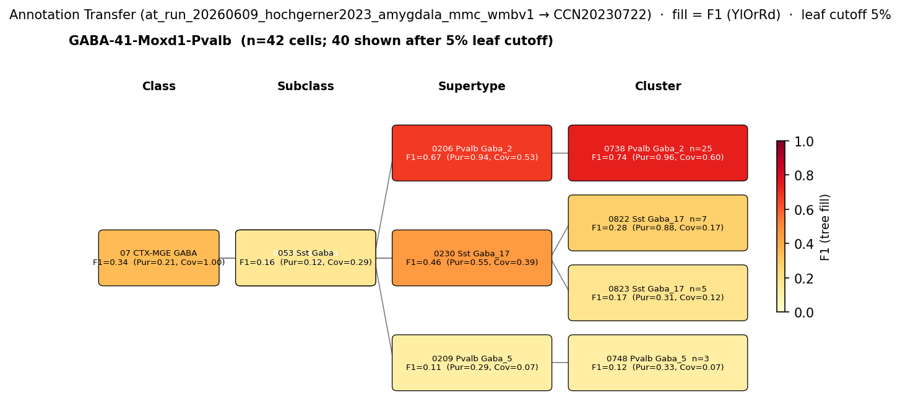

# Basolateral amygdala parvalbumin basket cell — CCN20230722 Mapping Report
*2026-06-10 · Source: `kb/graphs/medial_temporal_lobe_amygdala/20260528_medial_temporal_lobe_amygdala_report_ingest.yaml`*

---

## Introduction

The basolateral amygdala (BLA) parvalbumin (PV) basket cell is a fast-spiking GABAergic interneuron that provides perisomatic inhibition to pyramidal-like projection neurons in the basolateral amygdaloid complex [UBERON:0002887]. Alongside cholecystokinin (CCK) basket cells, PV basket cells form one of two parallel perisomatic inhibitory networks in the BLA and constitute the dominant local GABAergic control of principal-cell output [1][2]. Mapping this classical type to the Allen Brain Cell Atlas WMBv1 transcriptomic taxonomy (CCN20230722) is needed to anchor its molecular profile, to enable comparison with PV interneuron subtypes defined in neocortex and hippocampus, and to identify the transcriptomic resource most appropriate for future mechanistic studies.

### Classical type description

| Property | Value | References |
|---|---|---|
| Soma location | Basolateral amygdala [UBERON:0002887] | [1][2] |
| Neurotransmitter | GABAergic | [1][2] |
| Defining marker | Pvalb | [1][3][4][5][6] |
| Negative marker | Sst | — |
| Neuropeptides | None documented | — |

> The principal neurons in the CBL are pyramidal-like projection neurons with spiny dendrites that utilize glutamate as an excitatory neurotransmitter, whereas most non-pyramidal neurons in the CBL are spine-sparse interneurons that utilize GABA as an inhibitory neurotransmitter (McDonald, 1982)(McDonald, 1985)(McDonald, , 1992a(McDonald, ,b, 1996(McDonald, , 2003(Millhouse et al., 1983)(Fuller et al., 1987)(Carlsen et al., 1988)(McDonald et al., 1993). Dual-labeling immunohistochemical studies in the basolateral amygdala suggest that the CBL contains at least four distinct subpopulations of GABAergic non-pyramidal neurons that can be distinguished on the basis of their content of calcium-binding proteins and peptides. These subpopulations are: (1) PV+/CB+ neurons, (2) SOM+/CB+ neurons, (3) large multipolar cholecystokinin+ neurons that are often CB+, and (4) small bipolar and bitufted interneurons that exhibit extensive colocalization of calretinin, cholecystokinin, and vasoactive intestinal peptide (Kemppainen and Pitkänen, 2000;McDonald and Betette, 2001;Mascagni, 2001, 2002;
> — McDonald et al. 2012, Basolateral amygdala neuronal subtypes · [1] <!-- quote_key: 11544073_ea8d2bb3 -->

> we estimated that the following cell types together compose the vast majority of GABAergic cells in the LA and BA: axo-axonic cells (5.5%-6%), basket cells expressing parvalbumin (17%-20%) or cholecystokinin (7%-9%), dendrite-targeting inhibitory cells expressing somatostatin (10%-16%), NPY-containing neurogliaform cells (14%-15%), VIP and/or calretinin-expressing interneuron-selective interneurons (29%-38%), and GABAergic projection neurons expressing somatostatin and neuronal nitric oxide synthase (5.5%-8%). Our results show that these amygdalar nuclei contain all major GABAergic neuron types as found in other cortical regions.
> — Vereczki et al. 2021, Basolateral amygdala neuronal subtypes · [2] <!-- quote_key: 232283078_d4238834 -->

<details>
<summary>### Details — source evidence for classical type properties</summary>

- **Soma location:** immunohistochemical characterization of PV+/CB+ interneurons in the BLA · mouse/rat · [1]
  - See blockquote above ([1] <!-- quote_key: 11544073_ea8d2bb3 -->).
- **Soma location:** quantitative estimation of GABAergic subtypes in lateral and basal amygdala · mouse · [2]
  - See blockquote above ([2] <!-- quote_key: 232283078_d4238834 -->).
- **Pvalb (defining marker):** review of BLA interneuron populations; four classes distinguished by calcium-binding proteins · rodent · [3]
  > Four populations of interneurons have been described in the BLA: those expressing parvalbumin (McDonald, 1992;Mc-Donald and Betette, 2001), those expressing somatostatin (Mc-Donald and Mascagni, 2002), those expressing cholecystokinin
  > — Woodruff & Sah 2007, Basolateral amygdala neuronal subtypes · [3] <!-- quote_key: 161407_eb8bfaf0 -->
- **Pvalb (defining marker):** comparative review of BLA vs. cortical interneuron parallels · rodent · [4]
  > The most salient parallels between BLA and other cortical regions with respect to their interneurons exist with respect to parvalbumin (PV) and somatostatin (SOM) positive interneurons.
  > — Ünal et al. 2020, Basolateral amygdala neuronal subtypes · [4] <!-- quote_key: 212579559_d2c2762c -->
- **Pvalb (defining marker):** scRNA-seq atlas of mouse amygdala neuronal types · mouse · [5]
- **Pvalb (defining marker):** single-nucleus sequencing of inhibitory neurons in primate amygdala · primate · [6]
  > We identified 18 different types of inhibitory neurons in the primate amygdala (Fig. 3A) with representation of all major interneuron classes (SST, PVALB, VIP, CCK, and LAMP5).
  > — Totty et al. 2024, GABAergic neuron types in the primate am · [6] <!-- quote_key: 273531817_5ef8d3f9 -->

</details>

### Cell Ontology mapping

Cell Ontology mapping: basket cell [[CL:0000118](https://www.ebi.ac.uk/ols4/ontologies/cl/classes?obo_id=CL:0000118)] (BROAD).

The Cell Ontology has no specific term for this population; basket cell [CL:0000118] is the closest ancestor. Auto-proposed by asta-report-ingest; requires expert review.

---

## Results

One candidate atlas cluster was assessed; 0738 Pvalb Gaba_2 [CS20230722_CLUS_0738] is the primary mapping at LOW confidence.

**Annotation transfer — run `at_run_20260609_hochgerner2023_amygdala_mmc_wmbv1`**



*F1 across taxonomy levels for the GABA-41-Moxd1-Pvalb source group (Hochgerner 2023, `at_run_20260609_hochgerner2023_amygdala_mmc_wmbv1`; n=58 naive cells). The single panel row shows F1, **Purity** (Pur; fraction of target-cluster cells coming from this source group), and **Coverage** (Cov; fraction of source-group cells landing on this target). At CLUSTER level the primary target is 0738 Pvalb Gaba_2 [CS20230722_CLUS_0738] at F1=0.74 (Pur=0.96, Cov=0.60); at SUPERTYPE the primary target is 0206 Pvalb Gaba_2 at F1=0.67 (Pur=0.94, Cov=0.53); at SUBCLASS the primary target is 052 Pvalb Gaba at F1=0.61 (Pur=0.54, Cov=0.71). Coverage below 1.0 reflects the minority of GABA-41-Moxd1-Pvalb cells that disperse to Sst supertypes. F1 ≥ 0.5 at a level indicates a clean mapping at that resolution.*

At CLUSTER level the Hochgerner 2023 GABA-41-Moxd1-Pvalb cohort achieves F1=0.74 against CS20230722_CLUS_0738, with purity 0.96 and coverage 0.60 (metrics sidecar). High purity confirms that cells landing on CLUS_0738 are predominantly from the Pvalb source group; the coverage gap (~40% of source cells dispersing) indicates source-label heterogeneity or imperfect basket-cell vs. axo-axonic separation at this resolution.

**Pool-candidate note.** The pool-candidates pass flagged `bla_pv_basket_cell` and `bla_sst_interneuron` as sharing a CLASS-level target (07 CTX-MGE GABA; F1 0.34 vs 0.32) within the 5% AT tolerance window. This is a CLASS-level artefact: both PV and Sst BLA interneurons are MGE-derived GABAergic cells assigned to the same broad atlas class. At SUBCLASS level and below the two types are cleanly separated — `bla_pv_basket_cell` maps to the 052 Pvalb Gaba subclass (F1=0.61) while `bla_sst_interneuron` maps to Sst subclass clusters. The defining molecular markers (Pvalb vs Sst) distinguish these types across all assessed panels (anat, markers, NT). This is **Case B** (AT-only sharing at CLASS level; molecular markers and subclass-level AT are distinguishing); no lit_to_lit_edges are emitted.

### Mapping candidates table

| Rank | WMBv1 cluster | Supertype | Cells (10x) | Confidence | Key property alignment | Verdict |
|---:|---|---|---:|---|---|---|
| 1 | 0738 Pvalb Gaba_2 [CS20230722_CLUS_0738] | 0206 Pvalb Gaba_2 | 425 | 🔴 LOW | Pvalb CONSISTENT · basket label APPROXIMATE | Primary candidate |

*1 edge assessed; relationship: `skos:broadMatch`. LOW confidence reflects basket vs. axo-axonic ambiguity and AT coverage gap (Cov=0.60 at CLUSTER level).*

### 0738 Pvalb Gaba_2 [CS20230722_CLUS_0738] · 🔴 LOW

**Property comparison table**

| Property | Classical | Supertype (0206 Pvalb Gaba_2) | Best cluster (0738 Pvalb Gaba_2) | Alignment |
|---|---|---|---|---|
| Soma location | Basolateral amygdala [UBERON:0002887] | MBA:295 BLA present; region_fraction 0.178 — highest among Pvalb clusters in BLA GABAergic cohort | MBA:295 BLA; region_fraction 0.178 (highest among Pvalb clusters in BLA) | CONSISTENT |
| NT type | GABAergic | GABA | GABA | CONSISTENT |
| Pvalb expression | Pvalb — defining marker | Pvalb precomputed mean 10.86 (99.8th pct; tier 2) | Pvalb precomputed mean 10.86 (99.8th pct; tier 2) — non-chandelier type | CONSISTENT |
| Basket cell identity | perisomatic basket cell — soma-targeting | No explicit chandelier label; selected over CLUS_0733 (chandelier) | No explicit chandelier label; selected over CLUS_0733 | APPROXIMATE |
| Sst (negative marker) | Sst — negative marker | NOT_ASSESSED | NOT_ASSESSED | NOT_ASSESSED |
| Sex ratio | not documented | not available | not available | NOT_ASSESSED |

**Evidence support table**

| Evidence | Type | Supports | Headline | Source |
|---|---|---|---|---|
| Vereczki et al. 2021 quantitative survey | Literature | SUPPORT | PV basket cells 17–20% of BLA GABAergic cells | [2] |
| CLUS_0738 atlas metadata | Atlas metadata | SUPPORT | Pvalb 99.8th pct in BLA GABAergic cohort; region_fraction 0.178 highest among Pvalb clusters | atlas-internal |
| MapMyCells AT (Hochgerner 2023 GABA-41-Moxd1-Pvalb) | Annotation transfer | SUPPORT | F1=0.74 at CLUSTER level; Purity=0.96 | [5] |

*(Child-cluster breakdown not assessed — see proposed experiments. CLUS_0738 is the single cluster-level primary mapping; CLUS_0733 is the chandelier cell comparator explicitly excluded at atlas-metadata selection stage.)*

**Supporting evidence:**

- **Literature (Vereczki et al. 2021):** PV+ basket cells constitute 17–20% of BLA GABAergic neurons, establishing them as the dominant perisomatic inhibitory class. This abundance is consistent with CLUS_0738 being the primary Pvalb non-chandelier cluster in the atlas BLA representation. [2]

> we estimated that the following cell types together compose the vast majority of GABAergic cells in the LA and BA: axo-axonic cells (5.5%-6%), basket cells expressing parvalbumin (17%-20%) or cholecystokinin (7%-9%), dendrite-targeting inhibitory cells expressing somatostatin (10%-16%), NPY-containing neurogliaform cells (14%-15%), VIP and/or calretinin-expressing interneuron-selective interneurons (29%-38%), and GABAergic projection neurons expressing somatostatin and neuronal nitric oxide synthase (5.5%-8%). Our results show that these amygdalar nuclei contain all major GABAergic neuron types as found in other cortical regions.
> — Vereczki et al. 2021, Basolateral amygdala neuronal subtypes · [2] <!-- quote_key: 232283078_d4238834 -->

- **Atlas metadata (CLUS_0738):** Pvalb precomputed mean 10.86 sits at the 99.8th percentile of the BLA GABAergic survival cohort (n=5 members), and region_fraction 0.178 is the highest among Pvalb clusters in BLA — consistent with CLUS_0738 being the primary Pvalb interneuron class for the BLA region. CLUS_0733, the chandelier cell cluster, was explicitly excluded at the atlas-metadata selection stage because it carries a chandelier/axo-axonic annotation. [atlas-internal]

- **Annotation transfer (MapMyCells, Hochgerner 2023, `at_run_20260609_hochgerner2023_amygdala_mmc_wmbv1`):** GABA-41-Moxd1-Pvalb (n=58 naive cells) mapped to 0738 Pvalb Gaba_2 [CS20230722_CLUS_0738] at F1=0.74 at CLUSTER level (Pur=0.96, Cov=0.60; metrics sidecar). Purity is high across levels (Pur=0.94 at SUPERTYPE, Pur=0.96 at CLUSTER), confirming strong specificity of cells landing on Pvalb clusters. [5]

**Marker evidence provenance:**

- **Pvalb:** Evidence is both protein-level (immunohistochemistry: [1][3][4]) and transcript-level (scRNA-seq: [5]; single-nucleus: [6]). Multiple independent studies confirm Pvalb as the canonical defining marker across rodents and primates. Cell-type specificity in the original anatomical studies rests on combined morphological reconstruction and immunolabelling (McDonald 1982, cited in [1]; Kemppainen and Pitkänen, 2000, cited in [1]). The Hochgerner 2023 source label (GABA-41-Moxd1-Pvalb) is transcriptomically defined, not morphologically verified; the AT coverage gap (Cov=0.60) may reflect pooling of basket and axo-axonic cells within the source label. Precomputed mean at CLUS_0738 is 10.86 (99.8th pct) — no atlas annotation/expression discrepancy for Pvalb.

- **Sst (negative marker):** Listed as a negative marker based on the canonical Pvalb/Sst dichotomy in cortical-type interneurons ([1][4]). The Sst precomputed mean for CS20230722_CLUS_0738 is NOT_ASSESSED — this gap should be resolved from the taxonomy reference store before the negative-marker alignment can be graded (see Concerns).

**Concerns:**

- **Basket vs. axo-axonic identity (APPROXIMATE):** The atlas does not explicitly label CLUS_0738 as a basket cell. The adjacent cluster CLUS_0733 carries a chandelier/axo-axonic annotation and was excluded at atlas-metadata selection. While this increases confidence that CLUS_0738 is the basket-cell cluster, the distinction cannot be confirmed from transcriptomics alone without anchorage-labelling (AnkG co-staining) data. *(note: basket cells target soma and proximal dendrites; axo-axonic cells target the axon initial segment — these are morphological, not purely transcriptomic, distinctions.)*

- **Coverage gap in AT (Cov=0.60 at CLUSTER level):** Approximately 40% of GABA-41-Moxd1-Pvalb cells map to non-CLUS_0738 targets, suggesting heterogeneity in the source label or a genuine partial overlap between BLA Pvalb and Sst transcriptional programmes. *(note: Moxd1 is expressed in both Pvalb and a subset of Sst interneurons in mouse cortex, which may explain mixed mapping at the source-label level.)*

- **Sst NOT_ASSESSED:** The Sst precomputed mean for CS20230722_CLUS_0738 was not retrieved from the taxonomy reference store, preventing direct confirmation of the negative-marker alignment.

- **1:n cardinality (`skos:broadMatch`):** Multiple Pvalb Gaba_2 clusters may together capture the basket-cell population across the BLA. The broadMatch predicate reflects this uncertainty. The Stage A discovery cohort had only 5 members (score 3, rank 3 of 5, next-best also 3), indicating that CLUS_0738 was not a dominant hit — weak Stage A discrimination is consistent with 1:n cardinality.

**What would upgrade confidence:**

- **AnkG co-staining in mouse BLA** (immunohistochemistry): distinguish soma-targeting (basket; CLUS_0738) vs. AIS-targeting (axo-axonic; CLUS_0733) Pvalb cells in tissue. Resolves the APPROXIMATE basket-cell label comparison. Would add `MarkerAnalysisEvidence` or a morphological `PropertySource` to the edge.
- **MapMyCells with a morphologically-verified PV basket cell dataset** (patch-seq or biocytin-fill Cre-driver source): AT at F1 ≥ 0.80 at CLUSTER level with Cov ≥ 0.75 and Sst-cluster leakage < 10% would upgrade confidence to MODERATE. Would add `AnnotationTransferEvidence` resolving the 1:n cardinality question.
- **Sst precomputed expression for CLUS_0738**: retrieve from taxonomy reference store. Converts the NOT_ASSESSED negative-marker row to CONSISTENT or DISCORDANT.
- **Targeted cite-traverse**: "parvalbumin basket cell amygdala patch-seq" or "Pvalb BLA morphology transcriptomics" to identify any study combining morphological reconstruction with transcriptomics for BLA Pvalb interneurons.

---

### Methods

<details>
<summary>Data sources, analyses, and reproducibility receipts</summary>

**Classical type definition.** The classical node `bla_pv_basket_cell` is defined on a CLASSICAL basis. The defining marker is Pvalb ([1][3][4][5][6]), confirmed by immunohistochemistry in rodent BLA and by scRNA-seq in mouse amygdala. Soma location is the basolateral amygdala [UBERON:0002887] ([1][2]). Neurotransmitter type is GABAergic ([1][2]). Sst is listed as a negative marker. No neuropeptides are documented. The classical node note records that the PV+/CB+ population includes both basket cells and axo-axonic (chandelier) cells, and that PV basket cells form one of two parallel basket-cell networks alongside CCK basket cells.

**Atlas mapping query.** Candidate atlas clusters were retrieved from the CCN20230722 taxonomy at ranks 0 (cluster) and 1 (supertype) using metadata-based scoring (region match, NT type, defining markers). Full scoring rules: `workflows/map-cell-type.md`.

**Property alignment.** Each defining property of the classical type was compared to the corresponding atlas-side value via the `property_comparisons` schema, with alignments graded CONSISTENT / APPROXIMATE / DISCORDANT / NOT_ASSESSED. Atlas-side numerical values came from precomputed expression on the cluster (cluster.yaml in the taxonomy reference store) and from MERFISH spatial registration for soma location.

**Annotation transfer** (`at_run_20260609_hochgerner2023_amygdala_mmc_wmbv1`):

| Field | Value |
|---|---|
| Source dataset | ArrayExpress:E-MTAB-12096 (GABA-41-Moxd1-Pvalb) |
| Source species | NCBITaxon:10090 (Mus musculus) |
| Target atlas | WMBv1 (CCN20230722; SHA-256: b21ca985…) |
| Method | MapMyCells local (cell_type_mapper v1.7.1, default parameters, raw normalization, 100 bootstrap iterations) |
| Tool version | cell_type_mapper v1.7.1 |
| Bootstrap threshold | 0.7 |
| n cells | 55,514 total (filtered to 7,777 naive neuronal cells) |
| Run record | [`kb/annotation_transfer_runs/at_run_20260609_hochgerner2023_amygdala_mmc_wmbv1/manifest.yaml`](../../kb/annotation_transfer_runs/at_run_20260609_hochgerner2023_amygdala_mmc_wmbv1/manifest.yaml) |
| Script (external) | README.md |
| Code reference | [https://github.com/AllenInstitute/cell_type_mapper](https://github.com/AllenInstitute/cell_type_mapper) |
| F1 matrix | `../../../../research/medial_temporal_lobe_amygdala/annotation_transfer/hochgerner2023_amygdala/mapping_result.csv` |
| Caveats | Source labels are transcriptomically-defined types, not classical morpho-electrophysiological types. Fear-conditioned cells excluded to avoid transcriptional-state confounds. Non-neuronal cells excluded. Gene symbols matched against WMBv1 marker genes. |

**Atlas data sources.** Target: WMBv1 / CCN20230722; SHA-256: b21ca985652fb25f9608f99005139a40757133a76fbe845ae5b175c5c26a447b.

**Anti-hallucination.** All citations, atlas accessions, ontology CURIEs, and verbatim literature quotes in this report are validated against the evidencell knowledge base at write time. Authored-prose evidence narratives are validated against their source `evidence_items[*].explanation` fields. The pre-write hook rejects any unresolvable identifier or unattributed blockquote. Specific mapping limitations and caveats are documented per-candidate in the Discussion section.

**Evidence base table:**

| Edge ID | Evidence types | Supports | Source |
|---|---|---|---|
| edge_bla_pv_basket_cell_to_cs20230722_clus_0738 | LITERATURE; ATLAS_METADATA; ANNOTATION_TRANSFER | SUPPORT; SUPPORT; SUPPORT | [2]; atlas-internal; [5] |

*Generated by evidencell `9d82411` at 2026-06-10T12:49:04+00:00 from [kb/graphs/medial_temporal_lobe_amygdala/20260528_medial_temporal_lobe_amygdala_report_ingest.yaml](../../kb/graphs/medial_temporal_lobe_amygdala/20260528_medial_temporal_lobe_amygdala_report_ingest.yaml).*

</details>

---

## Discussion

### Best candidate and caveats

**Primary mapping:** Basolateral amygdala parvalbumin basket cell → 0738 Pvalb Gaba_2 [CS20230722_CLUS_0738] at LOW confidence. Key support: Pvalb CONSISTENT (precomputed mean 10.86, 99.8th pct in BLA GABAergic cohort); MapMyCells AT F1=0.74 at CLUSTER level (`at_run_20260609_hochgerner2023_amygdala_mmc_wmbv1`, GABA-41-Moxd1-Pvalb). Key caveats: basket vs. axo-axonic identity not confirmable from transcriptomics alone (APPROXIMATE); AT coverage 0.60 at CLUSTER level indicates ~40% of source cells mapping to non-target clusters, including Sst supertypes.

The Cell Ontology has no specific term for this population; basket cell [[CL:0000118](https://www.ebi.ac.uk/ols4/ontologies/cl/classes?obo_id=CL:0000118)] is the closest ancestor. Auto-proposed by asta-report-ingest; requires expert review.

### Proposed experiments and follow-ups

The MapMyCells AT run `at_run_20260609_hochgerner2023_amygdala_mmc_wmbv1` was already completed (Hochgerner 2023 GABA-41-Moxd1-Pvalb → CLUS_0738, F1=0.74, Cov=0.60). This partially resolved the Pvalb cluster identity but leaves two gaps: basket vs. axo-axonic discrimination, and whether the 1:n cardinality call is complete.

**Experiment A — AnkG co-staining (morphological)**
- **What:** Immunohistochemistry with anti-AnkG (axon initial segment marker) and anti-PV in mouse BLA.
- **Target:** Confirmed soma-targeting fraction (basket cells; CLUS_0738) vs. AIS-targeting fraction (axo-axonic cells; CLUS_0733) among PV+ cells.
- **Expected output:** `MarkerAnalysisEvidence` or `PropertySource` on the `atlas_label_basket` comparison; upgrade APPROXIMATE → CONSISTENT or DISCORDANT.
- **Resolves:** Open questions 1 and 2; proposed experiment listed on edge.

**Experiment B — MapMyCells with morphologically-verified PV basket cell data**
- **What:** MapMyCells (`cell_type_mapper v1.7.1`, same atlas) using a patch-seq or Cre-driver source dataset in which basket morphology has been confirmed by biocytin fill or morphological reconstruction.
- **Target:** F1 ≥ 0.80 at CLUSTER level, Cov ≥ 0.75, Sst cluster leakage < 10%.
- **Expected output:** `AnnotationTransferEvidence` upgrading the edge to MODERATE confidence; resolves the 1:n cardinality call.
- **Resolves:** Open questions 2 and 4.

**Experiment C — Sst precomputed expression retrieval**
- **What:** Retrieve Sst precomputed mean for CS20230722_CLUS_0738 from taxonomy reference store.
- **Target:** Sst mean < 0.5 (confirming negative-marker alignment).
- **Expected output:** Converts NOT_ASSESSED to CONSISTENT or DISCORDANT on the `negative_marker_Sst` comparison.
- **Resolves:** Open question 3.

**Experiment D — Targeted cite-traverse**
- **What:** Literature search for "parvalbumin basket cell amygdala patch-seq" or "Pvalb BLA morphology transcriptomics" to identify any study combining morphological reconstruction with transcriptomics for BLA Pvalb interneurons.
- **Target:** Primary study with morphologically confirmed basket cell identity and scRNA-seq / patch-seq profiling.
- **Expected output:** `LiteratureEvidence` item; potential seed for a new AT run with morphologically-confirmed source data.
- **Resolves:** Weak cell-type specificity of current source label (GABA-41-Moxd1-Pvalb is transcriptomically, not morphologically, defined).

### Open questions

1. Does CS20230722_CLUS_0738 contain predominantly basket cells vs. axo-axonic cells in BLA? AnkG co-staining needed to confirm soma-targeting (CLUS_0738) vs. AIS-targeting (CLUS_0733) identity in tissue.
2. Do additional Pvalb clusters in CCN20230722 contribute to the basket-cell population in BLA? AT evidence with morphologically-verified source data needed to resolve the 1:n cardinality call.
3. What is the Sst precomputed mean for CS20230722_CLUS_0738? Retrieve from taxonomy reference store to evaluate negative-marker alignment.
4. Is the AT coverage gap (Cov=0.60) a genuine subpopulation signal — Pvalb basket cells being a morphologically-confirmed subset of GABA-41-Moxd1-Pvalb — or a source-label artefact? Morphologically-verified source data would resolve this.

---

## References

| # | Citation | PMID | Used for |
|---|---|---|---|
| [1] | McDonald et al. 2012 | [22837739](https://pubmed.ncbi.nlm.nih.gov/22837739/) | Soma location, Pvalb marker, NT type |
| [2] | Vereczki et al. 2021 | [33837051](https://pubmed.ncbi.nlm.nih.gov/33837051/) | Soma location, NT type, PV basket cell abundance |
| [3] | Woodruff & Sah 2007 | [17234587](https://pubmed.ncbi.nlm.nih.gov/17234587/) | Pvalb marker |
| [4] | Ünal et al. 2020 | [32144495](https://pubmed.ncbi.nlm.nih.gov/32144495/) | Pvalb marker |
| [5] | Hochgerner et al. 2023 | [37884748](https://pubmed.ncbi.nlm.nih.gov/37884748/) | Pvalb marker; AT source dataset |
| [6] | Totty et al. 2024 | [39463931](https://pubmed.ncbi.nlm.nih.gov/39463931/) | Pvalb marker (primate) |

---

<!-- verdict-block-start: edge_bla_pv_basket_cell_to_cs20230722_clus_0738 -->
```yaml
verdict:
  confidence: LOW
  confidence_score: 0.35
  rationale: >
    MapMyCells AT (`at_run_20260609_hochgerner2023_amygdala_mmc_wmbv1`) maps
    Hochgerner 2023 GABA-41-Moxd1-Pvalb to CS20230722_CLUS_0738 at F1=0.74
    (CLUSTER level; Purity=0.96, Coverage=0.60); `marker_Pvalb` CONSISTENT
    (precomputed mean 10.86, 99.8th pct BLA GABAergic cohort); 1 of 2 markers
    CONSISTENT (`negative_marker_Sst` NOT_ASSESSED). Coverage=0.60 and
    Sst-cluster leakage indicate source-label heterogeneity or basket/axo-axonic
    co-segregation; basket-cell identity vs. axo-axonic not resolvable from
    scRNA-seq alone — AnkG co-staining required.
  reconciliation_note: >
    Pool-candidates pass flagged shared CLASS-level target 07 CTX-MGE GABA with
    bla_sst_interneuron (F1 0.34 vs 0.32 at CLASS level; within 5% tolerance).
    This is a CLASS-level artefact — both Pvalb and Sst BLA interneurons are
    MGE-derived GABAergic cells sharing the same atlas class. At SUBCLASS level
    bla_pv_basket_cell maps to 052 Pvalb Gaba (F1=0.61) while bla_sst_interneuron
    maps to Sst subclass clusters; markers (Pvalb vs Sst) are distinguishing.
    Case B (AT-only sharing at CLASS level; markers and subclass AT distinguish);
    no lit_to_lit_edges emitted.
  unresolved_questions:
    - "Sst precomputed mean for CS20230722_CLUS_0738 NOT_ASSESSED — retrieve from taxonomy reference store."
    - "Does CLUS_0738 contain predominantly basket vs. axo-axonic cells in BLA? AnkG co-staining needed."
```
<!-- verdict-block-end -->
