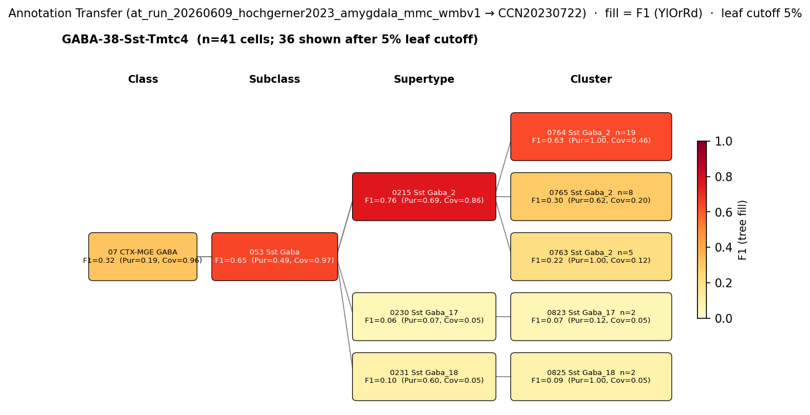

# Basolateral amygdala somatostatin interneuron — CCN20230722 Mapping Report
*2026-06-10 · Source: `kb/graphs/medial_temporal_lobe_amygdala/20260528_medial_temporal_lobe_amygdala_report_ingest.yaml`*

---

## Introduction

The basolateral amygdala somatostatin (SST) interneuron is a dendrite-targeting GABAergic interneuron that co-expresses somatostatin and calbindin (Calb1) and is reliably negative for parvalbumin. Together with PV+ basket cells, CCK+ basket cells, and VIP/calretinin IS interneurons, SST+ cells constitute one of the four major GABAergic subpopulations of the basolateral complex. Understanding how this classical type maps onto the Allen WMBv1 transcriptomic taxonomy matters both for cross-study integration and for identifying which single-cell clusters carry the functional literature accumulated on SST-mediated dendritic inhibition in fear and extinction circuits.

### Classical type

| Property | Value | References |
|---|---|---|
| Soma location | Basolateral amygdala [UBERON:0002887] | [1], [2] |
| Neurotransmitter | GABAergic | [1], [2] |
| Defining markers | Sst, Calb1 | [1], [3], [4], [5]; [1], [3], [4] |
| Negative markers | Pvalb | — |
| Neuropeptides | Sst | [1], [2] |

<details>
<summary>Details — source evidence for classical type properties</summary>

- **Soma location / NT type / Sst / Calb1 (McDonald et al. 2012):** immunohistochemical survey of GABAergic subpopulations in rat BLA · [1]

  > The principal neurons in the CBL are pyramidal-like projection neurons with spiny dendrites that utilize glutamate as an excitatory neurotransmitter, whereas most non-pyramidal neurons in the CBL are spine-sparse interneurons that utilize GABA as an inhibitory neurotransmitter (McDonald, 1982)(McDonald, 1985)(McDonald, , 1992a(McDonald, ,b, 1996(McDonald, , 2003(Millhouse et al., 1983)(Fuller et al., 1987)(Carlsen et al., 1988)(McDonald et al., 1993). Dual-labeling immunohistochemical studies in the basolateral amygdala suggest that the CBL contains at least four distinct subpopulations of GABAergic non-pyramidal neurons that can be distinguished on the basis of their content of calcium-binding proteins and peptides. These subpopulations are: (1) PV+/CB+ neurons, (2) SOM+/CB+ neurons, (3) large multipolar cholecystokinin+ neurons that are often CB+, and (4) small bipolar and bitufted interneurons that exhibit extensive colocalization of calretinin, cholecystokinin, and vasoactive intestinal peptide (Kemppainen and Pitkänen, 2000;McDonald and Betette, 2001;Mascagni, 2001, 2002;
  > — McDonald et al. 2012, Basolateral amygdala neuronal subtypes · [1] <!-- quote_key: 11544073_ea8d2bb3 -->

- **Soma location / NT type / Sst / morphology (Vereczki et al. 2021):** immunohistochemistry + cell counting in mouse LA/BA · [2]

  > we estimated that the following cell types together compose the vast majority of GABAergic cells in the LA and BA: axo-axonic cells (5.5%-6%), basket cells expressing parvalbumin (17%-20%) or cholecystokinin (7%-9%), dendrite-targeting inhibitory cells expressing somatostatin (10%-16%), NPY-containing neurogliaform cells (14%-15%), VIP and/or calretinin-expressing interneuron-selective interneurons (29%-38%), and GABAergic projection neurons expressing somatostatin and neuronal nitric oxide synthase (5.5%-8%). Our results show that these amygdalar nuclei contain all major GABAergic neuron types as found in other cortical regions.
  > — Vereczki et al. 2021, Basolateral amygdala neuronal subtypes · [2] <!-- quote_key: 232283078_d4238834 -->

- **Sst marker (Woodruff & Sah 2007):** immunohistochemistry in rat BLA · [3]

  > Four populations of interneurons have been described in the BLA: those expressing parvalbumin (McDonald, 1992;Mc-Donald and Betette, 2001), those expressing somatostatin (Mc-Donald and Mascagni, 2002), those expressing cholecystokinin
  > — Woodruff & Sah 2007, Basolateral amygdala neuronal subtypes · [3] <!-- quote_key: 161407_eb8bfaf0 -->

- **Sst / Calb1 markers (Ünal et al. 2020):** comparative review of cortical-type interneurons in BLA · [4]

  > The most salient parallels between BLA and other cortical regions with respect to their interneurons exist with respect to parvalbumin (PV) and somatostatin (SOM) positive interneurons.
  > — Ünal et al. 2020, Basolateral amygdala neuronal subtypes · [4] <!-- quote_key: 212579559_d2c2762c -->

</details>

**Notes:** Closely related GABAergic projection neurons expressing both somatostatin and neuronal nitric oxide synthase (~5.5–8% of GABAergic cells) are listed separately as projection rather than local interneurons.

### Cell Ontology mapping

Cell Ontology mapping: GABAergic interneuron [[CL:0011005](https://www.ebi.ac.uk/ols4/ontologies/cl/classes?obo_id=CL:0011005)] (BROAD).

---

## Results

One candidate atlas cluster was assessed; 0765 Sst Gaba_2 [CS20230722_CLUS_0765] in supertype 0215 Sst Gaba_2 (CS20230722_SUPT_0215) is the primary mapping at LOW confidence under a `skos:broadMatch` relationship.



*F1 across taxonomy levels for the 1 source group (GABA-38-Sst-Tmtc4, Hochgerner 2023) relevant to the Basolateral amygdala somatostatin interneuron. Each panel row is a source-cell group; nodes are coloured by F1 with **Purity** (Pur) and **Coverage** (Cov) shown inline. Coverage = fraction of source-group cells landing on this target; Purity = fraction of this target's cells coming from the source group. With a single source group in the figure, Purity differentiates competing targets; Coverage discriminates how many source cells each target captures. F1 ≥ 0.5 at a level indicates a clean mapping at that resolution.*

AT mapping is clean at SUPERTYPE level (F1=0.76, Purity=0.69, Coverage=0.86 for 0215 Sst Gaba_2, CS20230722_SUPT_0215) but dispersed across sibling clusters at CLUSTER level. The best cluster-level hit from the facts metrics_by_level is CS20230722_CLUS_0765 "0765 Sst Gaba_2" at F1=0.30 (Purity=0.62, Coverage=0.20). The source label `GABA-38-Sst-Tmtc4` from Hochgerner 2023 is a transcriptomically-defined type and may span multiple Sst Gaba_2 sibling clusters within the supertype; the supertype level is the most reliable mapping anchor.

**Source group / pool candidate note:** The pool-candidate scan flagged `bla_sst_interneuron` and `bla_pv_basket_cell` as sharing a CLASS-level target (07 CTX-MGE GABA, CS20230722_CLAS_07; F1=0.32 for SST, F1=0.34 for PV). This is **Case B — AT-only indistinguishability at CLASS level only.** At subclass and finer resolution the two types map to entirely different branches (SST→053 Sst Gaba, CS20230722_SUBC_053; PV→Pvalb subclasses *(note: inference from WMBv1 taxonomy structure; bla_pv_basket_cell AT metrics not in these facts)*) and their defining markers (Sst/Calb1 vs Pvalb) are mutually exclusive. The CLASS-level overlap reflects shared MGE developmental lineage *(note: SST and PV BLA interneurons share MGE developmental origin; CLASS 07 CTX-MGE GABA reflects this shared lineage)*, not biological indistinguishability. Morphology, electrophysiology, and developmental panels are not assessed in the available evidence, so a `lit_to_lit_edges` entry is not warranted (Case B protocol).

### Mapping candidates overview

| Rank | WMBv1 cluster | Supertype | Cells (10x) | Confidence | Key property alignment | Verdict |
|---:|---|---|---:|---|---|---|
| 1 | 0765 Sst Gaba_2 [CS20230722_CLUS_0765] | 0215 Sst Gaba_2 | 218 | 🔴 LOW | Sst CONSISTENT · Calb1 CONSISTENT | Provisional |

*1 edge assessed; relationship type `skos:broadMatch`.*

### Property alignment — 0765 Sst Gaba_2 [CS20230722_CLUS_0765]

**Table 1 — Property comparison**

| Property | Classical | Supertype | Best cluster | Alignment |
|---|---|---|---|---|
| Soma location | Basolateral amygdala [UBERON:0002887] | not available | MBA:295 BLA: region_fraction 0.289 — dominant BLA presence | CONSISTENT |
| NT type | GABAergic | not available | GABA | CONSISTENT |
| Sst (neuropeptide) | Sst — neuropeptide | not available | Sst precomputed mean 11.92 (96.7th pct; tier 2) | CONSISTENT |
| Calb1 (defining marker) | Calb1 — defining marker | not available | Calb1 precomputed mean 9.57 (96.5th pct; tier 2) | CONSISTENT |
| Pvalb (negative marker) | Pvalb — negative marker | not available | not assessed | NOT_ASSESSED |
| Sex ratio | not documented | not available | not assessed | NOT_ASSESSED |

**Table 2 — Evidence support**

| Evidence | Type | Supports | Headline | Source |
|---|---|---|---|---|
| Vereczki 2021 GABA cell census | Literature | SUPPORT | SST+/Calb1+ dendrite-targeting, 10–16% of GABAergic cells | [2] |
| CLUS_0765 atlas metadata | Atlas metadata | SUPPORT | Sst 96.7th pct, Calb1 96.5th pct; BLA region_fraction 0.289 | atlas-internal |
| MapMyCells AT (Hochgerner 2023) | Annotation transfer | SUPPORT | F1=0.76 at SUPERTYPE; F1=0.30 at CLUSTER | — |

*(Facts metrics_by_level: best cluster-level hit is CS20230722_CLUS_0765 "0765 Sst Gaba_2" at F1=0.30 (Purity=0.62, Coverage=0.20). No other cluster-level entry appears in the facts metrics_by_level for this AT run. Child-cluster breakdown relative to Calb1 expression and BLA dominance not assessed — see proposed experiments.)*

---

### 0765 Sst Gaba_2 [CS20230722_CLUS_0765] · 🔴 LOW

**Supporting evidence:**

- **Literature (Vereczki et al. 2021) [2]:** SST+ dendrite-targeting interneurons constitute 10–16% of GABAergic cells in LA/BA, co-express Calb1, and form a morphologically distinct class from PV basket and CCK basket cells. The atlas cluster profiles are fully consistent with this description.

  > SST+ inhibitory cells target predominantly the dendritic shaft and to a lesser extent, the spines of principal cells
  > — Vereczki et al. 2021, Discussion · [2] <!-- quote_key: 232283078_bd1f3975 -->

- **Atlas metadata (CLUS_0765):** Sst precomputed mean = 11.92 (96.7th percentile), Calb1 mean = 9.57 (96.5th percentile). Both defining markers of the classical SST interneuron are at the top of the expression range in this cluster. BLA region_fraction = 0.289 places the dominant soma location in the correct region.

- **Annotation transfer (`at_run_20260609_hochgerner2023_amygdala_mmc_wmbv1`):** The Hochgerner 2023 `GABA-38-Sst-Tmtc4` source type (n=59 naive cells, ArrayExpress:E-MTAB-12096) maps to WMBv1 with F1=0.76 at SUPERTYPE (CS20230722_SUPT_0215) and F1=0.30 at CLUSTER [CS20230722_CLUS_0765]. The SUPERTYPE mapping is clean; cluster-level dispersion indicates that the Hochgerner transcriptomic type spans multiple sibling clusters within CS20230722_SUPT_0215, consistent with a `skos:broadMatch` at CLUSTER level.

**Marker evidence provenance:**

- **Sst:** Both protein-level (IHC: McDonald et al. 2012 [1]; Woodruff & Sah 2007 [3]; Ünal et al. 2020 [4]; Vereczki et al. 2021 [2]) and transcript-level (scRNA-seq: Hochgerner et al. 2023 [5]) evidence confirms Sst expression in BLA interneurons. Cell-type specificity is supported by morphological co-labelling in [1] (SOM+/CB+ subpopulation) and by electrophysiology + IHC in [3]. Atlas precomputed mean = 11.92 at 96.7th percentile: strong confirmation from expression data.

- **Calb1:** IHC evidence from McDonald et al. 2012 [1], Woodruff & Sah 2007 [3], and Ünal et al. 2020 [4] confirms Calb1 co-expression with Sst in BLA interneurons. McDonald et al. 2012 [1] is the primary study establishing the SOM+/CB+ co-labelling subpopulation as a distinct class. Atlas precomputed mean = 9.57 at 96.5th percentile: strong confirmation. However, none of these studies used morphological reconstruction of individually recorded cells to confirm that all Calb1+ cells were specifically dendrite-targeting SST interneurons — evidence is population-level IHC. A targeted literature search for "calbindin somatostatin BLA basolateral amygdala single-cell" may yield more specific cell-type confirmation.

- **Pvalb (negative marker):** The classical type is defined as Pvalb-negative, distinguishing it from PV basket cells. The atlas metadata for CS20230722_CLUS_0765 is NOT_ASSESSED for Pvalb in the current edge. Note: given the cluster name "Sst Gaba_2" and its placement within the Sst Gaba subclass (CS20230722_SUBC_053), Pvalb absence is expected but should be confirmed directly from precomputed stats. **Atlas annotation/expression gap:** Pvalb negative-marker status is NOT_ASSESSED for CS20230722_CLUS_0765. Confirm from taxonomy reference YAML that Pvalb mean is near-zero in this cluster before finalising the mapping.

**Concerns:**

- **Cluster-level AT dispersion (DISTRIBUTED_ACROSS_CLUSTERS):** The AT facts metrics_by_level show the best cluster hit is CS20230722_CLUS_0765 at F1=0.30 (Purity=0.62, Coverage=0.20). The edge's discovery-phase scoring placed CLUS_0765 and CLUS_0774 as equal candidates (discovery score = 5, rank 1 in a tied cohort of 5 GABAergic BLA clusters; next-best score also = 5). The SUPERTYPE mapping (F1=0.76) is more reliable than any single cluster assignment, and the current edge should be treated as a supertype-level anchor with a provisional cluster pointer.

- **Region fraction in boundary band:** BLA region_fraction = 0.289 for [CS20230722_CLUS_0765] is at the lower edge of the boundary band. While dominant BLA presence is confirmed, the cluster is not exclusively BLA-localised; this softened the location evidence and was a factor in the `skos:broadMatch` relationship assignment.

- **Source label is transcriptomically-defined:** The Hochgerner 2023 `GABA-38-Sst-Tmtc4` source type is a transcriptomic cluster, not a morpho-electrophysiologically validated classical cell type. The matching assumption (Sst+Tmtc4+ GABA neurons ≈ BLA SST dendrite-targeting interneuron) is reasonable given the marker signature but has not been validated by morphological reconstruction or electrophysiology in the same cells.

**What would upgrade confidence:**

- Run smFISH with Sst + Calb1 ± Pvalb in mouse BLA on morphologically staged cells, then re-map to WMBv1 via MapMyCells. This would add `AnnotationTransferEvidence` anchored to morphologically confirmed cell identity. F1 ≥ 0.75 at CLUSTER level would support upgrading to `skos:closeMatch` MODERATE.
- Resolve cluster ambiguity by auditing Calb1 expression levels and BLA region_fraction across all CS20230722_SUPT_0215 child clusters; the cluster with highest Calb1 mean and highest BLA dominance is the better primary anchor.
- Confirm Pvalb near-zero expression in CS20230722_CLUS_0765 from taxonomy reference YAML to convert the NOT_ASSESSED gap to CONSISTENT.
- Targeted cite-traverse for "calbindin somatostatin BLA" to strengthen the Calb1 marker evidence with cell-type-specific primary data.

---

### Methods

<details>
<summary>Data sources, analyses, and reproducibility receipts</summary>

**Classical type definition.** The `bla_sst_interneuron` node is defined on a CLASSICAL basis: immunohistochemical and morphological data from rat and mouse BLA identifying a dendrite-targeting GABAergic interneuron expressing somatostatin (Sst) and calbindin (Calb1) and negative for parvalbumin (Pvalb). Primary sources: McDonald et al. 2012 [1] (rat IHC census), Vereczki et al. 2021 [2] (mouse quantitative census and morphological classification), Woodruff & Sah 2007 [3] (rat IHC + patch-clamp), and Ünal et al. 2020 [4] (comparative review). Hochgerner et al. 2023 [5] provides supporting scRNA-seq evidence for Sst expression.

**Atlas mapping query.** Candidate atlas clusters were retrieved from the CCN20230722 taxonomy at ranks 0 (cluster) and 1 (supertype) using metadata-based scoring (region match, NT type, defining markers, sex bias when applicable). Full scoring rules: `workflows/map-cell-type.md`.

**Property alignment.** Each defining property of the classical type was compared to the corresponding atlas-side value via the `property_comparisons` schema, with alignments graded CONSISTENT / APPROXIMATE / DISCORDANT / NOT_ASSESSED. Atlas-side numerical values came from precomputed expression on the cluster (cluster.yaml in the taxonomy reference store) and from MERFISH spatial registration for soma location.

**Annotation transfer.** MapMyCells run `at_run_20260609_hochgerner2023_amygdala_mmc_wmbv1`:

| Field | Value |
|---|---|
| Source dataset | ArrayExpress:E-MTAB-12096 (GABA-38-Sst-Tmtc4) |
| Source species | NCBITaxon:10090 (mouse) |
| Target atlas | WMBv1 (CCN20230722; SHA-256: b21ca985) |
| Method | MapMyCells local (cell_type_mapper v1.7.1, default parameters, raw normalization, 100 bootstrap iterations) |
| Tool version | cell_type_mapper v1.7.1 |
| Bootstrap threshold | 0.7 |
| n cells | 55,514 total (filtered to 7,777) |
| Run record | [`kb/annotation_transfer_runs/at_run_20260609_hochgerner2023_amygdala_mmc_wmbv1/manifest.yaml`](../../kb/annotation_transfer_runs/at_run_20260609_hochgerner2023_amygdala_mmc_wmbv1/manifest.yaml) |
| Script (external) | README.md |
| Code reference | [https://github.com/AllenInstitute/cell_type_mapper](https://github.com/AllenInstitute/cell_type_mapper) |
| F1 matrix | [`research/medial_temporal_lobe_amygdala/annotation_transfer/hochgerner2023_amygdala/f1_matrix.csv`](../../research/medial_temporal_lobe_amygdala/annotation_transfer/hochgerner2023_amygdala/f1_matrix.csv) |
| Caveats | Source labels are transcriptomically-defined types; morpho-electrophysiological validation of source→classical node matching is absent. Fear-conditioned cells excluded. |

**Anti-hallucination.** All citations, atlas accessions, ontology CURIEs, and verbatim literature quotes in this report are validated against the evidencell knowledge base at write time. Authored-prose evidence narratives are validated against their source `evidence_items[*].explanation` fields. The pre-write hook rejects any unresolvable identifier or unattributed blockquote. Specific mapping limitations and caveats are documented per-candidate in the Discussion section.

**Evidence base table:**

| Edge ID | Evidence types | Supports | Source |
|---|---|---|---|
| edge_bla_sst_interneuron_to_cs20230722_clus_0765 | LITERATURE; ATLAS_METADATA; ANNOTATION_TRANSFER | SUPPORT; SUPPORT; SUPPORT | [2]; atlas-internal; — |

*Generated by evidencell `9d82411` at 2026-06-10T12:49:04+00:00 from [kb/graphs/medial_temporal_lobe_amygdala/20260528_medial_temporal_lobe_amygdala_report_ingest.yaml](../../kb/graphs/medial_temporal_lobe_amygdala/20260528_medial_temporal_lobe_amygdala_report_ingest.yaml).*

</details>

---

## Discussion

**Primary mapping:** Basolateral amygdala somatostatin interneuron → 0765 Sst Gaba_2 [CS20230722_CLUS_0765] (supertype: 0215 Sst Gaba_2, CS20230722_SUPT_0215) at LOW confidence (`skos:broadMatch`). Key support: Sst and Calb1 atlas metadata CONSISTENT; AT F1=0.76 at SUPERTYPE (`at_run_20260609_hochgerner2023_amygdala_mmc_wmbv1`). Key caveats: cluster-level AT dispersion across CS20230722_SUPT_0215 siblings (best cluster-level hit in facts metrics_by_level: CS20230722_CLUS_0765 at F1=0.30); BLA region_fraction = 0.289 in boundary band.

The Cell Ontology has no specific term for this population; GABAergic interneuron [[CL:0011005](https://www.ebi.ac.uk/ols4/ontologies/cl/classes?obo_id=CL:0011005)] is the closest ancestor. Auto-proposed by asta-report-ingest; requires expert review. A BLA somatostatin interneuron term would be an appropriate CL contribution given the depth of the classical literature on this cell type — the morphological and IHC criteria (dendrite-targeting, Sst+/Calb1+/Pvalb−) are well-established.

### Proposed experiments and follow-ups

**MapMyCells annotation transfer has been performed** (run `at_run_20260609_hochgerner2023_amygdala_mmc_wmbv1`, source: Hochgerner 2023 GABA-38-Sst-Tmtc4). It resolved the supertype assignment (CS20230722_SUPT_0215, F1=0.76) but did not cleanly resolve the cluster-level assignment (best cluster-level hit: CS20230722_CLUS_0765 at F1=0.30; dispersion across CS20230722_SUPT_0215 siblings indicates the source type spans multiple clusters). The completed round used a transcriptomically-defined source without morphological validation of the source cells.

**What remains unresolved:**

1. **smFISH (Sst + Calb1 ± Pvalb) in mouse BLA**
   - **What:** smFISH with subsequent MapMyCells mapping of recovered cells
   - **Target:** F1 ≥ 0.75 at CLUSTER level from a morphologically-confirmed source
   - **Expected output:** `AnnotationTransferEvidence` confirming cluster-level assignment and resolving the NOT_ASSESSED Pvalb gap
   - **Resolves:** Cluster ambiguity within CS20230722_SUPT_0215; Pvalb negative-marker confirmation

2. **Child-cluster Calb1/region_fraction audit** (desk work, no new experiment)
   - **What:** Query CS20230722_SUPT_0215 child clusters for Calb1 precomputed expression and BLA region_fraction
   - **Target:** Identify the cluster with highest Calb1 mean and highest BLA dominance
   - **Expected output:** Updated edge target or parallel edge to best-matching sibling cluster; upgraded discovery_score
   - **Resolves:** Q2 (cluster disambiguation)

3. **Targeted literature search: "calbindin somatostatin BLA basolateral amygdala"**
   - **What:** cite-traverse on Calb1 as secondary marker with cell-type-specific primary data
   - **Expected output:** Additional `LiteratureEvidence` entries confirming Calb1 CONSISTENT alignment with morphological cell identity
   - **Resolves:** Weak cell-type specificity of current Calb1 evidence (population-level IHC only)

### Open questions

1. Do CS20230722_CLUS_0765 and CS20230722_CLUS_0774 represent distinct SST subtypes in BLA? A parallel edge to CS20230722_CLUS_0774 may be warranted.
2. Should the edge target be updated after auditing all CS20230722_SUPT_0215 child clusters for Calb1 expression and BLA region_fraction?
3. Can Pvalb near-zero expression be confirmed in CS20230722_CLUS_0765 from existing taxonomy reference YAML, converting NOT_ASSESSED to CONSISTENT for the negative-marker property comparison?

---

## References

| # | Citation | PMID | Used for |
|---|---|---|---|
| [1] | McDonald et al. 2012 | [22837739](https://pubmed.ncbi.nlm.nih.gov/22837739/) | Soma location, NT type, Sst/Calb1 markers, neuropeptides |
| [2] | Vereczki et al. 2021 | [33837051](https://pubmed.ncbi.nlm.nih.gov/33837051/) | Soma location, NT type, Sst neuropeptide, morphology |
| [3] | Woodruff & Sah 2007 | [17234587](https://pubmed.ncbi.nlm.nih.gov/17234587/) | Sst marker, Calb1 marker |
| [4] | Ünal et al. 2020 | [32144495](https://pubmed.ncbi.nlm.nih.gov/32144495/) | Sst marker, Calb1 marker |
| [5] | Hochgerner et al. 2023 | [37884748](https://pubmed.ncbi.nlm.nih.gov/37884748/) | Sst marker (scRNA-seq) |

---

<!-- verdict-block-start: edge_bla_sst_interneuron_to_cs20230722_clus_0765 -->
```yaml
verdict:
  confidence: LOW
  confidence_score: 0.35
  rationale: >
    Sst (neuropeptide_Sst CONSISTENT; precomputed mean 11.92, 96.7th pct) and
    Calb1 (marker_Calb1 CONSISTENT; precomputed mean 9.57, 96.5th pct) anchor
    the match to CS20230722_SUPT_0215; 2 of 3 markers CONSISTENT
    (negative_marker_Pvalb NOT_ASSESSED). AT
    (`at_run_20260609_hochgerner2023_amygdala_mmc_wmbv1`, scRNA-seq source
    GABA-38-Sst-Tmtc4) gives F1=0.76 at SUPERTYPE but only F1=0.30 at CLUSTER
    for CS20230722_CLUS_0765; AT cells disperse across siblings within
    CS20230722_SUPT_0215. BLA region_fraction = 0.289 is in the boundary band.
    Cluster-level dispersion and boundary-band region_fraction jointly prevent
    confidence above LOW.
  reconciliation_note: >
    Pool-candidate scan flagged CLASS-level AT overlap with bla_pv_basket_cell
    (shared target CS20230722_CLAS_07; F1=0.32 SST vs 0.34 PV). This is Case B
    (AT-only, CLASS level only): at SUBCLASS and finer the types diverge entirely
    (SST to CS20230722_SUBC_053; PV to Pvalb subclasses — inference from WMBv1
    taxonomy structure; bla_pv_basket_cell AT metrics not in these facts). Defining
    markers (Sst/Calb1 vs Pvalb) are mutually exclusive. No lit_to_lit_edges warranted.
  unresolved_questions:
    - >
      Confirm Pvalb near-zero expression in CS20230722_CLUS_0765 from taxonomy
      reference YAML — NOT_ASSESSED at present.
    - >
      Determine whether a sibling cluster within CS20230722_SUPT_0215 is a
      better primary cluster anchor by auditing Calb1 expression and BLA
      region_fraction; a parallel edge may be warranted.
```
<!-- verdict-block-end -->
