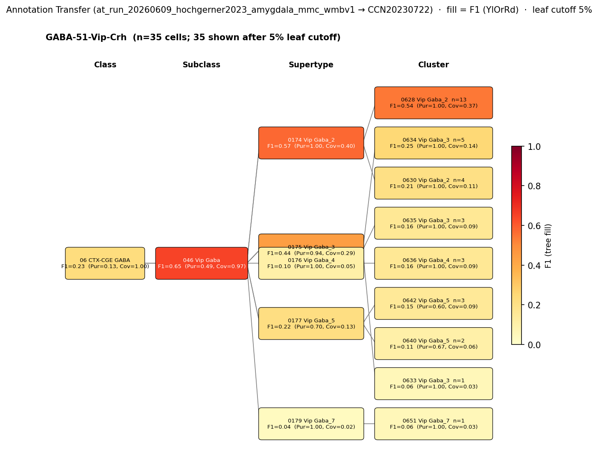

# Basolateral amygdala VIP/calretinin interneuron-selective interneuron — CCN20230722 Mapping Report
*2026-06-10 · Source: `kb/graphs/medial_temporal_lobe_amygdala/20260528_medial_temporal_lobe_amygdala_report_ingest.yaml`*

---

## Introduction

VIP/calretinin-expressing interneuron-selective (IS) interneurons are the most abundant GABAergic subpopulation in the basolateral amygdala (BLA), constituting an estimated 29–38% of all GABAergic cells in the lateral and basal amygdala [2]. They are defined by co-expression of vasoactive intestinal peptide (VIP), calretinin (Calb2), and cholecystokinin (CCK), and are characterised by a small bipolar or bitufted morphology [1]. Their classification as "interneuron-selective" reflects their preferential synaptic targets — other interneurons rather than principal cells — placing them in a disinhibitory circuit role. Mapping this classical type to the Allen WMBv1 mouse atlas is important for integrating classical immunohistochemical cell-type work with transcriptomic taxonomy and for grounding fear-circuit models in a reference atlas.

### Classical type properties

| Property | Value | References |
|---|---|---|
| Soma location | Basolateral amygdala [UBERON:0002887] | [1], [2] |
| Neurotransmitter | GABAergic | [1], [2] |
| Defining markers | Vip, Calb2, Cck | [1], [2], [3], [4] |
| Negative markers | Pvalb, Sst | — |
| Neuropeptides | Vip, Cck | [1], [2] |

*The node-level annotation acknowledges molecular heterogeneity within this class: VIP and/or calretinin co-expression is the defining criterion; not all cells co-express all three markers at equal levels.*

<details>
<summary>Details — source evidence for classical type properties</summary>

- **Soma location / NT / morphology / Calb2+Vip+Cck markers:** Immunohistochemical study (dual-labelling) · mouse / rat BLA · [1]
  > The principal neurons in the CBL are pyramidal-like projection neurons with spiny dendrites that utilize glutamate as an excitatory neurotransmitter, whereas most non-pyramidal neurons in the CBL are spine-sparse interneurons that utilize GABA as an inhibitory neurotransmitter (McDonald, 1982)(McDonald, 1985)(McDonald, , 1992a(McDonald, ,b, 1996(McDonald, , 2003(Millhouse et al., 1983)(Fuller et al., 1987)(Carlsen et al., 1988)(McDonald et al., 1993). Dual-labeling immunohistochemical studies in the basolateral amygdala suggest that the CBL contains at least four distinct subpopulations of GABAergic non-pyramidal neurons that can be distinguished on the basis of their content of calcium-binding proteins and peptides. These subpopulations are: (1) PV+/CB+ neurons, (2) SOM+/CB+ neurons, (3) large multipolar cholecystokinin+ neurons that are often CB+, and (4) small bipolar and bitufted interneurons that exhibit extensive colocalization of calretinin, cholecystokinin, and vasoactive intestinal peptide (Kemppainen and Pitkänen, 2000;McDonald and Betette, 2001;Mascagni, 2001, 2002;
  > — McDonald et al. 2012, Basolateral amygdala neuronal subtypes · [1] <!-- quote_key: 11544073_ea8d2bb3 -->

- **Soma location / NT / defining markers / neuropeptides (cell count estimates):** Stereological cell-counting immunohistochemistry · mouse lateral and basal amygdala · [2]
  > we estimated that the following cell types together compose the vast majority of GABAergic cells in the LA and BA: axo-axonic cells (5.5%-6%), basket cells expressing parvalbumin (17%-20%) or cholecystokinin (7%-9%), dendrite-targeting inhibitory cells expressing somatostatin (10%-16%), NPY-containing neurogliaform cells (14%-15%), VIP and/or calretinin-expressing interneuron-selective interneurons (29%-38%), and GABAergic projection neurons expressing somatostatin and neuronal nitric oxide synthase (5.5%-8%). Our results show that these amygdalar nuclei contain all major GABAergic neuron types as found in other cortical regions.
  > — Vereczki et al. 2021, Basolateral amygdala neuronal subtypes · [2] <!-- quote_key: 232283078_d4238834 -->

- **Vip marker (scRNA-seq context, Grpr co-expression):** scRNA-seq atlas (Hochgerner 2023 amygdala) · mouse amygdala · [3]
  > sparse, but specific expression of Grpr in several GABAergic interneurons, such as Vip-expressing GABA-50 and GABA-51, Pvalb-type GABA-41
  > — Hochgerner et al. 2023, Two classes of glutamatergic neurons par · [3] <!-- quote_key: 264517392_039d73c7 -->

- **Calb2 marker (primate cross-species):** Spatial transcriptomics / snRNA-seq · nonhuman primate amygdala · [4]
  > both clusters showed increased expression of genes (Fig. 3B) encoding calretinin (CALB2), cholecystokinin (CCK), corticotropin releasing hormone (CRH), cannabinoid receptor 1 (CNR1)
  > — Totty et al. 2024, GABAergic neuron types in the primate amygdala show distributed or subregion specific expression patterns · [4] <!-- quote_key: 273531817_447a3097 -->

</details>

### Cell Ontology mapping

Cell Ontology mapping: GABAergic interneuron [[CL:0011005](https://www.ebi.ac.uk/ols4/ontologies/cl/classes?obo_id=CL:0011005)] (BROAD).

*(Note: this is an auto-proposed broad mapping requiring expert review. The BLA VIP/calretinin IS interneuron is a well-characterised type that may be eligible for a more specific CL term.)*

---

## Results

One candidate atlas cluster was assessed; 0628 Vip Gaba_2 [CS20230722_CLUS_0628] in supertype 0174 Vip Gaba_2 (CS20230722_SUPT_0174) is the primary mapping at LOW confidence under a `skos:broadMatch` relationship. The broadMatch reflects the distributed nature of the source type across five co-equal Vip Gaba clusters at Stage A discovery and the low region_fraction of CS20230722_CLUS_0628 in the BLA.

### Annotation-transfer overview



*F1 across taxonomy levels for the 1 source group relevant to the Basolateral amygdala VIP/calretinin IS interneuron (Hochgerner 2023 GABA-51-Vip-Crh, n=72 naive cells after filtering). Each panel row is a source-cell group; nodes are coloured by F1 with **Purity** (Pur) and **Coverage** (Cov) shown inline. Coverage = fraction of source-group cells landing on this target; Purity = fraction of this target's cells coming from the source group. With a single source group, Purity is high at every target and only Coverage discriminates. F1 ≥ 0.5 at a level indicates a clean mapping at that resolution.*

At SUBCLASS level, GABA-51-Vip-Crh cells map to 046 Vip Gaba (CS20230722_SUBC_046; F1=0.65, Purity=0.49, Coverage=0.97), confirming the CGE/VIP lineage. At SUPERTYPE level, the best target is 0174 Vip Gaba_2 (CS20230722_SUPT_0174; F1=0.57, Coverage=0.40, Purity=1.0). At CLUSTER level, 0628 Vip Gaba_2 [CS20230722_CLUS_0628] is best (F1=0.54, Coverage=0.37, Purity=1.0).

Caveat: GABA-51-Vip-Crh is a transcriptomically-defined label from the Hochgerner 2023 atlas and does not directly correspond to the classical morpho-electrophysiological IS interneuron definition; the source-to-KB matching is marker-based.

### Mapping candidates table

| Rank | WMBv1 cluster | Supertype | Cells (10x) | Confidence | Key property alignment | Verdict |
|---|---|---|---|---|---|---|
| 1 | 0628 Vip Gaba_2 [CS20230722_CLUS_0628] | 0174 Vip Gaba_2 (CS20230722_SUPT_0174) | 1,401 | 🔴 LOW | Calb2 CONSISTENT · Vip CONSISTENT · Cck APPROXIMATE | Speculative — broadMatch across five co-equal Vip Gaba clusters |

*1 edge assessed; relationship: `skos:broadMatch`.*

---

### 0628 Vip Gaba_2 [CS20230722_CLUS_0628] · 🔴 LOW

**Table 1 — Property comparison**

| Property | Classical | Supertype | Best cluster | Alignment |
|---|---|---|---|---|
| Soma location | Basolateral amygdala [UBERON:0002887] | MBA:295 BLA present; region_fraction 0.049 | MBA:295 BLA present | CONSISTENT |
| NT type | GABAergic | GABA | GABA | CONSISTENT |
| Calb2 expression | Calb2 — defining marker | not available | Calb2 precomputed mean 8.12 (98.3rd pct; tier 2) | CONSISTENT |
| Vip (neuropeptide) | Vip — neuropeptide | not available | Vip precomputed mean 11.11 (96.9th pct; tier 2) | CONSISTENT |
| Cck (neuropeptide) | Cck — neuropeptide | not available | Cck mean 0.97 (41.7th pct; tier 1 — low reliability) | APPROXIMATE |
| Pvalb (negative) | Pvalb — negative marker | not available | NOT_ASSESSED | NOT_ASSESSED |
| Sst (negative) | Sst — negative marker | not available | NOT_ASSESSED | NOT_ASSESSED |
| Sex ratio | not documented | not available | not assessed | NOT_ASSESSED |

**Table 2 — Evidence support**

| Evidence | Type | Supports | Headline | Source |
|---|---|---|---|---|
| McDonald 2012 BLA subpopulations | Literature | SUPPORT | IS interneuron description; BLA Calb2/Vip/Cck co-expression | [1] |
| CS20230722_CLUS_0628 atlas metadata | Atlas metadata | SUPPORT | Calb2 98.3rd pct, Vip 96.9th pct — both tier-2 | — |
| Hochgerner 2023 MapMyCells AT | Annotation transfer | SUPPORT | F1=0.65 at SUBCLASS; F1=0.57 at SUPERTYPE; F1=0.54 at CLUSTER | — |

*(Child-cluster breakdown not assessed — five Vip Gaba rank-0 clusters score equally at Stage A discovery; see proposed experiments.)*

**Supporting evidence**

- **Literature (McDonald 2012 [1]):** McDonald et al. characterise BLA VIP/calretinin cells as the IS subclass ("small bipolar and bitufted interneurons that exhibit extensive colocalization of calretinin, cholecystokinin, and vasoactive intestinal peptide"). This is an immunohistochemical (protein-level, dual-label immunofluorescence) study and constitutes the primary literature anchor for the classical type. Cell-type identity is grounded in morphological description (bipolar/bitufted) combined with marker co-expression at protein level.

- **Literature (Vereczki 2021 [2]):** Independent stereological counting in mouse LA and BA confirms VIP and/or calretinin-expressing IS interneurons at 29–38% of the GABAergic population, consistent with McDonald 2012 and providing a quantitative abundance estimate. Also based on immunohistochemistry (protein level).

- **Atlas metadata (CS20230722_CLUS_0628):** CS20230722_CLUS_0628 "0628 Vip Gaba_2" shows both Calb2 (mean 8.12, 98.3rd percentile in the BLA/amygdala GABAergic cohort, tier-2) and Vip (mean 11.11, 96.9th percentile, tier-2) as defining high-expression markers. These precomputed values directly confirm the classical Calb2/Vip co-expression criterion at the transcript level. Cck is tier-1 only (mean 0.97, 41.7th pct), which is a partial match.

- **Annotation transfer (GABA-51-Vip-Crh → WMBv1, `at_run_20260609_hochgerner2023_amygdala_mmc_wmbv1`):** MapMyCells (cell_type_mapper v1.7.1) applied to Hochgerner 2023 naive amygdala cells (n=72 GABA-51 cells after filtering from 55,514 total). At SUBCLASS level (046 Vip Gaba, CS20230722_SUBC_046): F1=0.65, Coverage=0.97, Purity=0.49 — strong subclass-level confirmation of the CGE/VIP lineage. At SUPERTYPE level (0174 Vip Gaba_2, CS20230722_SUPT_0174): F1=0.57, Coverage=0.40, Purity=1.0. At CLUSTER level (0628 Vip Gaba_2 [CS20230722_CLUS_0628]): F1=0.54, Coverage=0.37, Purity=1.0.

**Marker evidence provenance**

- **Vip:** Evidence is both protein-level (immunohistochemistry: McDonald 2012 [1]; Vereczki 2021 [2]) and transcript-level (scRNA-seq, Hochgerner 2023 [3]). Both levels agree. Atlas precomputed expression for CS20230722_CLUS_0628 is Vip mean 11.11 (tier 2), confirming defining-marker status at the transcript level.

- **Calb2:** Evidence is protein-level (IHC: McDonald 2012 [1]; Vereczki 2021 [2]) and transcript-level cross-species (primate snRNA-seq: Totty 2024 [4]). Atlas precomputed expression for CS20230722_CLUS_0628 is Calb2 mean 8.12 (tier 2), consistent with defining-marker status. *(Note: Totty 2024 [4] is from nonhuman primate amygdala; cross-species differences may exist, but Calb2 co-expression in the VIP/calretinin class appears conserved.)*

- **Cck:** Evidence is protein-level only (IHC: McDonald 2012 [1]; Vereczki 2021 [2]). Atlas precomputed expression for CS20230722_CLUS_0628 is Cck mean 0.97 (41.7th percentile, tier 1 — low reliability). This is a discrepancy between protein-level literature evidence and atlas transcript-level expression.

  **Atlas annotation/expression discrepancy (Cck):** Cck is listed as a neuropeptide/defining marker for this classical type but CS20230722_CLUS_0628 shows precomputed mean expression = 0.97 (tier 1, 41.7th percentile — low reliability). This may reflect that CCK co-expression characterises a VIP/calretinin subset not well-captured by the GABA-51-Vip-Crh source label, that CCK is expressed heterogeneously below the cluster-level mean, or that a different Vip Gaba cluster better matches the classical Cck+ criterion. Flagged for investigation.

- **Negative markers (Pvalb, Sst):** Not assessed at the atlas level for this edge. The classical definition excludes Pvalb+ and Sst+ cells; no precomputed expression check was performed on CS20230722_CLUS_0628 for these markers in this mapping pass.

**Concerns**

- **DISTRIBUTED_ACROSS_CLUSTERS:** Five Vip Gaba clusters tie at Stage A discovery score 6 in a cohort of 5 BLA GABAergic rank-0 clusters (next_best_score=6, rank_in_cohort=1). This means no single cluster dominates — the classical IS interneuron type may not resolve to a single WMBv1 cluster.
- **Low region_fraction (0.049):** Only 4.9% of CS20230722_CLUS_0628 cells are in MBA:295 (BLA). This is well below the 0.30 lower boundary band, meaning CS20230722_CLUS_0628 is predominantly an extra-BLA cluster. The CONSISTENT location call reflects BLA presence, but the low fraction is a concern for specificity — CS20230722_CLUS_0628 may represent a broader cortical VIP population rather than a BLA-specific one.
- **Cck APPROXIMATE:** Low atlas Cck expression (tier 1, 41.7th pct) partially undermines the classical Cck+ definition.
- **AT coverage scatter:** At CLUSTER level, only 37% of GABA-51-Vip-Crh cells land on CS20230722_CLUS_0628; the remaining 63% distribute across eight other clusters, consistent with the broadMatch interpretation.

**What would upgrade confidence**

- **Patch-seq annotation transfer:** Obtain patch-seq transcriptomes from morphologically verified BLA IS interneurons (Calb2+/Vip+, bipolar/bitufted morphology confirmed by post-hoc IHC or Cre-driver targeting). Run MapMyCells against WMBv1 targeting F1 ≥ 0.50 at CLUSTER level. This would add `AnnotationTransferEvidence` grounded in the classical morphological definition and could resolve the cluster-level scatter. *(The Hochgerner 2023 AT partially addresses this but lacks morphological confirmation.)*
- **Cluster-level Cck expression check:** Query precomputed Cck expression across all child clusters of CS20230722_SUPT_0174 to identify whether any cluster shows tier-2 Cck, which would refine the primary edge target.
- **Negative marker validation:** Confirm Pvalb and Sst expression at or near zero in CS20230722_CLUS_0628 using precomputed atlas statistics. This would resolve the two NOT_ASSESSED property comparisons.
- **Targeted literature search:** A cite-traverse for "VIP calretinin interneuron amygdala electrophysiology" and "IS interneuron BLA patch-clamp" could surface papers with morpho-electrophysiological classification alongside molecular markers, strengthening the classical node definition.

---

### Pool candidates assessment (CASE B)

The pool-candidates pre-pass flags a CLASS-level AT overlap between `bla_cck_basket_cell` and `bla_vip_calretinin_interneuron`: both map to CS20230722_CLAS_06 (06 CTX-CGE GABA) with identical AT metrics (F1=0.23, Coverage=1.0, Purity=0.13). This overlap is at a very coarse taxonomic resolution (CLASS level, CGE-GABA class), and only anatomy and NT panels were assessed — markers, morphology, ephys, and developmental origin were not compared. The two types are biologically distinct: VIP/calretinin IS interneurons are small bipolar/bitufted cells targeting other interneurons, while CCK basket cells are large multipolar neurons targeting principal cell perisomatic compartments. No transcriptomic indistinguishability call is warranted (**CASE B** — AT-only, CLASS level only; `lit_to_lit_edges` not emitted).

---

### Methods

<details>
<summary>Data sources, analyses, and reproducibility receipts</summary>

**Classical type definition.**
The BLA VIP/calretinin interneuron-selective interneuron is defined on a CLASSICAL evidentiary basis: small bipolar and bitufted non-pyramidal neurons in the basolateral amygdala [UBERON:0002887] characterised by immunohistochemical co-expression of calretinin (Calb2), VIP, and CCK [1], [2], [3], [4]. These cells are GABAergic [1], [2] and are negative for parvalbumin (Pvalb) and somatostatin (Sst). They constitute the largest GABAergic subclass in the BLA (29–38% of all GABAergic cells [2]).

**Atlas mapping query.**
Candidate atlas clusters were retrieved from the CCN20230722 taxonomy at ranks 0 (cluster) and 1 (supertype) using metadata-based scoring (region match, NT type, defining markers, sex bias when applicable). Full scoring rules: `workflows/map-cell-type.md`.

**Property alignment.**
Each defining property of the classical type was compared to the corresponding atlas-side value via the `property_comparisons` schema, with alignments graded CONSISTENT / APPROXIMATE / DISCORDANT / NOT_ASSESSED. Atlas-side numerical values came from precomputed expression on the cluster (cluster.yaml in the taxonomy reference store) and from MERFISH spatial registration for soma location.

**Annotation transfer.**

| Field | Value |
|---|---|
| Source dataset | ArrayExpress:E-MTAB-12096 (GABA-51-Vip-Crh) |
| Source species | NCBITaxon:10090 (Mus musculus) |
| Target atlas | WMBv1 (CCN20230722; SHA-256: b21ca985) |
| Method | MapMyCells local (cell_type_mapper v1.7.1, default parameters, raw normalization, 100 bootstrap iterations). Input h5ad built from Hochgerner 2023 figshare UMI count table: genes x cells TSV converted to cells x genes h5ad, filtered to naive neuronal cells. Gene names are gene symbols as in source file. F1 scoring against celltype source labels. |
| Tool version | cell_type_mapper v1.7.1 |
| Bootstrap threshold | 0.7 |
| n cells | 55,514 (filtered to 7,777) |
| Run record | [`kb/annotation_transfer_runs/at_run_20260609_hochgerner2023_amygdala_mmc_wmbv1/manifest.yaml`](../../kb/annotation_transfer_runs/at_run_20260609_hochgerner2023_amygdala_mmc_wmbv1/manifest.yaml) |
| Code reference | [https://github.com/AllenInstitute/cell_type_mapper](https://github.com/AllenInstitute/cell_type_mapper) |
| F1 matrix | [`kb/annotation_transfer_runs/at_run_20260609_hochgerner2023_amygdala_mmc_wmbv1/f1_matrix.csv`](../../kb/annotation_transfer_runs/at_run_20260609_hochgerner2023_amygdala_mmc_wmbv1/f1_matrix.csv) |
| Caveats | Source labels are transcriptomically-defined types, not classical morpho-electrophysiological types. Matching to KB classical nodes requires a mapping step (Hochgerner type -> classical node) based on shared molecular markers. Fear-conditioned cells excluded to avoid transcriptional-state confounds. Non-neuronal cells excluded. Gene symbols used (not Ensembl IDs); matched against WMBv1 marker genes. |

**Anti-hallucination.**
All citations, atlas accessions, ontology CURIEs, and verbatim literature quotes in this report are validated against the evidencell knowledge base at write time. Authored-prose evidence narratives are validated against their source `evidence_items[*].explanation` fields. The pre-write hook rejects any unresolvable identifier or unattributed blockquote. Specific mapping limitations and caveats are documented per-candidate in the Discussion section.

**Evidence base table**

| Edge ID | Evidence types | Supports | Source |
|---|---|---|---|
| edge_bla_vip_calretinin_interneuron_to_cs20230722_clus_0628 | LITERATURE; ATLAS_METADATA; ANNOTATION_TRANSFER | SUPPORT; SUPPORT; SUPPORT | [1]; —; — |

*Generated by evidencell `9d82411` at 2026-06-10T12:49:05+00:00 from [kb/graphs/medial_temporal_lobe_amygdala/20260528_medial_temporal_lobe_amygdala_report_ingest.yaml](../../kb/graphs/medial_temporal_lobe_amygdala/20260528_medial_temporal_lobe_amygdala_report_ingest.yaml).*

</details>

---

## Discussion

### Best candidate + caveats

**Primary mapping:** Basolateral amygdala VIP/calretinin interneuron-selective interneuron → 0628 Vip Gaba_2 [CS20230722_CLUS_0628] at LOW confidence. Key support: atlas precomputed expression confirms Calb2 (98.3rd pct, tier-2) and Vip (96.9th pct, tier-2) co-expression matching the classical defining-marker profile; annotation transfer (Hochgerner 2023 GABA-51-Vip-Crh via MapMyCells, `at_run_20260609_hochgerner2023_amygdala_mmc_wmbv1`) reaches F1=0.65 at SUBCLASS and F1=0.54 at CLUSTER. Key caveats: five Vip Gaba clusters score equally at Stage A discovery (DISTRIBUTED_ACROSS_CLUSTERS), indicating a potential 1:N or cross-cutting mapping; region_fraction for CS20230722_CLUS_0628 is only 0.049 (BLA-minority cluster); and Cck expression is APPROXIMATE (tier 1) rather than CONSISTENT.

The Cell Ontology has no specific term for this population; GABAergic interneuron [[CL:0011005](https://www.ebi.ac.uk/ols4/ontologies/cl/classes?obo_id=CL:0011005)] is the closest assigned ancestor. This auto-proposed broad mapping requires expert review — the BLA VIP/calretinin IS interneuron may be eligible for a more specific CL term.

### Proposed experiments and follow-ups

**1. Annotation transfer on IS interneuron patch-seq transcriptomes**

- **What:** Run MapMyCells on patch-seq transcriptomes from morphologically reconstructed and IHC-confirmed BLA IS interneurons (Calb2+/Vip+, bipolar/bitufted morphology).
- **Target:** F1 ≥ 0.50 at CLUSTER level; resolve scatter across five Vip Gaba clusters.
- **Expected output:** `AnnotationTransferEvidence` grounded in the classical morphological definition.
- **Resolves:** Whether the mapping is 1:1 to CS20230722_CLUS_0628 or 1:N across multiple Vip Gaba clusters; addresses molecular heterogeneity open question.

*(Partially addressed: the Hochgerner 2023 AT run used transcriptomically-defined source labels without morphological confirmation. A patch-seq run would provide the direct morphological bridge.)*

**2. Cluster-level Cck expression investigation**

- **What:** Query precomputed Cck expression across all child clusters of CS20230722_SUPT_0174 and sibling Vip Gaba supertypes using the taxonomy reference DB.
- **Target:** Identify whether any cluster shows tier-2 Cck expression.
- **Expected output:** Revised `neuropeptide_Cck` property comparison; possible edge target revision if a different cluster better matches the classical Cck+/Vip+/Calb2+ profile.
- **Resolves:** Cck discrepancy between classical literature and atlas metadata.

**3. Negative marker validation**

- **What:** Query precomputed Pvalb and Sst expression in CS20230722_CLUS_0628 and sibling Vip Gaba clusters.
- **Target:** Near-zero expression confirming negative marker criteria.
- **Expected output:** Resolved NOT_ASSESSED alignments for `negative_marker_Pvalb` and `negative_marker_Sst`.
- **Resolves:** Validates the exclusion criteria for CS20230722_CLUS_0628.

**4. Targeted literature search**

- **What:** Cite-traverse for "VIP calretinin interneuron amygdala electrophysiology" and "IS interneuron BLA patch-clamp".
- **Expected output:** `LiteratureEvidence` items with morphology, electrophysiology, and developmental-origin snippets for the classical node.
- **Resolves:** Fills morphology/ephys gaps on the classical node; clarifies whether CCK co-expression is universal or a subtype feature.

### Open questions

1. Which of the five Vip Gaba rank-0 clusters best matches the BLA VIP/calretinin IS interneuron? Resolve by annotation transfer targeting F1 ≥ 0.50 at CLUSTER level.
2. Which Vip Gaba cluster, if any, captures the IS morphological specialisation (bipolar/bitufted, interneuron-targeting synaptic targets)?
3. Does the VIP/calretinin population map to one cluster or multiple (1:N / CrossCuttingMatch) given the acknowledged molecular heterogeneity?

---

## References

| # | Citation | PMID | Used for |
|---|---|---|---|
| [1] | McDonald et al. 2012 | [22837739](https://pubmed.ncbi.nlm.nih.gov/22837739/) | Soma location, NT, defining markers, morphology, neuropeptides |
| [2] | Vereczki et al. 2021 | [33837051](https://pubmed.ncbi.nlm.nih.gov/33837051/) | Soma location, NT, defining markers, cell-count estimates |
| [3] | Hochgerner et al. 2023 | [37884748](https://pubmed.ncbi.nlm.nih.gov/37884748/) | Vip marker (scRNA-seq); AT source dataset |
| [4] | Totty et al. 2024 | [39463931](https://pubmed.ncbi.nlm.nih.gov/39463931/) | Calb2 marker (primate cross-species) |

---

<!-- verdict-block-start: edge_bla_vip_calretinin_interneuron_to_cs20230722_clus_0628 -->
```yaml
verdict:
  confidence: LOW
  confidence_score: 0.25
  rationale: >
    Calb2 (marker_Calb2 CONSISTENT; precomputed mean 8.12, 98.3rd pct tier-2)
    and Vip (neuropeptide_Vip CONSISTENT; 96.9th pct tier-2) anchor the
    broadMatch to CS20230722_CLUS_0628; 2 of 5 markers CONSISTENT.
    AT (GABA-51-Vip-Crh, `at_run_20260609_hochgerner2023_amygdala_mmc_wmbv1`)
    reaches F1=0.65 at SUBCLASS and F1=0.54 at CLUSTER — below the 0.75
    threshold for HIGH confidence. Coverage at CLUSTER is 0.37; scatter
    across five co-equal Vip Gaba clusters (DISTRIBUTED_ACROSS_CLUSTERS).
    region_fraction=0.049 is very low (BLA-minority cluster). Cck is
    APPROXIMATE (tier 1 only).
  reconciliation_note: >
    Pool-candidates flagged CLASS-level AT overlap with bla_cck_basket_cell
    (both map to CS20230722_CLAS_06 with identical F1=0.23, Coverage=1.0).
    This is a coarse CLASS-level coincidence only; anat and NT panels assessed,
    markers/morphology/ephys not assessed — CASE B, no lit_to_lit_edges emitted.
    The two types are biologically distinct (IS interneurons vs. perisomatic
    basket cells).
  unresolved_questions:
    - >
      Which of the five Vip Gaba rank-0 clusters best matches the BLA
      VIP/calretinin IS interneuron — resolve by patch-seq annotation transfer
      targeting F1 >= 0.50 at CLUSTER level.
    - >
      Determine whether the VIP/calretinin population maps to one cluster or
      multiple (1:N / CrossCuttingMatch) given acknowledged molecular
      heterogeneity.
    - >
      Which Vip Gaba cluster captures the IS morphological specialisation
      (bipolar/bitufted, interneuron-targeting)?
```
<!-- verdict-block-end -->
