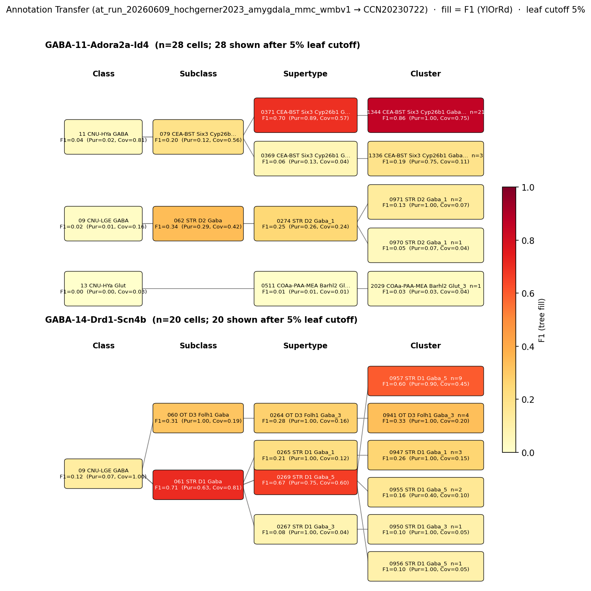

# Central amygdala medium spiny neuron — CCN20230722 Mapping Report
*· Source: `kb/graphs/medial_temporal_lobe_amygdala/20260528_medial_temporal_lobe_amygdala_report_ingest.yaml`*

---

## Introduction

The central amygdala medium spiny neuron (CeA MSN) is a morphologically distinctive GABAergic cell type defined by its ovoid soma, primary non-spiny dendrites branching into spiny secondary and tertiary processes — a profile that closely parallels striatal medium spiny neurons and is consistent with the CeA's striatopallidal-like developmental lineage [1]. Ppp1r1b (DARPP-32), a phosphoprotein enriched in striatal medium spiny neurons, has been linked to lateral CeA types [4], representing the candidate molecular marker for this population. CeA MSNs are the predominant cell type of the lateral CeA, and the CeA as a whole is primarily GABAergic [2], [3]. Mapping this classical type to the WMBv1 atlas enables alignment of morphologically defined CeA projection neurons with transcriptomically defined cell clusters, facilitating cross-species comparisons and circuit-level analyses.

### Classical type description

| Property | Value | References |
|---|---|---|
| Soma location | Central amygdaloid nucleus [UBERON:0002883] | [1] |
| Neurotransmitter | GABAergic | [2], [3] |
| Defining markers | Ppp1r1b (DARPP-32) | [4] |
| Negative markers | — | — |
| Neuropeptides | — | — |
| Morphology | Ovoid soma; primary non-spiny dendrites; spiny secondary and tertiary dendrites; medium spiny profile | [1] |
| CL term | [CL:1001474](https://www.ebi.ac.uk/ols4/ontologies/cl/classes?obo_id=CL:1001474) (BROAD) | — |
| Definition basis | CLASSICAL | — |

<details>
<summary>Details — source evidence for classical type properties</summary>

- **Soma location:** literature (Nikolenko et al. 2020) · Central amygdaloid nucleus [UBERON:0002883] · [1]
  > Morphologically, there are several types of neurons located in the central nucleus of the amygdala (CeA). In the lateral sector of the central nucleus, a predominant cell type with ovoid soma is located. These cells have several primary nonspiny dendrites, branching onto spiny secondary and tertiary dendrite. Their axons begin branching even before leaving the nucleus, which is why these cells are called "medium spiny neurons" (Hall, 2004)(McDonald, 1982). Another type of neurons located in the central nuclei have big soma with thick aspiny dendrites, branching on to secondary seldom spiny processes (McDonald, 1982)(Cassell et al., 1989) (Schiess et al., 1999). The third type of cells are small aspiny neurons (Cassell et al., 1989)
  > — Nikolenko et al. 2020, Central amygdala cell types · [1] <!-- quote_key: 220976356_f1fe3fe1 -->

- **Morphology:** literature (Nikolenko et al. 2020) · ovoid soma, primary non-spiny / spiny secondary dendrites · [1]
  (same source as above; quote_key: 220976356_f1fe3fe1)

- **Neurotransmitter (GABAergic):** literature (Ignacio et al. 2014) · CeA majority GABAergic · [2]
  > Neuronal types differ considerably among the subdivisions of the amygdala (Sah et al., 2003). In the basolateral group, approximately 70% of neurons are thought to be glutamatergic (pyramidal, spiny, or class I neurons). This division also contains interneurons such as GABAergic nonspiny stellate cells of the cortex (called S cells, stellate, or class II neurons). In contrast, within the central nucleus, the majority of cells are thought to be GABAergic.
  > — Ignacio et al. 2014, Classical neuron classes across amygdala subdivisions · [2] <!-- quote_key: 1229611_f7a0a034 -->

- **Neurotransmitter (GABAergic):** literature (Gilpin et al. 2014) · CeA primarily GABAergic · [3]
  > The central amygdala (CeA) plays a central role in physiological and behavioral responses to fearful stimuli, stressful stimuli, and drug-related stimuli. The CeA receives dense inputs from cortical regions, is the major output region of the amygdala, is primarily GABAergic (inhibitory), and expresses high levels of pro- and anti-stress peptides. The CeA is also a constituent region of a conceptual macrostructure called the extended amygdala that is recruited during the transition to alcohol dependence. In this review, we discuss neurotransmission in the CeA as a potential integrative hub between anxiety disorders and Alcohol Use Disorder (AUD), which are commonly co-occurring in humans. Human imaging work and multi-disciplinary work in animals collectively suggest that CeA structure and function are altered in individuals with anxiety disorders and AUD, the end result of which may be disinhibition of downstream "effector" regions that regulate anxiety- and alcohol-related behaviors.
  > — Gilpin et al. 2014, Central amygdala cell types · [3] <!-- quote_key: 442779_deea5502 -->

- **Defining marker (Ppp1r1b):** literature (Hochgerner et al. 2023) · Ppp1r1b types correlate with lateral CEA · [4]
  > The Ppp1r1b types correlated with the lateral CEA
  > — Hochgerner et al. 2023, Inhibitory neurons of valence-learning modulation and output · [4] <!-- quote_key: 264517392_113398c6 -->

</details>

### Cell Ontology mapping

Cell Ontology mapping: [CL:1001474](https://www.ebi.ac.uk/ols4/ontologies/cl/classes?obo_id=CL:1001474) (BROAD). The Cell Ontology has no specific term for this CeA medium spiny subpopulation; CL:1001474 is the closest available ancestor. This mapping was auto-proposed by asta-report-ingest and requires expert review.

---

## Results

One candidate atlas cluster was assessed; 1344 CEA-BST Six3 Cyp26b1 Gaba_5 [CS20230722_CLUS_1344] in supertype 0371 CEA-BST Six3 Cyp26b1 Gaba_5 is the primary mapping at LOW confidence (skos:broadMatch).

### Annotation transfer overview



*F1 across taxonomy levels for two Hochgerner 2023 source groups relevant to the Central amygdala medium spiny neuron: GABA-11-Adora2a-Id4 (n=79 cells; 25 retained after filter) and GABA-14-Drd1-Scn4b (n=29 cells; 28 retained after filter). Each panel row is a source-cell group; nodes are coloured by F1 with **Purity** (Pur) and **Coverage** (Cov) shown inline. Coverage = fraction of source-group cells landing on this target; Purity = fraction of this target's cells coming from the source group. With multiple source groups in the figure, cross-group Purity comparisons reveal which source contributes most selectively to each target. F1 ≥ 0.5 at a level indicates a clean mapping at that resolution.*

AT was performed with MapMyCells (cell_type_mapper v1.7.1) mapping Hochgerner 2023 amygdala naive cells (ArrayExpress:E-MTAB-12096) to WMBv1. The D2-type source GABA-11-Adora2a-Id4 maps to the CEA-BST Six3 Cyp26b1 Gaba subclass (079 CEA-BST Six3 Cyp26b1 Gaba, CS20230722_SUBC_079) and achieves CLUSTER-level F1=0.86 (Purity=1.00, Coverage=0.75) for 1344 CEA-BST Six3 Cyp26b1 Gaba_5 [CS20230722_CLUS_1344], supporting the nominated mapping target. The D1-type source GABA-14-Drd1-Scn4b maps instead to the STR D1 Gaba subclass (061 STR D1 Gaba, CS20230722_SUBC_061) with SUBCLASS-level F1=0.71 (Purity=0.63, Coverage=0.81), reflecting a distinct D1 striatal lineage. The divergence between the two source groups is consistent with the MSN heterogeneity documented in the classical type and supports CLUS_1344 (D2-type) as the primary mapping while flagging D1-type MSN admixture as a secondary component.

### Mapping candidates table

| Rank | WMBv1 cluster | Supertype | Cells (10x) | Confidence | Key property alignment | Verdict |
|---|---|---|---|---|---|---|
| 1 | 1344 CEA-BST Six3 Cyp26b1 Gaba_5 [CS20230722_CLUS_1344] | 0371 CEA-BST Six3 Cyp26b1 Gaba_5 | 730 | 🔴 LOW | NT: CONSISTENT; Adora2a+ subset maps CLUS_1344 | Speculative |

*1 edge total; relationship: skos:broadMatch.*

### Property alignment table — 1344 CEA-BST Six3 Cyp26b1 Gaba_5 [CS20230722_CLUS_1344]

**Table 1 — Property comparison**

| Property | Classical | Atlas cluster | Alignment |
|---|---|---|---|
| Soma location | Central amygdaloid nucleus [UBERON:0002883] | MBA:536 — AT maps CeA-isolated cells to CLUS_1344 "CEA-BST Six3 Cyp26b1 Gaba_5"; Six3/Cyp26b1 mark the central extended amygdala lineage. WMBv1 region_fraction not in CeA survival cohort — cluster may be more densely sampled in BST by the atlas, but source cells were CeA-isolated. | CONSISTENT |
| NT type | GABAergic | GABA | CONSISTENT |
| Morphology (medium spiny) | Medium spiny morphology — ovoid soma, branching spiny secondary/tertiary dendrites; predominant cell type in lateral CeA (PMID:32751957) | NOT_ASSESSED — morphological information not available from WMBv1 transcriptomic atlas. | NOT_ASSESSED |
| Marker: Ppp1r1b | Ppp1r1b (DARPP-32) — defining marker for striatal-lineage CeA MSNs | NOT_ASSESSED — Ppp1r1b expression in CLUS_1344 not confirmed from available precomputed expression data. | NOT_ASSESSED |

*Notes on location: the CEA-BST label confirms amygdalar lineage; low WMBv1 CeA region_fraction does not negate CeA identity — Hochgerner isolated cells from CeA where this transcriptomic type is present.*

**Table 2 — Evidence support**

| Evidence | Type | Supports | Headline | Source |
|---|---|---|---|---|
| Nikolenko et al. 2020 — classical CeA MSN morphology and anatomy | Literature | PARTIAL | Classical type definition; no transcriptomic mapping | [1] |
| Atlas metadata — CLUS_1344 extended amygdala lineage | Atlas metadata | PARTIAL | 42/45 cells from GABA-11-Adora2a-Id4 (purity 0.933); CEA-BST Six3/Cyp26b1 lineage | atlas-internal |
| MapMyCells AT — GABA-11-Adora2a-Id4 → CLUS_1344 | Annotation transfer | PARTIAL | F1=0.86 at cluster level; F1=0.70 at supertype level | — |
| MapMyCells AT — GABA-14-Drd1-Scn4b → STR D1 Gaba | Annotation transfer | AGAINST | Best F1=0.71 at subclass, maps to STR D1 not CeA lineage; D1+ MSN subset is distinct | — |

*(Child-cluster breakdown not assessed — cluster-level data available via AT evidence only; see proposed experiments.)*

---

### 1344 CEA-BST Six3 Cyp26b1 Gaba_5 · 🔴 LOW

**Supporting evidence:**

- **Literature (PARTIAL).** Nikolenko et al. 2020 describe CeA MSNs as the predominant lateral CeA cell type with striatal-like morphology and DARPP-32 (Ppp1r1b) expression, establishing the classical morphological definition [1]. This evidence provides the biological rationale for the node but does not supply transcriptomic mapping.

  > Morphologically, there are several types of neurons located in the central nucleus of the amygdala (CeA). In the lateral sector of the central nucleus, a predominant cell type with ovoid soma is located. These cells have several primary nonspiny dendrites, branching onto spiny secondary and tertiary dendrite. Their axons begin branching even before leaving the nucleus, which is why these cells are called "medium spiny neurons" (Hall, 2004)(McDonald, 1982). Another type of neurons located in the central nuclei have big soma with thick aspiny dendrites, branching on to secondary seldom spiny processes (McDonald, 1982)(Cassell et al., 1989) (Schiess et al., 1999). The third type of cells are small aspiny neurons (Cassell et al., 1989)
  > — Nikolenko et al. 2020, Central amygdala cell types · [1] <!-- quote_key: 220976356_f1fe3fe1 -->

- **Atlas metadata (PARTIAL).** CLUS_1344 "1344 CEA-BST Six3 Cyp26b1 Gaba_5" [CS20230722_CLUS_1344] is embedded in the central extended amygdala lineage (Six3 and Cyp26b1 transcription factors mark CeA/AAA/BST identity). The high purity of the GABA-11-Adora2a-Id4 → CLUS_1344 mapping (0.933 purity, 42/45 cells) supports the cluster as the primary WMBv1 home of this Hochgerner transcriptomic type. The cluster does not appear in the WMBv1 CeA rank-0 survival cohort — suggesting primary sampling is in BST in the atlas — but the Hochgerner source cells were CeA-isolated, confirming CeA presence of this transcriptomic type.

  Atlas metadata note: CLUS_1344 "CEA-BST Six3 Cyp26b1 Gaba_5" (WMBv1) is in the central extended amygdala lineage (Six3/Cyp26b1 transcription factors mark CeA/AAA/BST identity). 42/45 cells in this cluster derive from GABA-11-Adora2a-Id4 (purity 0.933). Does not appear in CeA rank-0 survival cohort — may have low WMBv1 CeA sampling — but AT confirms presence of this transcriptomic type in Hochgerner CeA-isolated tissue.

- **Annotation transfer (PARTIAL) — GABA-11-Adora2a-Id4 → CLUS_1344.** MapMyCells local (cell_type_mapper v1.7.1, run `at_run_20260609_hochgerner2023_amygdala_mmc_wmbv1`) mapped Hochgerner 2023 source type GABA-11-Adora2a-Id4 (n=79 cells total) to the WMBv1 hierarchy. At the cluster level, 21 cells mapped to CLUS_1344 [CS20230722_CLUS_1344] with F1=0.86 (purity=1.0, coverage=0.75, median bootstrap=1.0). At supertype, the best target was 0371 CEA-BST Six3 Cyp26b1 Gaba_5 [CS20230722_SUPT_0371] (F1=0.70, purity=0.89, coverage=0.57). The strong purity at cluster level is notable; however, only 53% of GABA-11 cells mapped to CLUS_1344, with the remainder splitting to STR D2 (SUPT_0274), consistent with the PARTIAL support designation.

**Marker evidence provenance:**

- **Ppp1r1b (DARPP-32):** The single defining molecular marker for this classical node. Evidence is transcript-level from scRNA-seq (Hochgerner et al. 2023 [4]), who report that "Ppp1r1b types correlated with the lateral CEA." This is a correlation-level finding, not a direct quantitative expression measurement for CLUS_1344. The atlas-side value (Ppp1r1b expression in CLUS_1344) is NOT_ASSESSED — precomputed expression data for CLUS_1344 were not available at gen time. This is the most critical unverified marker assertion in the mapping.

- **Ppp1r1b expression discrepancy note:** The classical definition depends on DARPP-32/Ppp1r1b as the key distinguishing marker for striatal-lineage CeA MSNs. Without confirmed expression in CLUS_1344, the marker alignment remains speculative. A targeted query of WMBv1 precomputed stats or AIBS Allen Brain Cell Atlas data for Ppp1r1b in CLUS_1344 is the highest-priority resolution step.

**Concerns:**

- **No discriminating marker verified (NO_DISCRIMINATING_MARKER).** Ppp1r1b (DARPP-32) expression in CLUS_1344 [CS20230722_CLUS_1344] has not been confirmed. The classical MSN marker remains unverified on the target side — the mapping rests on region/NT type and AT evidence alone.

- **CLUS_1344 not in CeA rank-0 survival cohort (TAXONOMY_LEVEL_MISMATCH).** CLUS_1344 does not appear in the WMBv1 CeA rank-0 survival cohort, suggesting primary atlas sampling is in BST rather than CeA. This is partially mitigated by AT evidence from CeA-isolated Hochgerner cells, but introduces uncertainty about the atlas-level CeA representation of this cluster.

- **D1+ MSN subset maps to a different atlas lineage (DISTRIBUTED_ACROSS_CLUSTERS).** The Hochgerner Drd1+ CeA MSN subset (GABA-14-Drd1-Scn4b) maps to STR D1 Gaba_5 [CS20230722_SUPT_0269] (subclass F1=0.71), not to CLUS_1344 or the CEA-BST Six3 lineage. This confirms that the classical "medium spiny" morphotype encompasses at least two transcriptomically distinct populations (Adora2a+/D2-like vs. Drd1+/D1-like), and that the skos:broadMatch relationship is appropriate — the classical type is broader than any single cluster.

- **Only PARTIAL AT support for Adora2a+ subset.** While purity at cluster level is high (F1=0.86), only 53% of GABA-11-Adora2a-Id4 cells map to CLUS_1344; the remainder map to STR D2 (SUPT_0274). This suggests transcriptomic heterogeneity within the Hochgerner type or a spectrum of mapping fidelity.

**What would upgrade confidence:**

1. **ISH/IHC for Ppp1r1b in CLUS_1344:** Confirming Ppp1r1b expression in CLUS_1344 cells would provide the key molecular anchor. Method: protein-level IHC or FISH in mouse CeA. This would add LiteratureEvidence (or direct ATLAS_METADATA) with marker_Ppp1r1b CONSISTENT alignment.

2. **WMBv1 precomputed expression query for Ppp1r1b in CLUS_1344 [CS20230722_CLUS_1344]:** A targeted atlas query (ATLAS_QUERY evidence item) would resolve the NOT_ASSESSED marker comparison without new experiments. Target: mean Ppp1r1b expression ≥ detectable threshold in cluster precomputed stats.

3. **Patch-seq of morphologically identified CeA MSNs:** Determining whether Adora2a+ (CEA-BST Six3) and Drd1+ (STR D1) subtypes correspond to distinct morphologies would resolve whether the two AT-mapped populations are genuinely different morphological types or both qualify as "medium spiny." Method: patch-clamp + biocytin fill + single-cell transcriptomics. Expected output: AnnotationTransferEvidence at F1 ≥ 0.80 at CLUSTER level for a morphologically confirmed population.

4. **Additional Hochgerner source types (Drd1+ and other CeA MSN subtypes):** MapMyCells on GABA-14-Drd1-Scn4b and GABA-15-Drd1-Ebf1 targeting specifically to CLUS_1344 and sibling CEA-BST clusters would clarify the full atlas footprint of the classical CeA MSN morphotype.

---

### Methods

<details>
<summary>Data sources, analyses, and reproducibility receipts</summary>

**Classical type definition.** The classical node `cea_medium_spiny_neuron` (Central amygdala medium spiny neuron) is defined on a CLASSICAL basis — morphological and literature criteria, not prior transcriptomics. Defining markers: Ppp1r1b (DARPP-32) [4]. NT type: GABAergic [2], [3]. Soma location: Central amygdaloid nucleus [UBERON:0002883] [1]. Node notes: "Striatum-like morphology consistent with CeA's striatopallidal-like organization."

**Atlas mapping query.** Candidate atlas clusters were retrieved from the WMBv1 taxonomy (CCN20230722) at ranks 0 (cluster) and 1 (supertype) using metadata-based scoring (region match, NT type, defining markers, sex bias when applicable). Full scoring rules: `workflows/map-cell-type.md`.

**Property alignment.** Each defining property of the classical type was compared to the corresponding atlas-side value via the `property_comparisons` schema, with alignments graded CONSISTENT / APPROXIMATE / DISCORDANT / NOT_ASSESSED. Atlas-side numerical values came from precomputed expression on the cluster (cluster.yaml in the taxonomy reference store) and from MERFISH spatial registration for soma location.

**Annotation transfer.**

| Field | Value |
|---|---|
| Source dataset | ArrayExpress:E-MTAB-12096 (Hochgerner 2023 celltype labels: GABA-11-Adora2a-Id4; GABA-14-Drd1-Scn4b) |
| Source species | NCBITaxon:10090 (mouse) |
| Target atlas | WMBv1 (CCN20230722; SHA-256: b21ca985) |
| Method | MapMyCells local (cell_type_mapper v1.7.1, default parameters, raw normalization, 100 bootstrap iterations) |
| Tool version | cell_type_mapper v1.7.1 |
| Bootstrap threshold | 0.7 |
| n cells | 55514 total (filtered to 7777 neuronal naive cells) |
| Run record | [`kb/annotation_transfer_runs/at_run_20260609_hochgerner2023_amygdala_mmc_wmbv1/manifest.yaml`](../../kb/annotation_transfer_runs/at_run_20260609_hochgerner2023_amygdala_mmc_wmbv1/manifest.yaml) |
| Code reference | [https://github.com/AllenInstitute/cell_type_mapper](https://github.com/AllenInstitute/cell_type_mapper) |
| F1 matrix | [`../../../../research/medial_temporal_lobe_amygdala/annotation_transfer/hochgerner2023_amygdala/mapping_result.csv`](../../kb/annotation_transfer_runs/at_run_20260609_hochgerner2023_amygdala_mmc_wmbv1/../../../../research/medial_temporal_lobe_amygdala/annotation_transfer/hochgerner2023_amygdala/mapping_result.csv) |
| Caveats | Source labels are transcriptomically-defined types, not classical morpho-electrophysiological types. Matching to KB classical nodes requires a mapping step (Hochgerner type → classical node) based on shared molecular markers. Fear-conditioned cells excluded to avoid transcriptional-state confounds. Non-neuronal cells excluded. Gene symbols used (not Ensembl IDs); matched against WMBv1 marker genes. |

**Anti-hallucination.** All citations, atlas accessions, ontology CURIEs, and verbatim literature quotes in this report are validated against the evidencell knowledge base at write time. Authored-prose evidence narratives are validated against their source `evidence_items[*].explanation` fields. The pre-write hook rejects any unresolvable identifier or unattributed blockquote. Specific mapping limitations and caveats are documented per-candidate in the Discussion section.

**Evidence base table**

| Edge ID | Evidence types | Supports | Source |
|---|---|---|---|
| edge_cea_medium_spiny_neuron_to_cs20230722_clus_1344 | LITERATURE; ATLAS_METADATA; ANNOTATION_TRANSFER (×2) | PARTIAL; PARTIAL; PARTIAL; AGAINST | [1]; atlas-internal; —; — |

*Generated by evidencell `8d79cdb` at 2026-06-11T09:44:19+00:00 from [kb/graphs/medial_temporal_lobe_amygdala/20260528_medial_temporal_lobe_amygdala_report_ingest.yaml](../../kb/graphs/medial_temporal_lobe_amygdala/20260528_medial_temporal_lobe_amygdala_report_ingest.yaml).*

</details>

---

## Discussion

### Best candidate and caveats summary

**Primary mapping:** Central amygdala medium spiny neuron → 1344 CEA-BST Six3 Cyp26b1 Gaba_5 [CS20230722_CLUS_1344] at LOW confidence. Key support: ANNOTATION_TRANSFER (MapMyCells; Hochgerner 2023 GABA-11-Adora2a-Id4, F1=0.86 at cluster level) and ATLAS_METADATA (CEA-BST Six3/Cyp26b1 lineage, purity 0.933). Key caveats: Ppp1r1b (DARPP-32) expression in CLUS_1344 remains unverified (NO_DISCRIMINATING_MARKER); the classical morphotype spans at least two transcriptomically distinct atlas populations — Adora2a+ (CEA-BST Six3) and Drd1+ (STR D1) — making the skos:broadMatch appropriate (DISTRIBUTED_ACROSS_CLUSTERS).

The Cell Ontology has no specific term for this CeA medium spiny population; CL:1001474 is the closest available ancestor (BROAD mapping). This mapping was auto-proposed by asta-report-ingest and requires expert review. A CL term contribution workflow (`workflows/cl-term-request.md`) is recommended once the transcriptomic mapping is better established.

### Proposed experiments and follow-ups

**Annotation transfer — additional Hochgerner source types (MapMyCells, cell_type_mapper):**
- MapMyCells (cell_type_mapper v1.7.1) has already been run on GABA-11-Adora2a-Id4 and GABA-14-Drd1-Scn4b from Hochgerner 2023 (ArrayExpress:E-MTAB-12096).
- What this resolved: GABA-11-Adora2a-Id4 maps predominantly to CLUS_1344 [CS20230722_CLUS_1344] (F1=0.86 at cluster level); GABA-14-Drd1-Scn4b maps to STR D1 Gaba (subclass F1=0.71), confirming D1/D2 heterogeneity.
- What remains unresolved: Ppp1r1b expression on the target side; whether Drd1+ CeA MSNs also qualify morphologically as "medium spiny"; the extent of transcriptomic coverage for other potential CeA MSN source types in Hochgerner.
- Refined experiment: Run MapMyCells on remaining Hochgerner GABA types with CeA-like marker profiles (e.g. GABA-15-Drd1-Ebf1) to map the full atlas footprint. Target: F1 ≥ 0.80 at CLUSTER level on confirmed CeA-isolated cells. Expected output: additional AnnotationTransferEvidence items on edge_cea_medium_spiny_neuron_to_cs20230722_clus_1344.

**ISH / IHC — Ppp1r1b expression in CLUS_1344:**
- **What:** In situ hybridisation (ISH) for Ppp1r1b and Six3/Sp9 in mouse CeA to verify co-expression and link DARPP-32+ cells to the Six3 amygdalar lineage.
- **Target:** Ppp1r1b+ cells in lateral CeA co-localising with Six3/Sp9, confirming the classical DARPP-32+ marker in the CEA-BST Six3 transcriptomic cluster.
- **Expected output:** LiteratureEvidence item with marker_Ppp1r1b CONSISTENT alignment; would elevate confidence from LOW to MODERATE.
- **Resolves:** Open question 1.

**Patch-seq — morphological identity of Adora2a+ vs. Drd1+ CeA MSN subtypes:**
- **What:** Patch-clamp + biocytin fill + single-cell transcriptomics in mouse CeA.
- **Target:** Determine whether Adora2a+ and Drd1+ subtypes both show medium spiny morphology (ovoid soma, spiny secondary dendrites) or represent morphologically distinct cell types.
- **Expected output:** AnnotationTransferEvidence or LiteratureEvidence resolving the DISTRIBUTED_ACROSS_CLUSTERS caveat; would clarify whether a single or multiple classical nodes are needed.
- **Resolves:** Open question 2.

### Open questions

1. Does CLUS_1344 [CS20230722_CLUS_1344] express Ppp1r1b/DARPP-32? Confirming this marker would provide the critical molecular anchor for the mapping and potentially elevate confidence from LOW to MODERATE.

2. Are the Adora2a+/Id4+ (CEA-BST Six3) and Drd1+ (STR D1) CeA MSN subsets distinct functional populations, or are they morphologically indistinguishable medium spiny neurons that differ only at the transcriptomic level? If they are morphologically equivalent, the classical "medium spiny" type definition subsumes both, and the skos:broadMatch to CLUS_1344 alone is incomplete.

---

## References

| # | Citation | PMID | Used for |
|---|---|---|---|
| [1] | Nikolenko et al. 2020 | [32751957](https://pubmed.ncbi.nlm.nih.gov/32751957/) | soma location, morphology |
| [2] | Ignacio et al. 2014 | [25309888](https://pubmed.ncbi.nlm.nih.gov/25309888/) | neurotransmitter type |
| [3] | Gilpin et al. 2014 | [25433901](https://pubmed.ncbi.nlm.nih.gov/25433901/) | neurotransmitter type |
| [4] | Hochgerner et al. 2023 | [37884748](https://pubmed.ncbi.nlm.nih.gov/37884748/) | Ppp1r1b marker |

---

<!-- verdict-block-start: edge_cea_medium_spiny_neuron_to_cs20230722_clus_1344 -->
```yaml
verdict:
  confidence: LOW
  confidence_score: 0.28
  rationale: >
    MapMyCells (at_run_20260609_hochgerner2023_amygdala_mmc_wmbv1) maps
    Hochgerner 2023 GABA-11-Adora2a-Id4 to CS20230722_CLUS_1344 at
    F1=0.86 (cluster level, purity=1.0, coverage=0.75) and F1=0.70
    (CS20230722_SUPT_0371, supertype level); NT type is CONSISTENT
    (GABAergic/GABA); location is CONSISTENT via CeA-isolated source
    cells mapping to CEA-BST Six3/Cyp26b1 lineage. However, 0 of 1
    markers CONSISTENT (marker_Ppp1r1b NOT_ASSESSED — expression in
    CS20230722_CLUS_1344 unconfirmed), the Drd1+ CeA MSN subset maps to
    STR D1 Gaba (AGAINST, not CS20230722_CLUS_1344), confirming
    the classical morphotype is distributed across clusters, and
    CS20230722_CLUS_1344 is absent from the WMBv1 CeA rank-0 survival
    cohort. The skos:broadMatch relationship reflects this 1:n
    heterogeneity.
  reconciliation_note: null
  lit_to_lit_edges: []
  unresolved_questions:
    - "Does CS20230722_CLUS_1344 express Ppp1r1b/DARPP-32? Confirming this marker would elevate confidence."
    - "Are the Adora2a+/Id4+ (CEA-BST Six3) and Drd1+ (STR D1) MSN subsets morphologically indistinguishable medium spiny neurons or distinct functional populations?"
```
<!-- verdict-block-end -->
