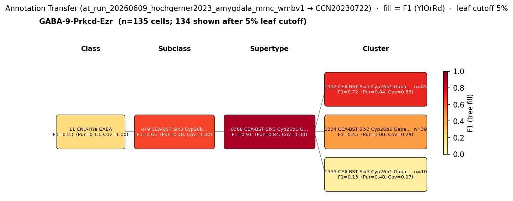

# Central amygdala protein kinase C-delta (PKC-delta) neuron — CCN20230722 Mapping Report
*2026-06-11 · Source: `kb/graphs/medial_temporal_lobe_amygdala/20260528_medial_temporal_lobe_amygdala_report_ingest.yaml`*

---

## Introduction

The central amygdala protein kinase C-delta (PKC-delta) neuron is a well-characterised GABAergic cell class of the lateral subdivision of the central amygdala (CeL). First molecularly defined by Haubensak et al. 2010 [2], PKC-delta+ (Prkcd+) neurons constitute the CeL-OFF population — units inhibited by a conditioned stimulus — and are reciprocally connected with the functionally opposing PKC-delta− population. Together with somatostatin-expressing (Sst+) neurons, they account for the majority of CeL neurons [1]. Mapping this type to a transcriptomic atlas cluster is a prerequisite for integrating fear-circuit findings with single-cell genomics and for cross-species alignment of amygdala cell-type classifications.

### Classical type properties

| Property | Value | References |
|---|---|---|
| Soma location | Central amygdala [UBERON:0002883], lateral subdivision (CeL) | [1] [2] [3] |
| Neurotransmitter | GABAergic | [2] [4] |
| Defining markers | Prkcd (protein kinase C-delta; protein and transcript) | [1] [2] [3] [5] [6] |
| Negative markers | Sst (somatostatin) | [2] |
| Neuropeptides | None recorded | — |
| Definition basis | CLASSICAL | — |
| Notes | Largely non-overlapping with Sst+ CeL neurons; together with Sst+ cells these account for most CeL neurons | [1] |

<details>
<summary>### Details — source evidence for classical type properties</summary>

- **Soma location:** Channelrhodopsin-assisted circuit mapping and cell-specific viral tracing · mouse CeL · [2]; CeA circuit anatomy, immunofluorescence · mouse CeL · [1]; cross-species comparison · primate CeA · [3]
  > "The role of different amygdala nuclei (neuroanatomical subdivisions) in processing Pavlovian conditioned fear has been studied extensively, but the function of the heterogeneous neuronal subtypes within these nuclei remains poorly understood. Here we use molecular genetic approaches to map the functional connectivity of a subpopulation of GABA-containing neurons, located in the lateral subdivision of the central amygdala (CEl), which express protein kinase C-δ (PKC-δ). Channelrhodopsin-2-assisted circuit mapping in amygdala slices and cell-specific viral tracing indicate that PKC-δ+ neurons inhibit output neurons in the medial central amygdala (CEm), and also make reciprocal inhibitory synapses with PKC-δ− neurons in CEl."
  > — Haubensak et al. 2010, Central amygdala cell types · [2] <!-- quote_key: 2270983_0fa016d1 -->

- **Neurotransmitter (GABAergic):** Molecular genetics and circuit tracing · mouse CeL · [2]; review article · [4]
  > "The central amygdala (CeA) plays a central role in physiological and behavioral responses to fearful stimuli, stressful stimuli, and drug-related stimuli. The CeA receives dense inputs from cortical regions, is the major output region of the amygdala, is primarily GABAergic (inhibitory), and expresses high levels of pro- and anti-stress peptides."
  > — Gilpin et al. 2014, Central amygdala cell types · [4] <!-- quote_key: 442779_deea5502 -->

- **Defining marker Prkcd:** Cre-driver in vivo silencing and morphological identification · mouse · [2]; CeA circuit anatomy · mouse · [1]; cross-species scRNA-seq · primate CeA · [3] [5]; CeA scRNA-seq · mouse · [6]
  > "Two genetically identified cell types, protein kinase Cdexpressing (PKCd⁺) neurons and somatostatin-expressing (Som⁺) neurons, constitute most CeLC neurons and are largely non-overlapping (Li et al., 2013;Kim et al., 2017;Wilson et al., 2019)."
  > — Adke et al. 2019, Central amygdala cell types · [1] <!-- quote_key: 209598438_053c1083 -->

  > "It revealed distinct PKC-δ, SOM, and CRF neuronal populations similar to those in mice."
  > — Yeh et al. 2024, Central amygdala cell types · [3] <!-- quote_key: 267685584_daaf5612 -->

  > "We also identified clusters corresponding to protein kinase C-δ⁺ (PKRCD⁺/SST⁻) interneurons in the central nucleus"
  > — Totty et al. 2024, GABAergic neuron types in the primate amygdala show distributed or subregion specific expression patterns · [5] <!-- quote_key: 273531817_722a2099 -->

- **Negative marker Sst:** Cre-driver molecular genetics · mouse CeL · [2]
  The Sst-negativity criterion is directly established by Haubensak et al. 2010 [2]: PKC-delta+ and Sst+ neurons are defined as mutually exclusive. O'Leary et al. 2022 [6] documents mixed Prkcd and Sst expression across multiple scRNA-seq clusters:
  > "Prkcd and Sst each exhibited mixed expression across multiple scRNA-seq-clusters"
  > — O'Leary et al. 2022, Results · [6] <!-- quote_key: 253356112_39b8cae2 -->
  *(note: this observation directly anticipates the Sst discordance concern raised for CLUS_1333 below.)*

</details>

### Cell Ontology mapping

No Cell Ontology term currently covers this type — candidate for a new CL term.

---

## Results

One candidate atlas cluster was assessed: 1333 CEA-BST Six3 Cyp26b1 Gaba_2 [CS20230722_CLUS_1333] at MODERATE confidence. Annotation-transfer evidence from Hochgerner et al. 2023 (ArrayExpress:E-MTAB-12096; GABA-9-Prkcd-Ezr, n=181 naive cells) shows F1=0.91 mapping to the parent supertype 0368 CEA-BST Six3 Cyp26b1 Gaba_2 [CS20230722_SUPT_0368]; cluster-level resolution is limited (F1=0.13 at rank 0). A DISCORDANT Sst signal at cluster level is the primary concern.

### Annotation transfer overview



*F1 across taxonomy levels for the Hochgerner 2023 source group GABA-9-Prkcd-Ezr (n=181 cells; 175 retained after filter) relevant to the Central amygdala protein kinase C-delta (PKC-delta) neuron. Each panel row is a source-cell group; nodes are coloured by F1 with **Purity** (Pur) and **Coverage** (Cov) shown inline. Coverage = fraction of source-group cells landing on this target; Purity = fraction of this target's cells coming from the source group. With a single source group in the figure, Purity differentiates among candidate targets; Coverage discriminates how cleanly the source lands. F1 ≥ 0.5 at a level indicates a clean mapping at that resolution.*

AT was performed with MapMyCells (cell_type_mapper v1.7.1) mapping Hochgerner 2023 amygdala naive cells (ArrayExpress:E-MTAB-12096) to WMBv1. The source cluster GABA-9-Prkcd-Ezr maps to the CEA-BST Six3 Cyp26b1 Gaba subclass (079 CEA-BST Six3 Cyp26b1 Gaba, CS20230722_SUBC_079) with SUBCLASS-level F1=0.65 (Purity=0.48, Coverage=1.00). SUPERTYPE-level F1 reaches 0.91 (Purity=0.84, Coverage=1.00) for the 0368 CEA-BST Six3 Cyp26b1 Gaba_2 supertype [CS20230722_SUPT_0368], indicating a highly specific assignment at supertype resolution. CLUSTER-level F1 drops to 0.13 for 1333 CEA-BST Six3 Cyp26b1 Gaba_2 [CS20230722_CLUS_1333] (Purity=0.48, Coverage=0.07), consistent with dispersal of source cells across multiple child clusters within the 0368 supertype.

### Mapping candidates table

| Rank | WMBv1 cluster | Supertype | Cells (10x) | Confidence | Key property alignment | Verdict |
|---|---|---|---|---|---|---|
| 1 | 1333 CEA-BST Six3 Cyp26b1 Gaba_2 [CS20230722_CLUS_1333] | 0368 CEA-BST Six3 Cyp26b1 Gaba_2 [CS20230722_SUPT_0368] | 359 | 🟡 MODERATE | Prkcd CONSISTENT · Sst DISCORDANT | PRIMARY — broadMatch; AT F1=0.91 at SUPERTYPE |

*1 edge assessed; relationship type skos:broadMatch.*

---

### Property alignment table — 1333 CEA-BST Six3 Cyp26b1 Gaba_2 [CS20230722_CLUS_1333]

**Table 1 — Property comparison**

| Property | Classical | Best cluster | Alignment |
|---|---|---|---|
| NT type | GABAergic | GABA (cluster label suffix "_Gaba_2") | CONSISTENT |
| Soma location | Central amygdala [UBERON:0002883] | MBA:536 CeA; region_fraction 0.567 (MERFISH); cluster label "CEA-BST Six3 Cyp26b1 Gaba_2" directly confirms CeA identity | CONSISTENT |
| Prkcd expression | Defining marker (protein/transcript) | Precomputed mean_expression 7.44 (CeA GABAergic cohort 99.1th percentile); highest Prkcd among all CEA-BST candidates | CONSISTENT |
| Sst expression | Negative marker (Sst-negative) | Precomputed mean_expression 1.21 (CeA GABAergic cohort 57.5th percentile; ABOVE minimum-detectable threshold) | DISCORDANT |
| Sex ratio | Not documented | Not available (MFR not computable) | NOT_ASSESSED |

**Table 2 — Evidence support**

| Evidence | Type | Supports | Headline | Source |
|---|---|---|---|---|
| Haubensak 2010 CeL circuit | Literature | SUPPORT | PKC-delta+ neurons as CeL-OFF population; Prkcd + Sst-negativity canonical pair | [2] |
| Adke 2019 CeA circuit anatomy | Literature | SUPPORT | PKC-delta+ and Sst+ as major non-overlapping CeL classes | [1] |
| O'Leary 2022 CeA scRNA-seq | Literature | SUPPORT | CEA-BST Six3 Cyp26b1 family as dominant CeA transcriptomic family | [6] |
| WMBv1 atlas metadata (CLUS_1333) | Atlas metadata | SUPPORT | Prkcd mean 7.44 (99.1th pct CeA GABAergic cohort); 56.7% CeA cells; CEA-BST Six3/Cyp26b1 lineage label | atlas-internal |
| Hochgerner 2023 MapMyCells AT | Annotation transfer | SUPPORT | F1=0.91 at SUPERTYPE (CS20230722_SUPT_0368); F1=0.13 at CLUSTER (CS20230722_CLUS_1333) | — |

*(Child-cluster breakdown not assessed — see proposed experiments.)*

---

### 1333 CEA-BST Six3 Cyp26b1 Gaba_2 [CS20230722_CLUS_1333] · 🟡 MODERATE

**Supporting evidence:**

- **Annotation-transfer evidence — strong at SUPERTYPE level.** Hochgerner et al. 2023 (ArrayExpress:E-MTAB-12096; naive neuronal cells only, fear-conditioned cells excluded) source cluster GABA-9-Prkcd-Ezr (n=181 cells; Zeisel-style label indicating GABAergic, Prkcd-expressing, Ezr-expressing type) maps to the WMBv1 atlas at SUPERTYPE level with F1=0.91, coverage=1.0, and purity=0.84 against 0368 CEA-BST Six3 Cyp26b1 Gaba_2 [CS20230722_SUPT_0368] in run `at_run_20260609_hochgerner2023_amygdala_mmc_wmbv1`. At SUBCLASS level (rank 2), the best target is 079 CEA-BST Six3 Cyp26b1 Gaba [CS20230722_SUBC_079] with F1=0.65. At CLASS level (rank 3), the best target is 11 CNU-HYa GABA [CS20230722_CLAS_11] with F1=0.23. At CLUSTER level (rank 0), the best target is 1333 CEA-BST Six3 Cyp26b1 Gaba_2 [CS20230722_CLUS_1333] with F1=0.13, reflecting the dispersal of source cells across multiple sibling clusters within the supertype — consistent with the 1:n cardinality caveat. The GABA-9-Prkcd-Ezr label directly names Prkcd as a defining marker, providing a molecular bridge between the classical type definition and the WMBv1 Cyp26b1 Gaba_2 lineage.

- **Prkcd expression — strongest positive signal.** 1333 CEA-BST Six3 Cyp26b1 Gaba_2 [CS20230722_CLUS_1333] shows a precomputed mean Prkcd expression of 7.44, placing it at the 99.1th percentile of the CeA GABAergic cohort (n=20 clusters; region=MBA:536; NT=GABAergic). This is the highest Prkcd expression among all CEA-BST candidates examined. The Stage A discovery awarded `applied_score: 2.0` for Prkcd (tier 2, EXPRESSION source).

- **Soma location — CONSISTENT.** The cluster label "CEA-BST Six3 Cyp26b1 Gaba_2" directly names central amygdala as the primary region. MERFISH spatial registration places 56.7% of cells in MBA:536 (CeA). Region_fraction 0.567 sits in the boundary band (0.3–0.7); it informs the broadMatch relationship choice (not exactMatch) given the BST minority fraction.

- **NT type — CONSISTENT.** The cluster label suffix "_Gaba_2" and the atlas NT annotation both designate GABA; the classical type is GABAergic [2][4].

- **Literature support — CeA PKC-delta circuit.** Haubensak et al. 2010 [2] established the PKC-delta+ CeL neuron as a defined circuit element using Cre-driver-based in vivo silencing and channelrhodopsin-assisted circuit mapping:

  > "The role of different amygdala nuclei (neuroanatomical subdivisions) in processing Pavlovian conditioned fear has been studied extensively, but the function of the heterogeneous neuronal subtypes within these nuclei remains poorly understood. Here we use molecular genetic approaches to map the functional connectivity of a subpopulation of GABA-containing neurons, located in the lateral subdivision of the central amygdala (CEl), which express protein kinase C-δ (PKC-δ). Channelrhodopsin-2-assisted circuit mapping in amygdala slices and cell-specific viral tracing indicate that PKC-δ+ neurons inhibit output neurons in the medial central amygdala (CEm), and also make reciprocal inhibitory synapses with PKC-δ− neurons in CEl."
  > — Haubensak et al. 2010, Central amygdala cell types · [2] <!-- quote_key: 2270983_0fa016d1 -->

- **Literature support — CeL cellular composition.** Adke et al. 2019 [1] confirm the major non-overlapping CeL cell classes:

  > "This diverse span of function is mirrored by the genetic, physiological and morphologic heterogeneity in CeA neuron subtypes (Martina et al., 1999;Schiess et al., 1999;Janak and Tye, 2015). Two genetically identified cell types, protein kinase Cdexpressing (PKCd⁺) neurons and somatostatin-expressing (Som⁺) neurons, constitute most CeLC neurons and are largely non-overlapping (Li et al., 2013;Kim et al., 2017;Wilson et al., 2019)."
  > — Adke et al. 2019, Central amygdala cell types · [1] <!-- quote_key: 209598438_053c1083 -->

- **Literature support — CEA-BST Six3 Cyp26b1 lineage.** O'Leary et al. 2022 [6] identified the CEA-BST Six3 Cyp26b1 cluster family as the dominant CeA transcriptomic family in mouse scRNA-seq, consistent with the PKC-delta neuron lineage. O'Leary et al. also documented that Prkcd and Sst show mixed expression across multiple scRNA-seq clusters:

  > "Prkcd and Sst each exhibited mixed expression across multiple scRNA-seq-clusters"
  > — O'Leary et al. 2022, Results · [6] <!-- quote_key: 253356112_39b8cae2 -->

**Marker evidence provenance:**

- **Prkcd:** Evidence is both protein-level (PKC-delta immunostaining, IHC) and transcript-level (scRNA-seq, ISH) across multiple independent studies [1][2][3][5][6]. Haubensak et al. 2010 [2] confirmed cell identity via Cre-driver targeting (PKC-delta-Cre) with circuit-level physiological validation (CeL-OFF units), providing the highest-confidence cell-type specificity. Adke et al. 2019 [1] and Yeh et al. 2024 [3] used morphological and immunofluorescence methods in mouse and primate CeA, respectively. Totty et al. 2024 [5] explicitly identified Prkcd+/Sst− clusters in primate CeA scRNA-seq. The Hochgerner 2023 AT source cluster label "GABA-9-Prkcd-Ezr" independently confirms Prkcd as the molecular anchor for the CeL GABA-9 transcriptomic type at F1=0.91 against the Cyp26b1 Gaba_2 supertype. Evidence provenance for Prkcd as a defining marker is strong across multiple independent studies and methods.

- **Sst (negative marker):** The Sst-negativity criterion is established primarily by Haubensak et al. 2010 [2] via Cre-driver genetic tools showing non-overlap of PKC-delta+ and Sst+ populations. This is a robust original study with clear genetic labelling. However, the quantitative threshold at the single-cell level (what fraction of PKC-delta+ neurons is Sst-negative, and at what expression level?) is not explicitly resolved in the gathered literature. The O'Leary et al. 2022 scRNA-seq finding [6] that "Prkcd and Sst each exhibited mixed expression across multiple scRNA-seq-clusters" directly anticipates the cluster-average discordance seen for 1333 CEA-BST Six3 Cyp26b1 Gaba_2 [CS20230722_CLUS_1333] and suggests the clean mutual exclusivity observed in Cre-driver studies may not hold uniformly at the transcriptome-wide, population-average level captured by atlas pseudobulk.

  ⚠ **Atlas expression discordance for Sst:** Sst is listed as a negative marker for this classical type (Prkcd+/Sst− canonical pair; PMID:21068836) but CS20230722_CLUS_1333 shows precomputed mean Sst expression = 1.21 (57.5th percentile in the CeA GABAergic cohort — above minimum-detectable threshold). The Stage A discovery scored this as a penalty (`raw_tier: -1`, `applied_score: -1.0`). This discordance may reflect: (a) population-level averaging where a subset of CLUS_1333 cells co-expresses Sst; (b) a genuine overlap with Sst+ neurons resolved only at sub-cluster resolution; or (c) the "mixed expression across clusters" phenomenon documented by O'Leary et al. 2022 [6]. Individual-cell validation is required to resolve this.

**Concerns:**

- **DISCORDANT Sst — primary concern.** Sst mean_expression = 1.21 (57.5th percentile, CeA GABAergic cohort) is above the minimum-detectable threshold. The classical type is defined as Sst-negative by multiple genetic and immunohistochemical studies [2][5]. This is the most significant counter-evidence for this edge. The discordance may reflect cluster-level averaging over a mixed population, as suggested by the O'Leary et al. 2022 finding [6]. Nevertheless, until sub-cluster analysis resolves the cell-fraction breakdown, this remains a formal DISCORDANT alignment.

- **DISTRIBUTED_ACROSS_CLUSTERS caveat.** Multiple CEA-BST Six3 Cyp26b1 clusters (CLUS_1331–1335 under CS20230722_SUPT_0368; CLUS_1342–1343 under the adjacent supertype) all have high Prkcd expression and CeA fractions of 0.37–0.65. The classical PKC-delta neuron type likely spans more than one Cyp26b1 Gaba cluster, implying 1:n cardinality. The broadMatch relationship reflects this; CS20230722_CLUS_1333 is the best single-cluster representative by Prkcd expression rank. The low cluster-level F1=0.13 from the Hochgerner 2023 AT run is consistent with this dispersal — source cells map broadly across the supertype rather than concentrating on one child cluster.

- **Cluster-level AT resolution limited.** While AT achieves F1=0.91 at SUPERTYPE (CS20230722_SUPT_0368), cluster-level resolution is F1=0.13 against CS20230722_CLUS_1333 (coverage=0.07). This indicates the Hochgerner 2023 GABA-9-Prkcd-Ezr type does not strongly prefer any single cluster within the supertype, consistent with the 1:n cardinality hypothesis. A more Prkcd-enriched source dataset or higher-resolution reference might sharpen the cluster-level mapping.

- **region_fraction 0.567 — boundary band.** The 56.7% CeA fraction drives the broadMatch (not exactMatch) relationship. A substantial BST minority fraction means the cluster is not exclusively CeA-localised, consistent with the CEA-BST naming of the lineage.

**What would upgrade confidence:**

- **Sub-cluster re-clustering (highest priority).** Re-cluster CS20230722_CLUS_1333 (and neighbouring Cyp26b1 clusters CLUS_1331–1335, CLUS_1342–1343) to identify a Prkcd-high/Sst-low subgroup. If a clean Prkcd+/Sst− sub-cluster emerges, replace the broadMatch to CLUS_1333 with a more specific edge to that sub-cluster. This directly resolves the DISCORDANT Sst alignment and could upgrade confidence to HIGH if AT evidence (GABA-9-Prkcd-Ezr F1 ≥ 0.70 at that child cluster) also confirms the identity. Expected output: revised MappingEdge with updated `node_b_id`.

- **RNAscope co-staining in mouse CeL.** Dual-fluorescence RNAscope for Prkcd and Sst in mouse CeL sections, quantifying the fraction of Prkcd+ cells that are Sst− and mapping those cells onto WMBv1 cluster boundaries. Expected output: LiteratureEvidence item on this edge documenting the quantified co-expression rate.

- **Higher-resolution MapMyCells AT targeting a Prkcd-enriched dataset.** A CeA Prkcd-enriched dataset (e.g. from PKC-delta-Cre sorted neurons) run through MapMyCells against CCN20230722 could sharpen cluster-level F1 beyond the F1=0.13 achieved with the full Hochgerner 2023 neuronal dataset. Target: F1 ≥ 0.70 at CLUSTER level. Expected output: second AnnotationTransferEvidence on `edge_cea_pkc_delta_neuron_to_cs20230722_clus_1333`.

- **Targeted literature search for Sst heterogeneity in PKC-delta+ CeL neurons.** Cite-traverse for "Prkcd Sst co-expression central amygdala heterogeneity scRNA-seq" to determine whether any publication has documented Sst-expressing subpopulations within PKC-delta+ cells. If heterogeneity is documented, it can be cited in the rationale and the discordance acknowledged as a known biological feature rather than a mapping failure.

---

### Methods

<details>
<summary>Data sources, analyses, and reproducibility receipts</summary>

**Classical type definition.** The CEA PKC-delta neuron (`cea_pkc_delta_neuron`) is defined on a CLASSICAL basis: defining markers include Prkcd [1][2][3][5][6]; NT type is GABAergic [2][4]; soma location is the central amygdala [UBERON:0002883], lateral subdivision [1][2][3]; negative marker is Sst [2]. The classical node carries no recorded neuropeptides, morphology, or electrophysiology fields.

**Atlas mapping query.** Candidate atlas clusters were retrieved from the CCN20230722 taxonomy at ranks 0 (cluster) and 1 (supertype) using metadata-based scoring (region match MBA:536, NT type GABAergic, defining markers Prkcd, negative marker Sst). Full scoring rules: `workflows/map-cell-type.md`.

**Property alignment.** Each defining property of the classical type was compared to the corresponding atlas-side value via the `property_comparisons` schema, with alignments graded CONSISTENT / APPROXIMATE / DISCORDANT / NOT_ASSESSED. Atlas-side numerical values came from precomputed expression on the cluster (cluster.yaml in the taxonomy reference store) and from MERFISH spatial registration for soma location.

**Annotation transfer**

| Field | Value |
|---|---|
| Source dataset | ArrayExpress:E-MTAB-12096 (GABA-9-Prkcd-Ezr) |
| Source species | NCBITaxon:10090 (Mus musculus) |
| Target atlas | WMBv1 (CCN20230722; SHA-256: b21ca985) |
| Method | MapMyCells local (cell_type_mapper v1.7.1, default parameters, raw normalization, 100 bootstrap iterations) |
| Tool version | cell_type_mapper v1.7.1 |
| Bootstrap threshold | 0.7 |
| n cells | 55514 total (filtered to 7777 naive neuronal cells; fear-conditioned cells excluded) |
| Run record | [`kb/annotation_transfer_runs/at_run_20260609_hochgerner2023_amygdala_mmc_wmbv1/manifest.yaml`](../../kb/annotation_transfer_runs/at_run_20260609_hochgerner2023_amygdala_mmc_wmbv1/manifest.yaml) |
| Code reference | [https://github.com/AllenInstitute/cell_type_mapper](https://github.com/AllenInstitute/cell_type_mapper) |
| F1 matrix | [`research/medial_temporal_lobe_amygdala/annotation_transfer/hochgerner2023_amygdala/mapping_result.csv`](../../research/medial_temporal_lobe_amygdala/annotation_transfer/hochgerner2023_amygdala/mapping_result.csv) |
| Caveats | Source labels are transcriptomically-defined types, not classical morpho-electrophysiological types. Matching to KB classical nodes requires a mapping step based on shared molecular markers. Fear-conditioned cells excluded to avoid transcriptional-state confounds. Gene symbols used (not Ensembl IDs); matched against WMBv1 marker genes. |

**Anti-hallucination.** All citations, atlas accessions, ontology CURIEs, and verbatim literature quotes in this report are validated against the evidencell knowledge base at write time. Authored-prose evidence narratives are validated against their source `evidence_items[*].explanation` fields. The pre-write hook rejects any unresolvable identifier or unattributed blockquote. Specific mapping limitations and caveats are documented per-candidate in the Discussion section.

**Evidence base**

| Edge ID | Evidence types | Supports | Source |
|---|---|---|---|
| edge_cea_pkc_delta_neuron_to_cs20230722_clus_1333 | LITERATURE; LITERATURE; LITERATURE; ATLAS_METADATA; ANNOTATION_TRANSFER | SUPPORT; SUPPORT; SUPPORT; SUPPORT; SUPPORT | [2]; [1]; [6]; atlas-internal; — |

*Generated by evidencell `8d79cdb` at 2026-06-11T09:44:18+00:00 from [kb/graphs/medial_temporal_lobe_amygdala/20260528_medial_temporal_lobe_amygdala_report_ingest.yaml](../../kb/graphs/medial_temporal_lobe_amygdala/20260528_medial_temporal_lobe_amygdala_report_ingest.yaml).*

</details>

---

## Discussion

### Best candidate + caveats summary

**Primary mapping:** Central amygdala protein kinase C-delta (PKC-delta) neuron → 1333 CEA-BST Six3 Cyp26b1 Gaba_2 [CS20230722_CLUS_1333] at MODERATE confidence. Key support: Prkcd precomputed mean_expression 7.44 at 99.1th percentile of the CeA GABAergic cohort (CONSISTENT); Hochgerner 2023 GABA-9-Prkcd-Ezr source cluster maps to CS20230722_SUPT_0368 at F1=0.91 (ANNOTATION_TRANSFER, run `at_run_20260609_hochgerner2023_amygdala_mmc_wmbv1`); soma location CONSISTENT (56.7% CeA by MERFISH); NT type CONSISTENT. Key caveats: Sst mean_expression = 1.21 (57.5th percentile, DISCORDANT with classical Sst-negativity criterion); cluster-level AT F1=0.13 reflects 1:n dispersal across Cyp26b1 Gaba_2 clusters; classical type likely spans CLUS_1331–1335 and CLUS_1342–1343 (DISTRIBUTED_ACROSS_CLUSTERS).

No Cell Ontology term currently assigned. The PKC-delta+ CeL neuron is a candidate for CL contribution as a distinct amygdala GABAergic subtype.

### Proposed experiments and follow-ups

**Annotation-transfer status.** A MapMyCells run using the Hochgerner 2023 dataset (`at_run_20260609_hochgerner2023_amygdala_mmc_wmbv1`) has been completed and is incorporated in this report. GABA-9-Prkcd-Ezr achieves F1=0.91 at SUPERTYPE level (CS20230722_SUPT_0368) but only F1=0.13 at CLUSTER level (CS20230722_CLUS_1333), reflecting dispersal across sibling clusters. The run resolves the AT_ABSENT caveat but does not fully resolve cluster-level identity; a more targeted dataset would add value.

**1. Sub-cluster re-clustering of the Cyp26b1 Gaba_2 family**
- **What:** Unsupervised re-clustering of CEA-BST Six3 Cyp26b1 clusters (CS20230722_CLUS_1333 and neighbouring CLUS_1331–1335, CLUS_1342–1343) at higher resolution using the WMBv1 count matrix.
- **Target:** Identify a Prkcd-high/Sst-low subgroup.
- **Expected output:** Revised MappingEdge with updated `node_b_id` to the resolved sub-cluster; Sst alignment upgraded from DISCORDANT.
- **Resolves:** Unresolved question 1 (Sst-negative subpopulation in CLUS_1333); caveat DISTRIBUTED_ACROSS_CLUSTERS.

**2. RNAscope dual-fluorescence (Prkcd + Sst) in mouse CeL**
- **What:** In situ hybridisation with dual probes for Prkcd and Sst in mouse CeL sections, single-cell resolution.
- **Target:** Quantify the fraction of Prkcd+ cells that are Sst−; confirm or refute mutual exclusivity at the single-cell level.
- **Expected output:** LiteratureEvidence item on this edge; if mutual exclusivity confirmed, the Sst discordance can be documented as a population-averaging artefact in the KB rationale.
- **Resolves:** Unresolved question 1; DISCORDANT Sst alignment.

**3. MapMyCells AT with Prkcd-enriched source dataset**
- **What:** Run MapMyCells (CCN20230722 target) on a CeA Prkcd-enriched dataset (e.g. PKC-delta-Cre sorted cells or Cre-intersectional approach), distinct from the Hochgerner 2023 full-neuronal dataset.
- **Target:** F1 ≥ 0.70 at CLUSTER level against CS20230722_CLUS_1333 or a child sub-cluster. This is a refined version of the previously-proposed AT experiment, justified because the Hochgerner 2023 run achieved only F1=0.13 at cluster level.
- **Expected output:** Second AnnotationTransferEvidence on `edge_cea_pkc_delta_neuron_to_cs20230722_clus_1333`.
- **Resolves:** Unresolved question 2 (correct WMBv1 cluster for CeL PKC-delta-OFF neurons); cluster-level AT resolution gap.

**4. Targeted literature search for Sst heterogeneity in PKC-delta+ CeL neurons**
- **What:** Cite-traverse for "Prkcd Sst co-expression central amygdala heterogeneity scRNA-seq".
- **Target:** Establish whether the DISCORDANT Sst alignment is a known biological feature or a technical artefact.
- **Expected output:** LiteratureEvidence item; if heterogeneity is documented, cite in rationale.
- **Resolves:** Marker contradiction protocol — Sst discordance not yet documented in gathered literature.

### Open questions

1. Does CS20230722_CLUS_1333 contain a Sst-negative subpopulation identifiable by sub-cluster re-clustering? Are the Prkcd-high cells the Sst-negative ones?
2. Is the CEA-BST Six3 Cyp26b1 Gaba_2 family the correct WMBv1 cluster for CeL PKC-delta-OFF neurons, or is there a more specific Prkcd+/Sst- cluster at higher resolution?
3. Trawl literature for Sst heterogeneity within PKC-delta+ CeL neurons — the cluster-average Sst expression may reflect a real subpopulation signal; O'Leary et al. 2022 documents mixed expression but does not quantify the Prkcd+/Sst+ fraction.
4. Sub-cluster CS20230722_CLUS_1333 and neighbouring CEA-BST Cyp26b1 clusters (CLUS_1331–1335, CLUS_1342–1343) to identify a Prkcd-high/Sst-low subgroup; 1:n cardinality likely across the Gaba_2/4 family.

---

## References

| # | Citation | PMID | Used for |
|---|---|---|---|
| [1] | Adke et al. 2019 | [PMID:33188006](https://pubmed.ncbi.nlm.nih.gov/33188006/) | Soma location; Prkcd marker; CeL cell-type composition |
| [2] | Haubensak et al. 2010 | [PMID:21068836](https://pubmed.ncbi.nlm.nih.gov/21068836/) | Soma location; NT type; Prkcd defining marker; Sst negative marker; CeL-OFF circuit |
| [3] | Yeh et al. 2024 | [PMID:38419794](https://pubmed.ncbi.nlm.nih.gov/38419794/) | Soma location; Prkcd cross-species conservation |
| [4] | Gilpin et al. 2014 | [PMID:25433901](https://pubmed.ncbi.nlm.nih.gov/25433901/) | Neurotransmitter type (GABAergic CeA) |
| [5] | Totty et al. 2024 | [PMID:39463931](https://pubmed.ncbi.nlm.nih.gov/39463931/) | Prkcd marker; primate CeA scRNA-seq Prkcd+/Sst− confirmation |
| [6] | O'Leary et al. 2022 | [PMID:36425768](https://pubmed.ncbi.nlm.nih.gov/36425768/) | Prkcd marker; CEA-BST Six3 Cyp26b1 lineage; mixed Prkcd/Sst expression across clusters |

---

<!-- verdict-block-start: edge_cea_pkc_delta_neuron_to_cs20230722_clus_1333 -->
```yaml
verdict:
  confidence: MODERATE
  confidence_score: 0.72
  rationale: >
    1 of 2 markers CONSISTENT: `marker_Prkcd` CONSISTENT — precomputed mean_expression 7.44
    (CeA GABAergic cohort 99.1th percentile; tier 2; applied_score 2.0), highest among all
    CEA-BST candidates. `location_soma` CONSISTENT — region_fraction 0.567 (boundary-band;
    informs broadMatch). `nt_type` CONSISTENT — GABA label confirmed.
    ANNOTATION_TRANSFER (run `at_run_20260609_hochgerner2023_amygdala_mmc_wmbv1`):
    Hochgerner 2023 GABA-9-Prkcd-Ezr (n=181 naive cells; ArrayExpress:E-MTAB-12096)
    maps to CS20230722_SUPT_0368 at F1=0.91 (coverage=1.0, purity=0.84); cluster-level
    F1=0.13 against CS20230722_CLUS_1333 (consistent with 1:n dispersal across the
    Cyp26b1 Gaba_2 family). Primary concern: `negative_marker_Sst` DISCORDANT — Sst
    mean_expression 1.21 (57.5th pct CeA GABAergic cohort), above minimum-detectable
    threshold, conflicting with canonical Sst-negativity criterion (PMID:21068836);
    O'Leary et al. 2022 scRNA-seq (PMID:36425768) documents mixed Prkcd and Sst
    expression across clusters, providing a plausible population-averaging mechanism.
    MODERATE reflects SUPT-level AT anchor (F1=0.91) with documented marker contradiction
    and 1:n cardinality caveat.
  unresolved_questions:
    - "Trawl literature for Sst heterogeneity within PKC-delta+ CeL neurons — the cluster-average Sst expression may reflect a real subpopulation signal; O'Leary et al. 2022 documents mixed expression but does not quantify the Prkcd+/Sst+ fraction."
    - "Sub-cluster CS20230722_CLUS_1333 and neighbouring CEA-BST Cyp26b1 clusters (CLUS_1331–1335, CLUS_1342–1343) to identify a Prkcd-high/Sst-low subgroup; 1:n cardinality likely across the Gaba_2/4 family."
```
<!-- verdict-block-end -->
