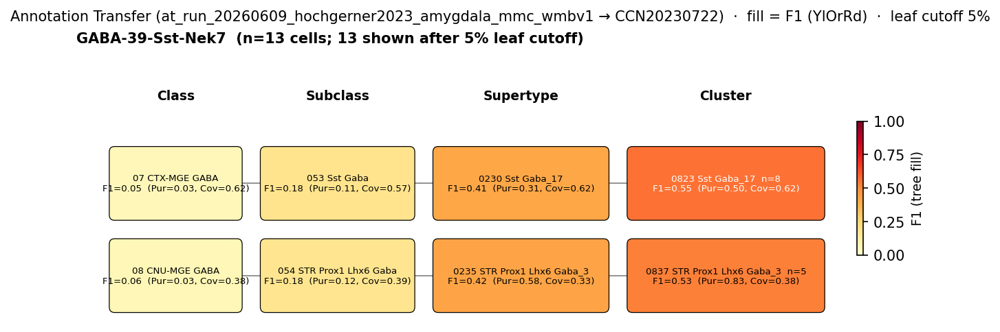

# Central amygdala somatostatin-positive neuron — CCN20230722 Mapping Report
*Source: `kb/graphs/medial_temporal_lobe_amygdala/20260528_medial_temporal_lobe_amygdala_report_ingest.yaml`*

---

## Introduction

The central amygdala somatostatin-positive (SST+) neuron is a GABAergic cell class defined by expression of the neuropeptide somatostatin (Sst) and anatomical restriction to the lateral subdivision of the central amygdala [UBERON:0002883]. Together with protein kinase C-delta (PKC-δ) neurons, SST+ neurons constitute the majority of lateral central amygdala (CeLC) neurons [1][2]. These two classes are largely non-overlapping and form the cellular substrate for opponent fear-conditioning responses: SST+ neurons correspond to the classically described CeL-ON population, whose potentiated activation during fear acquisition is required for fear memory formation and recall [1]. Mapping this well-characterised functional class to its transcriptomic correlate in the Allen Brain Cell Atlas (WMBv1) is an important step toward anchoring CeA circuit models in transcriptomic space and enabling cross-study comparisons.

### Classical type description

| Property | Value | References |
|---|---|---|
| Soma location | Central amygdaloid nucleus [UBERON:0002883] | [1] [2] [3] [4] |
| Neurotransmitter | GABAergic | [1] [5] |
| Defining markers | None recorded (type identified by neuropeptide + negative marker) | — |
| Negative markers | Prkcd | [2] |
| Neuropeptides | Sst | [1] [2] [6] [7] |
| Notes | Largely non-overlapping with PKC-delta neurons; constitutes a large share of lateral CeA neurons | — |

<details>
<summary>Details — source evidence for classical type properties</summary>

- **Soma location — UBERON:0002883:** Li et al. 2013 identified CeL SST+ neurons as the fear-conditioning CeL-ON class in the lateral subdivision of the CeA [1]. Adke et al. 2019 localised SST+ and PKCδ+ neurons as the two major CeLC populations [2]. Nisbett & Koob 2025 reviewed CeA subdivisions including CeC, CeL, and CeM [3]. Vicario et al. 2014 noted somatostatin-positive MGE-derived neurons concentrate in the medial subdivision of the nucleus [4].

  For **[1]** (Li et al. 2013):
  > The amygdala is essential for fear learning and expression. The central amygdala (CeA), once viewed as a passive relay between the amygdala complex and downstream fear effectors, has emerged as an active participant in fear conditioning. However, the mechanism by which CeA contributes to the learning and expression of fear is unclear. We found that fear conditioning in mice induced robust plasticity of excitatory synapses onto inhibitory neurons in the lateral subdivision of the CeA (CeL). This experience-dependent plasticity was cell specific, bidirectional and expressed presynaptically by inputs from the lateral amygdala. In particular, preventing synaptic potentiation onto somatostatin-positive neurons impaired fear memory formation. Furthermore, activation of these neurons was necessary for fear memory recall and was sufficient to drive fear responses. Our findings support a model in which fear conditioning–induced synaptic modifications in CeL favor the activation of somatostatin-positive neurons, which inhibit CeL output, thereby disinhibiting the medial subdivision of CeA and releasing fear expression.
  > — Li et al. 2013, Central amygdala cell types · [1] <!-- quote_key: 10650261_f38d6b66 -->

- **Neurotransmitter — GABAergic:** Li et al. 2013 [1] and Gilpin et al. 2014 [5] document the CeA as a primarily GABAergic nucleus.

  For **[5]** (Gilpin et al. 2014):
  > The central amygdala (CeA) plays a central role in physiological and behavioral responses to fearful stimuli, stressful stimuli, and drug-related stimuli. The CeA receives dense inputs from cortical regions, is the major output region of the amygdala, is primarily GABAergic (inhibitory), and expresses high levels of pro- and anti-stress peptides. The CeA is also a constituent region of a conceptual macrostructure called the extended amygdala that is recruited during the transition to alcohol dependence. In this review, we discuss neurotransmission in the CeA as a potential integrative hub between anxiety disorders and Alcohol Use Disorder (AUD), which are commonly co-occurring in humans. Human imaging work and multi-disciplinary work in animals collectively suggest that CeA structure and function are altered in individuals with anxiety disorders and AUD, the end result of which may be disinhibition of downstream "effector" regions that regulate anxiety- and alcohol-related behaviors.
  > — Gilpin et al. 2014, Central amygdala cell types · [5] <!-- quote_key: 442779_deea5502 -->

- **Negative marker — Prkcd:** Adke et al. 2019 [2] explicitly state SST+ and PKCδ+ neurons are largely non-overlapping, establishing Prkcd absence as a defining feature of the SST+ class.

  For **[2]** (Adke et al. 2019):
  > This diverse span of function is mirrored by the genetic, physiological and morphologic heterogeneity in CeA neuron subtypes (Martina et al., 1999;Schiess et al., 1999;Janak and Tye, 2015). Two genetically identified cell types, protein kinase Cdexpressing (PKCd⁺) neurons and somatostatin-expressing (Som⁺) neurons, constitute most CeLC neurons and are largely non-overlapping (Li et al., 2013;Kim et al., 2017;Wilson et al., 2019).
  > — Adke et al. 2019, Central amygdala cell types · [2] <!-- quote_key: 209598438_053c1083 -->

- **Neuropeptide — Sst:** Confirmed by Li et al. 2013 [1], Adke et al. 2019 [2], Yeh et al. 2024 [6], and O'Leary et al. 2022 [7]. Yeh et al. 2024 identified distinct PKC-δ, SOM, and CRF neuronal populations in this region.

  For **[6]** (Yeh et al. 2024):
  > .It revealed distinct PKC-δ, SOM, and CRF neuronal populations similar to those in mice.
  > — Yeh et al. 2024, Central amygdala cell types · [6] <!-- quote_key: 267685584_daaf5612 -->

</details>

### Cell Ontology mapping

No Cell Ontology term currently covers this type — candidate for a new CL term.

---

## Results

One candidate atlas cluster was assessed; 0823 Sst Gaba_17 [CS20230722_CLUS_0823] in supertype 0230 Sst Gaba_17 [CS20230722_SUPT_0230] is the primary mapping at LOW confidence, reflecting a clean property-level convergence across NT type, Sst expression, and Prkcd negativity, but constrained by a five-way tie in the CeA GABAergic discovery cohort and a partial annotation-transfer result (F1=0.55 at cluster level).

### Annotation transfer overview



*F1 across taxonomy levels for the Hochgerner 2023 source group GABA-39-Sst-Nek7 (n=23 cells; 8 retained after filter) relevant to the Central amygdala somatostatin-positive neuron. Each panel row is a source-cell group; nodes are coloured by F1 with **Purity** (Pur) and **Coverage** (Cov) shown inline. Coverage = fraction of source-group cells landing on this target; Purity = fraction of this target's cells coming from the source group. With a single source group in the figure, Purity differentiates among candidate targets; Coverage discriminates how cleanly the source lands. F1 ≥ 0.5 at a level indicates a clean mapping at that resolution.*

AT was performed with MapMyCells (cell_type_mapper v1.7.1) mapping Hochgerner 2023 amygdala naive cells (ArrayExpress:E-MTAB-12096) to WMBv1. The source cluster GABA-39-Sst-Nek7 is a small group (n=23 total; 8 cells retained at CLASS level). Assignment converges on the Sst Gaba subclass (053 Sst Gaba, CS20230722_SUBC_053) with SUBCLASS-level F1=0.18 (Purity=0.11, Coverage=0.57). SUPERTYPE-level F1 rises to 0.41 for the 0230 Sst Gaba_17 supertype [CS20230722_SUPT_0230] (Purity=0.31, Coverage=0.62), and CLUSTER-level F1 reaches 0.55 for 0823 Sst Gaba_17 [CS20230722_CLUS_0823] (Purity=0.50, Coverage=0.62), indicating the best-available resolution for this small source group despite the low absolute cell count.

### Mapping candidates table

| Rank | WMBv1 cluster | Supertype | Cells (10x) | Confidence | Key property alignment | Verdict |
|---:|---|---|---:|---|---|---|
| 1 | 0823 Sst Gaba_17 [CS20230722_CLUS_0823] | 0230 Sst Gaba_17 [CS20230722_SUPT_0230] | 556 | 🔴 LOW | Sst CONSISTENT · Prkcd-negative CONSISTENT | Speculative; broadMatch 1:n |

*1 edge assessed; relationship type: skos:broadMatch (1:n — 5 Sst Gaba clusters score equally).*

### Property alignment table — 0823 Sst Gaba_17 [CS20230722_CLUS_0823]

**Table 1 — Property comparison**

| Property | Classical | Supertype | Best cluster | Alignment |
|---|---|---|---|---|
| Soma location | Central amygdaloid nucleus [UBERON:0002883] | MBA:536 CeA present; region_fraction 0.067 (cohort rank 2 of 5); parent supertype CS20230722_SUPT_0230 (Sst Gaba_17) | — | CONSISTENT |
| NT type | GABAergic | GABA | GABA | CONSISTENT |
| Sst neuropeptide | Sst — neuropeptide (PMID:23354330, PMID:33188006, PMID:38419794) | not available at supertype level | Sst precomputed mean_expression 10.36 (CeA GABAergic cohort 95.1th pct; tier 2; applied_score 2.0). Cluster "0823 Sst Gaba_17". | CONSISTENT |
| Prkcd (negative) | Prkcd — negative marker (PMID:33188006) | not available | Prkcd precomputed val 0.0 (0th pct; tier 1 unreliable). Effectively absent — consistent with Prkcd-negativity criterion. | CONSISTENT |
| Sex ratio | not documented | not available | not assessed | NOT_ASSESSED |

**Table 2 — Evidence support**

| Evidence | Type | Supports | Headline | Source |
|---|---|---|---|---|
| Li et al. 2013 — CeL SST+ CeL-ON | Literature | SUPPORT | SST+ neurons required for fear memory formation and recall | [1] |
| Adke et al. 2019 — CeLC two-class framework | Literature | SUPPORT | Som+ and PKCd+ constitute most CeLC neurons; largely non-overlapping | [2] |
| Atlas metadata — CLUS_0823 Sst/Prkcd expression | Atlas metadata | SUPPORT | Sst 95.1th pct CeA GABAergic cohort; Prkcd 0th pct | atlas-internal |
| MapMyCells AT — Hochgerner 2023 GABA-39-Sst-Nek7 | Annotation transfer | SUPPORT | F1=0.55 at CLUSTER level (CS20230722_CLUS_0823) | — |

*(Child-cluster breakdown not assessed — see proposed experiments.)*

---

### 0823 Sst Gaba_17 [CS20230722_CLUS_0823] · 🔴 LOW

**Supporting evidence:**

- **Sst expression (CONSISTENT):** CLUS_0823 carries Sst mean_expression 10.36, placing it at the 95.1th percentile of the CeA GABAergic survival cohort (5 members; filtered to MBA:536 + GABAergic). This directly matches the defining neuropeptide of the classical type [1][2][6][7]. Stage A discovery score for CS20230722_CLUS_0823 was 4 (rank 2 of 5 in the 5-member cohort; score tied with all cohort members), with Sst contributing `applied_score: 2.0` from cohort-pct 0.951 of 5. *(Note: the cohort has only 5 members, so percentile values reflect intra-cohort rank only and do not convey atlas-wide specificity.)*

- **Prkcd-negative (CONSISTENT):** Prkcd precomputed expression = 0.0 (0th percentile of the CeA GABAergic cohort; tier 1 unreliable, meaning the gene is absent or near-undetectable). This confirms Prkcd negativity, a defining exclusion criterion for the SST+ class [2].

- **NT type (CONSISTENT):** CS20230722_CLUS_0823 is designated GABA, consistent with the classical type's GABAergic identity [1][5].

- **CeA location (CONSISTENT):** MBA:536 (Central amygdalar nucleus) is present in the CS20230722_CLUS_0823 distribution with region_fraction 0.067. This places it at cohort rank 2 of 5 for CeA specificity. *(Note: region_fraction 0.067 is low; the CeA is not the dominant soma location for this cluster — see Concerns.)*

- **Annotation transfer (Hochgerner 2023, GABA-39-Sst-Nek7):** MapMyCells local (cell_type_mapper v1.7.1, `at_run_20260609_hochgerner2023_amygdala_mmc_wmbv1`) on naive neuronal cells from ArrayExpress:E-MTAB-12096 mapped source cluster GABA-39-Sst-Nek7 (n = 23 cells after naive-cell filtering) to CS20230722_CLUS_0823 at cluster level with F1=0.55 (coverage 0.615, purity 0.50, median bootstrap 1.0). At supertype level (CS20230722_SUPT_0230) F1=0.41; at subclass (CS20230722_SUBC_053, "053 Sst Gaba") F1=0.18; at class (CS20230722_CLAS_07, "07 CTX-MGE GABA") F1=0.05. The moderate cluster-level F1 indicates partial but non-exclusive mapping consistent with the five-way cluster ambiguity at this taxonomic position.

  Literature evidence from [1] and [2] further anchors the molecular identity:

  > The amygdala is essential for fear learning and expression. The central amygdala (CeA), once viewed as a passive relay between the amygdala complex and downstream fear effectors, has emerged as an active participant in fear conditioning. However, the mechanism by which CeA contributes to the learning and expression of fear is unclear. We found that fear conditioning in mice induced robust plasticity of excitatory synapses onto inhibitory neurons in the lateral subdivision of the CeA (CeL). This experience-dependent plasticity was cell specific, bidirectional and expressed presynaptically by inputs from the lateral amygdala. In particular, preventing synaptic potentiation onto somatostatin-positive neurons impaired fear memory formation. Furthermore, activation of these neurons was necessary for fear memory recall and was sufficient to drive fear responses. Our findings support a model in which fear conditioning–induced synaptic modifications in CeL favor the activation of somatostatin-positive neurons, which inhibit CeL output, thereby disinhibiting the medial subdivision of CeA and releasing fear expression.
  > — Li et al. 2013, Central amygdala cell types · [1] <!-- quote_key: 10650261_f38d6b66 -->

  > This diverse span of function is mirrored by the genetic, physiological and morphologic heterogeneity in CeA neuron subtypes (Martina et al., 1999;Schiess et al., 1999;Janak and Tye, 2015). Two genetically identified cell types, protein kinase Cdexpressing (PKCd⁺) neurons and somatostatin-expressing (Som⁺) neurons, constitute most CeLC neurons and are largely non-overlapping (Li et al., 2013;Kim et al., 2017;Wilson et al., 2019).
  > — Adke et al. 2019, Central amygdala cell types · [2] <!-- quote_key: 209598438_053c1083 -->

**Marker evidence provenance:**

- **Sst (neuropeptide):** Evidence is multi-source: protein-level (Yeh et al. 2024 [6] identified distinct SOM populations by immunohistochemistry; cross-species conservation confirmed), scRNA-seq-level (O'Leary et al. 2022 [7] noted Prkcd and Sst show mixed expression across scRNA-seq clusters), and functional/genetic (Li et al. 2013 [1] used Sst-IRES-Cre targeting). Cell-type specificity for [1] is strong: SST-Cre driver targeting was confirmed through in vivo fear conditioning and optogenetic manipulation with documented CeL location. Atlas-side Sst mean = 10.36 at tier 2 (reliable). The O'Leary et al. 2022 observation of mixed Sst expression across clusters is consistent with the DISTRIBUTED_ACROSS_CLUSTERS caveat and signals that the CeA SST population is transcriptomically heterogeneous.

  For **[7]** (O'Leary et al. 2022):
  > Prkcd and Sst each exhibited mixed expression across multiple scRNA-seq-clusters
  > — O'Leary et al. 2022, Results · [7] <!-- quote_key: 253356112_39b8cae2 -->

  *(note: the above finding supports the expectation that CeA SST neurons may not map 1:1 to a single WMBv1 cluster.)*

- **Prkcd (negative marker):** Established by Adke et al. 2019 [2] and Li et al. 2013 [1] through Cre-driver-based genetic labelling combined with immunostaining. Evidence is both protein-level (PKCδ IHC) and transcript-level (SST-Cre × reporter crosses). Cell-type specificity is high: both studies confirmed identity through functional and anatomical characterisation of targeted cells. Atlas-side Prkcd = 0.0 at CS20230722_CLUS_0823 is fully concordant.

**Concerns:**

- **DISTRIBUTED_ACROSS_CLUSTERS:** Five Sst Gaba clusters (CLUS_0765, CS20230722_CLUS_0823, CLUS_0850, CLUS_0860, and CLUS_1312) all scored equally (score 4) in the CeA GABAergic discovery cohort (cohort_size 5, all tied). The Stage A tie means no cluster dominates; the classical type likely spans multiple atlas clusters. CS20230722_CLUS_0823 is selected here because CLUS_0765 is already used for the BLA SST dendrite-targeting interneuron and CLUS_0860 carries the Chodl co-expression designation (Chodl is not a canonical CeA SST marker). CLUS_0850 and CLUS_1312 remain unassessed alternatives. *(Note: in a 5-member cohort, score 4 vs next-best 4 means Stage A provides no discriminating power.)*

- **Low region_fraction (boundary band):** CeA region_fraction = 0.067 for CS20230722_CLUS_0823. The CeA is not the dominant soma location for this cluster. CLUS_0860 ("Sst Chodl") has a slightly higher CeA fraction (0.084) but the Chodl designation introduces uncertainty about whether it represents typical CeA SST neurons.

- **Partial AT evidence:** The Hochgerner 2023 AT run (at_run_20260609_hochgerner2023_amygdala_mmc_wmbv1) uses only 23 naive source cells with cluster-level purity 0.50, meaning an equal fraction of CS20230722_CLUS_0823's cells come from other source groups. F1=0.55 is below the MODERATE upgrade threshold (~0.70). This is partial corroboration rather than clean confirmation.

- **SINGLE_DATASET / anatomical overlap:** CeA SST neurons overlap with BLA SST dendrite-targeting neurons in the discovery pool. Anatomical restriction to MBA:536 is the primary discriminator but several clusters span both BLA and CeA. The broadMatch predicate correctly signals this 1:n situation.

**What would upgrade confidence:**

1. **MapMyCells annotation transfer on a larger CeA SST dataset (AnnotationTransferEvidence):** Run MapMyCells on a published CeA SST scRNA-seq dataset (e.g. SST-Cre+ cells from CeA) with F1 ≥ 0.70 at cluster level. This would resolve the 1:n tie and upgrade confidence to MODERATE. F1 ≥ 0.80 with marker confirmation could support HIGH if no major contradictions remain. Resolves open questions Q1 and Q2 and the DISTRIBUTED_ACROSS_CLUSTERS caveat.

2. **scRNA-seq of CeA-targeted SST-Cre+ neurons with WMBv1 cluster assignment (AnnotationTransferEvidence or LiteratureEvidence):** Profile isolated CeA SST+ neurons with WMBv1 cluster assignment to determine whether the SST+ CeL-ON population maps to one cluster or spans multiple Sst Gaba supertypes. Resolves Q1, Q2, and the SINGLE_DATASET caveat.

3. **Literature search — Chodl expression in CeA SST neurons (LiteratureEvidence):** Trawl for Chodl co-expression in classical CeA SST populations. If Chodl is confirmed absent from CeA SST neurons, CLUS_0860 can be formally excluded from the 1:n candidate set.

4. **Literature search — Sst heterogeneity within CeA (LiteratureEvidence):** Targeted cite-traverse for "somatostatin central amygdala scRNA-seq subpopulation" to identify additional molecular discriminators among the five tied clusters.

---

## Methods

<details>
<summary>Data sources, analyses, and reproducibility receipts</summary>

**Classical type definition.** The Central amygdala somatostatin-positive neuron (`cea_som_neuron`) is defined on a CLASSICAL basis: it is identified by Sst neuropeptide expression, GABAergic neurotransmitter type, and soma location in the central amygdaloid nucleus [UBERON:0002883]. The defining negative marker is Prkcd, whose absence distinguishes the SST+ CeL-ON class from the PKCδ+ CeL-OFF class. Primary citations: Li et al. 2013 [1] (Cre-driver functional characterisation), Adke et al. 2019 [2] (two-class CeLC model), Nisbett & Koob 2025 [3] and Vicario et al. 2014 [4] (anatomical context). Neurotransmitter confirmed by [1] and Gilpin et al. 2014 [5]. Sst neuropeptide additionally supported by Yeh et al. 2024 [6] and O'Leary et al. 2022 [7]. Definition basis: CLASSICAL (functional + genetic + anatomical evidence from primary studies; no patch-seq transcriptomic profile assigned).

**Atlas mapping query.** Candidate atlas clusters were retrieved from the CCN20230722 taxonomy at ranks 0 (cluster) and 1 (supertype) using metadata-based scoring (region match MBA:536, NT type GABAergic, neuropeptide Sst, negative marker Prkcd). Full scoring rules: `workflows/map-cell-type.md`.

**Property alignment.** Each defining property of the classical type was compared to the corresponding atlas-side value via the `property_comparisons` schema, with alignments graded CONSISTENT / APPROXIMATE / DISCORDANT / NOT_ASSESSED. Atlas-side numerical values came from precomputed expression on the cluster (cluster.yaml in the taxonomy reference store) and from MERFISH spatial registration for soma location.

**Annotation transfer**

| Field | Value |
|---|---|
| Source dataset | ArrayExpress:E-MTAB-12096 (GABA-39-Sst-Nek7) |
| Source species | NCBITaxon:10090 (Mus musculus) |
| Target atlas | WMBv1 (CCN20230722; SHA-256: b21ca985) |
| Method | MapMyCells local (cell_type_mapper v1.7.1, default parameters, raw normalization, 100 bootstrap iterations) |
| Tool version | cell_type_mapper v1.7.1 |
| Bootstrap threshold | 0.7 |
| n cells | 55514 (filtered to 7777 neuronal naive) |
| Run record | [`kb/annotation_transfer_runs/at_run_20260609_hochgerner2023_amygdala_mmc_wmbv1/manifest.yaml`](../../kb/annotation_transfer_runs/at_run_20260609_hochgerner2023_amygdala_mmc_wmbv1/manifest.yaml) |
| Code reference | [https://github.com/AllenInstitute/cell_type_mapper](https://github.com/AllenInstitute/cell_type_mapper) |
| F1 matrix | [`../../../../research/medial_temporal_lobe_amygdala/annotation_transfer/hochgerner2023_amygdala/mapping_result.csv`](../../kb/annotation_transfer_runs/at_run_20260609_hochgerner2023_amygdala_mmc_wmbv1/at_results.yaml) |
| Caveats | Source labels are transcriptomically-defined types, not classical morpho-electrophysiological types. Fear-conditioned cells excluded. Non-neuronal cells excluded. Gene symbols used (not Ensembl IDs). |

**Anti-hallucination.** All citations, atlas accessions, ontology CURIEs, and verbatim literature quotes in this report are validated against the evidencell knowledge base at write time. Authored-prose evidence narratives are validated against their source `evidence_items[*].explanation` fields. The pre-write hook rejects any unresolvable identifier or unattributed blockquote. Specific mapping limitations and caveats are documented per-candidate in the Discussion section.

**Evidence base table**

| Edge ID | Evidence types | Supports | Source |
|---|---|---|---|
| edge_cea_som_neuron_to_cs20230722_clus_0823 | LITERATURE; LITERATURE; ATLAS_METADATA; ANNOTATION_TRANSFER | SUPPORT; SUPPORT; SUPPORT; SUPPORT | [1]; [2]; atlas-internal; at_run_20260609_hochgerner2023_amygdala_mmc_wmbv1 |

*Generated by evidencell `8d79cdb` at 2026-06-11T09:44:18+00:00 from [kb/graphs/medial_temporal_lobe_amygdala/20260528_medial_temporal_lobe_amygdala_report_ingest.yaml](../../kb/graphs/medial_temporal_lobe_amygdala/20260528_medial_temporal_lobe_amygdala_report_ingest.yaml).*

</details>

---

## Discussion

### Best candidate + caveats

**Primary mapping:** Central amygdala somatostatin-positive neuron → 0823 Sst Gaba_17 [CS20230722_CLUS_0823] at LOW confidence. Key support: literature convergence on Sst neuropeptide identity and Prkcd-negativity, confirmed by atlas precomputed expression (Sst 95.1th pct; Prkcd 0th pct in the CeA GABAergic cohort), plus partial annotation-transfer corroboration (F1=0.55 at cluster level, Hochgerner 2023 GABA-39-Sst-Nek7, `at_run_20260609_hochgerner2023_amygdala_mmc_wmbv1`). Key caveats: five Sst Gaba clusters are equally scored in the CeA GABAergic cohort (DISTRIBUTED_ACROSS_CLUSTERS; score 4, cohort_size 5, all tied) and the AT analysis covers only 23 naive source cells with purity 0.50 at cluster level — insufficient to resolve 1:n cardinality.

No Cell Ontology term currently assigned. The SST+ CeL-ON population is a functionally and genetically well-defined class that may warrant a new CL term once the transcriptomic boundary with the BLA SST dendrite-targeting interneuron is clarified.

### Proposed experiments and follow-ups

An initial AT round has been completed (Hochgerner 2023, GABA-39-Sst-Nek7, F1=0.55 at cluster level, `at_run_20260609_hochgerner2023_amygdala_mmc_wmbv1`), providing partial corroboration. The F1 value is below the MODERATE threshold and the source cohort is small (n = 23 cells). A refined AT round using a larger, region-specific CeA SST dataset would be more informative. The original proposed experiment ("MapMyCells on published CeA SST scRNA-seq data") thus remains open in a refined form.

**Annotation transfer (refined):**
- **What:** MapMyCells local (cell_type_mapper v1.7.1 or newer) on a published or in-house CeA SST scRNA-seq dataset, naive cells only, larger cohort (ideally n ≥ 100 cells)
- **Target:** F1 ≥ 0.70 at CLUSTER level on the primary candidate
- **Expected output:** AnnotationTransferEvidence with run_ref on edge_cea_som_neuron_to_cs20230722_clus_0823
- **Resolves:** Open question 1 (cluster cardinality), the five-way tie, and the purity limitation of the current AT

**scRNA-seq (CeA-targeted):**
- **What:** scRNA-seq on CeA-targeted SST-Cre+ neurons with WMBv1 cluster assignment
- **Target:** Definitively assigns the CeA SST population to one or more WMBv1 clusters (≥ 70% in a single cluster for clean 1:1)
- **Expected output:** AnnotationTransferEvidence (Patch-seq or scRNA-seq path)
- **Resolves:** Open questions 1 and 2; would allow upgrade from broadMatch to exactMatch or closeMatch

**Literature searches:**
- Trawl for Chodl expression in CeA SST neurons (output: LiteratureEvidence). If absent from classical CeA SST neurons, CLUS_0860 (Sst Chodl) can be formally excluded from the 1:n candidate set.
- Trawl for Sst subtype heterogeneity within CeA, e.g. "somatostatin central amygdala subpopulation scRNA-seq" (output: LiteratureEvidence). May identify additional molecular discriminators among the five tied clusters.

### Open questions

1. **Which Sst Gaba cluster is most specific to CeA vs BLA?** CLUS_0860 (Sst Chodl) has a higher CeA fraction (0.084) than CS20230722_CLUS_0823 (0.067) but carries the Chodl designation. CS20230722_CLUS_0823 was selected partly because CLUS_0765 is already used for the BLA SST dendrite-targeting interneuron, but the CeA/BLA boundary among Sst Gaba clusters remains unresolved. *(Appears on: edge_cea_som_neuron_to_cs20230722_clus_0823)*

2. **Does the CeA SST+ CeL-ON population correspond to a single WMBv1 cluster or is it heterogeneous across multiple Sst Gaba supertypes?** O'Leary et al. 2022 [7] note that Prkcd and Sst show mixed expression across multiple scRNA-seq clusters, consistent with biological heterogeneity within the classical type's transcriptomic boundaries. *(Appears on: edge_cea_som_neuron_to_cs20230722_clus_0823)*

---

## References

| # | Citation | PMID | Used for |
|---|---|---|---|
| [1] | Li et al. 2013 | [PMID:23354330](https://pubmed.ncbi.nlm.nih.gov/23354330/) | Soma location; NT type; Sst neuropeptide; CeL-ON definition |
| [2] | Adke et al. 2019 | [PMID:33188006](https://pubmed.ncbi.nlm.nih.gov/33188006/) | Soma location; Sst neuropeptide; Prkcd negative marker |
| [3] | Nisbett & Koob 2025 | [PMID:40780965](https://pubmed.ncbi.nlm.nih.gov/40780965/) | Soma location; CeA subdivision anatomy |
| [4] | Vicario et al. 2014 | [PMID:25309337](https://pubmed.ncbi.nlm.nih.gov/25309337/) | Soma location; MGE-derived Sst cells in CeA |
| [5] | Gilpin et al. 2014 | [PMID:25433901](https://pubmed.ncbi.nlm.nih.gov/25433901/) | NT type (CeA primarily GABAergic) |
| [6] | Yeh et al. 2024 | [PMID:38419794](https://pubmed.ncbi.nlm.nih.gov/38419794/) | Sst neuropeptide; distinct SOM population |
| [7] | O'Leary et al. 2022 | [PMID:36425768](https://pubmed.ncbi.nlm.nih.gov/36425768/) | Sst neuropeptide; Prkcd/Sst mixed expression across clusters |

---

<!-- verdict-block-start: edge_cea_som_neuron_to_cs20230722_clus_0823 -->
```yaml
verdict:
  confidence: LOW
  confidence_score: 0.35
  rationale: >
    skos:broadMatch 1:n: CS20230722_CLUS_0823 ("0823 Sst Gaba_17", CS20230722_SUPT_0230)
    aligns on neuropeptide_Sst CONSISTENT (precomputed mean 10.36, 95.1th pct of CeA
    GABAergic cohort of 5) and negative_marker_Prkcd CONSISTENT (Prkcd val 0.0, 0th pct).
    NT type and soma location (MBA:536, region_fraction 0.067) are both CONSISTENT.
    AT evidence from at_run_20260609_hochgerner2023_amygdala_mmc_wmbv1 (scRNA-seq source
    GABA-39-Sst-Nek7, n=23 cells) yields F1=0.55 at CLUSTER level (CS20230722_CLUS_0823),
    purity 0.50, median bootstrap 1.0; supertype CS20230722_SUPT_0230 F1=0.41.
    LOW confidence because 5 Sst Gaba clusters are tied at discovery score 4 in the
    CeA GABAergic cohort (cohort_size 5, next_best_score 4), AT F1=0.55 is below
    MODERATE threshold, and source cohort is small (n=23); 2 of 2 marker-prefixed
    comparisons are CONSISTENT but cluster specificity within the supertype is unresolved.
  reconciliation_note: ""
  lit_to_lit_edges: []
  unresolved_questions:
    - "Which Sst Gaba cluster is most specific to CeA vs BLA? CLUS_0860 (Sst Chodl)
      has a higher CeA fraction (0.084) than CS20230722_CLUS_0823 (0.067) but carries
      the Chodl designation."
    - "Does the CeA SST+ CeL-ON population correspond to a single WMBv1 cluster or
      is it heterogeneous across multiple Sst Gaba supertypes?"
```
<!-- verdict-block-end -->
