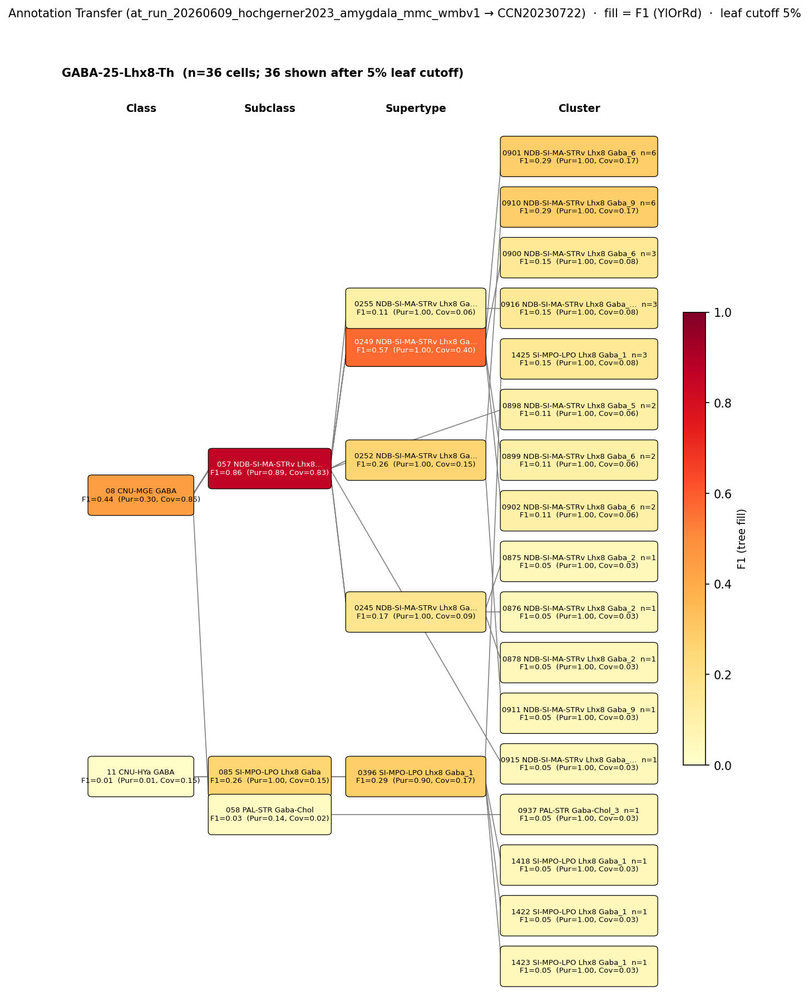

# Central amygdala GABAergic projection neuron — CCN20230722 Mapping Report
* · Source: `kb/graphs/medial_temporal_lobe_amygdala/20260528_medial_temporal_lobe_amygdala_report_ingest.yaml`*

---

## Introduction

The central amygdala (CeA) is the major output nucleus of the amygdaloid complex and is composed almost exclusively of GABAergic projection neurons that send inhibitory projections to brainstem, hypothalamic, and thalamic targets [1][2][3]. Mapping CeA GABAergic projection neurons to the Allen Brain Cell Atlas (WMBv1) is a critical step toward integrating classical fear-circuit and neuromodulatory literature with whole-brain transcriptomic cell-type taxonomy; however, the CeA's positional overlap with the extended amygdala and adjacent pallidal structures makes the atlas boundary imprecise.

### Classical type

| Property | Value | References |
|---|---|---|
| Soma location | Central amygdaloid nucleus [UBERON:0002883] | [1][2][3] |
| Neurotransmitter | GABAergic | [1][3][4] |
| Defining markers | None documented | — |
| Negative markers | None documented | — |
| Neuropeptides | None documented | — |
| Notes | CeA further splits into medial (CeM), lateral (CeL), and central (CeC) sections | — |

<details>
<summary>### Details — source evidence for classical type properties</summary>

- **Soma location:** ASTA report ingest · amygdala nuclei description · [1]
  > The amygdaloid complex includes over a dozen nuclei and can be segregated into five groups (Beyeler and Dabrowska, 2020): (1) the BLA divided into a dorsal section (lateral amygdala, LA) and basal section (basal amygdala, BA), (2) the basomedial amygdala (BMA), (3) the central amygdala (CeA) further splits into medial, lateral, and central sections (CeM, CeL, and CeC), (4) the medial amygdala (MeA), and (5) the cortical amygdala (CoA)
  > — Raudales et al. 2024, Amygdala organization and principal cellular classes · [1] <!-- quote_key: 271240390_a9790f35 -->

- **Soma location (additional):** ASTA report ingest · amygdala classification · [2]
  > .amygdala nuclei are commonly categorised into three groups: the deep laterobasal amygdala containing the lateral (LA) and basal nuclei; the superficial cortical-like nuclei; and centromedial amygdala containing the central (CE) and medial nuclei. (Yang et al., 2017)
  > — Nolan et al. 2020, Medial temporal lobe structures and broad cellular makeup · [2] <!-- quote_key: 222092617_b027389d -->

- **Soma location (additional):** ASTA report ingest · sub-nuclei enumeration · [3]
  > At the cellular level, the amygdala is composed of a group of 13 sub-nuclei located in the medial temporal lobe (Price, 2003). These nuclei may be divided into four subdivisions (Sah et al., 2003): (Ethen et al., 2009) basolateral (which includes the lateral, basolateral, and basomedial nuclei), (May et al., 2009) cortical like (including nucleus of the lateral olfactory tract, bed nucleus of the accessory olfactory tract, the cortical nucleus, and the periamygdaloid cortex), (3) centromedial (central and medial nuclei, and the amygdaloid part of the bed nucleus of stria terminalis), and (4) other (which includes anterior amygdala area, the amygdalo-hippocampal area, and the intercalated nuclei)
  > — Ignacio et al. 2014, Amygdala organization and principal cellular classes · [3] <!-- quote_key: 1229611_e14a19cf -->

- **Neurotransmitter (GABAergic):** ASTA report ingest · NT class evidence · [3][4][1]
  > .In the basolateral group, approximately 70% of neurons are thought to be glutamatergic (pyramidal, spiny, or class I neurons). This division also contains interneurons such as GABAergic nonspiny stellate cells of the cortex (called S cells, stellate, or class II neurons). In contrast, within the central nucleus, the majority of cells are thought to be GABAergic.
  > — Ignacio et al. 2014, Amygdala organization and principal cellular classes · [3] <!-- quote_key: 1229611_70584dfd -->

  > Both the cortical amygdalar nuclei and the basolateral amygdalar nuclear complex, which is located deeper within the amygdaloid complex, have cortex-like cell types (McDonald et al., 2016). In contrast, the so called "extended amygdalar nuclei" contain predominantly GABAergic spiny projection neurons, like the striatum (McDonald et al., 2016).
  > — Loonen & Ivanova 2016, Amygdala organization and principal cellular classes · [4] <!-- quote_key: 18703800_715e9b7d -->

  > .the former includes BLA, CoA, BMA, and MeA, while the latter includes CeA and BST.Within the amygdala nuclei, PNs are exclusively glutamatergic in BLA, CoA, BMA, exclusively GABAergic in CeA, and predominantly GABAergic in MeA and BST.In rodents, there is also a population of glutamatergic pyramidal neurons (GLU PNs, derived from third ventricle neuroepithelium) that populates the BST, MeA, and hypothalamus (García-Moreno et al., 2010)(Huilgol et al., 2016).
  > — Raudales et al. 2024, Amygdala organization and principal cellular classes · [1] <!-- quote_key: 271240390_b54d0b91 -->

</details>

### Cell Ontology mapping

Cell Ontology mapping: GABAergic interneuron [[CL:0011005](https://www.ebi.ac.uk/ols4/ontologies/cl/classes?obo_id=CL:0011005)] (BROAD).

*(note: CL:0011005 "GABAergic interneuron" describes inhibitory interneurons, which is a partial mismatch for a projection neuron. The CeA GABAergic projection neuron is a striatum-like spiny projection neuron, not an interneuron. This BROAD mapping requires expert review — a more specific CL term, or a new CL contribution, is likely appropriate.)*

---

## Results

One candidate atlas supertype was assessed; 0249 NDB-SI-MA-STRv Lhx8 Gaba_6 [CS20230722_SUPT_0249] is the sole mapping at LOW confidence via a broad (`skos:broadMatch`) relationship. The mapping is supported by annotation transfer (MapMyCells, Hochgerner 2023 amygdala dataset, F1=0.57 at SUPERTYPE level) and MERFISH soma-position data confirming a CeA subpopulation within the supertype, but the supertype is distributed primarily across NDB/SI/STRv/Pallidum rather than the CeA specifically.



*F1 across taxonomy levels for the 1 source group relevant to Central amygdala GABAergic projection neuron (Hochgerner 2023 GABA-25-Lhx8-Th, n=50 naive cells, `at_run_20260609_hochgerner2023_amygdala_mmc_wmbv1`). Each panel row is a source-cell group; nodes are coloured by F1 with **Purity** (Pur) and **Coverage** (Cov) shown inline. Coverage = fraction of source-group cells landing on this target; Purity = fraction of this target's cells coming from the source group. With a single source group, Purity differentiates targets from each other; Coverage discriminates within the top-ranked subclass. F1 ≥ 0.5 at a level indicates a clean mapping at that resolution. At SUBCLASS level (NDB-SI-MA-STRv Lhx8 Gaba, F1=0.86, Pur=0.89, Cov=0.83) the signal is strong; at SUPERTYPE level it fragments across 0249 NDB-SI-MA-STRv Lhx8 Gaba_6 (F1=0.57, Purity=1.0, Coverage=0.40) and related supertypes, reflecting heterogeneity within the subclass.*

The source labels in this AT run are transcriptomically-defined types, not classical morpho-electrophysiological types; fear-conditioned cells were excluded to avoid transcriptional-state confounds.

### Mapping candidates overview

| Rank | WMBv1 supertype | Cells (10x) | Confidence | Key property alignment | Verdict |
|---|---|---:|---|---|---|
| 1 | 0249 NDB-SI-MA-STRv Lhx8 Gaba_6 [CS20230722_SUPT_0249] | 423 | 🔴 LOW | NT CONSISTENT · Location APPROXIMATE | Speculative broadMatch |

1 edge assessed; relationship: `skos:broadMatch`.

### Property alignment — 0249 NDB-SI-MA-STRv Lhx8 Gaba_6 [CS20230722_SUPT_0249]

**Table 1 — Property comparison**

| Property | Classical | Supertype | Best cluster | Alignment |
|---|---|---|---|---|
| Soma location | Central amygdaloid nucleus [UBERON:0002883] | MBA:536 CeA: 85 cells/0.150 (Zhuang 2023); dominant locations: NDB, SI, STRv, Pallidum (region_fraction 0.14 for CeA) | Not assessed | APPROXIMATE |
| NT type | GABAergic | GABA (inferred from label NDB-SI-MA-STRv Lhx8 Gaba_6; nt_type field null) | Not assessed | CONSISTENT |
| Gbx1 expression | Not assessed (no defining markers on classical node) | Gbx1 DEFINING marker on SUPT_0249 | Not assessed | NOT_ASSESSED |
| Th expression | Not assessed | Th DEFINING marker on SUPT_0249 | Not assessed | NOT_ASSESSED |
| Nr4a2 expression | Not assessed | Nr4a2 DEFINING and DEFINING_SCOPED on SUPT_0249 | Not assessed | NOT_ASSESSED |
| Sex ratio | Not documented | Not available | Not available | NOT_ASSESSED |

**Table 2 — Evidence support**

| Evidence | Type | Supports | Headline | Source |
|---|---|---|---|---|
| MERFISH location + GABAergic label | Atlas metadata | SUPPORT | MBA:536 CeA: 85 cells, ratio 0.150 (Zhuang 2023); GABAergic label consistent | atlas-internal |
| Hochgerner 2023 GABA-25-Lhx8-Th MapMyCells | Annotation transfer | SUPPORT | F1=0.86 at SUBCLASS; F1=0.57 at SUPERTYPE (`at_run_20260609_hochgerner2023_amygdala_mmc_wmbv1`) | — |

*(Child-cluster breakdown not assessed — see proposed experiments.)*

---

### 0249 NDB-SI-MA-STRv Lhx8 Gaba_6 [CS20230722_SUPT_0249] · 🔴 LOW

**Supporting evidence:**

- **Atlas metadata (MERFISH, Zhuang 2023):** SUPT_0249 contains 85 cells at MBA:536 (Central amygdaloid nucleus [UBERON:0002883]) with a region ratio of 0.150, confirming that a genuine CeA subpopulation exists within this supertype. The GABAergic label is consistent with the exclusively GABAergic identity of the classical node.
- **Annotation transfer (`at_run_20260609_hochgerner2023_amygdala_mmc_wmbv1`):** The Hochgerner 2023 GABA-25-Lhx8-Th source cluster (n=50 naive cells, ArrayExpress:E-MTAB-12096) maps at F1=0.86 (Purity=0.89, Coverage=0.83) to the NDB-SI-MA-STRv Lhx8 Gaba subclass and at F1=0.57 (Purity=1.0, Coverage=0.40) to supertype 0249 NDB-SI-MA-STRv Lhx8 Gaba_6 [CS20230722_SUPT_0249]. The strong subclass-level signal indicates that the Lhx8 GABA source population lands robustly within the NDB-SI-MA-STRv Lhx8 Gaba subclass. At supertype level, coverage drops to 0.40, meaning only approximately 40% of source cells converge on SUPT_0249 specifically; the remainder scatter across related NDB-SI-MA supertypes within the same subclass.
- **Stage A discovery:** The cohort comprised 5 GABAergic supertypes at MBA:536, all scoring equally (score=1, rank_in_cohort=1, cohort_size=5, next_best_score=1). SUPT_0249 ranked first only by cohort order. The discovery score provides no discriminative signal in this case.

**Marker evidence provenance:**

The classical node carries no defining markers, negative markers, or neuropeptides. All three marker-type property comparisons (Gbx1, Th, Nr4a2) are NOT_ASSESSED because no classical literature was available to establish whether CeA GABAergic projection neurons express or lack these genes. Key observations from the atlas-side comparison:

- **Th (tyrosine hydroxylase):** Th is listed as a DEFINING marker for SUPT_0249. Th expression in a CeA GABAergic projection neuron would be unusual — TH is primarily associated with catecholaminergic neurons. *(note: the Th enrichment in SUPT_0249 likely reflects the non-CeA majority of this supertype, particularly NDB/SI/STRv cells, where TH-expressing populations are well established. A spatial filter restricted to MBA:536 cells would resolve whether CeA-local cells within SUPT_0249 actually express Th.)*

  **Atlas annotation/expression discrepancy to investigate:** Th is listed as a DEFINING marker for SUPT_0249 but is atypical for CeA GABAergic projection neurons. This may reflect the non-CeA majority fraction (NDB/SI/STRv) driving the supertype-level Th signal. Flag for spatial-filter verification before treating Th as a CeA marker.

- **Nr4a2 (Nurr1):** Nr4a2 (DEFINING and DEFINING_SCOPED on SUPT_0249) is a transcription factor associated with dopaminergic neuron development and select GABAergic populations in basal ganglia. Its presence further suggests the supertype's dominant biology is non-CeA-canonical. *(note: Nr4a2 has been reported in cholinergic and dopaminergic neurons of the NDB/SI region; its presence here is consistent with a non-CeA origin of the supertype majority.)*
- **Gbx1:** No established expectation for CeA GABAergic neurons. NOT_ASSESSED.

**Concerns:**

- **Location APPROXIMATE — broad supertype scope:** SUPT_0249 has region_fraction=0.14 for CeA; dominant soma positions are NDB, SI, and STRv. The CeA is anatomically distinct from NDB/SI (basal forebrain, anterior to CeA) and STRv (ventral striatum/nucleus accumbens region) *(note: in mouse brain coordinates, NDB/SI are located in the medial septum/basal forebrain region, several millimetres anterior and medial to the CeA; STRv is the ventromedial striatum — both are anatomically distant from CeA proper)*. The broadMatch predicate correctly reflects this spatial mismatch; the relationship is not 1:1.
- **Atlas marker mismatch risk:** SUPT_0249's defining marker Th is atypical for CeA neurons and may be driven by the non-CeA fraction. This weakens any biological identity claim for the CeA cells within this supertype.
- **Multiple equally-ranked candidates:** Four additional GABAergic supertypes at MBA:536 (SUPT_0255, SUPT_0252, SUPT_0238, SUPT_0235) scored identically at Stage A (score=1 each). The AT signal at supertype level (F1=0.57) does not clearly discriminate among these candidates.
- **No classical markers defined:** Without defining markers on the classical node, all atlas-side marker comparisons are NOT_ASSESSED. The mapping rests entirely on location (APPROXIMATE) and NT type (CONSISTENT), which provides minimal discriminative power for selecting among the five equally-scored candidates.

**What would upgrade confidence:**

1. **Atlas metadata query for canonical CeA markers** — Query CCN20230722 at supertype rank for expression of Prkcd, Sst, Crh, Isl1, Calcrl, Htr2a, Tac2 across SUPT_0249, SUPT_0255, SUPT_0252, SUPT_0238, SUPT_0235. Expected output: `ATLAS_QUERY` evidence items with property_comparisons; may allow upgrading one edge to MODERATE if a CONSISTENT alignment is found. Resolves open question 1.
2. **MERFISH spatial filter — Th discrepancy** — Apply spatial filtering to restrict SUPT_0249 to MBA:536 cells only and compare Th expression in the spatial subset vs. the full supertype. Expected output: `ATLAS_METADATA` evidence item with spatially-filtered expression values. Resolves open question 2.
3. **Targeted literature review for CeA GABAergic projection neuron markers** — Cite-traverse for "Prkcd CeA central amygdala", "Sst CeA projection neuron", "Crh CeA neuron", "Isl1 central amygdala". Populating defining_markers on the classical node would enable property comparison rows for marker_Prkcd, marker_Sst, marker_Crh, marker_Isl1. Expected output: `LITERATURE` evidence items; PropertySource entries on classical node. Enables marker-level discriminative comparisons; resolves all NOT_ASSESSED rows.
4. **Targeted annotation transfer with CeA-specific source dataset** — A dataset with confirmed CeA subtypes (Prkcd+, Sst+, Crh+ populations) would allow a more targeted MapMyCells run against CCN20230722. Target: F1 ≥ 0.50 at SUPERTYPE level, F1 ≥ 0.70 at SUBCLASS level. Expected output: `AnnotationTransferEvidence`; new `at_run_*` entry. If F1 ≥ 0.50 and marker profile is consistent, confidence could be upgraded to MODERATE.

---

## Methods

<details>
<summary>Data sources, analyses, and reproducibility receipts</summary>

**Classical type definition.** The Central amygdala GABAergic projection neuron is defined on a CLASSICAL basis: soma in Central amygdaloid nucleus [UBERON:0002883] [1][2][3], GABAergic neurotransmitter type [1][3][4]. No defining molecular markers, negative markers, or neuropeptides were recorded at the time of report generation. The node notes state: "CeA further splits into medial (CeM), lateral (CeL), and central (CeC) sections." Definition basis: CLASSICAL.

**Atlas mapping query.** Candidate atlas clusters were retrieved from the CCN20230722 taxonomy at ranks 0 (cluster) and 1 (supertype) using metadata-based scoring (region match, NT type, defining markers, sex bias when applicable). Full scoring rules: `workflows/map-cell-type.md`. The Stage A survival cohort comprised 5 GABAergic supertypes at MBA:536 (filters: region=MBA:536, nt_type=GABAergic); all scored equally (score=1, cohort_size=5), so SUPT_0249 was ranked first by cohort order only.

**Property alignment.** Each defining property of the classical type was compared to the corresponding atlas-side value via the `property_comparisons` schema, with alignments graded CONSISTENT / APPROXIMATE / DISCORDANT / NOT_ASSESSED. Atlas-side numerical values came from precomputed expression on the cluster (cluster.yaml in the taxonomy reference store) and from MERFISH spatial registration for soma location.

**Annotation transfer.**

| Field | Value |
|---|---|
| Source dataset | ArrayExpress:E-MTAB-12096 (GABA-25-Lhx8-Th) |
| Source species | NCBITaxon:10090 (mouse) |
| Target atlas | WMBv1 (CCN20230722; SHA-256: b21ca985) |
| Method | MapMyCells local (cell_type_mapper v1.7.1, default parameters, raw normalization, 100 bootstrap iterations) |
| Tool version | cell_type_mapper v1.7.1 |
| Bootstrap threshold | 0.7 |
| n cells | 55514 (filtered to 7777) |
| Run record | [`kb/annotation_transfer_runs/at_run_20260609_hochgerner2023_amygdala_mmc_wmbv1/manifest.yaml`](../../kb/annotation_transfer_runs/at_run_20260609_hochgerner2023_amygdala_mmc_wmbv1/manifest.yaml) |
| Script (external) | README.md |
| Code reference | [https://github.com/AllenInstitute/cell_type_mapper](https://github.com/AllenInstitute/cell_type_mapper) |
| F1 matrix | [`research/medial_temporal_lobe_amygdala/annotation_transfer/hochgerner2023_amygdala/mapping_result.csv`](../../research/medial_temporal_lobe_amygdala/annotation_transfer/hochgerner2023_amygdala/mapping_result.csv) |
| Caveats | Source labels are transcriptomically-defined types, not classical morpho-electrophysiological types. Matching to KB classical nodes requires a mapping step (Hochgerner type → classical node) based on shared molecular markers. Fear-conditioned cells excluded to avoid transcriptional-state confounds. Non-neuronal cells excluded. Gene symbols used (not Ensembl IDs); matched against WMBv1 marker genes. |

**Anti-hallucination.** All citations, atlas accessions, ontology CURIEs, and verbatim literature quotes in this report are validated against the evidencell knowledge base at write time. Authored-prose evidence narratives are validated against their source `evidence_items[*].explanation` fields. The pre-write hook rejects any unresolvable identifier or unattributed blockquote. Specific mapping limitations and caveats are documented per-candidate in the Discussion section.

**Evidence base table**

| Edge ID | Evidence types | Supports | Source |
|---|---|---|---|
| edge_central_amygdala_gabaergic_projection_neuron_to_cs20230722_supt_0249 | ATLAS_METADATA; ANNOTATION_TRANSFER | SUPPORT; SUPPORT | atlas-internal; — |

*Generated by evidencell `9d82411` at 2026-06-10T12:49:04+00:00 from [kb/graphs/medial_temporal_lobe_amygdala/20260528_medial_temporal_lobe_amygdala_report_ingest.yaml](../../kb/graphs/medial_temporal_lobe_amygdala/20260528_medial_temporal_lobe_amygdala_report_ingest.yaml).*

</details>

---

## Discussion

### Best candidate and caveats

**Primary mapping:** Central amygdala GABAergic projection neuron → 0249 NDB-SI-MA-STRv Lhx8 Gaba_6 [CS20230722_SUPT_0249] at LOW confidence. Key support: annotation transfer (F1=0.57 at SUPERTYPE from `at_run_20260609_hochgerner2023_amygdala_mmc_wmbv1`) and MERFISH spatial confirmation of a CeA subpopulation (85 cells, ratio 0.150). Key caveats: BROAD_ATLAS_TYPE (CeA is only ~14% of SUPT_0249; dominant regions are NDB/SI/STRv/Pallidum), ATLAS_MARKER_MISMATCH_RISK (Th as a defining marker is atypical for CeA neurons), and MULTIPLE_CANDIDATES (four equally-ranked alternative supertypes not yet distinguished).

The Cell Ontology has no specific term for this CeA projection neuron population; CL:0011005 (GABAergic interneuron) is the closest ancestor assigned but is a class mismatch — the classical type is a projection neuron, not an interneuron. This node is a candidate for a new CL term contribution. The mapping was auto-proposed by asta-report-ingest and requires expert review.

### Proposed experiments and follow-ups

The existing AT run (`at_run_20260609_hochgerner2023_amygdala_mmc_wmbv1`) has already provided strong subclass-level resolution (F1=0.86 to the NDB-SI-MA-STRv Lhx8 Gaba subclass) but does not resolve which of the five equally-scored CeA supertypes is the primary match. The completed AT round establishes that the Hochgerner GABA-25-Lhx8-Th population belongs to the NDB-SI-MA-STRv Lhx8 Gaba subclass; further molecular and spatial work is needed to pin the CeA-specific supertype.

**1. Atlas metadata query — canonical CeA markers**
- **What:** Query CCN20230722 at supertype rank for expression of Prkcd, Sst, Crh, Isl1, Calcrl, Htr2a, Tac2 across SUPT_0249, SUPT_0255, SUPT_0252, SUPT_0238, SUPT_0235.
- **Target:** At least one CONSISTENT alignment at SUPERTYPE rank for a canonical CeA marker.
- **Expected output:** `ATLAS_QUERY` and `ATLAS_METADATA` evidence items; upgraded property_comparisons on the primary edge. Confidence could be upgraded to MODERATE if a CONSISTENT marker alignment is found.
- **Resolves:** Open question 1.

**2. MERFISH spatial filter — Th discrepancy**
- **What:** Apply spatial filtering to restrict SUPT_0249 to MBA:536 cells and compare Th and other marker expression in the spatial subset vs. the full supertype.
- **Target:** Clear determination of whether Th expression is restricted to non-CeA cells.
- **Expected output:** `ATLAS_METADATA` evidence item with spatially-filtered expression values; resolves `ATLAS_MARKER_MISMATCH_RISK` caveat.
- **Resolves:** Open question 2.

**3. Targeted literature review — CeA defining markers**
- **What:** Cite-traverse for "Prkcd CeA central amygdala projection neuron", "Sst CeA projection neuron", "Crh CeA neuron", "Isl1 central amygdala". Populate defining_markers on the classical node with PropertySource entries.
- **Target:** At least 2–3 defining markers with primary literature citations.
- **Expected output:** `LITERATURE` evidence items; populated defining_markers on classical node; enables marker-level property comparisons.
- **Resolves:** All NOT_ASSESSED marker comparison rows; provides molecular discriminators among the 5 supertype candidates.

**4. Targeted annotation transfer with CeA-specific source dataset**
- **What:** If a dataset with confirmed CeA subtypes (Prkcd+, Sst+, Crh+ populations) is available, run MapMyCells local (cell_type_mapper >= v1.7.1) against CCN20230722.
- **Target:** F1 >= 0.50 at SUPERTYPE level; F1 >= 0.70 at SUBCLASS level.
- **Expected output:** `AnnotationTransferEvidence`; new `at_run_*` entry on the edge. Confidence could be upgraded to MODERATE if F1 >= 0.50 and marker profile is consistent.
- **Resolves:** Open question 1.

### Open questions

1. Which of the 5 ranked CeA GABAergic supertypes (SUPT_0249, SUPT_0255, SUPT_0252, SUPT_0238, SUPT_0235) best captures the classical molecular profile? Canonical CeA markers (Prkcd, Sst, Crh, Calcrl, Htr2a, Tac2, Isl1) are not among the defining markers of any candidate — an atlas metadata query would resolve this without new experiments.
2. Does Th expression in SUPT_0249 reflect genuine TH co-expression in CeA neurons, or is it driven by the non-CeA majority (NDB/SI/STRv)?

---

## References

| # | Citation | PMID | Used for |
|---|---|---|---|
| [1] | Raudales et al. 2024 | [39012795](https://pubmed.ncbi.nlm.nih.gov/39012795/) | Soma location; neurotransmitter type |
| [2] | Nolan et al. 2020 | [33015518](https://pubmed.ncbi.nlm.nih.gov/33015518/) | Soma location |
| [3] | Ignacio et al. 2014 | [25309888](https://pubmed.ncbi.nlm.nih.gov/25309888/) | Soma location; neurotransmitter type |
| [4] | Loonen & Ivanova 2016 | [27920666](https://pubmed.ncbi.nlm.nih.gov/27920666/) | Neurotransmitter type |

---

<!-- verdict-block-start: edge_central_amygdala_gabaergic_projection_neuron_to_cs20230722_supt_0249 -->
```yaml
verdict:
  confidence: LOW
  confidence_score: 0.25
  rationale: >
    AT (GABA-25-Lhx8-Th, `at_run_20260609_hochgerner2023_amygdala_mmc_wmbv1`)
    yields F1=0.57 at SUPERTYPE (CS20230722_SUPT_0249) with coverage=0.40;
    subclass anchor is strong (F1=0.86). MERFISH
    places 85 cells at MBA:536 (region_fraction=0.14), confirming a genuine
    CeA subpopulation but the supertype spans NDB/SI/STRv/Pallidum. NT is
    CONSISTENT; 0 of 3 markers CONSISTENT (marker_GBX1, marker_TH,
    marker_NR4A2 all NOT_ASSESSED: no defining markers on classical node).
    broadMatch reflects the 1:n spatial scope mismatch and absence
    of molecular discriminators.
  reconciliation_note: >
    Five equally-scored CeA GABAergic supertypes (score=1 each,
    cohort_size=5); CS20230722_SUPT_0249 ranked first by cohort order only.
    SUPT_0255, SUPT_0252, SUPT_0238, SUPT_0235 remain equally viable until
    canonical CeA markers (Prkcd, Sst, Crh, Isl1) are queried at supertype
    rank.
  unresolved_questions:
    - "Which of the 5 ranked CeA GABAergic supertypes best captures the classical molecular profile? Query CCN20230722 for Prkcd, Sst, Crh, Isl1, Calcrl, Htr2a, Tac2 at supertype rank across CS20230722_SUPT_0249, SUPT_0255, SUPT_0252, SUPT_0238, SUPT_0235."
    - "Does Th expression in CS20230722_SUPT_0249 reflect genuine TH co-expression in CeA neurons, or is it driven by the non-CeA majority (NDB/SI/STRv)?"
```
<!-- verdict-block-end -->
