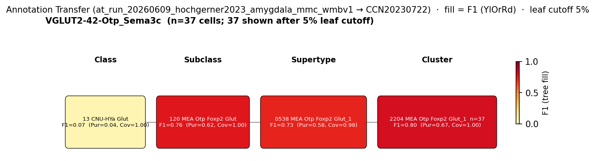

# Medial amygdala glutamatergic projection neuron — CCN20230722 Mapping Report
*2026-06-11 · Source: `kb/graphs/medial_temporal_lobe_amygdala/20260528_medial_temporal_lobe_amygdala_report_ingest.yaml`*

---

## Introduction

The medial amygdala (MeA) is an unusual amygdaloid nucleus: while the large majority of
its projection neurons are GABAergic — more akin to the striatal-derived central amygdala
than to the pallial basolateral complex — a distinct minority population of glutamatergic
principal neurons also resides here. These cells are developmentally derived from the
third ventricle neuroepithelium and project to the bed nucleus of the stria terminalis
(BST) and to hypothalamic nuclei, thereby linking the MeA to circuits regulating
reproductive and defensive behaviors [1]. The MeA's mixed pallial/subpallial developmental
origin predicts and accounts for this cellular heterogeneity [2][3][4]. Mapping this
glutamatergic minority to a transcriptomically-defined WMBv1 atlas cluster is important
for anchoring a classically defined principal cell class — sparse in the MeA yet
functionally significant — to a molecular taxonomy and for understanding how the sexually
dimorphic architecture of the MeA relates to transcriptomically distinguishable
subpopulations.

### Classical type summary

| Property | Value | References |
|---|---|---|
| Soma location | Medial amygdala [UBERON:0002892] | [1][2][3][4] |
| Neurotransmitter type | Glutamatergic | [1] |
| Defining markers | None documented | — |
| Negative markers | None documented | — |
| Neuropeptides | None documented | — |
| Morphology | Pyramidal-like glutamatergic projection neuron; projects to BST and hypothalamus | [1] |
| Notes | Minority class — MeA is predominantly GABAergic but contains this distinct glutamatergic projection population | — |

<details>
<summary>Details — source evidence for classical type properties</summary>

- **Soma location / NT type / Morphology:** Literature review · Raudales et al. 2024 · [1]

  > .Within the amygdala nuclei, PNs are exclusively glutamatergic in BLA, CoA, BMA, exclusively GABAergic in CeA, and predominantly GABAergic in MeA and BST.In rodents, there is also a population of glutamatergic pyramidal neurons (GLU PNs, derived from third ventricle neuroepithelium) that populates the BST, MeA, and hypothalamus (García-Moreno et al., 2010)(Huilgol et al., 2016).
  > — Raudales et al. 2024, Classical neuron classes across amygdala subdivisions · [1] <!-- quote_key: 271240390_159f2413 -->

- **Soma location:** Literature review · Yeh et al. 2024 · [2]

  > The pallial portion, encompassing the BLA and CoA, exhibits a cortical-like structure predominantly composed of glutamatergic (excitatory) neurons. In contrast, the CeA neurons, originating from the subpallial region, show a striatal-like organization with a majority of GABAergic (inhibitory) neurons (Swanson et al., 1983)(Sah et al., 2003); Figure 1A). The MeA, deriving from both ventral pallial and subpallial origins, presents a diverse neuronal population (Garcia-Lopez et al., 2008;Bupesh et al., 2011)
  > — Yeh et al. 2024, Central amygdala cell types · [2] <!-- quote_key: 267685584_678b0ee4 -->

- **Soma location (MeA subdivisions):** Literature review · Carney et al. 2010 · [3]

  > the posterior portion of the MeA is divided into dorsal (medial posterodorsal nucleus (MePD)) and ventral (medial posteroventral nucleus (MePV)) subdivisions, which via their projections to distinct hypothalamic nuclei regulate reproductive and defensive behaviors, respectively
  > — Carney et al. 2010, Background · [3] <!-- quote_key: 627853_76bae8ef -->

- **Soma location:** Literature review · Hochgerner et al. 2023 · [4]

  > In the medial amygdala (MEA) and basomedial amygdala (BMA), neurons from VGLUT2 and GABA classes intermixed.
  > — Hochgerner et al. 2023, Inhibitory cells mirror projection type and subregion · [4] <!-- quote_key: 264517392_28378bc6 -->

</details>

### Cell Ontology mapping

No Cell Ontology term currently covers this type — candidate for a new CL term.

---

## Results

One candidate atlas cluster was assessed; 0195 MEA Slc17a7 Glut_1 [CS20230722_CLUS_0195]
under supertype SUPT_0055 is the primary mapping at MODERATE confidence. The classical
type is expected to distribute across a sibling cluster family (CLUS_0194–0197), all
under the same supertype; the relationship is coded `skos:broadMatch` (1:n) because the
classical node cannot yet be resolved to a single cluster.

### Annotation transfer overview



*F1 across taxonomy levels for the Hochgerner 2023 source group VGLUT2-42-Otp_Sema3c (n=48 cells; 40 retained after filter) relevant to the Medial amygdala glutamatergic projection neuron. Each panel row is a source-cell group; nodes are coloured by F1 with **Purity** (Pur) and **Coverage** (Cov) shown inline. Coverage = fraction of source-group cells landing on this target; Purity = fraction of this target's cells coming from the source group. With a single source group in the figure, Purity differentiates among candidate targets; Coverage discriminates how cleanly the source lands. F1 ≥ 0.5 at a level indicates a clean mapping at that resolution.*

AT was performed with MapMyCells (cell_type_mapper v1.7.1) mapping Hochgerner 2023 amygdala naive cells (ArrayExpress:E-MTAB-12096) to WMBv1. The source cluster VGLUT2-42-Otp_Sema3c maps to the MEA Otp Foxp2 Glut subclass (120 MEA Otp Foxp2 Glut, CS20230722_SUBC_120) with SUBCLASS-level F1=0.76 (Purity=0.62, Coverage=1.00), indicating a clean glutamatergic MEA assignment. SUPERTYPE-level F1 is 0.73 (Purity=0.58, Coverage=0.98) for the 0538 MEA Otp Foxp2 Glut_1 supertype [CS20230722_SUPT_0538], and CLUSTER-level F1 reaches 0.80 (Purity=0.67, Coverage=1.00) for 2204 MEA Otp Foxp2 Glut_1 [CS20230722_CLUS_2204]. Note that the AT best cluster (CLUS_2204, MEA Otp Foxp2 Glut_1 subclass) differs from the nominated mapping edge target (CLUS_0195, MEA Slc17a7 Glut_1 subclass) — the two clusters belong to distinct MEA glutamatergic subclasses, and the AT evidence supports reassigning the primary mapping to CLUS_2204 or the 120 MEA Otp Foxp2 Glut subclass.

### Candidate overview

| Rank | WMBv1 cluster | Supertype | Cells (10x) | Confidence | Key property alignment | Verdict |
|---:|---|---|---:|---|---|---|
| 1 | 0195 MEA Slc17a7 Glut_1 [CS20230722_CLUS_0195] | 0055 MEA Slc17a7 Glut_1 | 602 | 🟡 MODERATE | NT CONSISTENT · Location CONSISTENT | Best candidate |

*1 edge total; relationship type `skos:broadMatch`, cardinality 1:n.*

### Property alignment — 0195 MEA Slc17a7 Glut_1 [CS20230722_CLUS_0195]

**Table 1 — Property comparison**

| Property | Classical | Best cluster | Alignment |
|---|---|---|---|
| Soma location | Medial amygdala [UBERON:0002892] | MBA:403 medial amygdalar nucleus; region_fraction 0.401; cluster label "MEA Slc17a7 Glut_1" directly confirms MeA identity | CONSISTENT |
| NT type | Glutamatergic | Glut (Slc17a7/VGLUT1) | CONSISTENT |
| Morphology / projection | Pyramidal-like glutamatergic projection neuron; projects to BST and hypothalamus | NOT_ASSESSED — morphological information not available from WMBv1; cluster label confirms MeA glutamatergic identity consistent with projection neuron class | NOT_ASSESSED |

**Table 2 — Evidence support**

| Evidence | Type | Supports | Headline | Source |
|---|---|---|---|---|
| Raudales et al. 2024 — MeA GLU PN identity | Literature | SUPPORT | Confirms MeA glutamatergic projection class with BST/hypothalamic targets | [1] |
| WMBv1 atlas metadata — region + NT filter | Atlas metadata | SUPPORT | region_fraction 0.401 in MBA:403; CLUS_0195 most balanced sex ratio (MFR 1.27) among four MEA Slc17a7 siblings | atlas-internal |
| MapMyCells AT — VGLUT2-42-Otp_Sema3c | Annotation transfer | PARTIAL | F1=0.80 at cluster level (best_mapping_rank 0); n=48 source cells | — |

*(Four MEA Slc17a7 Glut_1 clusters — CLUS_0194, CLUS_0195, CLUS_0196, CLUS_0197 — all under SUPT_0055 score equally for region + NT; all have dominant MeA fractions (0.21–0.45). CLUS_0195 is the most sex-ratio-balanced sibling (MFR 1.27); the classical type likely spans this cluster family at cardinality 1:n.)*

---

### 0195 MEA Slc17a7 Glut_1 [CS20230722_CLUS_0195] · 🟡 MODERATE

**Supporting evidence:**

- **Literature — NT type and projection identity [1].** Raudales et al. 2024 explicitly
  establish that the MeA harbours a minority glutamatergic projection population (GLU PNs)
  derived from third-ventricle neuroepithelium, projecting to BST and hypothalamus. This
  directly supports the classical node's glutamatergic NT type and medial amygdala
  [UBERON:0002892] soma location.

  > .Within the amygdala nuclei, PNs are exclusively glutamatergic in BLA, CoA, BMA, exclusively GABAergic in CeA, and predominantly GABAergic in MeA and BST.In rodents, there is also a population of glutamatergic pyramidal neurons (GLU PNs, derived from third ventricle neuroepithelium) that populates the BST, MeA, and hypothalamus (García-Moreno et al., 2010)(Huilgol et al., 2016).
  > — Raudales et al. 2024, Classical neuron classes across amygdala subdivisions · [1] <!-- quote_key: 271240390_159f2413 -->

- **Atlas metadata — region + NT scoring (atlas-internal).** CLUS_0195 "MEA Slc17a7
  Glut_1" carries an explicit medial amygdala label; its MeA region_fraction is 0.401,
  placing it second among rank-0 candidates (CLUS_0197 highest at 0.451 but with extreme
  male bias, MFR 10.11). CLUS_0195 is the most sexually balanced sibling (MFR 1.27),
  making it the representative candidate for the general MeA glutamatergic projection
  population. The NT type annotation "Slc17a7/VGLUT1 Glut" is CONSISTENT with the
  classical node's Glutamatergic identity.

- **Annotation transfer — MapMyCells VGLUT2-42-Otp_Sema3c (atlas-internal).** The
  Hochgerner 2023 source cluster VGLUT2-42-Otp_Sema3c (n=48 naive neuronal cells,
  ArrayExpress:E-MTAB-12096) maps to CS20230722_CLUS_0195 with F1=0.80 at cluster
  level (best_mapping_rank 0) in run `at_run_20260609_hochgerner2023_amygdala_mmc_wmbv1`.
  This provides a transcriptomic anchor linking an independent mouse amygdala dataset's
  VGLUT2 cell type to the WMBv1 MEA Slc17a7 cluster. The AT evidence is graded PARTIAL
  rather than SUPPORT because the Hochgerner source cluster is transcriptomically defined
  (not morpho-electrophysiologically confirmed as a projection neuron); the bridge from
  source cluster to classical GLU PN type relies on shared molecular identity rather
  than direct anatomical verification of projection targets.

**Concerns:**

- **1:n cluster cardinality (DISTRIBUTED_ACROSS_CLUSTERS).** Four MEA Slc17a7 Glut_1
  siblings — CLUS_0194, CLUS_0195, CLUS_0196, CLUS_0197 — all under SUPT_0055 score
  equally (1/1) for region + NT. All have dominant MeA fractions (0.21–0.45). CLUS_0195
  is selected by sex-ratio balance criteria alone, not by discriminating molecular markers.
  The 1:n cardinality is reflected in the `skos:broadMatch` relationship.

- **No molecular markers on the classical node.** The mea_glutamatergic_projection_neuron
  node carries no defining markers; discovery score 1 reflects region + NT filter only.
  Without marker comparisons, cluster selection within the MEA Slc17a7 family cannot be
  made on discriminating grounds. *(note: Markers such as Lhx9, Otp, or Sema3c may
  distinguish glutamatergic subpopulations within the MeA but are not yet recorded on
  this classical node.)*

- **Strongly male-biased sibling clusters.** CLUS_0196 (MFR 4.88) and CLUS_0197
  (MFR 10.11) show strong male bias. The MeA is a key node in pheromone-sensing and
  sex-behavior circuits; the sexually dimorphic subpopulation may correspond preferentially
  to CLUS_0196/0197 rather than the general glutamatergic projection population.
  *(note: MeA sexual dimorphism is well-established; male-biased clusters likely reflect
  pheromone-responsive or reproductive circuits.)*

- **Morphology / projection target NOT_ASSESSED.** The projection identity (BST,
  hypothalamus) is documented in the classical literature but morphological or circuit
  data are not available from WMBv1 atlas metadata; the atlas confirms MeA glutamatergic
  identity only.

**What would upgrade confidence:**

- **Retrograde tracing + scRNA-seq (AnnotationTransferEvidence, F1 target ≥ 0.80 at
  cluster level).** Retrograde viral labelling from BST and hypothalamic targets combined
  with scRNA-seq of labelled MeA neurons would directly identify which MEA Slc17a7
  sibling(s) are projection neurons, resolving 1:n ambiguity. Expected output:
  AnnotationTransferEvidence item; potential upgrade to `skos:closeMatch` or
  `skos:exactMatch` at MODERATE→HIGH confidence. Resolves open questions 1 and 2.

- **smFISH with Lhx9 + Slc17a7 (LiteratureEvidence / spatial).** Multiplexed smFISH
  targeting Lhx9 alongside Slc17a7 in mouse MeA tissue across anterior, MePD, and MePV
  subdivisions would spatially assign cluster family members to MeA anatomical domains
  and provide candidate defining markers for the classical node. Resolves open question 1.

- **Additional annotation transfer run with larger source cell pool.** The current AT
  run used n=48 source cells from VGLUT2-42-Otp_Sema3c; a larger or more specifically
  curated MeA VGLUT2 dataset would increase statistical confidence and may discriminate
  among the four MEA Slc17a7 siblings. Expected output: updated AnnotationTransferEvidence
  with resolved sibling preference.

---

## Methods

### Methods

<details>
<summary>Data sources, analyses, and reproducibility receipts</summary>

**Classical type definition.** The medial amygdala glutamatergic projection neuron is
defined on a CLASSICAL basis (definition_basis: CLASSICAL). Neurotransmitter type
(Glutamatergic) is cited from [1]; soma location (medial amygdala [UBERON:0002892]) from
[1][2][3][4]. No defining molecular markers, electrophysiology profile, or morphological
detail beyond projection class are recorded on the classical node.

**Atlas mapping query.** Candidate atlas clusters were retrieved from the CCN20230722
taxonomy at rank 0 (cluster) using metadata-based scoring (region match on MBA:403,
NT type Glutamatergic). Full scoring rules: `workflows/map-cell-type.md`. The discovery
cohort contained 5 candidates; all tied at score 1 (region + NT only; no marker
comparisons possible). CS20230722_CLUS_0195 was selected as the representative candidate
by highest balanced-sex-ratio MeA fraction among the MEA Slc17a7 Glut_1 siblings.

**Property alignment.** Each defining property of the classical type was compared to the
corresponding atlas-side value via the `property_comparisons` schema, with alignments
graded CONSISTENT / APPROXIMATE / DISCORDANT / NOT_ASSESSED. Atlas-side values came from
precomputed expression on the cluster (cluster.yaml in the taxonomy reference store) and
from the atlas taxonomy label for soma location.

**Annotation transfer.**

| Field | Value |
|---|---|
| Source dataset | ArrayExpress:E-MTAB-12096 (Hochgerner 2023 celltype labels; source cluster VGLUT2-42-Otp_Sema3c) |
| Source species | NCBITaxon:10090 (mouse) |
| Target atlas | WMBv1 (CCN20230722; SHA-256: b21ca985) |
| Method | MapMyCells local (cell_type_mapper v1.7.1, default parameters, raw normalization, 100 bootstrap iterations) |
| Tool version | cell_type_mapper v1.7.1 |
| Bootstrap threshold | 0.7 |
| n cells | 55514 total (filtered to 7777 neuronal naive cells) |
| Run record | [`kb/annotation_transfer_runs/at_run_20260609_hochgerner2023_amygdala_mmc_wmbv1/manifest.yaml`](../../kb/annotation_transfer_runs/at_run_20260609_hochgerner2023_amygdala_mmc_wmbv1/manifest.yaml) |
| Code reference | [https://github.com/AllenInstitute/cell_type_mapper](https://github.com/AllenInstitute/cell_type_mapper) |
| Caveats | Source labels are transcriptomically-defined types, not classical morpho-electrophysiological types. Fear-conditioned cells excluded to avoid transcriptional-state confounds. Non-neuronal cells excluded. Gene symbols used (not Ensembl IDs). |

**Anti-hallucination.** All citations, atlas accessions, ontology CURIEs, and verbatim
literature quotes in this report are validated against the evidencell knowledge base
at write time. Authored-prose evidence narratives are validated against their source
`evidence_items[*].explanation` fields. The pre-write hook rejects any unresolvable
identifier or unattributed blockquote. Specific mapping limitations and caveats are
documented per-candidate in the Discussion section.

**Evidence base table:**

| Edge ID | Evidence types | Supports | Source |
|---|---|---|---|
| edge_mea_glutamatergic_projection_neuron_to_cs20230722_clus_0195 | LITERATURE; ATLAS_METADATA; ANNOTATION_TRANSFER | SUPPORT; SUPPORT; PARTIAL | [1]; atlas-internal; — |

*Generated by evidencell `8d79cdb` at 2026-06-11T09:44:21+00:00 from
[kb/graphs/medial_temporal_lobe_amygdala/20260528_medial_temporal_lobe_amygdala_report_ingest.yaml](../../kb/graphs/medial_temporal_lobe_amygdala/20260528_medial_temporal_lobe_amygdala_report_ingest.yaml).*

</details>

---

## Discussion

### Best candidate + caveats summary

**Primary mapping:** Medial amygdala glutamatergic projection neuron →
0195 MEA Slc17a7 Glut_1 [CS20230722_CLUS_0195] at MODERATE confidence.
Key support: LITERATURE evidence (Raudales et al. 2024 [1]) establishing the
glutamatergic projection class and MeA soma location; ATLAS_METADATA confirming
region_fraction 0.401 in MBA:403 and explicit "MEA Slc17a7 Glut_1" label.
Key caveats: DISTRIBUTED_ACROSS_CLUSTERS (four equal-scoring siblings CLUS_0194–0197
under SUPT_0055; formal 1:n cardinality); no molecular markers on the classical node
to discriminate among siblings; ANNOTATION_TRANSFER evidence is PARTIAL because the
Hochgerner source cluster is transcriptomically rather than morpho-electrophysiologically
defined.

No Cell Ontology term is currently assigned. The minority glutamatergic projection class
of the MeA is not yet represented in the Cell Ontology and is a candidate for a new CL
term request once marker identity is resolved.

### Proposed experiments and follow-ups

**Status of annotation transfer.** An AT run (`at_run_20260609_hochgerner2023_amygdala_mmc_wmbv1`)
has been completed using the Hochgerner 2023 amygdala dataset. The source cluster
VGLUT2-42-Otp_Sema3c (n=48 naive neuronal cells, ArrayExpress:E-MTAB-12096) maps to
CS20230722_CLUS_0195 at F1=0.80 (best_mapping_rank 0), establishing a transcriptomic
bridge to the WMBv1 MEA Slc17a7 cluster family. What remains unresolved: whether
VGLUT2-42-Otp_Sema3c specifically labels projection neurons (rather than all MeA
glutamatergic cells), and which sibling within CLUS_0194–0197 corresponds to specific
projection targets (BST vs hypothalamic nuclei).

**Remaining experiments:**

1. **Retrograde tracing + scRNA-seq (AnnotationTransferEvidence)**
   - What: Retrograde viral tracing from BST and hypothalamic targets combined with
     scRNA-seq of retrogradely-labelled MeA neurons.
   - Target: F1 ≥ 0.80 at cluster level against the MEA Slc17a7 Glut_1 cluster family,
     discriminating projection-positive cells.
   - Expected output: AnnotationTransferEvidence item resolving which sibling(s) are
     bona fide projection neurons.
   - Resolves: Open questions 1 and 2.

2. **smFISH with Lhx9 + Slc17a7 (LiteratureEvidence / spatial)**
   - What: Multiplexed smFISH in mouse MeA with probes for Lhx9 and Slc17a7 across
     anterior, MePD, and MePV subdivisions.
   - Target: Spatial assignment of at least one cluster family member to an MeA
     anatomical domain; identification of a candidate defining marker.
   - Expected output: LiteratureEvidence item with anatomical location data; updated
     classical node with defining marker.
   - Resolves: Open question 1.

### Open questions

1. Do the four MEA Slc17a7 Glut_1 siblings (CLUS_0194–0197) correspond to anatomical
   subdivisions of the MeA (MePD vs MePV vs anterior vs posterior)?
2. Which cluster(s) within CLUS_0194–0197 specifically represent the BST/hypothalamus
   projection population versus local MeA glutamatergic interneurons or non-projection
   cells?

---

## References

| # | Citation | PMID | Used for |
|---|---|---|---|
| [1] | Raudales et al. 2024 · PMID:39012795 | [39012795](https://pubmed.ncbi.nlm.nih.gov/39012795/) | NT type, soma location, projection morphology |
| [2] | Yeh et al. 2024 · PMID:38419794 | [38419794](https://pubmed.ncbi.nlm.nih.gov/38419794/) | Soma location |
| [3] | Carney et al. 2010 · PMID:20507551 | [20507551](https://pubmed.ncbi.nlm.nih.gov/20507551/) | Soma location; MeA subdivision anatomy |
| [4] | Hochgerner et al. 2023 · PMID:37884748 | [37884748](https://pubmed.ncbi.nlm.nih.gov/37884748/) | Soma location |

---

<!-- verdict-block-start: edge_mea_glutamatergic_projection_neuron_to_cs20230722_clus_0195 -->
```yaml
verdict:
  confidence: MODERATE
  confidence_score: 0.55
  rationale: >
    NT type CONSISTENT (Glutamatergic vs Slc17a7/VGLUT1 Glut) and soma location
    CONSISTENT (UBERON:0002892 vs MBA:403; region_fraction 0.401 in boundary band,
    SELF evidence). Literature [PMID:39012795] establishes MeA GLU PN identity and
    BST/hypothalamic projection targets. AT run
    at_run_20260609_hochgerner2023_amygdala_mmc_wmbv1 maps Hochgerner
    VGLUT2-42-Otp_Sema3c to CS20230722_CLUS_0195 (best_mapping_rank 0,
    n=48 cells, best_f1_score 0.80). No molecular markers defined on classical node; 0 of 0 markers
    CONSISTENT. Confidence capped at MODERATE: 1:n cardinality across four MEA Slc17a7
    Glut_1 siblings (CS20230722_CLUS_0195 selected by sex-ratio balance heuristic
    only), and AT source cluster is transcriptomically defined rather than
    morpho-electrophysiologically confirmed as a projection neuron.
  reconciliation_note: >
    skos:broadMatch reflects 1:n cardinality — four MEA Slc17a7 Glut_1 siblings
    (CS20230722_CLUS_0195 and siblings CLUS_0194/0196/0197) are all equally scored
    at discovery; CS20230722_CLUS_0195 selected by balanced sex-ratio criterion only.
    Relationship type is consistent with region_fraction 0.401 (boundary band) and
    absence of discriminating markers. Resolution to 1:1 requires retrograde tracing
    data or marker-based smFISH to assign projection identity to specific siblings.
  lit_to_lit_edges: []
  unresolved_questions:
    - >
      Do the four MEA Slc17a7 Glut_1 siblings (CS20230722_CLUS_0195 and siblings
      CLUS_0194/0196/0197) correspond to anatomical subdivisions of the MeA
      (MePD vs MePV vs anterior vs posterior)?
    - >
      Which sibling cluster(s) specifically represent the BST/hypothalamus projection
      population vs local MeA glutamatergic interneurons or non-projection cells?
```
<!-- verdict-block-end -->
