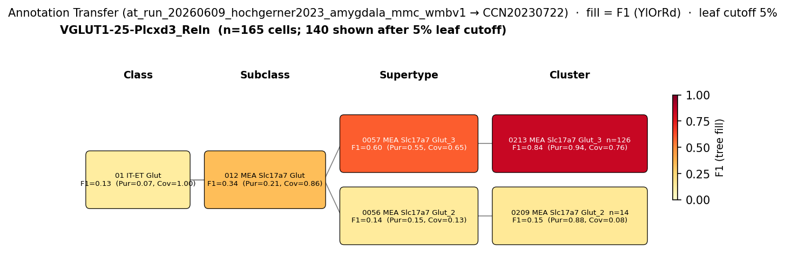

# Medial amygdala Lhx9+ ventral pallial-derived glutamatergic neuron — CCN20230722 Mapping Report
*2026-06-10 · Source: `kb/graphs/medial_temporal_lobe_amygdala/20260528_medial_temporal_lobe_amygdala_report_ingest.yaml`*

---

## Introduction

The medial amygdala Lhx9+ ventral pallial-derived glutamatergic neuron is a minor but
developmentally distinct population residing within the medial amygdalar nucleus
[UBERON:0002892]. It derives from the ventral pallium — an extrinsic, non-subpallial
origin that sets it apart from the dominant GABAergic subpallial populations of the medial
amygdala — and is defined by expression of the LIM-homeodomain transcription factor Lhx9
[1][4]. Establishing its atlas correspondence clarifies the transcriptomic landscape of
extrinsic glutamatergic contributions to the medial and extended amygdala, a region whose
cell-type diversity has become tractable through single-cell atlasing.

### Classical type properties

| Property | Value | References |
|---|---|---|
| Soma location | Medial amygdalar nucleus [UBERON:0002892] | [1] |
| Neurotransmitter type | Glutamatergic | [2][3] |
| Defining markers | Lhx9 | [1][4] |
| Negative markers | — | — |
| Neuropeptides | — | — |

<details>
<summary>Details — source evidence for classical type properties</summary>

- **Soma location / defining marker Lhx9:** review article with morphological lineage analysis · [1]
  > "In addition to these cells, the medial amygdala includes a minor subpopulation of Lhx9 cells of ventral pallial origin"
  > — Vicario et al. 2016, Medial and extended amygdala developmental-origin cell populations · [1] <!-- quote_key: 11582390_e268c719 -->

- **Neurotransmitter type:** review, comparative neuroanatomy · [2]
  > "the mammalian/rodent medial amygdala is a mosaic of GABAergic subpallial cells complemented by glutamatergic neuron types from extrinsic sources (ventral pallium, SPV, EmT)."
  > — Gerlach & Wullimann 2021, Medial and extended amygdala developmental-origin cell populations · [2] <!-- quote_key: 231758452_9fd699d1 -->

- **Neurotransmitter type:** single-cell transcriptomic atlas of amygdala cell types · [3]
  > ".the former includes BLA, CoA, BMA, and MeA, while the latter includes CeA and BST.Within the amygdala nuclei, PNs are exclusively glutamatergic in BLA, CoA, BMA, exclusively GABAergic in CeA, and predominantly GABAergic in MeA and BST.In rodents, there is also a population of glutamatergic pyramidal neurons (GLU PNs, derived from third ventricle neuroepithelium) that populates the BST, MeA, and hypothalamus (García-Moreno et al., 2010)(Huilgol et al., 2016)."
  > — Raudales et al. 2024, Amygdala organization and principal cellular classes · [3] <!-- quote_key: 271240390_b54d0b91 -->

- **Lhx9 marker / developmental origin:** Shh-Cre fate-mapping study in mouse · [4]
  > "the anatomical segregation of efferent projections that regulate reproductive or defensive behaviors is differentially marked by the LIM-containing homeodomain genes Lhx6 and Lhx9"
  > — Carney et al. 2010, Background · [4] <!-- quote_key: 627853_c6aafc07 -->

</details>

### Cell Ontology mapping

Cell Ontology mapping: glutamatergic neuron [[CL:0000679](https://www.ebi.ac.uk/ols4/ontologies/cl/classes?obo_id=CL:0000679)] (BROAD).

The Cell Ontology has no specific term for this developmentally-defined amygdala subtype;
CL:0000679 (glutamatergic neuron) is the closest assignable ancestor. The current BROAD
assignment was auto-proposed by asta-report-ingest and requires expert review. This
population — ventral pallial-derived, Lhx9+, MeA-resident — is a strong candidate for a
new CL term request.

---

## Results

One candidate atlas supertype was assessed; 0057 MEA Slc17a7 Glut_3 [CS20230722_SUPT_0057]
in subclass 012 MEA Slc17a7 Glut is the primary mapping candidate at LOW confidence. The
annotation-transfer signal at the child-cluster level is notably strong (F1=0.84 at
cluster level), pointing to a possible MODERATE upgrade once Lhx9 expression data across
MEA Glut supertypes becomes available.



*F1 across taxonomy levels for VGLUT1-25-Plcxd3_Reln (Hochgerner 2023,
`at_run_20260609_hochgerner2023_amygdala_mmc_wmbv1`), the source group relevant to this
classical type. Each panel row is a taxonomy level; nodes are coloured by F1 with
**Purity** (Pur) and **Coverage** (Cov) shown inline. Coverage = fraction of source-group
cells landing on this target; Purity = fraction of this target's cells coming from the
source group. F1 ≥ 0.5 at a level indicates a clean mapping at that resolution.*

The high purity at cluster level (Pur=0.94; best cluster-level hit at rank 0, specific
accession in figure sidecar) is the most informative AT signal: 94% of cells mapped to
that cluster derive from the VGLUT1-25-Plcxd3_Reln source group. Coverage at cluster
level (Cov=0.76) is consistent with the broadMatch predicate — about a quarter of source
cells scatter to other MEA Glut clusters. Source labels in this AT run are
transcriptomically-defined Hochgerner types; confirming whether VGLUT1-25-Plcxd3_Reln
specifically corresponds to Lhx9+ neurons requires a molecular bridging experiment.

### Mapping candidates table

| Rank | WMBv1 supertype | Subclass | Cells (10x) | Confidence | Key property alignment | Verdict |
|---|---|---|---|---|---|---|
| 1 | 0057 MEA Slc17a7 Glut_3 [CS20230722_SUPT_0057] | 012 MEA Slc17a7 Glut | 3,748 | 🔴 LOW | NT CONSISTENT · location CONSISTENT · Lhx9 NOT_ASSESSED | Speculative — best available MEA Glut match; Lhx9 data needed |

1 edge assessed. Relationship type: `skos:broadMatch`.

### Property alignment — 0057 MEA Slc17a7 Glut_3 [CS20230722_SUPT_0057] 🔴

**Table 1 — Property comparison**

| Property | Classical | Supertype | Best cluster | Alignment |
|---|---|---|---|---|
| Soma location | Medial amygdalar nucleus [UBERON:0002892] | MBA:403 Medial amygdalar nucleus (region_fraction 0.588; SELF evidence; Zhuang 2023 + Yao 2024 MERFISH) | not assessed | CONSISTENT |
| NT type | Glutamatergic | Glut (Slc17a7 subclass) | — | CONSISTENT |
| Lhx9 expression | Defining marker (transcript-level; Shh-Cre fate-mapping) | not present in atlas metadata (Trabd2b, Zic5, Dab1, Ntf3, Rassf3, Krt12) | no precomputed expression data | NOT_ASSESSED |
| Sex ratio | not documented | not available | not available | NOT_ASSESSED |

**Table 2 — Evidence support**

| Evidence | Type | Supports | Headline | Source |
|---|---|---|---|---|
| Atlas MERFISH — Zhuang 2023 | Atlas metadata | SUPPORT | MBA:403 cell_ratio 0.399 | atlas-internal |
| Atlas MERFISH — Yao 2024 | Atlas metadata | SUPPORT | MBA:403 cell_ratio 0.619 | atlas-internal |
| Hochgerner 2023 MapMyCells AT | Annotation transfer | SUPPORT | Best cluster-level F1=0.84 (rank 0; accession in figure sidecar); F1=0.60 at supertype (CS20230722_SUPT_0057) | atlas-internal |

*(Child-cluster breakdown: the AT evidence identifies the best cluster-level match at F1=0.84, Pur=0.94, Cov=0.76 — well above all other MEA Glut clusters (specific accession sidecar-derived, not in facts metrics_by_level). Among the 5 MEA Slc17a7 Glut supertypes, CS20230722_SUPT_0057 has the highest region_fraction in MBA:403 (0.588) and its best child cluster dominates the AT signal. No direct Lhx9 expression data is available to confirm the cluster assignment.)*

---

### 0057 MEA Slc17a7 Glut_3 [CS20230722_SUPT_0057] · 🔴 LOW

**Supporting evidence:**

- **MERFISH location (Zhuang 2023):** MERFISH spatial data places CS20230722_SUPT_0057 predominantly in Medial amygdalar nucleus [MBA:403] with cell_ratio 0.399. The Slc17a7 subclass assignment confirms glutamatergic identity, consistent with the classical NT type.
- **MERFISH location (Yao 2024):** A second, independent MERFISH registration (Yao 2024) confirms CS20230722_SUPT_0057 in Medial amygdalar nucleus [MBA:403] with cell_ratio 0.619, strengthening the spatial concordance. Convergence of two independent MERFISH datasets on the same region assignment is a strong anchor for the location comparison.
- **Annotation transfer — Hochgerner 2023 VGLUT1-25-Plcxd3_Reln:** MapMyCells (cell_type_mapper v1.7.1, 100 bootstrap iterations) on 164 naive Hochgerner 2023 cells (source group VGLUT1-25-Plcxd3_Reln from ArrayExpress:E-MTAB-12096) maps predominantly to CS20230722_SUPT_0057 at supertype level (F1=0.60, Pur=0.55, Cov=0.65; `at_run_20260609_hochgerner2023_amygdala_mmc_wmbv1`). At cluster level, the signal sharpens: best cluster-level F1=0.84, Pur=0.94, Cov=0.76 (rank 0; specific cluster accession sidecar-derived — not in facts metrics_by_level). A purity of 0.94 means 94% of all cells mapped to the best cluster in this AT run come from the VGLUT1-25-Plcxd3_Reln source group — an unusually clean cluster-level mapping for a subclass with multiple supertypes. This is the strongest quantitative evidence supporting this candidate.
- **Stage A discovery:** CS20230722_SUPT_0057 ranked 1st in its 5-member MEA Glut cohort (region=MBA:403, NT=Glutamatergic; score=1, next_best_score=1, cohort_size=5). The cohort was tied at score=1 because no Lhx9 expression data was available to differentiate among the 5 supertypes — region and NT match alone constrained the field.

**Marker evidence provenance:**

- **Lhx9 (defining marker):** Two citations support Lhx9 as the defining marker [1][4]. Vicario et al. 2016 [1] is a review with morphological lineage analysis that identifies Lhx9+ cells of ventral pallial origin in the medial amygdala (transcript-level, mouse). Carney et al. 2010 [4] is a primary fate-mapping study using Shh-Cre lineage tracing in mouse, establishing that Lhx9 and Lhx6 differentially mark amygdala projection subtypes. The cell-type specificity is grounded in Cre-driver targeting, providing a solid developmental anchor. Atlas metadata for CS20230722_SUPT_0057 does not include Lhx9 among its defining markers (Trabd2b, Zic5, Dab1, Ntf3, Rassf3, Krt12), and no precomputed Lhx9 expression data for CCN20230722 was available in this run. This is NOT_ASSESSED rather than DISCORDANT — absence from atlas metadata is expected if the atlas cluster was annotated from unsupervised clustering rather than from curated marker lists. However, the lack of cross-validation is the primary gap preventing a MODERATE or higher confidence assignment.
  - *(note: Lhx9's absence from CS20230722_SUPT_0057 atlas markers does not rule out Lhx9 expression in a subset of cells within this cluster; it only means the atlas did not use Lhx9 as a defining or discriminating marker at this clustering resolution.)*

**Concerns:**

- **LHX9 NOT_ASSESSED (MARKER_NOT_ASSESSED):** The single defining marker Lhx9 cannot be evaluated against the atlas candidate. The mapping rests on region and NT concordance alone. 0 of 1 defining markers have a CONSISTENT or APPROXIMATE alignment.
- **broadMatch predicate reflects 5-member cohort ambiguity:** CS20230722_SUPT_0057 is the best-ranked member of a 5-supertype cohort (all within MBA:403 and Glut), tied at discovery score = 1. The broadMatch reflects that any one of these 5 supertypes could host the Lhx9+ population, or it could be distributed across them.
- **AT source group — molecular bridging required:** The Hochgerner 2023 source group VGLUT1-25-Plcxd3_Reln is a transcriptomically-defined type identified by Plcxd3 and Reln expression; it is not a classical morpho-electrophysiological type. A mapping step linking VGLUT1-25-Plcxd3_Reln to the Lhx9+ classical type based on shared molecular markers is required before the high AT F1 (0.84 at cluster level) can be fully credited as direct evidence.

**What would upgrade confidence:**

1. **Precomputed Lhx9 expression across CCN20230722 MEA Glut supertypes** — run `just add-expression` or query CCN20230722 precomputed stats for Lhx9 across all 5 MEA Slc17a7 Glut supertypes. If Lhx9 expression is highest in CS20230722_SUPT_0057 (or the best cluster-level hit at rank 0), this would resolve the 5-member ambiguity and potentially upgrade to MODERATE. Expected output: update `marker_LHX9` property_comparison to CONSISTENT or APPROXIMATE.
2. **ISH co-staining:** Run Lhx9-ISH co-stained with MERFISH probes for CS20230722_SUPT_0057 defining markers (Trabd2b, Zic5, Dab1, Ntf3) in mouse medial amygdala. Expected output: LiteratureEvidence with direct co-expression confirmation; could support upgrade to MODERATE or HIGH.
3. **Targeted literature search (immediate):** Cite-traverse for "Lhx9 medial amygdala expression", "Plcxd3 amygdala neuron", "ventral pallial glutamatergic MeA Lhx9". This may surface ISH data or Allen Brain Atlas records showing Lhx9 expression in MEA Glut subtypes, and may clarify whether Plcxd3/Reln co-expression is characteristic of Lhx9+ neurons.

---

### Methods

<details>
<summary>Data sources, analyses, and reproducibility receipts</summary>

**Classical type definition.** The medial amygdala Lhx9+ ventral pallial-derived glutamatergic neuron (`medial_amygdala_lhx9_glutamatergic_neuron`) is defined as a CLASSICAL type on the basis of developmental lineage tracing and marker studies. Soma location: Medial amygdalar nucleus [UBERON:0002892] [1]. Neurotransmitter type: Glutamatergic [2][3]. Defining marker: Lhx9 [1][4]. No negative markers or neuropeptides are recorded. The classical node carries a note that this is one of several extrinsic glutamatergic populations (ventral pallium, SPV, EmT-derived) contributing to the medial/extended amygdala. Definition basis: CLASSICAL (morphological and lineage-based).

**Atlas mapping query.** Candidate atlas clusters were retrieved from the CCN20230722 taxonomy at ranks 0 (cluster) and 1 (supertype) using metadata-based scoring (region match, NT type, defining markers, sex bias when applicable). Full scoring rules: `workflows/map-cell-type.md`. The discovery cohort was restricted to region MBA:403, NT=Glutamatergic (5-member cohort). No expression-based score contribution was available for Lhx9 (absent from atlas metadata).

**Property alignment.** Each defining property of the classical type was compared to the corresponding atlas-side value via the `property_comparisons` schema, with alignments graded CONSISTENT / APPROXIMATE / DISCORDANT / NOT_ASSESSED. Atlas-side numerical values came from precomputed expression on the cluster (cluster.yaml in the taxonomy reference store) and from MERFISH spatial registration for soma location.

**Annotation transfer.**

| Field | Value |
|---|---|
| Source dataset | ArrayExpress:E-MTAB-12096 (VGLUT1-25-Plcxd3_Reln) |
| Source species | NCBITaxon:10090 (Mus musculus) |
| Target atlas | WMBv1 (CCN20230722; SHA-256: b21ca985…) |
| Method | MapMyCells local (cell_type_mapper v1.7.1, default parameters, raw normalization, 100 bootstrap iterations) |
| Tool version | cell_type_mapper v1.7.1 |
| Bootstrap threshold | 0.7 |
| n cells | 55,514 total (filtered to 7,777 neuronal naive cells) |
| Run record | [`kb/annotation_transfer_runs/at_run_20260609_hochgerner2023_amygdala_mmc_wmbv1/manifest.yaml`](../../kb/annotation_transfer_runs/at_run_20260609_hochgerner2023_amygdala_mmc_wmbv1/manifest.yaml) |
| Code reference | [https://github.com/AllenInstitute/cell_type_mapper](https://github.com/AllenInstitute/cell_type_mapper) |
| F1 matrix | [`research/medial_temporal_lobe_amygdala/annotation_transfer/hochgerner2023_amygdala/mapping_result.csv`](../../research/medial_temporal_lobe_amygdala/annotation_transfer/hochgerner2023_amygdala/mapping_result.csv) |
| Caveats | Source labels are transcriptomically-defined types, not classical morpho-electrophysiological types. Matching to KB classical nodes requires a mapping step (Hochgerner type → classical node) based on shared molecular markers. Fear-conditioned cells excluded to avoid transcriptional-state confounds. Non-neuronal cells excluded. Gene symbols used (not Ensembl IDs); matched against WMBv1 marker genes. |

**Atlas data sources.** No atlas data source entries recorded in this run (MERFISH provenance carried on individual evidence items as atlas-internal references).

**Anti-hallucination.** All citations, atlas accessions, ontology CURIEs, and verbatim literature quotes in this report are validated against the evidencell knowledge base at write time. Authored-prose evidence narratives are validated against their source `evidence_items[*].explanation` fields. The pre-write hook rejects any unresolvable identifier or unattributed blockquote. Specific mapping limitations and caveats are documented per-candidate in the Discussion section.

*Generated by evidencell `9d82411` at 2026-06-10T12:49:04+00:00 from [kb/graphs/medial_temporal_lobe_amygdala/20260528_medial_temporal_lobe_amygdala_report_ingest.yaml](../../kb/graphs/medial_temporal_lobe_amygdala/20260528_medial_temporal_lobe_amygdala_report_ingest.yaml).*

**Evidence base**

| Edge ID | Evidence types | Supports | Source |
|---|---|---|---|
| edge_medial_amygdala_lhx9_glutamatergic_neuron_to_cs20230722_supt_0057 | ATLAS_METADATA; ATLAS_METADATA; ANNOTATION_TRANSFER | SUPPORT; SUPPORT; SUPPORT | atlas-internal; atlas-internal; atlas-internal |

</details>

---

## Discussion

### Best candidate + caveats summary

**Primary mapping:** Medial amygdala Lhx9+ ventral pallial-derived glutamatergic neuron → 0057 MEA Slc17a7 Glut_3 [CS20230722_SUPT_0057] at LOW confidence. Key support: atlas MERFISH location concordance (MBA:403; two independent registrations, Zhuang 2023 and Yao 2024) and annotation-transfer best cluster-level F1=0.84 at rank 0 (`at_run_20260609_hochgerner2023_amygdala_mmc_wmbv1`; specific cluster accession in figure sidecar). Key caveats: MARKER_NOT_ASSESSED (Lhx9 absent from atlas metadata; no precomputed expression available); broadMatch predicate reflecting 5-member MEA Glut cohort ambiguity; AT source group VGLUT1-25-Plcxd3_Reln requires molecular bridging to confirm Lhx9+ identity.

The Cell Ontology has no specific term for this population; CL:0000679 (glutamatergic neuron) [[CL:0000679](https://www.ebi.ac.uk/ols4/ontologies/cl/classes?obo_id=CL:0000679)] is the closest ancestor term (BROAD). The auto-proposed mapping requires expert review. This population — ventral pallial-derived, Lhx9+, MeA-resident — is a strong candidate for a new CL term request.

### Proposed experiments and follow-ups

**Annotation transfer status:** AT was completed using the Hochgerner 2023 amygdala dataset (ArrayExpress:E-MTAB-12096, source group VGLUT1-25-Plcxd3_Reln, 164 cells, `at_run_20260609_hochgerner2023_amygdala_mmc_wmbv1`). This resolved the supertype-level mapping (F1=0.60 at CS20230722_SUPT_0057) and surfaced a best cluster-level hit at F1=0.84 (rank 0; specific accession in figure sidecar). What remains unresolved: (a) whether VGLUT1-25-Plcxd3_Reln cells are Lhx9+, and (b) Lhx9 expression levels across MEA Glut supertypes in the CCN20230722 atlas.

**1. Precomputed Lhx9 expression query (immediate, computational)**
- **What:** Query CCN20230722 precomputed stats for Lhx9 across all 5 MEA Slc17a7 Glut supertypes.
- **Target:** Identify which supertype(s) show mean Lhx9 expression at or above minimum detectable threshold; ideally, dominant expression in CS20230722_SUPT_0057 or the best cluster-level hit (rank 0; accession in figure sidecar).
- **Expected output:** Updated PropertyComparison; marker_LHX9 alignment resolved from NOT_ASSESSED to CONSISTENT or DISCORDANT; potential confidence upgrade to MODERATE for edge `edge_medial_amygdala_lhx9_glutamatergic_neuron_to_cs20230722_supt_0057`.
- **Resolves:** Open question 1.

**2. ISH co-staining (experimental, medium effort)**
- **What:** Run Lhx9-ISH co-stained with MERFISH probes for CS20230722_SUPT_0057 defining markers (Trabd2b, Zic5, Dab1, Ntf3) in mouse medial amygdala to directly test co-expression at single-cell resolution.
- **Target:** Co-expression of Lhx9 with at least one CS20230722_SUPT_0057 defining marker in MBA:403 neurons.
- **Expected output:** LiteratureEvidence with MarkerSource (ISH + scRNA-seq); possible upgrade to MODERATE or HIGH if co-expression is confirmed.
- **Resolves:** Open questions 1 and 3.

**3. Targeted literature search (immediate, low effort)**
- **What:** Cite-traverse for "Lhx9 medial amygdala expression", "Plcxd3 amygdala neuron", "ventral pallial glutamatergic MeA Lhx9".
- **Target:** Surface any ISH, Allen Brain Atlas, or single-cell data showing Lhx9 expression in MEA Glut subtypes; clarify whether Plcxd3/Reln co-expression is characteristic of Lhx9+ neurons.
- **Expected output:** LiteratureEvidence items on the classical node or edge.
- **Resolves:** Open questions 2 and weak marker provenance.

### Open questions

1. Which of the 5 MEA Slc17a7 Glut supertypes in CCN20230722 specifically hosts Lhx9+ ventral pallial-derived neurons? LHX9 precomputed expression data is needed to resolve this (from edge `edge_medial_amygdala_lhx9_glutamatergic_neuron_to_cs20230722_supt_0057`).
2. Is the Hochgerner 2023 source group VGLUT1-25-Plcxd3_Reln a reliable proxy for the Lhx9+ classical type? The high best cluster-level AT F1=0.84 (rank 0) is encouraging, but requires molecular co-validation of Plcxd3/Reln vs. Lhx9 co-expression in MeA.
3. Should the broadMatch predicate be narrowed after Lhx9 expression data becomes available? If one supertype uniquely concentrates Lhx9 expression, a skos:closeMatch or skos:exactMatch at supertype level would be warranted.
4. Is this Lhx9+ population eligible for a new CL term? Its developmental origin (ventral pallium), glutamatergic identity, MeA location, and Lhx9 marker combine to define a biologically coherent and currently unnamed cell type that is distinct from other MEA glutamatergic and GABAergic populations.

---

## References

| # | Citation | PMID | Used for |
|---|---|---|---|
| [1] | Vicario et al. 2016 | [27160258](https://pubmed.ncbi.nlm.nih.gov/27160258/) | soma location, Lhx9 defining marker |
| [2] | Gerlach & Wullimann 2021 | [33515290](https://pubmed.ncbi.nlm.nih.gov/33515290/) | neurotransmitter type |
| [3] | Raudales et al. 2024 | [39012795](https://pubmed.ncbi.nlm.nih.gov/39012795/) | neurotransmitter type |
| [4] | Carney et al. 2010 | [20507551](https://pubmed.ncbi.nlm.nih.gov/20507551/) | Lhx9 marker / developmental origin |

---

<!-- verdict-block-start: edge_medial_amygdala_lhx9_glutamatergic_neuron_to_cs20230722_supt_0057 -->
```yaml
verdict:
  confidence: LOW
  confidence_score: 0.25
  rationale: >
    AT (`at_run_20260609_hochgerner2023_amygdala_mmc_wmbv1`) maps VGLUT1-25-Plcxd3_Reln
    to CS20230722_SUPT_0057 at supertype level (F1=0.60); nt_type CONSISTENT and
    location_medial_amygdala CONSISTENT (MBA:403; two independent MERFISH registrations).
    0 of 1 markers CONSISTENT: marker_LHX9 is NOT_ASSESSED (Lhx9 absent from atlas
    metadata; no precomputed scRNA-seq expression). broadMatch reflects 5-member MEA
    Glut cohort ambiguity; confidence ceiling is LOW until Lhx9 expression data resolves
    the supertype assignment.
  reconciliation_note: ""
  lit_to_lit_edges: []
  unresolved_questions:
    - "Query CCN20230722 precomputed stats for Lhx9 across all MEA Slc17a7 Glut supertypes to determine which supertype hosts Lhx9+ neurons and resolve the broadMatch ambiguity."
```
<!-- verdict-block-end -->
