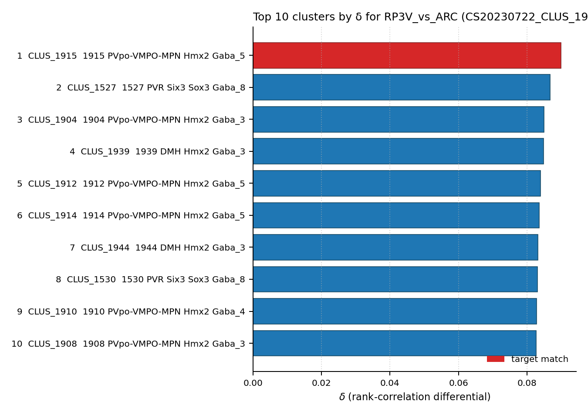

# AVPV/PeN kisspeptin neuron — WMBv1 Mapping Report
*draft · 2026-04-25 · Source: `kb/draft/sexually_dimorphic/20260425_sexually_dimorphic_report_ingest.yaml`*

**⚠ Draft mappings. Evidence is atlas-metadata only unless otherwise noted. All edges require expert review before use.**

---

## Introduction

**AVPV/PeN kisspeptin neuron** is defined by neurochemical criteria: Kiss1 expression, TH co-expression (marking a dopaminergic component within a broader GABAergic phenotype), and obligate Esr1 co-expression. Somas are concentrated in two periventricular zones of the rostral hypothalamus. The population is female-biased in cell number, mediates estrogen positive-feedback control of the preovulatory GnRH/LH surge, and is functionally and molecularly distinct from the arcuate KNDy (kisspeptin/neurokinin B/dynorphin) population. Most AVPV/PeN Kiss1 cells co-express TH, overlapping the AVPV TH neuron population.

Cell Ontology mapping: **hypothalamus kisspeptin neuron [[CL:4023123](https://www.ebi.ac.uk/ols4/ontologies/cl/classes?obo_id=CL:4023123)] (BROAD)** — see Discussion for the rationale.

### Classical type table

| Property | Value | References |
|---|---|---|
| Soma location | Anteroventral periventricular nucleus [MBA:272]; Periventricular hypothalamic nucleus, posterior part [MBA:341] | [1], [2], [3] |
| NT | GABAergic / dopaminergic (Th co-expression) | [3] |
| Defining markers | Kiss1 (transcript), Th (protein, co-expressed with Kiss1), Esr1 (transcript) | [1], [2], [3], [4], [5] |
| Negative markers | — | |
| Neuropeptides | Kiss1 (kisspeptin) | [6] |

Literature support — expand for verbatim quotes

**[3] Stephens et al. 2017 · PMID:28660243 — Neuronal Markers and Molecular Characteristics**

> Kiss1-syntheizing neurons reside primarily in the hypothalamic anteroventral periventricular (AVPV/PeN) and arcuate (ARC) nuclei. AVPV/PeN Kiss1 neurons are sexually dimorphic, with females expressing more Kiss1 than males, and participate in estradiol (E2)- induced positive feedback control of GnRH secretion. In mice, most AVPV/PeN Kiss1 cells coexpress tyrosine hydroxylase (TH), the rate-limiting enzyme in catecholamine synthesis (in this case, dopamine).
> — Stephens et al. 2017, Neuronal Markers and Molecular Characteristics · [3] <!-- quote_key: 4702847_ebd225e6 -->

**[2] Adachi et al. 2007 · PMID:17213691 — Functional Roles in Reproductive Neuroendocrine Control**

> Metastin/kisspeptin, the KiSS-1 gene product, has been identified as an endogenous ligand of GPR54 that reportedly regulates GnRH/LH surges and estrous cyclicity in female rats. The aim of the present study was to determine if metastin/kisspeptin neurons are a target of estrogen positive feedback to induce GnRH/LH surges. We demonstrated that preoptic area (POA) infusion of the anti-rat metastin/kisspeptin monoclonal antibody blocked the estrogen-induced LH surge, indicating that endogenous metastin/ kisspeptin released around the POA mediates the estrogen positive feedback effect on GnRH/LH release. Metastin/kisspeptin neurons in the anteroventral periventricular nucleus (AVPV) may be responsible for mediating the feedback effect because the percentage of c-Fos-expressing KiSS-1 mRNA-positive cells to total KiSS-1 mRNA-positive cells was significantly higher in the afternoon than in the morning in the anteroventral periventricular nucleus (AVPV) of high estradiol (E(2))-treated females. The percentage of c-Fos-expressing metastin/kisspeptin neurons was not different between the afternoon and morning in the arcuate nucleus (ARC). Most of the KiSS-1 mRNA expressing cells contain ERalpha immunoreactivity in the AVPV and ARC. In addition, AVPV KiSS-1 mRNA expressions were highest in the proestrous afternoon and lowest in the diestrus 1 in females and were increased by estrogen treatment in ovariectomized animals. On the other hand, the ARC KiSS-1 mRNA expressions were highest at diestrus 2 and lowest at proestrous afternoon and were increased by ovariectomy and decreased by high estrogen treatment. Males lacking the surge mode of GnRH/LH release showed no obvious cluster of metastin/kisspeptin-immunoreactive neurons in the AVPV when compared with high E(2)-treated females, which showed a much greater density of these neurons. Taken together, the present study demonstrates that the AVPV metastin/kisspeptin neurons are a target of estrogen positive feedback to induce GnRH/ LH surges in female rats.
> — Adachi et al. 2007, Functional Roles in Reproductive Neuroendocrine Control · [2] <!-- quote_key: 1357086_85e3d032 -->

**[1] Nejad et al. 2017 · PMID:29201072 — Functional Roles in Reproductive Neuroendocrine Control**

> The Kisspeptin system is apparently critical for brain gender differentiation, acting through the regulation of postnatal T secretion. Distribution of Kisspeptin neurons in the hypothalamus varies between species. In mammals there are 2 major regions of these neurons; a rostral one in the Pre-Optic Area (POA) and a caudal one in the arcuate nucleus, with proportionally more Kisspeptin neurons in the ARC than in the POA region (4,30). In rodents, the POA regions are concentrated in the Anteroventral Periventricular Nucleus (AVPV). Anatomical differences between genders have been reported in the hypothalamus of some species, e.g. the rat AVPV is sexually dimorphic, with a greater number of KISS1 neurons in females compared to males (30). Like most sex differences in the brain, this sexual dimorphism is likely caused during the perinatal critical period by exposure to testosterone (or its metabolites) (31)
> — Nejad et al. 2017, Functional Roles in Reproductive Neuroendocrine Control · [1] <!-- quote_key: 1227024_3fcab8ab -->

**[1] Nejad et al. 2017 · PMID:29201072 — Esr1 / sex steroid regulation**

> KISS1 neurons express sex steroid receptors and are regulated by gonadal sex steroids, mediating the effects of estrogen on GnRH neurons
> — Nejad et al. 2017, Functional Roles in Reproductive Neuroendocrine Control · [1] <!-- quote_key: 1227024_6801ab8e -->

**[4] Kauffman et al. 2007 · PMID:17699664 — Th / Kiss1 in AVPV**

> adult testosterone-treated GPR54 KO males displayed "female-like" numbers of tyrosine hydroxylase-immunoreactive and Kiss1 mRNA-containing neurons in the anteroventral periventricular nucleus and likewise possessed fewer motoneurons in the spino- bulbocavernosus nucleus than did WT males
> — Kauffman et al. 2007, Neuronal Markers and Molecular Characteristics · [4] <!-- quote_key: 17692566_78d7ff15 -->

**[5] Wartenberg et al. 2021 · PMID:34561233 — Esr1 in kisspeptin neurons**

> Sex steroid hormones act on hypothalamic kisspeptin neurons to regulate reproductive neural circuits in the brain. Kisspeptin neurons start to express estrogen receptors in utero
> — Wartenberg et al. 2021, Neuronal Markers and Molecular Characteristics · [5] <!-- quote_key: 237626479_9c737a0a -->

**[6] Frazão et al. 2013 · PMID:23407940 — Kiss1 neuropeptide / AVPV dimorphism**

> The AVPV is a sexually dimorphic site with a differential distribution pattern of several neurotransmitters and neuropeptides, including kisspeptin
> — Frazão et al. 2013, Functional Roles in Reproductive Neuroendocrine Control · [6] <!-- quote_key: 11330110_f135c1a8 -->

---

## Results

Two mapping edges are recorded for avpv_kiss1_neuron: a supertype-level edge to SUPT_0486 (PVpo-VMPO-MPN Hmx2 Gaba_5) at MODERATE confidence, and a cluster-level edge to CLUS_1915 — the child cluster with the strongest Kiss1+Th+Esr1 co-expression profile and the most extreme female bias (male_female_ratio = 0.02). Independent bulk-correlation evidence from Stephens 2024 places CLUS_1915 at rank 1 of 5,322 atlas clusters by RP3V-specificity.

*Bulk-correlation δ ranking of WMBv1 clusters by RP3V- vs ARC-specificity (Stephens 2024 [7]). CLUS_1915 (target row, red) ranks first; all top-10 hits are preoptic / periventricular hypothalamic GABAergic clusters — the differential signal is anatomically clean.*

### Mapping candidates

| Rank | WMBv1 cluster | Supertype | Cells (MERFISH) | Confidence | Key property alignment | Verdict |
|---|---|---|---|---|---|---|
| 1 | 1915 PVpo-VMPO-MPN Hmx2 Gaba_5 [CS20230722_CLUS_1915] | 0486 PVpo-VMPO-MPN Hmx2 Gaba_5 | n=3–5 ^ | 🟡 MODERATE | Kiss1 CONSISTENT; Esr1 CONSISTENT; Th CONSISTENT; MFR=0.02 CONSISTENT | Best cluster candidate |
| 2 | 0486 PVpo-VMPO-MPN Hmx2 Gaba_5 [CS20230722_SUPT_0486] | (self) | n=117 (16 AVPV / 64 PVpo / 37 MPN) | 🟡 MODERATE | Esr1 CONSISTENT; Kiss1/Th APPROXIMATE | Best supertype candidate |

2 edges total. Relationship type: PARTIAL_OVERLAP (both edges).

^MERFISH n=3–5; 10x cluster size not yet shown — see ROADMAP.

### 1915 PVpo-VMPO-MPN Hmx2 Gaba_5 [CS20230722_CLUS_1915] · 🟡 MODERATE

**Property comparison.**

| Property | Classical | Supertype | Best cluster | Alignment |
|---|---|---|---|---|
| Soma location | Anteroventral periventricular nucleus [MBA:272]; Periventricular hypothalamic nucleus, posterior part [MBA:341] | n=16 cells in MBA:272; also MBA:133 PVpo (n=64), MBA:515 MPN (n=37) | n=1 AVPV (MBA:272), n=1 PVpo (MBA:133), n=3 MBA:1097 Hypothalamus (broad catchall) | SUPT: APPROXIMATE; CLUS: APPROXIMATE |
| NT type | GABAergic / dopaminergic (Th co-expression) | GABAergic (Gaba_5 label); Th=2.72 present but diluted | Dopa (confirmed, cluster.yaml name_in_source='Dopa') | SUPT: APPROXIMATE; CLUS: CONSISTENT |
| Kiss1 expression | POSITIVE (transcript, primary defining marker) | precomputed mean_expression=0.62 | precomputed mean_expression=2.51; Kiss1 is a cluster-level DEFINING marker | SUPT: APPROXIMATE; CLUS: CONSISTENT |
| Esr1 expression | POSITIVE (transcript, defining marker) | precomputed mean_expression=7.72 (DEFINING atlas marker) | precomputed mean_expression=9.55 (highest Esr1 in SUPT_0486) | CONSISTENT (both levels) |
| Th expression | POSITIVE (protein, co-expressed with Kiss1) | precomputed mean_expression=2.72 | precomputed mean_expression=6.6 (highest Th of any SUPT_0486 child cluster) | SUPT: APPROXIMATE; CLUS: CONSISTENT |
| Sex ratio | FEMALE_BIASED (AVPV Kiss1 neurons strongly female-biased) | not available at supertype level | MFR=0.02 (CLUS_1915) — extreme female bias, ~50:1 F:M | CONSISTENT |

**Evidence support.**

| Evidence | Type | Supports | Headline | Source |
|---|---|---|---|---|
| Atlas precomputed expression (CLUS_1915 Kiss1/Th/Esr1, MFR) | Atlas metadata | SUPPORT | Kiss1=2.51, Th=6.6, Esr1=9.55; MFR=0.02; nt_type=Dopa | atlas-internal |
| Stephens 2024 RP3V vs ARC bulk Kiss1+ correlation | Bulk transcriptomic correlation | SUPPORT | δ=0.090 (ρ_RP3V=0.388, ρ_ARC=0.298); rank 1/5322 | [7] |
| SUPT_0486 atlas metadata (Esr1/Th/Kiss1, MBA:272 n=16) | Atlas metadata | PARTIAL | Esr1=7.72 (DEFINING); Th=2.72; Kiss1=0.62; n=16 AVPV | atlas-internal |

*(1 of 5 child clusters of SUPT_0486 — CLUS_1915 — shows the female-biased Kiss1+Th+Esr1 co-expression profile (Kiss1=2.51, Th=6.6, Esr1=9.55, MFR=0.02) concordant with avpv_kiss1_neuron; MFR data are absent at supertype level and for most other SUPT_0486 child clusters. Best match: CLUS_1915.)*

**Supporting evidence**

- **Kiss1, Th, and Esr1 all reach CONSISTENT alignment at cluster level.** CLUS_1915 shows the highest co-expression of all three classical defining markers among SUPT_0486 child clusters: Kiss1 = 2.51, Th = 6.6, Esr1 = 9.55. Kiss1 is a cluster-level DEFINING marker for CLUS_1915 — directly matching its role as the primary defining marker of the classical node.
- **Dopaminergic NT type is confirmed.** cluster.yaml annotates nt_type = Dopa (name_in_source = 'Dopa'), resolving the APPROXIMATE supertype Gaba_5 label and providing CONSISTENT alignment with the classical node's GABAergic/dopaminergic co-phenotype.
- **Sex ratio is strongly concordant.** male_female_ratio = 0.02 (~50:1 female-to-male) is the most extreme female bias in SUPT_0486 and directly matches the FEMALE_BIASED sex dimorphism that defines avpv_kiss1_neuron [1], [3].
- **AVPV cells are explicitly present.** MBA:272 (AVPV) cells are present in CLUS_1915, providing a direct anatomical link, albeit at low cell counts.
- **Independent quantitative bulk-transcriptomic confirmation [7].**
  > Stephens 2024 (PMID:37934722) bulk Kiss1+ neurons sorted from RP3V vs ARC. Differential δ = ρ_RP3V − ρ_ARC ranks CLUS_1915 first of 5,322 atlas clusters, with δ=0.090 (ρ_RP3V=0.388, ρ_ARC=0.298). All other top-20 hits are also preoptic/periventricular hypothalamic GABAergic clusters — the differential signal is strongly anatomically clean. Independent quantitative confirmation of the existing ATLAS_METADATA-based mapping; the Kiss1+ pool transcriptomic profile tracks CLUS_1915 specifically more than any other cluster in the atlas.
  > — Stephens et al. 2024 · [7]

**Concerns**

- **Very low cell count (n = 3–5 total cells in WMBv1).** The sex ratio (MFR = 0.02) and expression values are directionally reliable but have limited statistical power. Confidence is capped at MODERATE pending annotation transfer or replication in a larger dataset.
- **MERFISH spatial resolution is insufficient to discriminate AVPV from adjacent PVpo/PeN.** *(adjacent region — could reflect registration boundary error; weak counter-evidence)*
- **avpv_kiss1_neuron and avpv_th_neuron both map to CLUS_1915.** Because most AVPV Kiss1 cells co-express TH, these classical types substantially overlap; CLUS_1915 may represent the shared atlas correlate rather than a distinct transcriptomic split between them.
- **Annotation transfer not yet performed.** No independent, data-driven cell-level mapping of published AVPV Kiss1 scRNA-seq cells to WMBv1 has been run; this is the most important remaining gap in the evidence base for this edge.

### 0486 PVpo-VMPO-MPN Hmx2 Gaba_5 [CS20230722_SUPT_0486] · 🟡 MODERATE

**Supporting evidence**

- **Esr1 expression is strongly consistent.** Precomputed mean expression Esr1 = 7.72 at the supertype level, matching the canonical defining marker for AVPV/PeN kisspeptin neurons. Esr1 is a DEFINING atlas marker for SUPT_0486 — this is the strongest quantitative agreement between classical node and supertype.
- **GABAergic identity is concordant.** The supertype carries a Gaba_5 label, consistent with the GABAergic component of the classical node's mixed GABAergic/dopaminergic phenotype.
- **TH expression is present.** Precomputed mean Th = 2.72, reflecting the dopaminergic co-expression characteristic of AVPV Kiss1 neurons, though diluted across the broader supertype.
- **Direct AVPV location match.** n = 16 cells within SUPT_0486 are labelled to Anteroventral periventricular nucleus [MBA:272], providing a direct anatomical anchor.
- **Child cluster CLUS_1915 concentrates the female-biased signal.** See cluster-level paragraph above.

**Concerns**

- **Supertype spans a broader preoptic territory than AVPV/PeN.** SUPT_0486 covers PVpo [MBA:133] (n=64 cells), MPN [MBA:515] (n=37 cells), and VMPO in addition to AVPV [MBA:272] (n=16 cells). Multiple classical types — including avpv_th_neuron and mpoa_esr1_neuron — are expected to map to this same supertype; AVPV Kiss1 neurons are a subset.
- **Dopaminergic identity is not resolved at supertype level.** The supertype label is Gaba_5, not dopaminergic. Th = 2.72 is present but the full dopaminergic signal is concentrated in CLUS_1915.
- **Sex ratio data not available at supertype level.** Female-biased sex dimorphism — a defining feature of AVPV Kiss1 neurons [1], [3] — cannot be assessed from supertype-level metadata.
- **PeN Kiss1 neurons are unresolved.** It is unknown whether Periventricular hypothalamic nucleus, posterior part [MBA:341] Kiss1 neurons co-map to SUPT_0486 or a distinct supertype.
- **Annotation transfer NOT_ASSESSED.**

---

### Methods

Data sources, analyses, and reproducibility receipts

**Classical type definition.** avpv_kiss1_neuron is defined on a CLASSICAL_NEUROCHEMICAL basis: defining markers Kiss1 [1], [2], [3], Th (protein, co-expressed) [3], [4], and Esr1 [1], [2], [5]; soma location in AVPV [MBA:272] and PeN [MBA:341]; FEMALE_BIASED sex dimorphism [1], [3]; and obligate functional involvement in estrogen positive feedback control of the GnRH/LH surge [2]. Multi-modal evidentiary base: ISH for Kiss1 mRNA, IHC for TH and ERα protein, c-Fos activation studies, and KO/transgenic perturbation.

**Atlas mapping query.** Candidate atlas clusters were retrieved from the WMBv1 taxonomy (CCN20230722) at ranks 0 (cluster) and 1 (supertype) using metadata-based scoring (region match, NT type, defining markers, sex bias). Full scoring rules: `workflows/map-cell-type.md`.

**Property alignment.** Each defining property was compared to the corresponding atlas-side value via the `property_comparisons` schema; alignments graded CONSISTENT / APPROXIMATE / DISCORDANT / NOT_ASSESSED. Atlas-side numerical values came from precomputed expression on the cluster (cluster.yaml) and from MERFISH spatial registration for soma location.

**Bulk transcriptomic correlation.**

| Field | Value |
|---|---|
| Source publication | Stephens et al. 2024 [7] |
| GEO accession | — (Sanger repository: ca9ff6c0-7f38-4d06-bf89-dfd432b6a335) |
| Technique | bulk_RNAseq_FACS_sorted |
| n pools | 2 (RP3V Kiss1+, ARC Kiss1+) |
| Atlas | CCN20230722 (SHA-256: `b21ca985`) |
| Statistic | spearman_rho |
| Parameters | pseudobulk_transform=log1p(sum/n_cells); gene_intersection=bulk∩atlas |
| Script | [`correlate.py`](https://github.com/Cellular-Semantics/evidencell/blob/d7c4445/kb/correlation_runs/20260428_stephens_kiss1_wmbv1/correlate.py) |
| Code version | d7c4445 |
| Caveats | Bulk pools of 10–15 cells; absolute ρ in 0.3–0.5 even for true matches. Differential δ is the discriminative statistic. |

**Anti-hallucination.** All citations, atlas accessions, ontology CURIEs, and verbatim literature quotes are validated against the evidencell knowledge base at write time. Authored-prose evidence narratives are validated against their source `evidence_items[*].explanation` fields. The pre-write hook rejects unresolvable identifiers or unattributed blockquotes.

*Generated by evidencell `0c97cfa` from [`kb/draft/sexually_dimorphic/20260425_sexually_dimorphic_report_ingest.yaml`](../../kb/draft/sexually_dimorphic/20260425_sexually_dimorphic_report_ingest.yaml).*

Evidence base table

| Edge ID | Evidence types | Supports | Source |
|---|---|---|---|
| edge_avpv_kiss1_neuron_to_cs20230722_supt_0486 | ATLAS_METADATA | PARTIAL | atlas-internal |
| edge_avpv_kiss1_neuron_to_cs20230722_clus_1915 | ATLAS_METADATA; BULK_CORRELATION | SUPPORT; SUPPORT | atlas-internal, [7] |

---

## Discussion

**Primary mapping:** AVPV/PeN kisspeptin neuron → 1915 PVpo-VMPO-MPN Hmx2 Gaba_5 [CS20230722_CLUS_1915] at MODERATE confidence. Key support: ATLAS_METADATA (Kiss1=2.51, Th=6.6, Esr1=9.55, MFR=0.02, nt_type=Dopa) and BULK_CORRELATION (Stephens 2024 [7], rank 1/5322 by δ_RP3V − δ_ARC). Key caveats: `LOW_CELL_COUNT` (CLUS_1915 has n=3–5 MERFISH cells) and `TAXONOMY_LEVEL_MISMATCH` (avpv_kiss1_neuron and avpv_th_neuron both map to CLUS_1915).

The Cell Ontology term **hypothalamus kisspeptin neuron [[CL:4023123](https://www.ebi.ac.uk/ols4/ontologies/cl/classes?obo_id=CL:4023123)]** is a BROAD parent: CL:4023123 covers all hypothalamic kisspeptin neurons. The AVPV/PeN (RP3V) population is Kiss1-only (not obligately KNDy), so the more specific CL:4023128 (RP3V KNDy neuron) is inappropriate. A dedicated CL term for the AVPV/RP3V Kiss1 non-KNDy subpopulation does not yet exist — potential CL contribution.

### Proposed experiments and follow-ups

1. **MapMyCells annotation transfer of an external AVPV Kiss1 scRNA-seq dataset against WMBv1.** Retrieve a published dataset enriched for AVPV/preoptic kisspeptin neurons (e.g. Kiss1-Cre or Kiss1-Cre/Rosa-tdTom sorted preparations, or sex-stratified hypothalamic atlases). Target: F1 ≥ 0.50 at SUPT_0486 level; F1 ≥ 0.80 at CLUS_1915 level for Kiss1+ cells. Expected output: `AnnotationTransferEvidence` on both edges. Resolves Open questions 1 and 3.
2. **Sub-clustering / marker-stratified separation of CLUS_1915.** Within-cluster re-clustering of CLUS_1915 cells, stratified by Kiss1+/Th+ vs Kiss1−/Th+ profiles; or AT of a Kiss1-Cre-only dataset and a TH-Cre-only dataset against the same target. Expected output: additional `AnnotationTransferEvidence` and/or `MarkerAnalysisEvidence`. Resolves Open question 3.
3. **Independent bulk-correlation replication of Stephens 2024.** Repeat the δ = ρ_RP3V − ρ_ARC computation against WMBv1 using a second FACS-sorted Kiss1+ pool. Target: CLUS_1915 retains rank 1 (or top-3) of 5,322 clusters by δ. Expected output: an additional `BulkCorrelationEvidence` entry on the CLUS_1915 edge.

### Open questions

1. Which cluster(s) within SUPT_0486 [CS20230722_SUPT_0486] carry peak Kiss1+Th+Esr1 co-expression consistent with AVPV Kiss1/TH identity? *(Partially addressed by CLUS_1915 ATLAS_METADATA evidence and by the Stephens 2024 bulk-correlation rank-1 placement [7]; full confirmation requires annotation transfer.)*
2. Do Periventricular hypothalamic nucleus, posterior part [MBA:341] Kiss1 neurons map to SUPT_0486 or to a different supertype? *(Appears on the supertype edge.)*
3. Do avpv_kiss1_neuron and avpv_th_neuron represent separable populations within CLUS_1915 [CS20230722_CLUS_1915], or is CLUS_1915 the shared atlas correlate of both? *(Appears on the cluster edge.)*

---

## References

| # | Citation | PMID | Used for |
|---|---|---|---|
| [1] | Nejad et al. 2017 | [PMID:29201072](https://pubmed.ncbi.nlm.nih.gov/29201072/) | Soma location, Kiss1 marker, Esr1 marker / sex steroid regulation |
| [2] | Adachi et al. 2007 | [PMID:17213691](https://pubmed.ncbi.nlm.nih.gov/17213691/) | Soma location, Kiss1 marker, Esr1 coexpression (ERalpha+KiSS-1 in AVPV), GnRH/LH surge |
| [3] | Stephens et al. 2017 | [PMID:28660243](https://pubmed.ncbi.nlm.nih.gov/28660243/) | Soma location, NT type (GABAergic/dopaminergic), Kiss1+Th coexpression, sex dimorphism |
| [4] | Kauffman et al. 2007 | [PMID:17699664](https://pubmed.ncbi.nlm.nih.gov/17699664/) | Th marker (protein, IHC); TH-IR and Kiss1 mRNA co-labelling in AVPV |
| [5] | Wartenberg et al. 2021 | [PMID:34561233](https://pubmed.ncbi.nlm.nih.gov/34561233/) | Esr1 marker; estrogen receptor expression in kisspeptin neurons |
| [6] | Frazão et al. 2013 | [PMID:23407940](https://pubmed.ncbi.nlm.nih.gov/23407940/) | Kiss1 neuropeptide / kisspeptin; AVPV as a sexually dimorphic site for kisspeptin |
| [7] | Stephens et al. 2024 | [PMID:37934722](https://pubmed.ncbi.nlm.nih.gov/37934722/) | Bulk RP3V-vs-ARC Kiss1+ differential correlation against WMBv1 — ranks CLUS_1915 1/5322 |
