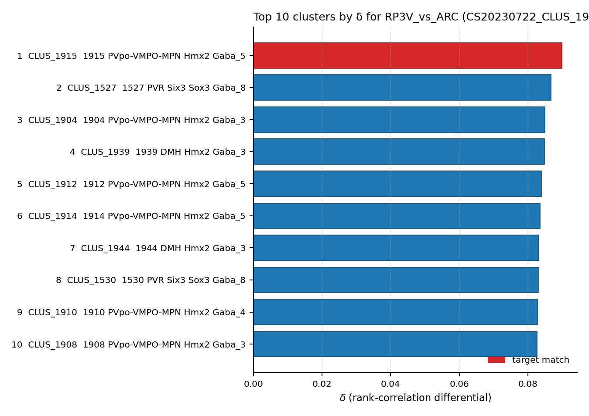

# AVPV/PeN kisspeptin neuron — WMBv1 Mapping Report
*2026-04-25 · Source: `/Users/do12/Documents/GitHub/BICAN_agentic_framework_planning/evidencell/kb/graphs/sexually_dimorphic/20260425_sexually_dimorphic_report_ingest.yaml`*

---

## Introduction

The AVPV/PeN kisspeptin neuron is a classically defined, sexually dimorphic hypothalamic cell type located in the Anteroventral periventricular nucleus [MBA:272] and Periventricular hypothalamic nucleus, posterior part [MBA:341]. It is GABAergic with prominent tyrosine hydroxylase (Th) co-expression, and AVPV/PeN Kiss1 neurons mediate estrogen-positive feedback for the preovulatory GnRH/LH surge in females [3]. The population is strongly female-biased in cell number — a defining anatomical sex difference distinct from the non-dimorphic arcuate KNDy kisspeptin population [1], [2], [3]. Anchoring this classical type onto the WMBv1 transcriptomic taxonomy is necessary to identify a molecular correlate that can be queried in atlas-scale studies of sex differences.

### Classical type table

| Property | Value | References |
|---|---|---|
| Soma location | Anteroventral periventricular nucleus [MBA:272]; Periventricular hypothalamic nucleus, posterior part [MBA:341] | [1], [2], [3] |
| NT type | GABAergic / dopaminergic (TH co-expression) | [3] |
| Defining markers | Kiss1; Th; Esr1 | [1], [2], [3], [4], [5] |
| Neuropeptides | Kiss1 | [6] |
| Sex bias | Female-biased (greater cell number in females) | [1], [2], [3] |
| CL term | hypothalamus kisspeptin neuron (CL:4023123) — BROAD | — |

Details — source evidence for classical type properties

- **Soma location (AVPV/PeN):** literature · rodent · [1], [2], [3]
  > In rodents, the POA regions are concentrated in the Anteroventral Periventricular Nucleus (AVPV). Anatomical differences between genders have been reported in the hypothalamus of some species, e.g. the rat AVPV is sexually dimorphic, with a greater number of KISS1 neurons in females compared to males
  > — Nejad et al. 2017, Functional Roles in Reproductive Neuroendocrine Control · [1] <!-- quote_key: 1227024_3fcab8ab -->

  > Metastin/kisspeptin neurons in the anteroventral periventricular nucleus (AVPV) may be responsible for mediating the feedback effect because the percentage of c-Fos-expressing KiSS-1 mRNA-positive cells to total KiSS-1 mRNA-positive cells was significantly higher in the afternoon than in the morning in the anteroventral periventricular nucleus (AVPV) of high estradiol (E(2))-treated females
  > — Adachi et al. 2007, Functional Roles in Reproductive Neuroendocrine Control · [2] <!-- quote_key: 1357086_85e3d032 -->

  > Kiss1-syntheizing neurons reside primarily in the hypothalamic anteroventral periventricular (AVPV/PeN) and arcuate (ARC) nuclei. AVPV/PeN Kiss1 neurons are sexually dimorphic, with females expressing more Kiss1 than males, and participate in estradiol (E2)- induced positive feedback control of GnRH secretion. In mice, most AVPV/PeN Kiss1 cells coexpress tyrosine hydroxylase (TH), the rate-limiting enzyme in catecholamine synthesis (in this case, dopamine).
  > — Stephens et al. 2017, Neuronal Markers and Molecular Characteristics · [3] <!-- quote_key: 4702847_ebd225e6 -->

- **Th marker:** literature · mouse · [4]
  > adult testosterone-treated GPR54 KO males displayed "female-like" numbers of tyrosine hydroxylase-immunoreactive and Kiss1 mRNA-containing neurons in the anteroventral periventricular nucleus and likewise possessed fewer motoneurons in the spino- bulbocavernosus nucleus than did WT males
  > — Kauffman et al. 2007, Neuronal Markers and Molecular Characteristics · [4] <!-- quote_key: 17692566_78d7ff15 -->

- **Esr1 marker:** literature · [1], [5]
  > KISS1 neurons express sex steroid receptors and are regulated by gonadal sex steroids, mediating the effects of estrogen on GnRH neurons
  > — Nejad et al. 2017, Functional Roles in Reproductive Neuroendocrine Control · [1] <!-- quote_key: 1227024_6801ab8e -->

  > Sex steroid hormones act on hypothalamic kisspeptin neurons to regulate reproductive neural circuits in the brain. Kisspeptin neurons start to express estrogen receptors in utero
  > — Wartenberg et al. 2021, Neuronal Markers and Molecular Characteristics · [5] <!-- quote_key: 237626479_9c737a0a -->

- **Kiss1 neuropeptide:** literature · [6]
  > The AVPV is a sexually dimorphic site with a differential distribution pattern of several neurotransmitters and neuropeptides, including kisspeptin
  > — Frazão et al. 2013, Functional Roles in Reproductive Neuroendocrine Control · [6] <!-- quote_key: 11330110_f135c1a8 -->

### Cell Ontology mapping

Cell Ontology mapping: hypothalamus kisspeptin neuron [[CL:4023123](https://www.ebi.ac.uk/ols4/ontologies/cl/classes?obo_id=CL:4023123)] (BROAD).

---

## Results

Two candidate atlas entries were assessed at supertype and cluster resolution; CLUS_1915 within SUPT_0486 is the primary mapping at MODERATE confidence, supported concordantly by atlas metadata, precomputed expression, and an independent bulk-correlation contrast.

### Mapping candidates

| Rank | WMBv1 cluster | Supertype | Cells (10x) | Confidence | Key property alignment | Verdict |
|---|---|---|---|---|---|---|
| 1 | 1915 PVpo-VMPO-MPN Hmx2 Gaba_5 [CS20230722_CLUS_1915] | 0486 PVpo-VMPO-MPN Hmx2 Gaba_5 | 5 | 🟡 MODERATE | Kiss1/Th/Esr1 CONSISTENT · sex_ratio CONSISTENT | Best candidate (cluster) |
| 2 | 0486 PVpo-VMPO-MPN Hmx2 Gaba_5 [CS20230722_SUPT_0486] | — | 178 | 🟡 MODERATE | Esr1 CONSISTENT · Kiss1/Th APPROXIMATE | Best candidate (supertype) |

Total: 2 edges, both PARTIAL_OVERLAP relationships.

### 1915 PVpo-VMPO-MPN Hmx2 Gaba_5 [CS20230722_CLUS_1915] · 🟡 MODERATE

**Property comparison**

| Property | Classical | Supertype | Best cluster | Alignment |
|---|---|---|---|---|
| NT type | GABAergic / dopaminergic (Th co-expression) | GABAergic (Gaba_5 label) | Dopa (confirmed, cluster.yaml name_in_source='Dopa') | SUPT: APPROXIMATE; CLUS: CONSISTENT |
| Soma location | Anteroventral periventricular nucleus [MBA:272] | MBA:272 (AVPV) n=16; MBA:133 PVpo n=64; MBA:515 MPN n=37 | MBA:272 (AVPV) n=1; MBA:133 PVpo n=1; MBA:1097 Hypothalamus n=3 | APPROXIMATE |
| Kiss1 expression | POSITIVE (transcript, defining marker) | mean_expression=0.62 | mean_expression=2.51; cluster-level DEFINING | SUPT: APPROXIMATE; CLUS: CONSISTENT |
| Esr1 expression | POSITIVE (transcript, defining marker) | mean_expression=7.72 (DEFINING) | mean_expression=9.55 (highest in SUPT_0486) | CONSISTENT |
| Th expression | POSITIVE (protein, co-expressed with Kiss1) | mean_expression=2.72 | mean_expression=6.6 (highest Th in SUPT_0486) | SUPT: APPROXIMATE; CLUS: CONSISTENT |
| Sex ratio | Female-biased (FEMALE_BIASED) | not available | MFR=0.02 (CS20230722_CLUS_1915; extreme female bias, ~50:1 F:M) | CONSISTENT |
| Annotation transfer F1 | not applicable | NOT_ASSESSED | NOT_ASSESSED | NOT_ASSESSED |

**Evidence support**

| Evidence | Type | Supports | Headline | Source |
|---|---|---|---|---|
| Atlas precomputed expression (CLUS_1915) | Atlas metadata | SUPPORT | Kiss1=2.51, Th=6.6, Esr1=9.55; MFR=0.02 | atlas-internal |
| Stephens RP3V vs ARC bulk correlation | Bulk transcriptomic correlation | SUPPORT | δ=0.090, rank 1/5322 | — |

*(1 of 5 child clusters of SUPT_0486 (CLUS_1915) shows the female-biased Kiss1+Th+ profile concordant with the classical type; the remaining 4 are sex-neutral or male-biased and lack the joint Kiss1/Th/Esr1 peak. Best match: CLUS_1915.)*

**Supporting evidence**

- Atlas metadata for CLUS_1915 records the highest Kiss1 (2.51), Th (6.6), and Esr1 (9.55) precomputed mean expression of any child cluster within SUPT_0486 — all three classical defining markers co-peak at this single cluster, and Kiss1 and Slc18a2 are cluster-level DEFINING markers per WMBv1 metadata. The cluster's neurotransmitter assignment (`name_in_source='Dopa'`) confirms the dopaminergic identity classical reports attribute to AVPV Kiss1/TH cells [3], [4], resolving the GABAergic supertype label as a coarse parent annotation rather than a contradiction.
- Sex ratio: CLUS_1915 has `male_female_ratio = 0.02` (approximately 50:1 female:male), the most extreme female bias of any child cluster in SUPT_0486 — directly concordant with the classical female-biased anatomical dimorphism reported across [1], [2], [3].
- MBA:272 (AVPV) cells are explicitly present in CLUS_1915's MERFISH location distribution.
- Bulk RNA-seq of RP3V- vs ARC-sorted Kiss1+ neurons (Stephens 2024 bulk pools, see Methods) independently confirms the mapping: the differential δ = ρ_RP3V − ρ_ARC ranks CLUS_1915 first of 5,322 atlas clusters (δ=0.090; ρ_RP3V=0.388, ρ_ARC=0.298). The remaining top-10 hits are all preoptic/periventricular hypothalamic GABAergic clusters, indicating an anatomically clean differential signal. *(note: the Stephens 2024 publication referenced by the bulk_correlation run record is not yet present in the regional references.json; reference ingest is listed under proposed experiments below.)*

| Rank | Cluster | Supertype | δ | MFR | Top anatomy |
|---:|---|---|---:|---:|---|
| **1** | **CS20230722_CLUS_1915** | **CS20230722_SUPT_0486** | **0.0899** | **0.02** | **Hypothalamus** |
| 2 | CS20230722_CLUS_1527 | CS20230722_SUPT_0418 | 0.0867 | 1.56 | Median preoptic nucleus |
| 3 | CS20230722_CLUS_1904 | CS20230722_SUPT_0484 | 0.0849 | 1.5 | Hypothalamus |
| 4 | CS20230722_CLUS_1939 | CS20230722_SUPT_0489 | 0.0848 | 4.56 | Dorsomedial nucleus of the hypothalamus |
| 5 | CS20230722_CLUS_1912 | CS20230722_SUPT_0486 | 0.0839 | 1.22 | Hypothalamus |
| 6 | CS20230722_CLUS_1914 | CS20230722_SUPT_0486 | 0.0835 | 10.11 | Periventricular hypothalamic nucleus, preoptic part |
| 7 | CS20230722_CLUS_1944 | CS20230722_SUPT_0489 | 0.0831 | 2.23 | Dorsomedial nucleus of the hypothalamus |
| 8 | CS20230722_CLUS_1530 | CS20230722_SUPT_0418 | 0.0831 | 0.75 | Median preoptic nucleus |
| 9 | CS20230722_CLUS_1910 | CS20230722_SUPT_0485 | 0.0828 | 1.44 | Periventricular hypothalamic nucleus, preoptic part |
| 10 | CS20230722_CLUS_1908 | CS20230722_SUPT_0484 | 0.0827 | 1.5 | Periventricular hypothalamic nucleus, preoptic part |

**Marker evidence provenance**

- **Kiss1 (defining marker, neuropeptide):** literature evidence is transcript-level (KiSS-1 mRNA in situ / RT-PCR) in [1], [2], [3], [6] and protein-level (kisspeptin-immunoreactive neurons) in [4]; atlas annotation lists Kiss1 as a cluster-level DEFINING marker for CLUS_1915 with mean expression 2.51. Concordant across protein, transcript, and atlas annotation.
- **Th (defining marker):** evidence base is mixed protein (tyrosine hydroxylase immunoreactivity, [3], [4]) and transcript; atlas CLUS_1915 records Th mean expression 6.6 — the highest of any SUPT_0486 child cluster — confirming the literature TH co-expression claim at transcript level.
- **Esr1 (defining marker):** evidence is transcript-level (ERα immunoreactivity / Esr1 mRNA in [1], [2], [5]); atlas CLUS_1915 Esr1 mean expression 9.55 (highest in SUPT_0486) is fully concordant.
- No atlas-annotation/expression discrepancies were flagged at cluster level — all three defining markers show concordant high expression on CLUS_1915.

**Concerns**

- LOW_CELL_COUNT: CLUS_1915 contains only n=3–5 total cells in WMBv1. The MFR=0.02 and expression peaks are directionally consistent but underpowered statistically; this is the principal reason confidence is capped at MODERATE rather than HIGH.
- Soma location is APPROXIMATE: only n=1 cell is annotated to MBA:272 (AVPV) and the cluster's primary location resolves to the broad Hypothalamus catchall. MERFISH spatial resolution is insufficient to resolve AVPV vs adjacent PVpo (MBA:133)/PeN at this cell count *(adjacent region — could reflect registration boundary error; weak counter-evidence)*.
- TAXONOMY_LEVEL_MISMATCH: avpv_th_neuron is expected to map to the same cluster, since most AVPV Kiss1 cells co-express Th in the classical literature [3], [4]. CLUS_1915 may be the atlas correlate of both populations rather than a separable Kiss1-only subset.
- Annotation transfer NOT_ASSESSED at either resolution.

**What would upgrade confidence**

- Run MapMyCells annotation transfer on a published AVPV Kiss1-Cre or Kiss1-Cre/Rosa-tdTomato scRNA-seq dataset against WMBv1; target F1 ≥ 0.80 at CLUSTER level resolves the LOW_CELL_COUNT concern and would emit an AnnotationTransferEvidence record on this edge.
- Resolves: unresolved question on the separability of avpv_kiss1_neuron vs avpv_th_neuron within CLUS_1915.
- Add the Stephens 2024 bulk-RNAseq publication to `references/sexually_dimorphic/references.json` via the validated ingest path so the BulkCorrelation evidence carries a citation label in future renders.

### 0486 PVpo-VMPO-MPN Hmx2 Gaba_5 [CS20230722_SUPT_0486] · 🟡 MODERATE

**Property comparison**

| Property | Classical | Supertype | Best cluster | Alignment |
|---|---|---|---|---|
| NT type | GABAergic / dopaminergic (Th co-expression) | GABAergic (Gaba_5 label) | CLUS_1915 Dopa | APPROXIMATE |
| Soma location | Anteroventral periventricular nucleus [MBA:272] | MBA:272 (AVPV) n=16; MBA:133 PVpo n=64; MBA:515 MPN n=37 | not assessed at this row | APPROXIMATE |
| Kiss1 expression | POSITIVE (transcript, defining marker) | mean_expression=0.62 | not assessed | APPROXIMATE |
| Esr1 expression | POSITIVE (transcript, defining marker) | mean_expression=7.72 (DEFINING atlas marker) | not assessed | CONSISTENT |
| Th expression | POSITIVE (protein, co-expressed with Kiss1) | mean_expression=2.72 | not assessed | APPROXIMATE |
| Sex ratio | Female-biased (FEMALE_BIASED) | not available | child CLUS_1915 MFR=0.02 | CONSISTENT |
| Annotation transfer F1 | not applicable | NOT_ASSESSED | NOT_ASSESSED | NOT_ASSESSED |

**Evidence support**

| Evidence | Type | Supports | Headline | Source |
|---|---|---|---|---|
| Atlas precomputed expression (SUPT_0486) | Atlas metadata | PARTIAL | Esr1=7.72; Th=2.72; Kiss1=0.62; AVPV n=16 | atlas-internal |

*(Heterogeneity caveat: SUPT_0486 spans PVpo-VMPO-MPN and contains 5 child clusters; only CLUS_1915 shows the female-biased Kiss1+Th+ peak. The other 4 child clusters are sex-neutral or male-biased and lack joint Kiss1/Th co-peak. Best match within supertype: CLUS_1915.)*

**Supporting evidence**

- SUPT_0486 is the highest-scoring supertype for AVPV-region preoptic GABAergic neurons; Esr1 (7.72) is a DEFINING atlas marker, directly concordant with the classical Esr1 assignment from [1], [2], [5]. Th (2.72) is detectable at supertype level but diluted relative to CLUS_1915 (6.6), consistent with the AVPV Kiss1/TH subset being one of several preoptic populations grouped into this supertype.
- Direct AVPV (MBA:272) cell-count match: n=16 cells annotated to AVPV among the supertype's 178 cells.

**Concerns**

- AMBIGUOUS_MAPPING: SUPT_0486 spans PVpo-VMPO-MPN and contains multiple preoptic cell types; avpv_kiss1_neuron, avpv_th_neuron, and mpoa_esr1_neuron all map to this same supertype.
- Soma location APPROXIMATE: supertype spans the broader preoptic zone (PVpo, MPN, VMPO) beyond the AVPV proper *(adjacent region — could reflect registration boundary error; weak counter-evidence)*.
- Kiss1 expression APPROXIMATE at supertype mean (0.62) — consistent with subset expression diluted across heterogeneous child clusters; cluster-level resolution (CLUS_1915, Kiss1=2.51) restores concordance.
- TAXONOMY_LEVEL_MISMATCH: the female-biased sex ratio signal that defines the classical type is only resolvable at child-cluster (CLUS_1915, MFR=0.02), not at supertype level.

**What would upgrade confidence**

- Prefer the cluster-level edge (CLUS_1915) for downstream reasoning; supertype edge is retained for taxonomic context.
- MapMyCells annotation transfer at SUBCLASS / SUPERTYPE level on a published AVPV Kiss1 scRNA-seq dataset would emit an AnnotationTransferEvidence record on this edge.

---

### Methods

Data sources, analyses, and reproducibility receipts

**Classical type definition.** AVPV/PeN kisspeptin neuron is defined as a GABAergic neuron with prominent Th co-expression and Esr1 expression, soma-localised to the Anteroventral periventricular nucleus [MBA:272] and Periventricular hypothalamic nucleus, posterior part [MBA:341]; defining markers Kiss1, Th, Esr1 with literature support from [1], [2], [3], [4], [5]; Kiss1 neuropeptide [6]. The classical type is CLASSICAL_NEUROCHEMICAL by `definition_basis` — it predates transcriptomic taxonomies and is anchored on neurochemical/anatomical evidence in rodents.

**Atlas mapping query.** Candidate atlas clusters were retrieved from the WMBv1 taxonomy (CCN20230722) at ranks 0 (cluster) and 1 (supertype) using metadata-based scoring (region match, NT type, defining markers, sex bias when applicable). Full scoring rules: `workflows/map-cell-type.md`.

**Property alignment.** Each defining property of the classical type was compared to the corresponding atlas-side value via the `property_comparisons` schema, with alignments graded CONSISTENT / APPROXIMATE / DISCORDANT / NOT_ASSESSED. Atlas-side numerical values came from precomputed expression on the cluster (cluster.yaml in the taxonomy reference store) and from MERFISH spatial registration for soma location.

**Bulk transcriptomic correlation.**

| Field | Value |
|---|---|
| Source publication | Stephens et al. 2024 (pending references.json ingest) |
| GEO accession | — |
| Technique | bulk_RNAseq_FACS_sorted |
| n pools | 2 |
| Atlas | CCN20230722 (SHA-256: b21ca985) |
| Statistic | spearman_rho |
| Parameters | pseudobulk_transform=log1p(sum/n_cells); gene_id_space=ensembl_mouse; gene_intersection=bulk_pool_intersection∩atlas_col_names; replicate_pooling=n/a (bulk supp values are already pooled). |
| Script | [correlate.py](https://github.com/Cellular-Semantics/evidencell/blob/d7c4445/kb/correlation_runs/corr_run_20260428_stephens_kiss1_wmbv1/correlate.py) |
| Code version | d7c4445 |
| Caveats | Bulk pools of 10–15 cells are noisy; absolute ρ values fall in 0.3–0.5 even for true matches. The differential δ statistic is the discriminative one; raw ρ rankings are dominated by housekeeping background. Reported in README.md. |

**Atlas data sources.**

- WMBv1 (CCN20230722) — pseudobulk source `conf/mapmycells/CCN20230722/precomputed_stats.h5` · SHA-256 `b21ca985652fb25f9608f99005139a40757133a76fbe845ae5b175c5c26a447b`.

**Anti-hallucination.** All citations, atlas accessions, ontology CURIEs, and verbatim literature quotes in this report are validated against the evidencell knowledge base at write time. Authored-prose evidence narratives are validated against their source `evidence_items[*].explanation` fields. The pre-write hook rejects any unresolvable identifier or unattributed blockquote. Specific mapping limitations and caveats are documented per-candidate in the Discussion section.

*Generated by evidencell `8de5785` at 2026-05-13T12:47:41+00:00 from [kb/graphs/sexually_dimorphic/20260425_sexually_dimorphic_report_ingest.yaml](kb/graphs/sexually_dimorphic/20260425_sexually_dimorphic_report_ingest.yaml).*

**Evidence base table**

| Edge ID | Evidence types | Supports | Source |
|---|---|---|---|
| edge_avpv_kiss1_neuron_to_cs20230722_supt_0486 | ATLAS_METADATA | PARTIAL | atlas-internal |
| edge_avpv_kiss1_neuron_to_cs20230722_clus_1915 | ATLAS_METADATA; BULK_CORRELATION | SUPPORT; SUPPORT | atlas-internal |

---

## Discussion

**Primary mapping:** AVPV/PeN kisspeptin neuron → 1915 PVpo-VMPO-MPN Hmx2 Gaba_5 [CS20230722_CLUS_1915] at MODERATE confidence. Key support: ATLAS_METADATA (Kiss1/Th/Esr1 co-peak; MFR=0.02 female bias) plus BULK_CORRELATION ranking CLUS_1915 first of 5,322 atlas clusters on the RP3V-vs-ARC Stephens 2024 contrast. Key caveats: LOW_CELL_COUNT (n=3–5 cells) and TAXONOMY_LEVEL_MISMATCH with the overlapping avpv_th_neuron classical type. The Cell Ontology has no specific term for this population; hypothalamus kisspeptin neuron [[CL:4023123](https://www.ebi.ac.uk/ols4/ontologies/cl/classes?obo_id=CL:4023123)] is the closest ancestor. CL:4023123 covers all hypothalamic kisspeptin neurons. The AVPV/PeN (RP3V) population is Kiss1-only (not obligately KNDy), so the more specific CL:4023128 (RP3V KNDy neuron) is inappropriate as it requires NKB and dynorphin co-expression. A dedicated CL term for the AVPV/RP3V Kiss1 non-KNDy subpopulation does not yet exist — potential CL contribution.

### Proposed experiments and follow-ups

**Annotation transfer of published AVPV Kiss1 scRNA-seq data to WMBv1.**
- What: MapMyCells annotation transfer using a published Kiss1-Cre or Kiss1-Cre/Rosa-tdTomato AVPV scRNA-seq dataset.
- Target: F1 ≥ 0.80 at CLUSTER level against CLUS_1915.
- Expected output: AnnotationTransferEvidence on both `edge_avpv_kiss1_neuron_to_cs20230722_clus_1915` and the parent supertype edge.
- Resolves: open question 1 (Kiss1 vs Th separability within CLUS_1915); upgrades cluster-level confidence beyond LOW_CELL_COUNT.

**Child-cluster expression inspection across SUPT_0486 (already complete).**
- Status: Already performed; CLUS_1915 was identified as the Kiss1+Th+Esr1+ female-biased child cluster through child_cluster_expression analysis. No further action — the supertype-edge proposed experiment ("Inspect child clusters of SUPT_0486 for Kiss1, Th, Esr1 co-expression") is resolved by the CLUS_1915 ATLAS_METADATA evidence item.

**PeN (MBA:341) supertype assignment check.**
- What: Targeted DB query for clusters containing MBA:341 (Periventricular hypothalamic nucleus, posterior part) Kiss1+ cells.
- Target: identify whether PeN Kiss1 neurons map to SUPT_0486 or a distinct supertype.
- Expected output: either confirmation of PeN inclusion in SUPT_0486 or a secondary edge to a different supertype.
- Resolves: open question 2.

**Reference ingest follow-up.**
- What: Run the validated reference ingest path to add the Stephens 2024 bulk-RNAseq publication to `references/sexually_dimorphic/references.json` so the BulkCorrelationEvidence on CLUS_1915 carries a proper `[n]` citation label in subsequent renders.
- Expected output: regenerated facts/report with a numbered citation in the Evidence support and Methods tables.

### Open questions

1. Which cluster(s) within SUPT_0486 carry peak Kiss1+Th+Esr1 co-expression consistent with AVPV Kiss1/TH identity? *(Partially resolved by CLUS_1915 ATLAS_METADATA; annotation transfer would close.)*
2. Do PeN (MBA:341) Kiss1 neurons map to SUPT_0486 or a different supertype?
3. Do avpv_kiss1_neuron and avpv_th_neuron represent separable populations within CLUS_1915, or is CLUS_1915 the atlas correlate of both?

---

## References

| # | Citation | PMID | Used for |
|---|---|---|---|
| [1] | Nejad et al. 2017 | [29201072](https://pubmed.ncbi.nlm.nih.gov/29201072) | soma location, Kiss1, Esr1 |
| [2] | Adachi et al. 2007 | [17213691](https://pubmed.ncbi.nlm.nih.gov/17213691) | soma location, Kiss1, Esr1 |
| [3] | Stephens et al. 2017 | [28660243](https://pubmed.ncbi.nlm.nih.gov/28660243) | soma location, NT type, Th co-expression |
| [4] | Kauffman et al. 2007 | [17699664](https://pubmed.ncbi.nlm.nih.gov/17699664) | Th marker |
| [5] | Wartenberg et al. 2021 | [34561233](https://pubmed.ncbi.nlm.nih.gov/34561233) | Esr1 marker |
| [6] | Frazão et al. 2013 | [23407940](https://pubmed.ncbi.nlm.nih.gov/23407940) | Kiss1 neuropeptide |
