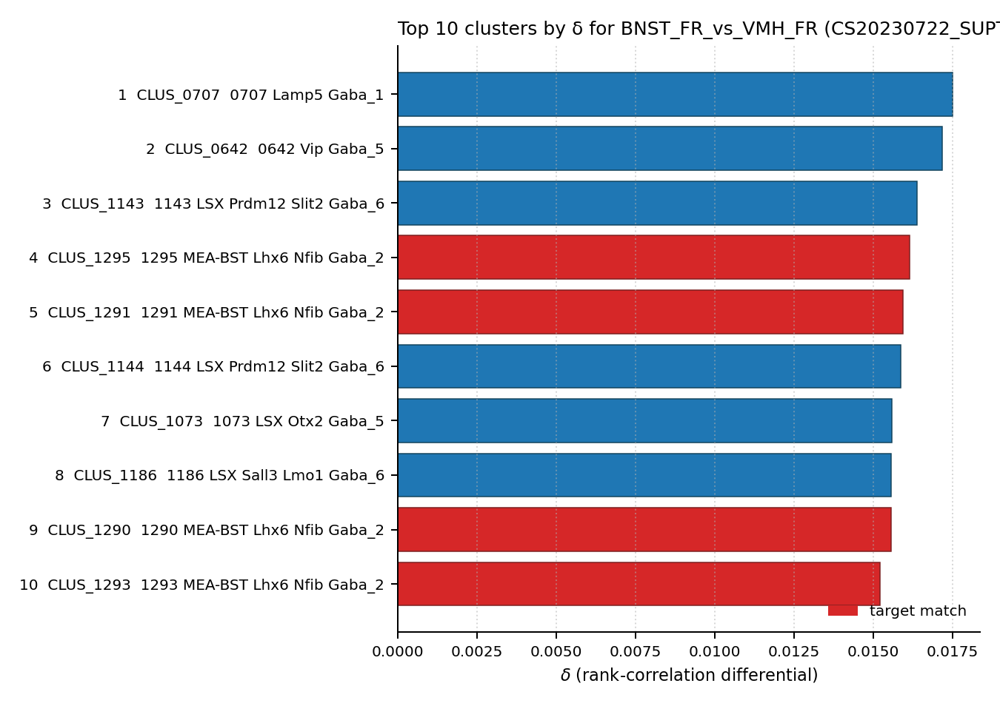

# BNST (anterolateral) corticotropin-releasing factor (CRF) neuron — WMBv1 Mapping Report
*2026-04-25 · Source: `kb/graphs/sexually_dimorphic/20260425_sexually_dimorphic_report_ingest.yaml`*

---

## Introduction

The bed nucleus of the stria terminalis (BNST) contains the brain's highest density of corticotropin-releasing factor (CRF / Crh) neurons. Within the dorsolateral BNST these CRF neurons are female-biased — both more numerous and larger in females — and concentrated in the oval (ovBNST), anterolateral (alBNST), and dorsolateral (dlBNST) subdivisions, where they release CRF onto type II projection neurons and contribute to the affective component of pain [1][2]. They are distinguished from the calbindin-positive principal nucleus of the BNST (a male-biased Kiss1+ population), making Calb1 a diagnostic negative marker for the dlBNST CRF population.

### Classical type table

| Property | Value | References |
|---|---|---|
| Soma location | Bed nuclei of the stria terminalis [MBA:351] — dorsolateral (dlBNST), oval (ovBNST), and anterolateral (alBNST) subdivisions | [1][2] |
| Defining markers | Crh | — |
| Negative markers | Calb1 (distinguishes from Calb1+ principal nucleus) | — |
| Neuropeptides | Crh (corticotropin-releasing factor) | [1][2] |
| Electrophysiology | Type II dlBNST neurons (CRF-excited) | [2] |
| Sex bias | Female-biased — larger and more numerous CRF neurons in alBNST/ovBNST of females | [1] |

<details>
<summary>Details — source evidence for classical type properties</summary>

- **Soma location & sex bias:** Kanaya et al. 2025 review citing Uchida et al. 2019 · [1]

  > The BNST modulates pain sensitivity by releasing corticotropin-releasing factor (CRF) from neurons in the anterolateral subdivision (Ide et al., 2013). Female mice have larger CRF neurons in the anterolateral BNST than male mice (Uchida et al., 2019). Dopaminergic projection from the periaqueductal gray (PAG) to the BNST, which preferentially targets the dorsal part, including the anterolateral subdivision (Gungor et al., 2016), drives pain-related behaviors differently between male and female mice (Yu et al., 2021b).
  > — Kanaya et al. 2025, Sexually Dimorphic Brain Regions and Structures · [1] <!-- quote_key: 279874350_b2b4adba -->

- **Type II electrophysiology and CRF action in dlBNST:** Ide et al. 2013 · [2]

  > In the present study, we examined the effects of corticotropin-releasing factor (CRF) and neuropeptide Y (NPY) injected into the dorsolateral bed nucleus of the stria terminalis (dlBNST) on pain-induced aversion and nociceptive behaviors in rats to examine the roles of these peptides in affective and sensory components of pain, respectively.
  > — Ide et al. 2013, Sexually Dimorphic Brain Regions and Structures · [2] <!-- quote_key: 14550592_292dccea -->

  > Furthermore, whole-cell patch-clamp electrophysiology in dlBNST slices revealed that CRF increased neuronal excitability specifically in type II dlBNST neurons, whereas NPY decreased it in these neurons.
  > — Ide et al. 2013, Sexually Dimorphic Brain Regions and Structures · [2] <!-- quote_key: 14550592_292dccea -->

</details>

Cell Ontology mapping: corticotropin-releasing neuron [[CL:4072021](https://www.ebi.ac.uk/ols4/ontologies/cl/classes?obo_id=CL:4072021)] (BROAD).

---

## Results

Among the candidate WMBv1 supertypes located in MBA:351, only 0393 CEA-BST Rai14 Pdyn Crh Gaba_2 [CS20230722_SUPT_0393] carries Crh as part of its taxonomy label and is the primary mapping for the dlBNST CRF population, with its child cluster 1409 CEA-BST Rai14 Pdyn Crh Gaba_2 [CS20230722_CLUS_1409] as the best-child within the supertype (see property comparison table). A parallel pooled-bulk transcriptomic signal from Knoedler 2022 Esr1+ TRAP-seq nominates 0358 MEA-BST Lhx6 Nfib Gaba_2 [CS20230722_SUPT_0358] as a co-primary BST-localised candidate, but that nomination rests on an Esr1+ proxy rather than direct Crh expression and is held at LOW pending Crh confirmation.

### 0393 CEA-BST Rai14 Pdyn Crh Gaba_2 [CS20230722_SUPT_0393] · 🟡 MODERATE

**Property alignment (Table 1).**

| Property | Classical | Supertype 0393 | Best cluster 1409 | Alignment |
|---|---|---|---|---|
| Soma location | Bed nuclei of the stria terminalis [MBA:351] | BST count_100um=215 (region_fraction_100um=0.846) | BST count_100um=123 (region_fraction_100um=0.794) | CONSISTENT |
| NT type | not asserted (CRF+ BST neurons predominantly GABAergic, classical) | not asserted at supertype | GABA | NOT_ASSESSED at supertype; CONSISTENT at cluster |
| Crh expression (defining marker) | defining marker | no atlas expression data; Crh appears in supertype label | no atlas expression data | NOT_ASSESSED |
| Calb1 expression (negative marker) | ABSENT | Calb1 mean = 5.57 (cohort pct 0.737) | Calb1 mean = 3.57 (cohort pct 0.517) | DISCORDANT |
| Sex ratio | female-biased (alBNST/ovBNST CRF neurons larger in females) | not available at supertype | MFR not available in current facts | NOT_ASSESSED |

*(2 of 9 child clusters of SUPT_0393 surface in the candidate set: CLUS_1409 and CLUS_1410. CLUS_1409 shows lower Calb1 (3.57, cohort pct 0.517) than the supertype mean and is the best-child for the classical type; CLUS_1410 shows higher Calb1 (7.57, cohort pct 0.855) and is therefore less concordant. The remaining children were not surfaced in the rank-0 top-50 and have not been individually assessed.)*

**Evidence support (Table 2).**

| Evidence | Type | Supports | Headline | Source |
|---|---|---|---|---|
| Atlas metadata: BST-located Crh-labelled Gaba supertype | Atlas metadata | PARTIAL | region_fraction_100um=0.846; supertype label encodes Crh | atlas-internal |

The placement of Crh in the supertype's taxonomy label (`0393 CEA-BST Rai14 Pdyn Crh Gaba_2`) reflects the atlas team's marker-based identification of this cluster as Crh-expressing, and the supertype's soma distribution (region_fraction_100um=0.846 onto MBA:351) places it directly in the dlBNST/alBNST territory where Uchida et al. 2019 and Ide et al. 2013 [1][2] localise the CRF population. The principal discordance is the negative-marker test: classical dlBNST CRF neurons are Calb1-negative, distinguishing them from the Calb1+ principal nucleus of the BNST, yet SUPT_0393 shows Calb1 mean expression 5.57 at the 73.7th cohort percentile. The most plausible reading is that SUPT_0393 aggregates several BNST GABAergic subtypes and that a Calb1-low, Crh-high child cluster within it is the true target — child cluster CLUS_1409 shows lower Calb1 (3.57, cohort pct 0.517) than the supertype mean and is the best-cluster candidate. Confidence is held at MODERATE: the supertype-level mapping is structurally supportable (BST location + Crh in the label) but the Calb1 discordance and the absence of direct Crh expression numbers at this resolution prevent a higher call.

*(MERFISH registration caveat: WMBv1 places SUPT_0393 cells at the parent BNST term [MBA:351] without sub-nucleus assignment, so concordance with the dlBNST/ovBNST/alBNST resolution at which the female bias is documented [1] cannot be confirmed from atlas metadata alone.)*

### 1409 CEA-BST Rai14 Pdyn Crh Gaba_2 [CS20230722_CLUS_1409] · 🟡 MODERATE

**Property alignment (Table 1).** See the table under SUPT_0393 above; the best-cluster column already shows CLUS_1409's values. The cluster-level NT annotation is explicit (GABA), and Calb1 at CLUS_1409 (3.57; cohort pct 0.517) is lower than at the sibling CLUS_1410 (7.57; cohort pct 0.855), making CLUS_1409 the more parsimonious candidate for a Calb1-low Crh-high dlBNST CRF subpopulation. CLUS_1409 carries 191 cells in the 10x dataset with region_fraction_100um=0.794 (in-BST proximity).

**Evidence support (Table 2).**

| Evidence | Type | Supports | Headline | Source |
|---|---|---|---|---|
| Atlas metadata: BST-located, GABA, Crh in supertype label | Atlas metadata | PARTIAL | region_fraction_100um=0.794; Crh on parent supertype | atlas-internal |

The cluster-level evidence is the cleanest available structural match: CLUS_1409 sits in the Crh-labelled BST GABAergic supertype, has GABA NT annotation, has soma proximity to MBA:351 at 0.794, and shows Calb1 below the cohort median (pct 0.517). The Calb1 discordance remains — atlas expression at CLUS_1409 (3.57) is still well above the "absent" classical expectation, and direct Crh expression is not available at this cluster in the facts file — so confidence is MODERATE, paired with SUPT_0393 at supertype level. A targeted measurement of Crh at CLUS_1409 versus CLUS_1410, plus stratification of CLUS_1409 cells by sex, would be the most direct route to upgrading both edges.

### 0358 MEA-BST Lhx6 Nfib Gaba_2 [CS20230722_SUPT_0358] · 🔴 LOW

**Property alignment (Table 1).**

| Property | Classical | Supertype 0358 | Best cluster (Knoedler δ-ranked) | Alignment |
|---|---|---|---|---|
| Soma location | Bed nuclei of the stria terminalis [MBA:351] | spans MEA and BST; CLUS_1290 primary soma=BST | CLUS_1290 top anat = BST | APPROXIMATE |
| NT type | GABAergic (CRF+ BST neurons predominantly GABAergic, classical) | GABAergic (Lhx6 Nfib Gaba_2) | GABAergic | CONSISTENT |
| Crh expression (defining marker) | defining marker | NOT_ASSESSED — Knoedler sorted on Esr1, not Crh | NOT_ASSESSED | NOT_ASSESSED |
| Sex ratio | female-biased | child cluster MFRs span 0.82–99.0 | CLUS_1293 MFR=99 (extreme male bias) | APPROXIMATE |

**Evidence support (Table 2).**

| Evidence | Type | Supports | Headline | Source |
|---|---|---|---|---|
| Knoedler 2022 Esr1+ TRAP-seq BNST FR vs VMH FR | Bulk-correlation differential | PARTIAL | best child CLUS_1295 rank 4 (δ=0.0161); 4 of top-10 children belong to SUPT_0358 | [3] |

> Knoedler 2022 (PMID:35143761) Esr1+ TRAP-seq pooled BNST female-receptive vs VMH female-receptive identifies SUPT_0358 (MEA-BST Lhx6 Nfib Gaba_2) as a top BNST-specific signal. Multiple child clusters appear in top 10 by δ(BNST_FR − VMH_FR): CLUS_1295 (rank 4), CLUS_1291 (rank 5), CLUS_1290 (rank 9, primary soma BST proper), CLUS_1293 (rank 10, MFR=99 — extreme male bias). CRITICAL CAVEAT: Knoedler sorted on Esr1+, not Crh+. This evidence supports SUPT_0358 as the BST-localised Esr1+ supertype; CRF+/Crh+ co-localisation within this supertype must be confirmed by direct evidence (ISH, scRNA-seq for Crh) before accepting SUPT_0358 as a bnst_crf_neuron mapping target. Confidence held at LOW pending that confirmation.
> — Knoedler et al. 2022 · [3]



*Top 10 clusters by δ (Spearman ρ difference, BNST_FR pool − VMH_FR pool) from Knoedler 2022 Esr1+ TRAP-seq. Four of the top 10 are children of SUPT_0358 (highlighted), confirming the supertype as the dominant BST-localised Esr1+ transcriptomic signature; ranks above SUPT_0358 are cortical/septal Lamp5/Vip clusters whose appearance is an Esr1+ TRAP background, not a competing BST signal.*

The Knoedler signal is the only non-atlas-metadata evidence on any candidate for this node, and it strongly localises SUPT_0358 to the BST under an Esr1+ pulldown. The interpretive question is whether the Esr1+ pool overlaps the Crh+ pool in the BST: the literature in the facts file does not establish that overlap directly, and the mixed-direction MFRs across child clusters (notably CLUS_1293 at MFR=99, extreme male bias) are inconsistent with the classical female-biased CRF population. SUPT_0358 may therefore capture a different (or partially overlapping) BST sexually dimorphic population — Esr1+ rather than Crh+. Confidence is LOW; direct Crh measurement in BST at single-cell resolution is the test that would either upgrade SUPT_0358 to a co-primary mapping or refute it.

**Stale-edge note.** SUPT_0358 fell outside the current Stage A top-50 at rank 1, and its `property_comparisons` were not refreshed in the 2026-06-08 sweep. The edge remains in the graph from prior curation work and is the only carrier of the Knoedler BULK_CORRELATION evidence — but it warrants curator review for stale-edge cleanup before being relied on (cf. Cellular-Semantics/evidencell#111).

<details>
<summary>Candidates audited (full top-K)</summary>

| WMBv1 cluster / supertype | Supertype parent | Cells (10x) | Confidence | Key evidence | Verdict |
|---|---|---:|---|---|---|
| 0393 CEA-BST Rai14 Pdyn Crh Gaba_2 [CS20230722_SUPT_0393] | — | 278 | 🟡 MODERATE | BST proximity 0.846; Crh in supertype label | Primary (supertype) |
| 1409 CEA-BST Rai14 Pdyn Crh Gaba_2 [CS20230722_CLUS_1409] | 0393 CEA-BST Rai14 Pdyn Crh Gaba_2 | 191 | 🟡 MODERATE | best-child within SUPT_0393; Calb1 below cohort median | Primary (best child) |
| 0358 MEA-BST Lhx6 Nfib Gaba_2 [CS20230722_SUPT_0358] | — | 1734 | 🔴 LOW | Knoedler Esr1+ BST_FR vs VMH_FR top signal | Secondary (Esr1+ proxy) |
| 1410 CEA-BST Rai14 Pdyn Crh Gaba_2 [CS20230722_CLUS_1410] | 0393 CEA-BST Rai14 Pdyn Crh Gaba_2 | 87 | ⚪ UNCERTAIN | sibling of CLUS_1409; Calb1 high (7.57; pct 0.855) | Eliminated (Calb1 high, sibling outperformed) |
| 0410 BST Tac2 Gaba_2 [CS20230722_SUPT_0410] | — | 483 | ⚪ UNCERTAIN | BST-located Tac2+ Gaba supertype | Eliminated (Tac2 supertype, not Crh) |
| 1499 BST Tac2 Gaba_2 [CS20230722_CLUS_1499] | 0410 BST Tac2 Gaba_2 | 62 | ⚪ UNCERTAIN | child of SUPT_0410 | Eliminated (Tac2 lineage) |
| 1475 MPO-ADP Lhx8 Gaba_4 [CS20230722_CLUS_1475] | 0405 MPO-ADP Lhx8 Gaba_4 | 100 | ⚪ UNCERTAIN | BST+MPO/Hypothalamus distribution | Eliminated (MPO-ADP lineage) |
| 1476 MPO-ADP Lhx8 Gaba_4 [CS20230722_CLUS_1476] | 0405 MPO-ADP Lhx8 Gaba_4 | 67 | ⚪ UNCERTAIN | BST+MPO/Hypothalamus distribution | Eliminated (MPO-ADP lineage) |
| 0343 MEA-BST Sox6 Gaba_7 [CS20230722_SUPT_0343] | — | 2071 | ⚪ UNCERTAIN | MEA-BST Sox6 lineage; Calb1=7.28, pct 0.894 | Eliminated (Calb1 high, MEA-dominant) |
| 0379 CEA-AAA-BST Six3 Sp9 Gaba_7 [CS20230722_SUPT_0379] | — | 195 | ⚪ UNCERTAIN | CEA-AAA-BST Six3/Sp9 lineage | Eliminated (CEA/AAA-dominant, not Crh) |
| 0383 ACB-BST-FS D1 Gaba_3 [CS20230722_SUPT_0383] | — | 722 | ⚪ UNCERTAIN | ACB-BST D1 medium spiny lineage | Eliminated (striatal D1, wrong subclass) |

</details>

---

### Methods

<details>
<summary>Data sources, analyses, and reproducibility receipts</summary>

**Classical type definition.** The classical type is a CLASSICAL_NEUROCHEMICAL definition: BNST CRF (Crh+) neurons concentrated in the dorsolateral, oval, and anterolateral subdivisions of the BNST (MBA:351) [1][2], with Calb1 as a diagnostic negative marker (distinguishing them from the Calb1+ principal nucleus of the BNST) and type II electrophysiology in dlBNST slices [2]. Female-biased dimorphism (larger and more numerous CRF neurons in alBNST/ovBNST of females) defines the sexually dimorphic phenotype [1]. CL mapping is BROAD to corticotropin-releasing neuron [CL:4072021], pending a BNST-specific child term.

**Atlas mapping query.** Candidate atlas clusters were retrieved from the WMBv1 taxonomy (CS20230722) at ranks 0 (cluster) and 1 (supertype) using metadata-based scoring (region match, NT type, defining markers, sex bias when applicable). Full scoring rules: `workflows/map-cell-type.md`.

**Property alignment.** Each defining property of the classical type was compared to the corresponding atlas-side value via the `property_comparisons` schema, with alignments graded CONSISTENT / APPROXIMATE / DISCORDANT / NOT_ASSESSED. Atlas-side numerical values came from precomputed expression on the cluster (cluster.yaml in the taxonomy reference store) and from MERFISH spatial registration for soma location.

**Bulk transcriptomic correlation.**

| Field | Value |
|---|---|
| Source publication | Knoedler et al. 2022 · [3] |
| GEO accession | GSE183092 |
| Technique | TRAP-seq |
| n pools | 12 (4 data files) |
| Atlas | CCN20230722 (SHA-256: b21ca985) |
| Statistic | spearman_rho (δ across paired pools) |
| Parameters | pseudobulk_transform=log1p(sum/n_cells); pool_transform=log1p(replicate_mean(DESeq2_normalised_counts)); gene_id_space=ensembl_mouse_via_symbol_lookup; gene intersection across 4 regions ∩ atlas col names; n_replicates_per_pool=3 |
| Script | `correlate.py` (commit 4e67d6b) |
| Code version | 4e67d6b |
| Caveats | Cross-sex within-region δ contrasts (Male vs FR or Male vs FNR) are artefactual: across all three regions tested (POA, VMH, BNST) the top hits are hindbrain Calcb cholinergic motor neurons — a global male-vs-female expression bias that swamps region-specific signals. METHODOLOGICAL RULE: paired-bulk δ requires the two pools to differ in cell population (region/marker/state) holding sex constant. TRAP-seq vs scRNA pseudobulk: polysome-bound mRNA shifts absolute ρ lower than for FACS-bulk inputs (Stephens-style), but Spearman rank-based statistics handle the magnitude offset. |

**Atlas data sources.** WMBv1 / CS20230722 — pseudobulk source `conf/mapmycells/CCN20230722/precomputed_stats.h5` (SHA-256: `b21ca985652fb25f9608f99005139a40757133a76fbe845ae5b175c5c26a447b`).

**Anti-hallucination.** All citations, atlas accessions, ontology CURIEs, and verbatim literature quotes in this report are validated against the evidencell knowledge base at write time. Authored-prose evidence narratives are validated against their source `evidence_items[*].explanation` fields. The pre-write hook rejects any unresolvable identifier or unattributed blockquote. Specific mapping limitations and caveats are documented per-candidate in the Discussion section.

*Generated by evidencell `25c2b32` at 2026-06-08T18:14:08+00:00 from [kb/graphs/sexually_dimorphic/20260425_sexually_dimorphic_report_ingest.yaml](kb/graphs/sexually_dimorphic/20260425_sexually_dimorphic_report_ingest.yaml).*

**Evidence base table.**

| Edge ID | Evidence types | Supports | Source |
|---|---|---|---|
| edge_bnst_crf_neuron_to_cs20230722_supt_0393 | ATLAS_METADATA | PARTIAL | atlas-internal |
| edge_bnst_crf_neuron_to_CS20230722_SUPT_0393 | ATLAS_METADATA | PARTIAL | atlas-internal |
| edge_bnst_crf_neuron_to_CS20230722_CLUS_1409 | ATLAS_METADATA | PARTIAL | atlas-internal |
| edge_bnst_crf_neuron_to_CS20230722_CLUS_1410 | ATLAS_METADATA | PARTIAL | atlas-internal |
| edge_bnst_crf_neuron_to_cs20230722_supt_0358 | BULK_CORRELATION | PARTIAL | [3] |
| edge_bnst_crf_neuron_to_CS20230722_SUPT_0410 | ATLAS_METADATA | PARTIAL | atlas-internal |
| edge_bnst_crf_neuron_to_CS20230722_CLUS_1499 | ATLAS_METADATA | PARTIAL | atlas-internal |
| edge_bnst_crf_neuron_to_CS20230722_CLUS_1475 | ATLAS_METADATA | PARTIAL | atlas-internal |
| edge_bnst_crf_neuron_to_CS20230722_CLUS_1476 | ATLAS_METADATA | PARTIAL | atlas-internal |
| edge_bnst_crf_neuron_to_CS20230722_SUPT_0343 | ATLAS_METADATA | PARTIAL | atlas-internal |
| edge_bnst_crf_neuron_to_CS20230722_SUPT_0379 | ATLAS_METADATA | PARTIAL | atlas-internal |
| edge_bnst_crf_neuron_to_CS20230722_SUPT_0383 | ATLAS_METADATA | PARTIAL | atlas-internal |

</details>

---

## Discussion

**Primary mapping:** BNST (anterolateral) corticotropin-releasing factor (CRF) neuron → 0393 CEA-BST Rai14 Pdyn Crh Gaba_2 [CS20230722_SUPT_0393] at MODERATE confidence, with 1409 CEA-BST Rai14 Pdyn Crh Gaba_2 [CS20230722_CLUS_1409] as the best-child within that supertype (also MODERATE). Key support: BST-localised Crh-labelled GABAergic supertype with proximity region_fraction_100um=0.846, and CLUS_1409 showing the lowest Calb1 (3.57, cohort pct 0.517) among the supertype's surfaced children. Key caveats: MARKER_NOT_SPECIFIC (Calb1 discordance at supertype level) and MERFISH_REGISTRATION_UNCERTAINTY (parent BNST term, no sub-nucleus resolution).

The Cell Ontology has no specific term for this population; corticotropin-releasing neuron [[CL:4072021](https://www.ebi.ac.uk/ols4/ontologies/cl/classes?obo_id=CL:4072021)] is the closest ancestor. CL:4072021 covers all CRH-secreting neurons across brain regions (PVN, hippocampus, BNST, etc.). BNST CRF neurons do secrete CRH, making this a valid BROAD match. A BNST-specific child term does not yet exist — the female-biased dlBNST CRF population is a candidate for CL contribution.

A parallel pooled-bulk transcriptomic signal from Knoedler 2022 Esr1+ TRAP-seq nominates 0358 MEA-BST Lhx6 Nfib Gaba_2 [CS20230722_SUPT_0358] as a co-primary candidate at LOW confidence, but the underlying pulldown sorted on Esr1+, not Crh+, and the supertype contains both female-biased and extreme-male-biased child clusters (CLUS_1293 MFR=99). SUPT_0358 most likely captures a partially overlapping Esr1+ BST sexually dimorphic population rather than the Crh+ population per se — resolution turns on whether Esr1+ and Crh+ cells co-localise within this supertype.

### Proposed experiments and follow-ups

- **What:** Direct Crh expression measurement at cluster level within SUPT_0393 and SUPT_0358 (e.g. ISH or MERFISH co-staining for Crh, Esr1, Calb1 in BST). **Target:** Confirm that CLUS_1409 (and ideally a Calb1-low subset) carries detectable Crh expression above background, and quantify Crh+/Esr1+ overlap within SUPT_0358 vs SUPT_0393. **Expected output:** Property-comparison evidence with direct Crh quantification at cluster level (replacing the current "no atlas expression data" NOT_ASSESSED). **Resolves:** primary edges (SUPT_0393, CLUS_1409) Calb1 discordance reading; LOW-confidence SUPT_0358 vs SUPT_0393 ambiguity.
- **What:** Cluster annotation transfer from a published BNST transcriptomic dataset with Crh+ subset annotations to WMBv1. **Target:** F1 ≥ 0.50 at supertype level localising the dlBNST CRF subset. **Expected output:** AnnotationTransferEvidence on bnst_crf_neuron candidate edges. **Resolves:** discriminates whether the Crh+ subset within BST GABAergic populations lands cleanly on SUPT_0393 (the Crh-named supertype) or splits between SUPT_0393 and SUPT_0358.
- **What:** Sex-stratified analysis of CLUS_1409 (and sibling CLUS_1410) and of all SUPT_0358 child clusters. **Target:** Test for female-bias signature matching the classical type's known dimorphism. **Expected output:** Sex-ratio metric (MFR equivalent) per cluster. **Resolves:** open question 2 below.
- **What:** Curator review of the legacy SUPT_0358 edge for stale-edge cleanup (cf. Cellular-Semantics/evidencell#111). **Target:** Confirm or remove the legacy lowercase edge that carries Knoedler evidence but fell out of the current Stage A top-50 at rank 1.

### Open questions

1. Do individual clusters under SUPT_0393 (particularly CLUS_1409) segregate into Calb1-high and Calb1-low subpopulations consistent with the classical Calb1-negative dlBNST CRF type?
2. Does SUPT_0393 (or specifically CLUS_1409) show the female-biased sex ratio consistent with bnst_crf_neuron, and what fraction of CLUS_1290/CLUS_1295 (SUPT_0358) cells co-express Crh+ with Esr1+?
3. Is SUPT_0393 (high Crh-labelled atlas annotation) or SUPT_0358 (Esr1+ proxy with female-receptive BST signal) the better mapping for the sexually dimorphic anterolateral BST CRF+ population — or do they capture distinct, partially overlapping populations?
4. Resolution of the WMBv1 MERFISH registration to BNST sub-nuclei (ovBNST, alBNST, dlBNST) would allow direct testing of the sub-nucleus identity claimed for the classical type; currently atlas cells are placed only at the parent BNST term (MBA:351).

---

## References

| # | Citation | PMID | Used for |
|---|---|---|---|
| [1] | Kanaya et al. 2025. *Neonatal testosterone exposure alleviates female-specific severity of formalin-induced inflammatory pain in mice.* Front. Neural Circuits. [DOI:10.3389/fncir.2025.1593443](https://doi.org/10.3389/fncir.2025.1593443) | — | soma location, female-biased CRF neurons in alBNST |
| [2] | Ide et al. 2013. *Opposing roles of CRF and NPY within the dorsolateral BNST in the negative affective component of pain in rats.* J. Neurosci. | [PMID:23554470](https://pubmed.ncbi.nlm.nih.gov/23554470) | dlBNST CRF action, type II electrophysiology |
| [3] | Knoedler et al. 2022. *A functional cellular framework for sex and estrous cycle-dependent gene expression and behavior.* | [PMID:35143761](https://pubmed.ncbi.nlm.nih.gov/35143761) | Esr1+ TRAP-seq pooled BNST FR vs VMH FR (GSE183092) |

---

<!-- verdict-block-start: edge_bnst_crf_neuron_to_CS20230722_SUPT_0393 -->
```yaml
verdict:
  confidence: MODERATE
  confidence_score: 0.55
  relationship: skos:broadMatch
  mapping_cardinality: "1:n"
  mapping_justification: semapv:ManualMappingCuration
  rationale: >
    [tier:STRONGEST] CS20230722_SUPT_0393 is the BST-localised Crh-labelled GABAergic
    supertype (region_fraction_100um=0.846 onto MBA:351; Crh appears in the supertype
    taxonomy label). Calb1 cohort percentile 0.737 at supertype level is DISCORDANT
    with the classical Calb1-negative dlBNST CRF type; the best-child CS20230722_CLUS_1409
    shows lower Calb1 (cohort percentile 0.517) and pairs with this edge as a
    1:1 closeMatch at cluster level.
  reconciliation_note: >
    Paired with CS20230722_CLUS_1409 as the best-child within this supertype; both
    surfaced as primary candidates. CS20230722_SUPT_0358 (Knoedler Esr1+ BST signal)
    is a co-primary alternative at LOW confidence pending direct Crh measurement.
  caveats:
    - caveat_type: MARKER_NOT_SPECIFIC
      description: >
        CS20230722_SUPT_0393 shows Calb1 cohort percentile 0.737 despite bnst_crf_neuron
        having Calb1 as a NEGATIVE marker. This supertype likely aggregates multiple BST
        GABAergic subtypes; child cluster CS20230722_CLUS_1409 shows lower Calb1
        (cohort percentile 0.517) and is the more specific mapping candidate.
    - caveat_type: MERFISH_REGISTRATION_UNCERTAINTY
      description: >
        The classical type is defined at sub-nucleus resolution (dlBNST, ovBNST, alBNST).
        WMBv1 transcriptomic annotation uses the parent BNST term (MBA:351) without
        sub-nucleus assignment. Sub-nucleus identity of the matching cells cannot be
        confirmed from atlas metadata.
  proposed_experiments:
    - >
      Direct Crh expression measurement at cluster level within CS20230722_SUPT_0393
      (CS20230722_CLUS_1409 and CS20230722_CLUS_1410); target detectable Crh above
      background and a Calb1-low subset within CS20230722_CLUS_1409. Expected output:
      property-comparison evidence with direct Crh quantification replacing current
      NOT_ASSESSED.
    - >
      Cluster annotation transfer from a published BNST transcriptomic dataset with
      Crh+ subset annotations to WMBv1; target F1 >= 0.50 at supertype level
      localising the dlBNST CRF subset onto CS20230722_SUPT_0393.
  unresolved_questions:
    - Do individual clusters under CS20230722_SUPT_0393 segregate into Calb1-high and Calb1-low populations? A Calb1-low, Crh-high child cluster would support confidence upgrade.
    - Does CS20230722_SUPT_0393 (or specifically CS20230722_CLUS_1409) show female-biased sex ratio consistent with bnst_crf_neuron?
```
<!-- verdict-block-end -->

<!-- verdict-block-start: edge_bnst_crf_neuron_to_cs20230722_supt_0393 -->
```yaml
verdict:
  confidence: UNCERTAIN
  confidence_score: 0.25
  rationale: >
    [tier:CUT] Legacy/fresh-emit duplicate of CS20230722_SUPT_0393 (lowercase
    edge id alongside fresh-emit uppercase edge); the fresh-emit edge
    edge_bnst_crf_neuron_to_CS20230722_SUPT_0393 carries the canonical
    structured evidence. Curator removal of this duplicate is the recommended
    follow-up.
  caveats:
    - caveat_type: OTHER
      description: >
        Duplicate of the fresh-emit edge edge_bnst_crf_neuron_to_CS20230722_SUPT_0393
        on the same taxonomy_type. Carried curator-authored caveats prior to the
        2026-06-08 sweep; surfaced here as a stale-duplicate cleanup follow-up
        rather than as an independent candidate.
  unresolved_questions:
    - Curator removal of duplicate edge edge_bnst_crf_neuron_to_cs20230722_supt_0393 — legacy/fresh-emit ID collision on taxonomy_type CS20230722_SUPT_0393.
```
<!-- verdict-block-end -->

<!-- verdict-block-start: edge_bnst_crf_neuron_to_CS20230722_CLUS_1409 -->
```yaml
verdict:
  confidence: MODERATE
  confidence_score: 0.55
  relationship: skos:closeMatch
  mapping_cardinality: "1:1"
  mapping_justification: semapv:ManualMappingCuration
  rationale: >
    [tier:NEXT] CS20230722_CLUS_1409 (191 cells, region_fraction_100um=0.794 onto
    MBA:351, GABA NT) is the best-child within CS20230722_SUPT_0393. Calb1 cohort
    percentile 0.517 is below median (lower than sibling CS20230722_CLUS_1410 at
    cohort percentile 0.855), making CS20230722_CLUS_1409 the more parsimonious
    candidate for the classical Calb1-low Crh-high dlBNST CRF type. Direct Crh
    expression at this cluster is NOT_ASSESSED in current facts.
  reconciliation_note: >
    Paired with CS20230722_SUPT_0393 (best-child within supertype). Supertype carries
    1:n broadMatch; this cluster edge carries 1:1 closeMatch.
  caveats:
    - caveat_type: MARKER_NOT_SPECIFIC
      description: >
        Calb1 cohort percentile 0.517 at CS20230722_CLUS_1409 remains DISCORDANT with
        the classical Calb1-absent expectation, though lower than at the parent
        supertype. Direct Crh quantification is required to confirm CS20230722_CLUS_1409
        as the Calb1-low, Crh-high subpopulation.
    - caveat_type: MERFISH_REGISTRATION_UNCERTAINTY
      description: >
        Sub-nucleus identity (dlBNST, ovBNST, alBNST) of CS20230722_CLUS_1409 cells
        cannot be confirmed from WMBv1 spatial registration, which uses the parent
        BNST term (MBA:351).
  proposed_experiments:
    - >
      Sex-stratified analysis of CS20230722_CLUS_1409 versus sibling CS20230722_CLUS_1410;
      target detection of female-bias signature matching the classical type's dimorphism.
    - >
      Direct Crh measurement at CS20230722_CLUS_1409 (e.g. ISH or MERFISH co-staining
      for Crh, Esr1, Calb1) to confirm cluster-level Crh expression and parsimoniously
      identify the Calb1-low subset.
  unresolved_questions:
    - What fraction of CS20230722_CLUS_1409 cells co-express Crh+ and are Calb1-low? A subset analysis is needed to confirm parsimony with the classical type.
```
<!-- verdict-block-end -->

<!-- verdict-block-start: edge_bnst_crf_neuron_to_cs20230722_supt_0358 -->
```yaml
verdict:
  confidence: LOW
  confidence_score: 0.30
  relationship: skos:closeMatch
  mapping_cardinality: "1:1"
  mapping_justification: semapv:ManualMappingCuration
  rationale: >
    [tier:WEAKEST] CS20230722_SUPT_0358 is the top BST-localised signal from Knoedler 2022
    Esr1+ TRAP-seq BNST_FR vs VMH_FR (PMID:35143761); 4 of the top 10 clusters by
    delta belong to CS20230722_SUPT_0358 (best child cluster rank 4 by Knoedler 2022
    BST-FR vs VMH-FR bulk-correlation delta). CRITICAL:
    Knoedler sorted on Esr1+, not Crh+; co-localisation of Esr1+ and Crh+ within this
    supertype is not established by current evidence. Mixed-direction MFRs across child
    clusters (one child cluster MFR=99, extreme male bias) are inconsistent with the
    classical female-biased CRF population, suggesting the supertype captures a partially
    overlapping Esr1+ BST sexually dimorphic population rather than the Crh+ population
    per se.
  reconciliation_note: >
    Co-primary alternative to CS20230722_SUPT_0393 (the Crh-labelled supertype). Held at
    LOW pending direct Crh measurement; would either upgrade to a parallel mapping or
    be refuted. Stale-edge follow-up: this edge fell outside the current Stage A top-50
    at rank 1 and its property_comparisons were not refreshed in the 2026-06-08 sweep
    (cf. Cellular-Semantics/evidencell#111).
  caveats:
    - caveat_type: AMBIGUOUS_MAPPING
      description: >
        Alternative or co-primary candidate to CS20230722_SUPT_0393. Both may capture
        parts of the heterogeneous BNST dimorphic population; curator review needed to
        decide whether CS20230722_SUPT_0358 is a parallel mapping or a separate Esr1+ type.
    - caveat_type: NO_DISCRIMINATING_MARKER
      description: >
        CS20230722_SUPT_0358 has no DEFINING marker for Crh in atlas metadata. The mapping
        rests on bulk-correlation co-localisation evidence (Esr1+ proxy) only. Direct
        Crh expression measurement at cluster level is required for confidence upgrade.
    - caveat_type: OTHER
      description: >
        Stale-edge follow-up — CS20230722_SUPT_0358 fell outside the current Stage A
        top-50 at rank 1 and property_comparisons were not refreshed in the 2026-06-08
        sweep; warrants curator review before being relied on
        (cf. Cellular-Semantics/evidencell#111).
  proposed_experiments:
    - >
      ISH or MERFISH co-staining for Crh, Esr1, Calb1 in BST to identify the cluster
      boundary between CS20230722_SUPT_0358 (Esr1+) and CS20230722_SUPT_0393 (Crh+) and
      quantify their overlap.
    - >
      Cluster annotation transfer of published BNST transcriptomic data with Crh+ subset
      annotations to WMBv1; expect the Crh+ signal to split between CS20230722_SUPT_0358
      and CS20230722_SUPT_0393 if both contain Crh+ subpopulations.
  unresolved_questions:
    - What fraction of CS20230722_SUPT_0358 cells co-express Esr1+ and Crh+? Direct co-staining in BST would resolve this.
    - Is CS20230722_SUPT_0393 (Crh-labelled) or CS20230722_SUPT_0358 (Esr1+ proxy) the better mapping for the sexually dimorphic anterolateral BST CRF+ population?
```
<!-- verdict-block-end -->

<!-- verdict-block-start: edge_bnst_crf_neuron_to_CS20230722_CLUS_1410 -->
```yaml
verdict:
  confidence: UNCERTAIN
  confidence_score: 0.15
  rationale: >
    [tier:CUT] Sibling of CS20230722_CLUS_1409 within CS20230722_SUPT_0393, but Calb1
    cohort percentile 0.855 is well above the classical Calb1-absent expectation and
    above sibling CS20230722_CLUS_1409 (cohort percentile 0.517). CS20230722_CLUS_1409
    is the more parsimonious best-child; CS20230722_CLUS_1410 is eliminated on
    cohort-relative Calb1 grounds.
  caveats:
    - caveat_type: AMBIGUOUS_MAPPING
      description: >
        DISCORDANT negative_marker_Calb1 at cohort percentile 0.855; sibling
        CS20230722_CLUS_1409 carries the candidate role at lower Calb1.
```
<!-- verdict-block-end -->

<!-- verdict-block-start: edge_bnst_crf_neuron_to_CS20230722_SUPT_0410 -->
```yaml
verdict:
  confidence: UNCERTAIN
  confidence_score: 0.15
  rationale: >
    [tier:CUT] CS20230722_SUPT_0410 is the BST-located 0410 BST Tac2 Gaba_2 supertype,
    not a Crh-labelled supertype. region_fraction_100um=0.569 onto MBA:351 is positive
    but the supertype identity (Tac2+ Gaba) does not match the classical Crh+ defining
    marker and Calb1 cohort percentile 0.492 is mid-range. Eliminated as a
    wrong-supertype-lineage candidate.
  caveats:
    - caveat_type: AMBIGUOUS_MAPPING
      description: Tac2-defined supertype, not Crh-defined; eliminated on marker lineage.
```
<!-- verdict-block-end -->

<!-- verdict-block-start: edge_bnst_crf_neuron_to_CS20230722_CLUS_1499 -->
```yaml
verdict:
  confidence: UNCERTAIN
  confidence_score: 0.15
  rationale: >
    [tier:CUT] Child of CS20230722_SUPT_0410 (BST Tac2 Gaba_2 lineage). Same wrong-lineage
    elimination as the parent supertype; Calb1 cohort percentile 0.504 is mid-range.
  caveats:
    - caveat_type: AMBIGUOUS_MAPPING
      description: Tac2 lineage, not Crh lineage.
```
<!-- verdict-block-end -->

<!-- verdict-block-start: edge_bnst_crf_neuron_to_CS20230722_CLUS_1475 -->
```yaml
verdict:
  confidence: UNCERTAIN
  confidence_score: 0.15
  rationale: >
    [tier:CUT] CS20230722_CLUS_1475 is a child of 0405 MPO-ADP Lhx8 Gaba_4. While
    region_fraction_100um=0.864 onto MBA:351 is high, the supertype is an MPO-ADP
    Lhx8 lineage spanning Hypothalamus and BST; the supertype identity does not match
    the classical Crh+ defining marker.
  caveats:
    - caveat_type: AMBIGUOUS_MAPPING
      description: MPO-ADP Lhx8 lineage straddling Hypothalamus and BST; not Crh lineage.
```
<!-- verdict-block-end -->

<!-- verdict-block-start: edge_bnst_crf_neuron_to_CS20230722_CLUS_1476 -->
```yaml
verdict:
  confidence: UNCERTAIN
  confidence_score: 0.15
  rationale: >
    [tier:CUT] Sibling of CS20230722_CLUS_1475 within 0405 MPO-ADP Lhx8 Gaba_4.
    Same MPO-ADP Lhx8 lineage elimination.
  caveats:
    - caveat_type: AMBIGUOUS_MAPPING
      description: MPO-ADP Lhx8 lineage, not Crh lineage.
```
<!-- verdict-block-end -->

<!-- verdict-block-start: edge_bnst_crf_neuron_to_CS20230722_SUPT_0343 -->
```yaml
verdict:
  confidence: UNCERTAIN
  confidence_score: 0.10
  rationale: >
    [tier:CUT] CS20230722_SUPT_0343 (0343 MEA-BST Sox6 Gaba_7) is an MEA-BST Sox6
    lineage with Calb1 cohort percentile 0.894 — strongly DISCORDANT with the
    classical Calb1-negative expectation. MEA-dominant distribution and the Sox6
    lineage do not match Crh+ defining marker.
  caveats:
    - caveat_type: AMBIGUOUS_MAPPING
      description: Calb1 cohort percentile 0.894 is among the highest in the cohort; MEA-Sox6 lineage, not Crh lineage.
```
<!-- verdict-block-end -->

<!-- verdict-block-start: edge_bnst_crf_neuron_to_CS20230722_SUPT_0379 -->
```yaml
verdict:
  confidence: UNCERTAIN
  confidence_score: 0.10
  rationale: >
    [tier:CUT] CS20230722_SUPT_0379 (0379 CEA-AAA-BST Six3 Sp9 Gaba_7) is a
    CEA-AAA-BST Six3/Sp9 lineage; the supertype identity does not match Crh+ defining
    marker and the soma distribution is CEA/AAA-dominant rather than BST-dominant
    (region_fraction_100um=0.519).
  caveats:
    - caveat_type: AMBIGUOUS_MAPPING
      description: CEA-AAA-BST Six3/Sp9 lineage, not Crh lineage.
```
<!-- verdict-block-end -->

<!-- verdict-block-start: edge_bnst_crf_neuron_to_CS20230722_SUPT_0383 -->
```yaml
verdict:
  confidence: UNCERTAIN
  confidence_score: 0.10
  rationale: >
    [tier:CUT] CS20230722_SUPT_0383 (0383 ACB-BST-FS D1 Gaba_3) is an ACB-BST-FS D1
    medium spiny lineage; the supertype identity (D1 Gaba) does not match Crh+
    defining marker. Eliminated as wrong subclass (striatal D1 lineage).
  caveats:
    - caveat_type: AMBIGUOUS_MAPPING
      description: Striatal D1 medium spiny lineage, not BNST CRF lineage.
```
<!-- verdict-block-end -->
